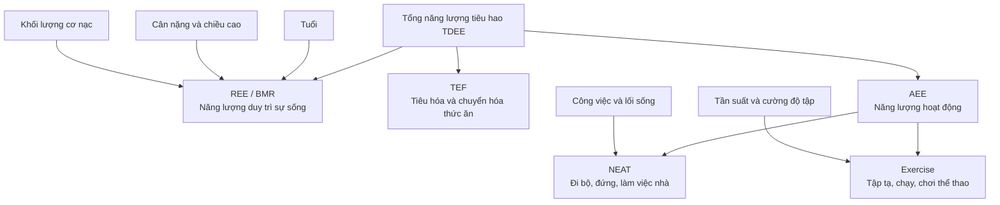
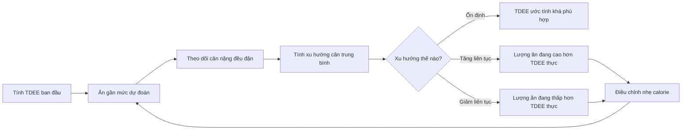

# 033 — TDEE Calculator

| Thuộc tính          | Nội dung                                                                    |
| ------------------- | --------------------------------------------------------------------------- |
| **Module**          | Module 04 — Setting Up Your Diet                                            |
| **Bài học**         | TDEE Calculator                                                             |
| **Thời lượng**      | 00:02                                                                       |
| **Chủ đề chính**    | Công cụ tính tổng năng lượng tiêu hao hằng ngày                             |
| **Tài liệu đi kèm** | TDEE Calculator — công thức BMR, hệ số hoạt động và công cụ tính trực tuyến |

## Mục lục

1. [Mục tiêu bài học](#1-mục-tiêu-bài-học)
2. [Nội dung chính](#2-nội-dung-chính)
3. [Áp dụng thực tế](#3-áp-dụng-thực-tế)
4. [Lưu ý & lỗi thường gặp](#4-lưu-ý--lỗi-thường-gặp)
5. [Checklist thực hành](#5-checklist-thực-hành)
6. [Tóm tắt](#6-tóm-tắt)

---

## 1. Mục tiêu bài học

Sau bài học này, bạn có thể:

* Hiểu **TDEE là gì** và vì sao đây là điểm khởi đầu để thiết lập chế độ ăn.
* Phân biệt các thành phần chính của tổng năng lượng tiêu hao:

  * BMR hoặc REE.
  * TEF.
  * NEAT.
  * Năng lượng tiêu hao khi tập luyện.
* Biết cách ước tính BMR bằng các công thức:

  * Harris–Benedict.
  * Mifflin–St. Jeor.
  * Katch–McArdle.
* Chọn hệ số hoạt động phù hợp để chuyển từ BMR sang TDEE.
* Hiểu rằng kết quả từ máy tính chỉ là **ước tính ban đầu**, cần được hiệu chỉnh bằng thay đổi cân nặng thực tế.

---

## 2. Nội dung chính

### 2.1. TDEE là gì?

**TDEE — Total Daily Energy Expenditure** là tổng lượng năng lượng mà cơ thể tiêu hao trong một ngày.

Tài liệu khóa học mô tả TDEE bằng cách:

1. Ước tính lượng calorie cơ thể đốt khi nghỉ ngơi — **BMR**.
2. Cộng thêm năng lượng từ vận động, tập luyện và các hoạt động hằng ngày.

Máy tính TDEE thường yêu cầu tuổi, giới tính, chiều cao, cân nặng và mức độ tập luyện. Kết quả không thể chính xác tuyệt đối vì tốc độ trao đổi chất và mức vận động thực tế khác nhau giữa từng người, nhưng có thể cung cấp một điểm khởi đầu để ước tính lượng calorie duy trì cân nặng.

> **Hiểu đơn giản:**
> TDEE là lượng calorie bạn có thể ăn mỗi ngày để cân nặng trung bình có xu hướng được duy trì, với điều kiện mức vận động không thay đổi đáng kể.

---

### 2.2. Các thành phần tạo nên TDEE

Trong nghiên cứu về chuyển hóa năng lượng, TDEE thường được biểu diễn như sau:

```text
TDEE = REE + TEF + AEE
```

Trong đó:

```text
AEE = NEAT + năng lượng từ tập luyện
```


*Hình nghiên cứu: TDEE gồm năng lượng tiêu hao khi nghỉ, hiệu ứng nhiệt của thức ăn và năng lượng hoạt động. Phần hoạt động được chia thành vận động không phải tập luyện và tập luyện có chủ đích.*

#### BMR — Basal Metabolic Rate

**BMR — tốc độ chuyển hóa cơ bản** là năng lượng tối thiểu cần thiết để duy trì các chức năng sống khi cơ thể ở trạng thái nghỉ ngơi, chẳng hạn:

* Hô hấp.
* Tuần hoàn máu.
* Hoạt động của não và hệ thần kinh.
* Duy trì nhiệt độ cơ thể.
* Hoạt động của gan, thận và các cơ quan.
* Sửa chữa và duy trì mô.

Trong thực tế, các máy tính trực tuyến đôi khi sử dụng **BMR**, **RMR** hoặc **REE** gần như thay thế cho nhau. Tuy nhiên, BMR được đo trong điều kiện nghiêm ngặt hơn, còn RMR/REE thường cao hơn một chút vì điều kiện đo ít khắt khe hơn.

#### TEF — Thermic Effect of Food

**TEF — hiệu ứng nhiệt của thức ăn** là năng lượng cơ thể sử dụng để:

* Tiêu hóa.
* Hấp thu.
* Vận chuyển.
* Chuyển hóa.
* Lưu trữ chất dinh dưỡng.

#### NEAT — Non-Exercise Activity Thermogenesis

**NEAT** là năng lượng tiêu hao từ các hoạt động không được xem là buổi tập thể dục có cấu trúc, ví dụ:

* Đi bộ trong nhà hoặc nơi làm việc.
* Đứng.
* Dọn dẹp.
* Nấu ăn.
* Đi cầu thang.
* Cử động tay chân hoặc thay đổi tư thế.
* Làm công việc chân tay.

NEAT có thể khác biệt đáng kể giữa hai người dù họ thực hiện số buổi tập giống nhau.

#### TEA hoặc AEE — năng lượng hoạt động

Tài liệu khóa học sử dụng thuật ngữ **TEA — Thermic Effect of Activity** để chỉ calorie tiêu hao khi tập luyện.

Trong tài liệu nghiên cứu, thuật ngữ thường gặp hơn là:

* **AEE — Activity Energy Expenditure**.
* **PAEE — Physical Activity Energy Expenditure**.
* **ExEE — Exercise Energy Expenditure**.

---

### 2.3. Sơ đồ tổng quát



---

### 2.4. Công thức tính BMR

Tài liệu cung cấp ba nhóm công thức phổ biến.

Ký hiệu:

| Ký hiệu | Ý nghĩa                    | Đơn vị |
| ------- | -------------------------- | ------ |
| `W`     | Cân nặng                   | kg     |
| `H`     | Chiều cao                  | cm     |
| `A`     | Tuổi                       | năm    |
| `LBM`   | Khối lượng cơ thể không mỡ | kg     |
| `BF%`   | Tỷ lệ mỡ cơ thể            | %      |

#### A. Công thức Harris–Benedict trong tài liệu

**Nữ:**

```text
BMR = 655 + 9,6 × W + 1,8 × H − 4,7 × A
```

**Nam:**

```text
BMR = 66 + 13,7 × W + 5 × H − 6,8 × A
```

Đây là phiên bản Harris–Benedict được trình bày trong tài liệu khóa học. Các công cụ hiện đại cũng có thể sử dụng phiên bản Harris–Benedict đã được hiệu chỉnh, vì vậy kết quả giữa các trang web có thể khác nhau đôi chút.

---

#### B. Công thức Mifflin–St. Jeor

**Nữ:**

```text
BMR = 10 × W + 6,25 × H − 5 × A − 161
```

**Nam:**

```text
BMR = 10 × W + 6,25 × H − 5 × A + 5
```

Công thức Mifflin–St. Jeor được xây dựng từ dữ liệu của 498 người trưởng thành khỏe mạnh. Một tổng quan so sánh các công thức dự đoán cho thấy Mifflin–St. Jeor dự đoán RMR trong phạm vi 10% so với giá trị đo được ở nhiều người hơn so với các công thức phổ biến khác. Dù vậy, đây vẫn là công thức ước tính chứ không phải phép đo trực tiếp.

**Lựa chọn thực hành:** dùng Mifflin–St. Jeor làm công thức mặc định cho phần lớn người trưởng thành khi không có kết quả đo chuyển hóa.

---

#### C. Công thức Katch–McArdle

```text
BMR = 370 + 21,6 × LBM
```

Trong đó:

```text
LBM = W × (100 − BF%) / 100
```

Ví dụ:

```text
Cân nặng     = 80 kg
Tỷ lệ mỡ     = 20%
Khối nạc LBM = 80 × (100 − 20) / 100
             = 64 kg
```

Katch–McArdle có thể hữu ích khi đã biết tương đối chính xác tỷ lệ mỡ cơ thể. Tuy nhiên, nếu tỷ lệ mỡ được ước tính sai, sai số sẽ truyền trực tiếp vào kết quả BMR.

---

### 2.5. Chuyển từ BMR sang TDEE

Sau khi tính BMR, tài liệu sử dụng công thức:

```text
TDEE = BMR × hệ số hoạt động
```

| Mức hoạt động         | Mô tả trong tài liệu                      |   Hệ số |
| --------------------- | ----------------------------------------- | ------: |
| **Ít vận động**       | Hầu như không tập, làm công việc bàn giấy |  `1,20` |
| **Hoạt động nhẹ**     | Tập nhẹ 1–3 ngày/tuần                     | `1,375` |
| **Hoạt động vừa**     | Tập mức vừa 3–5 ngày/tuần                 |  `1,55` |
| **Hoạt động cao**     | Tập nặng 6–7 ngày/tuần                    | `1,725` |
| **Hoạt động rất cao** | Lao động nặng hoặc tập hai lần/ngày       |  `1,90` |

Các hệ số trên được trình bày trong tài liệu như phương pháp đơn giản để chuyển từ BMR sang TDEE.

> **Điểm cần lưu ý:** số buổi tập không phải yếu tố duy nhất. Công việc, số bước chân, thời gian đứng và NEAT có thể khiến hai người tập cùng số buổi nhưng có TDEE rất khác nhau.

Các báo cáo khoa học cũng nhận định rằng việc phân loại chính xác mức hoạt động của một cá nhân là phần khó nhất trong quá trình dự đoán nhu cầu năng lượng; các công cụ dễ tiếp cận như số bước hoặc bảng tự khai hoạt động không phải lúc nào cũng tương quan mạnh với mức tiêu hao đo bằng phương pháp nghiên cứu.

---

### 2.6. Đo TDEE trong nghiên cứu

Công thức chỉ **dự đoán** năng lượng tiêu hao. Trong nghiên cứu hoặc môi trường lâm sàng, các phương pháp đo có thể bao gồm:

* **Đo nhiệt lượng gián tiếp:** đo lượng oxy tiêu thụ và carbon dioxide tạo ra để tính năng lượng tiêu hao.
* **Buồng chuyển hóa:** đo tiêu hao năng lượng trong môi trường được kiểm soát.
* **Nước đánh dấu kép — Doubly Labeled Water:** được dùng để đo tổng năng lượng tiêu hao trong điều kiện sinh hoạt tự do.


*Ảnh minh họa phép đo nhiệt lượng gián tiếp bằng canopy hood. Thiết bị phân tích oxy tiêu thụ và carbon dioxide thải ra để ước tính mức tiêu hao năng lượng khi nghỉ.*

Đo nhiệt lượng gián tiếp thường được sử dụng để xác định REE trong điều kiện phòng thí nghiệm. Với tổng năng lượng tiêu hao ngoài đời thực, nước đánh dấu kép được xem là phương pháp tham chiếu quan trọng.

---

## 3. Áp dụng thực tế

### 3.1. Sử dụng công cụ tính trực tuyến

Tài liệu khóa học giới thiệu:

* [FreeDieting Calorie Calculator](https://www.freedieting.com/calorie-calculator)

Công cụ hiện cho phép nhập:

* Tuổi.

* Giới tính.

* Cân nặng.

* Chiều cao.

* Mức tập luyện.

* Công thức Mifflin–St. Jeor, Katch–McArdle hoặc Harris–Benedict.
  Một công cụ khác dựa trên mô hình nghiên cứu của NIH:

* [NIH Body Weight Planner](https://www.niddk.nih.gov/bwp)

Công cụ NIH cho phép mô phỏng lượng calorie và thay đổi hoạt động để đạt cũng như duy trì cân nặng mục tiêu. Công cụ được thiết kế cho người trưởng thành, không dành cho người dưới 18 tuổi, người mang thai hoặc đang cho con bú.

---

### 3.2. Ví dụ tính TDEE

Giả sử một người có thông tin:

| Thông tin |              Giá trị |
| --------- | -------------------: |
| Giới tính |                  Nam |
| Tuổi      |                   25 |
| Cân nặng  |                70 kg |
| Chiều cao |               175 cm |
| Hoạt động | Mức vừa — hệ số 1,55 |

#### Bước 1: Tính BMR bằng Mifflin–St. Jeor

```text
BMR = 10 × 70 + 6,25 × 175 − 5 × 25 + 5
    = 1.673,75 kcal/ngày
```

Làm tròn:

```text
BMR ≈ 1.674 kcal/ngày
```

#### Bước 2: Nhân với hệ số hoạt động

```text
TDEE = 1.673,75 × 1,55
     = 2.594,31 kcal/ngày
```

Làm tròn:

```text
TDEE ≈ 2.590–2.600 kcal/ngày
```

Kết quả này có nghĩa là mức calorie duy trì **ước tính ban đầu** nằm quanh 2.600 kcal/ngày, chứ không khẳng định chính xác cơ thể sẽ tiêu hao đúng 2.600 kcal mỗi ngày.

---

### 3.3. Quy trình hiệu chỉnh TDEE thực tế

Đây là quy trình thực hành mở rộng, không phải con số cứng trong PDF:



#### Cách thực hiện

1. Chọn kết quả TDEE từ máy tính làm mức khởi đầu.
2. Giữ lượng calorie và mức hoạt động tương đối ổn định.
3. Cân vào cùng thời điểm, ưu tiên buổi sáng sau khi đi vệ sinh.
4. Theo dõi **xu hướng trung bình**, không phản ứng với một lần cân riêng lẻ.
5. Điều chỉnh calorie từng bước nhỏ dựa trên xu hướng thực tế.

Các khuyến nghị năng lượng hiện đại cũng xem việc lập kế hoạch là quá trình hai bước: tính nhu cầu dự kiến, sau đó theo dõi cân nặng theo thời gian và điều chỉnh lượng năng lượng khi cần thiết. Nhu cầu thực có thể cao hoặc thấp hơn giá trị công thức ngay cả khi hai người có cùng tuổi, chiều cao, cân nặng và mức hoạt động được khai báo.

---

### 3.4. Chuyển TDEE thành mục tiêu ăn uống

| Mục tiêu                  | Cách tiếp cận cơ bản                                     |
| ------------------------- | -------------------------------------------------------- |
| **Duy trì cân nặng**      | Bắt đầu gần TDEE                                         |
| **Giảm mỡ**               | Ăn thấp hơn TDEE một mức vừa phải                        |
| **Tăng cân hoặc tăng cơ** | Ăn cao hơn TDEE một mức vừa phải                         |
| **Tái cấu trúc cơ thể**   | Ăn gần mức duy trì, tập kháng lực và cung cấp đủ protein |

TDEE không phải là “mức calorie giảm cân”. Nó là mức **duy trì ước tính**. Thâm hụt hoặc thặng dư được áp dụng sau khi đã xác định điểm duy trì.

---

## 4. Lưu ý & lỗi thường gặp

### 4.1. Xem kết quả máy tính như con số tuyệt đối

Sai:

```text
Máy tính cho kết quả 2.500 kcal
→ Cơ thể chắc chắn đốt đúng 2.500 kcal mỗi ngày.
```

Đúng hơn:

```text
2.500 kcal là giả thuyết ban đầu
→ cần kiểm chứng bằng xu hướng cân nặng thực tế.
```

Công thức dự đoán có sai số cá nhân và không thể phản ánh hoàn toàn di truyền, thành phần cơ thể, nội tiết, tình trạng sức khỏe hoặc mức NEAT.

---

### 4.2. Chọn hệ số hoạt động quá cao

Một người tập tạ 4 buổi mỗi tuần nhưng:

* Làm việc bàn giấy.
* Di chuyển rất ít.
* Chỉ tập khoảng 45–60 phút.
* Ngồi hoặc nằm phần lớn thời gian còn lại.

Người này chưa chắc thuộc mức `1,55`. Có thể hợp lý hơn khi bắt đầu bằng `1,375`, sau đó hiệu chỉnh theo cân nặng.

> Khi phân vân giữa hai mức, chọn mức thấp hơn thường giúp tránh đánh giá quá cao TDEE.

---

### 4.3. Chỉ tính buổi tập mà bỏ qua NEAT

Hai người cùng tập 4 buổi/tuần:

| Người A           | Người B                  |
| ----------------- | ------------------------ |
| 3.000 bước/ngày   | 12.000 bước/ngày         |
| Làm việc bàn giấy | Công việc phải di chuyển |
| Ngồi nhiều        | Đứng và đi lại nhiều     |

TDEE của người B có thể cao hơn đáng kể dù lịch tập giống nhau, vì phần năng lượng hoạt động ngoài buổi tập khác nhau.

---

### 4.4. Cộng calorie tập luyện hai lần

Ví dụ:

1. Chọn hệ số hoạt động `1,55`, nghĩa là tập luyện đã được đưa vào TDEE.
2. Sau đó lại cộng toàn bộ “calorie đã đốt” từ đồng hồ vào khẩu phần.

Việc này có thể làm năng lượng tập luyện bị tính hai lần. Trang calculator trong tài liệu cũng lưu ý rằng khi mức tập đã được đưa vào phép tính, người dùng không cần tự động cộng lại calorie của từng buổi tập.

---

### 4.5. Tin hoàn toàn vào calorie từ đồng hồ thông minh

Thiết bị đeo có thể hữu ích để:

* Theo dõi bước chân.
* So sánh mức hoạt động giữa các ngày.
* Theo dõi nhịp tim.
* Tạo động lực vận động.

Tuy nhiên, calorie hiển thị không nên được coi là phép đo chính xác tuyệt đối. Trong nghiên cứu, đo năng lượng tiêu hao cần các phương pháp như nhiệt lượng gián tiếp hoặc nước đánh dấu kép; các cảm biến tiêu dùng chỉ cung cấp giá trị ước tính.

---

### 4.6. Không tính lại sau khi cơ thể thay đổi

TDEE có thể thay đổi khi:

* Cân nặng giảm hoặc tăng.
* Khối lượng cơ thay đổi.
* Số bước chân thay đổi.
* Chuyển từ công việc vận động sang công việc văn phòng.
* Tăng hoặc giảm số buổi tập.
* Cường độ luyện tập thay đổi.

Vì vậy, cần tính lại hoặc hiệu chỉnh khi cân nặng và lối sống đã thay đổi đáng kể.

---

### 4.7. Dùng Katch–McArdle với tỷ lệ mỡ không đáng tin cậy

Sai số đo mỡ từ:

* Cân điện trở sinh học.
* Quan sát bằng mắt.
* Máy cầm tay.
* Thước kẹp không đúng kỹ thuật.

có thể khiến khối lượng nạc và BMR tính theo Katch–McArdle sai lệch. Trong trường hợp không biết tỷ lệ mỡ đáng tin cậy, Mifflin–St. Jeor thường là lựa chọn đơn giản hơn.

---

### 4.8. Áp dụng máy tính thông thường cho mọi đối tượng

Cần thận trọng hoặc hỏi chuyên gia khi người dùng:

* Dưới 18 tuổi.
* Mang thai hoặc cho con bú.
* Có bệnh tuyến giáp hoặc bệnh chuyển hóa.
* Đang dùng thuốc ảnh hưởng đến cân nặng hoặc trao đổi chất.
* Có tiền sử rối loạn ăn uống.
* Là vận động viên có khối lượng tập rất cao.
* Đang hồi phục sau phẫu thuật hoặc bệnh nặng.

Các công cụ phổ thông được thiết kế chủ yếu để định hướng cho người trưởng thành khỏe mạnh, không thay thế đánh giá y khoa hoặc dinh dưỡng cá nhân.

---

## 5. Checklist thực hành

### Thông tin đầu vào

* [ ] Đã nhập đúng giới tính theo yêu cầu của công thức.
* [ ] Đã chuyển cân nặng sang kilogram.
* [ ] Đã chuyển chiều cao sang centimet.
* [ ] Đã nhập đúng tuổi.
* [ ] Không nhầm giữa kilogram và pound.
* [ ] Không nhầm giữa centimet và inch.

### Chọn công thức

* [ ] Dùng Mifflin–St. Jeor nếu không biết tỷ lệ mỡ đáng tin cậy.
* [ ] Chỉ dùng Katch–McArdle khi có ước tính tỷ lệ mỡ tương đối tốt.
* [ ] Ghi lại công thức đã sử dụng để dễ so sánh về sau.

### Chọn mức hoạt động

* [ ] Đã tính cả công việc và sinh hoạt hằng ngày.
* [ ] Đã xem xét số bước chân trung bình.
* [ ] Không chỉ dựa vào số buổi tập.
* [ ] Không cố chọn hệ số cao để được ăn nhiều hơn.
* [ ] Khi phân vân, bắt đầu bằng mức bảo thủ hơn.

### Kiểm chứng kết quả

* [ ] Xem TDEE là điểm khởi đầu, không phải con số tuyệt đối.
* [ ] Giữ lượng calorie tương đối ổn định trong giai đoạn đánh giá.
* [ ] Theo dõi xu hướng cân nặng thay vì một ngày riêng lẻ.
* [ ] Điều chỉnh calorie dựa trên kết quả thực tế.
* [ ] Tính lại khi cân nặng hoặc mức vận động thay đổi đáng kể.

---

## 6. Tóm tắt

```text
TDEE = tổng năng lượng cơ thể tiêu hao trong một ngày
```

TDEE bao gồm:

```text
Năng lượng khi nghỉ
+ Hiệu ứng nhiệt của thức ăn
+ Hoạt động không phải tập luyện
+ Tập luyện có chủ đích
```

Cách tính đơn giản trong tài liệu:

```text
Bước 1: Ước tính BMR
Bước 2: Chọn hệ số hoạt động
Bước 3: TDEE = BMR × hệ số hoạt động
Bước 4: Theo dõi cân nặng và hiệu chỉnh
```

Ba công thức được giới thiệu:

```text
Harris–Benedict
Mifflin–St. Jeor
Katch–McArdle
```

Thông điệp quan trọng nhất:

> **Máy tính TDEE tạo ra một giả thuyết hợp lý để bắt đầu. Xu hướng cân nặng và mức hoạt động thực tế mới là dữ liệu giúp xác định TDEE cá nhân chính xác hơn.**

---

# Bài luyện tập

## Mục tiêu


## Đề bài


## Yêu cầu hoàn thành

- [ ] 
- [ ] 
- [ ] 

## Kết quả / lời giải


## Ghi chú
