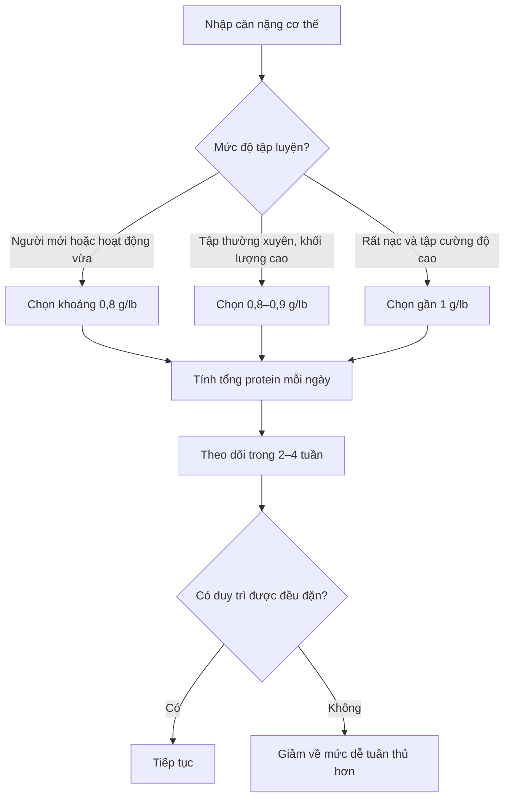
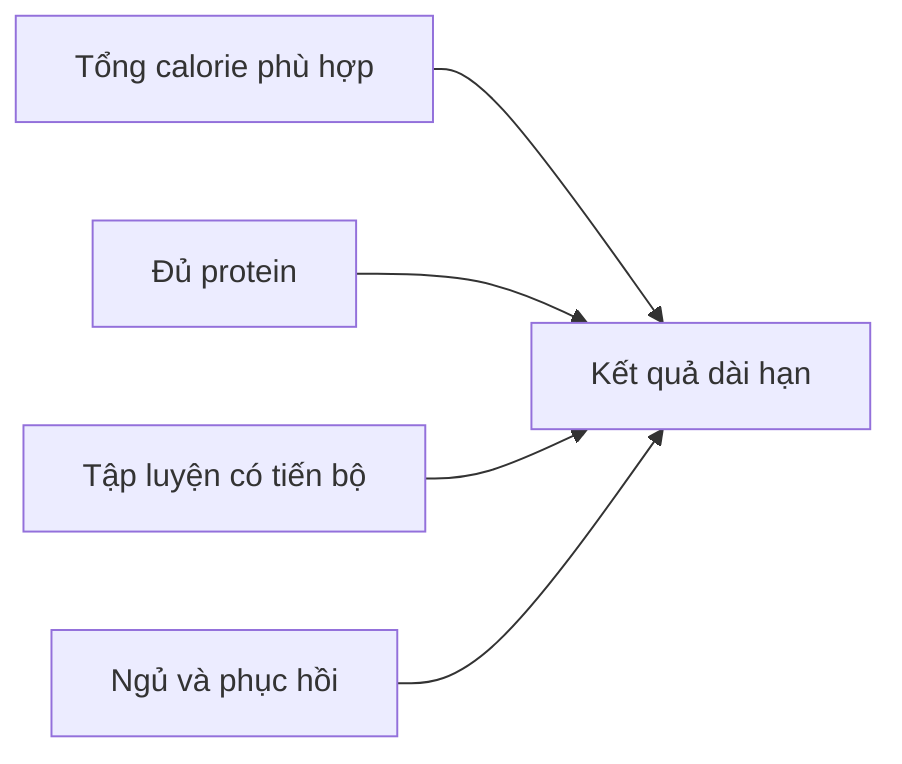

[](https://www.mdpi.com/2072-6643/17/2/211?utm_source=chatgpt.com)

# 035 — Finding Your Ideal Protein Intake

## Xác định lượng protein lý tưởng

| Thuộc tính                  | Nội dung                                   |
| --------------------------- | ------------------------------------------ |
| **Module**                  | Module 04 — Setting Up Your Diet           |
| **Bài học**                 | Finding Your Ideal Protein Intake          |
| **Thời lượng**              | 01:20                                      |
| **Chủ đề chính**            | Xác định lượng protein lý tưởng            |
| **Mức tham khảo trong bài** | 0,8–1 g protein/lb trọng lượng cơ thể/ngày |
| **Quy đổi**                 | Khoảng 1,76–2,2 g/kg/ngày                  |


*Nguồn ảnh: [Protein-rich Foods — Wikimedia Commons](https://commons.wikimedia.org/wiki/File:Protein-rich_Foods.jpg).*

---

## Mục lục

1. [Mục tiêu bài học](#1-mục-tiêu-bài-học)
2. [Nội dung chính](#2-nội-dung-chính)
3. [Áp dụng thực tế](#3-áp-dụng-thực-tế)
4. [Lưu ý và lỗi thường gặp](#4-lưu-ý-và-lỗi-thường-gặp)
5. [Checklist thực hành](#5-checklist-thực-hành)
6. [Tóm tắt](#6-tóm-tắt)
7. [Đối chiếu với nghiên cứu](#7-đối-chiếu-với-nghiên-cứu)

---

## 1. Mục tiêu bài học

Sau bài học này, bạn có thể:

* Tính được lượng protein mục tiêu dựa trên trọng lượng cơ thể.
* Biết cách quy đổi giữa pound và kilogram.
* Hiểu vì sao tỷ lệ mỡ và mức độ hoạt động có thể ảnh hưởng đến nhu cầu protein.
* Biết khi nào nên chọn đầu thấp hoặc đầu cao của khoảng protein.
* Tránh đặt mục tiêu protein quá cao một cách không cần thiết.

---

## 2. Nội dung chính

### 2.1. Protein là macro được xác định đầu tiên

Khi thiết lập chế độ ăn, protein thường được tính trước carbohydrate và chất béo vì protein có vai trò quan trọng trong:

* Duy trì và phát triển khối cơ.
* Phục hồi sau tập luyện.
* Cung cấp các amino acid thiết yếu.
* Hỗ trợ bảo toàn khối nạc khi giảm cân.

Theo nội dung bài học, lượng protein tối ưu nằm trong khoảng:

```text
0,8–1 g protein trên mỗi pound trọng lượng cơ thể mỗi ngày
```

Quy đổi sang kilogram:

```text
0,8 g/lb ≈ 1,76 g/kg
1,0 g/lb ≈ 2,20 g/kg
```

Công thức:

```text
Protein tối thiểu = cân nặng (kg) × 1,76
Protein đầu trên  = cân nặng (kg) × 2,20
```

> Có thể làm tròn thành khoảng **1,8–2,2 g protein/kg/ngày** để dễ tính.

---

### 2.2. Ví dụ trong bài học: người nặng 180 lb

Một người nam nặng **180 lb**:

```text
Mức thấp = 180 × 0,8 = 144 g protein/ngày
Mức cao  = 180 × 1,0 = 180 g protein/ngày
```

Như vậy, khoảng protein mục tiêu là:

```text
Khoảng 145–180 g protein/ngày
```

Nếu đây là người mới tập, mức khoảng **145 g/ngày** thường đã đáp ứng mục tiêu của bài học.

> Bản chép lời có cụm “180 percent male”, nhưng theo ngữ cảnh phải hiểu là **180-pound male — người nam nặng 180 lb**.

---

### 2.3. Hai yếu tố quyết định vị trí trong khoảng protein

Bài học đề cập hai yếu tố chính:

#### Yếu tố 1: Tỷ lệ mỡ cơ thể

Người có tỷ lệ mỡ thấp thường có nhiều khối nạc hơn so với tổng trọng lượng cơ thể. Vì vậy, nhu cầu protein liên quan đến việc duy trì và phục hồi mô cơ có thể cao hơn.

Theo bài học:

* Nam dưới khoảng **10% mỡ cơ thể**.
* Nữ dưới khoảng **20% mỡ cơ thể**.

Nếu đồng thời tập luyện cường độ cao, có thể chọn gần đầu trên của khoảng protein.

#### Yếu tố 2: Mức độ hoạt động

Nhu cầu protein có xu hướng tăng khi tổng mức vận động tăng, chẳng hạn:

* Tập tạ nhiều buổi mỗi tuần.
* Khối lượng tập lớn.
* Chơi thể thao thường xuyên.
* Làm công việc cần vận động thể chất.
* Đang trong giai đoạn giảm calorie nhưng muốn giữ cơ.

ISSN cho rằng khoảng **1,4–2,0 g/kg/ngày** đáp ứng nhu cầu của phần lớn người tập luyện; mức cao hơn có thể hữu ích trong một số giai đoạn giảm calorie hoặc với người tập có khối lượng vận động cao. ([PubMed][1])

---

### 2.4. Cách lựa chọn mức protein

| Tình trạng                                       |           Mức lựa chọn theo bài học |
| ------------------------------------------------ | ----------------------------------: |
| Người mới tập, hoạt động vừa phải                |                 Khoảng **0,8 g/lb** |
| Tập luyện thường xuyên, khối lượng tương đối cao |             Khoảng **0,8–0,9 g/lb** |
| Rất nạc và tập cường độ cao                      |                      Gần **1 g/lb** |
| Đang giảm calorie và ưu tiên giữ cơ              |                 Nghiêng về đầu trên |
| Ít vận động hoặc chưa tập luyện                  | Không nhất thiết phải dùng đầu trên |

### Sơ đồ lựa chọn nhanh



---

### 2.5. Protein và quá trình xây dựng cơ bắp


*Nguồn ảnh nghiên cứu: [Resistance exercise-induced muscle protein synthesis — Wikimedia Commons](https://commons.wikimedia.org/wiki/File:Resistance_exercise-induced_muscle_protein_synthesis.jpg).*

Tập kháng lực tạo ra tín hiệu thích nghi trong cơ. Protein cung cấp amino acid để cơ thể sửa chữa và xây dựng mô cơ mới. Tập luyện và cung cấp protein vì vậy có tác dụng bổ trợ cho nhau. ([SpringerLink][2])

Tuy nhiên, điều này không có nghĩa rằng càng ăn nhiều protein thì cơ càng tăng nhanh. Khi tổng protein đã đạt mức đáp ứng nhu cầu, việc tiếp tục tăng protein thường tạo ra ít lợi ích bổ sung hơn.

---

## 3. Áp dụng thực tế

### 3.1. Bảng tính protein theo cân nặng

| Cân nặng | Mức 1,76 g/kg | Mức 2,0 g/kg | Mức 2,2 g/kg |
| -------: | ------------: | -----------: | -----------: |
|    50 kg |          88 g |        100 g |        110 g |
|    55 kg |          97 g |        110 g |        121 g |
|    60 kg |         106 g |        120 g |        132 g |
|    65 kg |         114 g |        130 g |        143 g |
|    70 kg |         123 g |        140 g |        154 g |
|    75 kg |         132 g |        150 g |        165 g |
|    80 kg |         141 g |        160 g |        176 g |
|    85 kg |         150 g |        170 g |        187 g |
|    90 kg |         158 g |        180 g |        198 g |

### Công thức tự tính

```text
Cân nặng 70 kg:

Mức cơ bản:
70 × 1,76 = 123,2 g/ngày

Mức trung gian:
70 × 2,0 = 140 g/ngày

Mức đầu trên:
70 × 2,2 = 154 g/ngày
```

Một người mới tập nặng 70 kg có thể bắt đầu ở khoảng:

```text
125–140 g protein/ngày
```

Không nhất thiết phải cố đạt 154 g ngay từ đầu.

---

### 3.2. Chia protein vào các bữa ăn

Ví dụ mục tiêu **145 g protein/ngày**:

| Bữa ăn       | Protein mục tiêu |
| ------------ | ---------------: |
| Bữa sáng     |             30 g |
| Bữa trưa     |             40 g |
| Bữa phụ      |             25 g |
| Bữa tối      |             40 g |
| Bữa phụ khác |             10 g |
| **Tổng**     |        **145 g** |

Hoặc chia đơn giản thành bốn bữa:

```text
145 ÷ 4 ≈ 36 g protein mỗi bữa
```

ISSN đưa ra mức tham khảo khoảng **20–40 g protein chất lượng cao mỗi lần ăn**, hoặc khoảng **0,25 g/kg mỗi bữa**, tùy cân nặng, tuổi và buổi tập gần nhất. ([SpringerLink][2])

---

### 3.3. Ví dụ nguồn thực phẩm

| Thực phẩm       | Khẩu phần minh họa | Protein ước tính |
| --------------- | -----------------: | ---------------: |
| Ức gà chín      |              150 g |   Khoảng 40–45 g |
| Cá              |              150 g |   Khoảng 30–35 g |
| Thịt bò nạc     |              150 g |   Khoảng 35–40 g |
| Trứng           |              3 quả |   Khoảng 18–21 g |
| Sữa chua Hy Lạp |              200 g |   Khoảng 18–22 g |
| Đậu phụ         |              200 g |   Khoảng 16–24 g |
| Whey protein    |        1 khẩu phần |   Khoảng 20–25 g |

Các con số thực tế thay đổi tùy sản phẩm, phần thịt, phương pháp chế biến và nhãn dinh dưỡng. Vì vậy, khi theo dõi calorie và macro, nên nhập đúng khối lượng cũng như trạng thái sống hoặc chín của thực phẩm.

---

### 3.4. Mẫu thực đơn khoảng 145 g protein

| Bữa ăn   | Thực phẩm                              | Protein ước tính |
| -------- | -------------------------------------- | ---------------: |
| Sáng     | 3 quả trứng, sữa chua Hy Lạp           |             35 g |
| Trưa     | Cơm, 150 g ức gà, rau                  |             45 g |
| Bữa phụ  | 1 khẩu phần whey hoặc sữa giàu protein |             25 g |
| Tối      | Cơm, 180 g cá hoặc thịt nạc, rau       |             40 g |
| **Tổng** |                                        |        **145 g** |

Protein powder chỉ là công cụ tiện lợi để bổ sung phần còn thiếu. Nó không bắt buộc nếu chế độ ăn thông thường đã cung cấp đủ protein.

---

## 4. Lưu ý và lỗi thường gặp

### 4.1. Nhầm đơn vị pound với kilogram

Sai:

```text
70 kg × 0,8 = 56 g
```

Công thức **0,8 g** trong bài được tính trên mỗi **pound**, không phải mỗi kilogram.

Đúng:

```text
70 kg ≈ 154 lb
154 × 0,8 ≈ 123 g protein
```

Hoặc tính trực tiếp:

```text
70 × 1,76 ≈ 123 g protein
```

---

### 4.2. Nghĩ rằng bắt buộc phải đạt 1 g/lb

Mức **1 g/lb**, tương đương khoảng **2,2 g/kg**, là đầu trên của khoảng trong bài học, không phải mức tối thiểu bắt buộc.

Phân tích tổng hợp của Morton và cộng sự phát hiện lợi ích tăng cơ từ protein có xu hướng chững lại quanh tổng lượng khoảng **1,6 g/kg/ngày** đối với người trưởng thành khỏe mạnh tập kháng lực. Vì có khác biệt cá nhân, một số người có thể lựa chọn mức cao hơn như một khoảng dự phòng. ([British Journal of Sports Medicine][3])

---

### 4.3. Chọn mức cao nhất dù mới bắt đầu

Người mới tập thường không cần bắt đầu ngay tại đầu trên. Mức thấp hơn nhưng duy trì đều đặn thường thực tế hơn:

```text
Mục tiêu phù hợp và duy trì được
>
Mục tiêu rất cao nhưng thường xuyên không đạt
```

---

### 4.4. Chỉ tính protein từ thịt và whey

Protein còn xuất hiện trong:

* Trứng và sữa.
* Đậu phụ, đậu nành và các loại đậu.
* Bánh mì, yến mạch và ngũ cốc.
* Hạt và bơ hạt.
* Mì, cơm và một số loại rau.

Khi dùng ứng dụng theo dõi dinh dưỡng, tổng protein thường bao gồm protein từ tất cả thực phẩm đã nhập.

---

### 4.5. Bỏ qua tổng calorie

Protein không thể hoàn toàn bù đắp cho một kế hoạch calorie không phù hợp.



Muốn tăng cơ hoặc giữ cơ hiệu quả, cần kết hợp:

* Protein phù hợp.
* Tổng calorie phù hợp mục tiêu.
* Tập kháng lực có tiến bộ.
* Ngủ và phục hồi đầy đủ.

---

### 4.6. Dùng cân nặng thực tế một cách máy móc

Với người có tỷ lệ mỡ cơ thể cao, lấy cân nặng thực tế nhân với đầu trên **2,2 g/kg** có thể tạo ra một mục tiêu rất lớn và khó thực hiện.

Một cách thực tế hơn là:

* Bắt đầu ở đầu thấp của khoảng.
* Tính theo cân nặng mục tiêu hợp lý.
* Hoặc sử dụng khối lượng nạc khi có số đo đáng tin cậy.

Đây là điều chỉnh thực hành; không nên nhầm với khuyến nghị dành cho vận động viên rất nạc đang giảm calorie, vốn có thể được tính theo khối lượng không mỡ. ([PubMed][4])

---

### 4.7. Trường hợp cần tư vấn chuyên môn

Người đã được chẩn đoán bệnh thận không nên tự áp dụng chế độ protein cao. Nhu cầu protein có thể khác nhau đáng kể tùy giai đoạn bệnh và việc có chạy thận hay không, vì vậy cần trao đổi với bác sĩ hoặc chuyên gia dinh dưỡng thận. ([Viện Quốc gia về Bệnh Tiểu đường và Thận][5])

---

## 5. Checklist thực hành

* [ ] Ghi lại cân nặng hiện tại.
* [ ] Xác định đang dùng đơn vị kilogram hay pound.
* [ ] Tính mức cơ bản bằng `cân nặng kg × 1,76`.
* [ ] Chỉ chọn gần `2,2 g/kg` nếu có lý do phù hợp.
* [ ] Đánh giá mức độ tập luyện và tổng hoạt động hằng ngày.
* [ ] Chia mục tiêu protein thành 3–5 bữa dễ thực hiện.
* [ ] Lập danh sách các nguồn protein thường xuyên sử dụng.
* [ ] Kiểm tra nhãn dinh dưỡng và cân thực phẩm đúng trạng thái.
* [ ] Theo dõi mức trung bình trong nhiều ngày, không chỉ một ngày riêng lẻ.
* [ ] Điều chỉnh mục tiêu nếu cảm thấy quá khó duy trì.
* [ ] Không để việc tăng protein làm tổng calorie vượt xa kế hoạch.
* [ ] Ưu tiên tính nhất quán thay vì cố đạt con số hoàn hảo.

---

## 6. Tóm tắt

> **Công thức của bài học:**
> Protein mỗi ngày ≈ **0,8–1 g/lb**, tương đương khoảng **1,76–2,2 g/kg trọng lượng cơ thể**.

* Người mới tập thường có thể bắt đầu gần **0,8 g/lb**.
* Người rất nạc, hoạt động nhiều và tập cường độ cao có thể chọn gần **1 g/lb**.
* Người nặng 180 lb sẽ có mục tiêu khoảng **145–180 g protein/ngày**.
* Không bắt buộc phải chọn mức cao nhất.
* Tổng lượng protein cả ngày quan trọng hơn việc đạt một con số tuyệt đối trong từng bữa.
* Mức tốt nhất là mức đủ cao để hỗ trợ mục tiêu nhưng vẫn phù hợp với calorie, ngân sách và khả năng duy trì.

### Công thức ghi nhớ

```text
Người mới tập:
Cân nặng kg × 1,76

Tập luyện nhiều hoặc muốn có khoảng dự phòng:
Cân nặng kg × 2,0

Rất nạc, tập cường độ cao hoặc đang cắt calorie:
Có thể cân nhắc đến khoảng cân nặng kg × 2,2
```

---

## 7. Đối chiếu với nghiên cứu

Nội dung bài học đưa ra khoảng **1,76–2,2 g/kg/ngày**. Đây là khoảng tương đối cao nhưng hợp lý cho người tập tạ muốn đơn giản hóa việc thiết lập macro.

Một số điểm cần hiểu thêm:

1. ISSN cho rằng khoảng **1,4–2,0 g/kg/ngày** thường đủ cho phần lớn người tập luyện. ([PubMed][1])
2. Phân tích tổng hợp về tập kháng lực cho thấy lợi ích trung bình có xu hướng chững lại quanh **1,6 g/kg/ngày**. ([British Journal of Sports Medicine][3])
3. Người rất nạc đang giảm calorie có thể cần mức cao hơn để bảo toàn khối nạc; một số nghiên cứu biểu diễn nhu cầu này theo kilogram khối lượng không mỡ. ([PubMed][4])
4. Vì vậy, mức **0,8 g/lb** trong bài có thể xem là mục tiêu thực tế với khoảng dự phòng, còn **1 g/lb** là đầu trên dành cho những hoàn cảnh cụ thể hơn.

### Kết luận thực hành

```text
Phần lớn người mới tập:
1,6–1,8 g/kg/ngày thường là điểm bắt đầu hợp lý.

Muốn bám sát công thức của khóa học:
Sử dụng khoảng 1,76 g/kg/ngày.

Rất nạc, tập nhiều hoặc đang giảm calorie:
Có thể nghiêng dần về 2,0–2,2 g/kg/ngày.
```

[1]: https://pubmed.ncbi.nlm.nih.gov/28642676/?utm_source=chatgpt.com "International Society of Sports Nutrition Position Stand: protein and ..."
[2]: https://jissn.biomedcentral.com/articles/10.1186/s12970-017-0177-8?utm_source=chatgpt.com "International Society of Sports Nutrition Position Stand: protein ..."
[3]: https://bjsm.bmj.com/content/52/6/376?utm_source=chatgpt.com "A systematic review, meta-analysis and meta-regression ..."
[4]: https://pubmed.ncbi.nlm.nih.gov/24092765/?utm_source=chatgpt.com "A systematic review of dietary protein during caloric restriction in ..."
[5]: https://www.niddk.nih.gov/health-information/kidney-disease/chronic-kidney-disease-ckd/healthy-eating-adults-chronic-kidney-disease?utm_source=chatgpt.com "Healthy Eating for Adults with Chronic Kidney Disease - NIDDK"
