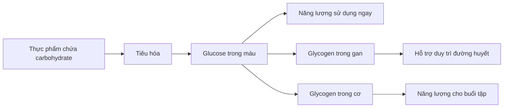
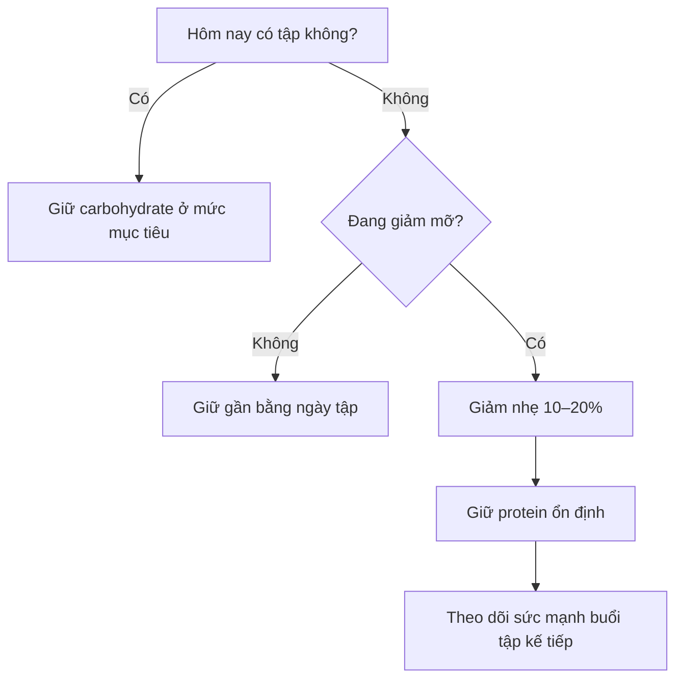
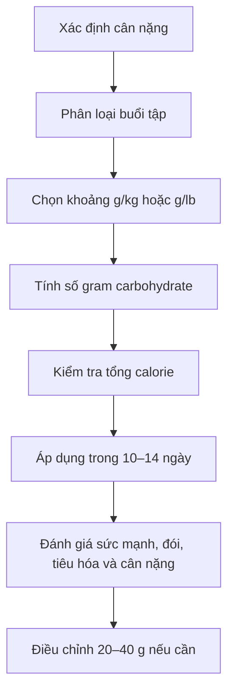

# 036 — Xác Định Lượng Carbohydrate Lý Tưởng

| Thuộc tính       | Nội dung                                                                     |
| ---------------- | ---------------------------------------------------------------------------- |
| **Module**       | Module 04 — Setting Up Your Diet                                             |
| **Bài học**      | Finding Your Ideal Carb Intake                                               |
| **Thời lượng**   | 01:32                                                                        |
| **Chủ đề chính** | Xác định lượng carbohydrate lý tưởng dựa trên cân nặng và cường độ tập luyện |


*Hình 1. Các nguồn carbohydrate và thực phẩm toàn phần như ngũ cốc, bánh mì, khoai, đậu, trái cây và rau củ. Ảnh của National Cancer Institute, thuộc phạm vi công cộng.* ([Wikimedia Commons][1])

---

## Mục lục

1. [Mục tiêu bài học](#1-mục-tiêu-bài-học)
2. [Nội dung chính](#2-nội-dung-chính)
3. [Áp dụng thực tế](#3-áp-dụng-thực-tế)
4. [Lưu ý và lỗi thường gặp](#4-lưu-ý-và-lỗi-thường-gặp)
5. [Checklist thực hành](#5-checklist-thực-hành)
6. [Tóm tắt](#6-tóm-tắt)
7. [Tài liệu và hình ảnh tham khảo](#7-tài-liệu-và-hình-ảnh-tham-khảo)

---

## 1. Mục tiêu bài học

Sau bài học này, người học có thể:

* Hiểu vì sao lượng carbohydrate nên thay đổi theo **cân nặng, thời lượng và cường độ tập luyện**.
* Phân loại buổi tập thành ba mức: **nhẹ, trung bình và nặng**.
* Tính lượng carbohydrate khởi điểm bằng đơn vị:

  * gram trên pound cân nặng;
  * gram trên kilogram cân nặng.
* Tính được lượng carbohydrate cho ví dụ một người nặng **180 lb — khoảng 82 kg**.
* Biết cách xử lý carbohydrate vào **ngày tập** và **ngày nghỉ**.
* Biết điều chỉnh lượng carbohydrate dựa trên:

  * hiệu suất tập luyện;
  * cảm giác phục hồi;
  * khả năng tiêu hóa;
  * mục tiêu giảm mỡ hoặc tăng cơ;
  * tổng lượng calorie hằng ngày.

> **Ý tưởng trung tâm:** Không tồn tại một con số carbohydrate hoàn hảo cho tất cả mọi người. Hãy chọn một mức khởi điểm hợp lý, theo dõi phản ứng của cơ thể rồi điều chỉnh.

---

## 2. Nội dung chính

### 2.1. Yếu tố quan trọng nhất: cường độ tập luyện

Nhu cầu carbohydrate hằng ngày chịu ảnh hưởng bởi nhiều yếu tố:

* Cân nặng cơ thể.
* Tổng lượng calorie.
* Mục tiêu giảm mỡ, duy trì hay tăng cơ.
* Số buổi tập mỗi tuần.
* Thời lượng buổi tập.
* Số hiệp tập thực sự.
* Cường độ và tổng khối lượng vận động.
* Mức độ vận động ngoài phòng tập.
* Khả năng tiêu hóa và đáp ứng cá nhân.

Trong phạm vi bài học, yếu tố được nhấn mạnh nhiều nhất là **cường độ tập luyện**.

Buổi tập càng dài, càng nhiều hiệp và càng đòi hỏi nỗ lực cao thì nhu cầu sử dụng glycogen và carbohydrate thường càng lớn. Các hướng dẫn dinh dưỡng thể thao cũng nhấn mạnh rằng nhu cầu carbohydrate cần được điều chỉnh theo khối lượng và yêu cầu của từng chương trình tập, thay vì áp dụng một con số cố định cho mọi vận động viên. ([PubMed][2])

---

### 2.2. Vì sao carbohydrate quan trọng khi tập luyện?

Carbohydrate trong thực phẩm được tiêu hóa thành các đường đơn, chủ yếu là glucose. Glucose có thể:

1. Được sử dụng ngay để tạo năng lượng.
2. Được lưu trữ dưới dạng **glycogen trong gan**.
3. Được lưu trữ dưới dạng **glycogen trong cơ**.
4. Được huy động khi cơ thể cần năng lượng cho vận động.

Glucose là một nguồn năng lượng quan trọng đối với tế bào, mô và cơ quan; phần chưa cần sử dụng ngay có thể được dự trữ trong gan và cơ dưới dạng glycogen. ([MedlinePlus][3])


*Hình 2. Carbohydrate được tiêu hóa, chuyển thành glucose rồi được sử dụng hoặc dự trữ dưới dạng glycogen trong gan và cơ. Sơ đồ của Mikael Häggström, thuộc phạm vi công cộng.* ([Wikimedia Commons][4])



Khi tập luyện với cường độ hoặc khối lượng cao, carbohydrate trở thành một nguồn nhiên liệu đặc biệt hữu ích. Việc bảo đảm đủ năng lượng và carbohydrate giúp hỗ trợ hiệu suất, phục hồi và bổ sung glycogen sau vận động. ([PubMed][5])

---

### 2.3. Phân loại cường độ buổi tập

Bài học sử dụng cách phân loại đơn giản dựa trên thời lượng và số hiệp tập.

| Mức độ         | Mô tả buổi tập                                     | Ví dụ                                                           |
| -------------- | -------------------------------------------------- | --------------------------------------------------------------- |
| **Nhẹ**        | Khoảng 30 phút trở xuống hoặc dưới 10 working sets | Buổi tập tay ngắn, cardio nhẹ, tập kỹ thuật                     |
| **Trung bình** | Khoảng 30–60 phút hoặc trên 10 working sets        | Buổi tập gym thông thường, 4–6 bài tập                          |
| **Nặng**       | Dài hoặc khắc nghiệt hơn mức trung bình            | Buổi chân khối lượng cao, tập sức mạnh dài, cardio cường độ cao |

#### Working set là gì?

**Working set** là hiệp tập chính được thực hiện với mức tạ và mức nỗ lực đủ để tạo kích thích tập luyện.

Các hiệp sau thường **không được tính** là working set:

* Hiệp khởi động không tạ.
* Hiệp sử dụng tạ rất nhẹ để làm nóng.
* Hiệp làm quen kỹ thuật.
* Hiệp thử máy hoặc kiểm tra mức tạ.

Ví dụ:

```text
Squat
- 2 hiệp khởi động nhẹ      → không tính
- 4 hiệp chính              → 4 working sets

Leg press
- 1 hiệp làm quen           → không tính
- 3 hiệp chính              → 3 working sets

Leg curl
- 3 hiệp chính              → 3 working sets

Tổng cộng: 10 working sets
```

---

### 2.4. Khung carbohydrate của bài học

Khung được sử dụng trong khóa học như sau:

| Cường độ tập   | Gram carbohydrate trên pound | Quy đổi gần đúng trên kilogram |
| -------------- | ---------------------------: | -----------------------------: |
| **Nhẹ**        |                  1–1,25 g/lb |                   2,2–2,8 g/kg |
| **Trung bình** |                1,25–1,5 g/lb |                   2,8–3,3 g/kg |
| **Nặng**       |                1,5–1,75 g/lb |                   3,3–3,9 g/kg |

Đây là các khoảng được trình bày trong tài liệu đi kèm khóa học: buổi nhẹ dùng khoảng 1–1,25 g/lb, buổi trung bình dùng 1,25–1,5 g/lb và buổi nặng dùng 1,5–1,75 g/lb. ([Scribd][6])

> **Lưu ý:** Đây là khung thực hành dành cho người tập fitness và tập kháng lực trong bối cảnh của khóa học, không phải giới hạn sinh lý tuyệt đối.

Các chương trình sức bền hoặc khối lượng rất cao có thể cần nhiều carbohydrate hơn. Một số hướng dẫn thể thao đưa ra mức khoảng **5–7 g/kg/ngày** cho nhu cầu tập luyện thông thường và **7–10 g/kg/ngày** cho vận động viên sức bền có nhu cầu cao. ([PubMed][7])

---

### 2.5. Công thức tính

#### Cách 1: Tính bằng pound

```text
Carbohydrate mỗi ngày
= Cân nặng tính bằng pound × Hệ số carbohydrate
```

Ví dụ hệ số:

```text
Buổi nhẹ:        1,00–1,25
Buổi trung bình: 1,25–1,50
Buổi nặng:       1,50–1,75
```

#### Cách 2: Tính trực tiếp bằng kilogram

```text
Carbohydrate mỗi ngày
= Cân nặng tính bằng kilogram × Hệ số g/kg
```

Ví dụ:

```text
Buổi nhẹ:        2,2–2,8 g/kg
Buổi trung bình: 2,8–3,3 g/kg
Buổi nặng:       3,3–3,9 g/kg
```

#### Quy đổi cân nặng

```text
1 kg ≈ 2,205 lb

Cân nặng tính bằng pound
= Cân nặng tính bằng kilogram × 2,205
```

---

### 2.6. Ví dụ: người đàn ông nặng 180 lb

Giả sử một người:

* Nặng **180 lb**.
* Tập luyện khá nặng.
* Phản ứng tốt với chế độ ăn tương đối nhiều carbohydrate.
* Chọn mức **1,5 g carbohydrate/lb**.

Phép tính:

```text
180 lb × 1,5 g/lb = 270 g carbohydrate/ngày
```

Kết quả:

> **Mục tiêu carbohydrate khởi điểm: 270 g/ngày.**

Vì mỗi gram carbohydrate cung cấp khoảng 4 kcal:

```text
270 g × 4 kcal = 1.080 kcal
```

Như vậy, 270 g carbohydrate chiếm khoảng **1.080 kcal** trong tổng chế độ ăn hằng ngày.

#### Quy đổi sang kilogram

```text
180 lb ÷ 2,205 ≈ 81,6 kg

270 g ÷ 81,6 kg ≈ 3,3 g/kg
```

Mức này nằm gần đầu trên của nhóm tập trung bình và đầu dưới của nhóm tập nặng trong khung của bài học.

---

### 2.7. Có nên luôn chọn mức carbohydrate thấp nhất?

Không nhất thiết.

Theo nội dung bài học, người hướng dẫn thường chọn mức cao hơn vì:

* Tập luyện với cường độ tương đối cao.
* Cơ thể dung nạp carbohydrate tốt.
* Carbohydrate hỗ trợ năng lượng cho buổi tập.
* Mục tiêu là duy trì sức mạnh và chất lượng tập luyện.

Không nên tự động chọn mức rất thấp chỉ vì lo carbohydrate làm tăng mỡ.

Tăng mỡ phụ thuộc chủ yếu vào việc duy trì **thặng dư calorie trong thời gian đủ dài**, chứ không đơn giản vì một chất dinh dưỡng riêng lẻ được ăn vào. Tuy nhiên, carbohydrate vẫn đóng góp calorie nên phải được tính trong tổng ngân sách năng lượng.

#### Có thể chọn đầu thấp của khoảng khi:

* Buổi tập ngắn và ít hiệp.
* Công việc hằng ngày ít vận động.
* Đang trong giai đoạn giảm calorie.
* Khả năng tiêu hóa carbohydrate không tốt.
* Tổng calorie không đủ chỗ cho mức carbohydrate cao.
* Hiệu suất tập vẫn ổn ở mức thấp hơn.

#### Có thể chọn đầu cao của khoảng khi:

* Tập chân hoặc toàn thân với khối lượng cao.
* Tập từ 60 phút trở lên.
* Có nhiều working sets.
* Tập thể thao thêm ngoài phòng gym.
* Đi bộ hoặc vận động nhiều trong ngày.
* Thường xuyên cảm thấy hụt năng lượng khi tập.
* Sức mạnh giảm khi hạ carbohydrate.

---

### 2.8. Điều gì xảy ra vào ngày nghỉ?

Có hai chiến lược hợp lý.

#### Chiến lược A — Giữ carbohydrate ổn định

Ví dụ:

```text
Ngày tập: 270 g
Ngày nghỉ: 270 g
```

Ưu điểm:

* Dễ theo dõi.
* Ít phải thay đổi thực đơn.
* Hỗ trợ bổ sung glycogen.
* Phù hợp với người vẫn đi bộ hoặc vận động nhiều trong ngày nghỉ.
* Giúp duy trì thói quen ăn uống nhất quán.

Đây là cách người hướng dẫn trong bài học lựa chọn.

#### Chiến lược B — Giảm nhẹ vào ngày nghỉ

Ví dụ:

```text
Ngày tập: 270 g
Ngày nghỉ: 220–240 g
```

Phần calorie giảm xuống có thể được sử dụng để:

* Tăng mức thâm hụt calorie.
* Giữ nguyên protein.
* Giữ chất béo ở mức tối thiểu cần thiết.
* Hỗ trợ mục tiêu giảm mỡ.

Tuy nhiên, không nên giảm quá mạnh nếu ngày hôm sau là một buổi tập nặng.



---

### 2.9. Tại sao không nên cắt mạnh carbohydrate ngày tập?

Khi tổng năng lượng hoặc lượng carbohydrate quá thấp, một số người có thể gặp:

* Giảm sức mạnh.
* Khó duy trì số lần lặp.
* Cảm giác cơ “xẹp”.
* Mệt sớm trong buổi tập.
* Phục hồi chậm hơn.
* Khó tăng dần mức tạ hoặc khối lượng tập.

Tác động sẽ rõ hơn ở các buổi tập:

* Có nhiều working sets.
* Sử dụng nhiều nhóm cơ lớn.
* Có thời gian nghỉ ngắn.
* Kéo dài trên 60 phút.
* Được thực hiện nhiều ngày liên tiếp.

Dự trữ glycogen bị ảnh hưởng nhiều nhất bởi các buổi tập có khối lượng cao; vì vậy, việc cung cấp đủ carbohydrate đặc biệt quan trọng khi cần phục hồi nhanh giữa các buổi tập. ([PubMed][5])

---

## 3. Áp dụng thực tế

### 3.1. Quy trình xác định lượng carbohydrate



#### Bước 1 — Ghi lại cân nặng trung bình

Không nên chỉ sử dụng một lần cân duy nhất.

```text
Cân nặng trung bình tuần
= Tổng cân nặng của các ngày ÷ Số ngày cân
```

Ví dụ:

```text
70,0 + 69,8 + 70,2 + 69,9 + 70,1
= 350 kg

350 ÷ 5 = 70 kg
```

#### Bước 2 — Phân loại buổi tập điển hình

Không cần dựa vào buổi tập nhẹ nhất hoặc nặng nhất trong tháng.

Hãy xác định kiểu buổi tập thường xuyên nhất:

* Nhẹ.
* Trung bình.
* Nặng.

#### Bước 3 — Chọn vị trí trong khoảng

Ví dụ với buổi tập trung bình:

```text
Khoảng cho phép: 2,8–3,3 g/kg
```

Có thể bắt đầu ở giữa:

```text
Khoảng giữa ≈ 3,0 g/kg
```

#### Bước 4 — Kiểm tra ngân sách calorie

Ví dụ một người có mục tiêu:

```text
Tổng calorie: 2.300 kcal
Protein:       160 g = 640 kcal
Chất béo:       70 g = 630 kcal
```

Calorie còn lại:

```text
2.300 - 640 - 630 = 1.030 kcal
```

Carbohydrate có thể sử dụng:

```text
1.030 ÷ 4 ≈ 258 g carbohydrate
```

Trong trường hợp này, dù công thức theo cân nặng đưa ra 270 g, người tập có thể chọn khoảng **255–260 g** để phù hợp với tổng calorie.

---

### 3.2. Bảng tham khảo nhanh theo cân nặng

Các giá trị dưới đây được làm tròn.

|   Cân nặng | Tập nhẹ<br>2,2–2,8 g/kg | Tập trung bình<br>2,8–3,3 g/kg | Tập nặng<br>3,3–3,9 g/kg |
| ---------: | ----------------------: | -----------------------------: | -----------------------: |
|  **50 kg** |               110–140 g |                      140–165 g |                165–195 g |
|  **60 kg** |               132–168 g |                      168–198 g |                198–234 g |
|  **70 kg** |               154–196 g |                      196–231 g |                231–273 g |
|  **80 kg** |               176–224 g |                      224–264 g |                264–312 g |
|  **90 kg** |               198–252 g |                      252–297 g |                297–351 g |
| **100 kg** |               220–280 g |                      280–330 g |                330–390 g |

> Đây là **mức khởi điểm**, không phải chỉ tiêu bắt buộc phải đạt chính xác từng gram.

---

### 3.3. Ví dụ phân bổ 270 g carbohydrate

Có thể phân bổ tương đối đều:

| Bữa ăn                   | Carbohydrate mục tiêu |
| ------------------------ | --------------------: |
| Bữa sáng                 |                  60 g |
| Bữa trưa                 |                  70 g |
| Bữa trước tập            |                  50 g |
| Bữa sau tập hoặc bữa tối |                  70 g |
| Bữa phụ                  |                  20 g |
| **Tổng**                 |             **270 g** |

Hoặc ưu tiên nhiều hơn quanh buổi tập:

| Thời điểm | Carbohydrate mục tiêu |
| --------- | --------------------: |
| Bữa sáng  |                  45 g |
| Bữa trưa  |                  55 g |
| Trước tập |                  65 g |
| Sau tập   |                  75 g |
| Bữa phụ   |                  30 g |
| **Tổng**  |             **270 g** |

Tổng lượng carbohydrate trong ngày thường quan trọng hơn việc cố gắng chia chính xác từng gram vào từng thời điểm. Tuy nhiên, bố trí một phần carbohydrate trước và sau buổi tập có thể giúp việc cung cấp nhiên liệu và phục hồi thuận tiện hơn.

---

### 3.4. Lựa chọn nguồn carbohydrate

Phần lớn carbohydrate nên đến từ những thực phẩm dễ kiểm soát khẩu phần và cung cấp thêm chất xơ, vitamin hoặc khoáng chất.

#### Nguồn tinh bột chính

* Cơm.
* Khoai tây.
* Khoai lang.
* Yến mạch.
* Bánh mì nguyên cám.
* Mì hoặc pasta.
* Ngô.
* Các loại đậu.

#### Nguồn carbohydrate từ trái cây

* Chuối.
* Táo.
* Cam.
* Xoài.
* Dứa.
* Nho.
* Các loại quả mọng.

#### Nguồn carbohydrate dễ tiêu hóa quanh buổi tập

* Cơm trắng.
* Bánh mì.
* Chuối.
* Ngũ cốc ít chất xơ.
* Khoai tây.
* Nước trái cây với khẩu phần phù hợp.


*Hình 3. Yến mạch và chuối là một ví dụ về bữa ăn cung cấp carbohydrate, có thể kết hợp thêm nguồn protein để tạo thành bữa ăn hoàn chỉnh. Ảnh: Shisma, giấy phép CC BY 4.0.* ([Wikimedia Commons][8])

---

### 3.5. Cách điều chỉnh sau 10–14 ngày

#### Trường hợp 1 — Tập yếu, nhanh mệt

Kiểm tra trước:

* Có ngủ đủ không?
* Có ăn đủ calorie không?
* Có uống đủ nước không?
* Có tập quá nhiều không?
* Bữa trước tập có quá xa buổi tập không?

Nếu các yếu tố khác ổn, có thể thử:

```text
Tăng 20–40 g carbohydrate/ngày
```

Ưu tiên thêm vào:

* Bữa trước tập.
* Bữa sau tập.
* Ngày tập chân hoặc ngày tập nặng.

#### Trường hợp 2 — Giảm mỡ bị chững

Nếu cân nặng trung bình và số đo không thay đổi trong ít nhất hai tuần:

```text
Giảm khoảng 20–30 g carbohydrate/ngày
```

Hoặc:

```text
Chỉ giảm carbohydrate vào ngày nghỉ
```

Không nên thay đổi lớn chỉ vì cân nặng tăng trong một hoặc hai ngày. Tăng carbohydrate có thể làm tăng lượng glycogen và nước đi kèm, khiến cân nặng ngắn hạn tăng mà không đồng nghĩa với việc tăng lượng mỡ tương ứng.

#### Trường hợp 3 — Tiêu hóa không thoải mái

Có thể thử:

* Chia carbohydrate thành nhiều bữa vừa phải.
* Giảm lượng chất xơ ngay trước buổi tập.
* Thay đổi loại ngũ cốc hoặc thực phẩm.
* Ưu tiên nguồn đã quen sử dụng.
* Tránh ăn một bữa quá lớn sát giờ tập.

Người có bệnh lý chuyển hóa, bệnh tiêu hóa hoặc nhu cầu điều trị đặc biệt nên xây dựng kế hoạch cùng bác sĩ hoặc chuyên gia dinh dưỡng có chuyên môn. Tuyên bố đồng thuận của ACSM cũng khuyến nghị vận động viên cần kế hoạch cá nhân hóa nên được hỗ trợ bởi chuyên gia dinh dưỡng đủ năng lực. ([PubMed][2])

---

## 4. Lưu ý và lỗi thường gặp

### 4.1. Chọn mức thấp nhất chỉ vì sợ carbohydrate

Carbohydrate không tự động làm tăng mỡ.

Điều cần kiểm soát là:

```text
Tổng calorie nạp vào
so với
Tổng năng lượng tiêu hao
```

Một người vẫn có thể tăng mỡ khi ăn ít carbohydrate nhưng tổng calorie quá cao.

Ngược lại, một người có thể giảm mỡ khi ăn lượng carbohydrate tương đối cao nếu vẫn duy trì mức thâm hụt calorie phù hợp.

---

### 4.2. Chỉ nhìn thời gian mà bỏ qua khối lượng tập

Hai buổi đều kéo dài 45 phút nhưng có thể rất khác nhau:

```text
Buổi A:
- Nghỉ dài
- 6 working sets
- Mức nỗ lực thấp

Buổi B:
- Nghỉ ngắn
- 16 working sets
- Nhiều bài compound
```

Buổi B có khả năng đòi hỏi nhiều nhiên liệu hơn dù thời lượng giống nhau.

---

### 4.3. Tính carbohydrate nhưng không kiểm tra tổng calorie

Ví dụ:

```text
Carbohydrate: 300 g = 1.200 kcal
Protein:      180 g =   720 kcal
Chất béo:      90 g =   810 kcal

Tổng cộng = 2.730 kcal
```

Nếu mục tiêu chỉ là 2.300 kcal thì kế hoạch macro này không phù hợp, dù từng con số riêng lẻ có vẻ hợp lý.

---

### 4.4. Cắt carbohydrate mạnh vào ngày tập

Điều này có thể khiến:

* Buổi tập mất chất lượng.
* Khó duy trì mức tạ.
* Khó tăng khối lượng tập.
* Mức độ mệt mỏi tăng.
* Nguy cơ bỏ chế độ ăn cao hơn.

Khi giảm calorie, nên cân nhắc giữ nhiều carbohydrate hơn vào ngày tập và giảm nhẹ vào ngày nghỉ.

---

### 4.5. Thay đổi lượng carbohydrate mỗi ngày theo cảm xúc

Không nên:

```text
Hôm nay cân tăng → cắt 100 g carb
Ngày mai tập yếu → tăng lại 150 g carb
```

Cách phù hợp hơn:

1. Giữ kế hoạch ổn định.
2. Theo dõi ít nhất 10–14 ngày.
3. Xem cân nặng trung bình.
4. Đánh giá hiệu suất tập.
5. Điều chỉnh từng bước nhỏ.

---

### 4.6. Nghĩ rằng ngày nghỉ không cần carbohydrate

Ngày nghỉ vẫn là thời gian cơ thể:

* Phục hồi.
* Bổ sung glycogen.
* Sửa chữa mô.
* Chuẩn bị cho buổi tập tiếp theo.
* Thực hiện các hoạt động sinh hoạt hằng ngày.

Có thể giảm carbohydrate vào ngày nghỉ, nhưng không bắt buộc phải loại bỏ hoặc giảm xuống mức cực thấp.

---

### 4.7. Áp dụng khung fitness cho vận động viên sức bền

Khung 2,2–3,9 g/kg của bài học có thể là điểm bắt đầu phù hợp cho nhiều người tập gym, nhưng có thể chưa đủ cho:

* Người chạy đường dài.
* Người đạp xe nhiều giờ.
* Người bơi khối lượng lớn.
* Vận động viên tập hai buổi mỗi ngày.
* Người thi đấu kéo dài.
* Người có khối lượng vận động rất cao.

Nhu cầu carbohydrate của vận động viên sức bền có thể cao hơn đáng kể và cần được điều chỉnh theo lịch tập cụ thể. ([PubMed][7])

---

## 5. Checklist thực hành

### Xác định đầu vào

* [ ] Tôi đã biết cân nặng trung bình hiện tại.
* [ ] Tôi đã quy đổi chính xác giữa kilogram và pound.
* [ ] Tôi đã xác định mục tiêu: giảm mỡ, duy trì hay tăng cơ.
* [ ] Tôi biết tổng calorie mục tiêu mỗi ngày.
* [ ] Tôi đã tính protein và chất béo trước khi chốt carbohydrate.

### Đánh giá buổi tập

* [ ] Tôi biết thời lượng trung bình của mỗi buổi tập.
* [ ] Tôi biết số working sets thực tế.
* [ ] Tôi đã phân loại buổi tập là nhẹ, trung bình hay nặng.
* [ ] Tôi đã tính cả cardio hoặc môn thể thao khác.
* [ ] Tôi đã xem xét mức độ vận động ngoài phòng tập.

### Tính carbohydrate

* [ ] Tôi đã chọn một mức trong khoảng phù hợp.
* [ ] Tôi đã tính lượng carbohydrate bằng g/kg hoặc g/lb.
* [ ] Lượng carbohydrate phù hợp với tổng calorie.
* [ ] Tôi không mặc định chọn mức thấp nhất chỉ vì sợ tăng mỡ.
* [ ] Tôi đã bố trí đủ nhiên liệu cho những ngày tập nặng.

### Theo dõi và điều chỉnh

* [ ] Tôi sẽ giữ kế hoạch trong ít nhất 10–14 ngày.
* [ ] Tôi theo dõi cân nặng trung bình thay vì một lần cân.
* [ ] Tôi ghi lại sức mạnh và số lần lặp.
* [ ] Tôi theo dõi cảm giác đói và mức năng lượng.
* [ ] Tôi theo dõi khả năng tiêu hóa.
* [ ] Tôi chỉ điều chỉnh từng bước khoảng 20–40 g.
* [ ] Tôi không phản ứng quá mức trước biến động cân nặng ngắn hạn.

---

## 6. Tóm tắt

> Lượng carbohydrate lý tưởng phụ thuộc chủ yếu vào cân nặng, tổng calorie và mức độ vận động.

Khung của bài học:

```text
Tập nhẹ:
1–1,25 g/lb
≈ 2,2–2,8 g/kg

Tập trung bình:
1,25–1,5 g/lb
≈ 2,8–3,3 g/kg

Tập nặng:
1,5–1,75 g/lb
≈ 3,3–3,9 g/kg
```

Ví dụ người nặng 180 lb:

```text
180 × 1,5
= 270 g carbohydrate/ngày
```

Nguyên tắc thực hành:

1. Xác định cân nặng.
2. Phân loại cường độ tập.
3. Chọn mức carbohydrate khởi điểm.
4. Kiểm tra tổng calorie.
5. Áp dụng ổn định trong 10–14 ngày.
6. Theo dõi sức mạnh, phục hồi, tiêu hóa và cân nặng.
7. Điều chỉnh từng bước nhỏ.

Ngày nghỉ có thể:

* Giữ carbohydrate gần bằng ngày tập để đơn giản hóa chế độ ăn; hoặc
* Giảm nhẹ carbohydrate khi đang giảm mỡ.

Điều quan trọng không phải là tìm ra một con số “hoàn hảo” ngay lập tức, mà là tìm được mức giúp anh:

* Tập luyện có năng lượng.
* Duy trì sức mạnh.
* Phục hồi tốt.
* Tiêu hóa thoải mái.
* Tiến gần hơn đến mục tiêu hình thể.

---

## 7. Tài liệu và hình ảnh tham khảo

### Nghiên cứu và hướng dẫn

1. **American College of Sports Medicine, Academy of Nutrition and Dietetics và Dietitians of Canada:** Nutrition and Athletic Performance. ([PubMed][2])
2. **Burke và cộng sự:** Hướng dẫn lượng carbohydrate hằng ngày cho vận động viên dựa trên cân nặng và nhu cầu tập luyện. ([PubMed][7])
3. **International Society of Sports Nutrition:** Nutrient Timing Position Stand. ([PubMed][5])
4. **Burke và cộng sự:** Carbohydrates for Training and Competition. ([PubMed][9])
5. **MedlinePlus:** Tổng quan về carbohydrate, glucose và dự trữ glycogen. ([MedlinePlus][3])

### Nguồn hình ảnh

* **Good Food Display – NCI Visuals Online:** ảnh thực phẩm thuộc phạm vi công cộng. ([Wikimedia Commons][1])
* **Glucose Metabolism:** sơ đồ của Mikael Häggström, phạm vi công cộng. ([Wikimedia Commons][4])
* **Banana Oatmeal:** ảnh của Shisma, giấy phép Creative Commons Attribution 4.0. ([Wikimedia Commons][8])

[1]: https://commons.wikimedia.org/wiki/File%3AGood_Food_Display_-_NCI_Visuals_Online.jpg "File:Good Food Display - NCI Visuals Online.jpg - Wikimedia Commons"
[2]: https://pubmed.ncbi.nlm.nih.gov/26891166/ "American College of Sports Medicine Joint Position Statement. Nutrition and Athletic Performance - PubMed"
[3]: https://medlineplus.gov/carbohydrates.html?utm_source=chatgpt.com "Carbohydrates: MedlinePlus"
[4]: https://commons.wikimedia.org/wiki/File%3AGlucose_metabolism.svg "File:Glucose metabolism.svg - Wikimedia Commons"
[5]: https://pubmed.ncbi.nlm.nih.gov/28919842/?utm_source=chatgpt.com "International society of sports nutrition position stand"
[6]: https://www.scribd.com/document/601594285/Felix-Harder-Meal-Planning-Guide "Felix Harder Meal Planning Guide | PDF | Fat | Dieting"
[7]: https://pubmed.ncbi.nlm.nih.gov/11310548/?utm_source=chatgpt.com "Guidelines for daily carbohydrate intake: do athletes ..."
[8]: https://commons.wikimedia.org/wiki/File%3ABanana_oatmeal.jpg "File:Banana oatmeal.jpg - Wikimedia Commons"
[9]: https://pubmed.ncbi.nlm.nih.gov/21660838/?utm_source=chatgpt.com "Carbohydrates for training and competition"
