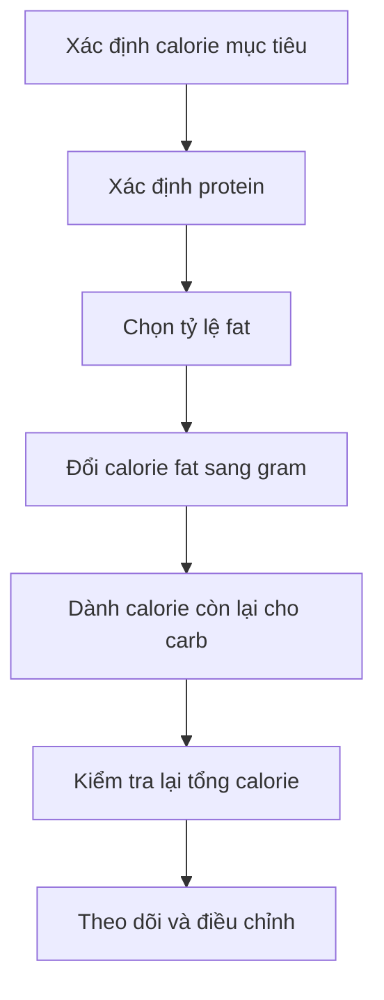

[](https://newsnetwork.mayoclinic.org/discussion/mayo-clinic-minute-how-to-choose-a-healthy-fat/?utm_source=chatgpt.com)

# 037 — Finding Your Ideal Fat Intake

## Xác định lượng chất béo lý tưởng

| Thuộc tính                    | Nội dung                         |
| ----------------------------- | -------------------------------- |
| **Module**                    | Module 04 — Setting Up Your Diet |
| **Bài học**                   | Finding Your Ideal Fat Intake    |
| **Thời lượng**                | 00:52                            |
| **Chủ đề chính**              | Xác định lượng chất béo lý tưởng |
| **Công thức trọng tâm**       | Calorie từ fat ÷ 9 = số gram fat |
| **Mức đề xuất trong bài học** | Khoảng 15–20% tổng calorie       |

> [!IMPORTANT]
> Bài học sử dụng mức **15–20% tổng calorie**. Tuy nhiên, khoảng phân bố chất béo được chấp nhận cho người trưởng thành theo Dietary Reference Intakes là **20–35% tổng năng lượng**. Vì vậy, mức 15% không nên được xem là tiêu chuẩn tối thiểu phù hợp với tất cả mọi người. ([National Academies][1])

---

## Mục lục

1. [Mục tiêu bài học](#1-mục-tiêu-bài-học)
2. [Nội dung chính](#2-nội-dung-chính)
3. [Áp dụng thực tế](#3-áp-dụng-thực-tế)
4. [Lưu ý và lỗi thường gặp](#4-lưu-ý-và-lỗi-thường-gặp)
5. [Checklist thực hành](#5-checklist-thực-hành)
6. [Tóm tắt](#6-tóm-tắt)
7. [Tài liệu nghiên cứu](#7-tài-liệu-nghiên-cứu)

---

## 1. Mục tiêu bài học

Sau bài học này, bạn có thể:

* Hiểu vai trò của chất béo trong một chế độ ăn cân bằng.
* Chuyển đổi tỷ lệ phần trăm calorie từ chất béo sang số gram chất béo.
* Tính lượng fat phù hợp dựa trên tổng calorie mỗi ngày.
* Kiểm tra xem tổng protein, fat và carbohydrate có khớp với calorie mục tiêu hay không.
* Phân biệt giữa **tổng lượng chất béo** và **chất lượng nguồn chất béo**.

---

## 2. Nội dung chính

### 2.1. Vì sao cơ thể cần chất béo?

Chất béo không chỉ là nguồn năng lượng. Nó còn cung cấp các acid béo thiết yếu, tham gia vào cấu trúc tế bào và hỗ trợ hấp thu những vitamin tan trong chất béo. Trong dinh dưỡng thể thao, lượng fat cũng cần đủ để cung cấp acid béo thiết yếu, vitamin tan trong chất béo và năng lượng duy trì cơ thể. ([MedlinePlus][2])

Những vai trò chính gồm:

* Cung cấp năng lượng.
* Hỗ trợ hấp thu vitamin **A, D, E và K**.
* Cung cấp acid béo thiết yếu.
* Tham gia cấu tạo màng tế bào.
* Hỗ trợ các quá trình sinh lý và sản xuất hormone.
* Tăng hương vị và độ no của bữa ăn.


*Ảnh: quả bơ và các loại hạt — Wikimedia Commons.* ([Wikimedia Commons][3])

---

### 2.2. Công thức xác định lượng fat

Chất béo cung cấp khoảng **9 kcal trên mỗi gram**, trong khi protein và carbohydrate cung cấp khoảng 4 kcal trên mỗi gram. ([MedlinePlus][2])

```text
Calorie từ chất béo
= Tổng calorie mỗi ngày × Tỷ lệ fat mục tiêu

Số gram chất béo
= Calorie từ chất béo ÷ 9
```

### Sơ đồ tính toán


---

### 2.3. Ví dụ với mức 2.600 kcal mỗi ngày

Giả sử một người đàn ông 25 tuổi có mục tiêu:

```text
Tổng năng lượng = 2.600 kcal/ngày
```

#### Trường hợp 1: Fat chiếm 15% calorie

```text
Calorie từ fat
= 2.600 × 15%
= 390 kcal

Số gram fat
= 390 ÷ 9
= 43,3 g
```

Có thể làm tròn thành khoảng:

```text
43–45 g fat/ngày
```

#### Trường hợp 2: Fat chiếm 20% calorie

```text
Calorie từ fat
= 2.600 × 20%
= 520 kcal

Số gram fat
= 520 ÷ 9
= 57,8 g
```

Có thể làm tròn thành khoảng:

```text
58–60 g fat/ngày
```

### Bảng tổng hợp

| Tỷ lệ calorie từ fat | Calorie từ fat | Kết quả chính xác | Làm tròn thực tế |
| -------------------: | -------------: | ----------------: | ---------------: |
|              **15%** |       390 kcal |            43,3 g |          43–45 g |
|              **20%** |       520 kcal |            57,8 g |          58–60 g |
|              **25%** |       650 kcal |            72,2 g |             72 g |
|              **30%** |       780 kcal |            86,7 g |             87 g |
|              **35%** |       910 kcal |           101,1 g |            101 g |

> Mức 25–35% trong bảng được thêm vào để đối chiếu với khoảng tham chiếu dành cho người trưởng thành; đây không phải mức được trình bày trong bài học gốc. ([National Academies][1])

---

### 2.4. Kiểm tra lại ví dụ macro trong bài học

Bài học đưa ra ví dụ:

| Macro        | Số lượng |
| ------------ | -------: |
| Protein      |    145 g |
| Fat          |     60 g |
| Carbohydrate |    270 g |

Kiểm tra tổng calorie:

```text
Protein: 145 × 4 = 580 kcal
Fat:      60 × 9 = 540 kcal
Carb:    270 × 4 = 1.080 kcal
────────────────────────────
Tổng cộng           2.200 kcal
```

Như vậy, bộ macro trên chỉ cung cấp khoảng:

```text
2.200 kcal
```

Nó **không khớp với mục tiêu 2.600 kcal** được nhắc đến trước đó. Có thể nội dung bài học hoặc bản chép lời đã thiếu khoảng 100 g carbohydrate.

#### Bộ macro khớp với 2.600 kcal

Giữ nguyên:

```text
Protein = 145 g
Fat     = 60 g
```

Carbohydrate còn lại được tính như sau:

```text
Calorie còn lại
= 2.600 − 580 − 540
= 1.480 kcal

Carbohydrate
= 1.480 ÷ 4
= 370 g
```

Bộ macro hoàn chỉnh sẽ là:

| Macro        |  Gram |        Calorie |
| ------------ | ----: | -------------: |
| Protein      | 145 g |       580 kcal |
| Fat          |  60 g |       540 kcal |
| Carbohydrate | 370 g |     1.480 kcal |
| **Tổng**     |     — | **2.600 kcal** |

> [!NOTE]
> 60 g fat cung cấp 540 kcal, tương đương khoảng **20,8%** của 2.600 kcal. Nếu muốn bám sát đúng 20%, có thể đặt fat ở khoảng **58 g**.

---

### 2.5. Có phải 15–20% là lượng fat lý tưởng cho mọi người?

Không nhất thiết.

Khoảng tham chiếu chung cho người trưởng thành là **20–35% tổng calorie từ chất béo**. Khoảng này được thiết lập nhằm vừa đáp ứng acid béo thiết yếu, vừa duy trì một chế độ ăn liên quan đến nguy cơ bệnh mạn tính thấp hơn. ([National Academies][4])

Do đó:

| Mức fat      | Cách hiểu                                                                                 |
| ------------ | ----------------------------------------------------------------------------------------- |
| **15%**      | Khá thấp; không nên mặc định sử dụng lâu dài cho tất cả mọi người                         |
| **20%**      | Mức thấp trong khoảng tham chiếu dành cho người trưởng thành                              |
| **20–25%**   | Điểm khởi đầu thực tế cho nhiều người khi thiết lập macro                                 |
| **25–35%**   | Có thể phù hợp khi thích thực phẩm giàu fat hoặc ăn ít carbohydrate hơn                   |
| **Trên 35%** | Có thể xuất hiện trong chế độ ăn đặc thù nhưng cần quản lý tổng calorie và chất lượng fat |

Mức phù hợp còn phụ thuộc vào:

* Tổng calorie.
* Mục tiêu tăng cơ, giảm mỡ hoặc duy trì.
* Khả năng tiêu hóa.
* Sở thích ăn uống.
* Lượng carbohydrate cần cho tập luyện.
* Tình trạng sức khỏe và chỉ định chuyên môn.

---

### 2.6. Chất béo và hormone: cần hiểu đúng

Một phân tích tổng hợp năm 2021 trên sáu nghiên cứu can thiệp với 206 nam giới cho thấy chế độ ăn ít chất béo có thể làm giảm một số chỉ số testosterone. Tuy nhiên, chính nhóm tác giả cũng cho rằng cần thêm các thử nghiệm ngẫu nhiên để xác nhận. ([PubMed][5])

Một phân tích tổng hợp lớn hơn công bố năm 2025, tổng hợp 11 thử nghiệm với 888 người tham gia, lại không tìm thấy khác biệt có ý nghĩa về nồng độ các hormone sinh dục giữa chế độ ăn ít fat và nhiều fat. ([PubMed][6])

Vì vậy, cách diễn đạt chính xác hơn là:

> Ăn quá ít chất béo trong thời gian dài **có thể không tối ưu**, nhưng chưa có đủ bằng chứng để khẳng định một tỷ lệ duy nhất như 15%, 20% hoặc 25% sẽ bảo đảm sản xuất hormone tối ưu cho mọi người.

---

## 3. Áp dụng thực tế

### 3.1. Quy trình thiết lập macro



### Công thức đầy đủ

```text
Protein calorie = Protein g × 4

Fat calorie = Fat g × 9

Carb calorie
= Tổng calorie − Protein calorie − Fat calorie

Carb g
= Carb calorie ÷ 4
```

---

### 3.2. Ví dụ thiết lập chế độ ăn 2.600 kcal

Giả sử:

```text
Protein = 145 g
Fat mục tiêu = 20% calorie
```

#### Bước 1: Tính protein

```text
145 × 4 = 580 kcal
```

#### Bước 2: Tính fat

```text
2.600 × 20% = 520 kcal

520 ÷ 9 = 57,8 g fat
```

Làm tròn thành:

```text
58 g fat
```

#### Bước 3: Tính carbohydrate

```text
Calorie từ fat
= 58 × 9
= 522 kcal

Calorie còn lại cho carb
= 2.600 − 580 − 522
= 1.498 kcal

Carbohydrate
= 1.498 ÷ 4
= 374,5 g
```

Mục tiêu thực tế:

| Macro        |          Mục tiêu |
| ------------ | ----------------: |
| Protein      |             145 g |
| Fat          |              58 g |
| Carbohydrate |  khoảng 374–375 g |
| Tổng calorie | khoảng 2.600 kcal |

---

### 3.3. Ưu tiên chất lượng nguồn fat

Nên ưu tiên phần lớn chất béo từ:

| Nhóm                       | Ví dụ                                  |
| -------------------------- | -------------------------------------- |
| Chất béo không bão hòa đơn | Dầu ô liu, quả bơ, hạnh nhân, hạt điều |
| Chất béo không bão hòa đa  | Cá béo, óc chó, hạt chia, hạt lanh     |
| Thực phẩm nguyên bản       | Trứng, cá, các loại hạt, quả bơ        |
| Dầu thực vật phù hợp       | Dầu ô liu, dầu cải, dầu đậu nành       |

WHO khuyến nghị thay chất béo bão hòa và chất béo chuyển hóa bằng chất béo không bão hòa, đặc biệt từ nguồn thực vật. ([World Health Organization][7])


*Ảnh khoa học thuộc phạm vi công cộng của National Cancer Institute/NIH, minh họa nhiều loại thực phẩm chứa chất béo. Một thực phẩm “nhiều fat” không đồng nghĩa với một nguồn fat có chất lượng tốt.* ([Wikimedia Commons][8])

---

### 3.4. Kiểm soát chất béo bão hòa và chất béo chuyển hóa

WHO khuyến nghị:

* Chất béo bão hòa không vượt quá **10% tổng năng lượng**.
* Chất béo chuyển hóa không vượt quá **1% tổng năng lượng**.
* Ưu tiên thay thế chúng bằng chất béo không bão hòa. ([World Health Organization][7])

Với chế độ ăn 2.600 kcal:

```text
Giới hạn 10% calorie từ chất béo bão hòa
= 2.600 × 10%
= 260 kcal

260 ÷ 9
≈ 28,9 g
```

Đây là **giới hạn tối đa**, không phải lượng cần đạt mỗi ngày.

---

### 3.5. Phân bổ fat trong ngày

Không bắt buộc phải chia fat hoàn toàn bằng nhau giữa các bữa. Một cách đơn giản với mục tiêu khoảng 60 g/ngày:

| Bữa ăn   | Fat tham khảo |
| -------- | ------------: |
| Bữa sáng |       10–15 g |
| Bữa trưa |       15–20 g |
| Bữa phụ  |        5–10 g |
| Bữa tối  |       15–20 g |

Có thể điều chỉnh theo:

* Cảm giác no.
* Thời gian tập luyện.
* Khả năng tiêu hóa.
* Các món ăn yêu thích.
* Tổng macro cuối ngày.

---

## 4. Lưu ý và lỗi thường gặp

### Lỗi 1: Coi 15–20% là tiêu chuẩn bắt buộc

Đây là mức được sử dụng trong khóa học, nhưng không phải khuyến nghị duy nhất. Khoảng tham chiếu chung dành cho người trưởng thành rộng hơn, ở mức 20–35%. ([National Academies][4])

### Lỗi 2: Chỉ quan tâm số gram mà bỏ qua chất lượng fat

60 g fat từ cá, quả bơ, hạt và dầu ô liu không tương đương về chất lượng dinh dưỡng với 60 g fat chủ yếu từ thực phẩm chiên, bánh ngọt và thịt chế biến.

### Lỗi 3: Không ghi lại dầu ăn và nước sốt

Các nguồn thường bị bỏ sót gồm:

* Dầu dùng để chiên hoặc xào.
* Bơ và mayonnaise.
* Sốt salad.
* Bơ đậu phộng.
* Sữa và phô mai.
* Các loại hạt ăn trực tiếp.

Do fat cung cấp 9 kcal mỗi gram, một sai lệch nhỏ về khẩu phần có thể tạo ra sai lệch calorie đáng kể. ([MedlinePlus][2])

### Lỗi 4: Không kiểm tra tổng calorie của ba macro

Luôn kiểm tra:

```text
Tổng calorie
= Protein × 4
+ Carbohydrate × 4
+ Fat × 9
```

Nếu kết quả cách xa calorie mục tiêu, ít nhất một macro đã bị tính sai hoặc làm tròn quá nhiều.

### Lỗi 5: Cắt fat quá thấp để dành calorie cho carbohydrate

Carbohydrate quan trọng đối với hiệu suất tập luyện, nhưng không nên vì thế mà giảm fat xuống mức quá thấp trong thời gian dài.

### Lỗi 6: Cho rằng ăn chất béo trực tiếp gây tăng mỡ

Chất béo có mật độ năng lượng cao nên dễ làm tổng calorie vượt mục tiêu, nhưng quá trình tăng hoặc giảm cân vẫn chịu ảnh hưởng lớn bởi mức cân bằng năng lượng tổng thể. Các chế độ giảm mỡ nhìn chung cần tạo ra thâm hụt calorie duy trì được. ([PubMed][9])

### Lỗi 7: Thay chất béo bằng carbohydrate tinh chế

Giảm chất béo bão hòa chỉ có lợi khi nó được thay bằng nguồn phù hợp, chẳng hạn chất béo không bão hòa hoặc carbohydrate giàu chất xơ; không nên mặc định thay bằng bánh kẹo và tinh bột tinh chế. ([World Health Organization][7])

---

## 5. Checklist thực hành

* [ ] Tôi đã xác định tổng calorie mục tiêu.
* [ ] Tôi đã thiết lập lượng protein trước.
* [ ] Tôi đã chọn tỷ lệ fat phù hợp.
* [ ] Tôi sử dụng công thức `calorie × tỷ lệ fat ÷ 9`.
* [ ] Tôi đã kiểm tra tổng calorie của protein, fat và carbohydrate.
* [ ] Tôi đã tính cả dầu ăn, nước sốt và đồ ăn vặt.
* [ ] Phần lớn fat đến từ cá, hạt, quả bơ và dầu thực vật phù hợp.
* [ ] Tôi không để phần lớn fat đến từ thực phẩm chiên và chế biến sẵn.
* [ ] Tôi kiểm soát chất béo bão hòa và tránh chất béo chuyển hóa.
* [ ] Tôi theo dõi cân nặng, hiệu suất tập, mức đói và khả năng tiêu hóa.
* [ ] Tôi điều chỉnh dựa trên dữ liệu thực tế thay vì thay đổi macro mỗi ngày.

---

## 6. Tóm tắt

### Công thức quan trọng nhất

```text
Fat g/ngày
= Tổng calorie × Tỷ lệ calorie từ fat ÷ 9
```

### Với mục tiêu 2.600 kcal

```text
15% fat ≈ 43–45 g/ngày
20% fat ≈ 58–60 g/ngày
```

### Điểm cần ghi nhớ

1. Bài học sử dụng khoảng **15–20% calorie từ fat**.
2. Khoảng tham chiếu chung cho người trưởng thành là **20–35%**.
3. Một gram fat cung cấp khoảng **9 kcal**.
4. Không chỉ quan tâm lượng fat; cần chú ý cả **chất lượng nguồn fat**.
5. Bộ macro `145 g protein + 60 g fat + 270 g carb` chỉ tương đương khoảng **2.200 kcal**, không phải 2.600 kcal.
6. Để đạt 2.600 kcal với 145 g protein và 60 g fat, lượng carbohydrate phải vào khoảng **370 g**.
7. Không có một tỷ lệ fat duy nhất tối ưu cho tất cả mọi người.

---

## 7. Tài liệu nghiên cứu

### Khuyến nghị lượng chất béo

* **National Academies — Dietary Reference Intakes:** khoảng phân bố chất béo dành cho người trưởng thành là 20–35% tổng năng lượng. ([National Academies][1])
* **WHO — Healthy Diet:** chất béo bão hòa dưới 10% và chất béo chuyển hóa dưới 1% tổng năng lượng. ([World Health Organization][7])
* **ACSM Position Stand:** fat cần đủ để cung cấp acid béo thiết yếu, vitamin tan trong chất béo và năng lượng. ([PubMed][10])

### Nghiên cứu về fat và hormone

* Phân tích tổng hợp năm 2021 cho thấy chế độ ít fat có thể làm giảm testosterone ở nam giới, nhưng dữ liệu còn hạn chế và cần thêm thử nghiệm. ([PubMed][5])
* Phân tích tổng hợp năm 2025 trên 11 thử nghiệm không phát hiện khác biệt có ý nghĩa về hormone sinh dục giữa chế độ ít fat và nhiều fat. ([PubMed][6])

> **Kết luận khoa học thận trọng:** nên ăn đủ chất béo và ưu tiên nguồn chất lượng tốt, nhưng không nên tuyên bố một tỷ lệ fat cụ thể có thể bảo đảm mức hormone tối ưu cho mọi người.

[1]: https://www.nationalacademies.org/cdn/materials/9fb9fae1-63a0-4048-88ad-3f972639149a?utm_source=chatgpt.com "Dietary Reference Intakes: Macronutrients"
[2]: https://medlineplus.gov/ency/patientinstructions/000104.htm?utm_source=chatgpt.com "Dietary fats explained: MedlinePlus Medical Encyclopedia"
[3]: https://commons.wikimedia.org/wiki/File%3AHealthy_Fats_-_Avocado_and_Nuts_-_50191958402.jpg?utm_source=chatgpt.com "File:Healthy Fats - Avocado and Nuts - 50191958402.jpg - Wikimedia Commons"
[4]: https://www.nationalacademies.org/read/10872/chapter/7?utm_source=chatgpt.com "Dietary Reference Intakes: Guiding Principles for Nutrition ..."
[5]: https://pubmed.ncbi.nlm.nih.gov/33741447/?utm_source=chatgpt.com "Low-fat diets and testosterone in men: Systematic review ..."
[6]: https://pubmed.ncbi.nlm.nih.gov/40387562/?utm_source=chatgpt.com "The Effect of Low-Fat Diets Versus High-Fat Diet on Sex ..."
[7]: https://www.who.int/news-room/fact-sheets/detail/healthy-diet?utm_source=chatgpt.com "Healthy diet"
[8]: https://commons.wikimedia.org/wiki/File%3AHigh_Fat_Foods_NCI_Visuals_Online.jpg?utm_source=chatgpt.com "File:High Fat Foods NCI Visuals Online.jpg - Wikimedia Commons"
[9]: https://pubmed.ncbi.nlm.nih.gov/28630601/?utm_source=chatgpt.com "International society of sports nutrition position stand: diets ..."
[10]: https://pubmed.ncbi.nlm.nih.gov/19225360/?utm_source=chatgpt.com "American College of Sports Medicine position stand. ..."
