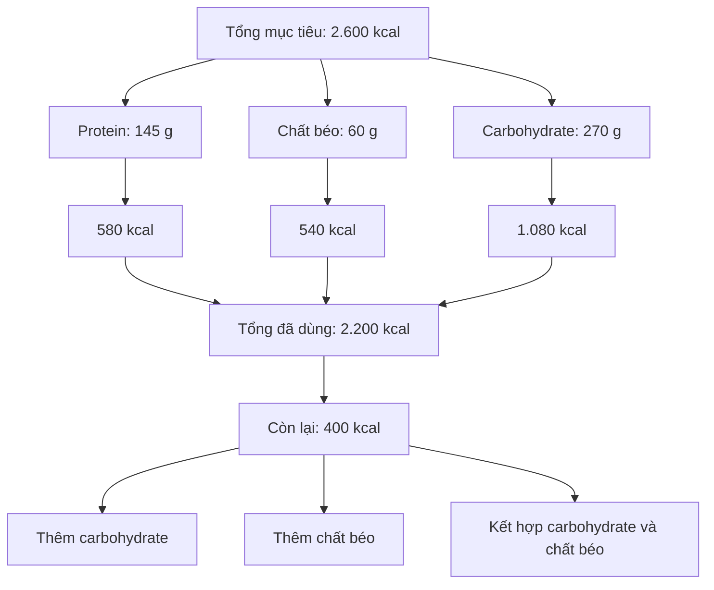
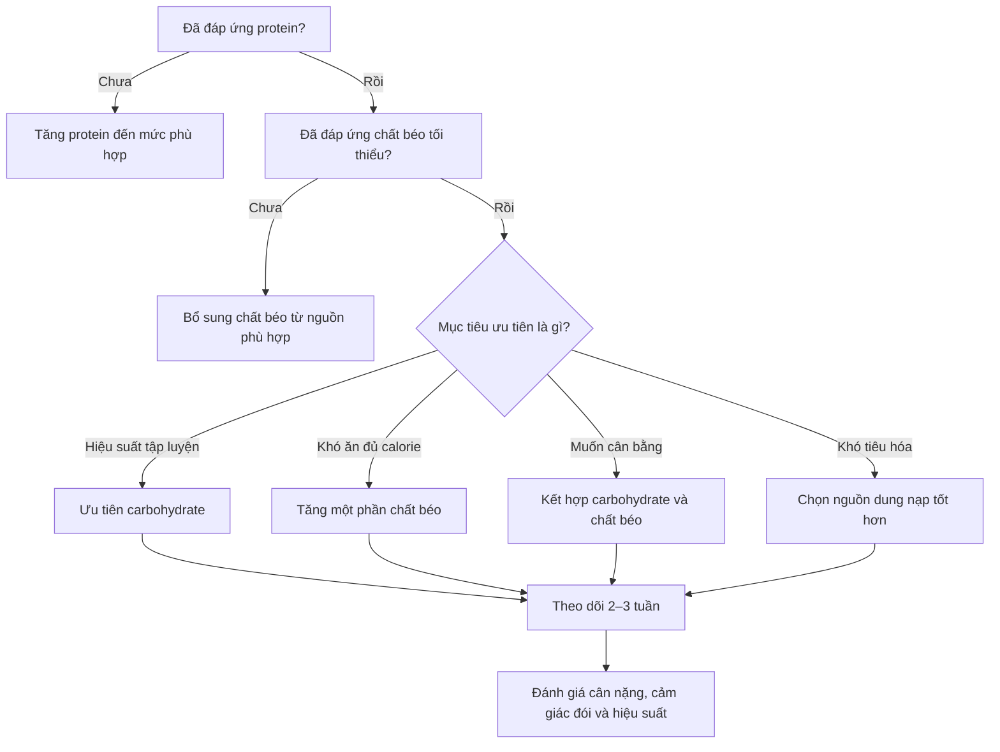

# 038 — What About The Remaining Calories

## Phân bổ lượng calorie còn lại như thế nào?

| Thuộc tính               | Nội dung                                                                                          |
| ------------------------ | ------------------------------------------------------------------------------------------------- |
| **Module**               | Module 04 — Setting Up Your Diet                                                                  |
| **Bài học**              | What About The Remaining Calories                                                                 |
| **Thời lượng**           | 02:17                                                                                             |
| **Chủ đề chính**         | Phân bổ lượng calorie còn lại sau khi đã đáp ứng nhu cầu protein, chất béo và carbohydrate cơ bản |
| **Tình huống minh họa**  | Nam, 25 tuổi, 180 lb ≈ 81,6 kg, tập luyện cường độ cao 3–4 buổi/tuần                              |
| **Mức duy trì ước tính** | Khoảng 2.600 kcal/ngày                                                                            |

> **Nguồn ảnh:** Okinawa Institute of Science and Technology. Protein và carbohydrate cung cấp khoảng **4 kcal/g**, trong khi chất béo cung cấp khoảng **9 kcal/g**.

---

## Mục lục

1. [Mục tiêu bài học](#1-mục-tiêu-bài-học)
2. [Nội dung chính](#2-nội-dung-chính)
3. [Áp dụng thực tế](#3-áp-dụng-thực-tế)
4. [Lưu ý và lỗi thường gặp](#4-lưu-ý-và-lỗi-thường-gặp)
5. [Checklist thực hành](#5-checklist-thực-hành)
6. [Tóm tắt](#6-tóm-tắt)
7. [Tài liệu nghiên cứu](#7-tài-liệu-nghiên-cứu)

---

## 1. Mục tiêu bài học

Sau bài học này, bạn có thể:

* Tính lượng calorie đã được phân bổ cho protein, chất béo và carbohydrate.
* Xác định chính xác lượng calorie còn lại trong ngày.
* Quyết định nên bổ sung calorie còn lại bằng carbohydrate, chất béo hay kết hợp cả hai.
* Điều chỉnh tỷ lệ dinh dưỡng theo mục tiêu, khả năng tiêu hóa, cảm giác đói và hiệu suất tập luyện.
* Tránh nhầm lẫn giữa **mức tối thiểu cần đáp ứng** và **giới hạn tối đa tuyệt đối**.

---

## 2. Nội dung chính

### 2.1. Tình huống minh họa

Nhân vật trong bài học có các đặc điểm:

| Thông số           |                        Giá trị |
| ------------------ | -----------------------------: |
| Tuổi               |                             25 |
| Cân nặng           |               180 lb ≈ 81,6 kg |
| Tần suất tập luyện | 3–4 buổi cường độ cao mỗi tuần |
| Calorie duy trì    |         Khoảng 2.600 kcal/ngày |
| Protein            |                     145 g/ngày |
| Chất béo           |                      60 g/ngày |
| Carbohydrate       |                     270 g/ngày |

Mức 2.600 kcal chỉ là con số minh họa cho người có đặc điểm và mức hoạt động cụ thể. Người tập ít hơn, nhiều hơn hoặc có cân nặng, chiều cao và tỷ lệ cơ khác sẽ có nhu cầu khác.

---

### 2.2. Quy đổi chất dinh dưỡng thành calorie

Công thức cơ bản:

[
\text{Calorie từ protein}=\text{gram protein}\times4
]

[
\text{Calorie từ carbohydrate}=\text{gram carbohydrate}\times4
]

[
\text{Calorie từ chất béo}=\text{gram chất béo}\times9
]

Các hệ số 4–4–9 được sử dụng phổ biến trên nhãn dinh dưỡng và trong quá trình tính khẩu phần.

---

### 2.3. Kiểm tra lại phép tính trong bài học

#### Protein

[
145\times4=580\text{ kcal}
]

#### Chất béo

[
60\times9=540\text{ kcal}
]

#### Carbohydrate

[
270\times4=1.080\text{ kcal}
]

#### Tổng calorie đã phân bổ

[
580+540+1.080=2.200\text{ kcal}
]

#### Calorie còn lại

[
2.600-2.200=\boxed{400\text{ kcal}}
]

| Chất dinh dưỡng     | Số gram |    Hệ số | Calorie chính xác |
| ------------------- | ------: | -------: | ----------------: |
| Protein             |   145 g | 4 kcal/g |          580 kcal |
| Chất béo            |    60 g | 9 kcal/g |          540 kcal |
| Carbohydrate        |   270 g | 4 kcal/g |        1.080 kcal |
| **Tổng đã phân bổ** |         |          |    **2.200 kcal** |
| **Còn lại**         |         |          |      **400 kcal** |

> [!IMPORTANT]
> Transcript nói còn khoảng **500 kcal** vì đã làm tròn thành khoảng 600 kcal từ protein, 520 kcal từ chất béo và 1.000 kcal từ carbohydrate:
>
> [
> 2.600-(600+520+1.000)=480\text{ kcal}\approx500\text{ kcal}
> ]
>
> Tuy nhiên, khi tính trực tiếp từ số gram đã nêu, kết quả chính xác hơn là **400 kcal còn lại**.

---

### 2.4. “Calorie còn lại” có ý nghĩa gì?

Protein, chất béo và carbohydrate ban đầu được thiết lập nhằm đáp ứng các nhu cầu ưu tiên:

* **Protein:** hỗ trợ xây dựng, sửa chữa và duy trì khối cơ.
* **Chất béo:** cung cấp acid béo thiết yếu, hỗ trợ màng tế bào, hormone và hấp thu vitamin tan trong chất béo.
* **Carbohydrate:** cung cấp năng lượng và hỗ trợ dự trữ glycogen cho hoạt động thể chất.

Sau khi các nhu cầu chính đã được đáp ứng, phần calorie còn lại trở thành một **vùng linh hoạt**. Bạn không bắt buộc phải phân bổ theo duy nhất một tỷ lệ.

---

### 2.5. Có nên dùng calorie còn lại để tăng protein?

Trong tình huống này:

[
\frac{145}{81,6}\approx1,78\text{ g protein/kg/ngày}
]

Mức 1,78 g/kg/ngày đã nằm trong khoảng **1,4–2,0 g/kg/ngày** mà ISSN đánh giá là đủ cho phần lớn người khỏe mạnh thường xuyên tập luyện.

Một phân tích tổng hợp trên 49 nghiên cứu ghi nhận lợi ích tăng thêm đối với khối không mỡ giảm rõ rệt sau khoảng **1,62 g/kg/ngày** trong bối cảnh tập kháng lực. Tuy nhiên, đây là giá trị trung bình của mô hình, không phải “trần cứng” áp dụng cho mọi cá nhân.

Vì vậy, với nhân vật trong bài:

* 145 g protein/ngày đã là mức hợp lý.
* Thêm protein vẫn có thể làm tăng cảm giác no hoặc thuận tiện cho khẩu phần.
* Nhưng không nhất thiết phải dành toàn bộ 400 kcal còn lại cho protein.
* Trong giai đoạn giảm calorie sâu, nhu cầu protein có thể cao hơn để hỗ trợ duy trì khối nạc.

#### Ảnh nghiên cứu: mối liên hệ giữa protein và thay đổi khối không mỡ

> **Cách đọc:** đường phân đoạn trong nghiên cứu cho thấy điểm gãy ước tính khoảng **1,62 g protein/kg/ngày**, với khoảng tin cậy rộng từ 1,03 đến 2,20 g/kg/ngày. Vì vậy, không nên hiểu 1,62 g/kg là giới hạn tuyệt đối cho tất cả mọi người.

---

### 2.6. Khi nào nên ưu tiên carbohydrate?

Carbohydrate thường phù hợp hơn khi bạn:

* Tập luyện cường độ cao hoặc có khối lượng tập lớn.
* Muốn cải thiện năng lượng trong buổi tập.
* Thường xuyên cảm thấy hụt sức hoặc giảm hiệu suất.
* Tiêu hóa carbohydrate tốt.
* Thích khẩu phần có khối lượng thức ăn lớn hơn.

Carbohydrate giúp bổ sung glycogen, đặc biệt có ý nghĩa với người thực hiện nhiều buổi tập hoặc hoạt động sức bền.

Nguồn carbohydrate nên ưu tiên:

* Gạo, khoai, yến mạch.
* Quinoa và các loại ngũ cốc nguyên hạt.
* Đậu và các loại đậu hạt.
* Trái cây.
* Rau củ.
* Thực phẩm giàu chất xơ và ít tinh chế.

---

### 2.7. Khi nào nên tăng chất béo?

Tăng chất béo có thể phù hợp khi bạn:

* Khó ăn đủ calorie vì khẩu phần quá lớn.
* Muốn tăng mật độ năng lượng của bữa ăn.
* Cảm thấy no và ổn định hơn với khẩu phần nhiều chất béo hơn.
* Không cần lượng carbohydrate quá cao cho hoạt động hiện tại.
* Muốn linh hoạt hơn trong lựa chọn món ăn.

Do chất béo cung cấp 9 kcal/g, bạn chỉ cần một lượng nhỏ để bổ sung nhiều calorie. Điều này thuận tiện nhưng cũng khiến tổng calorie dễ vượt mục tiêu nếu không định lượng khẩu phần.

Nguồn chất béo nên ưu tiên:

* Dầu ô liu.
* Quả bơ.
* Hạt hạnh nhân, óc chó, hạt điều.
* Cá béo.
* Hạt lanh, hạt chia.
* Bơ đậu phộng hoặc các loại bơ hạt không thêm quá nhiều đường.

> **Minh họa:** gạo lứt, khoai lang, quả bơ, các loại hạt và dầu ô liu. Ảnh dùng để minh họa nhóm thực phẩm, không phải khẩu phần bắt buộc.

---

### 2.8. Sơ đồ lựa chọn cách phân bổ

---

## 3. Áp dụng thực tế

### 3.1. Phương án 1 — Dành toàn bộ cho carbohydrate

Vì carbohydrate cung cấp 4 kcal/g:

[
400\div4=100\text{ g carbohydrate}
]

Khẩu phần cuối cùng:

| Chất dinh dưỡng |             Lượng mới |
| --------------- | --------------------: |
| Protein         |                 145 g |
| Chất béo        |                  60 g |
| Carbohydrate    |             **370 g** |
| Tổng calorie    | Khoảng **2.600 kcal** |

Phương án này phù hợp hơn với người:

* Tập luyện cường độ cao.
* Có nhiều buổi tập trong tuần.
* Tiêu hóa carbohydrate tốt.
* Muốn ưu tiên hiệu suất.

---

### 3.2. Phương án 2 — Dành toàn bộ cho chất béo

Vì chất béo cung cấp 9 kcal/g:

[
400\div9\approx44\text{ g chất béo}
]

Khẩu phần cuối cùng:

| Chất dinh dưỡng |             Lượng mới |
| --------------- | --------------------: |
| Protein         |                 145 g |
| Chất béo        |      **Khoảng 104 g** |
| Carbohydrate    |                 270 g |
| Tổng calorie    | Khoảng **2.600 kcal** |

Phương án này tạo khẩu phần có mật độ calorie cao hơn. Tuy nhiên, 104 g chất béo tương đương khoảng 36% tổng calorie, hơi cao hơn giới hạn trên 35% của khung AMDR dành cho người trưởng thành nói chung. Khung tham khảo này không phải quy định tuyệt đối cho vận động viên, nhưng cho thấy không nên mặc định toàn bộ calorie còn lại đều phải chuyển thành chất béo.

---

### 3.3. Phương án 3 — Kết hợp carbohydrate và chất béo

Ví dụ:

* Thêm **50 g carbohydrate**:

[
50\times4=200\text{ kcal}
]

* Thêm **22 g chất béo**:

[
22\times9=198\text{ kcal}
]

Tổng cộng:

[
200+198=398\text{ kcal}
]

Khẩu phần cuối cùng:

| Chất dinh dưỡng | Lượng mới |        Calorie |
| --------------- | --------: | -------------: |
| Protein         |     145 g |       580 kcal |
| Chất béo        |      82 g |       738 kcal |
| Carbohydrate    |     320 g |     1.280 kcal |
| **Tổng**        |           | **2.598 kcal** |

Đây là phương án cân bằng, vừa bổ sung năng lượng tập luyện vừa giúp bữa ăn ngon miệng và dễ duy trì hơn.

---

### 3.4. Công thức áp dụng cho khẩu phần cá nhân

#### Bước 1: Tính calorie từ các macro hiện tại

[
K_{\text{đã dùng}}=(P\times4)+(C\times4)+(F\times9)
]

Trong đó:

* (P): gram protein.
* (C): gram carbohydrate.
* (F): gram chất béo.

#### Bước 2: Tính calorie còn lại

[
K_{\text{còn lại}}=K_{\text{mục tiêu}}-K_{\text{đã dùng}}
]

#### Bước 3: Quy đổi theo phương án mong muốn

Nếu thêm carbohydrate:

[
C_{\text{bổ sung}}=\frac{K_{\text{còn lại}}}{4}
]

Nếu thêm chất béo:

[
F_{\text{bổ sung}}=\frac{K_{\text{còn lại}}}{9}
]

Nếu kết hợp:

[
4C_{\text{bổ sung}}+9F_{\text{bổ sung}}=K_{\text{còn lại}}
]

---

### 3.5. Theo dõi và điều chỉnh

Sau khi lựa chọn tỷ lệ, nên duy trì tương đối ổn định trong khoảng 2–3 tuần và theo dõi:

| Yếu tố           | Câu hỏi đánh giá                                              |
| ---------------- | ------------------------------------------------------------- |
| Cân nặng         | Cân nặng đang tăng, giảm hay giữ ổn định đúng mục tiêu?       |
| Hiệu suất        | Sức mạnh, số lần lặp và khả năng phục hồi có cải thiện không? |
| Cảm giác đói     | Có thường xuyên đói quá mức hoặc quá no không?                |
| Tiêu hóa         | Có đầy bụng, khó tiêu hoặc rối loạn tiêu hóa không?           |
| Năng lượng       | Có tỉnh táo và đủ năng lượng trong ngày không?                |
| Khả năng duy trì | Khẩu phần có phù hợp với sở thích và ngân sách không?         |

Sự tuân thủ lâu dài và tổng năng lượng thường quan trọng hơn việc cố tìm một tỷ lệ carbohydrate–chất béo “hoàn hảo”. Khi calorie và protein được kiểm soát, nhiều cách phân bổ chất béo và carbohydrate đều có thể mang lại kết quả phù hợp.

---

## 4. Lưu ý và lỗi thường gặp

### 4.1. Nhầm 400 kcal thành 500 kcal

Nguyên nhân là transcript đã làm tròn từng thành phần trước khi trừ.

* Tính từ số gram: còn **400 kcal**.
* Tính từ các số đã làm tròn: còn khoảng **480–500 kcal**.

Khi thiết lập khẩu phần thực tế, nên tính trực tiếp từ số gram để giảm sai số.

---

### 4.2. Hiểu sai câu “trên một gram protein mỗi ngày”

Ý của bài giảng nhiều khả năng là:

> **Trên khoảng 1 g protein cho mỗi pound cân nặng mỗi ngày.**

Không phải chỉ “trên 1 g protein mỗi ngày”.

Với người nặng 180 lb:

[
1\text{ g/lb}=180\text{ g protein/ngày}
]

Tuy nhiên, đây không phải mức bắt buộc. Khuyến nghị thường được diễn đạt theo kilogram cân nặng và phụ thuộc vào mục tiêu, tình trạng calorie cũng như kinh nghiệm tập luyện.

---

### 4.3. Cho rằng ăn càng nhiều carbohydrate càng tốt

Câu “không có giới hạn carbohydrate” không nên hiểu theo nghĩa tuyệt đối.

Lượng carbohydrate vẫn bị giới hạn bởi:

* Tổng mục tiêu calorie.
* Khả năng tiêu hóa.
* Nhu cầu protein và chất béo thiết yếu.
* Lượng chất xơ.
* Tình trạng chuyển hóa và bệnh lý cá nhân.
* Mức độ hoạt động thể chất.

Nguồn carbohydrate có chất lượng tốt không làm mất đi yêu cầu kiểm soát tổng năng lượng.

---

### 4.4. Cho rằng người thừa cân luôn phải ưu tiên chất béo

Thừa cân hoặc ít vận động không tự động đồng nghĩa với việc cơ thể “không xử lý được carbohydrate”.

Việc lựa chọn chế độ nhiều carbohydrate hay nhiều chất béo nên dựa trên:

* Tổng calorie.
* Protein.
* Sở thích cá nhân.
* Khả năng tuân thủ.
* Hiệu suất hoạt động.
* Các chỉ số sức khỏe.
* Hướng dẫn của bác sĩ khi có bệnh chuyển hóa.

Các nghiên cứu so sánh chế độ ít carbohydrate và ít chất béo thường cho kết quả không có một phương pháp duy nhất vượt trội trong mọi hoàn cảnh, đặc biệt khi tổng năng lượng và protein được kiểm soát tương đương.

---

### 4.5. Cho rằng chất béo luôn dễ tiêu hóa hơn carbohydrate

Đây là nhận định quá đơn giản.

Khả năng tiêu hóa phụ thuộc vào:

* Loại thực phẩm.
* Lượng chất béo trong một bữa.
* Hàm lượng chất xơ.
* Cách chế biến.
* Tốc độ ăn.
* Tình trạng đường tiêu hóa của từng người.

Bữa ăn chứa nhiều chất béo có thể làm chậm quá trình làm rỗng dạ dày ở một số người. Vì vậy, hãy chọn nguồn và tỷ lệ giúp bạn cảm thấy thoải mái thay vì áp dụng một quy tắc chung.

---

### 4.6. Bỏ qua chất lượng thực phẩm

Cùng cung cấp 400 kcal nhưng hai khẩu phần có thể rất khác nhau về:

* Chất xơ.
* Vitamin và khoáng chất.
* Mức độ no.
* Hàm lượng natri.
* Mức độ chế biến.
* Ảnh hưởng đến tiêu hóa.

Nên ưu tiên phần lớn calorie từ thực phẩm ít tinh chế và giàu dinh dưỡng, đồng thời vẫn chừa một phần linh hoạt để khẩu phần dễ duy trì.

---

### 4.7. Xem tỷ lệ 15–20% chất béo là tiêu chuẩn bắt buộc

Mức 20% nằm ở đáy của khung AMDR **20–35% tổng năng lượng** dành cho người trưởng thành nói chung. Mức 15% là một mô hình ít chất béo và thấp hơn giới hạn dưới của khung tham khảo này, nên không được xem là chuẩn chung cho tất cả mọi người.

---

## 5. Checklist thực hành

### Xác định các giá trị nền

* [ ] Tôi đã xác định mục tiêu calorie hằng ngày.
* [ ] Tôi đã xác định lượng protein phù hợp.
* [ ] Tôi đã bảo đảm lượng chất béo tối thiểu.
* [ ] Tôi đã thiết lập lượng carbohydrate nền theo hoạt động.

### Kiểm tra phép tính

* [ ] Tôi đã nhân protein với 4 kcal/g.
* [ ] Tôi đã nhân carbohydrate với 4 kcal/g.
* [ ] Tôi đã nhân chất béo với 9 kcal/g.
* [ ] Tôi đã cộng tổng calorie từ ba chất.
* [ ] Tôi đã lấy calorie mục tiêu trừ calorie đã phân bổ.

### Phân bổ calorie còn lại

* [ ] Tôi ưu tiên carbohydrate nếu cần thêm năng lượng tập luyện.
* [ ] Tôi tăng một phần chất béo nếu khó ăn đủ calorie.
* [ ] Tôi có thể kết hợp carbohydrate và chất béo.
* [ ] Tôi không tăng protein chỉ vì nghĩ rằng càng nhiều càng tốt.
* [ ] Tôi ưu tiên nguồn thực phẩm phù hợp và dễ duy trì.

### Theo dõi kết quả

* [ ] Tôi theo dõi cân nặng bằng trung bình nhiều ngày.
* [ ] Tôi theo dõi hiệu suất tập luyện.
* [ ] Tôi theo dõi cảm giác đói và mức năng lượng.
* [ ] Tôi theo dõi khả năng tiêu hóa.
* [ ] Tôi chỉ điều chỉnh từng bước nhỏ thay vì thay đổi toàn bộ khẩu phần.

---

## 6. Tóm tắt

> Sau khi đáp ứng nhu cầu protein, chất béo và carbohydrate nền, lượng calorie còn lại có thể được phân bổ linh hoạt.

Trong ví dụ của bài học:

[
145\text{ g protein}+60\text{ g fat}+270\text{ g carbs}
]

cung cấp:

[
580+540+1.080=2.200\text{ kcal}
]

Với mục tiêu 2.600 kcal:

[
2.600-2.200=\boxed{400\text{ kcal còn lại}}
]

Ba phương án cơ bản:

| Phương án            | Cách bổ sung khoảng 400 kcal            | Phù hợp khi                                     |
| -------------------- | --------------------------------------- | ----------------------------------------------- |
| Ưu tiên carbohydrate | Khoảng 100 g carbohydrate               | Cần năng lượng và hiệu suất tập luyện           |
| Ưu tiên chất béo     | Khoảng 44 g chất béo                    | Khó ăn đủ calorie, muốn giảm thể tích khẩu phần |
| Kết hợp              | Ví dụ 50 g carbohydrate + 22 g chất béo | Muốn khẩu phần cân bằng, dễ duy trì             |

### Nguyên tắc cốt lõi

1. Đáp ứng đủ protein.
2. Không cắt chất béo xuống quá thấp.
3. Dùng carbohydrate và chất béo để hoàn thiện tổng calorie.
4. Chọn tỷ lệ phù hợp với hoạt động, tiêu hóa và sở thích.
5. Theo dõi kết quả thực tế và điều chỉnh dần.

---

## 7. Tài liệu nghiên cứu

1. **Morton và cộng sự — Protein supplementation and resistance training:** Phân tích tổng hợp về ảnh hưởng của bổ sung protein đối với khối cơ và sức mạnh; điểm gãy trung bình được ước tính khoảng 1,62 g/kg/ngày.
2. **International Society of Sports Nutrition — Protein and exercise:** Khuyến nghị khoảng 1,4–2,0 g protein/kg/ngày cho phần lớn người thường xuyên tập luyện.
3. **International Society of Sports Nutrition — Diets and body composition:** Thảo luận các mô hình ít chất béo, ít carbohydrate, protein cao và vai trò của cân bằng năng lượng, protein cũng như khả năng tuân thủ.
4. **FDA — Nutrition Facts:** Protein và carbohydrate cung cấp khoảng 4 kcal/g; chất béo cung cấp khoảng 9 kcal/g.

> [!NOTE]
> Nội dung mang tính giáo dục. Người có bệnh tiểu đường, bệnh thận, bệnh gan, rối loạn lipid máu, bệnh đường tiêu hóa hoặc đang sử dụng thuốc nên trao đổi với bác sĩ hoặc chuyên gia dinh dưỡng trước khi thay đổi lớn khẩu phần.

---

# Bài luyện tập

## Mục tiêu

## Đề bài

## Yêu cầu hoàn thành

- [ ] 
- [ ] 
- [ ] 

## Kết quả / lời giải

## Ghi chú
