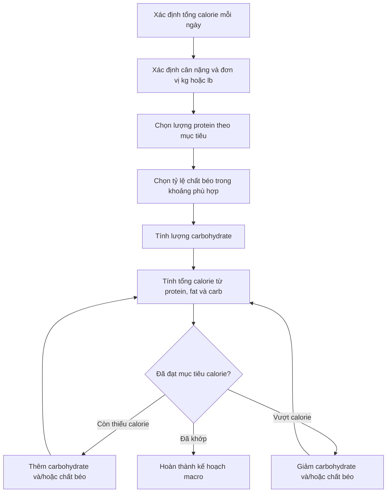

[](https://bjsm.bmj.com/content/52/6/376?utm_source=chatgpt.com)

# 039 — Macronutrient Cheat Sheet

| Thuộc tính            | Nội dung                                                                                     |
| --------------------- | -------------------------------------------------------------------------------------------- |
| **Module**            | Module 04 — Setting Up Your Diet                                                             |
| **Bài học**           | Macronutrient Cheat Sheet                                                                    |
| **Thời lượng**        | 00:06                                                                                        |
| **Chủ đề chính**      | Bảng tra cứu nhanh chất dinh dưỡng đa lượng                                                  |
| **Tài liệu đính kèm** | [Macronutrient Cheat Sheet — PDF](sandbox:/mnt/data/Macronutrient+Cheat+Sheet%20%281%29.pdf) |

> **Ý tưởng cốt lõi:** xác định lượng **protein**, **chất béo** và **carbohydrate** theo cân nặng, tổng calorie và mục tiêu cá nhân; sau đó dùng carbohydrate hoặc chất béo để phân bổ phần calorie còn lại.

---

## Mục lục

1. [Mục tiêu bài học](#1-mục-tiêu-bài-học)
2. [Nội dung chính](#2-nội-dung-chính)
3. [Áp dụng thực tế](#3-áp-dụng-thực-tế)
4. [Lưu ý và lỗi thường gặp](#4-lưu-ý-và-lỗi-thường-gặp)
5. [Checklist thực hành](#5-checklist-thực-hành)
6. [Tóm tắt](#6-tóm-tắt)

---

## 1. Mục tiêu bài học

Sau bài học này, bạn có thể:

* Tra cứu nhanh lượng protein, chất béo và carbohydrate theo cân nặng.
* Chuyển đổi giữa hệ mét `kg` và hệ Anh `lb`.
* Chuyển tỷ lệ calorie từ chất béo thành số gram chất béo.
* Kiểm tra tổng calorie được tạo ra từ các chất dinh dưỡng đa lượng.
* Phân bổ lượng calorie còn dư vào carbohydrate hoặc chất béo theo sở thích và khả năng duy trì chế độ ăn.


*Ảnh minh họa bữa ăn có ngũ cốc, đậu, sữa, rau và trái cây của USDA; ảnh thuộc phạm vi công cộng.* ([Wikimedia Commons][1])

---

## 2. Nội dung chính

### 2.1. Bảng tra cứu nhanh theo hệ mét

| Chất dinh dưỡng                     | Mức khuyến nghị trong tài liệu | Cách tính                           |
| ----------------------------------- | -----------------------------: | ----------------------------------- |
| **Protein — phát triển cơ bắp**     |      `1,76–2,20 g/kg` cân nặng | Cân nặng × `1,76–2,20`              |
| **Protein — sức khỏe thông thường** |      `0,88–1,10 g/kg` cân nặng | Cân nặng × `0,88–1,10`              |
| **Chất béo**                        |          `15–35%` tổng calorie | Tổng calorie × tỷ lệ chất béo ÷ `9` |
| **Carbohydrate**                    |      `2,20–3,85 g/kg` cân nặng | Cân nặng × `2,20–3,85`              |

Đây là các con số được trình bày trực tiếp trong bảng *Ideal Macronutrient Intakes* của tài liệu khóa học. Tài liệu cũng hướng dẫn rằng khi đã đạt mục tiêu các chất dinh dưỡng nhưng vẫn còn calorie, có thể bổ sung carbohydrate, chất béo hoặc kết hợp cả hai theo sở thích cá nhân. 

---

### 2.2. Bảng tra cứu theo hệ Anh

| Chất dinh dưỡng                     | Mức khuyến nghị trong tài liệu |
| ----------------------------------- | -----------------------------: |
| **Protein — phát triển cơ bắp**     |        `0,8–1,0 g/lb` cân nặng |
| **Protein — sức khỏe thông thường** |        `0,4–0,5 g/lb` cân nặng |
| **Chất béo**                        |          `15–35%` tổng calorie |
| **Carbohydrate**                    |       `1,0–1,75 g/lb` cân nặng |

Các giá trị trên là phiên bản hệ Anh trong tài liệu gốc. 

> **Quy đổi nhanh:**
> `1 kg ≈ 2,205 lb`
> `1 lb ≈ 0,454 kg`

---

### 2.3. Giá trị năng lượng của từng chất

| Chất dinh dưỡng  | Năng lượng |
| ---------------- | ---------: |
| **Protein**      | `4 kcal/g` |
| **Carbohydrate** | `4 kcal/g` |
| **Chất béo**     | `9 kcal/g` |

Chất béo cung cấp nhiều hơn gấp đôi năng lượng trên mỗi gram so với protein và carbohydrate. ([NCBI][2])

Công thức kiểm tra tổng calorie:

```text
Tổng calorie
= Protein (g) × 4
+ Carbohydrate (g) × 4
+ Chất béo (g) × 9
```

Ví dụ:

```text
150 g protein × 4 = 600 kcal
270 g carb    × 4 = 1.080 kcal
80 g fat      × 9 = 720 kcal

Tổng = 600 + 1.080 + 720
     = 2.400 kcal
```

---

### 2.4. Trình tự thiết lập macro



Cách tiếp cận thực tế là:

1. **Protein làm nền tảng:** chọn theo mục tiêu sức khỏe hoặc phát triển cơ bắp.
2. **Chất béo tạo khoảng an toàn:** chọn một tỷ lệ phù hợp trong khoảng của bảng.
3. **Carbohydrate cung cấp phần năng lượng còn lại:** điều chỉnh theo hoạt động, khẩu vị và khả năng duy trì.
4. **Kiểm tra lại tổng calorie:** không chỉ nhìn từng con số macro riêng lẻ.

---

### 2.5. Phân bổ calorie còn lại

Sau khi đã chọn protein và chất béo:

```text
Calorie còn lại
= Tổng calorie mục tiêu
− calorie từ protein
− calorie từ chất béo
```

Nếu muốn dành toàn bộ phần còn lại cho carbohydrate:

```text
Carbohydrate (g) = Calorie còn lại ÷ 4
```

Nếu muốn dành toàn bộ phần còn lại cho chất béo:

```text
Chất béo bổ sung (g) = Calorie còn lại ÷ 9
```

#### Ví dụ còn dư 360 kcal

| Phương án             |              Cách tính |          Lượng bổ sung |
| --------------------- | ---------------------: | ---------------------: |
| Chỉ thêm carbohydrate |              `360 ÷ 4` |            `90 g carb` |
| Chỉ thêm chất béo     |              `360 ÷ 9` |             `40 g fat` |
| Kết hợp               | `180 ÷ 4` và `180 ÷ 9` | `45 g carb + 20 g fat` |

Không có yêu cầu bắt buộc phải phân bổ toàn bộ calorie còn lại theo một chất duy nhất. Tài liệu cho phép bổ sung chất béo, carbohydrate hoặc cả hai theo sở thích cá nhân. 

---

### 2.6. Đối chiếu với nghiên cứu

#### Protein và phát triển cơ bắp

Một phân tích tổng hợp về tập kháng lực cho thấy lợi ích trung bình đối với khối lượng không mỡ có xu hướng đạt điểm ổn định quanh `1,6 g protein/kg/ngày`; khoảng tin cậy phía trên của ước tính này đạt khoảng `2,2 g/kg/ngày`. Vì vậy, phạm vi khoảng `1,6–2,2 g/kg/ngày` thường được sử dụng để bao phủ khác biệt giữa các cá nhân. ([PubMed Central (PMC)][3])

Quan điểm của International Society of Sports Nutrition đưa ra phạm vi `1,4–2,0 g/kg/ngày` là đủ cho phần lớn người thường xuyên tập luyện, trong khi nhu cầu có thể cao hơn trong giai đoạn giảm calorie hoặc tập luyện đặc biệt nặng. ([PubMed][4])

> Biểu đồ nghiên cứu ở đầu bài thể hiện mối quan hệ giữa tổng lượng protein và thay đổi khối lượng không mỡ trong phân tích của Morton và cộng sự. Đây là xu hướng trung bình của nhiều nhóm nghiên cứu, không phải một “ngưỡng tuyệt đối” áp dụng giống nhau cho mọi người.

#### Phạm vi macro dành cho người trưởng thành nói chung

Khung AMDR dành cho người trưởng thành đưa ra các phạm vi rộng hơn:

| Chất dinh dưỡng | AMDR dành cho người trưởng thành |
| --------------- | -------------------------------: |
| Carbohydrate    |         `45–65%` tổng năng lượng |
| Chất béo        |         `20–35%` tổng năng lượng |
| Protein         |         `10–35%` tổng năng lượng |

AMDR là phạm vi dinh dưỡng cộng đồng rộng, trong khi cheat sheet của khóa học được thiết kế như công cụ tính nhanh theo cân nặng và mục tiêu thể hình. Vì vậy, mức chất béo tối thiểu `15%` và lượng carbohydrate tính theo `g/kg` trong bảng nên được xem là quy tắc của khóa học, không phải đơn thuốc dinh dưỡng phổ quát. ([National Academies Press][5])


*Biểu đồ dữ liệu minh họa tỷ lệ nước, carbohydrate, acid béo, protein và thành phần còn lại trong một số thực phẩm; giấy phép CC BY-SA 4.0.* ([Wikimedia Commons][6])

---

## 3. Áp dụng thực tế

### 3.1. Ví dụ: người nặng 75 kg, mục tiêu 2.400 kcal

#### Bước 1 — Tính protein

Mục tiêu phát triển cơ bắp:

```text
Mức thấp: 75 × 1,76 = 132 g
Mức cao:  75 × 2,20 = 165 g
```

Phạm vi protein:

```text
132–165 g protein/ngày
```

Chọn mức thực tế:

```text
150 g protein
150 × 4 = 600 kcal
```

---

#### Bước 2 — Tính chất béo

Giả sử chọn `30%` tổng calorie:

```text
2.400 × 30% = 720 kcal từ chất béo
720 ÷ 9 = 80 g chất béo
```

---

#### Bước 3 — Tính carbohydrate

```text
Calorie còn lại
= 2.400 − 600 − 720
= 1.080 kcal
```

```text
Carbohydrate
= 1.080 ÷ 4
= 270 g
```

So với phạm vi trong cheat sheet:

```text
75 × 2,20 = 165 g
75 × 3,85 = 288,75 g
```

`270 g carbohydrate` vẫn nằm trong khoảng `165–289 g`.

---

#### Kết quả cuối cùng

| Chất dinh dưỡng | Số gram |        Calorie |    Tỷ lệ |
| --------------- | ------: | -------------: | -------: |
| Protein         | `150 g` |     `600 kcal` |    `25%` |
| Chất béo        |  `80 g` |     `720 kcal` |    `30%` |
| Carbohydrate    | `270 g` |   `1.080 kcal` |    `45%` |
| **Tổng**        |       — | **2.400 kcal** | **100%** |

---

### 3.2. Điều chỉnh theo sở thích

Hai chế độ ăn có thể chứa cùng lượng calorie và protein nhưng phân bổ carbohydrate — chất béo khác nhau.

#### Phương án nhiều carbohydrate hơn

```text
150 g protein
60 g chất béo
315 g carbohydrate
```

```text
600 + 540 + 1.260 = 2.400 kcal
```

Phương án này có thể phù hợp hơn với người thích cơm, mì, khoai, trái cây hoặc cần nhiều nhiên liệu cho hoạt động.

#### Phương án nhiều chất béo hơn

```text
150 g protein
100 g chất béo
225 g carbohydrate
```

```text
600 + 900 + 900 = 2.400 kcal
```

Phương án này có thể phù hợp hơn với người thích trứng, cá béo, quả bơ, các loại hạt và dầu thực vật.

> Tổng calorie và khả năng tuân thủ chế độ ăn vẫn phải được kiểm tra; không nên chỉ chọn macro dựa trên cảm giác rằng “nhiều carb” hoặc “nhiều fat” luôn tốt hơn.

---

### 3.3. Mẫu công thức điền nhanh

```text
Cân nặng: __________ kg
Calorie mục tiêu: __________ kcal

1. Protein:
__________ kg × __________ g/kg
= __________ g
= __________ kcal

2. Chất béo:
__________ kcal × __________ %
÷ 9
= __________ g
= __________ kcal

3. Carbohydrate:
Calorie còn lại ÷ 4
= __________ g
= __________ kcal

4. Kiểm tra:
Protein × 4 + Carb × 4 + Fat × 9
= __________ kcal
```

---

## 4. Lưu ý và lỗi thường gặp

### 4.1. Nhầm đơn vị kg và lb

Sai:

```text
70 kg × 1 g protein = 70 g
```

Trong khi công thức `1 g/lb` phải sử dụng cân nặng theo pound:

```text
70 kg ≈ 154 lb
154 × 1 g/lb = 154 g protein
```

Hãy xác định rõ bảng đang dùng `g/kg` hay `g/lb`.

---

### 4.2. Xem phần trăm chất béo là phần trăm theo gram

`30% chất béo` nghĩa là **30% tổng calorie**, không phải 30% tổng trọng lượng thực phẩm hoặc 30% tổng số gram macro.

Cách tính đúng:

```text
2.000 kcal × 30% = 600 kcal
600 ÷ 9 = khoảng 67 g chất béo
```

---

### 4.3. Quên rằng chất béo có 9 kcal/g

Dùng `4 kcal/g` cho chất béo sẽ làm tổng calorie bị sai đáng kể.

```text
70 g chất béo × 9 = 630 kcal
```

Không phải:

```text
70 × 4 = 280 kcal
```

---

### 4.4. Chọn đồng thời mức cao nhất của mọi macro

Các mức trong bảng là **phạm vi lựa chọn**, không phải yêu cầu phải đạt mức tối đa của cả protein, carbohydrate và chất béo.

Ví dụ, chọn đồng thời:

* Protein ở mức cao nhất.
* Carbohydrate ở mức cao nhất.
* Chất béo bằng 35% calorie.

có thể khiến tổng năng lượng vượt xa calorie mục tiêu.

---

### 4.5. Chỉ quan tâm số gram mà bỏ qua chất lượng thực phẩm

Hai chế độ có macro tương tự vẫn có thể khác nhau lớn về:

* Chất xơ.
* Vitamin và khoáng chất.
* Chất béo bão hòa.
* Đường bổ sung.
* Mức độ chế biến.
* Khả năng tạo cảm giác no.

Nên ưu tiên thực phẩm giàu dinh dưỡng như thịt nạc, cá, trứng, sữa phù hợp, đậu, ngũ cốc nguyên hạt, rau, trái cây, các loại hạt và dầu thực vật thay vì chỉ “khớp macro”. Hướng dẫn dinh dưỡng hiện hành cũng ưu tiên thực phẩm toàn phần, giàu dưỡng chất và hạn chế thực phẩm siêu chế biến. ([Văn Phòng Phòng Ngừa Bệnh Tật][7])

---

### 4.6. Xem bảng tra cứu là đơn thuốc cá nhân

Bảng không tính đến đầy đủ:

* Tuổi và giới tính.
* Khối lượng cơ thể không mỡ.
* Khối lượng và loại hình tập luyện.
* Thai kỳ hoặc cho con bú.
* Bệnh thận, gan, chuyển hóa hoặc tiêu hóa.
* Thuốc đang sử dụng.
* Yêu cầu dinh dưỡng chuyên biệt.

Người có bệnh lý hoặc nhu cầu y tế đặc biệt nên sử dụng kế hoạch được cá nhân hóa bởi bác sĩ hoặc chuyên gia dinh dưỡng.

---

## 5. Checklist thực hành

* [ ] Đã xác định tổng calorie mục tiêu.
* [ ] Đã kiểm tra cân nặng đang dùng đơn vị `kg` hay `lb`.
* [ ] Đã xác định mục tiêu sức khỏe thông thường hay phát triển cơ bắp.
* [ ] Đã chọn lượng protein trong phạm vi phù hợp.
* [ ] Đã chuyển tỷ lệ chất béo từ calorie sang gram bằng phép chia cho `9`.
* [ ] Đã tính lượng carbohydrate theo cân nặng hoặc calorie còn lại.
* [ ] Đã kiểm tra bằng công thức `protein × 4 + carb × 4 + fat × 9`.
* [ ] Không chọn đồng thời mức tối đa của tất cả các macro nếu làm vượt calorie.
* [ ] Phần calorie còn dư đã được phân bổ vào carbohydrate, chất béo hoặc cả hai.
* [ ] Nguồn thực phẩm có đủ rau, trái cây, chất xơ và thực phẩm giàu vi chất.
* [ ] Kế hoạch đủ linh hoạt để duy trì lâu dài.

---

## 6. Tóm tắt

> ### Công thức cần nhớ
>
> **Protein phát triển cơ bắp**
>
> ```text
> Cân nặng × 1,76–2,20 g/kg
> ```
>
> **Protein cho sức khỏe thông thường**
>
> ```text
> Cân nặng × 0,88–1,10 g/kg
> ```
>
> **Chất béo**
>
> ```text
> Tổng calorie × 15–35% ÷ 9
> ```
>
> **Carbohydrate**
>
> ```text
> Cân nặng × 2,20–3,85 g/kg
> ```
>
> **Kiểm tra tổng calorie**
>
> ```text
> Protein × 4 + Carb × 4 + Fat × 9
> ```
>
> **Calorie còn dư**
>
> ```text
> Bổ sung carbohydrate và/hoặc chất béo
> theo sở thích và khả năng duy trì.
> ```

Bảng cheat sheet là **điểm khởi đầu để thiết lập macro**, không phải một tỷ lệ bất biến. Quy trình hợp lý nhất là đặt protein theo mục tiêu, chọn lượng chất béo phù hợp, dùng carbohydrate để hoàn thiện năng lượng và kiểm tra lại tổng calorie trước khi áp dụng.

[1]: https://commons.wikimedia.org/wiki/File%3ADinner_meal_MyPlate_20210810-FNS-UNC-0016.jpg "File:Dinner meal MyPlate 20210810-FNS-UNC-0016.jpg - Wikimedia Commons"
[2]: https://www.ncbi.nlm.nih.gov/books/NBK594226/?utm_source=chatgpt.com "Nutrition: Macronutrient Intake, Imbalances, and Interventions"
[3]: https://pmc.ncbi.nlm.nih.gov/articles/PMC5867436/?utm_source=chatgpt.com "A systematic review, meta-analysis and meta-regression of the ..."
[4]: https://pubmed.ncbi.nlm.nih.gov/28642676/?utm_source=chatgpt.com "International Society of Sports Nutrition Position Stand"
[5]: https://nap.nationalacademies.org/skim.php?chap=936-967&record_id=10490&utm_source=chatgpt.com "13. Applications of Dietary Reference Intakes for ... - Publications"
[6]: https://commons.wikimedia.org/wiki/File%3ANutrient_composition.png "File:Nutrient composition.png - Wikimedia Commons"
[7]: https://odphp.health.gov/our-work/nutrition-physical-activity/dietary-guidelines/current-dietary-guidelines?utm_source=chatgpt.com "Current Dietary Guidelines | odphp.health.gov"

---

# Bài luyện tập

## Mục tiêu


## Đề bài


## Yêu cầu hoàn thành

- [ ] 
- [ ] 
- [ ] 

## Kết quả / lời giải


## Ghi chú
