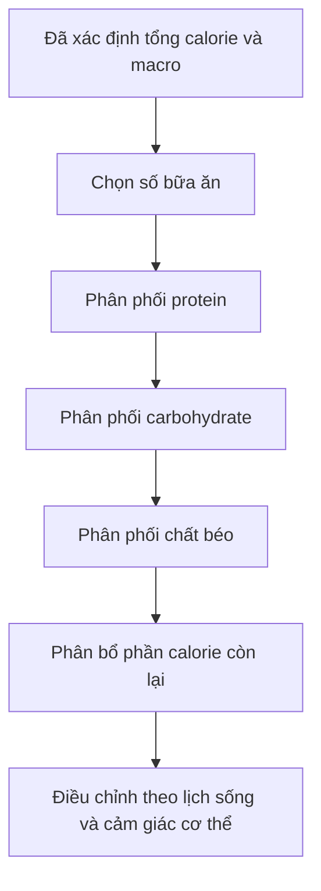
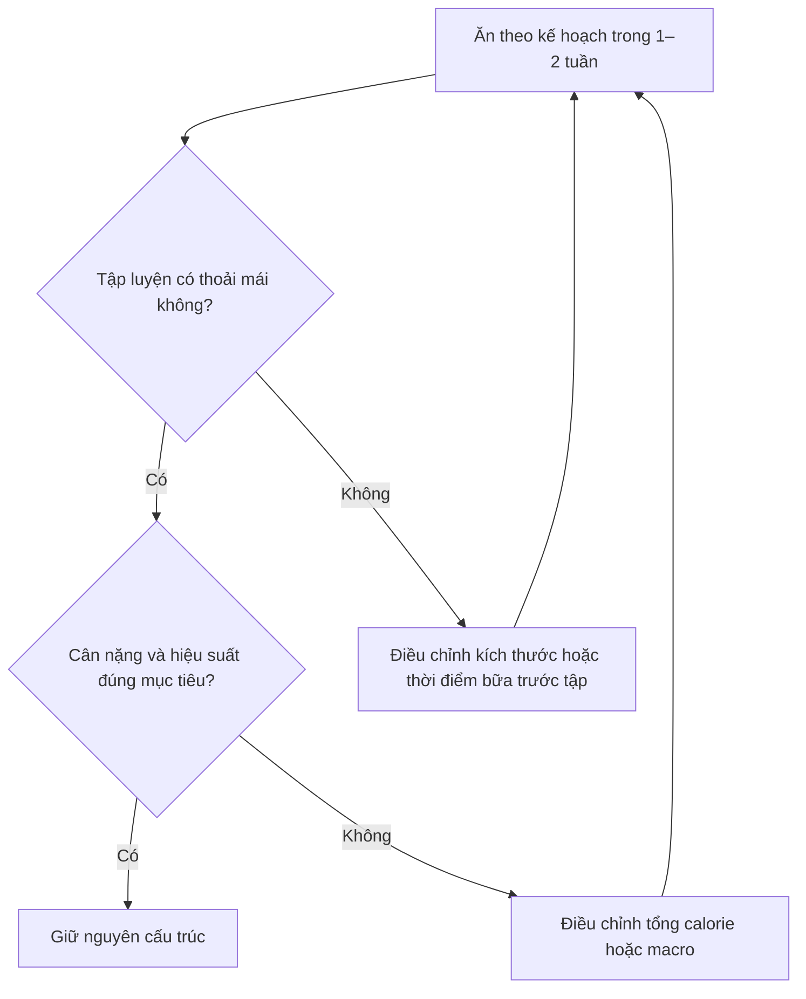

# 040 — Finding Your Ideal Meal Structure

| Thuộc tính              | Nội dung                                         |
| ----------------------- | ------------------------------------------------ |
| **Module**              | Module 04 — Setting Up Your Diet                 |
| **Bài học**             | Finding Your Ideal Meal Structure                |
| **Thời lượng**          | 03:11                                            |
| **Chủ đề chính**        | Xác định cấu trúc bữa ăn phù hợp                 |
| **Ví dụ trong bài**     | Nam, 25 tuổi, nặng 180 lb — khoảng 81,6 kg       |
| **Mục tiêu năng lượng** | 2.600 kcal/ngày                                  |
| **Macro nền**           | 145 g protein, 270 g carbohydrate, 60 g chất béo |

> **Ý tưởng cốt lõi:** Sau khi xác định tổng calorie và macro trong ngày, bước tiếp theo là phân phối chúng vào các bữa ăn sao cho phù hợp với lịch sinh hoạt, khả năng tiêu hóa và thời gian tập luyện.


*Nguồn ảnh: [Healthy Meal Prep — Wikimedia Commons](https://commons.wikimedia.org/wiki/File:Healthy_Meal_Prep_%28Unsplash%29.jpg), ảnh thuộc phạm vi công cộng/CC0.*

---

## Mục lục

1. [Mục tiêu bài học](#1-mục-tiêu-bài-học)
2. [Nội dung chính](#2-nội-dung-chính)
3. [Áp dụng thực tế](#3-áp-dụng-thực-tế)
4. [Lưu ý và lỗi thường gặp](#4-lưu-ý-và-lỗi-thường-gặp)
5. [Checklist thực hành](#5-checklist-thực-hành)
6. [Tóm tắt](#6-tóm-tắt)
7. [Tài liệu tham khảo](#7-tài-liệu-tham-khảo)

---

## 1. Mục tiêu bài học

Sau bài học này, người học có thể:

* Hiểu **cấu trúc bữa ăn** là gì.
* Chọn số bữa ăn phù hợp với lịch sinh hoạt.
* Phân phối protein, carbohydrate và chất béo trong ngày.
* Ưu tiên protein và carbohydrate quanh buổi tập mà không quá ám ảnh về thời điểm chính xác.
* Tạo một kế hoạch ăn uống thực tế từ mục tiêu calorie và macro đã xác định.
* Biết cách gộp hoặc chia bữa mà không làm thay đổi tổng lượng dinh dưỡng trong ngày.

---

## 2. Nội dung chính

### 2.1. Cấu trúc bữa ăn là gì?

**Cấu trúc bữa ăn** là cách sắp xếp tổng lượng thức ăn trong ngày thành các bữa cụ thể.

Theo bài học, cấu trúc này được xây dựng từ bốn biến số:

1. **Số bữa ăn mỗi ngày**
2. **Phân phối protein quanh hoạt động tập luyện**
3. **Phân phối carbohydrate quanh hoạt động tập luyện**
4. **Phân phối chất béo quanh hoạt động tập luyện**



Thứ tự ưu tiên thực tế nên là:

```text
Tổng calorie
      ↓
Tổng protein
      ↓
Tổng carbohydrate và chất béo
      ↓
Phân phối giữa các bữa
      ↓
Thời điểm chính xác của từng bữa
```

Nói cách khác, **ăn đủ tổng lượng cần thiết trong ngày quan trọng hơn việc ăn đúng từng phút**.

---

### 2.2. Bước 1 — Chọn số bữa ăn

Bài học cho rằng khoảng **3–8 bữa mỗi ngày** đều có thể thực hiện được. Ví dụ trong bài sử dụng **5 bữa/ngày**.

Tuy nhiên, số bữa không phải là một con số bắt buộc.

|            Số bữa | Đặc điểm phù hợp                                                      |
| ----------------: | --------------------------------------------------------------------- |
|         **2 bữa** | Phù hợp người thích nhịn ăn gián đoạn nhưng mỗi bữa phải khá lớn      |
|         **3 bữa** | Đơn giản, dễ duy trì, phù hợp lịch sinh hoạt thông thường             |
|         **4 bữa** | Dễ phân phối protein và kiểm soát cảm giác đói                        |
|         **5 bữa** | Thuận tiện khi có bữa trước và sau tập riêng                          |
| **6 bữa trở lên** | Hữu ích khi cần ăn nhiều calorie nhưng khó ăn lượng lớn trong một lần |

Khi tổng calorie và protein được giữ giống nhau, tăng số bữa không tự động làm tăng tốc độ trao đổi chất hoặc giảm mỡ nhiều hơn. Số bữa chủ yếu nên được lựa chọn theo cảm giác đói, khả năng tiêu hóa, lịch làm việc và mức độ dễ tuân thủ.

> **Quy tắc thực hành:** Chọn số bữa ít nhất nhưng vẫn giúp anh ăn đủ calorie, đủ protein và tập luyện thoải mái.

#### Nếu ăn ít hơn 5 bữa

Có thể gộp hai bữa lại với nhau.

Ví dụ:

```text
Kế hoạch 5 bữa:
Bữa 1 + Bữa 2 + Bữa trước tập + Bữa sau tập + Bữa 5

Chuyển thành 4 bữa:
Bữa 1 lớn hơn + Bữa trước tập + Bữa sau tập + Bữa tối

Chuyển thành 3 bữa:
Bữa sáng + Bữa trước/sau tập kết hợp + Bữa tối
```

Khi gộp bữa, tổng macro trong ngày không thay đổi.

---

### 2.3. Bước 2 — Phân phối protein

Ví dụ trong bài có:

* **Tổng protein:** 145 g/ngày
* **Cân nặng mục tiêu:** 180 lb
* **Protein trước tập:** khoảng 0,2 g/lb
* **Protein sau tập:** khoảng 0,2 g/lb

#### Tính protein trước và sau tập

```text
180 lb × 0,2 g/lb = 36 g protein
```

Bài học làm tròn thành:

* **35 g protein trước tập**
* **35 g protein sau tập**

Tổng protein dành cho hai bữa quanh buổi tập:

```text
35 + 35 = 70 g
```

Protein còn lại:

```text
145 − 70 = 75 g
```

Nếu còn ba bữa khác:

```text
75 ÷ 3 = 25 g protein mỗi bữa
```

#### Phân phối protein hoàn chỉnh

| Bữa           |   Protein |
| ------------- | --------: |
| Bữa 1         |      25 g |
| Bữa 2         |      25 g |
| Bữa trước tập |      35 g |
| Bữa sau tập   |      35 g |
| Bữa 5         |      25 g |
| **Tổng**      | **145 g** |

Các hướng dẫn của ISSN đề xuất một khẩu phần thường có khoảng **20–40 g protein chất lượng cao**, tương đương khoảng 0,25 g/kg hoặc cao hơn tùy cân nặng, loại buổi tập và mục tiêu. Phân phối các khẩu phần vừa phải cách nhau khoảng 3–4 giờ là một chiến lược hợp lý, nhưng tổng protein cả ngày vẫn là yếu tố ưu tiên.

> **Không cần hiểu sai rằng:** thiếu đúng 35 g ngay sau tập sẽ làm mất cơ. Bữa trước và sau tập chỉ là hai cơ hội thuận tiện để bổ sung protein.

---

### 2.4. Hình nghiên cứu — Phân phối protein giữa các bữa


*Nguồn: McKendry và cộng sự, 2020 — [Nutritional Supplements to Support Resistance Exercise in Countering the Sarcopenia of Aging](https://www.mdpi.com/2072-6643/12/7/2057), giấy phép CC BY 4.0.*

Biểu đồ so sánh các cách phân phối protein khác nhau giữa bữa sáng, bữa trưa, bữa tối và bữa phụ.

Điểm cần lưu ý:

* Phân phối đều không có nghĩa là mỗi bữa phải giống hệt nhau.
* Nếu tổng protein quá thấp, chia đều vẫn có thể khiến từng bữa không cung cấp đủ protein.
* Một bữa tối rất giàu protein không hoàn toàn bù được việc bữa sáng và bữa trưa gần như không có protein.
* Hình nghiên cứu trên tập trung vào người lớn tuổi, vì vậy không nên sao chép ngưỡng trong biểu đồ một cách máy móc cho người trẻ; giá trị chính của hình là minh họa nguyên tắc **tổng lượng và phân phối phải được xem xét cùng nhau**.

---

### 2.5. Bước 3 — Phân phối carbohydrate

Carbohydrate cung cấp năng lượng cho các hoạt động cường độ vừa đến cao và góp phần duy trì lượng glycogen trong cơ.

Ví dụ trong bài:

* **Tổng carbohydrate:** 270 g/ngày
* **Trước tập:** 0,3 g/lb
* **Sau tập:** 0,4 g/lb

#### Carbohydrate trước tập

```text
180 lb × 0,3 g/lb = 54 g carbohydrate
```

#### Carbohydrate sau tập

```text
180 lb × 0,4 g/lb = 72 g carbohydrate
```

#### Lượng carbohydrate còn lại

```text
270 − 54 − 72 = 144 g
```

Chia đều cho ba bữa còn lại:

```text
144 ÷ 3 = 48 g carbohydrate mỗi bữa
```

#### Phân phối carbohydrate hoàn chỉnh

| Bữa           | Carbohydrate |
| ------------- | -----------: |
| Bữa 1         |         48 g |
| Bữa 2         |         48 g |
| Bữa trước tập |         54 g |
| Bữa sau tập   |         72 g |
| Bữa 5         |         48 g |
| **Tổng**      |    **270 g** |

Các con số 0,3 và 0,4 g/lb là **hướng dẫn thực hành của bài học**, không phải ngưỡng bắt buộc đối với mọi người.

Nhu cầu ưu tiên carbohydrate quanh buổi tập tăng lên khi:

* Buổi tập dài hoặc có khối lượng lớn.
* Tập nhiều nhóm cơ.
* Tập hai buổi trong ngày.
* Có thời gian phục hồi ngắn giữa hai buổi.
* Thực hiện môn sức bền hoặc hoạt động cường độ cao kéo dài.
* Người tập cảm thấy thiếu năng lượng khi vào buổi tập.

Đối với một buổi tập tạ thông thường, tác dụng của việc thay đổi chính xác thời điểm carbohydrate chưa hoàn toàn nhất quán; tổng lượng carbohydrate phù hợp với khối lượng vận động vẫn quan trọng hơn.

---

### 2.6. Bước 4 — Phân phối chất béo

Ví dụ trong bài sử dụng:

* **Tổng chất béo:** 60 g/ngày
* **Số bữa:** 5

Chia đều:

```text
60 ÷ 5 = 12 g chất béo mỗi bữa
```

| Bữa           | Chất béo |
| ------------- | -------: |
| Bữa 1         |     12 g |
| Bữa 2         |     12 g |
| Bữa trước tập |     12 g |
| Bữa sau tập   |     12 g |
| Bữa 5         |     12 g |
| **Tổng**      | **60 g** |

#### Có cần tránh hoàn toàn chất béo trước tập không?

Không nhất thiết.

Một lượng chất béo vừa phải thường không phải vấn đề nếu bữa ăn cách buổi tập đủ xa. Tuy nhiên, bữa ăn rất nhiều chất béo ngay sát giờ tập có thể khiến một số người cảm thấy:

* No lâu.
* Nặng bụng.
* Ợ hoặc khó chịu tiêu hóa.
* Giảm cảm giác nhanh nhẹn khi tập.

Nếu ăn trước tập khoảng 2–3 giờ, bữa ăn có thể chứa chất béo bình thường. Nếu chỉ còn 30–60 phút, nên ưu tiên thức ăn dễ tiêu hóa và giảm lượng chất béo theo khả năng dung nạp cá nhân.

Bằng chứng nghiên cứu về **thời điểm ăn chất béo** còn hạn chế hơn đáng kể so với nghiên cứu về protein và carbohydrate. Vì vậy, không nên biến quy tắc “ít chất béo trước tập” thành một lệnh cấm tuyệt đối.

---

### 2.7. Cấu trúc 5 bữa theo ví dụ trong bài

| Bữa           |   Protein | Carbohydrate | Chất béo | Năng lượng ước tính |
| ------------- | --------: | -----------: | -------: | ------------------: |
| Bữa 1         |      25 g |         48 g |     12 g |            400 kcal |
| Bữa 2         |      25 g |         48 g |     12 g |            400 kcal |
| Bữa trước tập |      35 g |         54 g |     12 g |            464 kcal |
| Bữa sau tập   |      35 g |         72 g |     12 g |            536 kcal |
| Bữa 5         |      25 g |         48 g |     12 g |            400 kcal |
| **Tổng**      | **145 g** |    **270 g** | **60 g** |      **2.200 kcal** |

Cách tính:

```text
Protein:      145 × 4 = 580 kcal
Carbohydrate: 270 × 4 = 1.080 kcal
Chất béo:      60 × 9 = 540 kcal

Tổng: 580 + 1.080 + 540 = 2.200 kcal
```

Trong khi mục tiêu là 2.600 kcal:

```text
2.600 − 2.200 = 400 kcal còn lại
```

Phần năng lượng còn lại có thể được bổ sung bằng carbohydrate, chất béo hoặc kết hợp cả hai.

---

### 2.8. Ba cách bổ sung 400 kcal còn lại

#### Phương án A — Ưu tiên carbohydrate

```text
400 ÷ 4 = 100 g carbohydrate
```

Macro cuối ngày:

| Chất dinh dưỡng | Tổng lượng |
| --------------- | ---------: |
| Protein         |      145 g |
| Carbohydrate    |      370 g |
| Chất béo        |       60 g |
| Năng lượng      | 2.600 kcal |

Phù hợp khi:

* Tập với khối lượng lớn.
* Cần nhiều năng lượng cho buổi tập.
* Dễ tiêu hóa carbohydrate.
* Không gặp khó khăn khi ăn lượng thực phẩm lớn.

#### Phương án B — Kết hợp carbohydrate và chất béo

Ví dụ:

```text
55 g carbohydrate × 4 = 220 kcal
20 g chất béo × 9       = 180 kcal

Tổng = 400 kcal
```

Macro cuối ngày:

| Chất dinh dưỡng | Tổng lượng |
| --------------- | ---------: |
| Protein         |      145 g |
| Carbohydrate    |      325 g |
| Chất béo        |       80 g |
| Năng lượng      | 2.600 kcal |

Đây thường là lựa chọn cân bằng và dễ xây dựng thực đơn hơn.

#### Phương án C — Ưu tiên chất béo

```text
400 ÷ 9 ≈ 44 g chất béo
```

Macro cuối ngày:

| Chất dinh dưỡng |        Tổng lượng |
| --------------- | ----------------: |
| Protein         |             145 g |
| Carbohydrate    |             270 g |
| Chất béo        |      khoảng 104 g |
| Năng lượng      | khoảng 2.600 kcal |

Phù hợp với người:

* Khó ăn lượng lớn carbohydrate.
* Thích thực phẩm giàu chất béo.
* Cần tăng mật độ calorie của bữa ăn.

Tuy nhiên, không nên đổ toàn bộ lượng chất béo bổ sung vào bữa ăn ngay trước khi tập nếu điều đó gây nặng bụng.

---

## 3. Áp dụng thực tế

### 3.1. Ví dụ hoàn chỉnh — Bổ sung 400 kcal bằng carbohydrate

Để đơn giản, có thể cộng thêm **20 g carbohydrate vào mỗi bữa**:

```text
20 g × 5 bữa = 100 g carbohydrate
100 g carbohydrate = 400 kcal
```

| Bữa           |   Protein | Carbohydrate | Chất béo |     Năng lượng |
| ------------- | --------: | -----------: | -------: | -------------: |
| Bữa 1         |      25 g |         68 g |     12 g |       480 kcal |
| Bữa 2         |      25 g |         68 g |     12 g |       480 kcal |
| Bữa trước tập |      35 g |         74 g |     12 g |       544 kcal |
| Bữa sau tập   |      35 g |         92 g |     12 g |       616 kcal |
| Bữa 5         |      25 g |         68 g |     12 g |       480 kcal |
| **Tổng**      | **145 g** |    **370 g** | **60 g** | **2.600 kcal** |

Đây chỉ là một ví dụ toán học. Trong thực tế, không bắt buộc phải cộng đúng 20 g vào từng bữa.

Có thể phân phối phần còn lại theo sở thích:

* Ăn sáng nhiều hơn nếu thường đói vào buổi sáng.
* Dồn thêm carbohydrate vào trước và sau tập.
* Dành một phần calorie cho bữa ăn cùng gia đình.
* Tạo một bữa nhẹ trước khi ngủ.
* Tăng chất béo ở những bữa cách xa thời gian tập.

---

### 3.2. Ví dụ thực phẩm cho từng bữa

| Bữa           | Cấu trúc gợi ý                                | Ví dụ thực phẩm                                  |
| ------------- | --------------------------------------------- | ------------------------------------------------ |
| **Bữa 1**     | Protein + carb + chất béo + trái cây          | Yến mạch, sữa chua, trứng, chuối, hạt            |
| **Bữa 2**     | Protein + carb + rau                          | Cơm, thịt gà, rau xanh, dầu ô liu                |
| **Trước tập** | Protein nạc + carb dễ tiêu, chất béo vừa phải | Cơm và ức gà; bánh mì và sữa chua; chuối và whey |
| **Sau tập**   | Protein + lượng carb tương đối cao            | Cơm, thịt nạc, khoai tây, trái cây               |
| **Bữa 5**     | Protein + carb + rau + chất béo tốt           | Cá, đậu phụ, cơm, rau, quả bơ                    |

> Thực phẩm cụ thể có thể thay đổi. Điều cần duy trì là tổng calorie, protein và các nhóm dinh dưỡng chính.

---

### 3.3. Cách chọn thời gian bữa trước tập

| Thời gian trước tập | Cấu trúc phù hợp                                                                 |
| ------------------: | -------------------------------------------------------------------------------- |
|         **3–4 giờ** | Bữa ăn đầy đủ protein, carbohydrate, rau và chất béo                             |
|         **2–3 giờ** | Bữa vừa phải, giảm bớt thực phẩm quá nhiều chất béo hoặc chất xơ nếu dễ đầy bụng |
|         **1–2 giờ** | Protein và carbohydrate dễ tiêu, khẩu phần nhỏ hơn                               |
|    **Dưới 60 phút** | Đồ ăn nhẹ hoặc dạng lỏng, tùy khả năng dung nạp                                  |

Ví dụ dưới 60 phút:

* Chuối và sữa chua.
* Whey và trái cây.
* Bánh mì mềm với một nguồn protein nhẹ.
* Sữa hoặc đồ uống cung cấp protein và carbohydrate.

---

### 3.4. Mô hình điều chỉnh cấu trúc bữa ăn



Nên đánh giá kế hoạch dựa trên:

* Cảm giác đói.
* Năng lượng trong buổi tập.
* Hiệu suất tập luyện.
* Tiêu hóa.
* Chất lượng giấc ngủ.
* Xu hướng cân nặng trung bình.
* Khả năng duy trì kế hoạch lâu dài.

---

## 4. Lưu ý và lỗi thường gặp

### 4.1. Cho rằng phải ăn đúng 5 bữa

Năm bữa chỉ là cấu trúc được sử dụng trong ví dụ.

Một người ăn ba hoặc bốn bữa vẫn có thể đạt kết quả tốt nếu:

* Ăn đủ tổng calorie.
* Ăn đủ protein.
* Có các bữa đủ lớn để đáp ứng macro.
* Duy trì được kế hoạch lâu dài.

---

### 4.2. Cố làm cho mọi bữa giống hệt nhau

Phân phối đều là công cụ giúp đơn giản hóa, không phải quy định bắt buộc.

Ví dụ, lịch sinh hoạt có thể phù hợp với:

```text
Bữa sáng vừa
Bữa trưa lớn
Bữa trước tập vừa
Bữa sau tập lớn
Bữa tối nhỏ
```

Hoặc:

```text
Bữa sáng lớn
Bữa trưa vừa
Bữa trước tập nhỏ
Bữa sau tập lớn
Bữa tối vừa
```

Tổng cả ngày mới là điều cần kiểm tra trước tiên.

---

### 4.3. Quá ám ảnh về “cửa sổ đồng hóa”

Không cần uống protein trong vài phút ngay sau khi hoàn thành hiệp cuối cùng.

Tổng protein trong ngày là yếu tố quan trọng hơn thời điểm chính xác. Protein trước hoặc sau tập đều có giá trị; tác dụng đồng hóa của buổi tập kéo dài nhiều giờ chứ không đóng lại ngay lập tức.

---

### 4.4. Ăn bữa quá lớn sát giờ tập

Một bữa lớn chứa nhiều:

* Chất béo.
* Chất xơ.
* Rau sống.
* Thức ăn cay.
* Nước sốt đậm đặc.

có thể gây khó chịu nếu ăn quá gần buổi tập.

Cách xử lý:

* Ăn bữa chính sớm hơn.
* Giảm khẩu phần.
* Chọn carb và protein dễ tiêu.
* Theo dõi phản ứng cá nhân thay vì áp dụng cứng nhắc.

---

### 4.5. Chỉ tập trung vào macro mà bỏ qua chất lượng thực phẩm

Một cấu trúc bữa ăn tốt không chỉ đạt đủ protein, carb và fat mà còn cần:

* Rau và trái cây.
* Chất xơ.
* Vitamin và khoáng chất.
* Nguồn chất béo không bão hòa.
* Đa dạng nguồn protein.
* Đủ nước.

Macro chính xác không tự động biến một chế độ ăn ít vi chất thành chế độ ăn tối ưu.

---

### 4.6. Dùng “cân nặng mục tiêu” không hợp lý

Công thức trong bài sử dụng cân nặng mục tiêu.

Nếu cân nặng mục tiêu khác rất xa cân nặng hiện tại, áp dụng trực tiếp công thức theo pound có thể tạo ra con số không thực tế.

Nên kết hợp:

* Cân nặng hiện tại.
* Khối lượng cơ thể không mỡ nếu có.
* Mục tiêu tăng cơ hoặc giảm mỡ.
* Khối lượng tập luyện.
* Khả năng tiêu hóa.
* Tổng protein đã xác định ở bài học trước.

---

### 4.7. Quên tính calorie từ đồ uống và gia vị

Các nguồn dễ bị bỏ sót gồm:

* Dầu ăn.
* Bơ đậu phộng.
* Sữa.
* Đường trong đồ uống.
* Nước sốt.
* Các loại hạt.
* Đồ uống thể thao.
* Sinh tố và cà phê pha nhiều nguyên liệu.

Sai số nhỏ ở mỗi bữa có thể tạo thành sai số lớn vào cuối ngày.

---

### 4.8. Cố đạt từng gram tuyệt đối

Không cần mỗi ngày đều đạt chính xác:

```text
145,0 g protein
370,0 g carbohydrate
60,0 g chất béo
```

Có thể sử dụng khoảng mục tiêu, chẳng hạn:

```text
Protein: 140–150 g
Carbohydrate: 350–390 g
Chất béo: 55–70 g
Calorie: xấp xỉ mục tiêu
```

Tính nhất quán trong nhiều tuần có giá trị hơn độ chính xác tuyệt đối của một ngày.

---

### 4.9. Không điều chỉnh theo phản hồi cơ thể

Cấu trúc lý thuyết cần được thay đổi nếu:

* Bữa trước tập khiến cơ thể nặng nề.
* Bữa sau tập quá lớn và khó ăn.
* Quá đói vào buổi tối.
* Không ăn nổi vào buổi sáng.
* Khó duy trì khi đi học hoặc đi làm.
* Cân nặng không thay đổi theo mục tiêu.
* Hiệu suất tập luyện giảm liên tục.

---

### 4.10. Trường hợp cần tư vấn chuyên môn

Người mắc bệnh thận, bệnh gan, tiểu đường, rối loạn tiêu hóa, có tiền sử rối loạn ăn uống hoặc đang mang thai không nên áp dụng máy móc kế hoạch macro mẫu. Cần trao đổi với bác sĩ hoặc chuyên gia dinh dưỡng có chuyên môn phù hợp.

---

## 5. Checklist thực hành

### Bước 1 — Xác nhận mục tiêu ngày

* [ ] Đã xác định calorie mục tiêu.
* [ ] Đã xác định protein mục tiêu.
* [ ] Đã xác định carbohydrate mục tiêu.
* [ ] Đã xác định chất béo mục tiêu.
* [ ] Tổng calorie từ macro đã khớp với calorie mục tiêu.

### Bước 2 — Chọn số bữa

* [ ] Số bữa phù hợp với lịch làm việc hoặc học tập.
* [ ] Không phải ép bản thân ăn quá thường xuyên.
* [ ] Mỗi bữa đủ lớn để cung cấp lượng protein hợp lý.
* [ ] Kế hoạch có thể duy trì trong cuối tuần và ngày bận rộn.

### Bước 3 — Phân phối protein

* [ ] Mỗi bữa chính có một nguồn protein.
* [ ] Có protein trong khoảng thời gian trước hoặc sau tập.
* [ ] Không dồn gần như toàn bộ protein vào một bữa.
* [ ] Tổng protein cuối ngày đạt mục tiêu.

### Bước 4 — Phân phối carbohydrate

* [ ] Có carbohydrate trước tập nếu cần năng lượng.
* [ ] Có carbohydrate sau tập nếu cần phục hồi.
* [ ] Lượng carb phù hợp với cường độ và khối lượng tập.
* [ ] Đã bổ sung rau, trái cây và thực phẩm giàu chất xơ.

### Bước 5 — Phân phối chất béo

* [ ] Đạt tổng lượng chất béo trong ngày.
* [ ] Ưu tiên nguồn chất béo chất lượng.
* [ ] Không ăn bữa quá nhiều chất béo ngay sát giờ tập nếu dễ nặng bụng.
* [ ] Không loại bỏ hoàn toàn chất béo khỏi bữa trước hoặc sau tập một cách máy móc.

### Bước 6 — Theo dõi và điều chỉnh

* [ ] Theo dõi kế hoạch ít nhất 1–2 tuần.
* [ ] Ghi lại cảm giác đói và năng lượng khi tập.
* [ ] Theo dõi xu hướng cân nặng thay vì một lần cân đơn lẻ.
* [ ] Điều chỉnh tổng calorie trước khi thay đổi quá nhiều chi tiết nhỏ.
* [ ] Giữ cấu trúc đơn giản và dễ lặp lại.

---

## 6. Tóm tắt

Cấu trúc bữa ăn là cách biến mục tiêu calorie và macro trong ngày thành các bữa ăn cụ thể.

Bốn thành phần cần xem xét gồm:

```text
Số bữa
+ Protein quanh buổi tập
+ Carbohydrate quanh buổi tập
+ Chất béo quanh buổi tập
= Cấu trúc bữa ăn
```

Trong ví dụ 5 bữa:

| Bữa          |   Protein |      Carb | Chất béo |
| ------------ | --------: | --------: | -------: |
| Bữa 1        |      25 g |      48 g |     12 g |
| Bữa 2        |      25 g |      48 g |     12 g |
| Trước tập    |      35 g |      54 g |     12 g |
| Sau tập      |      35 g |      72 g |     12 g |
| Bữa 5        |      25 g |      48 g |     12 g |
| **Tổng nền** | **145 g** | **270 g** | **60 g** |

Cấu trúc nền cung cấp khoảng **2.200 kcal**, vì vậy cần bổ sung thêm khoảng **400 kcal** từ carbohydrate, chất béo hoặc cả hai để đạt mục tiêu 2.600 kcal.

### Nguyên tắc quan trọng nhất

> **Cấu trúc bữa ăn tốt nhất không phải là cấu trúc phức tạp nhất, mà là cấu trúc giúp anh ăn đủ dinh dưỡng, tập luyện tốt và có thể duy trì lâu dài.**

Mức độ ưu tiên:

1. Đạt tổng calorie phù hợp.
2. Đạt tổng protein.
3. Đạt carbohydrate và chất béo.
4. Chọn số bữa dễ duy trì.
5. Phân phối protein tương đối hợp lý.
6. Ưu tiên carb quanh buổi tập khi cần.
7. Điều chỉnh thời điểm ăn theo khả năng tiêu hóa.

---

## 7. Tài liệu tham khảo

1. Jäger R. và cộng sự. **International Society of Sports Nutrition Position Stand: Protein and Exercise.** Journal of the International Society of Sports Nutrition, 2017.
   https://jissn.biomedcentral.com/articles/10.1186/s12970-017-0177-8

2. Kerksick C.M. và cộng sự. **International Society of Sports Nutrition Position Stand: Nutrient Timing.** Journal of the International Society of Sports Nutrition, 2017.
   https://jissn.biomedcentral.com/articles/10.1186/s12970-017-0189-4

3. La Bounty P.M. và cộng sự. **International Society of Sports Nutrition Position Stand: Meal Frequency.** Journal of the International Society of Sports Nutrition, 2011.
   https://jissn.biomedcentral.com/articles/10.1186/1550-2783-8-4

4. Schoenfeld B.J., Aragon A.A., Krieger J.W. **The Effect of Protein Timing on Muscle Strength and Hypertrophy: A Meta-analysis.** Journal of the International Society of Sports Nutrition, 2013.
   https://pmc.ncbi.nlm.nih.gov/articles/PMC3879660/

5. Areta J.L. và cộng sự. **Timing and Distribution of Protein Ingestion During Prolonged Recovery from Resistance Exercise Alters Myofibrillar Protein Synthesis.** The Journal of Physiology, 2013.
   https://pmc.ncbi.nlm.nih.gov/articles/PMC3650697/

6. McKendry J. và cộng sự. **Nutritional Supplements to Support Resistance Exercise in Countering the Sarcopenia of Aging.** Nutrients, 2020.
   https://www.mdpi.com/2072-6643/12/7/2057
