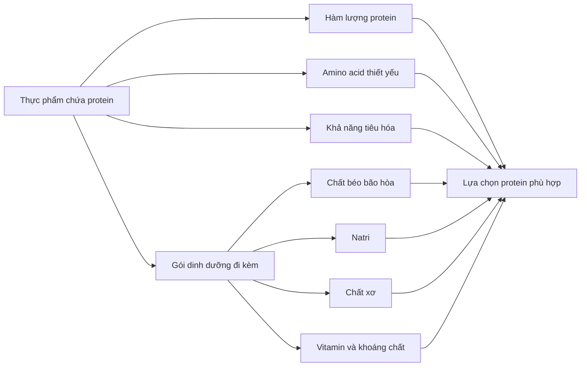
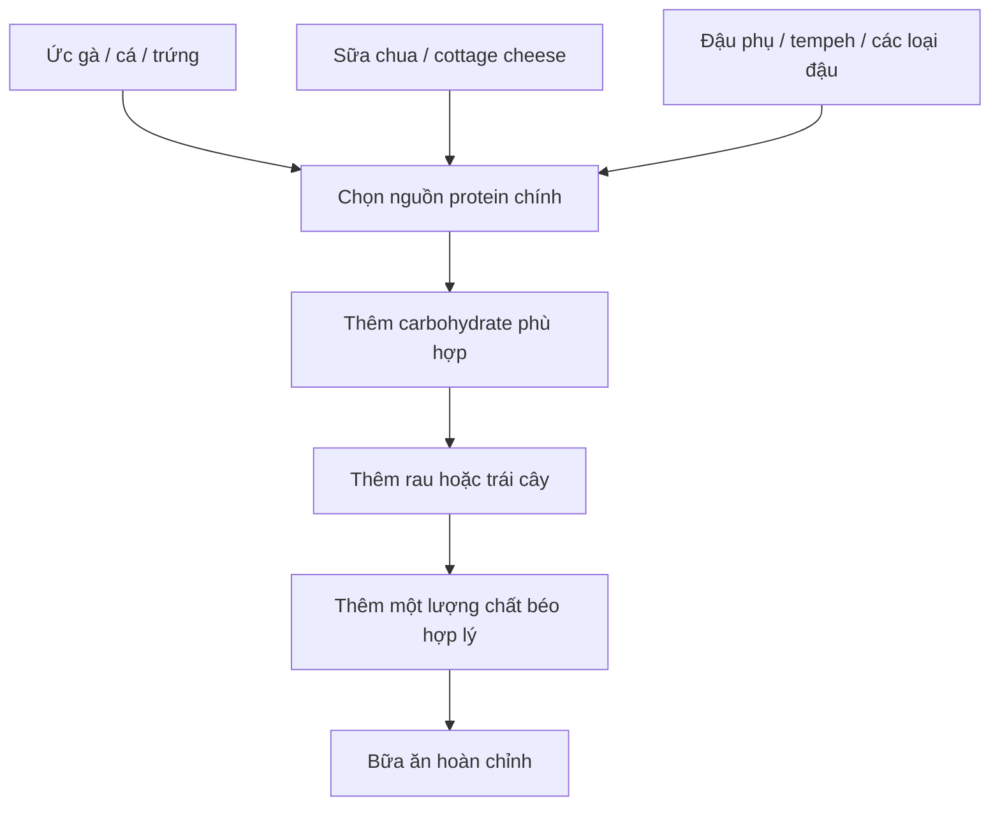

[](https://jn.nutrition.org/article/S0022-3166%2825%2900428-6/fulltext?utm_source=chatgpt.com)

# 041 — Quality Protein Sources

| Thuộc tính       | Nội dung                         |
| ---------------- | -------------------------------- |
| **Module**       | Module 04 — Setting Up Your Diet |
| **Bài học**      | Quality Protein Sources          |
| **Thời lượng**   | 01:08                            |
| **Chủ đề chính** | Các nguồn protein chất lượng     |


> **Ảnh minh họa:** Một số nguồn protein phổ biến từ động vật và thực vật. Nguồn: Wikimedia Commons, giấy phép CC BY-SA 4.0. 

## Mục lục

1. [Mục tiêu bài học](#1-mục-tiêu-bài-học)
2. [Nội dung chính](#2-nội-dung-chính)
3. [Áp dụng thực tế](#3-áp-dụng-thực-tế)
4. [Lưu ý & lỗi thường gặp](#4-lưu-ý--lỗi-thường-gặp)
5. [Checklist thực hành](#5-checklist-thực-hành)
6. [Tóm tắt](#6-tóm-tắt)

---

## 1. Mục tiêu bài học

Sau bài học này, bạn có thể:

* Nhận biết những nhóm thực phẩm giàu protein phổ biến.
* Phân biệt **thực phẩm có protein** với **nguồn protein chủ lực**.
* Hiểu rằng chất lượng protein không chỉ phụ thuộc vào số gam protein, mà còn liên quan đến:

  * thành phần amino acid thiết yếu;
  * khả năng tiêu hóa và hấp thu;
  * chất béo, chất xơ, natri và các dưỡng chất đi kèm.
* Lựa chọn nguồn protein phù hợp với mục tiêu tăng cơ, giảm mỡ, duy trì sức khỏe hoặc ăn chay.
* Xây dựng mỗi bữa ăn quanh một nguồn protein chính.

---

## 2. Nội dung chính

### 2.1. Thế nào là một nguồn protein chất lượng?

Một nguồn protein tốt thường được đánh giá dựa trên ba yếu tố chính:

1. **Cung cấp đủ protein trong khẩu phần thực tế.**
2. **Có thành phần amino acid phù hợp**, đặc biệt là các amino acid thiết yếu mà cơ thể không tự tổng hợp được.
3. **Có khả năng tiêu hóa và hấp thu tốt.**

FAO mô tả chất lượng protein là khả năng của protein trong thực phẩm đáp ứng nhu cầu về amino acid thiết yếu và nitơ của cơ thể. FAO cũng đề xuất phương pháp **DIAAS — Digestible Indispensable Amino Acid Score** để đánh giá chất lượng protein dựa trên từng amino acid thiết yếu và khả năng tiêu hóa ở ruột non. ([FAOHome][1])



> **Ghi nhớ:** “Nhiều protein” chưa chắc đồng nghĩa với “nên ăn thường xuyên”. Cần xem xét toàn bộ **gói dinh dưỡng** đi kèm với thực phẩm đó.

---

### 2.2. Sữa, chế phẩm từ sữa và trứng

Các lựa chọn phổ biến gồm:

| Thực phẩm           | Đặc điểm                                                          | Cách sử dụng                                 |
| ------------------- | ----------------------------------------------------------------- | -------------------------------------------- |
| **Sữa chua Hy Lạp** | Giàu protein, dễ kết hợp với trái cây và yến mạch                 | Bữa sáng hoặc bữa phụ                        |
| **Phô mai cottage** | Tỷ lệ protein tương đối cao                                       | Ăn cùng trái cây, bánh mì hoặc salad         |
| **Trứng**           | Protein hoàn chỉnh, tiện lợi và dễ chế biến                       | Luộc, hấp, chiên ít dầu                      |
| **Sữa**             | Cung cấp protein cùng calcium và một số vi chất                   | Uống trực tiếp hoặc pha cùng yến mạch        |
| **Whey protein**    | Nguồn protein tiện lợi từ sữa                                     | Dùng khi khó đáp ứng đủ protein bằng thức ăn |
| **Phô mai Thụy Sĩ** | Có protein nhưng cũng có thể chứa nhiều chất béo bão hòa và natri | Dùng với khẩu phần vừa phải                  |

Protein động vật như trứng, sữa, thịt và cá thường cung cấp đầy đủ các amino acid thiết yếu. Tuy nhiên, cần xem xét lượng chất béo bão hòa, natri và năng lượng đi kèm thay vì chỉ nhìn vào hàm lượng protein. ([The Nutrition Source][2])

> Whey protein là một lựa chọn **tiện lợi**, không phải thành phần bắt buộc. Người ăn uống bình thường vẫn có thể đáp ứng nhu cầu protein bằng thực phẩm nguyên dạng.

---

### 2.3. Thịt nạc và gia cầm

Các lựa chọn được nhắc đến trong bài học gồm:

* Thịt bò nạc.
* Bít tết từ phần thịt ít mỡ.
* Thịt bò xay loại nạc.
* Sườn hoặc thăn heo ít mỡ.
* Ức gà.
* Ức gà tây.

#### Cách lựa chọn tốt hơn

| Nên ưu tiên                            | Nên hạn chế                                  |
| -------------------------------------- | -------------------------------------------- |
| Thịt tươi, ít mỡ nhìn thấy             | Thịt có nhiều mỡ xen kẽ                      |
| Ức gà bỏ da                            | Gà chiên ngập dầu                            |
| Thịt bò xay có tỷ lệ nạc cao           | Xúc xích và thịt xay chế biến sẵn            |
| Hấp, luộc, áp chảo hoặc nướng vừa phải | Chiên cháy hoặc nướng cháy cạnh thường xuyên |
| Khẩu phần vừa đủ                       | Xem thịt đỏ là nguồn protein duy nhất        |

Thịt đỏ có thể cung cấp nhiều protein, sắt và vitamin B12, nhưng không nên là lựa chọn duy nhất mỗi ngày. Harvard khuyến nghị ưu tiên cá, gia cầm, đậu và các loại hạt; hạn chế thịt đỏ và tránh dùng thường xuyên các loại thịt chế biến như thịt nguội, xúc xích và bacon. ([The Nutrition Source][2])

---

### 2.4. Cá và hải sản

Các nguồn protein từ hải sản được đề cập gồm:

| Thực phẩm          | Điểm nổi bật                                                  |
| ------------------ | ------------------------------------------------------------- |
| **Cá ngừ**         | Nhiều protein, ít carbohydrate, tiện lợi khi đóng hộp         |
| **Cá bơn halibut** | Thịt nạc, giàu protein                                        |
| **Cá hồi**         | Cung cấp protein cùng chất béo omega-3                        |
| **Cá rô phi**      | Protein nạc, hương vị nhẹ                                     |
| **Cá mòi**         | Protein, omega-3 và calcium nếu ăn cả xương mềm               |
| **Cá cơm**         | Giàu protein nhưng loại muối hoặc đóng hộp có thể nhiều natri |

Cá hồi là ví dụ cho một “gói protein” tốt: vừa cung cấp protein, vừa bổ sung chất béo omega-3. Trong bảng so sánh của Harvard, 4 oz cá hồi nướng cung cấp khoảng 30 g protein và lượng chất béo bão hòa thấp hơn so với một số phần thịt bò tương đương. ([The Nutrition Source][2])

---

### 2.5. Thực phẩm đóng hộp và thực phẩm tiện lợi

Một số lựa chọn tiện lợi gồm:

* Cá ngừ đóng hộp.
* Cá mòi đóng hộp.
* Cá cơm đóng hộp.
* Đậu đóng hộp.
* Thịt bò muối đóng hộp.
* Thịt khô hoặc jerky.

Các sản phẩm này có thể giúp chuẩn bị bữa ăn nhanh, nhưng cần kiểm tra:

* Hàm lượng natri.
* Lượng dầu hoặc nước sốt được thêm vào.
* Đường bổ sung.
* Chất béo bão hòa.
* Kích thước một khẩu phần.

> **Ưu tiên:** cá hoặc đậu đóng hộp ít muối, cá ngâm nước và các sản phẩm có danh sách nguyên liệu ngắn.

> **Hạn chế:** corned beef, jerky, xúc xích và thịt nguội vì đây thường là thực phẩm chế biến, có thể chứa nhiều natri. Một phần ham steak trong bảng minh họa của Harvard có lượng natri cao hơn rất nhiều so với cá hồi, thịt gà hoặc đậu lăng. ([The Nutrition Source][2])

---

### 2.6. Protein thực vật

Các nguồn protein phù hợp với chế độ ăn chay và thuần chay gồm:

* Các loại đậu.
* Đậu gà.
* Đậu lăng.
* Đậu nành và edamame.
* Đậu phụ.
* Tempeh.
* Các loại hạt.
* Bơ hạt.
* Hạt chia.
* Hạt bí.
* Hạt gai dầu.
* Một số loại ngũ cốc như quinoa và yến mạch.

Phần lớn protein thực vật có thể thiếu hoặc có hàm lượng thấp hơn ở một amino acid thiết yếu nào đó. Tuy nhiên, một chế độ ăn đa dạng gồm các loại đậu, sản phẩm từ đậu nành, hạt và ngũ cốc vẫn có thể cung cấp đầy đủ amino acid cần thiết. Đậu nành, tofu, tempeh và quinoa là những lựa chọn đặc biệt hữu ích trong thực đơn thiên về thực vật. ([The Nutrition Source][2])

#### Ví dụ kết hợp protein thực vật

| Nhóm 1       | Kết hợp với         | Ví dụ món ăn               |
| ------------ | ------------------- | -------------------------- |
| Đậu đen      | Cơm                 | Cơm đậu đen                |
| Đậu gà       | Bánh mì nguyên cám  | Bánh mì kẹp hummus         |
| Đậu lăng     | Khoai hoặc ngũ cốc  | Súp đậu lăng và bánh mì    |
| Đậu phụ      | Cơm hoặc mì         | Đậu phụ xào rau với cơm    |
| Bơ đậu phộng | Bánh mì nguyên cám  | Bánh mì bơ đậu phộng       |
| Yến mạch     | Sữa đậu nành và hạt | Cháo yến mạch giàu protein |

> Không nhất thiết phải kết hợp mọi nguồn protein thực vật trong cùng một món ăn. Điều quan trọng hơn là duy trì thực đơn đa dạng trong ngày.

---

### 2.7. Rau xanh có phải nguồn protein chính không?

Rau lá xanh có chứa một lượng protein nhất định, nhưng thường không cung cấp đủ protein trong khẩu phần ăn thông thường để trở thành **nguồn protein chủ lực**.

Ví dụ:

* Rau bina.
* Bông cải xanh.
* Cải xoăn.
* Măng tây.
* Cải Brussels.

Những thực phẩm này rất tốt để bổ sung chất xơ, vitamin, khoáng chất và hợp chất thực vật, nhưng nên được ăn cùng một nguồn protein rõ ràng như:

* trứng;
* cá;
* thịt gia cầm;
* đậu phụ;
* đậu lăng;
* sữa chua Hy Lạp.

Harvard cũng lưu ý rằng rau và trái cây có thể chứa protein nhưng lượng protein thường thấp hơn đáng kể so với đậu, hạt, ngũ cốc và sản phẩm đậu nành. ([The Nutrition Source][2])

---

### 2.8. “Gói protein” quan trọng hơn một con số đơn lẻ

Hai thực phẩm có cùng lượng protein có thể có ảnh hưởng rất khác nhau đến tổng thể chế độ ăn.


> **Ảnh dữ liệu:** So sánh protein cùng chất béo, chất xơ và natri đi kèm trong thịt bò, cá hồi, thịt gà, ham, đậu lăng, sữa và hạnh nhân. Nguồn: Harvard T.H. Chan School of Public Health. 

Ví dụ:

* **Cá hồi:** protein đi cùng omega-3.
* **Đậu lăng:** protein đi cùng nhiều chất xơ.
* **Hạnh nhân:** protein đi cùng chất béo không bão hòa nhưng cũng khá giàu năng lượng.
* **Thịt chế biến:** có protein nhưng thường đi cùng nhiều natri.
* **Phô mai:** có protein và calcium nhưng một số loại chứa nhiều chất béo bão hòa.

---

## 3. Áp dụng thực tế

### 3.1. Xây dựng bữa ăn quanh một “protein anchor”

**Protein anchor** là nguồn protein chính của bữa ăn.




> Mô hình Healthy Eating Plate dành khoảng một phần tư đĩa ăn cho nguồn protein lành mạnh, kết hợp với rau, trái cây, ngũ cốc nguyên hạt và nước. 

---

### 3.2. Gợi ý theo từng bữa

| Thời điểm          | Protein chính                              | Thành phần kết hợp                     |
| ------------------ | ------------------------------------------ | -------------------------------------- |
| **Bữa sáng**       | Trứng, sữa chua Hy Lạp hoặc cottage cheese | Yến mạch, bánh mì nguyên cám, trái cây |
| **Bữa trưa**       | Ức gà, cá ngừ, cá hồi hoặc đậu phụ         | Cơm, khoai, rau                        |
| **Bữa phụ**        | Sữa, sữa chua, whey hoặc edamame           | Trái cây                               |
| **Bữa tối**        | Cá, thịt gia cầm, thịt nạc hoặc tempeh     | Ngũ cốc, rau                           |
| **Bữa mang đi**    | Trứng luộc, sữa chua, cá hộp hoặc đậu rang | Trái cây và bánh mì                    |
| **Bữa thuần chay** | Đậu phụ, tempeh, đậu lăng hoặc đậu gà      | Cơm, quinoa, rau và hạt                |

---

### 3.3. Gợi ý cho người tập luyện

Với người tập kháng lực, ISSN đưa ra mức tham khảo khoảng **20–40 g protein chất lượng trong một lần ăn**, hoặc khoảng **0,25 g/kg cân nặng**, tùy cân nặng, độ tuổi, tổng nhu cầu và khối lượng vận động. Protein nên được phân bố tương đối đều giữa các bữa thay vì dồn gần như toàn bộ vào một bữa. ([PubMed][3])

Ví dụ cấu trúc trong ngày:

```text
Bữa sáng  → Protein từ trứng, sữa hoặc sữa chua
Bữa trưa  → Protein từ thịt nạc, cá hoặc đậu phụ
Bữa phụ   → Protein từ sữa, whey hoặc cottage cheese
Bữa tối   → Protein từ cá, gia cầm hoặc các loại đậu
```

Mức 20–40 g là hướng dẫn thực hành cho người vận động, không phải quy tắc bắt buộc cho mọi người. Tổng lượng protein trong ngày và khả năng duy trì chế độ ăn vẫn quan trọng hơn việc đạt chính xác một con số trong từng bữa.

---

### 3.4. Cách lựa chọn theo mục tiêu

#### Khi giảm mỡ

Ưu tiên nguồn có tỷ lệ protein trên năng lượng tương đối cao:

* Ức gà bỏ da.
* Cá trắng.
* Cá ngừ ngâm nước.
* Sữa chua Hy Lạp ít đường.
* Cottage cheese ít béo.
* Lòng trắng trứng kết hợp một số trứng nguyên quả.
* Đậu phụ.
* Whey protein khi cần sự tiện lợi.

Các loại hạt và bơ hạt vẫn có lợi, nhưng giàu năng lượng nên cần kiểm soát khẩu phần.

#### Khi tăng cơ

* Đảm bảo tổng protein trong ngày.
* Chia protein qua nhiều bữa.
* Ưu tiên các nguồn dễ ăn và dễ tiêu hóa.
* Kết hợp cả protein động vật và thực vật nếu phù hợp.
* Không cần phụ thuộc hoàn toàn vào whey protein.

#### Khi ăn chay hoặc thuần chay

* Dùng đậu nành, tofu hoặc tempeh làm nguồn protein chủ lực.
* Ăn đa dạng các loại đậu.
* Kết hợp với ngũ cốc nguyên hạt.
* Không dựa chủ yếu vào rau lá xanh.
* Theo dõi thêm vitamin B12, sắt, calcium, iodine và omega-3 tùy mô hình ăn uống.

---

## 4. Lưu ý & lỗi thường gặp

### Lỗi 1: Chỉ nhìn vào số gam protein

Một thực phẩm có thể nhiều protein nhưng đồng thời chứa nhiều:

* natri;
* chất béo bão hòa;
* đường bổ sung;
* năng lượng;
* chất bảo quản.

**Cách khắc phục:** đọc cả bảng thành phần dinh dưỡng và danh sách nguyên liệu.

---

### Lỗi 2: Xem jerky và corned beef là nguồn protein hằng ngày

Đây là những lựa chọn tiện lợi nhưng thường thuộc nhóm thịt chế biến và có thể chứa nhiều natri.

**Cách khắc phục:** dùng không thường xuyên; ưu tiên thịt tươi, cá, trứng, sữa chua hoặc đậu.

---

### Lỗi 3: Xem hạt và bơ đậu phộng là protein nạc

Hạt và bơ hạt có protein nhưng phần lớn năng lượng thường đến từ chất béo.

**Cách khắc phục:** sử dụng chúng như nguồn chất béo lành mạnh có thêm protein, thay vì coi chúng là nguồn protein chính duy nhất của bữa ăn.

---

### Lỗi 4: Xem rau xanh là protein chủ lực

Rau xanh tốt cho sức khỏe nhưng lượng protein trong một khẩu phần thông thường khá thấp.

**Cách khắc phục:** kết hợp rau với tofu, trứng, cá, thịt gia cầm hoặc đậu.

---

### Lỗi 5: Nghĩ rằng protein thực vật luôn “không hoàn chỉnh” nên vô dụng

Một số nguồn thực vật có lượng amino acid thiết yếu thấp hơn, nhưng điều này có thể được khắc phục bằng khẩu phần phù hợp và sự đa dạng của thực đơn.

**Cách khắc phục:** luân phiên đậu nành, các loại đậu, ngũ cốc, hạt và sản phẩm từ chúng.

---

### Lỗi 6: Phụ thuộc hoàn toàn vào bột protein

Protein powder giúp tiết kiệm thời gian nhưng không cung cấp toàn bộ lợi ích của một bữa ăn đa dạng.

**Cách khắc phục:** dùng whey hoặc protein thực vật để bổ sung khi cần, không thay thế phần lớn thực phẩm nguyên dạng.

---

### Lỗi 7: Dồn toàn bộ protein vào một bữa

Điều này có thể khiến những bữa còn lại thiếu protein và làm thực đơn khó duy trì.

**Cách khắc phục:** phân bố protein vào bữa sáng, trưa, tối và bữa phụ nếu cần.

---

### Lỗi 8: Bỏ qua tình trạng sức khỏe cá nhân

Người mắc một số bệnh thận hoặc bệnh gan có thể cần điều chỉnh lượng protein theo hướng dẫn y tế riêng. ([The Nutrition Source][2])

---

## 5. Checklist thực hành

### Khi mua thực phẩm

* [ ] Tôi đã chọn ít nhất 2–3 nhóm protein khác nhau cho tuần này.
* [ ] Tôi có nguồn protein nhanh như trứng, sữa chua, cá hộp hoặc đậu hộp.
* [ ] Tôi kiểm tra lượng natri của thực phẩm đóng hộp.
* [ ] Tôi kiểm tra đường bổ sung trong sữa chua và protein powder.
* [ ] Tôi ưu tiên thịt tươi thay vì phần lớn thịt chế biến.
* [ ] Tôi có ít nhất một nguồn protein thực vật.
* [ ] Tôi chọn khẩu phần hạt và bơ hạt phù hợp với tổng calorie.

### Khi chuẩn bị bữa ăn

* [ ] Mỗi bữa chính có một nguồn protein rõ ràng.
* [ ] Protein được phân bố tương đối đều trong ngày.
* [ ] Tôi kết hợp protein với rau hoặc trái cây.
* [ ] Tôi không chỉ ăn một loại protein lặp lại mỗi ngày.
* [ ] Tôi thay đổi giữa cá, gia cầm, trứng, sữa và các loại đậu.
* [ ] Tôi không xem rau xanh là nguồn protein duy nhất.
* [ ] Tôi dùng whey vì sự tiện lợi, không vì nghĩ rằng whey bắt buộc.

---

## 6. Tóm tắt

* Các nguồn protein chất lượng gồm sữa chua Hy Lạp, cottage cheese, trứng, sữa, thịt nạc, gia cầm, cá, hải sản, đậu phụ, đậu nành và các loại đậu.
* Chất lượng protein phụ thuộc vào **amino acid thiết yếu**, **khả năng tiêu hóa** và **gói dinh dưỡng đi kèm**.
* Cá, gia cầm, trứng, sữa chua, đậu nành và các loại đậu thường là những lựa chọn phù hợp để sử dụng thường xuyên.
* Thịt chế biến, corned beef và jerky có protein nhưng nên hạn chế do lượng natri và mức độ chế biến.
* Hạt và bơ hạt là thực phẩm bổ dưỡng nhưng không phải nguồn protein nạc.
* Rau lá xanh không nên được xem là nguồn protein chủ lực.
* Người ăn chay có thể đáp ứng nhu cầu protein bằng cách ăn đủ lượng và đa dạng các nguồn protein thực vật.
* Cách đơn giản nhất để xây dựng thực đơn là bắt đầu mỗi bữa với một **protein anchor**, sau đó thêm carbohydrate, rau và chất béo phù hợp.

---


[1]: https://www.fao.org/4/i3124e/i3124e.pdf "Dietary protein quality evaluation in human nutrition"
[2]: https://nutritionsource.hsph.harvard.edu/what-should-you-eat/protein/ "Protein • The Nutrition Source"
[3]: https://pubmed.ncbi.nlm.nih.gov/28642676/?utm_source=chatgpt.com "International Society of Sports Nutrition Position Stand"
