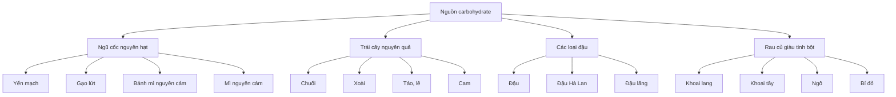
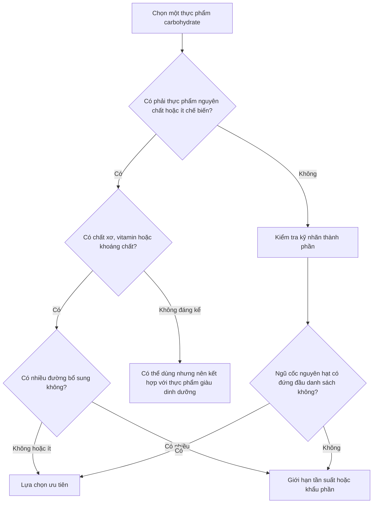

[](https://www.heart.org/en/around-the-aha/new-us-nutrition-guidance-emphasizes-importance-of-healthier-eating?utm_source=chatgpt.com)

# 042 — Những thực phẩm carbohydrate tốt nhất

## The Best Carbohydrate Foods

| Thuộc tính             | Nội dung                                                                                         |
| ---------------------- | ------------------------------------------------------------------------------------------------ |
| **Module**             | Module 04 — Setting Up Your Diet                                                                 |
| **Bài học**            | The Best Carbohydrate Foods                                                                      |
| **Thời lượng**         | 00:51                                                                                            |
| **Chủ đề chính**       | Những thực phẩm carbohydrate tốt nhất                                                            |
| **Thông điệp cốt lõi** | Ưu tiên carbohydrate từ thực phẩm nguyên chất hoặc ít chế biến, giàu chất xơ và ít đường bổ sung |

> **Ý chính:** Chất lượng của nguồn carbohydrate thường quan trọng hơn việc chỉ nhìn vào tổng số gram carbohydrate. Các lựa chọn ưu tiên gồm ngũ cốc nguyên hạt, trái cây nguyên quả, các loại đậu, rau củ và những thực phẩm giàu tinh bột ít chế biến. ([The Nutrition Source][1])


*Hình 1. Trái cây, rau củ, đậu, khoai, bánh mì và ngũ cốc là những nguồn carbohydrate phổ biến. Nguồn ảnh: [Wikimedia Commons](https://commons.wikimedia.org/wiki/File:Fruit,_Vegetables_and_Grain_NCI_Visuals_Online.jpg).* ([Wikimedia Commons][2])

---

## Mục lục

1. [Mục tiêu bài học](#1-mục-tiêu-bài-học)
2. [Nội dung chính](#2-nội-dung-chính)
3. [Áp dụng thực tế](#3-áp-dụng-thực-tế)
4. [Lưu ý và lỗi thường gặp](#4-lưu-ý-và-lỗi-thường-gặp)
5. [Checklist thực hành](#5-checklist-thực-hành)
6. [Tóm tắt](#6-tóm-tắt)
7. [Tài liệu nghiên cứu](#7-tài-liệu-nghiên-cứu)

---

## 1. Mục tiêu bài học

Sau bài học này, người học có thể:

* Nhận biết những nhóm thực phẩm carbohydrate có chất lượng dinh dưỡng cao.
* Phân biệt ngũ cốc nguyên hạt với ngũ cốc tinh chế.
* Lựa chọn trái cây, đậu, ngũ cốc và rau củ phù hợp với chế độ ăn.
* Đọc nhãn sản phẩm để phát hiện đường bổ sung và ngũ cốc tinh chế.
* Hiểu rằng gạo trắng, khoai tây hoặc tortilla không phải thực phẩm “xấu”, nhưng cần được sử dụng trong một chế độ ăn cân bằng.

---

## 2. Nội dung chính

### 2.1. Carbohydrate “tốt” là gì?

Nguồn carbohydrate chất lượng cao thường có một hoặc nhiều đặc điểm:

* Ít hoặc chưa qua tinh chế.
* Có lượng chất xơ đáng kể.
* Cung cấp vitamin và khoáng chất.
* Chứa các hợp chất thực vật như polyphenol và chất chống oxy hóa.
* Không chứa quá nhiều đường bổ sung.
* Giúp tạo nên một chế độ ăn đa dạng và dễ duy trì.

Harvard Nutrition Source và Tổ chức Y tế Thế giới đều khuyến nghị carbohydrate trong chế độ ăn nên chủ yếu đến từ **ngũ cốc nguyên hạt, rau củ, trái cây và các loại đậu**. ([The Nutrition Source][1])

### 2.2. Bốn nhóm carbohydrate nên ưu tiên



---

### 2.3. Ngũ cốc nguyên hạt

Những lựa chọn phổ biến gồm:

* Bánh mì nguyên cám hoặc bánh mì nguyên hạt.
* Mì pasta nguyên cám.
* Yến mạch.
* Gạo lứt.
* Hạt quinoa.
* Đại mạch.
* Ngô nguyên hạt.
* Ngũ cốc ăn sáng không hoặc ít đường bổ sung.
* Tortilla làm từ ngô nguyên hạt hoặc bột mì nguyên cám.

Ngũ cốc nguyên hạt giữ lại ba phần chính của hạt:

1. **Cám — bran:** giàu chất xơ.
2. **Mầm — germ:** chứa vitamin, khoáng chất và chất béo.
3. **Nội nhũ — endosperm:** chủ yếu chứa tinh bột.

Trong quá trình tinh chế, phần cám và mầm thường bị loại bỏ, làm giảm lượng chất xơ và một số vi chất dinh dưỡng. ([The Nutrition Source][3])

| Nguồn nguyên hạt     | Phiên bản tinh chế thường gặp |
| -------------------- | ----------------------------- |
| Gạo lứt              | Gạo trắng                     |
| Bánh mì nguyên cám   | Bánh mì trắng                 |
| Pasta nguyên cám     | Pasta từ bột mì tinh chế      |
| Yến mạch nguyên chất | Ngũ cốc ăn sáng nhiều đường   |
| Tortilla nguyên cám  | Tortilla từ bột mì tinh chế   |

> **Lưu ý:** Dòng chữ “multigrain”, “brown bread” hoặc “làm từ nhiều loại hạt” không tự động có nghĩa là sản phẩm nguyên hạt. Cần kiểm tra danh sách thành phần.

---

### 2.4. Trái cây nguyên quả

Những loại trái cây được đề cập trong bài học gồm:

* Chuối.
* Xoài.
* Táo.
* Cam.
* Lê.

Ngoài ra, có thể luân phiên:

* Dâu tây.
* Việt quất.
* Thanh long.
* Dứa.
* Đu đủ.
* Nho.
* Kiwi.

Trái cây nguyên quả cung cấp carbohydrate tự nhiên cùng với nước, chất xơ, vitamin và các hợp chất thực vật. Đường tự nhiên nằm trong cấu trúc của trái cây nguyên quả không nên được đánh đồng hoàn toàn với đường bổ sung trong nước ngọt, bánh kẹo hoặc đồ uống có đường. WHO xếp đường trong nước ép trái cây vào nhóm đường tự do, trong khi đường nằm trong trái cây tươi nguyên vẹn không thuộc nhóm này. ([World Health Organization][4])

#### Nên ưu tiên

* Trái cây tươi.
* Trái cây đông lạnh không thêm đường.
* Trái cây sấy không thêm đường, dùng khẩu phần vừa phải.

#### Nên hạn chế hơn

* Nước trái cây đóng chai.
* Trái cây ngâm siro.
* Sinh tố thêm nhiều đường, sữa đặc hoặc kem.
* Trái cây sấy tẩm đường.

---

### 2.5. Các loại đậu

Các nguồn carbohydrate từ họ đậu gồm:

* Đậu đen.
* Đậu đỏ.
* Đậu trắng.
* Đậu gà.
* Đậu Hà Lan.
* Đậu lăng.
* Đậu nành và các sản phẩm ít chế biến từ đậu nành.

Đậu là nhóm thực phẩm đặc biệt vì vừa cung cấp carbohydrate, vừa có chất xơ và protein thực vật. WHO liệt kê đậu lăng, đậu gà, các loại đậu hạt và đậu Hà Lan khô trong nhóm nguồn carbohydrate nên được ưu tiên. ([World Health Organization][5])

#### Cách sử dụng

* Trộn đậu vào cơm.
* Nấu súp hoặc cháo đậu.
* Làm salad đậu gà.
* Ăn đậu lăng cùng thịt, cá hoặc trứng.
* Dùng hummus làm sốt chấm.
* Kết hợp đậu với tortilla hoặc bánh mì nguyên cám.

---

### 2.6. Khoai và rau củ giàu tinh bột

Những lựa chọn phù hợp gồm:

* Khoai lang.
* Khoai tây.
* Khoai môn.
* Bí đỏ.
* Ngô.
* Củ dền.
* Sắn, khi được chế biến an toàn.

Khoai tây và khoai lang vẫn là thực phẩm nguyên chất. Chất lượng món ăn phụ thuộc nhiều vào phương pháp chế biến và khẩu phần:

| Nên ưu tiên thường xuyên hơn     | Nên hạn chế hơn                   |
| -------------------------------- | --------------------------------- |
| Luộc                             | Chiên ngập dầu                    |
| Hấp                              | Khoai tây chiên đóng gói          |
| Nướng ít dầu                     | Phủ nhiều phô mai và sốt béo      |
| Nấu súp                          | Tẩm nhiều đường hoặc siro         |
| Nghiền với lượng gia vị vừa phải | Khoai nghiền chứa nhiều bơ và kem |

---

### 2.7. Gạo trắng có phải carbohydrate “xấu” không?

Không nên phân loại thực phẩm đơn giản thành “tốt tuyệt đối” và “xấu tuyệt đối”.

Gạo trắng:

* Là ngũ cốc đã tinh chế.
* Thường có ít chất xơ hơn gạo lứt.
* Vẫn có thể cung cấp năng lượng và phù hợp với khẩu vị của nhiều người.
* Có thể được kết hợp với rau, đậu, thịt, cá, trứng hoặc đậu phụ để tạo thành bữa ăn cân bằng.
* Có thể phù hợp hơn với một số người có khả năng dung nạp chất xơ kém.

Giải pháp thực tế không nhất thiết là loại bỏ hoàn toàn gạo trắng. Có thể:

* Thay một phần bằng gạo lứt.
* Trộn gạo trắng với đậu.
* Ăn thêm rau trong bữa.
* Luân phiên gạo với khoai, yến mạch, ngô hoặc quinoa.
* Điều chỉnh lượng cơm theo nhu cầu năng lượng.

---

### 2.8. Ngũ cốc ăn sáng và bánh mì: cần kiểm tra nhãn

Một sản phẩm được quảng cáo là “healthy” vẫn có thể chứa nhiều đường bổ sung.

Khi mua bánh mì, cereal, granola hoặc tortilla, hãy kiểm tra:

1. Thành phần đầu tiên có phải là **whole wheat**, **whole grain**, **whole oats** hoặc **whole corn** hay không.
2. Đường hoặc siro có xuất hiện gần đầu danh sách thành phần không.
3. Sản phẩm có chứa nhiều dạng đường khác nhau hay không.
4. Lượng chất xơ trên mỗi khẩu phần.
5. Khẩu phần ghi trên bao bì có sát với lượng thực tế bạn ăn không.

Cơ thể không cần carbohydrate từ đường bổ sung để hoạt động. Harvard khuyến nghị hạn chế các sản phẩm có đường nằm ở vị trí đầu hoặc thứ hai trong danh sách thành phần. ([The Nutrition Source][6])

---

## 3. Áp dụng thực tế

### 3.1. Quy trình lựa chọn carbohydrate



### 3.2. Công thức xây dựng một bữa ăn

Một bữa ăn có thể được xây dựng theo cấu trúc:

```text
Nguồn carbohydrate
        +
Nguồn protein
        +
Rau hoặc trái cây
        +
Một lượng chất béo phù hợp
```

#### Ví dụ 1: Bữa sáng

* Yến mạch.
* Chuối hoặc táo.
* Sữa chua hoặc sữa.
* Một ít hạt.

#### Ví dụ 2: Bữa trưa kiểu Việt Nam

* Cơm trắng, cơm gạo lứt hoặc cơm trộn.
* Thịt, cá, trứng hoặc đậu phụ.
* Một đến hai món rau.
* Trái cây tráng miệng.

#### Ví dụ 3: Bữa phụ

* Chuối và sữa chua.
* Táo và một ít hạt.
* Bánh mì nguyên cám cùng trứng.
* Khoai lang luộc.
* Yến mạch ngâm qua đêm.

#### Ví dụ 4: Bữa tối

* Khoai tây, khoai lang, cơm hoặc quinoa.
* Cá, thịt nạc hoặc đậu.
* Rau luộc, salad hoặc súp rau.

---

### 3.3. Danh sách mua thực phẩm mẫu

| Nhóm                     | Lựa chọn gợi ý                                          |
| ------------------------ | ------------------------------------------------------- |
| **Ngũ cốc**              | Yến mạch, gạo lứt, bánh mì nguyên cám, pasta nguyên cám |
| **Trái cây**             | Chuối, táo, cam, lê, xoài                               |
| **Các loại đậu**         | Đậu đen, đậu đỏ, đậu gà, đậu lăng                       |
| **Rau củ giàu tinh bột** | Khoai lang, khoai tây, bí đỏ, ngô                       |
| **Nguồn linh hoạt**      | Gạo trắng, tortilla, bún, phở, mì                       |
| **Nên hạn chế hơn**      | Nước ngọt, bánh ngọt, cereal nhiều đường, trà sữa       |

### 3.4. Nguyên tắc thay thế đơn giản

| Thay vì                | Có thể thử                            |
| ---------------------- | ------------------------------------- |
| Bánh mì trắng mỗi ngày | Luân phiên bánh mì nguyên cám         |
| Cereal nhiều đường     | Yến mạch hoặc cereal không thêm đường |
| Nước ép                | Ăn trái cây nguyên quả                |
| Khoai chiên            | Khoai luộc, hấp hoặc nướng            |
| Bánh ngọt làm bữa phụ  | Trái cây, sữa chua hoặc khoai         |
| Chỉ ăn cơm và thịt     | Thêm rau và đậu                       |

---

## 4. Lưu ý và lỗi thường gặp

### 4.1. Cho rằng tất cả carbohydrate đều gây tăng cân

Tăng hoặc giảm cân chủ yếu chịu ảnh hưởng bởi tổng năng lượng tiêu thụ trong thời gian dài. Carbohydrate không tự động gây tăng cân chỉ vì nó là carbohydrate.

Tuy nhiên, những sản phẩm nhiều đường, nhiều chất béo và dễ ăn quá mức như bánh ngọt, nước ngọt hoặc đồ ăn vặt có thể khiến tổng năng lượng tăng nhanh.

### 4.2. Coi “carbohydrate phức” là đồng nghĩa với “lành mạnh”

Một sản phẩm có tinh bột vẫn có thể:

* Được tinh chế nhiều.
* Có ít chất xơ.
* Chứa nhiều đường bổ sung.
* Chứa nhiều chất béo hoặc muối.

Do đó, cần đánh giá **toàn bộ thực phẩm**, không chỉ tên loại carbohydrate.

### 4.3. Loại bỏ hoàn toàn trái cây vì sợ đường

Trái cây nguyên quả đi kèm chất xơ, nước và vi chất dinh dưỡng. Nó không tương đương với việc uống nước ngọt hoặc ăn đường tinh luyện.

Người cần kiểm soát đường huyết vẫn có thể phải điều chỉnh loại và khẩu phần trái cây theo hướng dẫn cá nhân của bác sĩ hoặc chuyên gia dinh dưỡng.

### 4.4. Nghĩ rằng thực phẩm lành mạnh có thể ăn không giới hạn

Gạo lứt, yến mạch, quinoa, khoai và bánh mì nguyên cám vẫn cung cấp năng lượng. Khẩu phần nên phù hợp với:

* Mục tiêu tăng, giảm hay duy trì cân nặng.
* Khối lượng vận động.
* Cảm giác đói và no.
* Tổng lượng calorie trong ngày.

### 4.5. Tăng chất xơ quá nhanh

Chuyển đột ngột từ chế độ ăn ít chất xơ sang ăn nhiều đậu, ngũ cốc nguyên hạt và rau có thể làm một số người đầy hơi hoặc khó chịu.

Nên:

* Tăng lượng chất xơ từ từ.
* Uống đủ nước.
* Ngâm và nấu chín đậu.
* Điều chỉnh theo khả năng tiêu hóa.
* Không ép bản thân phải ăn một thực phẩm gây khó chịu kéo dài.

### 4.6. Chỉ tập trung vào gạo lứt

Một chế độ ăn chất lượng không bắt buộc phải sử dụng duy nhất gạo lứt. Điều quan trọng hơn là sự đa dạng:

```text
Gạo + khoai + yến mạch + ngô + đậu + trái cây + rau củ
```

---

## 5. Checklist thực hành

### Khi chọn thực phẩm

* [ ] Tôi ưu tiên thực phẩm nguyên chất hoặc ít chế biến.
* [ ] Tôi ăn trái cây nguyên quả thay vì thường xuyên uống nước ép.
* [ ] Tôi có ít nhất một vài nguồn ngũ cốc nguyên hạt trong tuần.
* [ ] Tôi luân phiên gạo với khoai, yến mạch, ngô hoặc các loại đậu.
* [ ] Tôi kiểm tra đường bổ sung trong cereal, bánh mì và granola.
* [ ] Tôi không loại bỏ hoàn toàn carbohydrate chỉ vì muốn giảm cân.

### Khi xây dựng bữa ăn

* [ ] Bữa ăn có một nguồn carbohydrate.
* [ ] Bữa ăn có protein.
* [ ] Bữa ăn có rau hoặc trái cây.
* [ ] Khẩu phần phù hợp với mức vận động.
* [ ] Phương pháp chế biến không sử dụng quá nhiều dầu hoặc đường.
* [ ] Tôi cảm thấy no vừa phải và có đủ năng lượng hoạt động.

---

## 6. Tóm tắt

Những nguồn carbohydrate nên được ưu tiên gồm:

1. **Ngũ cốc nguyên hạt:** yến mạch, gạo lứt, bánh mì nguyên cám, pasta nguyên cám và quinoa.
2. **Trái cây nguyên quả:** chuối, xoài, táo, cam và lê.
3. **Các loại đậu:** đậu hạt, đậu Hà Lan, đậu gà và đậu lăng.
4. **Rau củ giàu tinh bột:** khoai lang, khoai tây, bí đỏ và ngô.
5. **Nguồn carbohydrate linh hoạt:** gạo trắng và tortilla vẫn có thể xuất hiện trong chế độ ăn cân bằng.

> **Công thức ghi nhớ:**
> **Ít chế biến + giàu chất xơ + ít đường bổ sung + phù hợp khẩu phần = nguồn carbohydrate chất lượng cao.**

Carbohydrate không chỉ cung cấp năng lượng. Khi được lựa chọn từ thực phẩm nguyên chất, nó còn có thể cung cấp chất xơ, vitamin, khoáng chất và nhiều hợp chất thực vật có lợi. ([The Nutrition Source][1])

---

## 7. Tài liệu nghiên cứu

### 7.1. Ngũ cốc nguyên hạt và sức khỏe

Một phân tích tổng hợp gồm 11 nghiên cứu đoàn hệ, với hơn **843.000 người tham gia** và hơn **101.000 trường hợp tử vong**, ghi nhận nhóm tiêu thụ ngũ cốc nguyên hạt cao nhất có nguy cơ tử vong do mọi nguyên nhân thấp hơn nhóm tiêu thụ thấp nhất. Tuy nhiên, đây chủ yếu là dữ liệu quan sát nên không thể tự nó chứng minh quan hệ nhân quả tuyệt đối. ([Oncotarget][7])


*Hình 2. Biểu đồ rừng so sánh nhóm tiêu thụ ngũ cốc nguyên hạt cao nhất với nhóm thấp nhất. Giá trị RR tổng hợp là 0,82; các tác giả cũng ghi nhận mức độ không đồng nhất đáng kể giữa các nghiên cứu, vì vậy cần diễn giải kết quả một cách thận trọng.* ([Oncotarget][7])

Một phân tích tổng hợp khác trên hơn 2,2 triệu người cũng ghi nhận mối liên hệ nghịch giữa lượng ngũ cốc nguyên hạt và tử vong do mọi nguyên nhân, bệnh tim mạch và tổng số bệnh ung thư. Các tác giả đồng thời lưu ý nguy cơ sai số đo lường, yếu tố gây nhiễu còn sót lại và sự khác nhau trong định nghĩa khẩu phần ngũ cốc nguyên hạt. ([PubMed Central (PMC)][8])

### 7.2. Kết luận từ nghiên cứu

Các kết quả nghiên cứu hiện có ủng hộ việc:

* Tăng tỷ lệ ngũ cốc nguyên hạt trong chế độ ăn.
* Thay thế một phần ngũ cốc tinh chế bằng ngũ cốc nguyên hạt.
* Ăn đa dạng trái cây, rau củ và các loại đậu.
* Hạn chế thực phẩm và đồ uống chứa nhiều đường bổ sung.

Tuy vậy, không nên hiểu rằng chỉ cần ăn một thực phẩm riêng lẻ là có thể phòng ngừa bệnh. Kết quả sức khỏe chịu ảnh hưởng của toàn bộ chế độ ăn, mức vận động, giấc ngủ, thuốc lá, rượu bia và nhiều yếu tố khác. ([pubmed.ncbi.nlm.nih.gov][9])

[1]: https://nutritionsource.hsph.harvard.edu/carbohydrates/?utm_source=chatgpt.com "Carbohydrates - The Nutrition Source"
[2]: https://commons.wikimedia.org/wiki/File%3AFruit%2C_Vegetables_and_Grain_NCI_Visuals_Online.jpg?utm_source=chatgpt.com "File:Fruit, Vegetables and Grain NCI Visuals Online.jpg - Wikimedia Commons"
[3]: https://nutritionsource.hsph.harvard.edu/what-should-you-eat/whole-grains/?utm_source=chatgpt.com "Whole Grains - The Nutrition Source"
[4]: https://www.who.int/europe/news-room/fact-sheets/item/nutrition---maintaining-a-healthy-lifestyle?utm_source=chatgpt.com "Nutrition for a healthy life – WHO recommendations"
[5]: https://www.who.int/news-room/fact-sheets/detail/healthy-diet?utm_source=chatgpt.com "Healthy diet"
[6]: https://nutritionsource.hsph.harvard.edu/carbohydrates/added-sugar-in-the-diet/?utm_source=chatgpt.com "Added Sugar - The Nutrition Source - Harvard University"
[7]: https://www.oncotarget.com/article/11491/text/ "Association between whole grain intake and all-cause mortality: a meta-analysis of cohort studies | Oncotarget"
[8]: https://pmc.ncbi.nlm.nih.gov/articles/PMC5105035/?utm_source=chatgpt.com "Whole-Grain Intake and Mortality from All Causes ... - PMC"
[9]: https://pubmed.ncbi.nlm.nih.gov/36789934/?utm_source=chatgpt.com "Consumption of whole grains and refined ..."
