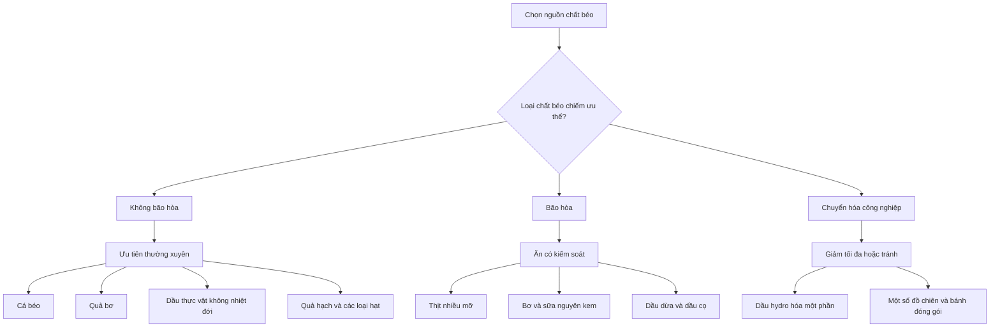

# 043 — The Best Foods for Fat

## Những thực phẩm cung cấp chất béo tốt nhất

| Thuộc tính       | Nội dung                                                     |
| ---------------- | ------------------------------------------------------------ |
| **Module**       | Module 04 — Setting Up Your Diet                             |
| **Bài học**      | The Best Foods for Fat                                       |
| **Thời lượng**   | 00:44                                                        |
| **Chủ đề chính** | Lựa chọn nguồn chất béo tốt cho sức khỏe và chế độ tập luyện |

> [!IMPORTANT]
> **Hiệu đính nội dung bài giảng:** Không nên chia thực phẩm đơn giản thành “chất béo tốt” và “thực phẩm xấu”. Cách chính xác hơn là:
>
> * **Ưu tiên** thực phẩm giàu chất béo không bão hòa.
> * **Hạn chế**, không nhất thiết loại bỏ hoàn toàn, chất béo bão hòa.
> * **Tránh hoặc giảm tối đa** chất béo chuyển hóa công nghiệp.
>
> Trứng, thịt và sữa nguyên kem không tự động là “thực phẩm không lành mạnh”. Hàm lượng chất béo phụ thuộc vào loại thực phẩm, phần thịt, cách chế biến và tổng thể chế độ ăn. Ức gà bỏ da, chẳng hạn, thường là nguồn protein nạc chứ không phải nguồn chất béo chính. ([www.heart.org][1])


*Ảnh minh họa: cá hồi, quả bơ, dầu ô liu, hạt và các loại quả hạch.*

---

## Mục lục

1. [Mục tiêu bài học](#1-mục-tiêu-bài-học)
2. [Nội dung chính](#2-nội-dung-chính)
3. [Áp dụng thực tế](#3-áp-dụng-thực-tế)
4. [Lưu ý và lỗi thường gặp](#4-lưu-ý-và-lỗi-thường-gặp)
5. [Checklist thực hành](#5-checklist-thực-hành)
6. [Tóm tắt](#6-tóm-tắt)

---

## 1. Mục tiêu bài học

Sau bài học này, người học có thể:

* Phân biệt ba nhóm chất béo chính: **không bão hòa**, **bão hòa** và **chuyển hóa**.
* Nhận biết những thực phẩm cung cấp chất béo có lợi.
* Biết cách lựa chọn dầu ăn, cá, quả hạch và hạt.
* Hạn chế thực phẩm giàu chất béo bão hòa hoặc chất béo chuyển hóa.
* Đưa chất béo vào chế độ ăn mà không làm tổng calorie vượt quá mục tiêu.

---

## 2. Nội dung chính

### 2.1. Nguyên tắc lựa chọn chất béo



WHO khuyến nghị chất béo trong chế độ ăn của người từ hai tuổi trở lên nên chủ yếu là chất béo không bão hòa. Chất béo bão hòa nên cung cấp dưới **10% tổng năng lượng**, còn chất béo chuyển hóa nên dưới **1% tổng năng lượng**. ([World Health Organization][2])

---

### 2.2. Nhóm nên ưu tiên: chất béo không bão hòa

Chất béo không bão hòa gồm:

* **Chất béo không bão hòa đơn — MUFA**
* **Chất béo không bão hòa đa — PUFA**, bao gồm omega-3 và omega-6

Thay thế thực phẩm giàu chất béo bão hòa bằng nguồn chất béo không bão hòa là chiến lược phù hợp hơn so với chỉ cắt giảm toàn bộ chất béo. ([www.heart.org][3])

#### Những thực phẩm nổi bật

| Nhóm thực phẩm   | Ví dụ                                             | Đặc điểm                                            | Cách sử dụng                                        |
| ---------------- | ------------------------------------------------- | --------------------------------------------------- | --------------------------------------------------- |
| **Cá béo**       | Cá hồi, cá mòi, cá thu, cá trích, cá ngừ albacore | Cung cấp EPA và DHA omega-3 cùng protein            | Nướng, hấp, áp chảo ít dầu                          |
| **Quả bơ**       | Bơ tươi                                           | Giàu chất béo không bão hòa đơn và chất xơ          | Ăn kèm bánh mì, salad hoặc cơm                      |
| **Dầu thực vật** | Dầu ô liu, dầu cải, dầu đậu nành, dầu hướng dương | Chủ yếu cung cấp chất béo không bão hòa             | Trộn salad hoặc dùng lượng vừa phải khi nấu         |
| **Quả hạch**     | Hạnh nhân, óc chó, hạt điều, hồ trăn, đậu phộng   | Cung cấp chất béo, protein, chất xơ và khoáng chất  | Ăn một nắm nhỏ hoặc thêm vào sữa chua               |
| **Bơ hạt**       | Bơ đậu phộng, bơ hạnh nhân                        | Nguồn năng lượng và chất béo tiện lợi               | Chọn loại ít đường, ít muối, không có dầu hydro hóa |
| **Các loại hạt** | Hạt lanh, chia, hướng dương, bí ngô, mè           | Cung cấp PUFA, chất xơ và vi chất                   | Rắc lên yến mạch, salad hoặc sinh tố                |
| **Ô liu**        | Ô liu xanh hoặc đen                               | Giàu MUFA                                           | Dùng trong salad; chú ý lượng muối                  |
| **Đậu nành**     | Đậu phụ, edamame                                  | Cung cấp chất béo không bão hòa và protein thực vật | Xào, hấp hoặc làm salad                             |

Cá và hải sản, đặc biệt là cá nước lạnh giàu chất béo như cá hồi, cá thu, cá trích, cá mòi và một số loại cá ngừ, là nguồn EPA và DHA đáng chú ý. Hạt lanh cung cấp chủ yếu ALA, một dạng omega-3 có nguồn gốc thực vật. ([ODS][4])

> [!NOTE]
> **Không phải mọi loại cá ngừ đều là thực phẩm nhiều chất béo.** Hàm lượng chất béo thay đổi theo loài và cách đóng hộp. Nếu mục tiêu là tăng omega-3, cá hồi, cá mòi, cá thu và cá trích thường là những lựa chọn rõ ràng hơn.

---

### 2.3. Nhóm nên ăn có kiểm soát: chất béo bão hòa

Nguồn chất béo bão hòa phổ biến gồm:

* Thịt có nhiều mỡ và da gia cầm.
* Bơ động vật, mỡ lợn và mỡ bò.
* Sữa nguyên kem, kem và một số loại phô mai.
* Dầu dừa, dầu cọ và dầu hạt cọ.
* Một số loại bánh ngọt, đồ ăn nhanh và thực phẩm siêu chế biến.

Ăn nhiều chất béo bão hòa có thể làm tăng LDL cholesterol. Do đó, nên thay một phần thịt mỡ, bơ hoặc dầu nhiệt đới bằng cá, quả hạch, hạt và dầu thực vật không nhiệt đới. ([www.heart.org][5])

#### Cần hiểu đúng về một số thực phẩm trong transcript

| Thực phẩm               | Cách hiểu phù hợp hơn                                                                                           |
| ----------------------- | --------------------------------------------------------------------------------------------------------------- |
| **Trứng nguyên quả**    | Cung cấp protein và nhiều vi chất; có một lượng chất béo bão hòa nhưng không cần tự động loại bỏ khỏi chế độ ăn |
| **Thịt chất lượng cao** | “Chất lượng cao” không đồng nghĩa với ít chất béo bão hòa; cần xem phần thịt nạc hay mỡ                         |
| **Sữa nguyên kem**      | Có thể phù hợp với một số người nhưng chứa nhiều chất béo bão hòa hơn sữa ít béo                                |
| **Ức gà bỏ da**         | Là nguồn protein tương đối nạc, không phải nguồn chất béo chính                                                 |
| **Ức gà còn da**        | Chứa nhiều chất béo hơn, bao gồm cả chất béo bão hòa                                                            |

---

### 2.4. Nhóm nên giảm tối đa: chất béo chuyển hóa

Chất béo chuyển hóa công nghiệp thường hình thành từ quá trình **hydro hóa một phần dầu thực vật**. Những nguồn có thể gặp gồm:

* Shortening hoặc một số loại bơ thực vật cứng.
* Bánh quy, bánh nướng và bánh ngọt đóng gói.
* Một số thực phẩm chiên bằng dầu có chứa chất béo hydro hóa.
* Thực phẩm chế biến sử dụng nguyên liệu ghi là **partially hydrogenated oil**.

WHO khuyến nghị giữ lượng chất béo chuyển hóa dưới 1% tổng năng lượng, tương đương dưới khoảng **2,2 g/ngày** trong chế độ ăn 2.000 kcal. Chất béo chuyển hóa công nghiệp không mang lại lợi ích sức khỏe đã biết và nên được loại bỏ khỏi nguồn cung thực phẩm. ([World Health Organization][6])

> [!CAUTION]
> Pizza, hamburger hoặc xúc xích **không tự động đồng nghĩa với chất béo chuyển hóa**. Hàm lượng thực tế phụ thuộc vào nguyên liệu và dầu sử dụng. Tuy nhiên, chúng thường có thể chứa nhiều chất béo bão hòa, sodium và calorie nên vẫn cần giới hạn tần suất.

---

### 2.5. Infographic nghiên cứu: bốn cách bổ sung chất béo tốt


Infographic của American Heart Association đề xuất bốn nhóm lựa chọn thực tế:

1. Ăn cá béo.
2. Ăn một lượng nhỏ quả hạch và hạt.
3. Thêm quả bơ vào bữa ăn.
4. Chọn dầu thực vật không nhiệt đới có ít chất béo bão hòa hơn. ([www.heart.org][7])

---

## 3. Áp dụng thực tế

### 3.1. Công thức xây dựng một bữa ăn

```text
Nguồn protein
      +
Nguồn carbohydrate giàu chất xơ
      +
Rau hoặc trái cây
      +
Một khẩu phần chất béo không bão hòa
```

#### Ví dụ

| Bữa ăn       | Thành phần                                             |
| ------------ | ------------------------------------------------------ |
| **Bữa sáng** | Yến mạch + sữa chua + hạt chia + một ít bơ đậu phộng   |
| **Bữa trưa** | Cơm + ức gà bỏ da + rau + một ít dầu ô liu hoặc quả bơ |
| **Bữa tối**  | Cá hồi + khoai lang + salad                            |
| **Bữa phụ**  | Trái cây + một nắm nhỏ hạnh nhân hoặc óc chó           |
| **Bữa chay** | Đậu phụ + cơm + rau + mè hoặc đậu phộng                |

---

### 3.2. Cách thay thế thông minh

| Thay vì                       | Có thể chọn                                       |
| ----------------------------- | ------------------------------------------------- |
| Chiên ngập dầu                | Hấp, nướng, áp chảo hoặc dùng nồi chiên không dầu |
| Thịt nhiều mỡ                 | Thịt nạc, cá hoặc đậu phụ                         |
| Bơ động vật dùng thường xuyên | Dầu ô liu, dầu cải hoặc dầu đậu nành              |
| Snack chiên                   | Quả hạch không muối hoặc hạt rang khô             |
| Sốt kem nhiều chất béo        | Sốt từ sữa chua hoặc dầu ô liu và giấm            |
| Bơ hạt có nhiều đường         | Bơ hạt có thành phần chủ yếu là hạt               |
| Bánh ngọt đóng gói            | Trái cây kết hợp sữa chua và hạt                  |

---

### 3.3. Kiểm soát khẩu phần

Chất béo cung cấp khoảng **9 kcal mỗi gram**, cao hơn protein và carbohydrate. Vì vậy, thực phẩm tốt cho sức khỏe vẫn có thể khiến tổng calorie vượt mục tiêu khi dùng quá nhiều.

Một số khẩu phần tham khảo:

* Khoảng một nắm nhỏ quả hạch hoặc hạt.
* Một thìa canh dầu dùng cho cả món ăn.
* Một phần vừa phải quả bơ.
* Một lớp mỏng bơ đậu phộng thay vì nhiều thìa đầy.
* Một phần cá béo trong bữa chính.

> Mục tiêu không phải là thêm thật nhiều chất béo vào khẩu phần, mà là **thay nguồn chất béo kém phù hợp bằng nguồn tốt hơn**.

---

### 3.4. Ví dụ một ngày ăn khoảng 60 g chất béo

| Thực phẩm                                            | Vai trò                              |
| ---------------------------------------------------- | ------------------------------------ |
| 2 quả trứng                                          | Protein, chất béo và vi chất         |
| Một phần cá hồi                                      | Protein và omega-3                   |
| Một nắm nhỏ quả hạch                                 | MUFA, PUFA và chất xơ                |
| Một ít dầu ô liu dùng trong salad                    | Chất béo không bão hòa đơn           |
| Chất béo tự nhiên có trong thịt, sữa và các món khác | Phần còn lại của tổng lượng chất béo |

Đây chỉ là ví dụ minh họa. Khẩu phần thực tế cần được điều chỉnh theo tổng calorie, cân nặng, hoạt động thể chất và mục tiêu tăng cơ hoặc giảm mỡ.

---

## 4. Lưu ý và lỗi thường gặp

### Lỗi 1: Cho rằng mọi chất béo đều gây tăng mỡ

Tăng hoặc giảm cân phụ thuộc chủ yếu vào cân bằng năng lượng tổng thể. Tuy nhiên, vì chất béo đậm đặc năng lượng, khẩu phần dầu, hạt và bơ hạt rất dễ bị ước lượng thấp.

### Lỗi 2: Ăn không giới hạn vì thực phẩm được gọi là “healthy fat”

Quả bơ, quả hạch và dầu ô liu bổ dưỡng nhưng vẫn giàu calorie. “Lành mạnh” không có nghĩa là “không cần kiểm soát khẩu phần”.

### Lỗi 3: Chỉ dùng dầu dừa vì cho rằng đây là dầu tốt nhất

Dầu dừa chứa tỷ lệ chất béo bão hòa cao. Các dầu thực vật không nhiệt đới như dầu ô liu, dầu cải, dầu đậu nành và dầu hướng dương thường là lựa chọn phù hợp hơn để dùng thường xuyên. ([www.heart.org][8])

### Lỗi 4: Nghĩ rằng trứng hoặc sữa nguyên kem luôn “xấu”

Cần đánh giá tổng thể khẩu phần. Vấn đề thường nằm ở tổng lượng chất béo bão hòa, calorie và cách chế biến chứ không chỉ ở một thực phẩm riêng lẻ.

### Lỗi 5: Nghĩ rằng mọi món chiên đều chứa nhiều trans fat

Trans fat công nghiệp chủ yếu liên quan đến dầu hydro hóa một phần. Dầu chiên thông thường không nhất thiết chứa nhiều trans fat, nhưng món chiên vẫn thường giàu calorie và có thể chứa nhiều chất béo bão hòa hoặc sodium. ([World Health Organization][6])

### Lỗi 6: Chọn bơ hạt nhưng không đọc thành phần

Một số sản phẩm có thêm đường, muối, dầu cọ hoặc dầu hydro hóa. Nên ưu tiên sản phẩm có danh sách thành phần ngắn, trong đó hạt là thành phần chính.

### Lỗi 7: Xem socola đen là nguồn chất béo chính

Socola đen có thể được dùng như món ăn nhỏ, nhưng cũng đậm năng lượng và có cả chất béo bão hòa. Không nên dùng nó để thay thế cá, quả hạch, hạt hoặc dầu thực vật.

---

## 5. Checklist thực hành

* [ ] Tôi có ít nhất một nguồn chất béo không bão hòa trong ngày.
* [ ] Tôi ăn cá béo thường xuyên thay cho một phần thịt nhiều mỡ.
* [ ] Tôi kiểm soát khẩu phần dầu, quả hạch và bơ hạt.
* [ ] Tôi ưu tiên bơ hạt ít đường và không có dầu hydro hóa.
* [ ] Tôi chọn thịt nạc và bỏ phần mỡ hoặc da không cần thiết.
* [ ] Tôi không mặc định rằng mọi món ăn nhanh đều chứa trans fat.
* [ ] Tôi kiểm tra nhãn để tìm cụm từ **partially hydrogenated oil**.
* [ ] Tôi hạn chế đồ chiên, bánh ngọt đóng gói và thực phẩm siêu chế biến.
* [ ] Tôi dùng socola đen như món ăn nhỏ, không phải nguồn chất béo chủ lực.
* [ ] Tôi tính chất béo vào tổng calorie hằng ngày.

---

## 6. Tóm tắt

> **Nguyên tắc cốt lõi**
>
> 1. Ưu tiên chất béo không bão hòa từ cá béo, quả bơ, quả hạch, hạt và dầu thực vật không nhiệt đới.
> 2. Hạn chế tổng lượng chất béo bão hòa thay vì gắn nhãn một thực phẩm riêng lẻ là “xấu”.
> 3. Tránh hoặc giảm tối đa dầu hydro hóa một phần và chất béo chuyển hóa công nghiệp.
> 4. Chọn thực phẩm ít chế biến và kiểm soát khẩu phần.
> 5. Chất lượng nguồn chất béo quan trọng, nhưng tổng calorie vẫn quyết định lớn đến việc tăng hoặc giảm cân.

```text
Ưu tiên thường xuyên:
Cá béo → quả bơ → quả hạch/hạt → dầu thực vật không nhiệt đới

Ăn có kiểm soát:
Thịt nhiều mỡ → bơ → sữa nguyên kem → dầu dừa/dầu cọ

Giảm tối đa:
Dầu hydro hóa một phần → đồ chiên và bánh đóng gói có trans fat
```

[1]: https://www.heart.org/en/healthy-living/healthy-eating/eat-smart/fats/fats-in-foods?utm_source=chatgpt.com "Fats in Foods | American Heart Association"
[2]: https://www.who.int/news/item/17-07-2023-who-updates-guidelines-on-fats-and-carbohydrates?utm_source=chatgpt.com "WHO updates guidelines on fats and carbohydrates"
[3]: https://www.heart.org/en/healthy-living/healthy-eating/eat-smart/fats/the-facts-on-fats "The Facts on Fats Infographic | American Heart Association"
[4]: https://ods.od.nih.gov/factsheets/Omega3FattyAcids-HealthProfessional/?utm_source=chatgpt.com "Omega-3 Fatty Acids - Health Professional Fact Sheet"
[5]: https://www.heart.org/en/healthy-living/healthy-eating/eat-smart/fats/saturated-fats?utm_source=chatgpt.com "Saturated Fats | American Heart Association"
[6]: https://www.who.int/news-room/fact-sheets/detail/trans-fat/ "Trans fat"
[7]: https://www.heart.org/en/-/media/AHA/H4GM/PDF-Files/4WaysToGetGoodFats.pdf?sc_lang=en "4 Ways to Get Good Fats"
[8]: https://www.heart.org/en/healthy-living/healthy-eating/eat-smart/fats/healthy-cooking-oils/?utm_source=chatgpt.com "Healthy Cooking Oils | American Heart Association"
