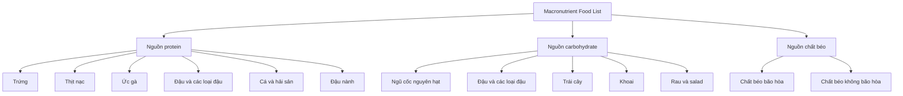
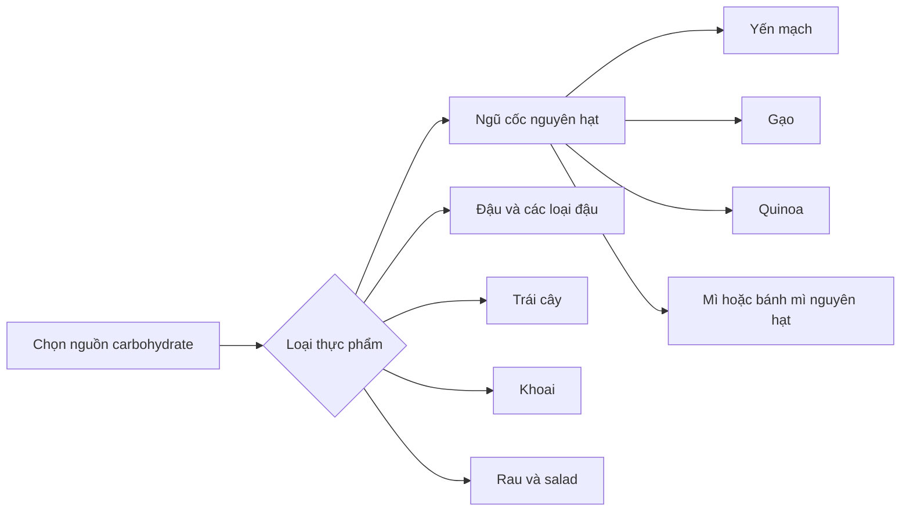
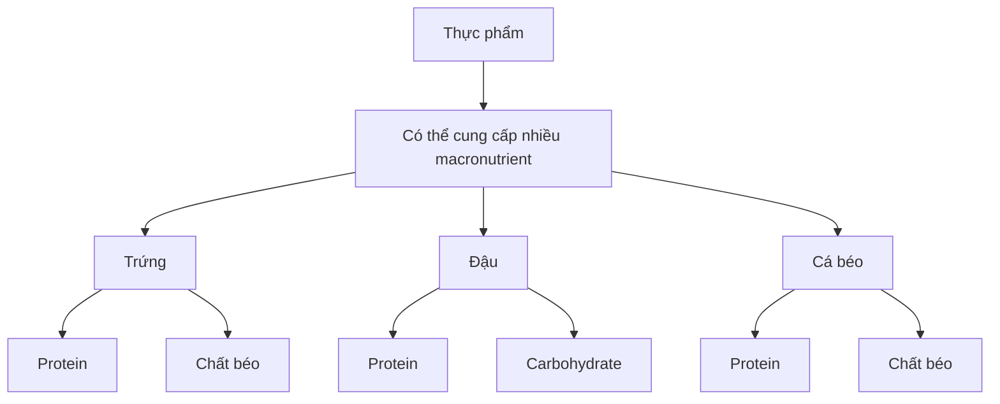

# 044 — Downloadable Food List

| Thuộc tính           | Nội dung                                        |
| -------------------- | ----------------------------------------------- |
| **Module**           | Module 04 — Setting Up Your Diet                |
| **Bài học**          | Downloadable Food List                          |
| **Thời lượng**       | 00:05                                           |
| **Chủ đề chính**     | Danh sách thực phẩm theo các nhóm macronutrient |
| **Tài liệu sử dụng** | Macronutrient Food List                         |

## Mục lục

1. [Mục tiêu bài học](#1-mục-tiêu-bài-học)
2. [Nội dung chính](#2-nội-dung-chính)
3. [Áp dụng thực tế](#3-áp-dụng-thực-tế)
4. [Lưu ý và lỗi thường gặp](#4-lưu-ý-và-lỗi-thường-gặp)
5. [Checklist thực hành](#5-checklist-thực-hành)
6. [Tóm tắt](#6-tóm-tắt)

---

## 1. Mục tiêu bài học

Sau bài học này, người học có thể:

* Nhận biết các nguồn **protein lành mạnh**.
* Nhận biết các nguồn **carbohydrate lành mạnh**.
* Phân biệt các nguồn **chất béo bão hòa** và **chất béo không bão hòa** được liệt kê trong tài liệu.
* Sử dụng danh sách thực phẩm để lựa chọn nguyên liệu cho các bữa ăn hằng ngày.
* Xây dựng bữa ăn chính dựa trên một nguồn protein phù hợp.

Tài liệu được chia thành ba phần:

1. Healthy Protein Sources.
2. Healthy Carbohydrate Sources.
3. Healthy Fat Sources. 

---

## 2. Nội dung chính

### 2.1. Tổng quan danh sách thực phẩm



Danh sách này đóng vai trò như một bảng tham khảo nhanh để lựa chọn thực phẩm theo ba nhóm chất dinh dưỡng chính.

---

### 2.2. Các nguồn protein lành mạnh

Theo tài liệu, protein là macronutrient quan trọng nhất trong chế độ ăn. Tác giả khuyến nghị xây dựng các bữa ăn chính quanh một khẩu phần lớn của một nguồn protein trong danh sách, vì những thực phẩm này giàu protein và thường có lượng calorie tương đối thấp. 

#### Danh sách nguồn protein

| Nguồn protein       | Tên tiếng Anh   |
| ------------------- | --------------- |
| Trứng               | Eggs            |
| Thịt nạc            | Lean Meats      |
| Ức gà               | Chicken Breast  |
| Đậu và các loại đậu | Beans & Legumes |
| Cá và hải sản       | Fish/Seafood    |
| Đậu nành            | Soy             |

Các nguồn protein trên được liệt kê trực tiếp trong trang thứ hai của tài liệu. 

#### Phân loại đơn giản

```text
Nguồn protein
│
├── Động vật
│   ├── Trứng
│   ├── Thịt nạc
│   ├── Ức gà
│   └── Cá và hải sản
│
└── Thực vật
    ├── Đậu và các loại đậu
    └── Đậu nành
```

#### Nguyên tắc sử dụng

Mỗi bữa ăn chính nên bắt đầu bằng câu hỏi:

> **Nguồn protein chính của bữa ăn này là gì?**

Ví dụ:

* Trứng.
* Ức gà.
* Thịt nạc.
* Cá.
* Hải sản.
* Đậu.
* Đậu nành.

Sau khi chọn protein, người học mới tiếp tục lựa chọn carbohydrate và chất béo phù hợp.

---

### 2.3. Các nguồn carbohydrate lành mạnh

Tài liệu cho rằng carbohydrate thường bị đánh giá tiêu cực trong lĩnh vực thể hình, nhưng phần lớn sự đánh giá này là không hợp lý.

Theo nội dung PDF:

* Carbohydrate là nguồn năng lượng được cơ thể ưu tiên.
* Carbohydrate có thể giúp người tập có nhiều sức mạnh hơn trong phòng tập.
* Vì lý do sức khỏe, phần lớn carbohydrate nên đến từ những nguồn được liệt kê trong tài liệu. 

#### Danh sách nguồn carbohydrate

| Nhóm thực phẩm           | Ví dụ trong tài liệu              |
| ------------------------ | --------------------------------- |
| Ngũ cốc nguyên hạt       | Yến mạch, gạo, quinoa             |
| Mì và bánh mì nguyên hạt | Mì nguyên hạt, bánh mì nguyên hạt |
| Đậu và các loại đậu      | Beans & legumes                   |
| Trái cây                 | Dùng thay thế cho bánh kẹo        |
| Khoai                    | Potatoes                          |
| Rau và salad             | Tất cả các loại rau và salad      |

Danh sách đầy đủ được trình bày tại trang thứ ba của tài liệu. 

#### Sơ đồ lựa chọn carbohydrate



#### Đồ ăn linh hoạt

Tài liệu cho rằng khoảng **10–20% lượng carbohydrate hằng ngày** có thể đến từ đồ ăn vặt hoặc bánh kẹo, trong trường hợp điều này giúp người học dễ duy trì chế độ ăn lâu dài hơn. 

Điểm chính trong tài liệu không phải là phải ăn bánh kẹo, mà là:

> Phần lớn carbohydrate nên đến từ các nguồn lành mạnh, nhưng chế độ ăn vẫn có thể dành một phần nhỏ cho những thực phẩm yêu thích.

---

### 2.4. Các nguồn chất béo lành mạnh

Theo tài liệu, chất béo trong chế độ ăn rất quan trọng đối với quá trình sản xuất hormone, bao gồm testosterone.

Tài liệu khuyến nghị sử dụng sự kết hợp giữa:

* Chất béo bão hòa.
* Chất béo không bão hòa. 

---

#### A. Nguồn chất béo bão hòa

| Thực phẩm           | Tên tiếng Anh  |
| ------------------- | -------------- |
| Bơ động vật         | Butter         |
| Thịt bò ăn cỏ       | Grass-Fed Beef |
| Trứng               | Eggs           |
| Các sản phẩm từ sữa | Dairy Products |
| Bơ dừa              | Coconut Butter |

Đây là những nguồn được tài liệu xếp vào nhóm chất béo bão hòa. 

---

#### B. Nguồn chất béo không bão hòa

| Thực phẩm                 | Tên tiếng Anh |
| ------------------------- | ------------- |
| Các loại hạt và hạt giống | Nuts & Seeds  |
| Quả bơ                    | Avocados      |
| Cá béo                    | Fatty Fish    |
| Dầu ô liu                 | Olive Oil     |

Đây là những nguồn được tài liệu xếp vào nhóm chất béo không bão hòa. 

---

### 2.5. Một thực phẩm có thể xuất hiện trong nhiều nhóm

Một số thực phẩm trong tài liệu không chỉ cung cấp một loại macronutrient.

| Thực phẩm           | Nhóm xuất hiện trong tài liệu     |
| ------------------- | --------------------------------- |
| Trứng               | Protein và chất béo bão hòa       |
| Đậu và các loại đậu | Protein và carbohydrate           |
| Cá béo              | Protein và chất béo không bão hòa |
| Thịt bò             | Protein và chất béo bão hòa       |
| Đậu nành            | Protein thực vật                  |

Ví dụ:

* **Trứng** xuất hiện trong danh sách protein và danh sách chất béo bão hòa.
* **Đậu và các loại đậu** xuất hiện trong danh sách protein và carbohydrate.
* **Cá béo** vừa thuộc nhóm cá, vừa là một nguồn chất béo không bão hòa.



---

## 3. Áp dụng thực tế

### 3.1. Quy trình xây dựng một bữa ăn

Có thể sử dụng danh sách trong tài liệu theo trình tự sau:


#### Bước 1: Chọn protein

Chọn một trong các nguồn:

* Trứng.
* Thịt nạc.
* Ức gà.
* Cá hoặc hải sản.
* Đậu.
* Đậu nành.

#### Bước 2: Chọn carbohydrate

Chọn một trong các nguồn:

* Yến mạch.
* Gạo.
* Quinoa.
* Mì nguyên hạt.
* Bánh mì nguyên hạt.
* Khoai.
* Trái cây.
* Đậu.
* Rau hoặc salad.

#### Bước 3: Chọn nguồn chất béo

Chọn một trong các nguồn:

* Các loại hạt.
* Hạt giống.
* Quả bơ.
* Cá béo.
* Dầu ô liu.
* Trứng.
* Sản phẩm từ sữa.

---

### 3.2. Ví dụ kết hợp bữa ăn

Các ví dụ dưới đây chỉ sử dụng những thực phẩm có trong danh sách PDF.

#### Bữa ăn 1

| Thành phần   | Thực phẩm |
| ------------ | --------- |
| Protein      | Ức gà     |
| Carbohydrate | Gạo       |
| Rau          | Salad     |
| Chất béo     | Dầu ô liu |

#### Bữa ăn 2

| Thành phần   | Thực phẩm          |
| ------------ | ------------------ |
| Protein      | Trứng              |
| Carbohydrate | Bánh mì nguyên hạt |
| Rau          | Salad              |
| Chất béo     | Quả bơ             |

#### Bữa ăn 3

| Thành phần   | Thực phẩm           |
| ------------ | ------------------- |
| Protein      | Cá béo              |
| Carbohydrate | Khoai               |
| Rau          | Các loại rau        |
| Chất béo     | Có sẵn trong cá béo |

#### Bữa ăn 4

| Thành phần   | Thực phẩm         |
| ------------ | ----------------- |
| Protein      | Đậu hoặc đậu nành |
| Carbohydrate | Gạo hoặc quinoa   |
| Rau          | Salad             |
| Chất béo     | Các loại hạt      |

#### Bữa ăn 5

| Thành phần   | Thực phẩm           |
| ------------ | ------------------- |
| Protein      | Thịt nạc            |
| Carbohydrate | Khoai               |
| Rau          | Rau các loại        |
| Chất béo     | Một sản phẩm từ sữa |

---

### 3.3. Danh sách mua thực phẩm mẫu

#### Protein

* [ ] Trứng
* [ ] Thịt nạc
* [ ] Ức gà
* [ ] Cá hoặc hải sản
* [ ] Đậu và các loại đậu
* [ ] Đậu nành

#### Carbohydrate

* [ ] Yến mạch
* [ ] Gạo
* [ ] Quinoa
* [ ] Mì nguyên hạt
* [ ] Bánh mì nguyên hạt
* [ ] Trái cây
* [ ] Khoai
* [ ] Rau
* [ ] Nguyên liệu làm salad

#### Chất béo

* [ ] Bơ động vật
* [ ] Thịt bò ăn cỏ
* [ ] Sản phẩm từ sữa
* [ ] Bơ dừa
* [ ] Các loại hạt
* [ ] Hạt giống
* [ ] Quả bơ
* [ ] Cá béo
* [ ] Dầu ô liu

---

## 4. Lưu ý và lỗi thường gặp

### 4.1. Không xây dựng bữa ăn quanh nguồn protein

Tài liệu khuyến nghị lấy một nguồn protein làm nền tảng của bữa ăn chính.

**Cách áp dụng:**

Trước khi chọn cơm, khoai hoặc bánh mì, hãy xác định protein chính:

* Trứng.
* Thịt nạc.
* Ức gà.
* Cá.
* Hải sản.
* Đậu.
* Đậu nành.

---

### 4.2. Cho rằng carbohydrate luôn không tốt

Theo tài liệu, carbohydrate bị mang tiếng xấu trong lĩnh vực thể hình một cách phần lớn không xứng đáng.

Carbohydrate được mô tả là:

* Nguồn năng lượng được cơ thể ưu tiên.
* Có thể hỗ trợ sức mạnh khi tập luyện.
* Nên chủ yếu đến từ các nguồn lành mạnh trong danh sách.

---

### 4.3. Chỉ lựa chọn một loại carbohydrate

Không cần giới hạn carbohydrate ở một loại thực phẩm duy nhất.

Có thể luân phiên giữa:

* Yến mạch.
* Gạo.
* Quinoa.
* Mì nguyên hạt.
* Bánh mì nguyên hạt.
* Khoai.
* Trái cây.
* Đậu.
* Rau.

---

### 4.4. Không phân biệt hai nhóm chất béo

Tài liệu chia nguồn chất béo thành hai nhóm:

| Chất béo bão hòa | Chất béo không bão hòa |
| ---------------- | ---------------------- |
| Bơ động vật      | Các loại hạt           |
| Thịt bò ăn cỏ    | Hạt giống              |
| Trứng            | Quả bơ                 |
| Sản phẩm từ sữa  | Cá béo                 |
| Bơ dừa           | Dầu ô liu              |

Người học cần nhận biết cả hai nhóm thay vì xem mọi thực phẩm chứa chất béo là giống nhau.

---

### 4.5. Cho rằng một thực phẩm chỉ thuộc một nhóm

Một số thực phẩm xuất hiện ở nhiều nhóm khác nhau.

Ví dụ:

* Đậu vừa là nguồn protein vừa là nguồn carbohydrate.
* Trứng vừa là nguồn protein vừa là nguồn chất béo.
* Cá béo vừa cung cấp protein vừa thuộc danh sách chất béo không bão hòa.

Vì vậy, khi xây dựng bữa ăn cần xem xét toàn bộ thành phần của thực phẩm.

---

### 4.6. Hiểu sai phần đồ ăn vặt và bánh kẹo

Tài liệu không xếp bánh kẹo vào danh sách nguồn carbohydrate lành mạnh.

Tài liệu chỉ nói rằng khoảng **10–20% lượng carbohydrate hằng ngày** có thể đến từ đồ ăn vặt hoặc bánh kẹo nếu điều đó giúp duy trì chế độ ăn lâu dài hơn. 

Phần lớn carbohydrate vẫn nên được lựa chọn từ danh sách chính.

---

## 5. Checklist thực hành

### Kiểm tra nguồn protein

* [ ] Mỗi bữa ăn chính có một nguồn protein rõ ràng.
* [ ] Đã lựa chọn từ trứng, thịt nạc, ức gà, cá, hải sản, đậu hoặc đậu nành.
* [ ] Có thể luân phiên nhiều nguồn protein khác nhau.

### Kiểm tra nguồn carbohydrate

* [ ] Phần lớn carbohydrate đến từ những nguồn trong danh sách.
* [ ] Có thể lựa chọn yến mạch, gạo, quinoa, khoai hoặc ngũ cốc nguyên hạt.
* [ ] Có trái cây trong chế độ ăn.
* [ ] Có rau hoặc salad trong các bữa ăn.
* [ ] Không xem carbohydrate là nhóm thực phẩm cần loại bỏ hoàn toàn.

### Kiểm tra nguồn chất béo

* [ ] Nhận biết được nguồn chất béo bão hòa.
* [ ] Nhận biết được nguồn chất béo không bão hòa.
* [ ] Có thể lựa chọn các loại hạt, quả bơ, cá béo hoặc dầu ô liu.
* [ ] Hiểu rằng trứng và một số loại thịt cũng cung cấp chất béo.

### Kiểm tra bữa ăn hoàn chỉnh

* [ ] Đã chọn protein trước.
* [ ] Đã thêm một nguồn carbohydrate.
* [ ] Đã thêm rau hoặc salad.
* [ ] Đã xem xét nguồn chất béo có trong bữa ăn.
* [ ] Không cần sử dụng tất cả thực phẩm trong danh sách cùng lúc.

---

## 6. Tóm tắt

Tài liệu **Macronutrient Food List** chia thực phẩm thành ba nhóm chính:

| Nhóm                       | Các nguồn được liệt kê                                       |
| -------------------------- | ------------------------------------------------------------ |
| **Protein**                | Trứng, thịt nạc, ức gà, đậu, cá, hải sản và đậu nành         |
| **Carbohydrate**           | Ngũ cốc nguyên hạt, đậu, trái cây, khoai, rau và salad       |
| **Chất béo bão hòa**       | Bơ động vật, thịt bò ăn cỏ, trứng, sản phẩm từ sữa và bơ dừa |
| **Chất béo không bão hòa** | Các loại hạt, hạt giống, quả bơ, cá béo và dầu ô liu         |

### Sơ đồ ghi nhớ

```text
Bắt đầu bữa ăn
      │
      ▼
Chọn nguồn protein
      │
      ▼
Chọn nguồn carbohydrate
      │
      ▼
Thêm rau hoặc salad
      │
      ▼
Xem xét nguồn chất béo
      │
      ▼
Hoàn thành bữa ăn
```

> **Thông điệp chính của tài liệu:** xây dựng các bữa ăn chính quanh một nguồn protein, lựa chọn phần lớn carbohydrate từ những nguồn lành mạnh và sử dụng kết hợp các nguồn chất béo bão hòa तथा không bão hòa được liệt kê trong danh sách.
