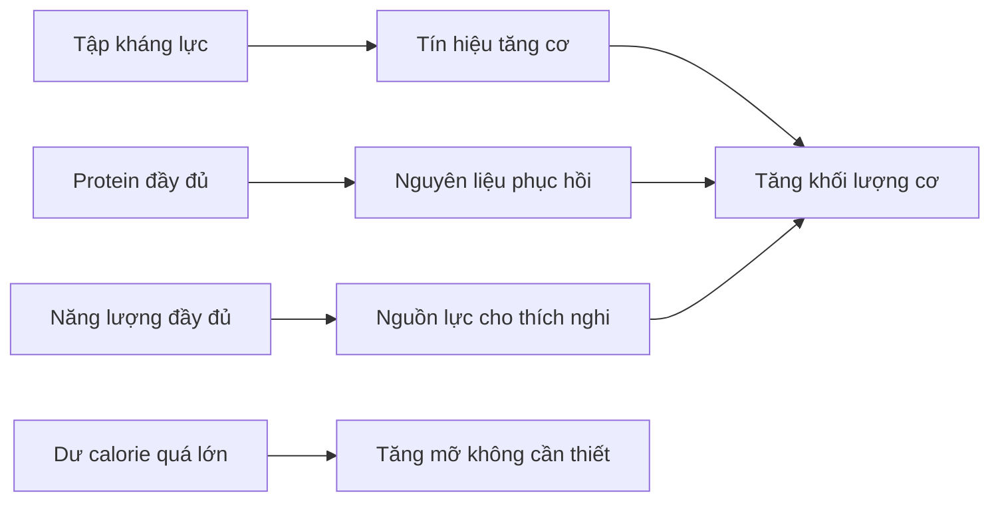
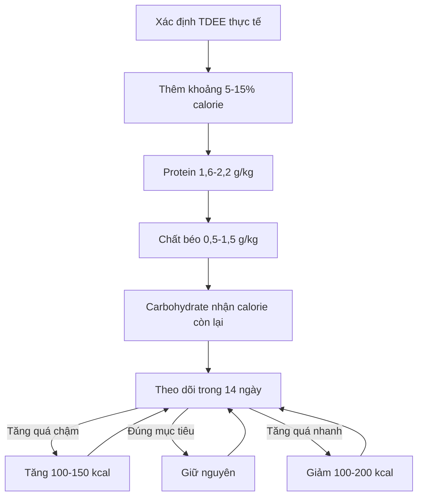

# 045 — Điều Chỉnh Chế Độ Ăn Để Xây Dựng Cơ Bắp

*Adjusting Your Diet to Build Muscle*

| Thuộc tính              | Nội dung                                                        |
| ----------------------- | --------------------------------------------------------------- |
| **Module**              | Module 05 — Adjusting Your Diet for Weight Loss & Muscle Gains  |
| **Bài học**             | Adjusting Your Diet to Build Muscle                             |
| **Thời lượng**          | 04:18                                                           |
| **Chủ đề chính**        | Điều chỉnh chế độ ăn để xây dựng cơ bắp                         |
| **Thuật ngữ trọng tâm** | Bulking, calorie surplus, TDEE, lean bulk, progressive overload |

> [!IMPORTANT]
> Bài học gốc đề xuất mức dư khoảng **500 kcal/ngày**, tương đương gần **20% TDEE** trong ví dụ của giảng viên. Đây là một cách tăng cân khá chủ động nhưng **không phải mức tối ưu cho tất cả mọi người**. Nghiên cứu gần đây cho thấy mức dư lớn thường khiến mỡ tăng nhanh hơn mà không bảo đảm cơ bắp tăng tương ứng. ([Springer][1])

## Mục lục

1. [Mục tiêu bài học](#1-mục-tiêu-bài-học)
2. [Nội dung chính](#2-nội-dung-chính)
3. [Áp dụng thực tế](#3-áp-dụng-thực-tế)
4. [Lưu ý và lỗi thường gặp](#4-lưu-ý-và-lỗi-thường-gặp)
5. [Checklist thực hành](#5-checklist-thực-hành)
6. [Tóm tắt](#6-tóm-tắt)

---

## 1. Mục tiêu bài học

Sau bài học này, người học có thể:

* Hiểu sự khác nhau giữa **bulking** và **cutting**.
* Giải thích tại sao xây dựng cơ bắp cần cả **tập kháng lực** lẫn **năng lượng đầy đủ**.
* Tính lượng calorie cho giai đoạn tăng cơ từ TDEE.
* Chọn mức calorie surplus phù hợp với kinh nghiệm tập luyện và mục tiêu kiểm soát mỡ.
* Thiết lập protein, chất béo và carbohydrate cho chế độ tăng cơ.
* Theo dõi cân nặng, vòng eo và hiệu suất tập để điều chỉnh lượng ăn.
* Phân biệt **lean bulk** với **dirty bulk**.

---

## 2. Nội dung chính

### 2.1. Bulking và cutting là gì?

Nhiều vận động viên thể hình chia kế hoạch dinh dưỡng thành hai giai đoạn:

| Giai đoạn   | Mục tiêu                                 | Cân bằng năng lượng              |
| ----------- | ---------------------------------------- | -------------------------------- |
| **Bulking** | Tăng sức mạnh, khối lượng cơ và cân nặng | Ăn bằng hoặc cao hơn mức duy trì |
| **Cutting** | Giảm mỡ trong khi cố gắng giữ cơ         | Ăn thấp hơn mức duy trì          |

Trong giai đoạn bulking, người tập thường:

1. Thực hiện chương trình tập kháng lực có tiến triển.
2. Cung cấp đủ protein.
3. Ăn dư một lượng calorie có kiểm soát.
4. Theo dõi tốc độ tăng cân để hạn chế tích mỡ.

Bulking không đơn thuần là “ăn thật nhiều”. Mục tiêu chính là tạo môi trường thuận lợi cho việc xây dựng cơ, chứ không phải tăng cân nhanh nhất có thể.

---

### 2.2. Hai điều kiện nền tảng để tăng cơ

Quá trình tăng cơ phụ thuộc vào hai yếu tố chính:

#### Điều kiện 1 — Có kích thích tập luyện phù hợp

Tập kháng lực là tín hiệu buộc cơ thể phải thích nghi. Năng lượng và protein chỉ hỗ trợ quá trình phục hồi, tái cấu trúc và phát triển cơ; chúng không thể thay thế chương trình tập luyện.

Nghiên cứu về calorie surplus cũng nhấn mạnh rằng tập kháng lực là kích thích ban đầu cho sự phát triển cơ, trong khi chế độ dinh dưỡng quyết định cơ thể có đủ nguồn lực để đáp ứng kích thích đó hay không. ([Springer][1])

#### Điều kiện 2 — Có đủ năng lượng và dưỡng chất

Khi thường xuyên ăn quá ít:

* Khả năng phục hồi có thể giảm.
* Hiệu suất tập có thể suy giảm.
* Cơ thể khó tăng thêm mô nạc.
* Việc tăng khối lượng tập luyện trở nên khó khăn hơn.

Tuy nhiên, ăn dư quá nhiều cũng không làm cơ thể xây cơ nhanh vô hạn. Cơ thể chỉ có thể sử dụng một lượng năng lượng nhất định cho quá trình phát triển mô mới; phần dư còn lại dễ được dự trữ dưới dạng mỡ.

---

### 2.3. Người mới có bắt buộc phải ăn dư calorie không?

Không phải lúc nào cũng bắt buộc.

Một số nhóm có thể tăng cơ trong khi duy trì cân nặng hoặc giảm mỡ:

* Người hoàn toàn mới tập.
* Người quay lại tập sau thời gian dài nghỉ.
* Người có tỷ lệ mỡ cơ thể tương đối cao.
* Người trước đây ăn thiếu protein hoặc tập chưa hiệu quả.

Hiện tượng này thường được gọi là **body recomposition**. Tuy nhiên, khả năng vừa tăng cơ vừa giảm mỡ thường giảm dần khi người tập trở nên nhiều kinh nghiệm hơn. Nghiên cứu ghi nhận tăng cơ vẫn có thể xảy ra trong khi giảm mỡ, vì vậy calorie surplus không phải điều kiện tuyệt đối trong mọi trường hợp. ([Springer][1])

---

### 2.4. Bước 1 — Xác định TDEE

**TDEE — Total Daily Energy Expenditure** là tổng năng lượng cơ thể tiêu hao trong một ngày, bao gồm:

* Chuyển hóa cơ bản.
* Hoạt động sinh hoạt.
* Tập luyện.
* Năng lượng dùng để tiêu hóa thức ăn.

Có thể bắt đầu bằng công thức ước tính, nhưng TDEE thực tế chỉ được xác nhận khi theo dõi cân nặng và lượng ăn.

#### Cách kiểm tra mức duy trì thực tế

1. Ăn một lượng calorie tương đối ổn định.
2. Cân vào buổi sáng sau khi đi vệ sinh, trước khi ăn uống.
3. Tính cân nặng trung bình của từng tuần.
4. Theo dõi trong ít nhất hai tuần.
5. Nếu trung bình cân nặng gần như ổn định, lượng calorie hiện tại có thể xem là mức duy trì gần đúng.

Trong nghiên cứu năm 2023, người tham gia được yêu cầu cân mỗi sáng và chỉ bắt đầu can thiệp sau khi trung bình cân nặng ổn định trong hai tuần liên tiếp. ([Springer][1])

---

### 2.5. Bước 2 — Thêm calorie surplus

Công thức cơ bản:

[
\text{Calorie tăng cơ}
======================

\text{TDEE}\times(1+\text{tỷ lệ surplus})
]

Ví dụ với TDEE là **2.500 kcal**:

| Mức surplus |    Phép tính | Lượng ăn mục tiêu |
| ----------: | -----------: | ----------------: |
|          5% | 2.500 × 1,05 |        2.625 kcal |
|         10% | 2.500 × 1,10 |        2.750 kcal |
|         15% | 2.500 × 1,15 |        2.875 kcal |
|         20% | 2.500 × 1,20 |        3.000 kcal |

### Nên bắt đầu với mức nào?

Một tổng quan về dinh dưỡng trong giai đoạn ngoài mùa thi đấu đề xuất mức dư khoảng **10–20% TDEE** và tốc độ tăng khoảng **0,25–0,5% trọng lượng cơ thể mỗi tuần** đối với người mới hoặc trung cấp; người tập nâng cao nên thận trọng hơn. ([PubMed Central (PMC)][2])

Tuy nhiên, thử nghiệm năm 2023 trên người đã tập luyện so sánh ba nhóm:

* Ăn ở mức duy trì.
* Dư khoảng 5%.
* Dư khoảng 15%.

Sau tám tuần, mức tăng độ dày cơ nhìn chung tương tự giữa các nhóm, trong khi tốc độ tăng cân nhanh hơn liên quan rõ hơn đến tăng độ dày nếp gấp da — một chỉ dấu của tăng mỡ. Nhóm dư 15% có cải thiện bench press lớn hơn, nhưng nghiên cứu chỉ có 17 người hoàn thành nên chưa đủ để kết luận rằng surplus lớn luôn tốt hơn. ([Springer][1])

#### Khung thực hành hợp lý

| Đối tượng                               |                         Mức khởi đầu tham khảo |
| --------------------------------------- | ---------------------------------------------: |
| Người đã tập lâu, muốn hạn chế tăng mỡ  |                              Khoảng 5–10% TDEE |
| Người mới hoặc trung cấp                |                             Khoảng 10–15% TDEE |
| Người rất gầy, khó ăn, ưu tiên tăng cân |    Có thể tiến gần 15–20%, nhưng phải theo dõi |
| Người có TDEE thấp                      | Nên dùng tỷ lệ %, không mặc định cộng 500 kcal |

> **Ví dụ:** Với TDEE chỉ 1.800 kcal, cộng cố định 500 kcal tương đương surplus gần 28%. Đây là mức khá lớn và có thể khiến mỡ tăng nhanh.

---

### 2.6. Minh họa từ nghiên cứu về calorie surplus

*Hình 1: Thay đổi độ dày của nhiều nhóm cơ sau tám tuần. MAIN là mức duy trì, MOD là surplus khoảng 5% và HIGH là surplus khoảng 15%. Kết quả giữa các nhóm có mức độ chồng lấp lớn.* ([Springer][3])

Điểm cần rút ra không phải là “surplus không có tác dụng”, mà là:

> **Surplus lớn hơn không nhất thiết tạo thêm nhiều cơ tương ứng, nhưng có thể làm tốc độ tích mỡ tăng nhanh hơn.**

---

### 2.7. Bước 3 — Thiết lập các chất đa lượng

Sau khi xác định calorie mục tiêu, có thể phân bổ theo trình tự:

1. Đặt protein.
2. Đặt lượng chất béo tối thiểu.
3. Dùng carbohydrate để bổ sung phần calorie còn lại.

#### Protein

Khuyến nghị thực hành cho người tập tăng cơ:

[
1,6-2,2\text{ g protein/kg trọng lượng/ngày}
]

Protein có thể chia thành 3–6 bữa, với khoảng **0,40–0,55 g/kg trong mỗi bữa**. ([PubMed Central (PMC)][2])

**Ví dụ người nặng 70 kg:**

[
70\times1,6=112\text{ g}
]

[
70\times2,2=154\text{ g}
]

Mục tiêu thực tế có thể nằm trong khoảng **112–154 g protein/ngày**.

#### Chất béo

Chất béo không nên bị cắt quá thấp. Một khung tham khảo cho giai đoạn tăng cơ là:

[
0,5-1,5\text{ g/kg/ngày}
]

Mức cụ thể phụ thuộc vào sở thích ăn uống, tổng calorie và khả năng tiêu hóa. ([PubMed Central (PMC)][2])

#### Carbohydrate

Sau khi đã đặt protein và chất béo, phần calorie còn lại có thể dành cho carbohydrate.

Carbohydrate hỗ trợ:

* Năng lượng cho buổi tập.
* Dự trữ glycogen trong cơ.
* Khả năng thực hiện khối lượng tập lớn.
* Phục hồi giữa các buổi.

Tổng quan dành cho người tập thể hình ngoài mùa thi đấu đề xuất tập trung cung cấp đủ carbohydrate, thường từ khoảng **3–5 g/kg/ngày trở lên**, tùy khối lượng tập và tổng calorie. ([PubMed Central (PMC)][2])

---

### 2.8. Ví dụ tính macro tăng cơ

Giả sử:

* Cân nặng: **70 kg**
* TDEE: **2.200 kcal**
* Surplus: **10%**

#### Bước 1 — Tính calorie

[
2.200\times1,10=2.420\text{ kcal/ngày}
]

#### Bước 2 — Đặt protein

Chọn 2 g/kg:

[
70\times2=140\text{ g protein}
]

[
140\times4=560\text{ kcal}
]

#### Bước 3 — Đặt chất béo

Chọn khoảng 65 g:

[
65\times9=585\text{ kcal}
]

#### Bước 4 — Tính carbohydrate còn lại

[
2.420-560-585=1.275\text{ kcal}
]

[
1.275\div4\approx319\text{ g carbohydrate}
]

| Chất dinh dưỡng |     Số lượng |            Năng lượng |
| --------------- | -----------: | --------------------: |
| Protein         |        140 g |              560 kcal |
| Chất béo        |         65 g |              585 kcal |
| Carbohydrate    | Khoảng 319 g |            1.276 kcal |
| **Tổng**        |              | **Khoảng 2.421 kcal** |

Sai số vài calorie là không đáng kể. Điều quan trọng hơn là duy trì kế hoạch và theo dõi xu hướng cân nặng.

---

### 2.9. Ưu tiên thực phẩm giàu dinh dưỡng

*Nguồn ảnh: [Wikimedia Commons — Healthy chicken, rice, broccoli and sweet potato plate](https://commons.wikimedia.org/wiki/File:Liat_Portal_for_Foodie_Disorder_-_Healthy_low-fat_chicken,_rice,_broccoli,_and_sweet_potato_plate.jpg).*

Một chế độ tăng cơ nên chủ yếu bao gồm:

| Nhóm                                | Lựa chọn phù hợp                                                    |
| ----------------------------------- | ------------------------------------------------------------------- |
| **Protein**                         | Thịt gà, thịt bò nạc, cá, trứng, sữa, sữa chua Hy Lạp, đậu phụ, đậu |
| **Carbohydrate**                    | Cơm, khoai, yến mạch, mì, bánh mì, trái cây, ngũ cốc                |
| **Chất béo**                        | Dầu ô liu, quả bơ, các loại hạt, bơ đậu phộng, cá béo               |
| **Vi chất và chất xơ**              | Rau xanh, trái cây, đậu, củ                                         |
| **Thực phẩm tăng calorie tiện lợi** | Sinh tố, sữa, trái cây sấy, granola, hạt, dầu ăn                    |

Không cần loại bỏ hoàn toàn pizza, kem hoặc món ăn yêu thích. Tuy nhiên, chúng không nên chiếm phần lớn chế độ ăn chỉ vì người tập đang bulking.

---

## 3. Áp dụng thực tế

### 3.1. Quy trình xây dựng chế độ tăng cơ

---

### 3.2. Theo dõi cân nặng đúng cách

Không nên đánh giá kế hoạch chỉ bằng một lần cân.

Cân nặng có thể dao động do:

* Nước.
* Glycogen.
* Lượng thức ăn trong đường tiêu hóa.
* Muối.
* Giấc ngủ.
* Chu kỳ kinh nguyệt.
* Tình trạng viêm sau tập.

#### Cách thực hiện

1. Cân mỗi sáng trong điều kiện tương tự.
2. Ghi lại số cân.
3. Tính trung bình bảy ngày.
4. So sánh trung bình tuần này với tuần trước.
5. Chỉ điều chỉnh sau khoảng hai tuần, trừ khi mức tăng quá nhanh rõ rệt.

#### Ví dụ

| Ngày           |     Cân nặng |
| -------------- | -----------: |
| Thứ Hai        |      70,0 kg |
| Thứ Ba         |      70,3 kg |
| Thứ Tư         |      70,1 kg |
| Thứ Năm        |      70,5 kg |
| Thứ Sáu        |      70,2 kg |
| Thứ Bảy        |      70,4 kg |
| Chủ Nhật       |      70,3 kg |
| **Trung bình** | **70,26 kg** |

Hãy so sánh **70,26 kg** với trung bình của tuần trước, thay vì chỉ nhìn một ngày cao hoặc thấp bất thường.

---

### 3.3. Quy tắc điều chỉnh calorie

#### Giữ nguyên lượng ăn khi

* Cân nặng tăng gần tốc độ mục tiêu.
* Vòng eo không tăng quá nhanh.
* Hiệu suất tập được cải thiện.
* Cơ thể phục hồi tốt.
* Không quá khó chịu vì lượng thức ăn.

#### Tăng khoảng 100–150 kcal khi

* Trung bình cân không tăng trong hai tuần.
* Lượng ăn được theo dõi tương đối chính xác.
* Sức mạnh và số lần lặp không tiến triển.
* Hoạt động hằng ngày không tăng đột ngột.

Có thể thêm calorie bằng:

* Một phần cơm hoặc khoai.
* Một cốc sữa.
* Yến mạch.
* Một thìa bơ đậu phộng.
* Một ít dầu ô liu trong bữa ăn.
* Sinh tố sữa, chuối và yến mạch.

#### Giảm khoảng 100–200 kcal khi

* Cân nặng tăng nhanh hơn mục tiêu trong nhiều tuần.
* Vòng eo tăng rõ rệt nhưng hiệu suất tập không cải thiện tương ứng.
* Cảm giác nặng nề hoặc khó tiêu kéo dài.
* Mức surplus thực tế lớn hơn dự kiến.

---

### 3.4. Ví dụ cấu trúc một ngày ăn tăng cơ

| Bữa                   | Gợi ý                                               |
| --------------------- | --------------------------------------------------- |
| **Bữa sáng**          | Yến mạch, sữa, trứng và chuối                       |
| **Bữa trưa**          | Cơm, thịt gà hoặc thịt bò nạc, rau và một ít dầu    |
| **Bữa phụ**           | Sữa chua Hy Lạp, granola, hạt và trái cây           |
| **Trước tập**         | Cơm, bánh mì hoặc chuối kết hợp với protein dễ tiêu |
| **Sau tập**           | Bữa chính có protein và carbohydrate                |
| **Bữa tối**           | Cá, cơm hoặc khoai, rau                             |
| **Trước ngủ nếu cần** | Sữa, sữa chua hoặc phô mai cottage                  |

Không bắt buộc phải ăn sáu bữa mỗi ngày. Tổng calorie, tổng protein và khả năng duy trì kế hoạch quan trọng hơn số bữa cố định.

---

### 3.5. Các chỉ số cần theo dõi

| Chỉ số                   | Tần suất          | Ý nghĩa                                  |
| ------------------------ | ----------------- | ---------------------------------------- |
| Cân nặng buổi sáng       | Hằng ngày         | Theo dõi xu hướng tăng cân               |
| Trung bình cân nặng      | Mỗi tuần          | Giảm ảnh hưởng của dao động nước         |
| Vòng eo                  | 1 lần/tuần        | Phát hiện tốc độ tăng mỡ                 |
| Thành tích tập           | Mỗi buổi          | Đánh giá sức mạnh và khả năng tiến triển |
| Ảnh cơ thể               | 2–4 tuần/lần      | Đánh giá thay đổi hình thể               |
| Giấc ngủ và hồi phục     | Hằng ngày         | Kiểm tra khả năng thích nghi             |
| Lượng calorie và protein | Phần lớn các ngày | Kiểm tra mức độ tuân thủ                 |

---

## 4. Lưu ý và lỗi thường gặp

### 4.1. Mặc định cộng 500 kcal cho tất cả mọi người

`TDEE + 500 kcal` rất dễ nhớ nhưng không cá nhân hóa.

* Với TDEE 3.000 kcal, 500 kcal chỉ tương đương khoảng 17%.
* Với TDEE 1.800 kcal, 500 kcal tương đương gần 28%.

Nên ưu tiên tỷ lệ phần trăm và điều chỉnh bằng dữ liệu cân nặng thực tế.

---

### 4.2. Dirty bulk

**Dirty bulk** là ăn dư rất nhiều mà gần như không kiểm soát chất lượng thực phẩm hoặc tốc độ tăng cân.

Hậu quả thường gặp:

* Mỡ tăng nhanh.
* Phải cutting lâu hơn về sau.
* Khó đánh giá lượng cơ thực sự đã tăng.
* Dễ hình thành thói quen ăn uống kém ổn định.

Nghiên cứu so sánh mức surplus cho thấy tốc độ tăng cân nhanh hơn chủ yếu dự đoán mức tăng nếp gấp da, thay vì làm tăng độ dày cơ trên toàn bộ các vị trí đo. ([Springer][1])

---

### 4.3. Chỉ tăng protein mà không tăng tổng năng lượng

Protein rất quan trọng nhưng không phải yếu tố duy nhất. Nếu tổng năng lượng và carbohydrate quá thấp, người tập có thể thiếu năng lượng để duy trì khối lượng và chất lượng buổi tập.

---

### 4.4. Tăng calorie quá sớm

Trong một đến hai tuần đầu, cân nặng có thể tăng nhanh vì:

* Glycogen trong cơ tăng.
* Cơ thể giữ thêm nước.
* Lượng thức ăn trong hệ tiêu hóa tăng.

Không nên ngay lập tức kết luận rằng toàn bộ mức tăng đó là cơ hoặc mỡ.

---

### 4.5. Thay đổi kế hoạch mỗi vài ngày

TDEE chỉ là con số ước tính. Cơ thể cần thời gian để tạo ra xu hướng đủ rõ. Thay đổi calorie liên tục khiến việc đánh giá kế hoạch trở nên khó khăn.

---

### 4.6. Bỏ qua hiệu suất tập luyện

Nếu cân tăng nhưng:

* Mức tạ không tiến triển.
* Số lần lặp không tăng.
* Kỹ thuật không cải thiện.
* Khả năng phục hồi vẫn kém.

thì lượng cân tăng thêm chưa chắc phản ánh một giai đoạn tăng cơ hiệu quả.

---

### 4.7. Cho rằng phải ăn hoàn hảo 100%

Một chế độ ăn quá cứng nhắc thường khó duy trì. Mục tiêu hợp lý là:

* Phần lớn thực phẩm giàu dưỡng chất.
* Đủ protein, chất xơ và vi chất.
* Vẫn có không gian cho món ăn yêu thích.
* Không dùng bulking làm lý do để ăn mất kiểm soát.

---

### 4.8. Không tính các calorie nhỏ

Những thực phẩm dễ bị bỏ sót:

* Dầu dùng khi nấu.
* Nước sốt.
* Đồ uống có đường.
* Sữa trong cà phê.
* Bơ đậu phộng.
* Các loại hạt.
* Đồ ăn thử trong khi nấu.

Sai số 200–300 kcal mỗi ngày có thể làm mức surplus thực tế lớn hơn nhiều so với kế hoạch.

---

## 5. Checklist thực hành

### Trước khi bắt đầu

* [ ] Tôi đã ước tính TDEE.
* [ ] Tôi đã kiểm tra cân nặng ổn định trong khoảng hai tuần.
* [ ] Tôi đã chọn mức surplus ban đầu khoảng 5–15%.
* [ ] Tôi có chương trình tập kháng lực rõ ràng.
* [ ] Tôi biết tốc độ tăng cân mục tiêu.

### Thiết lập dinh dưỡng

* [ ] Protein đạt khoảng 1,6–2,2 g/kg/ngày.
* [ ] Chất béo không bị cắt quá thấp.
* [ ] Phần calorie còn lại được bổ sung chủ yếu bằng carbohydrate.
* [ ] Tôi ăn rau và trái cây hằng ngày.
* [ ] Phần lớn calorie đến từ thực phẩm giàu dưỡng chất.
* [ ] Tôi có thực phẩm tiện lợi để tăng calorie khi khó ăn đủ.

### Theo dõi hằng tuần

* [ ] Cân vào buổi sáng trong điều kiện tương tự.
* [ ] Tính trung bình cân nặng bảy ngày.
* [ ] Đo vòng eo một lần mỗi tuần.
* [ ] Ghi lại mức tạ, số lần lặp và tổng khối lượng tập.
* [ ] Không điều chỉnh calorie chỉ vì một ngày cân tăng hoặc giảm.
* [ ] Chỉ thay đổi khoảng 100–200 kcal mỗi lần.
* [ ] Đánh giá lại kế hoạch sau khoảng hai tuần.

---

## 6. Tóm tắt

> **Xây dựng cơ bắp cần tập luyện có tiến triển, protein đầy đủ, năng lượng phù hợp và thời gian.**

Công thức tổng quát:

[
\boxed{
\text{Calorie tăng cơ}
======================

\text{TDEE}
+
\text{surplus có kiểm soát}
}
]

Các nguyên tắc chính:

1. Bắt đầu bằng việc xác định TDEE thực tế.
2. Thêm một mức surplus vừa phải, thường khoảng 5–15%.
3. Mức +500 kcal hoặc +20% không phù hợp với tất cả mọi người.
4. Đặt protein khoảng 1,6–2,2 g/kg/ngày.
5. Cung cấp đủ chất béo và dùng carbohydrate cho lượng calorie còn lại.
6. Theo dõi trung bình cân nặng, vòng eo và hiệu suất tập.
7. Tăng hoặc giảm calorie từng bước nhỏ.
8. Tránh dirty bulk vì surplus lớn thường làm mỡ tăng nhanh hơn cơ.
9. Người mới đôi khi có thể tăng cơ mà không cần surplus lớn.
10. Một kế hoạch tăng cơ tốt phải đủ hiệu quả nhưng vẫn dễ duy trì trong nhiều tuần hoặc nhiều tháng.

[1]: https://link.springer.com/article/10.1186/s40798-023-00651-y "Effect of Small and Large Energy Surpluses on Strength, Muscle, and Skinfold Thickness in Resistance-Trained Individuals: A Parallel Groups Design | Sports Medicine - Open | Springer Nature Link"
[2]: https://pmc.ncbi.nlm.nih.gov/articles/PMC6680710/?utm_source=chatgpt.com "Nutrition Recommendations for Bodybuilders in the Off-Season"
[3]: https://link.springer.com/article/10.1186/s40798-023-00651-y/figures/1 "Figure 1 | Effect of Small and Large Energy Surpluses on Strength, Muscle, and Skinfold Thickness in Resistance-Trained Individuals: A Parallel Groups Design | Sports Medicine - Open | Springer Nature Link"
