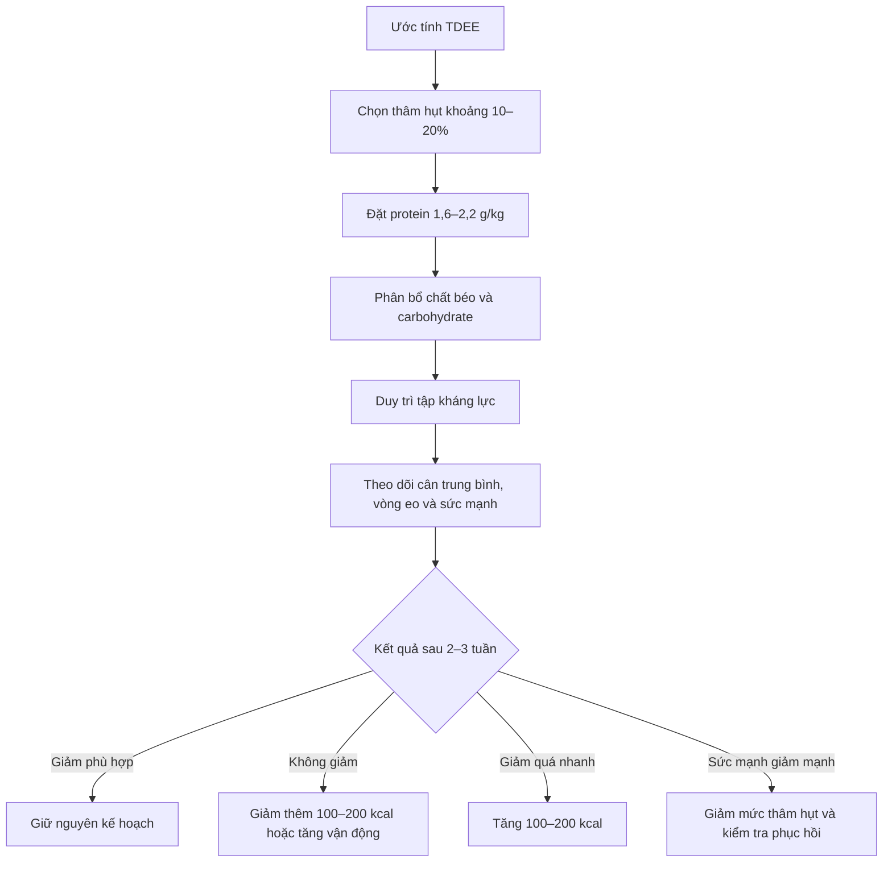

# 046 — Adjusting Your Diet To Lose Weight

| Thuộc tính         | Nội dung                                                                             |
| ------------------ | ------------------------------------------------------------------------------------ |
| **Module**         | Module 05 — Adjusting Your Diet for Weight Loss & Muscle Gains                       |
| **Bài học**        | Adjusting Your Diet To Lose Weight                                                   |
| **Tên tiếng Việt** | Điều chỉnh chế độ ăn để giảm cân                                                     |
| **Thời lượng**     | 04:57                                                                                |
| **Chủ đề chính**   | Tạo thâm hụt calorie, duy trì protein cao và bảo toàn cơ bắp trong quá trình giảm mỡ |

> [!NOTE]
> Bản chép lời có một số lỗi nhận dạng giọng nói: **TDE, TRD, TD, TV** đều được hiểu là **TDEE**; “broken diet” có thể là **bulking diet**; còn “how to smoke” nhiều khả năng là **how to bulk**.

## Mục lục

1. [Mục tiêu bài học](#1-mục-tiêu-bài-học)
2. [Nội dung chính](#2-nội-dung-chính)
3. [Áp dụng thực tế](#3-áp-dụng-thực-tế)
4. [Lưu ý và lỗi thường gặp](#4-lưu-ý-và-lỗi-thường-gặp)
5. [Checklist thực hành](#5-checklist-thực-hành)
6. [Tóm tắt](#6-tóm-tắt)
7. [Tài liệu nghiên cứu tham khảo](#7-tài-liệu-nghiên-cứu-tham-khảo)

---

## 1. Mục tiêu bài học

Sau bài học này, bạn có thể:

* Phân biệt **giảm cân** với **giảm mỡ cơ thể**.
* Hiểu vai trò của **thâm hụt năng lượng** trong quá trình giảm cân.
* Tính lượng calorie khởi điểm dựa trên **TDEE**.
* Chọn mức thâm hụt calorie phù hợp thay vì cắt ăn quá mức.
* Thiết lập lượng protein giúp hạn chế mất cơ.
* Hiểu calorie cycling là một chiến lược **tùy chọn**, không phải điều kiện bắt buộc.
* Theo dõi tiến trình và điều chỉnh chế độ ăn dựa trên dữ liệu thực tế.

---

## 2. Nội dung chính

### 2.1. Giảm cân không hoàn toàn giống giảm mỡ

**Giảm cân** chỉ có nghĩa là con số trên cân giảm xuống. Phần trọng lượng giảm có thể bao gồm:

* Mỡ cơ thể.
* Nước.
* Glycogen dự trữ.
* Thức ăn còn trong hệ tiêu hóa.
* Khối lượng cơ và các mô không phải mỡ.

Trong khi đó, mục tiêu của một chế độ “cutting” hợp lý thường là:

> **Giảm càng nhiều mỡ càng tốt, đồng thời bảo toàn tối đa khối lượng cơ, sức mạnh và hiệu suất tập luyện.**

Vì vậy, một chế độ ăn khiến cân nặng giảm thật nhanh chưa chắc đã là chế độ giảm mỡ tốt. Tốc độ giảm quá nhanh có thể làm tăng nguy cơ mất khối lượng không mỡ và suy giảm hiệu suất, đặc biệt ở người đã tương đối gầy hoặc thường xuyên tập kháng lực. Trong một nghiên cứu trên vận động viên, nhóm giảm khoảng **0,7% trọng lượng cơ thể mỗi tuần** bảo toàn thành phần cơ thể và hiệu suất tốt hơn nhóm giảm khoảng **1,4% mỗi tuần**.

> **Hình 1.** Ảnh quét DEXA có thể giúp đánh giá sự phân bố mỡ và mô nạc, cho thấy vì sao chỉ nhìn vào số cân nặng là chưa đủ để đánh giá chất lượng giảm cân. Ảnh: Meralr, giấy phép CC BY-SA 4.0.

### 2.2. Nguyên tắc nền tảng: calorie nạp vào và calorie tiêu hao

Để trọng lượng cơ thể giảm theo thời gian, cơ thể cần rơi vào trạng thái **thâm hụt năng lượng**:

[
\text{Năng lượng nạp vào} < \text{Năng lượng tiêu hao}
]

Trong đó:

* **Năng lượng nạp vào** đến từ thức ăn và đồ uống.
* **Năng lượng tiêu hao** gồm chuyển hóa cơ bản, vận động, tập luyện và quá trình tiêu hóa thức ăn.
* **TDEE — Total Daily Energy Expenditure** là tổng năng lượng cơ thể tiêu hao trong một ngày.

Không có một loại thực phẩm riêng lẻ nào có thể thay thế yêu cầu tạo thâm hụt năng lượng. Tuy nhiên, **chất lượng thực phẩm vẫn rất quan trọng** vì ảnh hưởng đến cảm giác no, khả năng phục hồi, sức khỏe, hiệu suất tập luyện và khả năng duy trì chế độ ăn lâu dài. CDC cũng nhấn mạnh giảm cân lành mạnh không chỉ liên quan đến ăn ít hơn mà còn bao gồm chế độ ăn phù hợp, vận động, giấc ngủ và quản lý căng thẳng.

### 2.3. Bước 1 — Tạo mức thâm hụt calorie hợp lý

Quy trình cơ bản:

1. Ước tính TDEE.
2. Chọn tỷ lệ thâm hụt.
3. Tính lượng calorie mục tiêu.
4. Thực hiện trong ít nhất 2–3 tuần.
5. Theo dõi xu hướng cân nặng, vòng eo và hiệu suất tập.
6. Điều chỉnh nếu kết quả không phù hợp.

Công thức:

[
\text{Calorie giảm mỡ}
======================

\text{TDEE}\times(1-\text{Tỷ lệ thâm hụt})
]

#### Phân loại mức thâm hụt

| Mức thâm hụt   |    Tỷ lệ tham khảo | Đặc điểm                                                                   |
| -------------- | -----------------: | -------------------------------------------------------------------------- |
| **Nhỏ**        |   10–15% dưới TDEE | Dễ duy trì hơn, phù hợp với người khá gầy hoặc muốn giữ hiệu suất          |
| **Trung bình** |   15–25% dưới TDEE | Tốc độ giảm nhanh hơn nhưng cần theo dõi khả năng phục hồi                 |
| **Lớn**        | Trên 25% dưới TDEE | Khó duy trì, dễ đói, mệt và suy giảm hiệu suất; không nên mặc định áp dụng |

Bài học gốc đề xuất khoảng **20% dưới TDEE** như một mức thâm hụt trung bình. Đây có thể là điểm khởi đầu phù hợp với một số người, nhưng không phải con số tối ưu cho tất cả.

Một phân tích tổng hợp về tập kháng lực trong điều kiện thiếu năng lượng cho thấy mức thiếu hụt kéo dài càng lớn thì khả năng tăng hoặc bảo toàn khối lượng nạc càng bất lợi; các tác giả khuyến nghị người muốn bảo toàn khối lượng nạc nên thận trọng với mức thiếu hụt lớn hơn khoảng **500 kcal/ngày**. Đây là định hướng chung, không phải giới hạn tuyệt đối áp dụng giống nhau cho mọi cơ thể.

#### Nên chọn mức nào?

| Đối tượng                                       |                                            Điểm khởi đầu gợi ý |
| ----------------------------------------------- | -------------------------------------------------------------: |
| Người mới, tỷ lệ mỡ tương đối cao               |                                                  Khoảng 15–20% |
| Người đã tương đối gầy                          |                                                  Khoảng 10–15% |
| Người cần giữ sức mạnh hoặc thi đấu             |                                                  Khoảng 10–15% |
| Người có thời hạn ngắn                          | Có thể cao hơn trong thời gian giới hạn nhưng cần theo dõi sát |
| Người thường xuyên đói hoặc giảm hiệu suất mạnh |                                              Giảm mức thâm hụt |

> [!IMPORTANT]
> TDEE từ công thức hoặc công cụ trực tuyến chỉ là **ước tính ban đầu**. NIH Body Weight Planner có thể tạo kế hoạch calorie và vận động cá nhân hóa, nhưng lượng calorie thực tế vẫn cần được hiệu chỉnh theo xu hướng cân nặng của chính bạn.

### 2.4. Tốc độ giảm cân hợp lý

Một mục tiêu thực tế thường được đánh giá theo **tỷ lệ phần trăm trọng lượng cơ thể**, thay vì dùng một con số kilogram giống nhau cho tất cả mọi người.

| Tình trạng            |                    Tốc độ tham khảo |
| --------------------- | ----------------------------------: |
| Người đã khá gầy      |   Khoảng 0,25–0,5% trọng lượng/tuần |
| Phần lớn người tập    |   Khoảng 0,5–0,75% trọng lượng/tuần |
| Người có tỷ lệ mỡ cao | Có thể gần 0,75–1% trọng lượng/tuần |

Ví dụ, một người nặng 80 kg có mục tiêu giảm 0,5% mỗi tuần sẽ tương đương:

[
80\times0,005=0,4\text{ kg/tuần}
]

CDC sử dụng mức giảm khoảng **1–2 pound mỗi tuần**, tương đương gần **0,45–0,9 kg**, như một mục tiêu giảm cân từ từ cho nhiều người trưởng thành. Tuy nhiên, người nhẹ cân hoặc đã khá gầy thường nên áp dụng tốc độ thấp hơn.

### 2.5. Bước 2 — Duy trì lượng protein cao

Khi cơ thể đang thiếu năng lượng, nguy cơ phân giải mô cơ tăng lên. Vì vậy, một chế độ giảm mỡ cần kết hợp:

* Protein đầy đủ.
* Tập kháng lực đều đặn.
* Mức thâm hụt không quá cực đoan.
* Giấc ngủ và khả năng phục hồi phù hợp.

Bài học gốc khuyến nghị khoảng:

[
0,8-1\text{ g protein/pound/ngày}
]

Quy đổi sang hệ mét:

[
1,8-2,2\text{ g protein/kg/ngày}
]

Đây là khoảng hợp lý cho nhiều người tập luyện trong giai đoạn giảm mỡ. Một tổng quan về vận động viên trong giai đoạn giảm cân đề xuất khoảng **1,6–2,4 g protein/kg/ngày**, trong đó nên chọn đầu trên của khoảng khi mức thâm hụt lớn, lượng vận động cao hoặc tỷ lệ mỡ cơ thể đã thấp.

Đối với người tập kháng lực rất gầy đang áp dụng mức thâm hụt lớn, một tổng quan khác đề xuất khoảng **2,3–3,1 g protein/kg khối lượng không mỡ mỗi ngày**, thay vì tính trên toàn bộ trọng lượng cơ thể.

#### Mức áp dụng đơn giản

| Trường hợp                      |                      Protein tham khảo |
| ------------------------------- | -------------------------------------: |
| Người mới tập, giảm mỡ vừa phải |                      1,6–2,0 g/kg/ngày |
| Tập kháng lực thường xuyên      |                      1,8–2,2 g/kg/ngày |
| Đã khá gầy hoặc thâm hụt lớn    |                      2,0–2,4 g/kg/ngày |
| Tính theo khối lượng không mỡ   | Có thể tham khảo 2,3–3,1 g/kg FFM/ngày |

#### Nguồn protein phù hợp

* Thịt gà, thịt bò nạc, thịt lợn nạc.
* Cá, tôm và các loại hải sản.
* Trứng.
* Sữa chua Hy Lạp, sữa và phô mai ít béo.
* Đậu phụ, đậu nành, các loại đậu.
* Whey hoặc protein thực vật khi thức ăn thông thường chưa đáp ứng đủ.

Protein powder chỉ là công cụ tiện lợi, không nên thay thế hoàn toàn thực phẩm nguyên dạng.

### 2.6. Phân bổ carbohydrate và chất béo

Sau khi đặt calorie và protein, lượng calorie còn lại có thể được chia cho carbohydrate và chất béo dựa trên:

* Sở thích ăn uống.
* Khả năng kiểm soát cơn đói.
* Lịch tập.
* Cường độ vận động.
* Khả năng tiêu hóa.
* Tình trạng sức khỏe.

Carbohydrate đặc biệt hữu ích cho các buổi tập cường độ cao, trong khi chất béo giúp bữa ăn ngon miệng và hỗ trợ nhiều chức năng sinh lý. Không cần loại bỏ hoàn toàn một nhóm chất để giảm mỡ.

Một cấu trúc bữa ăn dễ áp dụng:

| Thành phần                   |                          Tỷ lệ trực quan |
| ---------------------------- | ---------------------------------------: |
| Rau củ                       |                           Khoảng 1/2 đĩa |
| Protein                      |                           Khoảng 1/4 đĩa |
| Cơm, khoai, ngũ cốc hoặc đậu |                           Khoảng 1/4 đĩa |
| Chất béo                     |                Một khẩu phần nhỏ phù hợp |
| Nước uống                    | Ưu tiên nước lọc hoặc đồ uống ít calorie |

> **Hình 2.** Ví dụ một bữa ăn gồm protein, rau, đậu, ngũ cốc và trái cây. Ảnh của Bộ Nông nghiệp Hoa Kỳ, thuộc phạm vi công cộng.

### 2.7. Tập kháng lực giúp bảo toàn cơ

Chỉ ăn ít calorie mà không tạo kích thích cho cơ bắp có thể làm tăng lượng cơ bị mất trong quá trình giảm cân.

Tập kháng lực phát tín hiệu cho cơ thể rằng khối cơ vẫn cần thiết. Các nghiên cứu và phân tích tổng hợp cho thấy việc kết hợp tập kháng lực với chế độ hạn chế calorie có hiệu quả tốt trong việc giảm tỷ lệ mỡ và bảo toàn khối lượng nạc.

Nguyên tắc thực hành:

* Duy trì các bài tập kháng lực chính.
* Cố gắng giữ mức tạ hoặc cường độ tương đối.
* Có thể giảm tổng số hiệp nếu khả năng phục hồi suy giảm.
* Không cần biến toàn bộ buổi tập thành cardio nhẹ với số lần lặp rất cao.
* Theo dõi sức mạnh để phát hiện mức thâm hụt quá lớn.

> **Hình 3.** Hoạt động thể chất kết hợp với bài tập sử dụng tạ. Ảnh của Amanda Mills/USCDCP, thuộc phạm vi công cộng.

### 2.8. Bước 3 — Calorie cycling là chiến lược tùy chọn

**Calorie cycling** là phương pháp phân bổ:

* Nhiều calorie hơn vào ngày tập.
* Ít calorie hơn vào ngày nghỉ.
* Tổng calorie trung bình theo tuần vẫn tạo thâm hụt.

Ví dụ, mục tiêu trung bình là 2.000 kcal/ngày:

| Ngày        | Số ngày/tuần |              Calorie/ngày |            Tổng |
| ----------- | -----------: | ------------------------: | --------------: |
| Ngày tập    |            4 |                2.150 kcal |      8.600 kcal |
| Ngày nghỉ   |            3 |                1.800 kcal |      5.400 kcal |
| **Cả tuần** |        **7** | **Trung bình 2.000 kcal** | **14.000 kcal** |

Lợi ích tiềm năng:

* Ăn nhiều carbohydrate hơn trước hoặc sau ngày tập.
* Cảm thấy có năng lượng tập luyện tốt hơn.
* Tâm lý dễ chịu hơn khi có những ngày được ăn nhiều hơn.
* Tạo sự linh hoạt trong lịch sinh hoạt.

Hạn chế:

* Lập kế hoạch phức tạp hơn.
* Dễ hiểu nhầm ngày calorie cao thành “cheat day”.
* Không tạo lợi thế nếu tổng calorie tuần không được kiểm soát.
* Một số người đói nhiều vào ngày nghỉ do calorie quá thấp.

Nghiên cứu về calorie cycling, refeeds và diet breaks hiện vẫn cho kết quả không hoàn toàn đồng nhất. Một thử nghiệm trên người tập kháng lực cho thấy chế độ có hai ngày refeed carbohydrate mỗi tuần có thể bảo toàn khối lượng không mỡ và chuyển hóa nghỉ tốt hơn so với hạn chế liên tục. Tuy nhiên, các tổng quan rộng hơn thường cho thấy các hình thức hạn chế gián đoạn và liên tục có kết quả trung bình khá tương đồng khi tổng năng lượng được kiểm soát.

> **Kết luận:** calorie cycling có thể được sử dụng nếu nó giúp bạn tập tốt và tuân thủ chế độ ăn, nhưng không phải “bí quyết” bắt buộc để giảm mỡ.

---

## 3. Áp dụng thực tế

### 3.1. Quy trình thiết lập chế độ giảm mỡ

### 3.2. Ví dụ tính calorie và macronutrient

Giả sử:

* Trọng lượng: **70 kg**.
* TDEE ước tính: **2.500 kcal/ngày**.
* Mức thâm hụt: **20%**.

#### Bước 1 — Tính calorie

[
2.500\times(1-0,20)=2.000\text{ kcal/ngày}
]

#### Bước 2 — Tính protein

Chọn mức:

[
2\text{ g/kg}\times70=140\text{ g protein}
]

Protein cung cấp:

[
140\times4=560\text{ kcal}
]

#### Bước 3 — Chọn lượng chất béo

Ví dụ đặt:

[
60\text{ g chất béo}
]

Chất béo cung cấp:

[
60\times9=540\text{ kcal}
]

#### Bước 4 — Phần calorie còn lại dành cho carbohydrate

[
2.000-560-540=900\text{ kcal}
]

[
900\div4=225\text{ g carbohydrate}
]

#### Kết quả ví dụ

| Thành phần   | Số lượng |     Năng lượng |
| ------------ | -------: | -------------: |
| Protein      |    140 g |       560 kcal |
| Chất béo     |     60 g |       540 kcal |
| Carbohydrate |    225 g |       900 kcal |
| **Tổng**     |          | **2.000 kcal** |

> Đây chỉ là ví dụ minh họa. Hai người có cùng trọng lượng vẫn có thể cần lượng calorie khác nhau do chiều cao, giới tính, lượng vận động và thành phần cơ thể khác nhau.

### 3.3. Thực đơn một ngày tham khảo

| Bữa ăn          | Gợi ý                                                               |
| --------------- | ------------------------------------------------------------------- |
| **Bữa sáng**    | Trứng, bánh mì nguyên cám, rau và một phần trái cây                 |
| **Bữa trưa**    | Cơm, ức gà hoặc cá, nhiều rau, một lượng dầu vừa phải               |
| **Bữa phụ**     | Sữa chua Hy Lạp, trái cây hoặc whey                                 |
| **Trước tập**   | Cơm, khoai, chuối hoặc bánh mì cùng nguồn protein dễ tiêu           |
| **Bữa tối**     | Thịt nạc hoặc đậu phụ, rau, cơm hoặc khoai                          |
| **Khi còn đói** | Rau, súp ít calorie, trái cây nguyên quả hoặc sữa chua giàu protein |

### 3.4. Cách theo dõi tiến trình

Không nên đánh giá chế độ ăn chỉ từ một lần cân.

#### Theo dõi cân nặng

1. Cân vào buổi sáng.
2. Sau khi đi vệ sinh.
3. Trước khi ăn hoặc uống.
4. Trong điều kiện tương đối giống nhau.
5. Tính trung bình của 7 ngày.

Cân nặng có thể dao động tạm thời do:

* Lượng muối.
* Carbohydrate.
* Nước.
* Thức ăn trong đường tiêu hóa.
* Căng thẳng.
* Giấc ngủ.
* Chu kỳ kinh nguyệt.
* Viêm và giữ nước sau tập.

#### Theo dõi thêm

* Vòng eo mỗi tuần.
* Ảnh trước – nghiêng – sau mỗi 2–4 tuần.
* Mức tạ và số lần lặp.
* Cảm giác đói.
* Chất lượng giấc ngủ.
* Mức năng lượng trong ngày.

### 3.5. Quy tắc điều chỉnh

| Hiện tượng                               | Cách xử lý                                                         |
| ---------------------------------------- | ------------------------------------------------------------------ |
| Cân trung bình không giảm trong 2–3 tuần | Kiểm tra việc ghi calorie, sau đó giảm khoảng 100–200 kcal         |
| Giảm nhanh nhưng sức mạnh ổn định        | Có thể tiếp tục nếu cơ thể vẫn phục hồi tốt                        |
| Giảm quá nhanh và thường xuyên mệt       | Tăng khoảng 100–200 kcal                                           |
| Sức mạnh giảm rõ rệt nhiều tuần          | Giảm mức thâm hụt, tăng carbohydrate quanh buổi tập                |
| Đói quá mức                              | Tăng rau, protein, thực phẩm ít mật độ calorie                     |
| Khó tuân thủ cuối tuần                   | Dùng ngân sách calorie theo tuần hoặc calorie cycling              |
| Cân đứng nhưng vòng eo giảm              | Có thể vẫn đang cải thiện thành phần cơ thể; chưa cần vội cắt thêm |

---

## 4. Lưu ý và lỗi thường gặp

### 4.1. Cắt calorie quá mạnh ngay từ đầu

Bắt đầu bằng một mức thâm hụt rất lớn có thể gây:

* Đói liên tục.
* Giảm hiệu suất tập.
* Khó ngủ.
* Giảm hoạt động tự nhiên trong ngày.
* Khó duy trì chế độ.
* Nguy cơ mất nhiều khối lượng nạc hơn.

Nên sử dụng **mức thâm hụt nhỏ nhất vẫn tạo ra tiến triển phù hợp**.

### 4.2. Chỉ quan tâm tới con số trên cân

Cân giảm không chứng minh toàn bộ phần giảm là mỡ. Hãy kết hợp:

* Cân trung bình.
* Vòng eo.
* Hình ảnh.
* Sức mạnh.
* Cảm giác mặc quần áo.

### 4.3. Không ăn đủ protein

Thiếu protein trong khi calorie thấp và tập nặng có thể làm việc bảo toàn cơ khó khăn hơn. Nên chia protein thành nhiều bữa thay vì dồn toàn bộ vào một bữa.

### 4.4. Ngừng tập tạ và chỉ tập cardio

Cardio có thể hỗ trợ tăng tiêu hao năng lượng và cải thiện sức khỏe tim mạch, nhưng không nên thay thế hoàn toàn tập kháng lực trong giai đoạn giảm mỡ. Tập kháng lực là công cụ quan trọng để duy trì sức mạnh và khối lượng cơ.

### 4.5. Xem thực phẩm bổ sung là nguồn protein chính

Whey tiện lợi nhưng chế độ ăn vẫn nên dựa chủ yếu vào:

* Thịt và cá.
* Trứng.
* Sữa.
* Đậu và đậu phụ.
* Thực phẩm ít qua chế biến.

### 4.6. Biến ngày calorie cao thành cheat day

Một ngày ăn không kiểm soát có thể xóa phần lớn mức thâm hụt đã tạo trong những ngày trước.

Ví dụ:

* Thâm hụt 400 kcal trong 6 ngày: `−2.400 kcal`.
* Ăn dư 2.000 kcal vào ngày thứ bảy.
* Thâm hụt thực tế cả tuần chỉ còn: `−400 kcal`.

Calorie cycling cần có kế hoạch, không phải ăn không giới hạn.

### 4.7. Điều chỉnh quá sớm

Một tuần cân đứng không nhất thiết là plateau. Nên đợi đủ dữ liệu từ 2–3 tuần, trừ khi chế độ gây đói, mệt hoặc suy giảm sức khỏe rõ rệt.

### 4.8. Tin tuyệt đối vào calorie do đồng hồ thông minh báo

Thiết bị đeo có thể hữu ích để theo dõi xu hướng hoạt động, nhưng calorie tiêu hao chỉ là ước tính. Không nên tự động “ăn bù” toàn bộ lượng calorie mà đồng hồ báo đã đốt.

### 4.9. Bỏ qua khả năng duy trì lâu dài

Chế độ tốt nhất không phải chế độ khắc nghiệt nhất, mà là chế độ:

* Có thể thực hiện đều đặn.
* Phù hợp với lịch sinh hoạt.
* Không loại bỏ toàn bộ món yêu thích.
* Cho phép ăn uống xã hội có kế hoạch.
* Giữ được thói quen sau khi kết thúc giai đoạn giảm mỡ.

---

## 5. Checklist thực hành

### Trước khi bắt đầu

* [ ] Tôi đã ước tính TDEE.
* [ ] Tôi chọn mức thâm hụt ban đầu khoảng 10–20%.
* [ ] Tôi đã đặt mục tiêu protein tối thiểu.
* [ ] Tôi có kế hoạch tập kháng lực.
* [ ] Tôi có cân thực phẩm hoặc phương pháp kiểm soát khẩu phần.
* [ ] Tôi biết cách theo dõi cân trung bình theo tuần.
* [ ] Tôi đã ghi số đo vòng eo ban đầu.
* [ ] Tôi đã chụp ảnh tiến trình.

### Mỗi ngày

* [ ] Đạt gần mục tiêu calorie.
* [ ] Đạt mục tiêu protein.
* [ ] Ăn rau hoặc trái cây trong nhiều bữa.
* [ ] Uống đủ nước.
* [ ] Duy trì vận động thường ngày.
* [ ] Không tự ý cắt thêm calorie vì một lần cân tăng.

### Mỗi tuần

* [ ] Tính cân nặng trung bình 7 ngày.
* [ ] Đo vòng eo.
* [ ] Kiểm tra hiệu suất tập luyện.
* [ ] Đánh giá cảm giác đói và mức năng lượng.
* [ ] Kiểm tra độ chính xác của nhật ký ăn uống.
* [ ] Chỉ điều chỉnh khi có đủ dữ liệu.

### Dấu hiệu cần giảm mức thâm hụt

* [ ] Sức mạnh giảm liên tục.
* [ ] Đói dữ dội gần như mỗi ngày.
* [ ] Khó ngủ kéo dài.
* [ ] Thường xuyên chóng mặt hoặc kiệt sức.
* [ ] Cân giảm nhanh hơn kế hoạch nhiều tuần.
* [ ] Không thể hoàn thành các buổi tập thông thường.
* [ ] Xuất hiện hành vi ăn uống mất kiểm soát.

> [!CAUTION]
> Người dưới 18 tuổi, đang mang thai hoặc cho con bú, có tiền sử rối loạn ăn uống, bệnh chuyển hóa, bệnh thận hoặc đang dùng thuốc ảnh hưởng đến cân nặng nên trao đổi với bác sĩ hoặc chuyên gia dinh dưỡng trước khi chủ động áp dụng thâm hụt calorie lớn. NIH cũng lưu ý công cụ Body Weight Planner được thiết kế cho người trưởng thành và không thay thế tư vấn y tế cá nhân.

---

## 6. Tóm tắt

### Sáu nguyên tắc quan trọng

1. **Giảm cân và giảm mỡ không hoàn toàn giống nhau.**
   Mục tiêu nên là giảm mỡ trong khi bảo toàn cơ và hiệu suất.

2. **Thâm hụt calorie là điều kiện nền tảng.**
   Bắt đầu khoảng 10–20% dưới TDEE rồi điều chỉnh theo dữ liệu.

3. **Không cần giảm nhanh nhất có thể.**
   Tốc độ vừa phải thường dễ duy trì và bảo toàn cơ tốt hơn.

4. **Protein cần được ưu tiên.**
   Khoảng 1,6–2,2 g/kg/ngày phù hợp với nhiều người tập; người rất gầy hoặc thâm hụt lớn có thể cần cao hơn.

5. **Tiếp tục tập kháng lực.**
   Đây là tín hiệu quan trọng giúp cơ thể duy trì khối lượng cơ.

6. **Calorie cycling chỉ là công cụ tùy chọn.**
   Nó có thể hỗ trợ tâm lý và hiệu suất, nhưng tổng calorie trung bình vẫn là yếu tố quyết định.

### Công thức ghi nhớ

[
\boxed{
\text{Giảm mỡ hiệu quả}
=======================

\text{Thâm hụt vừa phải}
+
\text{Protein đủ}
+
\text{Tập kháng lực}
+
\text{Theo dõi và điều chỉnh}
}
]

---

## 7. Tài liệu nghiên cứu tham khảo

1. **Hector & Phillips — Protein Recommendations for Weight Loss in Elite Athletes.**
   Tổng quan đề xuất khoảng 1,6–2,4 g protein/kg/ngày trong giai đoạn giảm cân ở vận động viên.

2. **Helms và cộng sự — Dietary Protein During Caloric Restriction.**
   Thảo luận nhu cầu protein cao hơn ở người tập kháng lực, đặc biệt khi đã gầy và áp dụng thâm hụt lớn.

3. **Garthe và cộng sự — Hai tốc độ giảm cân ở vận động viên.**
   So sánh mức giảm khoảng 0,7% và 1,4% trọng lượng cơ thể mỗi tuần.

4. **Murphy & Koehler — Energy Deficiency and Resistance Training.**
   Phân tích ảnh hưởng của thiếu năng lượng lên khối lượng nạc trong quá trình tập kháng lực.

5. **Lopez và cộng sự — Resistance Training and Body Composition.**
   Phân tích tổng hợp về hiệu quả của tập kháng lực, đặc biệt khi kết hợp hạn chế calorie.

6. **Campbell và cộng sự — Intermittent Energy Restriction With Refeeds.**
   Nghiên cứu calorie restriction liên tục so với hai ngày carbohydrate refeed ở người tập kháng lực.

7. **CDC — Steps for Losing Weight.**
   Hướng dẫn về tốc độ giảm cân từ từ, hoạt động thể chất, giấc ngủ và quản lý căng thẳng.

8. **NIDDK — Body Weight Planner.**
   Công cụ của NIH hỗ trợ ước tính kế hoạch calorie và hoạt động thể chất theo mục tiêu cá nhân.
