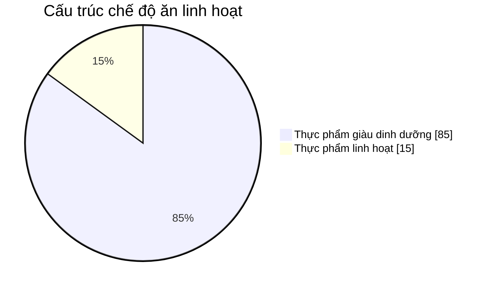
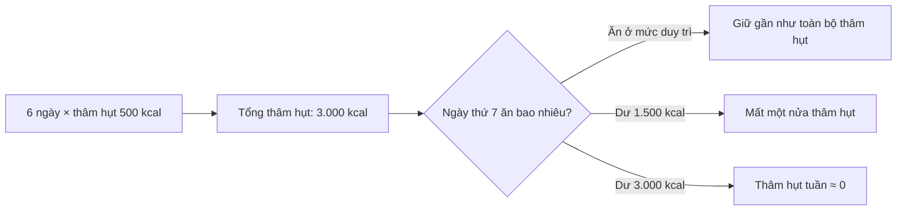

[](https://easy-peasy.ai/ai-image-generator/images/well-balanced-meal-vegetables-fruits-lean-proteins-whole-grains?utm_source=chatgpt.com)

# 047 — Cheat Days & Cheat Meals

| Thuộc tính             | Nội dung                                                                                                                                            |
| ---------------------- | --------------------------------------------------------------------------------------------------------------------------------------------------- |
| **Module**             | Module 05 — Adjusting Your Diet for Weight Loss & Muscle Gains                                                                                      |
| **Bài học**            | Cheat Days & Cheat Meals                                                                                                                            |
| **Tên tiếng Việt**     | Ngày ăn tự do và bữa ăn tự do                                                                                                                       |
| **Thời lượng**         | 04:39                                                                                                                                               |
| **Chủ đề chính**       | Cách đưa món ăn yêu thích vào chế độ ăn mà không phá vỡ mục tiêu                                                                                    |
| **Thông điệp cốt lõi** | Một bữa ăn linh hoạt có kiểm soát thường không làm hỏng tiến trình, nhưng cả ngày ăn không giới hạn có thể xóa phần lớn thâm hụt calorie trong tuần |

> **Thuật ngữ:** Bản chép lời có một số vị trí nhận dạng nhầm “cheat” thành “cheap”. Thuật ngữ đúng là **cheat meal** và **cheat day**.


*Ảnh minh họa một bữa ăn giàu dinh dưỡng. [Xem trang nguồn và giấy phép](https://commons.wikimedia.org/wiki/File:Healthy_meal.jpg).* ([Wikimedia Commons][1])

## Mục lục

1. [Mục tiêu bài học](#1-mục-tiêu-bài-học)
2. [Nội dung chính](#2-nội-dung-chính)
3. [Áp dụng thực tế](#3-áp-dụng-thực-tế)
4. [Lưu ý và lỗi thường gặp](#4-lưu-ý-và-lỗi-thường-gặp)
5. [Checklist thực hành](#5-checklist-thực-hành)
6. [Tóm tắt](#6-tóm-tắt)

---

## 1. Mục tiêu bài học

Sau bài học này, người học có thể:

* Phân biệt **cheat meal**, **cheat day** và **bữa ăn linh hoạt có kế hoạch**.
* Hiểu tại sao một món ăn riêng lẻ không quyết định toàn bộ kết quả giảm mỡ hoặc tăng cơ.
* Đánh giá ảnh hưởng của một bữa ăn nhiều calorie đến **tổng calorie theo ngày và theo tuần**.
* Đưa pizza, burger, chocolate hoặc món tráng miệng vào chế độ ăn mà vẫn kiểm soát tiến trình.
* Tránh tư duy cực đoan: ăn “hoàn hảo” trong tuần rồi ăn mất kiểm soát vào cuối tuần.
* Nhận biết khi khái niệm “cheat meal” đang chuyển thành hành vi ăn uống không lành mạnh.

---

## 2. Nội dung chính

### 2.1. Cheat meal là gì?

**Cheat meal** thường được hiểu là một bữa ăn tạm thời khác với chế độ ăn thường ngày, trong đó người ăn lựa chọn các món mình yêu thích như:

* Pizza.
* Hamburger.
* Chocolate.
* Kem.
* Bánh ngọt.
* Đồ chiên.
* Các món ăn nhà hàng nhiều calorie.

Điểm quan trọng là cheat meal chỉ nên là **một bữa ăn có giới hạn**, không phải một khoảng thời gian ăn uống hoàn toàn mất kiểm soát.

Một tổng quan phạm vi xuất bản năm 2025 cho thấy định nghĩa “cheat meal” trong nghiên cứu vẫn chưa thống nhất: nó có thể là một bữa, một ngày hoặc thậm chí nhiều bữa trong cuối tuần. Tổng quan này chỉ tìm được tám nghiên cứu phù hợp, vì vậy bằng chứng về lợi ích sinh lý hoặc tâm lý của cheat meal hiện vẫn còn hạn chế. ([PubMed][2])

### 2.2. Cheat day là gì?

**Cheat day** là cả một ngày mà người ăn:

* Không theo dõi calorie.
* Không kiểm soát khẩu phần.
* Không quan tâm đến protein, carbohydrate và chất béo.
* Ăn nhiều bữa nhà hàng, đồ uống có đường và món tráng miệng.
* Có tâm lý “hôm nay ăn thoải mái, ngày mai làm lại”.

Cheat day nguy hiểm hơn cheat meal vì nó có thể tạo ra lượng calorie dư rất lớn chỉ trong một ngày.

### 2.3. Thuật ngữ phù hợp hơn: bữa ăn linh hoạt

Từ **“cheat”** mang hàm ý gian lận, phạm lỗi hoặc làm điều sai trái. Điều này dễ hình thành vòng lặp:

```text
Ăn kiêng quá nghiêm ngặt
        ↓
Thèm ăn và căng thẳng
        ↓
“Cheat meal” mất kiểm soát
        ↓
Cảm giác tội lỗi
        ↓
Nhịn ăn hoặc tập quá mức
        ↓
Tiếp tục ăn kiêng cực đoan
```

Một cách gọi trung tính hơn là:

* **Bữa ăn linh hoạt**.
* **Món ăn yêu thích có kế hoạch**.
* **Planned indulgence** — phần thưởng thức được lên kế hoạch.
* **Discretionary food** — thực phẩm tùy chọn trong ngân sách calorie.

Nghiên cứu trên người tập kháng lực cho thấy chế độ ăn linh hoạt và chế độ ăn cứng nhắc đều có thể tạo ra giảm mỡ khi tổng năng lượng được kiểm soát. Điều này cho thấy tính linh hoạt không đồng nghĩa với thiếu kỷ luật. ([PubMed Central (PMC)][3])

---

### 2.4. Một món ăn không quyết định toàn bộ chế độ ăn

Cơ thể không “bật chế độ tích mỡ” chỉ vì người ăn dùng một miếng pizza hoặc một thanh chocolate. Kết quả dài hạn phụ thuộc nhiều hơn vào:

* Tổng calorie tiêu thụ.
* Tổng calorie tiêu hao.
* Lượng protein.
* Chất lượng carbohydrate và chất béo.
* Chất xơ.
* Vitamin và khoáng chất.
* Mô hình ăn uống được duy trì trong nhiều ngày, nhiều tuần và nhiều tháng.

Các hướng dẫn dinh dưỡng cũng nhấn mạnh rằng sức khỏe chịu ảnh hưởng bởi **mô hình ăn uống tổng thể**, chứ không chỉ bởi một thực phẩm hoặc một chất dinh dưỡng riêng lẻ. ([PubMed Central (PMC)][4])

Tuy nhiên, điều này **không có nghĩa mọi loại thực phẩm đều giống nhau**.

| Hai món có cùng calorie | Vẫn có thể khác nhau về                                   |
| ----------------------- | --------------------------------------------------------- |
| Cá và bánh ngọt         | Protein, chất béo thiết yếu, vitamin và khoáng chất       |
| Khoai tây và nước ngọt  | Độ no, chất xơ và khả năng kiểm soát khẩu phần            |
| Trái cây và kẹo         | Chất xơ, mật độ dinh dưỡng và tốc độ ăn                   |
| Cơm với thịt và pizza   | Protein, sodium, chất béo bão hòa và kích thước khẩu phần |

Vì vậy:

> **Calorie quyết định phần lớn xu hướng tăng hoặc giảm cân; chất lượng thực phẩm ảnh hưởng đến sức khỏe, độ no, hiệu suất tập luyện và khả năng duy trì chế độ ăn.**

---

### 2.5. Nguyên tắc 80–90% và 10–20%

Một nguyên tắc thực hành phổ biến là:

* **80–90% lượng ăn:** thực phẩm giàu dinh dưỡng.
* **10–20% còn lại:** món ăn linh hoạt theo sở thích.



#### Nhóm 80–90% nên ưu tiên

* Thịt nạc, cá, trứng, sữa và đậu.
* Cơm, khoai, yến mạch và ngũ cốc nguyên hạt.
* Rau xanh.
* Trái cây.
* Các loại hạt.
* Nguồn chất béo không bão hòa.
* Thực phẩm ít qua chế biến.

#### Nhóm 10–20% có thể linh hoạt

* Chocolate.
* Bánh quy.
* Pizza.
* Burger.
* Kem.
* Trà sữa.
* Món tráng miệng.
* Đồ ăn nhà hàng.

Đây là **nguyên tắc định hướng**, không phải tỷ lệ bắt buộc cho mọi người. Mục tiêu của nó là bảo đảm phần lớn khẩu phần đáp ứng nhu cầu protein, chất xơ và vi chất, đồng thời vẫn dành một phần cho sự thoải mái và tính bền vững.

Tài liệu Dietary Guidelines for Americans 2020–2025 cũng nhấn mạnh việc đáp ứng nhu cầu dinh dưỡng chủ yếu bằng thực phẩm giàu dinh dưỡng, ở trong giới hạn calorie và hạn chế thực phẩm nhiều đường bổ sung, chất béo bão hòa cùng sodium. ([PubMed Central (PMC)][4])

#### Hình ảnh từ tài liệu dinh dưỡng


*Hình nghiên cứu so sánh một số lựa chọn giàu dinh dưỡng với lựa chọn thông thường có nhiều đường, sodium hoặc chất béo bão hòa hơn. Nguồn: Dietary Guidelines for Americans 2020–2025, được lưu trữ tại NCBI.* 

---

### 2.6. Tại sao cheat meal thường ít ảnh hưởng hơn cheat day?

Giả sử một người có:

* **Mức duy trì:** 2.500 kcal/ngày.
* **Mức giảm cân:** 2.000 kcal/ngày.
* **Thâm hụt mỗi ngày:** 500 kcal.

Sau sáu ngày:

[
500 \times 6 = 3.000\ \text{kcal thâm hụt}
]

#### Các kịch bản trong ngày thứ bảy

| Lượng ăn ngày thứ bảy | So với mức duy trì | Thâm hụt còn lại trong tuần |
| --------------------: | -----------------: | --------------------------: |
|            2.000 kcal |          −500 kcal |                 −3.500 kcal |
|            2.500 kcal |             0 kcal |                 −3.000 kcal |
|            3.000 kcal |          +500 kcal |                 −2.500 kcal |
|            4.000 kcal |        +1.500 kcal |                 −1.500 kcal |
|            5.500 kcal |        +3.000 kcal |                      0 kcal |

Như vậy, một cheat day ở mức **5.500 kcal** có thể xóa toàn bộ thâm hụt được tạo ra trong sáu ngày trước đó.



> Đây là ví dụ minh họa đơn giản. Biến động cân nặng thực tế còn chịu ảnh hưởng bởi nước, lượng thức ăn trong hệ tiêu hóa, glycogen, sodium và sự thích nghi của cơ thể. Công cụ Body Weight Planner của NIDDK sử dụng mô hình động để lập kế hoạch calorie và cân nặng cá nhân hóa thay vì giả định cân nặng thay đổi hoàn toàn tuyến tính. ([Viện Quốc gia về Bệnh Tiểu đường và Thận][5])

---

### 2.7. Cheat meal không phải biện pháp “tăng trao đổi chất” thần kỳ

Một số người cho rằng cheat meal có thể:

* “Đánh lừa” cơ thể.
* Tăng mạnh quá trình trao đổi chất.
* Khởi động lại hormone.
* Đốt mỡ nhanh hơn trong những ngày sau.
* Bù lại mọi tác động của việc ăn kiêng.

Hiện chưa có đủ bằng chứng để khẳng định một cheat meal thông thường tạo ra hiệu ứng trao đổi chất đủ lớn để bù cho lượng calorie dư. Tổng quan năm 2025 kết luận cheat meal có thể mang lại lợi ích trong một số hoàn cảnh, nhưng bằng chứng còn ít và nó cũng có nguy cơ thúc đẩy mô hình ăn uống không lành mạnh. ([The Chinese University of Hong Kong][6])

Do đó, lý do hợp lý nhất để sử dụng bữa ăn linh hoạt là:

* Tăng sự thoải mái.
* Dễ tham gia các hoạt động xã hội.
* Giảm cảm giác bị cấm đoán.
* Cải thiện khả năng tuân thủ lâu dài.

Không nên sử dụng nó như một “mẹo trao đổi chất”.

---

### 2.8. So sánh ba cách tiếp cận

| Tiêu chí              | Bữa ăn linh hoạt     | Cheat meal mất kiểm soát | Cheat day                 |
| --------------------- | -------------------- | ------------------------ | ------------------------- |
| Có kế hoạch           | Có                   | Thường không             | Thường không              |
| Có giới hạn khẩu phần | Có                   | Không rõ ràng            | Hầu như không             |
| Theo dõi calorie      | Có thể ước tính      | Dễ bỏ qua                | Thường bỏ hoàn toàn       |
| Thời lượng            | Một món hoặc một bữa | Một bữa rất lớn          | Cả ngày hoặc cả cuối tuần |
| Tâm lý                | Trung tính           | “Ăn cho đáng”            | “Hôm nay ăn tất cả”       |
| Nguy cơ phá thâm hụt  | Thấp nếu kiểm soát   | Trung bình đến cao       | Cao                       |
| Khả năng duy trì      | Tốt                  | Không ổn định            | Thường kém                |


*Ảnh minh họa món burger có mật độ calorie cao. [Xem trang nguồn và giấy phép](https://commons.wikimedia.org/wiki/File:Cheeseburger_on_Plate.jpg).* ([Wikimedia Commons][7])

---

## 3. Áp dụng thực tế

### 3.1. Lên kế hoạch trước thay vì quyết định khi đang đói

Trước bữa ăn linh hoạt, hãy xác định:

1. Sẽ ăn món gì?
2. Khẩu phần bao nhiêu?
3. Ăn tại đâu?
4. Có dùng đồ uống chứa calorie không?
5. Món ăn dự kiến cung cấp khoảng bao nhiêu calorie?
6. Lượng protein trong ngày có còn được bảo đảm không?

Ví dụ:

```text
Mục tiêu trong ngày: 2.000 kcal

Bữa sáng:     400 kcal
Bữa trưa:     500 kcal
Bữa phụ:      200 kcal
Bữa linh hoạt: 700 kcal
Phần dự phòng: 200 kcal
----------------------
Tổng:        2.000 kcal
```

### 3.2. “Đặt trước” món ăn trong ứng dụng theo dõi

Thay vì ăn xong mới nhập dữ liệu:

* Nhập món dự định ăn từ đầu ngày.
* Ước tính thêm dầu, sốt và topping.
* Sau đó sắp xếp các bữa còn lại.

Cách này giúp món ăn yêu thích trở thành **một phần của kế hoạch**, thay vì một sự cố ngoài kế hoạch.

### 3.3. Duy trì protein và chất xơ

Ngay cả trong ngày có bữa ăn linh hoạt, vẫn nên duy trì:

* Protein trong các bữa chính.
* Rau hoặc trái cây.
* Nước.
* Một lượng chất xơ hợp lý.
* Khẩu phần carbohydrate và chất béo phù hợp mục tiêu.

Ví dụ, thay vì chỉ ăn pizza và nước ngọt:

```text
Salad hoặc rau
       +
Nguồn protein
       +
2–3 miếng pizza
       +
Nước hoặc đồ uống không calorie
```

Cấu trúc này thường dễ kiểm soát hơn việc đến bữa ăn trong trạng thái quá đói.

### 3.4. Chọn thứ mình thực sự muốn ăn

Không cần gom tất cả món yêu thích vào cùng một bữa.

**Cách khó kiểm soát:**

* Burger.
* Khoai chiên lớn.
* Nước ngọt.
* Gà rán.
* Pizza.
* Kem.
* Bánh ngọt.

**Cách linh hoạt hơn:**

* Chọn burger và khoai nhỏ.
* Hoặc pizza và salad.
* Hoặc bữa ăn bình thường cùng một phần tráng miệng.
* Hoặc chocolate sau bữa chính.

### 3.5. Kiểm soát các calorie “vô hình”

Một bữa nhà hàng có thể tăng calorie đáng kể từ:

* Dầu chiên.
* Bơ.
* Mayonnaise.
* Sốt phô mai.
* Kem béo.
* Topping.
* Nước ngọt.
* Đồ uống có cồn.
* Phần ăn lớn hơn dự kiến.

Ví dụ:

| Thành phần      | Calorie ước tính |
| --------------- | ---------------: |
| Burger          |         650 kcal |
| Khoai chiên lớn |         500 kcal |
| Nước ngọt       |         250 kcal |
| Sốt bổ sung     |         150 kcal |
| Kem tráng miệng |         400 kcal |
| **Tổng**        |   **1.950 kcal** |

Chỉ một bữa như vậy có thể gần bằng toàn bộ ngân sách calorie của một ngày giảm cân.

### 3.6. Trở lại chế độ bình thường ngay từ bữa tiếp theo

Sau một bữa ăn nhiều hơn dự kiến:

* Không cần nhịn ăn cả ngày hôm sau.
* Không cần tập cardio để “trừng phạt”.
* Không cần cắt toàn bộ carbohydrate.
* Không cần bỏ cuộc đến đầu tuần sau.

Chỉ cần:

```text
Ghi nhận bữa ăn
      ↓
Đánh giá điều gì đã xảy ra
      ↓
Uống đủ nước và ngủ bình thường
      ↓
Quay lại kế hoạch ở bữa tiếp theo
```

---

## 4. Lưu ý và lỗi thường gặp

### 4.1. Biến một bữa thành cả ngày

Một chuỗi thường gặp:

```text
Bữa trưa ăn pizza
→ “Hôm nay đã phá chế độ rồi”
→ Chiều uống trà sữa
→ Tối ăn buffet
→ Đêm ăn thêm bánh
→ Chủ nhật tiếp tục
```

Vấn đề không nằm ở hai miếng pizza ban đầu, mà ở suy nghĩ **“đã sai một lần thì sai luôn”**.

### 4.2. Dùng cheat meal làm phần thưởng cho việc nhịn đói

Không nên:

* Nhịn ăn cả ngày để tối ăn buffet.
* Tập gấp đôi để “kiếm quyền” ăn.
* Chỉ ăn rau trong nhiều ngày để dành calorie.
* Bỏ bữa sau khi ăn nhiều.
* Dùng thức ăn như phần thưởng cho giá trị bản thân.

Những hành vi này có thể củng cố mối quan hệ tiêu cực với thực phẩm.

### 4.3. Không tính đồ uống và nước sốt

Người ăn thường chỉ ước tính món chính nhưng bỏ qua:

* Trà sữa.
* Nước ngọt.
* Cocktail.
* Sốt salad.
* Dầu ăn.
* Mayonnaise.
* Phô mai.
* Kem và món tráng miệng.

Đây có thể là phần làm bữa ăn vượt ngân sách nhiều nhất.

### 4.4. Tin rằng “ăn sạch” sáu ngày bảo vệ được ngày thứ bảy

Cơ thể không tách riêng tuần thành:

* Sáu ngày tốt.
* Một ngày miễn tính calorie.

Tổng năng lượng vẫn được tích lũy liên tục. Một ngày dư calorie rất lớn có thể làm giảm hoặc xóa thâm hụt của những ngày trước đó.

### 4.5. Xem thực phẩm là “tốt” hoặc “xấu” tuyệt đối

Các cách gọi như:

* Đồ ăn sạch.
* Đồ ăn bẩn.
* Ăn ngoan.
* Ăn hỏng.
* Thực phẩm cấm.

có thể khiến người ăn cảm thấy tội lỗi và mất kiểm soát khi sử dụng một món nằm ngoài kế hoạch.

Cách đánh giá hữu ích hơn:

| Thay vì hỏi                   | Hãy hỏi                                       |
| ----------------------------- | --------------------------------------------- |
| “Món này có xấu không?”       | “Khẩu phần này có phù hợp mục tiêu không?”    |
| “Tôi có được phép ăn không?”  | “Tôi sẽ bố trí món này vào kế hoạch thế nào?” |
| “Tôi đã phá chế độ chưa?”     | “Tổng lượng ăn trong ngày và tuần ra sao?”    |
| “Ngày mai phải nhịn bao lâu?” | “Bữa tiếp theo tôi quay lại thói quen nào?”   |

### 4.6. Cheat meal và nguy cơ ăn mất kiểm soát

Một nghiên cứu quan sát trên 2.717 thanh thiếu niên và người trẻ tại Canada cho thấy cheat meal khá phổ biến; khẩu phần được báo cáo thường ở mức 1.000–1.499 kcal và hành vi này có liên hệ với một số biểu hiện rối loạn ăn uống. Do đây là nghiên cứu quan sát, kết quả không chứng minh cheat meal trực tiếp gây ra rối loạn ăn uống, nhưng nó cho thấy cần thận trọng với tư duy “ăn bù” hoặc “ăn không giới hạn”. ([PubMed][8])

Nên ngừng sử dụng khái niệm cheat meal và tìm hỗ trợ chuyên môn khi thường xuyên xuất hiện:

* Mất kiểm soát trong lúc ăn.
* Ăn đến đau hoặc khó chịu.
* Giấu người khác khi ăn.
* Cảm giác xấu hổ hoặc tội lỗi nghiêm trọng.
* Nhịn ăn, gây nôn hoặc tập quá mức để bù lại.
* Ám ảnh về calorie và cân nặng.
* Vòng lặp hạn chế nghiêm ngặt rồi ăn bùng phát.

---

## 5. Checklist thực hành

### Trước bữa ăn linh hoạt

* [ ] Tôi đã xác định món mình thực sự muốn ăn.
* [ ] Tôi đã ước tính calorie và khẩu phần.
* [ ] Tôi đã tính cả đồ uống, nước sốt và món tráng miệng.
* [ ] Tôi không nhịn đói cực đoan để chuẩn bị cho bữa ăn.
* [ ] Tôi vẫn bảo đảm protein trong ngày.
* [ ] Tôi hiểu đây là một bữa ăn, không phải cả ngày ăn không giới hạn.

### Trong bữa ăn

* [ ] Tôi ăn chậm và chú ý tín hiệu no.
* [ ] Tôi không ăn chỉ vì phải “tận dụng cheat meal”.
* [ ] Tôi không gọi thêm nhiều món chỉ vì hôm nay là ngày đặc biệt.
* [ ] Tôi có thể dừng khi đã hài lòng.
* [ ] Tôi không xem đây là lần cuối được ăn món mình thích.

### Sau bữa ăn

* [ ] Tôi không tự trách hoặc cảm thấy mình đã thất bại.
* [ ] Tôi không nhịn ăn để bù lại.
* [ ] Tôi quay lại kế hoạch từ bữa tiếp theo.
* [ ] Tôi đánh giá tổng calorie theo ngày và theo tuần.
* [ ] Tôi điều chỉnh khẩu phần cho lần tiếp theo nếu cần.
* [ ] Tôi theo dõi xu hướng cân nặng trong nhiều tuần, không phản ứng với một lần cân.

---

## 6. Tóm tắt

* **Một món ăn riêng lẻ không quyết định toàn bộ kết quả.** Tổng lượng calorie, protein, chất xơ, vi chất và mô hình ăn uống dài hạn quan trọng hơn.
* **Cheat meal có kiểm soát** thường có thể được đưa vào chế độ ăn mà không phá hỏng tiến trình.
* **Cheat day không giới hạn** có thể tạo ra lượng calorie dư đủ lớn để xóa thâm hụt của cả tuần.
* Nguyên tắc **80–90% thực phẩm giàu dinh dưỡng và 10–20% linh hoạt** là một công cụ thực hành, không phải quy luật bắt buộc.
* Không nên xem cheat meal là cách “tăng trao đổi chất” hoặc đốt mỡ thần kỳ; bằng chứng hiện có còn hạn chế. ([PubMed][2])
* Cách tiếp cận tốt nhất là **lập kế hoạch, kiểm soát khẩu phần và quay lại thói quen bình thường ngay từ bữa tiếp theo**.
* Một chế độ ăn hiệu quả không phải chế độ hoàn hảo nhất, mà là chế độ phù hợp với mục tiêu, sức khỏe, sở thích và có thể duy trì lâu dài.

> **Thông điệp cuối cùng:**
> Đừng xây dựng sáu ngày ăn kiêng khắc nghiệt chỉ để đổi lấy một ngày ăn mất kiểm soát. Hãy xây dựng một chế độ ăn đủ linh hoạt để không cần “phá luật”.

### Tài liệu nghiên cứu tham khảo

1. Tsang JH và cộng sự. *The Role of Cheat Meals in Dieting: A Scoping Review of Physiological and Psychological Responses*. Nutrition Reviews, 2025. ([PubMed][2])
2. Conlin LA và cộng sự. *Flexible vs. Rigid Dieting in Resistance-Trained Individuals*. Journal of the International Society of Sports Nutrition, 2021. ([PubMed Central (PMC)][3])
3. Ganson KT và cộng sự. *Characterizing Cheat Meals Among a National Sample of Canadian Adolescents and Young Adults*. Journal of Eating Disorders, 2022. ([Springer][9])
4. Dietary Guidelines for Americans 2020–2025 — tổng quan về mô hình ăn uống giàu dinh dưỡng và giới hạn calorie. ([PubMed Central (PMC)][4])
5. NIDDK Body Weight Planner — công cụ mô hình hóa calorie và thay đổi cân nặng theo thời gian. ([Viện Quốc gia về Bệnh Tiểu đường và Thận][5])

[1]: https://commons.wikimedia.org/wiki/File%3AHealthy_meal.jpg?utm_source=chatgpt.com "File:Healthy meal.jpg - Wikimedia Commons"
[2]: https://pubmed.ncbi.nlm.nih.gov/40517327/?utm_source=chatgpt.com "The Role of Cheat Meals in Dieting: A Scoping Review ..."
[3]: https://pmc.ncbi.nlm.nih.gov/articles/PMC8243453/?utm_source=chatgpt.com "Flexible vs. rigid dieting in resistance-trained individuals ..."
[4]: https://pmc.ncbi.nlm.nih.gov/articles/PMC8713704/ "Dietary Guidelines for Americans, 2020–2025: Understanding the Scientific Process, Guidelines, and Key Recommendations - PMC"
[5]: https://www.niddk.nih.gov/health-information/weight-management/body-weight-planner?utm_source=chatgpt.com "About the Body Weight Planner - NIDDK"
[6]: https://research.cuhk.edu.hk/en/publications/the-role-of-cheat-meals-in-dieting-a-scoping-review-of-physiologi/?utm_source=chatgpt.com "The Role of Cheat Meals in Dieting: A Scoping Review ..."
[7]: https://commons.wikimedia.org/wiki/File%3ACheeseburger_on_Plate.jpg?utm_source=chatgpt.com "File:Cheeseburger on Plate.jpg - Wikimedia Commons"
[8]: https://pubmed.ncbi.nlm.nih.gov/35933394/?utm_source=chatgpt.com "Characterizing cheat meals among a national sample of ..."
[9]: https://link.springer.com/article/10.1186/s40337-022-00642-6?utm_source=chatgpt.com "Characterizing cheat meals among a national sample of ..."
