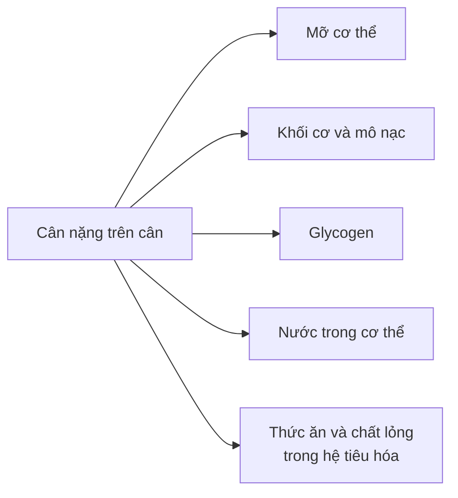
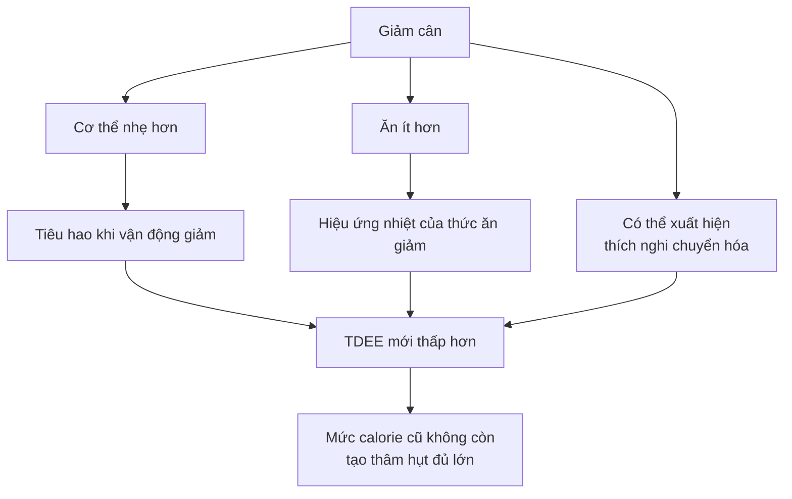
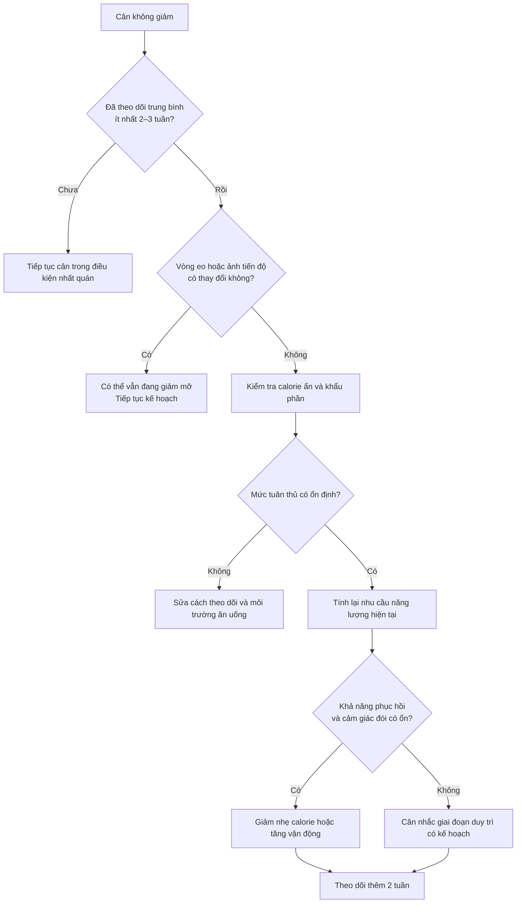

# 048 — How To Break Through A Weight Loss Plateau

| Thuộc tính         | Nội dung                                                       |
| ------------------ | -------------------------------------------------------------- |
| **Module**         | Module 05 — Adjusting Your Diet for Weight Loss & Muscle Gains |
| **Bài học**        | How To Break Through A Weight Loss Plateau                     |
| **Thời lượng**     | 04:09                                                          |
| **Chủ đề chính**   | Cách vượt qua giai đoạn chững cân                              |
| **Tên tiếng Việt** | Cách vượt qua giai đoạn chững cân khi giảm mỡ                  |


*Ảnh minh họa: theo dõi cân nặng bằng cân điện tử — Wikimedia Commons.* ([Wikimedia Commons][1])

## Mục lục

1. [Mục tiêu bài học](#1-mục-tiêu-bài-học)
2. [Nội dung chính](#2-nội-dung-chính)
3. [Áp dụng thực tế](#3-áp-dụng-thực-tế)
4. [Lưu ý & lỗi thường gặp](#4-lưu-ý--lỗi-thường-gặp)
5. [Checklist thực hành](#5-checklist-thực-hành)
6. [Tóm tắt](#6-tóm-tắt)

---

## 1. Mục tiêu bài học

Sau bài học này, bạn có thể:

* Phân biệt **chững cân trên cân điện tử** với **thực sự ngừng giảm mỡ**.
* Hiểu vì sao nước, glycogen, thức ăn trong hệ tiêu hóa và chu kỳ kinh nguyệt có thể che khuất quá trình giảm mỡ.
* Xác định những nguyên nhân phổ biến khiến mức thâm hụt calorie biến mất.
* Kiểm tra lại khẩu phần trước khi tiếp tục cắt giảm calorie.
* Điều chỉnh lượng ăn hoặc mức vận động theo từng bước nhỏ, thay vì phản ứng cực đoan.
* Nhận biết khi nào biến động cân nặng có thể liên quan đến vấn đề sức khỏe.

---

## 2. Nội dung chính

### 2.1. “Chững cân” chưa chắc là “chững giảm mỡ”

Nhiều người thấy cân nặng không thay đổi trong vài ngày và kết luận rằng chế độ ăn đã ngừng hoạt động. Tuy nhiên, số cân hiển thị không chỉ phản ánh lượng mỡ cơ thể.



Cân nặng toàn cơ thể là tổng hợp của nước, mỡ, protein, glycogen, khoáng chất và nhiều thành phần khác. Vì vậy, một thay đổi ngắn hạn trên cân không thể được mặc định là lượng mỡ tăng hoặc giảm tương ứng. ([PubMed Central (PMC)][2])

> **Quy tắc thực hành:** Chỉ nên nghi ngờ một plateau thật sự khi **trung bình cân nặng 7 ngày** gần như không thay đổi trong khoảng **2–3 tuần liên tiếp**, đồng thời việc ăn uống và vận động được duy trì tương đối nhất quán.

---

### 2.2. Vì sao cân nặng có thể đứng yên dù vẫn đang giảm mỡ?

#### A. Nước và glycogen

Khi ăn nhiều carbohydrate hơn bình thường, cơ thể có thể dự trữ thêm glycogen trong gan và cơ. Glycogen được lưu trữ cùng nước; nghiên cứu thường ghi nhận tỷ lệ xấp xỉ vài gram nước đi kèm mỗi gram glycogen trong mô cơ. Do đó, một bữa ăn nhiều carbohydrate có thể làm cân tăng tạm thời mà không đồng nghĩa với tăng lượng mỡ tương ứng. ([PubMed Central (PMC)][3])


#### B. Thay đổi lượng natri

Một thay đổi đột ngột về lượng natri có thể làm thay đổi cảm giác khát, lượng nước uống, phân bố dịch và cân nặng ngắn hạn. Ảnh hưởng thực tế phụ thuộc vào thời gian, chức năng thận, lượng nước uống và chế độ ăn tổng thể; vì vậy, mối quan hệ giữa natri và cân nặng phức tạp hơn công thức “ăn mặn bằng giữ đúng một lượng nước cố định”. ([PubMed][4])

#### C. Chu kỳ kinh nguyệt

Ở phụ nữ trong độ tuổi sinh sản, cân nặng có thể tăng trung bình khoảng **0,5 kg** trong một số giai đoạn của chu kỳ, chủ yếu liên quan đến thay đổi lượng dịch ngoại bào. Khi đánh giá tiến độ, nên so sánh cân nặng giữa các giai đoạn tương ứng của những chu kỳ liên tiếp thay vì chỉ so sánh từng tuần liền kề. ([PubMed][5])

#### D. Lượng thức ăn trong đường tiêu hóa

Một bữa ăn lớn có thể làm cân tăng ngay ngày hôm sau vì cơ thể vẫn đang chứa thức ăn và chất lỏng. Đây là **khối lượng vật chất trong hệ tiêu hóa**, không phải toàn bộ đã được chuyển thành mỡ.

---

### 2.3. Có nên uống thật nhiều nước để “đẩy nước” ra ngoài?

Lời giải thích rằng cơ thể giữ nước đơn giản vì “nghĩ rằng đang không được uống đủ” là quá đơn giản hóa.

Việc điều hòa nước còn liên quan đến:

* Nồng độ natri và áp suất thẩm thấu.
* Hoạt động của thận.
* Các hormone điều hòa dịch.
* Lượng carbohydrate và glycogen.
* Thuốc đang sử dụng.
* Chu kỳ kinh nguyệt và một số tình trạng sức khỏe.

Uống đủ nước là cần thiết, nhưng **cố uống quá nhiều nước không phải cách bảo đảm loại bỏ giữ nước**. Thay vào đó, nên duy trì lượng nước và natri tương đối ổn định giữa các ngày để dữ liệu cân nặng dễ so sánh hơn.

> **Không nên:** cắt natri cực đoan, dùng thuốc lợi tiểu hoặc ép uống lượng nước rất lớn chỉ để làm cân giảm nhanh.

---

### 2.4. Khi plateau là thật: cơ thể đã cần ít năng lượng hơn

Khi cân nặng giảm xuống, cơ thể phải duy trì và di chuyển một khối lượng nhỏ hơn. Vì vậy, tổng năng lượng tiêu hao hàng ngày thường giảm theo.

Ngoài sự giảm tiêu hao do cơ thể nhỏ hơn, một số người còn xuất hiện **thích nghi chuyển hóa** — mức tiêu hao năng lượng giảm nhiều hơn mức dự đoán chỉ dựa trên thay đổi thành phần cơ thể. Mức độ thích nghi khác nhau đáng kể giữa từng người. ([PubMed][6])



Ví dụ:

| Giai đoạn                     |   Lượng ăn | Nhu cầu duy trì |           Thâm hụt |
| ----------------------------- | ---------: | --------------: | -----------------: |
| Đầu chế độ ăn                 | 2.000 kcal |      2.400 kcal |      400 kcal/ngày |
| Sau khi đã giảm cân           | 2.000 kcal |      2.100 kcal |      100 kcal/ngày |
| Có thêm calorie không ghi lại | 2.150 kcal |      2.100 kcal | Không còn thâm hụt |

Các mô hình năng lượng động cho thấy việc sử dụng quy tắc tuyến tính đơn giản, chẳng hạn “mỗi ngày bớt 500 kcal sẽ tiếp tục giảm với cùng tốc độ mãi mãi”, thường đánh giá quá cao lượng cân có thể giảm trong dài hạn. ([PubMed Central (PMC)][7])

---

### 2.5. “Calorie ẩn” và sai số theo dõi

Plateau không phải lúc nào cũng chủ yếu do chuyển hóa bị chậm lại. Việc ăn nhiều hơn dự định — đôi khi không có chủ ý — là một nguyên nhân rất phổ biến.

Các nghiên cứu sử dụng phương pháp đo năng lượng khách quan cho thấy lượng calorie tự báo cáo có thể thấp hơn lượng thực tế đáng kể. Sai số thường đến từ khẩu phần ước lượng, món ăn ngoài hàng, dầu mỡ, đồ uống và những lần ăn nhỏ không được ghi lại. ([PubMed][8])

#### Những nguồn calorie thường bị bỏ sót

| Nguồn calorie     | Lỗi theo dõi phổ biến                               |
| ----------------- | --------------------------------------------------- |
| Dầu ăn, bơ        | Đổ trực tiếp vào chảo nhưng không cân hoặc đo       |
| Nước sốt          | Xem như “không đáng kể”                             |
| Các loại hạt      | Ăn trực tiếp từ túi, không xác định khẩu phần       |
| Đồ uống có đường  | Chỉ ghi món ăn mà quên đồ uống                      |
| Rượu bia          | Không tính vào tổng năng lượng                      |
| Đồ ăn thử khi nấu | Ăn nhiều lần nhưng không ghi                        |
| Bữa ăn nhà hàng   | Ước lượng thấp lượng dầu, sốt và khẩu phần          |
| Cuối tuần         | Ăn đúng trong tuần nhưng nới lỏng quá mức cuối tuần |

Một phần dầu ô liu, một nắm hạt lớn hoặc vài loại sốt có thể tạo ra chênh lệch vài trăm calorie. Khi mức thâm hụt vốn đã nhỏ, sai số này có thể làm tiến độ giảm cân dừng lại hoàn toàn.

Các mô hình nghiên cứu cũng chỉ ra rằng sự tuân thủ không liên tục có thể đóng vai trò lớn trong plateau sớm, thay vì mọi trường hợp đều do “trao đổi chất bị hỏng”. ([PubMed Central (PMC)][9])

---

### 2.6. Càng gầy, tốc độ giảm mỡ thường càng cần chậm lại

Nội dung gốc cho rằng người có tỷ lệ mỡ cao có thể giảm 2–3 pound mỡ mỗi tuần. Đây không nên được xem là mục tiêu chung cho tất cả mọi người.

Đối với người tập luyện muốn duy trì khối cơ, tốc độ thường được sử dụng là khoảng **0,5–1% trọng lượng cơ thể mỗi tuần**; người càng gầy thường nên tiến về phía chậm hơn của khoảng này. Các nghiên cứu ở vận động viên cho thấy tốc độ giảm chậm hơn có thể bảo vệ khối nạc và hiệu suất tốt hơn tốc độ giảm quá nhanh. ([PubMed][10])

| Trọng lượng hiện tại | Khoảng 0,5–1% mỗi tuần |
| -------------------: | ---------------------: |
|                60 kg |             0,3–0,6 kg |
|                70 kg |            0,35–0,7 kg |
|                80 kg |             0,4–0,8 kg |
|                90 kg |            0,45–0,9 kg |

Đây chỉ là khoảng tham khảo. Tốc độ phù hợp còn phụ thuộc vào tỷ lệ mỡ, tiền sử sức khỏe, thời gian ăn kiêng, cường độ tập luyện và khả năng duy trì chế độ ăn.

---

### 2.7. Diet break có thể hỗ trợ, nhưng không phải “phép màu”

**Diet break** là khoảng thời gian có kế hoạch, thường đưa lượng ăn trở về gần mức duy trì. Nó khác với cheat day hoặc một tuần ăn không kiểm soát.

Một số thử nghiệm cho thấy việc xen kẽ các giai đoạn duy trì có thể hỗ trợ khả năng tuân thủ, hiệu suất tập luyện hoặc giữ khối nạc trong một số nhóm. Tuy nhiên, các tổng quan nghiên cứu nhìn chung không cho thấy mọi hình thức hạn chế năng lượng gián đoạn đều giảm cân vượt trội rõ rệt so với hạn chế liên tục khi tổng thâm hụt tương đương. ([PubMed][11])

Một diet break hợp lý:

* Được lên kế hoạch trước.
* Ăn gần mức duy trì, không phải ăn thả cửa.
* Tiếp tục theo dõi trọng lượng và khẩu phần.
* Duy trì protein và tập luyện.
* Chấp nhận cân có thể tăng nhẹ do glycogen, nước và lượng thức ăn.

---

## 3. Áp dụng thực tế

### 3.1. Quy trình kiểm tra plateau



---

### 3.2. Bước 1 — Chuẩn hóa việc cân

Trong ít nhất 7–14 ngày:

1. Cân vào buổi sáng.
2. Đi vệ sinh trước khi cân.
3. Cân trước khi ăn hoặc uống.
4. Mặc lượng quần áo tương tự.
5. Đặt cân trên cùng một mặt sàn cứng.
6. Không so sánh một ngày riêng lẻ; sử dụng trung bình 7 ngày.

Công thức:

```text
Trung bình tuần = Tổng cân nặng của các ngày ÷ Số ngày đã cân
```

Ví dụ:

| Ngày           |     Cân nặng |
| -------------- | -----------: |
| Thứ Hai        |      75,2 kg |
| Thứ Ba         |      74,8 kg |
| Thứ Tư         |      75,4 kg |
| Thứ Năm        |      74,9 kg |
| Thứ Sáu        |      75,1 kg |
| Thứ Bảy        |      74,7 kg |
| Chủ Nhật       |      75,0 kg |
| **Trung bình** | **75,01 kg** |

Hãy so sánh **75,01 kg** với trung bình của tuần trước, không chỉ so sánh Chủ Nhật với Thứ Hai.

---

### 3.3. Bước 2 — Theo dõi thêm các chỉ số khác


*Ảnh minh họa đo vòng eo — Wikimedia Commons.* ([Wikimedia Commons][12])

Ngoài cân nặng, hãy theo dõi:

* Vòng eo tại cùng một vị trí.
* Ảnh trước, bên và sau trong cùng điều kiện ánh sáng.
* Độ vừa của quần áo.
* Hiệu suất tập luyện.
* Tỷ lệ tuân thủ kế hoạch ăn uống.

Nếu cân không đổi nhưng vòng eo nhỏ dần, chưa nên vội cắt thêm calorie.

---

### 3.4. Bước 3 — Thực hiện “kiểm toán calorie” trong 7 ngày

Trong một tuần:

* Cân thực phẩm thay vì chỉ ước lượng bằng mắt.
* Xác định thực phẩm được cân sống hay đã nấu.
* Ghi lại dầu, bơ và sốt.
* Ghi đồ uống, rượu bia và đồ ăn thử.
* Kiểm tra kích thước khẩu phần trên nhãn.
* Với món nhà hàng, chấp nhận rằng số calorie chỉ là ước tính.
* Ghi cả cuối tuần, không chỉ các ngày làm việc.

#### Ví dụ sai số nhỏ nhưng tích lũy lớn

| Khoản bị bỏ sót       | Calorie ước tính |
| --------------------- | ---------------: |
| Dầu dùng khi nấu      |         120 kcal |
| Sốt salad             |          80 kcal |
| Một ít hạt            |         100 kcal |
| **Tổng mỗi ngày**     |     **300 kcal** |
| **Tổng trong 7 ngày** |   **2.100 kcal** |

Con số trên chỉ là ví dụ minh họa; lượng thực tế phụ thuộc sản phẩm và khẩu phần.

---

### 3.5. Bước 4 — Chỉ điều chỉnh sau khi xác nhận plateau

Khi trung bình cân nặng và vòng eo không thay đổi trong 2–3 tuần, đồng thời khẩu phần đã được kiểm tra, hãy chọn **một** thay đổi nhỏ:

#### Phương án A — Giảm nhẹ lượng calorie

Giảm khoảng **5–10%** lượng calorie hiện tại.

Ví dụ:

```text
Lượng ăn hiện tại: 2.100 kcal
Giảm 5%: khoảng 105 kcal
Mức mới: khoảng 2.000 kcal
```

Không cần lập tức giảm 500–800 kcal.

#### Phương án B — Tăng hoạt động hàng ngày

Có thể:

* Tăng thêm khoảng 1.500–3.000 bước mỗi ngày.
* Thêm một số buổi đi bộ nhẹ.
* Hạn chế thời gian ngồi liên tục.
* Duy trì tập kháng lực để hỗ trợ bảo vệ khối cơ.

#### Phương án C — Kết hợp hai thay đổi rất nhỏ

Ví dụ:

* Giảm khoảng 100 kcal mỗi ngày.
* Tăng thêm khoảng 1.500 bước mỗi ngày.

Không nên đồng thời cắt mạnh lượng ăn và tăng mạnh cardio vì sẽ khó xác định yếu tố nào đang tạo ra thay đổi và có thể ảnh hưởng khả năng duy trì.

---

### 3.6. Ví dụ thực hành

Một người nặng 80 kg:

* Ăn mục tiêu: 2.200 kcal/ngày.
* Cân trung bình đứng yên trong ba tuần.
* Sau khi kiểm tra, phát hiện thường xuyên bỏ sót dầu và đồ uống cuối tuần.
* Lượng ăn thực tế gần 2.450 kcal — xấp xỉ mức duy trì.

**Cách xử lý hợp lý:**

1. Không cắt ngay xuống 1.700 kcal.
2. Theo dõi chính xác lại ở mức 2.200 kcal.
3. Giữ mức này thêm hai tuần.
4. Chỉ điều chỉnh nếu trung bình cân và vòng eo vẫn không thay đổi.

---

## 4. Lưu ý & lỗi thường gặp

### Lỗi 1 — Kết luận plateau chỉ sau vài ngày

Một hoặc hai lần cân không phản ánh xu hướng giảm mỡ.

**Cách sửa:** sử dụng trung bình 7 ngày và đánh giá trong nhiều tuần.

---

### Lỗi 2 — Nghĩ rằng mọi lần tăng cân đều là tăng mỡ

Để tăng một lượng mỡ đáng kể chỉ sau một ngày thường cần mức dư thừa năng lượng rất lớn. Phần đáng kể của thay đổi nhanh trên cân thường liên quan đến nước, glycogen và lượng thức ăn.

**Cách sửa:** xem lại carbohydrate, natri, bữa ăn ngoài hàng và thời điểm cân.

---

### Lỗi 3 — Cắt calorie mạnh ngay lập tức

Cắt quá mạnh có thể làm tăng cảm giác đói, giảm hiệu suất tập và khiến chế độ ăn khó duy trì. Giảm cân nhanh cũng làm tăng nguy cơ mất mô nạc ở nhiều đối tượng. ([PubMed][10])

**Cách sửa:** điều chỉnh từng bước nhỏ rồi theo dõi phản ứng trong khoảng hai tuần.

---

### Lỗi 4 — Đổ mọi nguyên nhân cho “trao đổi chất bị hỏng”

Thích nghi chuyển hóa là hiện tượng có thật, nhưng không có nghĩa cơ thể đã ngừng tuân theo cân bằng năng lượng. Plateau thường là kết quả kết hợp giữa cơ thể nhẹ hơn, tiêu hao thấp hơn, tăng cảm giác đói, giảm vận động vô thức và mức tuân thủ không còn như ban đầu. ([PubMed Central (PMC)][13])

---

### Lỗi 5 — Không theo dõi dầu, sốt, hạt và đồ uống

Đây là các thực phẩm có mật độ năng lượng cao và dễ bị đánh giá thấp.

**Cách sửa:** cân hoặc đo khẩu phần trong ít nhất một tuần kiểm toán.

---

### Lỗi 6 — Biến diet break thành cheat week

Ăn không kiểm soát trong nhiều ngày có thể xóa đi phần lớn thâm hụt đã tạo ra.

**Cách sửa:** diet break nên ở gần mức duy trì và vẫn có cấu trúc.

---

### Lỗi 7 — Cắt natri hoặc hạn chế nước cực đoan

Điều này có thể làm dữ liệu cân nặng khó diễn giải hơn và không giải quyết nguyên nhân thực sự của plateau.

**Cách sửa:** duy trì lượng nước và natri tương đối nhất quán, trừ khi bác sĩ đưa ra hướng dẫn khác.

---

### Lỗi 8 — Bỏ qua dấu hiệu sức khỏe bất thường

Tăng cân nhanh đi kèm phù chân, phù mặt, khó thở, đau ngực hoặc sưng không rõ nguyên nhân có thể liên quan đến tình trạng giữ dịch cần được đánh giá y tế, không nên mặc định là biến động bình thường của chế độ ăn. ([MedlinePlus][14])

> **Cần được tư vấn y tế:** người đang mang thai, có bệnh tim, thận, gan, rối loạn nội tiết, tiền sử rối loạn ăn uống hoặc đang dùng thuốc ảnh hưởng đến cân nặng và dịch cơ thể.

---

## 5. Checklist thực hành

### Kiểm tra dữ liệu

* [ ] Tôi đã theo dõi cân nặng ít nhất 14–21 ngày.
* [ ] Tôi sử dụng trung bình 7 ngày thay vì một lần cân riêng lẻ.
* [ ] Tôi cân trong cùng thời điểm và điều kiện.
* [ ] Tôi đã đo lại vòng eo.
* [ ] Tôi đã chụp ảnh tiến độ trong cùng điều kiện.

### Kiểm tra lượng ăn

* [ ] Tôi ghi lại dầu, bơ và nước sốt.
* [ ] Tôi ghi lại đồ uống và rượu bia.
* [ ] Tôi ghi lại đồ ăn thử và đồ ăn vặt.
* [ ] Tôi theo dõi cả cuối tuần.
* [ ] Tôi phân biệt khối lượng thực phẩm sống và chín.
* [ ] Tôi không ước lượng bằng mắt đối với thực phẩm nhiều calorie.

### Kiểm tra kế hoạch

* [ ] Mức giảm cân mục tiêu phù hợp với trọng lượng và tỷ lệ mỡ.
* [ ] Tôi không cắt calorie chỉ vì một ngày tăng cân.
* [ ] Tôi chỉ thay đổi một hoặc hai yếu tố nhỏ mỗi lần.
* [ ] Tôi duy trì tập kháng lực.
* [ ] Tôi đánh giá lại sau khoảng hai tuần.
* [ ] Diet break của tôi là giai đoạn ăn duy trì, không phải ăn mất kiểm soát.

### Kiểm tra sức khỏe

* [ ] Tôi không có tình trạng phù bất thường.
* [ ] Tôi không bị khó thở hoặc đau ngực.
* [ ] Tôi đã trao đổi với chuyên gia nếu đang có bệnh nền hoặc dùng thuốc liên quan.

---

## 6. Tóm tắt

> **Cân đứng yên không đồng nghĩa mỡ ngừng giảm.**

Cân nặng có thể bị ảnh hưởng bởi nước, glycogen, natri, chu kỳ kinh nguyệt và lượng thức ăn trong hệ tiêu hóa. Vì vậy, không nên xác định plateau chỉ từ một vài lần cân.

Quy trình xử lý hợp lý:


Các nguyên tắc quan trọng nhất:

1. **Kiểm tra dữ liệu trước khi thay đổi chế độ ăn.**
2. **Tìm calorie bị bỏ sót trước khi tiếp tục cắt giảm.**
3. **Chấp nhận rằng tốc độ giảm sẽ chậm lại khi cơ thể nhẹ và gầy hơn.**
4. **Điều chỉnh theo từng bước nhỏ, không phản ứng cực đoan.**
5. **Diet break có thể hỗ trợ khả năng duy trì nhưng không thay thế thâm hụt calorie.**
6. **Đánh giá xu hướng dài hạn, không chạy theo con số của từng ngày.**

### Hình nghiên cứu tham khảo

* [Hình mô tả thích nghi chuyển hóa trong quá trình giảm cân](https://pmc.ncbi.nlm.nih.gov/articles/PMC5097076/) — sơ đồ các giai đoạn thay đổi năng lượng tiêu hao và thành phần cơ thể. ([PubMed Central (PMC)][13])
* [Hình mô tả cân bằng năng lượng động và plateau](https://pmc.ncbi.nlm.nih.gov/articles/PMC6513301/) — thể hiện giảm glycogen, dịch, khối mỡ và thích nghi chuyển hóa theo thời gian. ([PubMed Central (PMC)][7])
* [Mô hình sinh lý của trạng thái sau giảm cân](https://www.nature.com/articles/s41366-025-01932-0) — liên hệ giữa giảm tiêu hao năng lượng, tăng cảm giác thèm ăn và môi trường sống.

[1]: https://commons.wikimedia.org/wiki/File%3AFitness_digital_scale_weight_loss_%2833837094584%29.jpg?utm_source=chatgpt.com "File:Fitness digital scale weight loss (33837094584).jpg - Wikimedia Commons"
[2]: https://pmc.ncbi.nlm.nih.gov/articles/12405783/?utm_source=chatgpt.com "Methodological standards for body composition—an expert-endorsed guide for research and clinical applications: levels, models, and terminology - PMC"
[3]: https://pmc.ncbi.nlm.nih.gov/articles/PMC10610078/?utm_source=chatgpt.com "Hydration, Hyperthermia, Glycogen, and Recovery: Crucial Factors in Exercise Performance—A Systematic Review and Meta-Analysis - PMC"
[4]: https://pubmed.ncbi.nlm.nih.gov/10751219/?utm_source=chatgpt.com "High dietary sodium chloride consumption may not induce ..."
[5]: https://pubmed.ncbi.nlm.nih.gov/37395124/?utm_source=chatgpt.com "Changes in body weight and body composition during the ..."
[6]: https://pubmed.ncbi.nlm.nih.gov/33677461/?utm_source=chatgpt.com "Metabolic Adaptations to Weight Loss: A Brief Review"
[7]: https://pmc.ncbi.nlm.nih.gov/articles/PMC6513301/?utm_source=chatgpt.com "Dynamic Energy Balance and Obesity Prevention - PMC"
[8]: https://pubmed.ncbi.nlm.nih.gov/33742193/?utm_source=chatgpt.com "Underreporting of energy intake in weight loss maintainers"
[9]: https://pmc.ncbi.nlm.nih.gov/articles/PMC4135489/?utm_source=chatgpt.com "Effect of dietary adherence on the body weight plateau: a mathematical model incorporating intermittent compliance with energy intake prescription1 - PMC"
[10]: https://pubmed.ncbi.nlm.nih.gov/21558571/?utm_source=chatgpt.com "Effect of two different weight-loss rates on body ..."
[11]: https://pubmed.ncbi.nlm.nih.gov/28925405/?utm_source=chatgpt.com "Intermittent energy restriction improves weight loss ..."
[12]: https://commons.wikimedia.org/wiki/File%3AMan_Measuring_His_Waist_Cartoon.svg?utm_source=chatgpt.com "File:Man Measuring His Waist Cartoon.svg - Wikimedia Commons"
[13]: https://pmc.ncbi.nlm.nih.gov/articles/PMC5097076/?utm_source=chatgpt.com "Changes in Energy Expenditure with Weight Gain and Weight Loss in Humans - PMC"
[14]: https://medlineplus.gov/ency/article/003084.htm?utm_source=chatgpt.com "Weight gain – unintentional: MedlinePlus Medical Encyclopedia"

---

# Bài luyện tập

## Mục tiêu


## Đề bài


## Yêu cầu hoàn thành

- [ ] 
- [ ] 
- [ ] 

## Kết quả / lời giải


## Ghi chú
