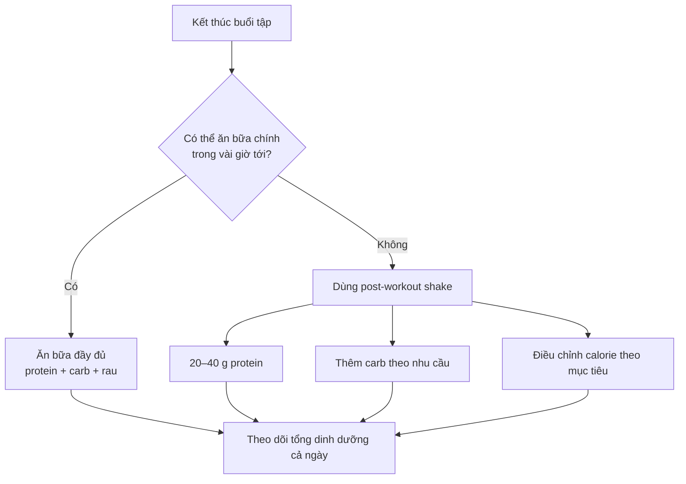

# 049 — Post-Workout Shake

| Thuộc tính       | Nội dung                                                       |
| ---------------- | -------------------------------------------------------------- |
| **Module**       | Module 05 — Adjusting Your Diet for Weight Loss & Muscle Gains |
| **Bài học**      | Post-Workout Shake                                             |
| **Thời lượng**   | 02:15                                                          |
| **Chủ đề chính** | Đồ uống dinh dưỡng sau tập luyện                               |

> **Ý chính:** Post-workout shake không phải “chìa khóa bí mật” để xây dựng cơ bắp. Đây chủ yếu là một giải pháp **nhanh, tiện lợi và dễ kiểm soát dinh dưỡng** khi chưa thể ăn một bữa hoàn chỉnh sau tập.


*Ảnh minh họa: Banana Smoothie — Ourlibrary, Wikimedia Commons, giấy phép CC0/Public Domain.*

---

## Mục lục

1. [Mục tiêu bài học](#1-mục-tiêu-bài-học)
2. [Nội dung chính](#2-nội-dung-chính)
3. [Áp dụng thực tế](#3-áp-dụng-thực-tế)
4. [Lưu ý & lỗi thường gặp](#4-lưu-ý--lỗi-thường-gặp)
5. [Checklist thực hành](#5-checklist-thực-hành)
6. [Tóm tắt](#6-tóm-tắt)

---

## 1. Mục tiêu bài học

Sau bài học này, bạn có thể:

* Hiểu post-workout shake **không bắt buộc** để tăng cơ hoặc phục hồi.
* Phân biệt giữa “cửa sổ đồng hóa 30 phút” và cách hiểu khoa học chính xác hơn.
* Biết khi nào nên dùng shake thay cho một bữa ăn sau tập.
* Lựa chọn lượng protein và carbohydrate phù hợp với mục tiêu.
* Tự chuẩn bị một công thức shake đơn giản từ whey, yến mạch và chuối.
* Tránh biến một ly shake hỗ trợ phục hồi thành một “quả bom calorie”.

---

## 2. Nội dung chính

### 2.1. Có bắt buộc phải uống shake ngay sau tập không?

**Không bắt buộc.**

Một quan niệm phổ biến cho rằng sau khi tập, bạn chỉ có khoảng 30 phút để uống protein và carbohydrate. Nếu bỏ lỡ “cửa sổ đồng hóa” này, cơ thể sẽ phá hủy cơ bắp và buổi tập gần như trở nên vô ích.

Tuy nhiên, nghiên cứu hiện tại không ủng hộ quan điểm về một cửa sổ chỉ kéo dài đúng 30 phút:

* Một thử nghiệm trên người đã tập luyện cho thấy uống cùng một lượng protein ngay trước hoặc ngay sau buổi tập tạo ra kết quả tương tự về sức mạnh, khối cơ và thành phần cơ thể sau 10 tuần.
* Phân tích tổng hợp năm 2025 cũng không phát hiện thời điểm uống protein trước hay sau tập tạo ra khác biệt quan trọng đối với khối lượng nạc. Tuy nhiên, số nghiên cứu còn ít và mức chắc chắn của bằng chứng được đánh giá từ thấp đến rất thấp.
* Cơ xương vẫn nhạy cảm hơn với protein trong nhiều giờ và có thể kéo dài tới khoảng 24 giờ sau một buổi tập kháng lực, dù phản ứng có xu hướng giảm dần theo thời gian.

Do đó, yếu tố quan trọng hơn là:

1. **Tổng lượng protein trong ngày.**
2. **Tổng calorie phù hợp với mục tiêu.**
3. **Phân bổ protein tương đối đều giữa các bữa.**
4. **Duy trì tập luyện và dinh dưỡng nhất quán trong nhiều tuần.**

### 2.2. Cách hiểu đúng về “cửa sổ đồng hóa”

Không nên hình dung cửa sổ đồng hóa như một cánh cửa đóng lại sau 30 phút.

Có thể hình dung nó giống một **khoảng thời gian rộng hơn**:

```text
Bữa ăn trước tập                 Buổi tập                  Giai đoạn phục hồi
      │                             │                             │
      ▼                             ▼                             ▼
Protein đã được tiêu hóa ───► Cơ được kích thích ───► Cơ nhạy với amino acid
                                                            trong nhiều giờ
```

Mức độ cần ăn hoặc uống protein ngay sau tập phụ thuộc nhiều vào thời điểm của bữa ăn trước tập:

| Tình huống                                    | Mức độ cần bổ sung ngay                |
| --------------------------------------------- | -------------------------------------- |
| Đã ăn bữa có protein khoảng 1–3 giờ trước tập | Không cần quá vội                      |
| Tập vào sáng sớm khi bụng đói                 | Nên bổ sung protein sớm hơn            |
| Buổi tập kéo dài, cường độ cao                | Protein và carbohydrate có thể hữu ích |
| Không thể ăn bữa chính trong vài giờ          | Shake là lựa chọn tiện lợi             |
| Đã đạt đủ protein và calorie trong ngày       | Shake không tạo thêm lợi ích đặc biệt  |

Nghiên cứu cho thấy thời gian ăn protein có thể linh hoạt trong vài giờ tùy thuộc vào bữa ăn trước tập, thay vì phải tuân thủ cứng nhắc mốc 30 phút.

---

### 2.3. Vai trò của protein sau tập

Tập kháng lực kích thích quá trình tái cấu trúc mô cơ. Protein cung cấp các amino acid cần thiết để sửa chữa và xây dựng protein cơ mới.

Một khẩu phần khoảng **20–40 g protein chất lượng cao**, tương đương khoảng **0,25–0,40 g/kg thể trọng**, có thể kích thích mạnh quá trình tổng hợp protein cơ. Phân bổ những khẩu phần này cách nhau khoảng 3–4 giờ thường thực tế hơn việc dồn gần như toàn bộ protein vào một bữa.

Ví dụ:

| Cân nặng | Mức 0,25 g/kg | Mức 0,40 g/kg |
| -------: | ------------: | ------------: |
|    50 kg |        12,5 g |          20 g |
|    60 kg |          15 g |          24 g |
|    70 kg |        17,5 g |          28 g |
|    80 kg |          20 g |          32 g |
|    90 kg |        22,5 g |          36 g |

Trong thực tế, một khẩu phần **25–35 g whey protein** thường phù hợp với phần lớn người trưởng thành tập kháng lực.

> Lượng protein trong một muỗng bột không nhất thiết bằng trọng lượng của cả muỗng. Ví dụ, 30 g bột whey có thể cung cấp khoảng 22–25 g protein tùy sản phẩm. Hãy đọc bảng dinh dưỡng trên bao bì.

---

### 2.4. Có cần đường đơn ngay sau tập không?

Không có bằng chứng thuyết phục rằng mọi người đều phải uống đường đơn ngay sau tập để ngăn mất cơ.

Carbohydrate sau tập có vai trò chính là:

* Bổ sung glycogen đã sử dụng trong quá trình vận động.
* Cung cấp năng lượng cho những hoạt động tiếp theo.
* Hỗ trợ đáp ứng phục hồi tổng thể khi kết hợp với protein.
* Giúp người cần tăng cân hoặc tăng cơ đạt đủ calorie dễ dàng hơn.

Việc bổ sung carbohydrate thật nhanh trở nên quan trọng hơn khi thời gian phục hồi giữa hai buổi tập **dưới khoảng bốn giờ**. Trong trường hợp đó, hướng dẫn của ISSN đề xuất chiến lược nạp carbohydrate tích cực hơn để đẩy nhanh quá trình phục hồi glycogen.

Với người chỉ tập một buổi mỗi ngày, không tập luyện sức bền kéo dài và có thể ăn uống bình thường, việc đạt đủ carbohydrate trong tổng khẩu phần ngày thường quan trọng hơn việc phải uống đường ngay lập tức.

```text
Chỉ tập một buổi/ngày
        │
        ▼
Không cần chạy đua với thời gian
        │
        ▼
Ăn đủ protein + carbohydrate trong ngày
```

```text
Hai buổi tập gần nhau / thi đấu nhiều lượt
        │
        ▼
Cần phục hồi glycogen nhanh
        │
        ▼
Ưu tiên carbohydrate sớm + protein + nước
```

---

### 2.5. Hình ảnh nghiên cứu: protein và tổng hợp protein cơ


*Hình nghiên cứu minh họa phản ứng của insulin, amino acid, mTOR và quá trình tổng hợp protein cơ sau khi cung cấp dinh dưỡng.*

Biểu đồ cho thấy:

* Amino acid trong máu tăng lên sau khi tiêu thụ protein.
* Tín hiệu liên quan đến xây dựng cơ được kích hoạt.
* Tổng hợp protein cơ tăng nhưng không tăng vô hạn theo lượng protein.
* Sau một khoảng thời gian, cơ xuất hiện trạng thái “muscle-full”: bổ sung thêm protein ngay lập tức không tiếp tục làm phản ứng tăng tương ứng.

Điều này giải thích vì sao phân bổ protein thành nhiều khẩu phần hợp lý thường có ý nghĩa hơn việc cho một lượng cực lớn vào một ly shake.


*Hình nghiên cứu mô tả tập luyện có thể kéo dài phản ứng của cơ với protein đến khoảng 24 giờ sau buổi tập.*

---

### 2.6. Vậy post-workout shake có tác dụng gì?

Shake hữu ích chủ yếu vì tính **thuận tiện**:

* Chuẩn bị trong vài phút.
* Dễ mang theo khi đi học, đi làm hoặc di chuyển.
* Dễ uống khi chưa muốn ăn thức ăn rắn.
* Giúp đạt mục tiêu protein hằng ngày.
* Có thể kết hợp protein, carbohydrate, chất béo và chất lỏng trong một khẩu phần.
* Dễ điều chỉnh calorie cho giai đoạn giảm mỡ hoặc tăng cơ.

#### Thứ tự ưu tiên hợp lý



---

## 3. Áp dụng thực tế

### 3.1. Công thức cơ bản trong bài học

#### Nguyên liệu

| Nguyên liệu      |  Khối lượng gợi ý | Vai trò                             |
| ---------------- | ----------------: | ----------------------------------- |
| Yến mạch ăn liền |           40–50 g | Carbohydrate, chất xơ và năng lượng |
| Whey protein     |   Khoảng 30 g bột | Cung cấp protein nhanh và tiện lợi  |
| Chuối            |             1 quả | Carbohydrate, độ ngọt và kết cấu    |
| Nước hoặc sữa    |        250–400 ml | Tạo độ lỏng và hỗ trợ bù nước       |
| Bơ đậu phộng     | 10–20 g, tùy chọn | Tăng chất béo, hương vị và calorie  |

#### Cách pha

1. Cho nước hoặc sữa vào máy xay trước.
2. Thêm whey protein.
3. Thêm yến mạch ăn liền.
4. Thêm chuối.
5. Xay trong khoảng 30–60 giây.
6. Điều chỉnh lượng chất lỏng để đạt độ đặc mong muốn.
7. Uống ngay hoặc bảo quản lạnh trong thời gian ngắn.

Không có máy xay:

* Pha whey với nước bằng bình lắc.
* Ăn chuối riêng.
* Dùng yến mạch ngâm mềm hoặc ăn trong một bữa sau đó.

---

### 3.2. Giá trị dinh dưỡng ước tính

Công thức gồm:

* 45 g yến mạch.
* 30 g bột whey.
* Một quả chuối trung bình.
* Nước.

Thường cung cấp xấp xỉ:

| Chỉ số       | Giá trị ước tính |
| ------------ | ---------------: |
| Năng lượng   |     380–450 kcal |
| Protein      |          30–36 g |
| Carbohydrate |          55–70 g |
| Chất béo     |            4–8 g |
| Chất xơ      |            6–9 g |

Giá trị thực tế thay đổi theo loại whey, kích thước quả chuối và nhãn hiệu yến mạch. USDA FoodData Central là cơ sở dữ liệu công khai dùng để tra cứu thành phần dinh dưỡng của thực phẩm; khi theo dõi calorie, nên nhập đúng sản phẩm và khẩu phần đang sử dụng.

---

### 3.3. Điều chỉnh theo mục tiêu

#### A. Giảm mỡ

**Công thức gợi ý:**

* 25–30 g whey.
* 20–30 g yến mạch hoặc bỏ yến mạch nếu bữa sau đã đủ carbohydrate.
* Nửa đến một quả chuối.
* Nước và đá.
* Không thêm hoặc chỉ thêm rất ít bơ đậu phộng.

Mục tiêu là giữ protein cao nhưng tránh làm tổng calorie vượt quá kế hoạch.

#### B. Tăng cơ có kiểm soát

**Công thức gợi ý:**

* 30–35 g whey.
* 40–60 g yến mạch.
* Một quả chuối.
* Sữa ít béo hoặc sữa theo nhu cầu.
* Có thể thêm 10–15 g bơ đậu phộng.

Cần lưu ý: shake chỉ hỗ trợ tạo thặng dư calorie; cơ bắp vẫn cần kích thích từ chương trình tập tiến triển.

#### C. Khó tăng cân

Có thể bổ sung:

* 70–100 g yến mạch.
* Sữa.
* Chuối.
* Bơ đậu phộng.
* Sữa chua.
* Mật ong nếu cần thêm carbohydrate.

Một ly như vậy có thể chứa rất nhiều calorie, vì vậy nên tăng từng thành phần và theo dõi cân nặng thay vì thêm tất cả cùng lúc.

#### D. Không sử dụng whey

Có thể thay thế bằng:

* Sữa chua Hy Lạp.
* Sữa hoặc sữa đậu nành giàu protein.
* Bột protein đậu nành.
* Bột protein đậu Hà Lan kết hợp với nguồn protein khác.
* Một bữa ăn thông thường gồm thịt, cá, trứng, đậu phụ hoặc các loại đậu.

---

### 3.4. Chọn chất lỏng phù hợp

| Chất lỏng              | Đặc điểm                                                               |
| ---------------------- | ---------------------------------------------------------------------- |
| **Nước**               | Ít calorie nhất, nhẹ bụng, phù hợp giảm mỡ                             |
| **Sữa ít béo**         | Tăng protein, carbohydrate và độ sánh                                  |
| **Sữa nguyên kem**     | Tăng calorie và chất béo, phù hợp người khó tăng cân                   |
| **Sữa đậu nành**       | Lựa chọn thực vật có lượng protein tương đối tốt                       |
| **Nước trái cây**      | Tăng carbohydrate và calorie nhanh nhưng ít no hơn trái cây nguyên quả |
| **Sữa hạt ít protein** | Chủ yếu thay đổi hương vị; cần kiểm tra lượng đường bổ sung            |

---

### 3.5. Quy trình ra quyết định sau buổi tập

```text
Bước 1: Tôi đã ăn protein trong 2–3 giờ trước tập chưa?
   ├── Có → Không cần uống shake khẩn cấp.
   └── Chưa → Nên bổ sung một nguồn protein tương đối sớm.

Bước 2: Tôi có thể ăn bữa chính trong vài giờ tới không?
   ├── Có → Ăn bữa chính là đủ.
   └── Không → Dùng shake để lấp khoảng trống.

Bước 3: Tôi có tập lại trong vòng dưới 4 giờ không?
   ├── Có → Ưu tiên thêm carbohydrate dễ tiêu.
   └── Không → Chỉ cần đáp ứng tổng carbohydrate trong ngày.

Bước 4: Mục tiêu hiện tại là gì?
   ├── Giảm mỡ → Giảm thành phần giàu calorie.
   ├── Duy trì → Công thức cơ bản.
   └── Tăng cân/tăng cơ → Tăng yến mạch, sữa hoặc chất béo.
```

---

## 4. Lưu ý & lỗi thường gặp

### 4.1. Tin rằng phải uống trong đúng 30 phút

Không cần dừng mọi hoạt động để uống shake ngay sau lần lặp cuối cùng. Tổng protein, tổng calorie và bữa ăn trước tập ảnh hưởng nhiều hơn đến mức độ cấp thiết của shake.

### 4.2. Dùng shake thay cho mọi bữa ăn

Shake có thể tiện lợi nhưng không nên thay thế toàn bộ thực phẩm nguyên dạng. Bữa ăn thông thường giúp cung cấp đa dạng chất xơ, vitamin, khoáng chất và tạo cảm giác no tốt hơn.

### 4.3. Cho quá nhiều thành phần “lành mạnh”

Các nguyên liệu như bơ đậu phộng, yến mạch, sữa nguyên kem và mật ong có giá trị dinh dưỡng nhưng cũng chứa nhiều năng lượng.

Ví dụ:

```text
Whey + chuối + yến mạch
        ≈ khẩu phần vừa phải

Thêm sữa nguyên kem
+ bơ đậu phộng
+ mật ong
+ nhiều yến mạch
        ≈ một bữa rất giàu calorie
```

Thực phẩm lành mạnh vẫn có thể khiến bạn vượt calorie nếu khẩu phần quá lớn.

### 4.4. Chỉ uống whey mà bỏ qua tổng khẩu phần

Một ly whey không thể bù cho:

* Thiếu calorie kéo dài khi muốn tăng cơ.
* Thiếu protein trong các bữa còn lại.
* Chương trình tập không có tăng tiến.
* Ngủ không đủ.
* Tập luyện không nhất quán.

### 4.5. Cho rằng carbohydrate sau tập luôn gây tăng mỡ

Carbohydrate không tự động biến thành mỡ chỉ vì được ăn sau tập. Tăng hoặc giảm mỡ chủ yếu chịu ảnh hưởng bởi cân bằng năng lượng trong thời gian dài.

### 4.6. Thêm bơ đậu phộng mà không tính calorie

Bơ đậu phộng phù hợp khi cần tăng năng lượng, nhưng không bắt buộc cho phục hồi cơ. Nếu đang giảm mỡ, hãy cân chính xác thay vì dùng một thìa lớn không đo lường.

### 4.7. Shake quá đặc hoặc uống quá nhanh

Một lượng lớn yến mạch, sữa và chất béo có thể làm shake tiêu hóa chậm hoặc gây khó chịu khi uống nhanh. Có thể:

* Giảm yến mạch.
* Dùng thêm nước.
* Giảm chất béo.
* Chia shake thành hai phần.
* Uống chậm hơn.

### 4.8. Không tính shake vào tổng dinh dưỡng ngày

Shake vẫn là thức ăn và vẫn chứa calorie. Hãy ghi lại:

* Khối lượng bột whey.
* Khối lượng yến mạch.
* Loại và lượng sữa.
* Khối lượng bơ đậu phộng.
* Chuối và các chất tạo ngọt.

---

## 5. Checklist thực hành

### Trước khi pha

* [ ] Tôi biết mục tiêu hiện tại: giảm mỡ, duy trì hay tăng cơ.
* [ ] Tôi đã xác định lượng protein cần bổ sung.
* [ ] Tôi biết mình có thể ăn bữa chính lúc nào.
* [ ] Tôi đã kiểm tra xem hôm nay có buổi tập thứ hai hay không.
* [ ] Tôi đã chuẩn bị bình lắc hoặc máy xay.

### Khi pha

* [ ] Dùng khoảng 20–40 g protein chất lượng cao.
* [ ] Điều chỉnh yến mạch và chuối theo nhu cầu carbohydrate.
* [ ] Chọn nước hoặc sữa phù hợp với mục tiêu calorie.
* [ ] Cân bơ đậu phộng nếu sử dụng.
* [ ] Không thêm nguyên liệu chỉ vì chúng được quảng cáo là “fitness food”.

### Sau khi uống

* [ ] Ghi shake vào tổng calorie và macronutrient trong ngày.
* [ ] Vẫn ăn các bữa có thực phẩm nguyên dạng.
* [ ] Theo dõi cảm giác tiêu hóa và điều chỉnh công thức.
* [ ] Đánh giá tiến độ dựa trên nhiều tuần, không dựa trên một buổi tập.
* [ ] Ưu tiên ngủ, phục hồi và chương trình tập có tăng tiến.

---

## 6. Tóm tắt

1. **Post-workout shake không bắt buộc** để tăng cơ.
2. Không có bằng chứng mạnh cho một “cửa sổ đồng hóa” chỉ kéo dài đúng 30 phút.
3. Tổng lượng protein và calorie trong ngày quan trọng hơn việc uống shake vào một phút cụ thể.
4. Một khẩu phần khoảng **20–40 g protein chất lượng cao** là mức thực tế đối với nhiều người tập luyện.
5. Carbohydrate sau tập giúp phục hồi glycogen, nhưng việc nạp thật nhanh chủ yếu quan trọng khi phải tập hoặc thi đấu lại trong thời gian ngắn.
6. Shake phát huy giá trị tốt nhất khi bạn không có thời gian chuẩn bị một bữa ăn đầy đủ.
7. Công thức đơn giản có thể gồm **whey + yến mạch + chuối + nước hoặc sữa**.
8. Bơ đậu phộng là thành phần tùy chọn, phù hợp hơn khi cần tăng calorie.
9. Shake phải được tính vào tổng dinh dưỡng trong ngày.
10. Hãy xem shake như một **công cụ tiện lợi**, không phải một sản phẩm có tác dụng thần kỳ.

> **Công thức ghi nhớ**
>
> ```text
> Kết quả lâu dài
> = Tập luyện phù hợp
> + Đủ protein
> + Calorie đúng mục tiêu
> + Ngủ và phục hồi
> + Sự nhất quán
>
> Post-workout shake chỉ giúp quá trình trên thuận tiện hơn.
> ```

---

## Tài liệu nghiên cứu tham khảo

* Schoenfeld và cộng sự: protein trước và sau tập tạo ra kết quả thích nghi cơ bắp tương tự trong thử nghiệm 10 tuần.
* Casuso và cộng sự, 2025: phân tích tổng hợp về thời điểm dùng protein trước so với sau tập.
* ISSN Position Stand: khuyến nghị về lượng, phân bổ và thời điểm tiêu thụ protein.
* ISSN Position Stand về nutrient timing: protein 20–40 g, phân bổ 3–4 giờ và chiến lược phục hồi glycogen.
* Atherton và Smith: tổng hợp cơ chế tổng hợp protein cơ đáp ứng với dinh dưỡng và tập luyện.
