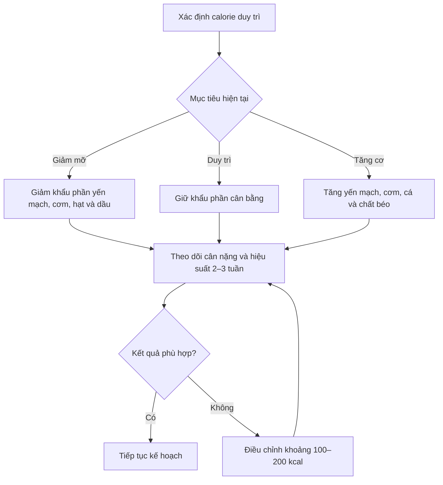

# 051 — Thực đơn mẫu dành cho nữ giới

> **Tên bài học gốc:** Sample Diet Plan For Women

| Thuộc tính             | Nội dung                                               |
| ---------------------- | ------------------------------------------------------ |
| **Module**             | Module 05 — Điều chỉnh chế độ ăn để giảm mỡ và tăng cơ |
| **Bài học**            | Sample Diet Plan For Women                             |
| **Thời lượng**         | 02:17                                                  |
| **Chủ đề chính**       | Thực đơn mẫu dành cho nữ giới                          |
| **Đối tượng minh họa** | Nữ, khoảng **135 lb / 61,2 kg**, cao **5'3" / 160 cm** |
| **Mức vận động**       | Tập luyện cường độ cao khoảng **3 buổi/tuần**          |
| **Các mục tiêu**       | Giảm mỡ, duy trì cân nặng và tăng cơ                   |


*Ảnh minh họa: một hộp meal prep gồm cơm, rau củ, đậu và thực phẩm giàu protein. Ảnh được cung cấp miễn phí trên Pexels.* ([pexels.com][1])

---

## Mục lục

1. [Mục tiêu bài học](#1-mục-tiêu-bài-học)
2. [Nội dung chính](#2-nội-dung-chính)
3. [Áp dụng thực tế](#3-áp-dụng-thực-tế)
4. [Lưu ý và lỗi thường gặp](#4-lưu-ý-và-lỗi-thường-gặp)
5. [Checklist thực hành](#5-checklist-thực-hành)
6. [Tóm tắt](#6-tóm-tắt)

---

## 1. Mục tiêu bài học

Sau bài học này, người học có thể:

* Hiểu cách thay đổi **khẩu phần ăn** theo ba mục tiêu: giảm mỡ, duy trì cân nặng và tăng cơ.
* Biết cách kết hợp protein, carbohydrate, chất béo, rau và trái cây trong ngày.
* Phân bổ thực phẩm thành năm bữa để thuận tiện cho việc chuẩn bị và kiểm soát khẩu phần.
* Kiểm tra tổng calorie và các chất đa lượng thay vì chỉ dựa vào tên gọi của thực đơn.
* Biết cách thay thế thực phẩm mà không làm thay đổi quá nhiều tổng calorie.
* Nhận biết các sai lệch số liệu trong thực đơn mẫu.

> [!IMPORTANT]
> Đây là **thực đơn minh họa**, không phải mức calorie mặc định dành cho mọi phụ nữ. Nhu cầu thực tế còn phụ thuộc vào tuổi, chiều cao, cân nặng, mức vận động, mục tiêu, tình trạng sức khỏe và khả năng duy trì chế độ ăn.

---

## 2. Nội dung chính

### 2.1. Nguyên tắc xây dựng thực đơn

Thực đơn sử dụng một nhóm thực phẩm cơ bản và điều chỉnh khối lượng tùy theo mục tiêu:

| Nhóm dinh dưỡng                     | Thực phẩm trong thực đơn               | Vai trò chính                        |
| ----------------------------------- | -------------------------------------- | ------------------------------------ |
| **Protein**                         | Trứng, ức gà, cá hồi, whey isolate     | Hỗ trợ phục hồi và duy trì cơ bắp    |
| **Carbohydrate**                    | Yến mạch, cơm gạo lứt, chuối, táo      | Cung cấp năng lượng cho vận động     |
| **Chất béo**                        | Trứng, cá hồi, các loại hạt, dầu ô liu | Bổ sung năng lượng và acid béo       |
| **Chất xơ, vitamin và khoáng chất** | Salad, rau củ, chuối, táo              | Tăng sự đa dạng và mật độ dinh dưỡng |

Hướng dẫn MyPlate của USDA cũng nhấn mạnh việc phối hợp nhiều nhóm thực phẩm gồm rau, trái cây, ngũ cốc, thực phẩm giàu protein và sản phẩm sữa hoặc lựa chọn thay thế phù hợp. ([MyPlate][2])

### 2.2. Sơ đồ điều chỉnh khẩu phần



### 2.3. So sánh nhanh ba thực đơn

Các con số dưới đây được cộng lại từ từng thực phẩm trong nội dung bài học:

| Mục tiêu    | Mức calorie ghi trên kế hoạch | Tổng thực phẩm thực tế |     Protein |   Chất béo | Carbohydrate |         Chênh lệch |
| ----------- | ----------------------------: | ---------------------: | ----------: | ---------: | -----------: | -----------------: |
| **Giảm mỡ** |                    1.500 kcal |         **1.528 kcal** | **122,0 g** | **40,8 g** |  **166,5 g** |    Cao hơn 28 kcal |
| **Duy trì** |                    1.800 kcal |         **1.702 kcal** | **125,1 g** | **44,1 g** |  **199,1 g** | Còn khoảng 98 kcal |
| **Tăng cơ** |                    1.950 kcal |         **1.937 kcal** | **133,2 g** | **59,0 g** |  **217,3 g** | Còn khoảng 13 kcal |

> [!NOTE]
> Tổng calorie trên nhãn thực phẩm và tổng calorie tính từ protein, carbohydrate, chất béo có thể không trùng khớp hoàn toàn do làm tròn số, chất xơ và cách xây dựng cơ sở dữ liệu dinh dưỡng.

---

### 2.4. Thực đơn giảm mỡ — khoảng 1.500 kcal

#### Tổng quan

| Chỉ số           | Giá trị sau khi kiểm tra |
| ---------------- | -----------------------: |
| **Tổng calorie** |               1.528 kcal |
| **Protein**      |                  122,0 g |
| **Chất béo**     |                   40,8 g |
| **Carbohydrate** |                  166,5 g |

#### Bữa 1 — Bữa sáng

| Thực phẩm      | Khối lượng |      Calorie |    Protein |   Chất béo |       Carb |
| -------------- | ---------: | -----------: | ---------: | ---------: | ---------: |
| Trứng          |      1 quả |      78 kcal |      7,0 g |      5,5 g |        0 g |
| Chuối          |      1 quả |     118 kcal |      1,4 g |      0,4 g |     27,0 g |
| Yến mạch       |       50 g |     201 kcal |      6,2 g |      4,3 g |     36,4 g |
| **Tổng bữa 1** |            | **397 kcal** | **14,6 g** | **10,2 g** | **63,4 g** |

#### Bữa 2 — Bữa phụ

| Thực phẩm      | Khối lượng |      Calorie |    Protein |  Chất béo |      Carb |
| -------------- | ---------: | -----------: | ---------: | --------: | --------: |
| Hạt hỗn hợp    |       20 g |     116 kcal |      4,7 g |     9,8 g |     2,3 g |
| Whey isolate   |       20 g |      74 kcal |     17,2 g |       0 g |     1,1 g |
| **Tổng bữa 2** |            | **190 kcal** | **21,9 g** | **9,8 g** | **3,4 g** |

#### Bữa 3 — Bữa chính với thịt gà

| Thực phẩm          | Khối lượng |      Calorie |    Protein |  Chất béo |       Carb |
| ------------------ | ---------: | -----------: | ---------: | --------: | ---------: |
| Cơm gạo lứt đã nấu |      100 g |     139 kcal |      2,6 g |     1,1 g |     29,2 g |
| Ức gà bỏ da        |      100 g |     160 kcal |     31,0 g |     3,0 g |        0 g |
| Salad không sốt    |      150 g |      43 kcal |      2,7 g |     0,7 g |      6,6 g |
| **Tổng bữa 3**     |            | **342 kcal** | **36,3 g** | **4,8 g** | **35,8 g** |

#### Bữa 4 — Bữa chính với cá hồi

| Thực phẩm          | Khối lượng |      Calorie |    Protein |   Chất béo |       Carb |
| ------------------ | ---------: | -----------: | ---------: | ---------: | ---------: |
| Cơm gạo lứt đã nấu |      100 g |     139 kcal |      2,6 g |      1,1 g |     29,2 g |
| Cá hồi             |      100 g |     225 kcal |     25,3 g |     13,8 g |        0 g |
| Salad không sốt    |      150 g |      43 kcal |      2,7 g |      0,7 g |      6,6 g |
| **Tổng bữa 4**     |            | **407 kcal** | **30,6 g** | **15,6 g** | **35,8 g** |

#### Bữa 5 — Sau tập hoặc bữa phụ cuối ngày

| Thực phẩm      | Khối lượng |      Calorie |    Protein |  Chất béo |       Carb |
| -------------- | ---------: | -----------: | ---------: | --------: | ---------: |
| Whey isolate   |       20 g |      74 kcal |     17,2 g |       0 g |      1,1 g |
| Chuối          |      1 quả |     118 kcal |      1,4 g |     0,4 g |     27,0 g |
| **Tổng bữa 5** |            | **192 kcal** | **18,6 g** | **0,4 g** | **28,1 g** |

#### Đánh giá

Với cân nặng khoảng 61,2 kg, lượng protein 122 g tương đương khoảng **2,0 g/kg/ngày**. Đây là mức nằm ở giới hạn trên của phạm vi **1,4–2,0 g/kg/ngày** mà ISSN đề xuất cho phần lớn người thường xuyên tập luyện; nhu cầu có thể tăng khi đang hạn chế năng lượng và muốn duy trì khối nạc. ([SpringerLink][3])

---

### 2.5. Thực đơn duy trì — mục tiêu 1.800 kcal

#### Tổng quan

| Chỉ số                        | Giá trị sau khi kiểm tra |
| ----------------------------- | -----------------------: |
| **Tổng thực phẩm đã liệt kê** |               1.702 kcal |
| **Calorie còn lại**           |           Khoảng 98 kcal |
| **Protein**                   |                  125,1 g |
| **Chất béo**                  |                   44,1 g |
| **Carbohydrate**              |                  199,1 g |

#### Phân bổ theo bữa

| Bữa       | Thành phần                                  |   Calorie |     Protein |   Chất béo |        Carb |
| --------- | ------------------------------------------- | --------: | ----------: | ---------: | ----------: |
| **Bữa 1** | 1 trứng, 1 chuối, 50 g yến mạch             |       397 |      14,6 g |     10,2 g |      63,4 g |
| **Bữa 2** | 25 g hạt hỗn hợp, 20 g whey isolate         |       219 |      23,1 g |     12,3 g |       4,0 g |
| **Bữa 3** | 100 g cơm gạo lứt, 100 g ức gà, 150 g salad |       342 |      36,3 g |      4,8 g |      35,8 g |
| **Bữa 4** | 150 g cơm gạo lứt, cá hồi, 150 g salad      |       477 |      31,9 g |     16,2 g |      50,4 g |
| **Bữa 5** | 20 g whey, 1 chuối, 1 táo                   |       267 |      19,2 g |      0,6 g |      45,5 g |
| **Tổng**  |                                             | **1.702** | **125,1 g** | **44,1 g** | **199,1 g** |

#### Cách sử dụng 98 kcal còn lại

Có thể bổ sung một lựa chọn gần 100 kcal:

* Một hộp sữa chua không đường nhỏ.
* Một ly sữa ít béo.
* Khoảng 15 g hạt.
* Một phần trái cây nhỏ.
* Tăng nhẹ khẩu phần cơm hoặc yến mạch.
* Một lượng nhỏ dầu ô liu dùng khi chế biến.

Không bắt buộc phải đạt đúng 1.800 kcal mỗi ngày. Có thể theo dõi **mức trung bình nhiều ngày**, miễn là cân nặng và hiệu suất tập luyện ổn định.

> [!WARNING]
> Dữ liệu gốc ghi **125 g cá hồi** nhưng vẫn sử dụng đúng số liệu của khẩu phần 100 g: 225 kcal, 25,3 g protein và 13,8 g chất béo. Vì vậy, cần kiểm tra lại nhãn sản phẩm.
>
> Có hai khả năng:
>
> 1. Khối lượng đúng là **100 g cá hồi**; hoặc
> 2. Nếu sử dụng 125 g, calorie và các chất đa lượng phải được tính lại theo loại cá hồi thực tế.

---

### 2.6. Thực đơn tăng cơ — mục tiêu 1.950 kcal


*Ảnh minh họa: bữa ăn gồm cá, cơm, rau củ và các loại đậu. Ảnh miễn phí từ Pexels.* ([pexels.com][4])

#### Tổng quan

| Chỉ số           | Giá trị sau khi kiểm tra |
| ---------------- | -----------------------: |
| **Tổng calorie** |               1.937 kcal |
| **Protein**      |                  133,2 g |
| **Chất béo**     |                   59,0 g |
| **Carbohydrate** |                  217,3 g |

#### Phân bổ theo bữa

| Bữa       | Thành phần                                       |   Calorie |     Protein |   Chất béo |        Carb |
| --------- | ------------------------------------------------ | --------: | ----------: | ---------: | ----------: |
| **Bữa 1** | 1 trứng, 1 chuối, 75 g yến mạch                  |       497 |      17,7 g |     12,4 g |      81,6 g |
| **Bữa 2** | 25 g hạt hỗn hợp, 20 g whey isolate              |       219 |      23,1 g |     12,3 g |       4,0 g |
| **Bữa 3** | 100 g cơm gạo lứt, 100 g ức gà, 150 g salad      |       342 |      36,3 g |      4,8 g |      35,8 g |
| **Bữa 4** | 150 g cơm, 150 g cá hồi, salad, 1 thìa dầu ô liu |       612 |      36,9 g |     28,9 g |      50,4 g |
| **Bữa 5** | 20 g whey, 1 chuối, 1 táo                        |       267 |      19,2 g |      0,6 g |      45,5 g |
| **Tổng**  |                                                  | **1.937** | **133,2 g** | **59,0 g** | **217,3 g** |

#### Những thay đổi so với thực đơn giảm mỡ

| Điều chỉnh        |  Giảm mỡ |         Tăng cơ |
| ----------------- | -------: | --------------: |
| Yến mạch bữa sáng |     50 g |            75 g |
| Hạt hỗn hợp       |     20 g |            25 g |
| Cơm bữa 4         |    100 g |           150 g |
| Cá hồi bữa 4      |    100 g |           150 g |
| Dầu ô liu         | Không có |          1 thìa |
| Trái cây bữa 5    |  1 chuối | 1 chuối + 1 táo |

Sự khác biệt chủ yếu đến từ việc tăng khẩu phần carbohydrate và chất béo giàu năng lượng, thay vì thay đổi toàn bộ cấu trúc thực đơn.

Một phân tích tổng hợp cho thấy thiếu hụt năng lượng kéo dài có thể làm giảm khả năng tăng khối nạc khi tập kháng lực. Do đó, người muốn ưu tiên tăng cơ không nên đồng thời duy trì mức thâm hụt calorie lớn trong thời gian dài. ([PubMed][5])

---

### 2.7. Phân bổ protein trong ngày

Thực đơn chia protein thành nhiều bữa:

| Bữa   | Giảm mỡ | Duy trì | Tăng cơ |
| ----- | ------: | ------: | ------: |
| Bữa 1 |  14,6 g |  14,6 g |  17,7 g |
| Bữa 2 |  21,9 g |  23,1 g |  23,1 g |
| Bữa 3 |  36,3 g |  36,3 g |  36,3 g |
| Bữa 4 |  30,6 g |  31,9 g |  36,9 g |
| Bữa 5 |  18,6 g |  19,2 g |  19,2 g |

ISSN đưa ra hướng dẫn chung khoảng **20–40 g protein chất lượng cao mỗi lần ăn**, tùy theo cân nặng, độ tuổi và loại hình tập luyện. Tuy nhiên, tổng lượng protein cả ngày vẫn là yếu tố quan trọng hơn việc phải uống whey hoặc ăn protein tại một thời điểm tuyệt đối chính xác. ([SpringerLink][3])

---

## 3. Áp dụng thực tế

### 3.1. Chọn mức calorie phù hợp

Không nên chọn thực đơn chỉ dựa trên giới tính. Có thể áp dụng quy trình:

1. Ước tính mức calorie duy trì.
2. Theo dõi cân nặng trung bình buổi sáng trong 2–3 tuần.
3. Theo dõi số đo, hiệu suất tập và cảm giác đói.
4. Điều chỉnh khoảng 100–200 kcal mỗi lần.
5. Giữ nguyên kế hoạch đủ lâu trước khi kết luận rằng nó không hiệu quả.

### 3.2. Thời điểm ăn gợi ý

| Thời điểm             | Bữa gợi ý                                |
| --------------------- | ---------------------------------------- |
| 07:00                 | Bữa 1: trứng, chuối, yến mạch            |
| 10:00                 | Bữa 2: hạt và whey                       |
| 13:00                 | Bữa 3: cơm, gà, rau                      |
| 17:00–19:00           | Tập luyện                                |
| Sau tập hoặc buổi tối | Bữa 4: cơm, cá hồi, rau                  |
| Trước khi ngủ 1–2 giờ | Bữa 5 nếu còn đói hoặc chưa đủ khẩu phần |

Năm bữa chỉ là một cách tổ chức. Việc tăng số lần ăn không tự động làm tăng tốc độ trao đổi chất hoặc giảm mỡ nhanh hơn; tần suất ăn nên được lựa chọn dựa trên lịch sinh hoạt, cảm giác đói và khả năng tuân thủ. ([SpringerLink][6])

### 3.3. Thay thế bằng thực phẩm phổ biến tại Việt Nam

| Thực phẩm gốc | Có thể thay bằng                           | Lưu ý                                        |
| ------------- | ------------------------------------------ | -------------------------------------------- |
| Yến mạch      | Khoai lang, bánh mì nguyên cám, cơm        | Điều chỉnh theo calorie thực tế              |
| Cơm gạo lứt   | Cơm trắng, bún, khoai, mì nguyên cám       | Cân theo trạng thái sống hoặc chín nhất quán |
| Ức gà         | Thịt nạc thăn, cá trắng, tôm, đậu phụ      | Chú ý lượng chất béo khác nhau               |
| Cá hồi        | Cá thu, cá mòi, cá ngừ, trứng              | Cá béo thường có calorie cao hơn             |
| Whey isolate  | Sữa chua Hy Lạp, sữa, trứng, thịt, đậu phụ | Whey không bắt buộc                          |
| Salad         | Rau luộc, rau hấp, canh rau ít dầu         | Hạn chế sốt giàu calorie nếu đang giảm mỡ    |
| Hạt hỗn hợp   | Lạc, hạt điều, hạnh nhân, hạt bí           | Cần cân vì khẩu phần nhỏ chứa nhiều calorie  |

### 3.4. Meal prep đơn giản trong hai lần mỗi tuần

#### Chuẩn bị trước

* Nấu cơm cho 3–4 ngày.
* Luộc hoặc nướng ức gà.
* Chia cá hồi thành từng khẩu phần rồi cấp đông.
* Rửa và để ráo rau.
* Chia hạt vào các túi 20–25 g.
* Chuẩn bị sẵn yến mạch theo từng khẩu phần.
* Chỉ cắt chuối và táo ngay trước khi ăn.

#### Công thức xây dựng hộp meal prep

```text
1 phần protein
      +
1 phần tinh bột
      +
1–2 phần rau
      +
chất béo theo mục tiêu calorie
```

Ví dụ:

```text
100 g ức gà
+ 100–150 g cơm chín
+ 150–250 g rau
+ gia vị ít calorie
```

### 3.5. Điều chỉnh cho ngày tập và ngày nghỉ

Một phương án linh hoạt:

* **Ngày tập:** ưu tiên carbohydrate quanh buổi tập.
* **Ngày nghỉ:** có thể giảm nhẹ cơm, yến mạch hoặc trái cây nếu mức vận động thấp hơn.
* **Protein:** duy trì tương đối ổn định mỗi ngày.
* **Rau và trái cây:** không nên cắt giảm chỉ để tiết kiệm một lượng calorie nhỏ.

---

## 4. Lưu ý và lỗi thường gặp

### 4.1. Sai số trong dữ liệu gốc

Có ba điểm cần sửa:

1. Thực đơn giảm mỡ được ghi là **117,1 g protein và 38,1 g chất béo**, nhưng cộng từng món cho kết quả khoảng **122,0 g protein và 40,8 g chất béo**.
2. Thực đơn duy trì ghi **125 g cá hồi** nhưng calorie và macronutrient lại giống khẩu phần 100 g.
3. Thực đơn tăng cơ có sai số làm tròn nhỏ: phép cộng cho kết quả khoảng **133,2 g protein và 59,0 g chất béo**.

### 4.2. Nhầm khối lượng sống và khối lượng chín

`100 g cơm đã nấu` khác hoàn toàn với `100 g gạo khô`.

Tương tự:

* Thịt sống và thịt đã nấu có thể khác khối lượng do mất nước.
* Yến mạch thường được cân khi khô.
* Cơm trong bài được ghi rõ là cân sau khi nấu.
* Nên sử dụng cùng một cách cân trong suốt quá trình theo dõi.

### 4.3. Không tính dầu, sốt và đồ uống

Những thành phần thường bị bỏ sót:

* Dầu dùng để chiên hoặc áp chảo.
* Sốt salad.
* Đường hoặc sữa trong cà phê.
* Nước ngọt và nước trái cây.
* Bơ hạt.
* Đồ ăn thử khi nấu.

Một thìa dầu trong thực đơn mẫu đã được tính là 90 kcal; nếu dùng thêm dầu khi nấu nhưng không ghi lại, tổng calorie thực tế có thể cao hơn kế hoạch.

### 4.4. Xem whey là thực phẩm bắt buộc

Whey chỉ là một nguồn protein tiện lợi. Có thể thay bằng thực phẩm thông thường nếu vẫn đạt được:

* Tổng protein trong ngày.
* Tổng calorie.
* Khả năng tiêu hóa.
* Sự thuận tiện.
* Ngân sách cá nhân.

### 4.5. Giảm calorie quá sâu

Đối với người đang tập kháng lực, một phân tích tổng hợp cho thấy mức thiếu hụt khoảng 500 kcal/ngày đã có thể ngăn cản sự gia tăng khối nạc; nhóm tác giả khuyến nghị tránh duy trì mức thiếu hụt lớn hơn 500 kcal/ngày nếu mục tiêu là bảo toàn cơ trong giai đoạn giảm cân. ([PubMed][5])

Đặc biệt ở nữ giới, ăn không đủ năng lượng so với lượng vận động trong thời gian dài có thể liên quan đến hội chứng thiếu hụt năng lượng tương đối trong thể thao — RED-S — ảnh hưởng đến sức khỏe và hiệu suất. ([Olympics][7])

Các dấu hiệu cần chú ý:

* Chu kỳ kinh nguyệt thay đổi hoặc mất kinh.
* Mệt mỏi kéo dài.
* Hiệu suất tập giảm rõ rệt.
* Thường xuyên chấn thương hoặc ốm.
* Khó ngủ, dễ cáu gắt.
* Luôn lạnh hoặc đói dữ dội.
* Ám ảnh quá mức về calorie và cân nặng.

Khi xuất hiện các dấu hiệu này, nên dừng việc tiếp tục cắt calorie và trao đổi với bác sĩ hoặc chuyên gia dinh dưỡng có chuyên môn về thể thao.

### 4.6. Áp dụng cứng nhắc một thực đơn

Không cần ăn chính xác cùng một món mỗi ngày. Điều cần duy trì là:

* Tổng năng lượng phù hợp.
* Đủ protein.
* Đủ rau, trái cây và chất xơ.
* Có sự đa dạng thực phẩm.
* Chế độ ăn phù hợp với lịch sinh hoạt.
* Có thể duy trì trong thời gian dài.

---

## 5. Checklist thực hành

### Trước khi bắt đầu

* [ ] Xác định mục tiêu: giảm mỡ, duy trì hay tăng cơ.
* [ ] Ghi lại cân nặng, chiều cao và mức vận động.
* [ ] Ước tính calorie duy trì.
* [ ] Chọn mức calorie ban đầu hợp lý.
* [ ] Chuẩn bị cân thực phẩm.
* [ ] Kiểm tra nhãn dinh dưỡng của sản phẩm đang sử dụng.

### Khi chuẩn bị thực phẩm

* [ ] Phân biệt rõ thực phẩm được cân sống hay chín.
* [ ] Chia hạt thành khẩu phần 20–25 g.
* [ ] Tính cả dầu ăn và nước sốt.
* [ ] Chuẩn bị ít nhất hai nguồn protein khác nhau.
* [ ] Bổ sung rau vào các bữa chính.
* [ ] Bảo quản thịt, cá và cơm đúng cách.

### Trong quá trình theo dõi

* [ ] Theo dõi cân nặng trung bình theo tuần.
* [ ] Theo dõi số đo vòng eo hoặc ảnh tiến trình.
* [ ] Ghi nhận mức đói và năng lượng trong ngày.
* [ ] Theo dõi sức mạnh khi tập.
* [ ] Không điều chỉnh calorie chỉ vì một ngày cân nặng tăng.
* [ ] Đánh giá lại sau khoảng 2–3 tuần.

### Đối với nữ giới tập luyện

* [ ] Theo dõi chu kỳ kinh nguyệt.
* [ ] Không bỏ qua tình trạng mệt mỏi kéo dài.
* [ ] Không duy trì thâm hụt calorie lớn quá lâu.
* [ ] Chú ý chất lượng giấc ngủ và khả năng phục hồi.
* [ ] Tăng lượng ăn khi khối lượng tập tăng đáng kể.
* [ ] Tìm hỗ trợ chuyên môn khi có dấu hiệu thiếu năng lượng.

---

## 6. Tóm tắt

Thực đơn mẫu sử dụng cùng một cấu trúc gồm năm bữa và thay đổi khẩu phần theo mục tiêu:

* **Giảm mỡ:** khoảng **1.528 kcal**, ưu tiên protein cao, khẩu phần cơm, yến mạch và chất béo thấp hơn.
* **Duy trì:** thực phẩm được liệt kê cung cấp khoảng **1.702 kcal**, còn khoảng **98 kcal** để điều chỉnh theo sở thích.
* **Tăng cơ:** khoảng **1.937 kcal**, tăng yến mạch, cơm, cá hồi, trái cây và dầu ô liu.

Điểm quan trọng nhất không phải là sao chép chính xác từng món ăn, mà là hiểu cơ chế:

```text
Giữ nguồn protein tương đối ổn định
              +
Điều chỉnh carbohydrate và chất béo
              +
Theo dõi phản ứng thực tế của cơ thể
              =
Thực đơn phù hợp với mục tiêu
```

> **Kết luận:** Một thực đơn tốt cần đủ dinh dưỡng, phù hợp với mức vận động, có thể duy trì lâu dài và được điều chỉnh dựa trên kết quả thực tế — không chỉ dựa trên con số calorie được ghi trong tiêu đề.

[1]: https://www.pexels.com/photo/healthy-meal-prep-with-rice-and-vegetables-30635714/ "Healthy Meal Prep with Rice and Vegetables · Free Stock Photo"
[2]: https://www.myplate.gov/?utm_source=chatgpt.com "MyPlate.gov | U.S. Department of Agriculture"
[3]: https://jissn.biomedcentral.com/articles/10.1186/s12970-017-0177-8 "International Society of Sports Nutrition Position Stand: protein and exercise | Journal of the International Society of Sports Nutrition | Springer Nature Link"
[4]: https://www.pexels.com/photo/healthy-meal-prep-with-grilled-fish-and-vegetables-30635715/ "Healthy Meal Prep with Grilled Fish and Vegetables · Free Stock Photo"
[5]: https://pubmed.ncbi.nlm.nih.gov/34623696/ "Energy deficiency impairs resistance training gains in lean mass but not strength: A meta-analysis and meta-regression - PubMed"
[6]: https://jissn.biomedcentral.com/articles/10.1186/s12970-017-0189-4?utm_source=chatgpt.com "International society of sports nutrition position stand: nutrient ..."
[7]: https://stillmed.olympics.com/media/Documents/Athletes/Medical-Scientific/Consensus-Statements/REDs/BJSM-IOC-consensus-statement-on-Relative-Energy-Deficiency-in-Sport-REDs.pdf?utm_source=chatgpt.com "2023 International Olympic Committee's (IOC) consensus ..."

---

# Bài luyện tập

## Mục tiêu


## Đề bài


## Yêu cầu hoàn thành

- [ ] 
- [ ] 
- [ ] 

## Kết quả / lời giải


## Ghi chú
