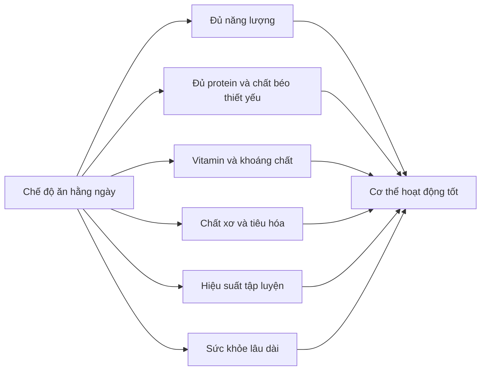
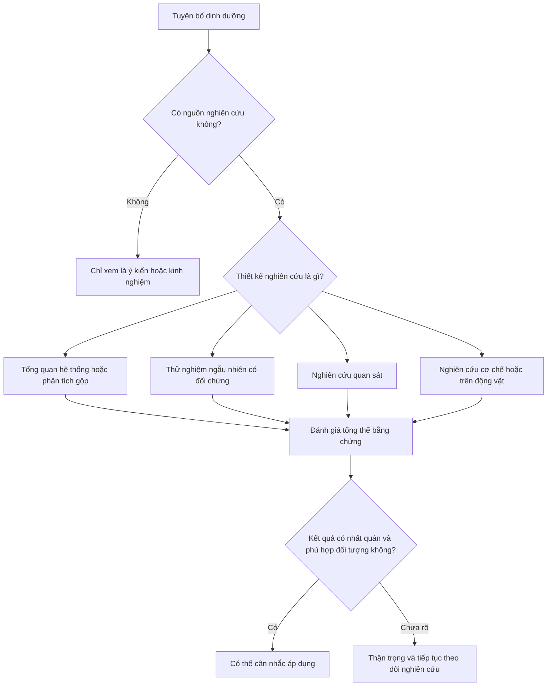
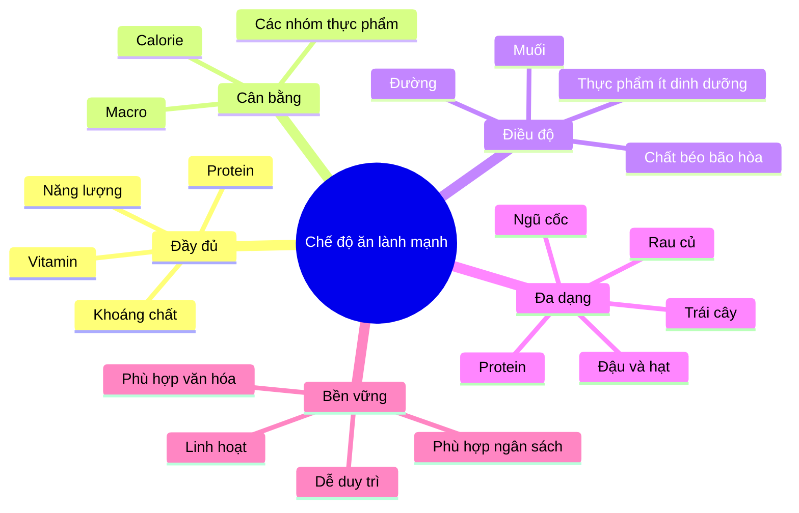

[](https://www.irishtimes.com/life-and-style/food-and-drink/pyramid-or-plate-carbs-or-veggies-what-really-is-the-ideal-diet-1.3774719?utm_source=chatgpt.com)

# 052 — Giới thiệu về chế độ ăn uống lành mạnh

## Healthy Dieting Introduction

| Thuộc tính       | Nội dung                                                                   |
| ---------------- | -------------------------------------------------------------------------- |
| **Module**       | Module 06 — Healthy Dieting                                                |
| **Bài học**      | Healthy Dieting Introduction                                               |
| **Thời lượng**   | 01:22                                                                      |
| **Chủ đề chính** | Giới thiệu về chế độ ăn uống lành mạnh                                     |
| **Trọng tâm**    | Mở rộng mục tiêu từ tăng cơ, giảm mỡ sang sức khỏe và chất lượng cuộc sống |


*Hình 1 — Trái cây, rau củ, cá và ngũ cốc là những nhóm thực phẩm thường có mặt trong một chế độ ăn đa dạng. Ảnh của National Cancer Institute, thuộc phạm vi công cộng. ([Wikimedia Commons][1])*

---

## Mục lục

1. [Mục tiêu bài học](#1-mục-tiêu-bài-học)
2. [Nội dung chính](#2-nội-dung-chính)
3. [Áp dụng thực tế](#3-áp-dụng-thực-tế)
4. [Lưu ý và lỗi thường gặp](#4-lưu-ý-và-lỗi-thường-gặp)
5. [Checklist thực hành](#5-checklist-thực-hành)
6. [Tóm tắt](#6-tóm-tắt)
7. [Tài liệu tham khảo](#7-tài-liệu-tham-khảo)

---

## 1. Mục tiêu bài học

Sau bài học này, người học có thể:

* Hiểu rằng một chế độ ăn giúp **tăng cơ hoặc giảm mỡ** chưa chắc đã là một chế độ ăn tối ưu cho sức khỏe lâu dài.
* Phân biệt giữa việc chỉ kiểm soát **calorie và chất dinh dưỡng đa lượng** với việc xây dựng một chế độ ăn toàn diện.
* Nhận biết bốn nguyên tắc nền tảng của chế độ ăn lành mạnh:

  * Đầy đủ.
  * Cân bằng.
  * Điều độ.
  * Đa dạng.
* Hiểu vì sao cần xem xét:

  * Vitamin và khoáng chất.
  * Chất xơ.
  * Chất lượng thực phẩm.
  * Khả năng tiêu hóa.
  * Mức năng lượng và cảm giác khỏe mạnh hằng ngày.
* Biết cách đánh giá các xu hướng dinh dưỡng dựa trên **bằng chứng khoa học**, thay vì chỉ dựa vào trải nghiệm cá nhân hoặc nội dung lan truyền trên mạng.

---

## 2. Nội dung chính

### 2.1. Chuyển từ “ăn để đẹp” sang “ăn để khỏe”

Ở các module trước, trọng tâm chính là:

* Tính lượng calorie cần thiết.
* Xác định protein, carbohydrate và chất béo.
* Thiết kế bữa ăn.
* Điều chỉnh chế độ ăn để tăng cơ hoặc giảm mỡ.
* Theo dõi sự thay đổi của cân nặng và vóc dáng.

Đây là những kiến thức rất quan trọng. Tuy nhiên, chúng chủ yếu trả lời câu hỏi:

> **“Tôi cần ăn như thế nào để thay đổi thành phần cơ thể?”**

Module này mở rộng sang một câu hỏi lớn hơn:

> **“Tôi cần ăn như thế nào để cơ thể hoạt động tốt, duy trì sức khỏe và có chất lượng cuộc sống cao hơn?”**

Một người có thể kiểm soát calorie rất chính xác, đạt tỷ lệ mỡ thấp hoặc có nhiều cơ bắp nhưng vẫn gặp các vấn đề như:

* Thường xuyên mệt mỏi.
* Khó tập trung.
* Tiêu hóa không ổn định.
* Táo bón hoặc đầy bụng.
* Thiếu một số vitamin và khoáng chất.
* Chất lượng giấc ngủ kém.
* Khả năng hồi phục sau tập không tốt.
* Chế độ ăn quá cứng nhắc và khó duy trì.

Do đó, **hình thể bên ngoài không phải lúc nào cũng phản ánh đầy đủ sức khỏe bên trong**.

---

### 2.2. Chế độ ăn thể hình và chế độ ăn lành mạnh

Hai khái niệm này có liên quan nhưng không hoàn toàn giống nhau.

| Khía cạnh                    | Chế độ ăn tập trung vào thể hình               | Chế độ ăn lành mạnh toàn diện                              |
| ---------------------------- | ---------------------------------------------- | ---------------------------------------------------------- |
| **Mục tiêu chính**           | Tăng cơ, giảm mỡ hoặc duy trì cân nặng         | Sức khỏe, chức năng cơ thể và chất lượng cuộc sống         |
| **Năng lượng**               | Theo dõi calorie chặt chẽ                      | Cân bằng năng lượng nhưng linh hoạt hơn                    |
| **Protein**                  | Thường được ưu tiên cao                        | Đủ theo nhu cầu và phù hợp tình trạng sức khỏe             |
| **Carbohydrate và chất béo** | Điều chỉnh để đạt mục tiêu hình thể            | Chú ý cả số lượng và chất lượng nguồn thực phẩm            |
| **Vitamin, khoáng chất**     | Có thể bị bỏ qua nếu chỉ theo dõi macro        | Là thành phần thiết yếu                                    |
| **Chất xơ**                  | Không phải lúc nào cũng được theo dõi          | Quan trọng đối với tiêu hóa và sức khỏe lâu dài            |
| **Chất lượng thực phẩm**     | Có thể ăn bất kỳ thực phẩm nào miễn đúng macro | Ưu tiên thực phẩm giàu dinh dưỡng                          |
| **Tính bền vững**            | Có thể áp dụng theo từng giai đoạn             | Cần duy trì được trong thời gian dài                       |
| **Sức khỏe tinh thần**       | Dễ trở nên cứng nhắc nếu kiểm soát quá mức     | Hướng tới sự linh hoạt và mối quan hệ tích cực với thức ăn |

Một chế độ ăn tốt nên hỗ trợ đồng thời:



---

### 2.3. Bốn nguyên tắc của một chế độ ăn lành mạnh

Tổ chức Y tế Thế giới cho rằng chế độ ăn lành mạnh có thể được xây dựng theo nhiều cách khác nhau, tùy tuổi tác, mức độ vận động, văn hóa và thực phẩm địa phương. Tuy nhiên, bốn nguyên tắc chung vẫn là **đầy đủ, cân bằng, điều độ và đa dạng**. ([World Health Organization][2])

#### 1. Đầy đủ — Adequacy

Chế độ ăn cần cung cấp đủ:

* Năng lượng.
* Protein.
* Chất béo thiết yếu.
* Carbohydrate phù hợp.
* Vitamin.
* Khoáng chất.
* Chất xơ.
* Nước.

“Đầy đủ” không có nghĩa là ăn càng nhiều càng tốt. Nó có nghĩa là cung cấp đủ nhu cầu của cơ thể mà không thường xuyên vượt quá mức cần thiết.

#### 2. Cân bằng — Balance

Năng lượng ăn vào cần phù hợp tương đối với:

* Mức vận động.
* Mục tiêu hình thể.
* Công việc hằng ngày.
* Khả năng hồi phục.
* Tình trạng sức khỏe.

Các nhóm thực phẩm cũng cần được phân bổ hợp lý, thay vì chỉ tập trung vào một nhóm duy nhất.

#### 3. Điều độ — Moderation

Một chế độ ăn lành mạnh không nhất thiết phải loại bỏ hoàn toàn mọi món ăn yêu thích.

Điều độ có nghĩa là kiểm soát tần suất và khẩu phần của những thực phẩm thường chứa nhiều:

* Đường tự do.
* Muối.
* Chất béo bão hòa.
* Năng lượng nhưng ít chất dinh dưỡng.
* Thành phần gây khó chịu cho cá nhân.

#### 4. Đa dạng — Diversity

Không có một thực phẩm riêng lẻ nào cung cấp hoàn hảo mọi chất dinh dưỡng.

Sự đa dạng nên xuất hiện:

* Giữa các nhóm thực phẩm.
* Trong cùng một nhóm thực phẩm.
* Giữa các loại rau củ có màu sắc khác nhau.
* Giữa các nguồn protein động vật và thực vật.
* Giữa nhiều loại ngũ cốc, đậu, hạt và trái cây.

Chế độ ăn đa dạng làm tăng khả năng đáp ứng nhu cầu vitamin và khoáng chất, đồng thời giảm sự phụ thuộc quá mức vào một số ít thực phẩm. ([World Health Organization][2])

---

### 2.4. Chất lượng thực phẩm quan trọng như thế nào?

Việc đáp ứng calorie và macro là cần thiết nhưng chưa đủ.

Ví dụ, hai chế độ ăn có thể cung cấp lượng calorie và protein gần tương đương nhưng khác nhau đáng kể về:

* Chất xơ.
* Vitamin và khoáng chất.
* Mức độ no.
* Tốc độ ăn.
* Khả năng kiểm soát khẩu phần.
* Ảnh hưởng đến tiêu hóa.
* Khả năng duy trì lâu dài.

Trong một thử nghiệm ngẫu nhiên có kiểm soát tại cơ sở nội trú, 20 người trưởng thành lần lượt sử dụng chế độ ăn siêu chế biến và chế độ ăn ít chế biến. Khi được ăn tự do, người tham gia có xu hướng tiêu thụ nhiều năng lượng và tăng cân trong giai đoạn sử dụng chế độ ăn siêu chế biến, dù các thực đơn được thiết kế để tương đối tương đồng về nhiều thành phần dinh dưỡng được cung cấp. Đây là một nghiên cứu nhỏ và ngắn hạn, nhưng cho thấy cấu trúc và mức độ chế biến của thực phẩm có thể ảnh hưởng đến lượng ăn thực tế. ([PubMed][3])

Điều này không có nghĩa là mọi thực phẩm chế biến đều có hại. Các thực phẩm tiện lợi như:

* Rau đông lạnh.
* Cá đóng hộp.
* Đậu đóng hộp ít muối.
* Sữa chua.
* Sữa tiệt trùng.
* Yến mạch cán.
* Bánh mì nguyên cám.

vẫn có thể là thành phần hữu ích của một chế độ ăn lành mạnh.

Điểm cần quan tâm là **toàn bộ mô hình ăn uống**, không phải việc gắn nhãn một món ăn riêng lẻ là hoàn toàn “tốt” hoặc hoàn toàn “xấu”.

---

### 2.5. Ăn uống lành mạnh và chất lượng cuộc sống

Mục tiêu của dinh dưỡng không chỉ là phòng bệnh trong tương lai mà còn giúp cải thiện cách cơ thể hoạt động ở hiện tại.

Một chế độ ăn phù hợp có thể hỗ trợ:

* Mức năng lượng ổn định hơn.
* Khả năng tập trung.
* Chức năng tiêu hóa.
* Chất lượng giấc ngủ.
* Hiệu suất tập luyện.
* Khả năng hồi phục.
* Tâm trạng và cảm nhận về sức khỏe.

Các tổng quan nghiên cứu đã ghi nhận mối liên hệ giữa những mô hình ăn uống lành mạnh hoặc kiểu Địa Trung Hải với điểm số chất lượng cuộc sống thể chất và tinh thần tốt hơn. Tuy nhiên, phần lớn bằng chứng thuộc dạng quan sát nên không thể khẳng định chế độ ăn là nguyên nhân duy nhất của sự khác biệt. ([PubMed Central (PMC)][4])

---

### 2.6. Trải nghiệm cá nhân không thay thế bằng chứng khoa học

Người hướng dẫn chia sẻ rằng trước đây dù đã tăng được nhiều cơ bắp và có hình thể tốt hơn, anh vẫn thường xuyên:

* Mệt mỏi.
* Bị đau hoặc co thắt vùng bụng.
* Không cảm thấy khỏe như mong đợi.

Trải nghiệm cá nhân có thể giúp hình thành giả thuyết, nhưng không đủ để kết luận rằng một phương pháp sẽ phù hợp với tất cả mọi người.

Khi đánh giá một tuyên bố dinh dưỡng, nên xem xét:



Không nên chỉ dựa vào:

* Một người nổi tiếng.
* Một video ngắn.
* Ảnh trước và sau.
* Một câu chuyện thành công.
* Một nghiên cứu riêng lẻ.
* Lập luận “tôi đã thử và thấy hiệu quả”.

---

### 2.7. Thông tin sai lệch trong lĩnh vực dinh dưỡng

Dinh dưỡng là lĩnh vực có rất nhiều thông tin trái chiều vì:

* Nhu cầu của mỗi người khác nhau.
* Kết quả nghiên cứu có thể phụ thuộc vào đối tượng.
* Một số nghiên cứu chỉ cho thấy mối liên hệ, không chứng minh quan hệ nhân quả.
* Nội dung cực đoan thường thu hút sự chú ý hơn lời khuyên cân bằng.
* Các sản phẩm và chương trình ăn kiêng có thể được quảng bá vì lợi ích thương mại.
* Những thay đổi ngắn hạn trên cân nặng dễ bị nhầm với cải thiện sức khỏe lâu dài.

Một số dấu hiệu cảnh báo thông tin thiếu đáng tin cậy:

| Dấu hiệu                                       | Vì sao cần thận trọng?                                                            |
| ---------------------------------------------- | --------------------------------------------------------------------------------- |
| “Thực phẩm này chữa được mọi bệnh”             | Không một thực phẩm đơn lẻ nào có tác dụng như vậy                                |
| “Tuyệt đối không được ăn carbohydrate”         | Carbohydrate là một nhóm rất rộng và có chất lượng khác nhau                      |
| “Chỉ cần dùng sản phẩm này để thải độc”        | Cơ thể có gan, thận, phổi và hệ tiêu hóa thực hiện chức năng chuyển hóa, đào thải |
| “Ăn càng ít càng giảm cân nhanh”               | Hạn chế quá mức có thể làm giảm hiệu suất và khó duy trì                          |
| “Tự nhiên luôn tốt hơn”                        | Nguồn gốc tự nhiên không đảm bảo an toàn hoặc phù hợp                             |
| “Một nghiên cứu đã chứng minh…”                | Cần xem thiết kế, quy mô và toàn bộ hệ thống bằng chứng                           |
| “Phương pháp này phù hợp cho tất cả mọi người” | Nhu cầu cá nhân khác nhau đáng kể                                                 |

---

## 3. Áp dụng thực tế

### 3.1. Mô hình đĩa ăn đơn giản


*Hình 2 — Mô hình đĩa ăn là một công cụ trực quan để phân bổ nhiều nhóm thực phẩm trong chế độ ăn. Hình của Lionfish0, giấy phép CC BY-SA 3.0. ([Wikimedia Commons][5])*

Một bữa ăn chính có thể được xây dựng theo mẫu tham khảo:

| Thành phần                          | Ví dụ                                             |
| ----------------------------------- | ------------------------------------------------- |
| **Rau củ và trái cây**              | Rau cải, súp lơ, cà rốt, cà chua, bí đỏ, táo, cam |
| **Nguồn protein**                   | Cá, thịt nạc, trứng, đậu phụ, đậu lăng, sữa chua  |
| **Nguồn carbohydrate giàu chất xơ** | Cơm, khoai, yến mạch, bánh mì nguyên cám, ngô     |
| **Chất béo có lợi**                 | Các loại hạt, dầu ô liu, quả bơ, cá béo           |
| **Đồ uống chính**                   | Nước lọc                                          |

Có thể hình dung đơn giản:

```text
┌──────────────────────────────────────┐
│            ĐĨA ĂN THAM KHẢO          │
├──────────────────┬───────────────────┤
│                  │  Protein          │
│  Rau củ và       │  Cá, trứng,       │
│  trái cây        │  thịt nạc, đậu    │
│                  ├───────────────────┤
│                  │  Cơm, khoai hoặc  │
│                  │  ngũ cốc          │
└──────────────────┴───────────────────┘
       + một lượng nhỏ chất béo tốt
       + nước lọc
```

Đây là mô hình linh hoạt, không phải công thức bắt buộc cho tất cả mọi người. Khẩu phần cụ thể còn phụ thuộc vào:

* Mức vận động.
* Mục tiêu tăng hoặc giảm cân.
* Khả năng tiêu hóa.
* Sở thích.
* Văn hóa ăn uống.
* Tình trạng sức khỏe.

---

### 3.2. Một số mục tiêu tham khảo chung

Theo hướng dẫn của WHO dành cho người trên 10 tuổi:

| Thành phần                        |            Mục tiêu tham khảo |
| --------------------------------- | ----------------------------: |
| **Rau và trái cây**               | Ít nhất khoảng 400 g mỗi ngày |
| **Chất xơ tự nhiên từ thực phẩm** |  Ít nhất khoảng 25 g mỗi ngày |
| **Đường tự do**                   |      Dưới 10% tổng năng lượng |
| **Chất béo bão hòa**              | Không quá 10% tổng năng lượng |
| **Chất béo chuyển hóa**           |  Không quá 1% tổng năng lượng |

Đây là khuyến nghị cho cộng đồng, không thay thế kế hoạch dinh dưỡng cá nhân hoặc tư vấn y tế. ([World Health Organization][2])

---

### 3.3. Đánh giá chế độ ăn hiện tại

Trước khi thay đổi, hãy ghi lại chế độ ăn trong khoảng ba ngày, bao gồm:

* Hai ngày làm việc hoặc đi học.
* Một ngày cuối tuần.
* Thức ăn.
* Đồ uống.
* Khẩu phần tương đối.
* Thời điểm ăn.
* Cảm giác đói và no.
* Mức năng lượng.
* Phản ứng tiêu hóa.

Sau đó tự đánh giá:

| Câu hỏi                                       |  Có | Chưa |
| --------------------------------------------- | :-: | :--: |
| Tôi ăn rau hoặc trái cây mỗi ngày?            |  ☐  |   ☐  |
| Tôi có nhiều hơn một nguồn protein?           |  ☐  |   ☐  |
| Tôi thường xuyên ăn thực phẩm giàu chất xơ?   |  ☐  |   ☐  |
| Nước lọc là đồ uống chính?                    |  ☐  |   ☐  |
| Tôi có nguồn chất béo không bão hòa?          |  ☐  |   ☐  |
| Chế độ ăn có nhiều màu sắc và nhóm thực phẩm? |  ☐  |   ☐  |
| Tôi cảm thấy đủ năng lượng trong ngày?        |  ☐  |   ☐  |
| Tiêu hóa của tôi tương đối ổn định?           |  ☐  |   ☐  |
| Tôi có thể duy trì cách ăn này lâu dài?       |  ☐  |   ☐  |

---

### 3.4. Thay đổi nhỏ trước khi thay đổi lớn

Không cần thiết phải thiết kế lại toàn bộ chế độ ăn trong một ngày.

Một số thay đổi đơn giản:

| Thói quen hiện tại                  | Thay đổi có thể thử                               |
| ----------------------------------- | ------------------------------------------------- |
| Ít ăn rau                           | Thêm một khẩu phần rau vào bữa trưa               |
| Không ăn trái cây                   | Chuẩn bị một quả chuối, táo hoặc cam              |
| Chủ yếu uống nước ngọt              | Thay một phần bằng nước lọc hoặc trà không đường  |
| Ít chất xơ                          | Thêm yến mạch, khoai, đậu hoặc ngũ cốc nguyên hạt |
| Thường xuyên đói sau bữa ăn         | Tăng protein, rau và thực phẩm giàu chất xơ       |
| Quá phụ thuộc vào một nguồn protein | Luân phiên cá, thịt, trứng, sữa và các loại đậu   |
| Ăn quá nhanh                        | Dành nhiều thời gian hơn cho bữa ăn               |
| Chế độ ăn quá cứng nhắc             | Cho phép một tỷ lệ linh hoạt với món ăn yêu thích |

#### Nguyên tắc thực hành

> **Ưu tiên bổ sung những gì còn thiếu trước khi cố gắng loại bỏ mọi thực phẩm bị cho là “không lành mạnh”.**

Ví dụ:

* Thêm rau trước khi cấm hoàn toàn cơm.
* Thêm protein trước khi cắt giảm mạnh calorie.
* Thêm nước trước khi loại bỏ tất cả đồ uống yêu thích.
* Thêm chất xơ từ từ thay vì tăng đột ngột.

---

### 3.5. Thử thách bảy ngày

#### Ngày 1 — Quan sát

Ghi lại tất cả thực phẩm và đồ uống mà không phán xét.

#### Ngày 2 — Bổ sung rau

Thêm ít nhất một khẩu phần rau vào một bữa ăn.

#### Ngày 3 — Bổ sung trái cây

Ăn một đến hai phần trái cây nguyên quả.

#### Ngày 4 — Kiểm tra nguồn protein

Đảm bảo mỗi bữa chính có một nguồn protein phù hợp.

#### Ngày 5 — Kiểm tra chất xơ

Thêm đậu, khoai, yến mạch hoặc ngũ cốc nguyên hạt.

#### Ngày 6 — Kiểm tra đồ uống

Ưu tiên nước lọc trong phần lớn thời gian.

#### Ngày 7 — Đánh giá

Ghi lại:

* Mức năng lượng.
* Cảm giác đói.
* Cảm giác no.
* Tiêu hóa.
* Khả năng tập luyện.
* Mức độ dễ duy trì.

---

## 4. Lưu ý và lỗi thường gặp

### 4.1. Chỉ quan tâm đến calorie và macro

Một người có thể ăn đúng calorie, protein, carbohydrate và chất béo nhưng vẫn thiếu:

* Vitamin.
* Khoáng chất.
* Chất xơ.
* Các acid béo thiết yếu.
* Sự đa dạng thực phẩm.

Macro là nền tảng quan trọng, nhưng không phải toàn bộ bức tranh dinh dưỡng.

---

### 4.2. Cho rằng “lành mạnh” đồng nghĩa với “ít calorie”

Một thực phẩm có thể giàu dinh dưỡng nhưng vẫn chứa nhiều năng lượng, ví dụ:

* Các loại hạt.
* Bơ hạt.
* Dầu thực vật.
* Quả bơ.
* Cá béo.

Ngược lại, một sản phẩm ít calorie chưa chắc cung cấp nhiều dinh dưỡng.

Cần phân biệt:

* **Mật độ năng lượng:** lượng calorie trong một khối lượng thực phẩm.
* **Mật độ dinh dưỡng:** lượng chất dinh dưỡng có lợi so với năng lượng.

---

### 4.3. Loại bỏ hoàn toàn một nhóm thực phẩm không cần thiết

Việc cắt bỏ một nhóm thực phẩm có thể cần thiết khi có:

* Dị ứng.
* Không dung nạp.
* Bệnh lý cụ thể.
* Chỉ định từ bác sĩ hoặc chuyên gia dinh dưỡng.

Nếu không có lý do rõ ràng, loại bỏ cả một nhóm thực phẩm có thể:

* Làm chế độ ăn khó duy trì.
* Giảm sự đa dạng.
* Làm tăng nguy cơ thiếu chất.
* Tạo tâm lý sợ thức ăn.

---

### 4.4. Thay đổi quá nhiều cùng lúc

Thay đổi đồng thời toàn bộ thực đơn, giờ ăn, khẩu phần và danh sách thực phẩm thường tạo áp lực lớn.

Cách tiếp cận phù hợp hơn:

```text
Đánh giá hiện trạng
        ↓
Chọn một vấn đề quan trọng
        ↓
Thực hiện một thay đổi nhỏ
        ↓
Theo dõi trong 1–2 tuần
        ↓
Giữ lại nếu có lợi
        ↓
Tiếp tục điều chỉnh
```

---

### 4.5. Tăng chất xơ quá nhanh

Tăng đột ngột lượng:

* Rau.
* Đậu.
* Yến mạch.
* Hạt.
* Ngũ cốc nguyên hạt.

có thể gây đầy hơi hoặc khó chịu ở một số người.

Nên tăng từ từ và uống đủ nước để hệ tiêu hóa có thời gian thích nghi.

---

### 4.6. Tự chẩn đoán nguyên nhân của triệu chứng

Mệt mỏi, đau bụng, co thắt bụng hoặc khó tiêu có thể liên quan đến chế độ ăn, nhưng cũng có thể xuất phát từ:

* Thiếu ngủ.
* Căng thẳng.
* Nhiễm trùng.
* Thiếu máu.
* Bệnh đường tiêu hóa.
* Không dung nạp thực phẩm.
* Tác dụng phụ của thuốc.
* Tập luyện quá mức.

Không nên tự kết luận rằng một loại thực phẩm duy nhất là nguyên nhân.

Nếu triệu chứng:

* Kéo dài.
* Thường xuyên tái phát.
* Gây đau dữ dội.
* Đi kèm sụt cân không chủ ý.
* Đi ngoài ra máu.
* Nôn kéo dài.
* Ảnh hưởng đáng kể đến sinh hoạt.

hãy tìm kiếm đánh giá từ nhân viên y tế.

---

### 4.7. Áp dụng lời khuyên chung cho bệnh lý đặc biệt

Những người có các tình trạng sau cần được cá nhân hóa chế độ ăn:

* Tiểu đường.
* Bệnh thận.
* Bệnh gan.
* Bệnh tim mạch.
* Rối loạn tiêu hóa.
* Dị ứng thực phẩm.
* Mang thai hoặc cho con bú.
* Rối loạn ăn uống.
* Đang sử dụng thuốc ảnh hưởng đến dinh dưỡng.

---

## 5. Checklist thực hành

### Kiến thức

* [ ] Tôi hiểu rằng vóc dáng đẹp không đảm bảo sức khỏe tối ưu.
* [ ] Tôi phân biệt được mục tiêu hình thể và mục tiêu sức khỏe.
* [ ] Tôi biết bốn nguyên tắc: đầy đủ, cân bằng, điều độ và đa dạng.
* [ ] Tôi hiểu rằng calorie và macro chỉ là một phần của chế độ ăn.
* [ ] Tôi biết trải nghiệm cá nhân không thay thế nghiên cứu khoa học.

### Chất lượng chế độ ăn

* [ ] Tôi ăn rau và trái cây thường xuyên.
* [ ] Tôi có nguồn thực phẩm giàu chất xơ.
* [ ] Tôi sử dụng nhiều nguồn protein khác nhau.
* [ ] Tôi có nguồn chất béo không bão hòa.
* [ ] Tôi uống đủ nước.
* [ ] Tôi không quá phụ thuộc vào một vài loại thực phẩm.
* [ ] Phần lớn chế độ ăn cung cấp nhiều chất dinh dưỡng.

### Khả năng duy trì

* [ ] Chế độ ăn phù hợp với ngân sách của tôi.
* [ ] Thực phẩm tương đối dễ mua và chuẩn bị.
* [ ] Tôi vẫn có thể tham gia các bữa ăn xã hội.
* [ ] Tôi không cảm thấy tội lỗi khi ăn một món ngoài kế hoạch.
* [ ] Tôi có thể duy trì chế độ ăn trong nhiều tháng, không chỉ vài ngày.

### Theo dõi cơ thể

* [ ] Mức năng lượng của tôi tương đối ổn định.
* [ ] Tôi không thường xuyên đói dữ dội.
* [ ] Tiêu hóa của tôi tương đối ổn định.
* [ ] Tôi ngủ và hồi phục tốt.
* [ ] Tôi điều chỉnh dựa trên xu hướng nhiều ngày, không dựa vào một ngày riêng lẻ.

---

## 6. Tóm tắt

Chế độ ăn uống lành mạnh không chỉ nhằm:

* Giảm cân.
* Tăng cơ.
* Đạt một tỷ lệ mỡ cụ thể.
* Có hình thể đẹp hơn.

Nó còn nhằm hỗ trợ:

* Sức khỏe thể chất.
* Sức khỏe tinh thần.
* Tiêu hóa.
* Năng lượng.
* Hiệu suất tập luyện.
* Khả năng hồi phục.
* Chất lượng cuộc sống lâu dài.

Một chế độ ăn toàn diện cần đáp ứng năm yếu tố chính:



> **Thông điệp quan trọng:**
> Một chế độ ăn tốt không chỉ giúp anh trông khỏe mạnh hơn mà còn phải giúp anh thực sự cảm thấy khỏe mạnh, hoạt động tốt và có thể duy trì trong thời gian dài.

---

## 7. Tài liệu tham khảo

1. **World Health Organization — Healthy Diet**
   WHO trình bày bốn nguyên tắc của chế độ ăn lành mạnh và các khuyến nghị về rau quả, chất xơ, đường và chất béo. ([World Health Organization][2])

2. **Hall và cộng sự, 2019 — Ultra-Processed Diets Cause Excess Calorie Intake and Weight Gain**
   Thử nghiệm ngẫu nhiên nội trú so sánh chế độ ăn siêu chế biến với chế độ ăn ít chế biến. ([PubMed][3])

3. **Vajdi và cộng sự, 2020 — Dietary Patterns and Health-Related Quality of Life**
   Tổng quan hệ thống về mối liên hệ giữa mô hình ăn uống và chất lượng cuộc sống. ([PubMed Central (PMC)][4])

4. **Govindaraju và cộng sự, 2018 — Dietary Patterns and Quality of Life in Older Adults**
   Tổng quan về chất lượng chế độ ăn và chất lượng cuộc sống ở người trưởng thành lớn tuổi. ([PubMed Central (PMC)][6])

5. **Nguồn hình ảnh**

   * *Healthy Food* — National Cancer Institute, public domain. ([Wikimedia Commons][1])
   * *Eatwell Plate* — Lionfish0, CC BY-SA 3.0. ([Wikimedia Commons][5])

[1]: https://commons.wikimedia.org/wiki/File%3AHealthy_food.jpg "File:Healthy food.jpg - Wikimedia Commons"
[2]: https://www.who.int/news-room/fact-sheets/detail/healthy-diet "Healthy diet"
[3]: https://pubmed.ncbi.nlm.nih.gov/31105044/?utm_source=chatgpt.com "Ultra-Processed Diets Cause Excess Calorie Intake ... - PubMed"
[4]: https://pmc.ncbi.nlm.nih.gov/articles/PMC7552532/?utm_source=chatgpt.com "A systematic review of the association between dietary ... - PMC"
[5]: https://commons.wikimedia.org/wiki/File%3AEatwell_Plate.svg "File:Eatwell Plate.svg - Wikimedia Commons"
[6]: https://pmc.ncbi.nlm.nih.gov/articles/PMC6115962/?utm_source=chatgpt.com "Dietary Patterns and Quality of Life in Older Adults - PMC - NIH"
