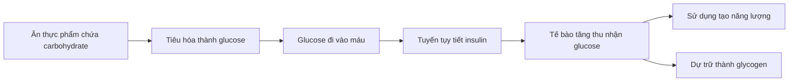
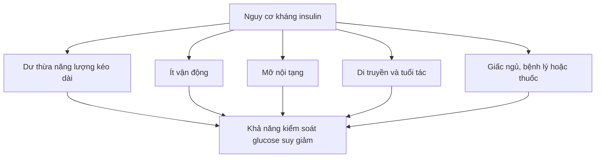

# 053 — Lầm tưởng về ăn kiêng số 1: Carbohydrate có hại cho sức khỏe

> **Kết luận cốt lõi:** Carbohydrate không tự động gây béo, gây tiểu đường hoặc có hại cho sức khỏe. Điều quan trọng hơn là **nguồn carbohydrate, mức độ chế biến, khẩu phần, tổng năng lượng, lượng chất xơ và tình trạng sức khỏe của từng người**.

| Thuộc tính       | Nội dung                                      |
| ---------------- | --------------------------------------------- |
| **Module**       | Module 06 — Healthy Dieting                   |
| **Bài học**      | Dieting Myth #1: Carbs Are Bad For You        |
| **Thời lượng**   | 01:37                                         |
| **Chủ đề chính** | Lầm tưởng 1: Carbohydrate có hại cho sức khỏe |


*Nguồn ảnh: [Wikimedia Commons — Fruit, Vegetables and Grain, NCI Visuals Online](https://commons.wikimedia.org/wiki/File:Fruit,_Vegetables_and_Grain_NCI_Visuals_Online.jpg).*

---

## Mục lục

1. [Mục tiêu bài học](#1-mục-tiêu-bài-học)
2. [Nội dung chính](#2-nội-dung-chính)
3. [Áp dụng thực tế](#3-áp-dụng-thực-tế)
4. [Lưu ý và lỗi thường gặp](#4-lưu-ý-và-lỗi-thường-gặp)
5. [Checklist thực hành](#5-checklist-thực-hành)
6. [Tóm tắt](#6-tóm-tắt)
7. [Tài liệu tham khảo](#7-tài-liệu-tham-khảo)

---

## 1. Mục tiêu bài học

Sau bài học này, anh có thể:

* Giải thích vì sao không nên đánh đồng tất cả carbohydrate với đường tinh luyện.
* Hiểu vai trò của glucose, insulin và glycogen trong cơ thể.
* Phân biệt carbohydrate giàu dinh dưỡng với carbohydrate tinh luyện.
* Hiểu rằng chế độ ăn ít carbohydrate chỉ là **một lựa chọn**, không phải yêu cầu bắt buộc để giảm cân.
* Chọn nguồn carbohydrate phù hợp với sức khỏe, mức vận động và mục tiêu tập luyện.
* Nhận biết những điểm cần đính chính trong nội dung bài giảng gốc.

---

## 2. Nội dung chính

### 2.1. Carbohydrate là gì?

Carbohydrate là một trong ba nhóm chất dinh dưỡng đa lượng chính:

* **Carbohydrate:** khoảng 4 kcal mỗi gram.
* **Protein:** khoảng 4 kcal mỗi gram.
* **Chất béo:** khoảng 9 kcal mỗi gram.

Sau khi tiêu hóa, nhiều loại carbohydrate được phân giải thành glucose. Glucose có thể:

* Được sử dụng ngay để tạo năng lượng.
* Được dự trữ dưới dạng glycogen trong gan và cơ.
* Được chuyển sang các con đường chuyển hóa khác khi cơ thể nhận năng lượng vượt quá nhu cầu.

Không phải mọi carbohydrate đều giống nhau. WHO nhấn mạnh rằng chất lượng carbohydrate phụ thuộc vào nguồn thực phẩm, hàm lượng chất xơ, tỷ lệ đường và tốc độ tiêu hóa, chứ không chỉ phụ thuộc vào tổng số gram carbohydrate. ([World Health Organization][1])

---

### 2.2. “Carbohydrate có hại” là một cách khái quát hóa sai

Một lon nước ngọt và một bát yến mạch đều chứa carbohydrate, nhưng ảnh hưởng dinh dưỡng của chúng rất khác nhau.

| Nhóm                          | Ví dụ                                                | Đặc điểm                                                         |
| ----------------------------- | ---------------------------------------------------- | ---------------------------------------------------------------- |
| **Ít tinh chế, giàu chất xơ** | Yến mạch, gạo lứt, khoai, ngô, đậu, trái cây, rau củ | Cung cấp chất xơ, vitamin, khoáng chất và thường giúp no lâu hơn |
| **Tinh chế**                  | Bánh mì trắng, bánh quy, ngũ cốc nhiều đường         | Phần cám và mầm có thể đã bị loại bỏ, thường ít chất xơ hơn      |
| **Nhiều đường tự do**         | Nước ngọt, trà sữa nhiều đường, kẹo, bánh ngọt       | Dễ bổ sung nhiều năng lượng nhưng ít chất xơ và vi chất          |
| **Carbohydrate dạng lỏng**    | Nước ngọt, nước trái cây thêm đường                  | Thường kém no hơn so với thực phẩm nguyên dạng                   |

WHO khuyến nghị carbohydrate trong chế độ ăn nên chủ yếu đến từ **ngũ cốc nguyên hạt, rau, trái cây và các loại đậu**. Đối với phần lớn mọi người, carbohydrate ít tinh chế vẫn có thể chiếm một phần đáng kể trong chế độ ăn lành mạnh. ([World Health Organization][2])

> **Không nên hỏi:** “Carbohydrate có tốt không?”
> **Nên hỏi:** “Carbohydrate này đến từ thực phẩm nào, được chế biến đến mức nào và khẩu phần bao nhiêu?”

---

### 2.3. Insulin không phải là “hormone xấu”

Insulin là hormone do tuyến tụy sản xuất. Một trong những vai trò quan trọng của insulin là giúp glucose từ máu đi vào tế bào để được sử dụng hoặc dự trữ.



Ở người khỏe mạnh, việc insulin tăng lên sau bữa ăn là một phản ứng sinh lý bình thường. Insulin không chỉ tham gia chuyển hóa carbohydrate mà còn ảnh hưởng đến chuyển hóa chất béo và protein. Nói rằng insulin tự nó “gây béo” hoặc “có hại” là cách diễn giải quá đơn giản. ([Viện Quốc gia về Bệnh Tiểu đường và Thận][3])


*Nguồn ảnh nghiên cứu: [Wikimedia Commons — Insulin glucose metabolism](https://commons.wikimedia.org/wiki/File:Insulin_glucose_metabolism.jpg).*

---

### 2.4. Chỉ số đường huyết không phải là “thang đo mức độ nguy hiểm”

**Chỉ số đường huyết — Glycemic Index, GI** phản ánh mức tăng glucose máu sau khi ăn một loại thực phẩm chứa carbohydrate trong điều kiện thử nghiệm.

GI không thể tự mình cho biết một món ăn có lành mạnh hay không vì ảnh hưởng thực tế còn phụ thuộc vào:

* Khẩu phần ăn.
* Tổng lượng carbohydrate.
* Lượng chất xơ.
* Mức độ chế biến.
* Protein và chất béo ăn kèm.
* Cách nấu và độ chín.
* Mức vận động.
* Phản ứng riêng của từng người.

Ví dụ, một thực phẩm có GI tương đối cao vẫn có thể cung cấp vitamin, khoáng chất và chất xơ. Ngược lại, một sản phẩm có GI thấp không mặc nhiên là giàu dinh dưỡng. WHO vì vậy đánh giá chất lượng carbohydrate bằng nhiều yếu tố, không chỉ dựa trên tốc độ làm tăng glucose. ([World Health Organization][1])

---

### 2.5. Carbohydrate có gây kháng insulin không?

Nội dung bài giảng gốc cho rằng carbohydrate chỉ gây giảm nhạy insulin ở người mắc tiểu đường đồng thời ăn quá nhiều đường đơn. Nhận định này **chưa đầy đủ**.

Kháng insulin là hiện tượng các tế bào phản ứng kém với insulin. Nó có thể liên quan đến nhiều yếu tố:

* Thừa cân hoặc béo phì, đặc biệt là mỡ nội tạng.
* Ít vận động.
* Yếu tố di truyền và tiền sử gia đình.
* Tuổi tác.
* Một số tình trạng nội tiết hoặc thuốc điều trị.
* Thói quen ăn uống và tổng năng lượng kéo dài.

Ăn nhiều thực phẩm siêu chế biến, đồ uống có đường và dư thừa năng lượng có thể góp phần làm tăng nguy cơ, nhưng không thể kết luận rằng **mọi loại carbohydrate trực tiếp gây kháng insulin**. ([Viện Quốc gia về Bệnh Tiểu đường và Thận][4])



---

### 2.6. Có bắt buộc phải ăn ít carbohydrate để giảm cân không?

Không.

Chế độ ăn ít carbohydrate có thể giúp một số người giảm cân vì:

* Làm giảm số lựa chọn thực phẩm giàu năng lượng.
* Có thể giúp kiểm soát cảm giác đói ở một số người.
* Tạo ra mức thâm hụt năng lượng dễ duy trì hơn.
* Phù hợp với sở thích hoặc tình trạng chuyển hóa của một số cá nhân.

Tuy nhiên, đây không phải là phương pháp duy nhất. Một tổng quan mạng lưới các thử nghiệm ngẫu nhiên cho thấy chế độ ăn ít carbohydrate và ít chất béo tạo ra mức giảm cân trung bình khá tương đương trong ngắn hạn. Vì vậy, khả năng tuân thủ, chất lượng thực phẩm và tổng năng lượng thường quan trọng hơn việc gắn nhãn chế độ ăn là “low-carb” hay “low-fat”. ([PubMed][5])

#### Ví dụ

Một người vẫn có thể giảm cân khi ăn:

* Cơm.
* Khoai.
* Yến mạch.
* Trái cây.
* Đậu.
* Bánh mì nguyên hạt.

Điều kiện là tổng khẩu phần phù hợp với nhu cầu và chế độ ăn được duy trì ổn định.

> **Carbohydrate không phá vỡ quá trình giảm cân. Dư thừa năng lượng kéo dài mới là vấn đề cần quản lý.**

---

### 2.7. Carbohydrate và tập luyện

Carbohydrate là nguồn nhiên liệu thực tế quan trọng cho những hoạt động có cường độ từ trung bình đến cao. Cơ bắp có thể dự trữ glucose dưới dạng glycogen và sử dụng nguồn dự trữ này trong quá trình tập luyện.

Việc cung cấp đủ carbohydrate có thể hỗ trợ:

* Duy trì cường độ tập.
* Thực hiện nhiều hiệp hoặc số lần lặp hơn.
* Bổ sung glycogen sau tập.
* Phục hồi giữa các buổi tập có khối lượng cao.
* Giảm cảm giác mệt trong các buổi tập kéo dài.

Các hướng dẫn dinh dưỡng thể thao đặc biệt nhấn mạnh vai trò của carbohydrate đối với vận động kéo dài hoặc có khối lượng cao. Tuy nhiên, lợi ích đối với từng buổi tập sức mạnh còn phụ thuộc vào thời lượng, khối lượng, glycogen ban đầu và tổng chế độ ăn. ([PubMed][6])

#### Carbohydrate có bắt buộc để tăng cơ không?

Không hoàn toàn.

Tăng cơ chủ yếu cần:

1. Tập kháng lực có tiến triển.
2. Đủ protein.
3. Đủ năng lượng.
4. Ngủ và phục hồi tốt.

Carbohydrate không trực tiếp thay thế protein để xây dựng cơ. Tuy nhiên, nó có thể giúp anh tập với khối lượng và chất lượng cao hơn, từ đó **gián tiếp hỗ trợ** quá trình phát triển cơ bắp.

---

### 2.8. Đánh giá các nhận định trong bài giảng gốc

| Nhận định                                                              | Đánh giá               | Cách hiểu chính xác hơn                                                                                             |
| ---------------------------------------------------------------------- | ---------------------- | ------------------------------------------------------------------------------------------------------------------- |
| “Carbohydrate không có hại”                                            | **Cơ bản đúng**        | Cần phân biệt nguồn, khẩu phần và mức độ chế biến                                                                   |
| “Insulin không xấu”                                                    | **Đúng**               | Insulin là hormone thiết yếu giúp điều hòa và sử dụng glucose                                                       |
| “Carbohydrate chỉ gây kháng insulin ở người tiểu đường ăn nhiều đường” | **Quá đơn giản**       | Kháng insulin là vấn đề đa yếu tố và có thể xuất hiện trước khi mắc tiểu đường                                      |
| “Carbohydrate chất lượng cần thiết cho tập luyện”                      | **Đúng một phần**      | Rất hữu ích cho tập cường độ hoặc khối lượng cao nhưng không bắt buộc trong mọi hoàn cảnh                           |
| “Không nên low-carb trừ khi hoàn toàn ít vận động hoặc khó tiêu hóa”   | **Không chính xác**    | Low-carb có thể phù hợp với sở thích, bệnh lý hoặc kế hoạch cá nhân, nhưng không bắt buộc với số đông               |
| “Cắt carbohydrate sẽ hạn chế tăng cơ”                                  | **Đúng một phần**      | Cắt quá thấp có thể giảm glycogen và hiệu suất tập; nhưng vẫn có thể tăng cơ nếu tập, protein và năng lượng phù hợp |
| “Ai khuyên low-carb đều đang bán chế độ ăn”                            | **Mang tính quy chụp** | Cần đánh giá bằng chứng và bối cảnh thay vì động cơ giả định                                                        |

---

## 3. Áp dụng thực tế

### 3.1. Quy tắc chọn carbohydrate

Có thể sử dụng mô hình bốn bước:


#### Bước 1: Ưu tiên nguồn ít tinh chế

* Gạo lứt hoặc gạo thông thường với khẩu phần hợp lý.
* Yến mạch.
* Khoai lang, khoai tây, bí đỏ.
* Ngô.
* Đậu xanh, đậu đỏ, đậu lăng, đậu gà.
* Trái cây nguyên quả.
* Rau củ.
* Bánh mì nguyên hạt.

WHO khuyến nghị người trên 10 tuổi hướng đến ít nhất khoảng **25 g chất xơ tự nhiên mỗi ngày**, chủ yếu thông qua thực phẩm thực vật. Đây là mục tiêu sức khỏe cộng đồng, không phải đơn thuốc cá nhân. ([World Health Organization][7])

#### Bước 2: Điều chỉnh khẩu phần

Khẩu phần phụ thuộc vào:

* Tổng nhu cầu năng lượng.
* Mục tiêu giảm, giữ hay tăng cân.
* Mức độ vận động.
* Cường độ tập.
* Khả năng tiêu hóa.
* Tình trạng chuyển hóa.

Một vận động viên tập hai buổi mỗi ngày có thể cần nhiều carbohydrate hơn đáng kể so với người làm việc văn phòng và ít vận động.

#### Bước 3: Tạo bữa ăn cân bằng

Một cấu trúc đơn giản:

| Thành phần                    | Tỷ lệ tham khảo trên đĩa |
| ----------------------------- | -----------------------: |
| Rau không chứa nhiều tinh bột |           Khoảng 1/2 đĩa |
| Protein                       |           Khoảng 1/4 đĩa |
| Cơm, khoai, ngũ cốc hoặc đậu  |           Khoảng 1/4 đĩa |
| Chất béo                      |    Một lượng nhỏ phù hợp |
| Nước uống                     |         Ưu tiên nước lọc |

Đây chỉ là cách ước lượng trực quan, không phải tỷ lệ bắt buộc cho mọi người.

---

### 3.2. Ví dụ bữa ăn có carbohydrate chất lượng

#### Bữa sáng

* Yến mạch.
* Sữa chua không đường.
* Chuối hoặc quả mọng.
* Trứng hoặc một nguồn protein khác.

#### Bữa trưa

* Cơm.
* Thịt nạc, cá, trứng hoặc đậu phụ.
* Nhiều rau.
* Một phần trái cây.

#### Bữa phụ trước tập

* Chuối và sữa chua.
* Bánh mì nguyên hạt và trứng.
* Khoai lang và một nguồn protein nhẹ.

#### Bữa tối sau tập

* Cơm hoặc khoai.
* Cá, thịt nạc hoặc đậu phụ.
* Rau.
* Nước và một lượng muối phù hợp với mức đổ mồ hôi.

---

### 3.3. Thay thế thông minh

| Thay vì                         | Có thể chọn                                    |
| ------------------------------- | ---------------------------------------------- |
| Nước ngọt                       | Nước lọc, trà không đường                      |
| Nước trái cây thêm đường        | Trái cây nguyên quả                            |
| Bánh ngọt cho bữa sáng          | Yến mạch, trứng và trái cây                    |
| Ngũ cốc phủ đường               | Yến mạch hoặc ngũ cốc ít đường, giàu chất xơ   |
| Loại bỏ hoàn toàn cơm           | Giảm khẩu phần và tăng rau, protein            |
| Ăn khoai tây chiên thường xuyên | Khoai luộc, hấp hoặc nướng ít dầu              |
| Chỉ nhìn chỉ số GI              | Xem cả khẩu phần, chất xơ và thành phần bữa ăn |

---

### 3.4. Khi mục tiêu là giảm cân

Không cần loại bỏ hoàn toàn cơm hoặc trái cây. Anh có thể:

1. Giữ lại một khẩu phần carbohydrate phù hợp.
2. Tăng rau và protein để hỗ trợ cảm giác no.
3. Hạn chế đồ uống có đường và đồ ăn vặt siêu chế biến.
4. Theo dõi cân nặng theo xu hướng nhiều tuần.
5. Điều chỉnh khẩu phần nhỏ thay vì cắt toàn bộ một nhóm thực phẩm.

Ví dụ:

```text
Trước điều chỉnh:
2 bát cơm lớn + ít rau + thịt nhiều mỡ + nước ngọt

Sau điều chỉnh:
1 bát cơm vừa + nhiều rau + protein nạc + nước lọc
```

Carbohydrate vẫn còn trong bữa ăn, nhưng mật độ năng lượng và tổng khẩu phần đã được kiểm soát tốt hơn.

---

### 3.5. Khi mục tiêu là tăng cơ

Anh có thể phân bổ carbohydrate gần thời điểm tập để hỗ trợ hiệu suất:

* **Trước tập 1–3 giờ:** cơm, khoai, yến mạch, bánh mì hoặc trái cây kèm protein.
* **Sau tập:** carbohydrate kết hợp protein trong một bữa ăn bình thường.
* **Ngày nghỉ:** có thể giảm nhẹ khẩu phần nếu nhu cầu năng lượng thấp hơn, nhưng không bắt buộc phải cắt hoàn toàn.

Đối với buổi tập thông thường dưới khoảng một giờ, không phải ai cũng cần dùng nước thể thao hoặc bổ sung carbohydrate trong lúc tập. Nhu cầu tăng lên rõ hơn khi hoạt động kéo dài, cường độ cao hoặc có nhiều buổi tập gần nhau. ([PubMed][6])

---

## 4. Lưu ý và lỗi thường gặp

### 4.1. Đánh đồng carbohydrate với đường

Đường là một loại carbohydrate, nhưng carbohydrate còn có:

* Tinh bột.
* Chất xơ.
* Các loại đường tự nhiên trong trái cây và sữa.
* Carbohydrate phức hợp trong ngũ cốc và đậu.

Nói “carbohydrate là đường” bỏ qua sự khác biệt lớn giữa các nguồn thực phẩm.

---

### 4.2. Cho rằng insulin tăng là cơ thể lập tức tích mỡ

Insulin tăng sau bữa ăn là bình thường. Việc tăng mỡ cơ thể trong dài hạn phụ thuộc chủ yếu vào cân bằng năng lượng tổng thể và nhiều yếu tố chuyển hóa khác, không thể suy ra chỉ từ một lần insulin tăng sau ăn.

---

### 4.3. Chỉ quan tâm GI mà bỏ qua khẩu phần

Một món có GI thấp nhưng được ăn với lượng rất lớn vẫn có thể cung cấp nhiều carbohydrate và năng lượng. Ngược lại, một khẩu phần nhỏ của thực phẩm có GI cao chưa chắc gây vấn đề ở người khỏe mạnh.

---

### 4.4. Cho rằng tất cả thực phẩm màu nâu đều tốt

* Bánh mì màu nâu có thể được tạo màu nhưng không chứa nhiều ngũ cốc nguyên hạt.
* Granola có thể chứa nhiều đường và dầu.
* Bánh quy “yến mạch” vẫn có thể là bánh ngọt giàu năng lượng.

Nên đọc:

* Danh sách thành phần.
* Lượng đường bổ sung.
* Chất xơ.
* Khẩu phần thực tế.

---

### 4.5. Cắt carbohydrate quá nhanh

Giảm carbohydrate đột ngột có thể làm một số người gặp:

* Mệt mỏi.
* Giảm hiệu suất tập.
* Đau đầu.
* Táo bón nếu đồng thời giảm chất xơ.
* Khó duy trì chế độ ăn.
* Ăn bù sau giai đoạn kiêng quá mức.

Cần bảo đảm chất xơ, nước, protein và tổng năng lượng vẫn phù hợp.

---

### 4.6. Tự thay đổi carbohydrate khi đang dùng thuốc tiểu đường

Người đang sử dụng insulin hoặc một số thuốc hạ glucose cần thận trọng khi giảm mạnh lượng carbohydrate. Thuốc, lượng thức ăn và hoạt động thể chất không cân bằng có thể gây hạ đường huyết. Việc điều chỉnh lớn nên được trao đổi với bác sĩ hoặc chuyên gia dinh dưỡng điều trị. ([Viện Quốc gia về Bệnh Tiểu đường và Thận][8])

---

### 4.7. Cho rằng cơ thể bắt buộc phải nhận carbohydrate từ thực phẩm

Về mặt sinh hóa, cơ thể có thể tạo glucose từ một số chất khác. Vì vậy, carbohydrate không “thiết yếu” theo cùng nghĩa với một số axit amin hoặc axit béo thiết yếu.

Tuy nhiên, điều đó không có nghĩa là thực phẩm chứa carbohydrate không cần thiết cho chế độ ăn thực tế. Trái cây, rau, ngũ cốc nguyên hạt và đậu là những nguồn quan trọng của chất xơ, vitamin, khoáng chất và hợp chất thực vật có lợi.

---

## 5. Checklist thực hành

### Đánh giá nguồn carbohydrate

* [ ] Thực phẩm có ở dạng nguyên hạt hoặc ít tinh chế không?
* [ ] Có cung cấp chất xơ không?
* [ ] Có nhiều đường bổ sung không?
* [ ] Tôi đang ăn thực phẩm nguyên dạng hay uống carbohydrate dạng lỏng?
* [ ] Khẩu phần có phù hợp với mức vận động không?

### Xây dựng bữa ăn

* [ ] Có nguồn protein trong bữa ăn.
* [ ] Có rau hoặc trái cây nguyên quả.
* [ ] Có khẩu phần carbohydrate phù hợp.
* [ ] Không tự động loại bỏ cơm, khoai hoặc trái cây.
* [ ] Hạn chế nước ngọt và thực phẩm nhiều đường tự do.
* [ ] Theo dõi cảm giác no, năng lượng và hiệu suất tập.

### Khi giảm cân

* [ ] Tạo thâm hụt năng lượng vừa phải.
* [ ] Không cắt toàn bộ một nhóm thực phẩm nếu không cần thiết.
* [ ] Theo dõi xu hướng cân nặng trong nhiều tuần.
* [ ] Điều chỉnh khẩu phần trước khi áp dụng chế độ cực đoan.
* [ ] Chọn phương pháp có thể duy trì lâu dài.

### Khi tập luyện

* [ ] Bổ sung carbohydrate trước buổi tập nếu thường xuyên thiếu năng lượng.
* [ ] Ăn đủ protein.
* [ ] Không phụ thuộc vào đồ uống thể thao cho buổi tập ngắn.
* [ ] Điều chỉnh lượng carbohydrate theo khối lượng tập.
* [ ] Đánh giá hiệu suất thực tế thay vì chạy theo tên một chế độ ăn.

---

## 6. Tóm tắt

1. **Carbohydrate không tự động có hại.** Nguồn thực phẩm, chất xơ, mức độ chế biến và khẩu phần mới là những yếu tố quan trọng.

2. **Insulin là hormone thiết yếu**, giúp glucose đi vào tế bào và tham gia điều hòa chuyển hóa.

3. **Kháng insulin là vấn đề đa yếu tố.** Không thể quy toàn bộ nguyên nhân cho carbohydrate.

4. **Low-carb có thể hiệu quả nhưng không bắt buộc.** Nhiều mô hình ăn uống khác nhau đều có thể hỗ trợ giảm cân khi tạo được mức thâm hụt năng lượng và duy trì lâu dài.

5. **Carbohydrate hỗ trợ tập luyện**, đặc biệt với hoạt động cường độ hoặc khối lượng cao, thông qua việc cung cấp glucose và bổ sung glycogen.

6. **Không cần sợ cơm, khoai, đậu hay trái cây.** Nên ưu tiên thực phẩm ít tinh chế, giàu chất xơ và ăn với khẩu phần phù hợp.

> **Thông điệp cuối:** Đừng chia thực phẩm thành “carbohydrate tốt” và “carbohydrate độc hại” chỉ dựa trên tên chất dinh dưỡng. Hãy đánh giá cả **chất lượng, khẩu phần, tần suất và bối cảnh của toàn bộ chế độ ăn**.

---

## 7. Tài liệu tham khảo

* **WHO — Carbohydrate intake for adults and children:** hướng dẫn tập trung vào chất lượng carbohydrate, chất xơ và nguồn thực phẩm. ([World Health Organization][1])
* **WHO — Healthy diet, cập nhật năm 2026:** khuyến nghị ưu tiên carbohydrate ít tinh chế từ ngũ cốc nguyên hạt, rau, trái cây và đậu. ([World Health Organization][7])
* **NIDDK — Glucose và insulin:** insulin giúp glucose đi vào tế bào để được sử dụng làm năng lượng. ([Viện Quốc gia về Bệnh Tiểu đường và Thận][9])
* **NIDDK — Insulin resistance and prediabetes:** giải thích cơ chế và các yếu tố liên quan đến kháng insulin. ([Viện Quốc gia về Bệnh Tiểu đường và Thận][4])
* **BMJ network meta-analysis:** chế độ low-carb và low-fat có hiệu quả giảm cân trung bình tương tự nhau trong ngắn hạn. ([PubMed][5])
* **International Society of Sports Nutrition:** vai trò của carbohydrate và glycogen đối với tập luyện, phục hồi và hoạt động kéo dài. ([PubMed][6])

[1]: https://www.who.int/publications/b/69157?utm_source=chatgpt.com "Carbohydrate intake for adults and children"
[2]: https://www.who.int/news/item/17-07-2023-who-updates-guidelines-on-fats-and-carbohydrates?utm_source=chatgpt.com "WHO updates guidelines on fats and carbohydrates"
[3]: https://www.niddk.nih.gov/health-information/diabetes/overview/symptoms-causes?utm_source=chatgpt.com "Symptoms & Causes of Diabetes - NIDDK"
[4]: https://www.niddk.nih.gov/health-information/diabetes/overview/what-is-diabetes/%20prediabetes-insulin-resistance?utm_source=chatgpt.com "Insulin Resistance & Prediabetes - NIDDK"
[5]: https://pubmed.ncbi.nlm.nih.gov/32238384/?utm_source=chatgpt.com "Comparison of dietary macronutrient patterns of 14 popular named dietary programmes for weight and cardiovascular risk factor reduction in adults: systematic review and network meta-analysis of randomised trials - PubMed"
[6]: https://pubmed.ncbi.nlm.nih.gov/28919842/?utm_source=chatgpt.com "International society of sports nutrition position stand: nutrient timing - PubMed"
[7]: https://www.who.int/news-room/fact-sheets/detail/healthy-diet?utm_source=chatgpt.com "Healthy diet"
[8]: https://www.niddk.nih.gov/health-information/diabetes/overview/insulin-medicines-treatments?utm_source=chatgpt.com "Insulin, Medicines, & Other Diabetes Treatments - NIDDK"
[9]: https://www.niddk.nih.gov/health-information/diabetes/overview/what-is-diabetes?utm_source=chatgpt.com "What Is Diabetes? - NIDDK"
