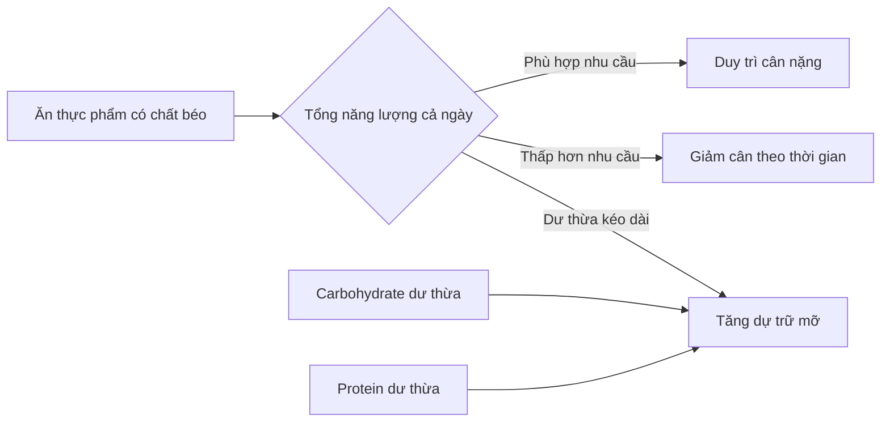
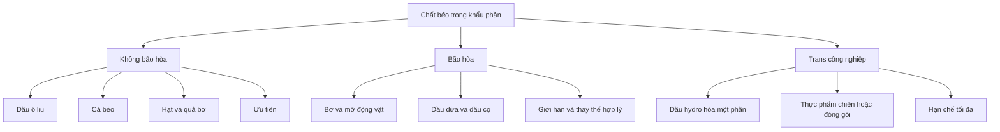

# 054 — Dieting Myth #2: Fat Is Bad For You

| Thuộc tính       | Nội dung                                  |
| ---------------- | ----------------------------------------- |
| **Module**       | Module 06 — Healthy Dieting               |
| **Bài học**      | Dieting Myth #2: Fat Is Bad For You       |
| **Thời lượng**   | 01:30                                     |
| **Chủ đề chính** | Lầm tưởng 2: Chất béo có hại cho sức khỏe |

> **Thông điệp cốt lõi:** Chất béo không tự động làm cơ thể tăng mỡ. Điều quan trọng là **tổng năng lượng**, **loại chất béo**, khẩu phần và toàn bộ chế độ ăn.


*Ảnh: Formulate Health, giấy phép [CC BY 2.0 — Wikimedia Commons](https://commons.wikimedia.org/wiki/File:Healthy_Fats_-_Avocado_and_Nuts_-_50191958402.jpg).*

## Mục lục

1. [Mục tiêu bài học](#1-mục-tiêu-bài-học)
2. [Nội dung chính](#2-nội-dung-chính)
3. [Áp dụng thực tế](#3-áp-dụng-thực-tế)
4. [Lưu ý & lỗi thường gặp](#4-lưu-ý--lỗi-thường-gặp)
5. [Checklist thực hành](#5-checklist-thực-hành)
6. [Tóm tắt](#6-tóm-tắt)

---

## 1. Mục tiêu bài học

Sau bài học này, người học có thể:

* Giải thích vì sao **ăn chất béo không đồng nghĩa với tăng mỡ cơ thể**.
* Nhận biết vai trò thiết yếu của chất béo đối với sức khỏe.
* Phân biệt chất béo **không bão hòa**, **bão hòa** và **trans**.
* Lựa chọn nguồn chất béo phù hợp trong chế độ ăn giảm cân hoặc duy trì cân nặng.
* Đọc nhãn dinh dưỡng thay vì chỉ tin vào dòng chữ “ít béo” trên bao bì.
* Hiểu và sửa những điểm chưa chính xác trong nội dung bài học gốc.

---

## 2. Nội dung chính

### 2.1. Lầm tưởng: “Ăn chất béo sẽ biến thành mỡ cơ thể”

Tên gọi giống nhau không có nghĩa rằng chất béo trong thực phẩm sẽ lập tức trở thành mỡ cơ thể.

Cơ thể tăng mỡ khi lượng năng lượng nạp vào thường xuyên cao hơn nhu cầu sử dụng trong thời gian dài. Phần năng lượng dư thừa có thể đến từ chất béo, carbohydrate, protein hoặc đồ uống có năng lượng. WHO cũng đặt nguyên tắc cân bằng năng lượng nạp vào với năng lượng tiêu hao trong nền tảng của chế độ ăn lành mạnh. ([World Health Organization][1])

Tuy nhiên, chất béo cung cấp khoảng **9 kcal mỗi gram**, trong khi protein và carbohydrate cung cấp khoảng **4 kcal mỗi gram**. Vì vậy, dầu ăn, bơ, các loại hạt và sốt béo rất dễ làm tổng calorie tăng nhanh nếu không chú ý khẩu phần. ([nhs.uk][2])



> **Kết luận:** Không phải riêng chất béo làm tăng cân. Vấn đề là **dư thừa năng lượng kéo dài**, trong khi chất béo có mật độ năng lượng cao nên cần kiểm soát khẩu phần.

---

### 2.2. Cơ thể cần chất béo để làm gì?

Loại bỏ hoàn toàn chất béo khỏi chế độ ăn không phải là lựa chọn tốt. Chất béo giúp:

* Cung cấp các acid béo thiết yếu mà cơ thể không tự tổng hợp đủ.
* Hỗ trợ hấp thu các vitamin tan trong chất béo như **A, D và E**.
* Tham gia cấu tạo màng tế bào.
* Hỗ trợ hoạt động của não và hệ thần kinh.
* Cung cấp năng lượng và giúp bữa ăn tạo cảm giác no.
* Tham gia vào nhiều quá trình tạo hormone và chất truyền tin sinh học. ([nhs.uk][2])

Hai nhóm acid béo thiết yếu cần được cung cấp qua thực phẩm là:

* **Omega-3**
* **Omega-6**

Phần lớn mọi người đã nhận khá nhiều omega-6 từ dầu thực vật và thực phẩm chế biến; vì vậy, thực hành có ích hơn thường là tăng nguồn omega-3 từ cá béo, hạt lanh, hạt chia hoặc quả óc chó thay vì cố bổ sung thật nhiều cả hai loại. ([nhs.uk][2])

---

### 2.3. Chế độ ăn rất ít chất béo và testosterone

Nội dung gốc cho rằng chế độ ăn ít chất béo có thể làm giảm testosterone. Nhận định này **có một phần bằng chứng**, nhưng không nên diễn đạt như một kết luận chắc chắn cho tất cả mọi người.

Một tổng quan hệ thống và phân tích gộp gồm sáu nghiên cứu can thiệp với tổng cộng 206 nam giới ghi nhận testosterone có xu hướng thấp hơn khi áp dụng chế độ ăn ít chất béo. Tuy nhiên, chính nhóm tác giả cũng nhấn mạnh rằng cần thêm các thử nghiệm ngẫu nhiên có đối chứng để xác nhận kết quả. ([PubMed][3])

Do đó:

* Không cần theo đuổi chế độ ăn **không chất béo**.
* Không nên tự ý ăn thật nhiều chất béo với mục tiêu “tăng testosterone”.
* Tổng năng lượng, giấc ngủ, cân nặng, vận động, bệnh lý và thuốc đang sử dụng cũng có thể ảnh hưởng đến hormone.

---

### 2.4. Không phải mọi loại chất béo đều giống nhau

| Loại chất béo         | Nguồn thực phẩm thường gặp                                              | Cách tiếp cận  |
| --------------------- | ----------------------------------------------------------------------- | -------------- |
| **Không bão hòa đơn** | Dầu ô liu, bơ, lạc, hạnh nhân                                           | Ưu tiên        |
| **Không bão hòa đa**  | Cá béo, óc chó, hạt chia, hạt lanh, dầu đậu nành                        | Ưu tiên        |
| **Bão hòa**           | Mỡ động vật, bơ, phô mai, thịt nhiều mỡ, dầu dừa, dầu cọ                | Giới hạn       |
| **Trans công nghiệp** | Dầu hydro hóa một phần, một số bánh đóng gói, đồ chiên và shortening cũ | Hạn chế tối đa |

American Heart Association khuyến nghị thay các nguồn chất béo bão hòa bằng dầu thực vật không bão hòa, cá, hạt và đậu. Việc thay thế này quan trọng hơn so với chỉ giảm chất béo mà không quan tâm thực phẩm nào sẽ được dùng để thay thế. ([www.heart.org][4])



---

### 2.5. Chất béo bão hòa có thật sự gây bệnh tim?

Nội dung gốc nói rằng không có bằng chứng chất béo bão hòa là “nguyên nhân trực tiếp” của vấn đề tim mạch. Cách diễn đạt này dễ khiến người học hiểu rằng chất béo bão hòa gần như vô hại.

Cách hiểu phù hợp hơn là:

1. Ăn nhiều chất béo bão hòa có thể làm tăng cholesterol LDL.
2. LDL cao là một yếu tố quan trọng làm tăng nguy cơ bệnh tim mạch.
3. Thay chất béo bão hòa bằng chất béo không bão hòa có thể cải thiện LDL và giảm nguy cơ tim mạch.
4. Hiệu quả phụ thuộc vào **thực phẩm dùng để thay thế**; thay mỡ bão hòa bằng đường hoặc tinh bột tinh chế không mang lại lợi ích tương đương. ([www.heart.org][4])

WHO và Hướng dẫn Dinh dưỡng Hoa Kỳ 2025–2030 đều đưa ra mốc chung là chất béo bão hòa không nên vượt quá khoảng **10% tổng năng lượng hằng ngày**. Với người cần giảm LDL mạnh hơn, AHA đưa ra mục tiêu chặt hơn, dưới khoảng **6% tổng calorie**. ([Real Food][5])

---

### 2.6. Đính chính: dầu dừa không phải lựa chọn ưu tiên cho tim mạch

Bài học gốc gọi dầu dừa là một nguồn “chất béo bão hòa chất lượng”. Đây là cách phân loại không còn phù hợp.

Dầu dừa chứa nhiều chất béo bão hòa và có thể làm tăng LDL. Cả NHS và AHA đều liệt kê dầu dừa trong nhóm nguồn chất béo bão hòa cần hạn chế. Khi dùng dầu thường xuyên, dầu ô liu, dầu cải, dầu đậu nành và các dầu thực vật không nhiệt đới thường là lựa chọn phù hợp hơn. ([nhs.uk][2])

Điều này không có nghĩa là phải cấm hoàn toàn dầu dừa. Có thể sử dụng một lượng nhỏ vì hương vị trong một số món ăn, nhưng không nên xem nó là dầu nền tốt nhất để dùng nhiều mỗi ngày.

---

### 2.7. Chất béo trans là loại cần đặc biệt tránh

Chất béo trans công nghiệp thường xuất hiện khi dầu thực vật được hydro hóa một phần nhằm kéo dài thời hạn bảo quản hoặc tạo kết cấu đặc.

Loại chất béo này có thể:

* Làm tăng cholesterol LDL.
* Có thể làm giảm cholesterol HDL.
* Liên quan nhất quán với nguy cơ bệnh tim cao hơn. ([www.heart.org][6])

WHO khuyến nghị chuyển khẩu phần khỏi chất béo bão hòa và trans sang chất béo không bão hòa, đồng thời loại bỏ chất béo trans công nghiệp khỏi chuỗi thực phẩm. ([World Health Organization][1])

> Không nên dùng câu “một ít sẽ không giết bạn” làm nguyên tắc dinh dưỡng. Một lần ăn nhầm lượng nhỏ không phải lý do để hoảng sợ, nhưng mục tiêu thực tế vẫn là **giảm tối đa nguồn trans công nghiệp**.

---

### 2.8. Sản phẩm “ít béo” chưa chắc ít calorie

Khi giảm chất béo, nhà sản xuất có thể thêm đường, tinh bột, chất làm đặc hoặc các thành phần khác để duy trì hương vị và kết cấu. Vì thế:

* Sản phẩm “low fat” có thể ít chất béo hơn bản thường.
* Nhưng sản phẩm đó chưa chắc ít calorie hơn đáng kể.
* Một số sản phẩm vẫn chứa nhiều đường bổ sung.
* Khẩu phần ghi trên bao bì có thể nhỏ hơn lượng người dùng thực sự ăn.

NHS lưu ý rằng thực phẩm ít béo không nhất thiết có ít calorie vì chất béo đôi khi được thay bằng đường, khiến tổng năng lượng gần tương đương sản phẩm thông thường. ([nhs.uk][2])

---

## 3. Áp dụng thực tế

### 3.1. Ưu tiên nguồn chất béo từ thực phẩm ít chế biến

| Nhóm                                  | Gợi ý thực phẩm                                                                  |
| ------------------------------------- | -------------------------------------------------------------------------------- |
| **Omega-3 từ biển**                   | Cá hồi, cá mòi, cá trích, cá thu                                                 |
| **Omega-3 thực vật**                  | Hạt chia, hạt lanh, quả óc chó                                                   |
| **Chất béo không bão hòa đơn**        | Dầu ô liu, quả bơ, lạc, hạnh nhân                                                |
| **Nguồn kết hợp protein và chất béo** | Trứng, cá, đậu phụ, các loại hạt                                                 |
| **Nên hạn chế**                       | Thịt nhiều mỡ, da gia cầm, bơ động vật, dầu dừa, dầu cọ                          |
| **Nên tránh thường xuyên**            | Dầu hydro hóa một phần, đồ chiên đi chiên lại, bánh công nghiệp nhiều shortening |

---

### 3.2. Thay thế thay vì chỉ cắt bỏ

| Thay vì                    | Có thể chọn                                       |
| -------------------------- | ------------------------------------------------- |
| Chiên ngập dầu             | Nướng, áp chảo hoặc dùng nồi chiên không dầu      |
| Bơ động vật dùng hằng ngày | Dầu ô liu hoặc dầu cải                            |
| Thịt nhiều mỡ              | Cá, thịt nạc, đậu phụ hoặc các loại đậu           |
| Sốt kem đặc                | Sữa chua không đường, sốt cà chua hoặc sốt từ hạt |
| Bánh ngọt đóng gói         | Trái cây kết hợp một lượng nhỏ hạt                |
| Snack chiên                | Hạt không muối với khẩu phần phù hợp              |

---

### 3.3. Kiểm soát khẩu phần nguồn chất béo lành mạnh

Thực phẩm giàu chất béo không bão hòa vẫn chứa nhiều năng lượng. “Lành mạnh” không đồng nghĩa với “ăn không giới hạn”.

Ví dụ về khẩu phần thực tế:

* Một nắm nhỏ các loại hạt.
* Một đến hai thìa cà phê dầu cho một phần ăn.
* Một phần cá béo trong bữa chính.
* Một phần tư đến một nửa quả bơ tùy tổng nhu cầu năng lượng.

---

### 3.4. Cách đọc nhãn dinh dưỡng

Khi mua thực phẩm đóng gói, hãy kiểm tra theo thứ tự:

1. **Khẩu phần:** Gói có bao nhiêu khẩu phần?
2. **Calorie:** Số calorie được tính cho một khẩu phần hay cả gói?
3. **Chất béo bão hòa:** So sánh giữa các sản phẩm cùng loại.
4. **Chất béo trans:** Ưu tiên mức thấp nhất có thể.
5. **Danh sách nguyên liệu:** Tìm cụm từ `partially hydrogenated oil` hoặc “dầu hydro hóa một phần”.
6. **Đường bổ sung:** Kiểm tra xem chất béo có bị thay bằng nhiều đường hay không.

AHA lưu ý rằng tại một số thị trường, nhãn có thể ghi “0 g trans fat” khi mỗi khẩu phần vẫn chứa một lượng nhỏ; vì vậy cần xem cả danh sách nguyên liệu và số khẩu phần thực sự tiêu thụ. ([www.heart.org][7])

---

### 3.5. Quy tắc lựa chọn nhanh

```text
Ưu tiên chất béo không bão hòa
        ↓
Giữ khẩu phần phù hợp tổng calorie
        ↓
Giới hạn chất béo bão hòa
        ↓
Hạn chế tối đa trans công nghiệp
        ↓
Đánh giá toàn bộ chế độ ăn, không chỉ một món
```

---

## 4. Lưu ý & lỗi thường gặp

### Lỗi 1: Loại bỏ hoàn toàn chất béo

Điều này có thể khiến khẩu phần thiếu acid béo thiết yếu, giảm khả năng hấp thu vitamin tan trong chất béo và làm chế độ ăn khó duy trì. ([nhs.uk][2])

**Cách sửa:** Giữ một lượng hợp lý từ cá, dầu thực vật, quả bơ, hạt và các thực phẩm nguyên bản.

---

### Lỗi 2: Nghĩ rằng mọi loại chất béo đều giống nhau

100 kcal từ dầu ô liu và 100 kcal từ thực phẩm chứa dầu hydro hóa có thể giống nhau về năng lượng, nhưng không giống nhau về thành phần acid béo và ảnh hưởng đến lipid máu.

**Cách sửa:** Xem cả **calorie** và **chất lượng nguồn chất béo**.

---

### Lỗi 3: Ăn quá nhiều hạt hoặc bơ vì “đó là chất béo tốt”

Chất béo không bão hòa tốt hơn cho sức khỏe tim mạch, nhưng vẫn có mật độ năng lượng cao.

**Cách sửa:** Chia sẵn khẩu phần thay vì ăn trực tiếp từ túi lớn.

---

### Lỗi 4: Cho rằng dầu dừa có thể dùng tự do

Dầu dừa vẫn là nguồn chất béo bão hòa cao và không nên thay thế hoàn toàn các dầu không bão hòa. ([www.heart.org][4])

---

### Lỗi 5: Chỉ nhìn dòng chữ “low fat”

Sản phẩm ít béo có thể chứa nhiều đường hoặc có tổng calorie gần giống sản phẩm thường. ([nhs.uk][2])

**Cách sửa:** So sánh nhãn trên cùng một khối lượng hoặc cùng một khẩu phần.

---

### Lỗi 6: Thay chất béo bão hòa bằng đường và tinh bột tinh chế

Chỉ giảm bơ hoặc mỡ nhưng tăng bánh kẹo, nước ngọt và bánh mì tinh chế không tạo ra một chế độ ăn tốt hơn.

**Cách sửa:** Thay bằng dầu không bão hòa, cá, đậu, hạt và thực phẩm giàu chất xơ.

---

### Lỗi 7: Ám ảnh vì đã ăn một bữa nhiều chất béo

Sức khỏe được quyết định chủ yếu bởi thói quen lặp lại trong nhiều tuần, nhiều tháng và nhiều năm, không phải một bữa ăn riêng lẻ.

**Cách sửa:** Quay lại kế hoạch bình thường ở bữa tiếp theo, không nhịn đói hoặc tập luyện bù quá mức.

---

## 5. Checklist thực hành

* [ ] Tôi hiểu rằng ăn chất béo không tự động làm tăng mỡ cơ thể.
* [ ] Tôi kiểm soát tổng năng lượng và khẩu phần.
* [ ] Tôi ưu tiên dầu ô liu, cá, quả bơ, hạt và các loại đậu.
* [ ] Tôi có nguồn omega-3 phù hợp trong khẩu phần.
* [ ] Tôi không loại bỏ hoàn toàn chất béo.
* [ ] Tôi giới hạn bơ, mỡ động vật, thịt nhiều mỡ, dầu dừa và dầu cọ.
* [ ] Tôi hạn chế tối đa dầu hydro hóa một phần và trans công nghiệp.
* [ ] Tôi đọc cả calorie, khẩu phần, chất béo bão hòa và đường bổ sung.
* [ ] Tôi không mặc định sản phẩm “ít béo” là sản phẩm giảm cân.
* [ ] Tôi đánh giá toàn bộ chế độ ăn thay vì phán xét một thực phẩm riêng lẻ.

---

## 6. Tóm tắt

* **Chất béo không phải kẻ thù.** Tăng mỡ cơ thể chủ yếu xảy ra khi năng lượng nạp vào vượt nhu cầu trong thời gian dài.
* Cơ thể cần chất béo để hấp thu vitamin tan trong chất béo và nhận các acid béo thiết yếu.
* Nên ưu tiên chất béo không bão hòa từ cá, dầu ô liu, quả bơ, hạt và các loại đậu.
* Chất béo bão hòa có thể làm tăng LDL; nên giới hạn và thay một phần bằng chất béo không bão hòa.
* Dầu dừa là nguồn giàu chất béo bão hòa, không phải lựa chọn dầu ăn ưu tiên cho sức khỏe tim mạch.
* Chất béo trans công nghiệp là loại cần hạn chế tối đa.
* Sản phẩm “low fat” chưa chắc ít calorie hoặc ít đường.
* Sức khỏe phụ thuộc vào **toàn bộ chế độ ăn, khẩu phần và thói quen dài hạn**, không phải việc một thực phẩm có chứa chất béo hay không.

> **Ghi nhớ:** Đừng hỏi “chất béo tốt hay xấu?” Hãy hỏi: **đây là loại chất béo nào, đến từ thực phẩm gì, với khẩu phần bao nhiêu và thay thế cho thứ gì?**

---

## Infographic và nghiên cứu tham khảo

### Infographic

* [The Facts on Fat — American Heart Association, PDF](https://www.heart.org/-/media/AHA/H4GM/PDF-Files/FatsInfographic_EatSmart.pdf)
* [Trang giải thích infographic — American Heart Association](https://www.heart.org/en/healthy-living/healthy-eating/eat-smart/fats/the-facts-on-fats)

Infographic của AHA phân nhóm thành: ưu tiên chất béo không bão hòa, giới hạn chất béo bão hòa và hạn chế chất béo trans/hydro hóa. ([www.heart.org][8])

### Nghiên cứu và hướng dẫn

1. [WHO guideline: Saturated fatty acid and trans-fatty acid intake](https://www.who.int/publications/i/item/9789240073630) ([World Health Organization][9])
2. [American Heart Association: Saturated Fats](https://www.heart.org/en/healthy-living/healthy-eating/eat-smart/fats/saturated-fats) ([www.heart.org][4])
3. [NHS: Fat — the facts](https://www.nhs.uk/live-well/eat-well/food-types/different-fats-nutrition/) ([nhs.uk][2])
4. [Low-fat diets and testosterone in men — PubMed](https://pubmed.ncbi.nlm.nih.gov/33741447/) ([PubMed][3])
5. [Dietary Guidelines for Americans 2025–2030, PDF](https://cdn.realfood.gov/DGA.pdf)

[1]: https://www.who.int/health-topics/healthy-diet "Healthy diet"
[2]: https://www.nhs.uk/live-well/eat-well/food-types/different-fats-nutrition/ "www.nhs.uk"
[3]: https://pubmed.ncbi.nlm.nih.gov/33741447/?utm_source=chatgpt.com "Low-fat diets and testosterone in men: Systematic review ..."
[4]: https://www.heart.org/en/healthy-living/healthy-eating/eat-smart/fats/saturated-fats "Saturated Fats | American Heart Association"
[5]: https://cdn.realfood.gov/DGA.pdf "Dietary Guidelines for Americans, 2025–2030"
[6]: https://www.heart.org/en/healthy-living/healthy-eating/eat-smart/fats/the-facts-on-fats "The Facts on Fats Infographic | American Heart Association"
[7]: https://www.heart.org/en/healthy-living/healthy-eating/eat-smart/nutrition-basics/understanding-food-nutrition-labels "Understanding Food Nutrition Labels | American Heart Association"
[8]: https://www.heart.org/-/media/AHA/H4GM/PDF-Files/FatsInfographic_EatSmart.pdf?sc_lang=en "The Facts on Fat"
[9]: https://www.who.int/publications/i/item/9789240073630 "Saturated fatty acid and trans-fatty acid intake for adults and children: WHO guideline"

---

# Bài luyện tập

## Mục tiêu


## Đề bài


## Yêu cầu hoàn thành

- [ ] 
- [ ] 
- [ ] 

## Kết quả / lời giải


## Ghi chú
