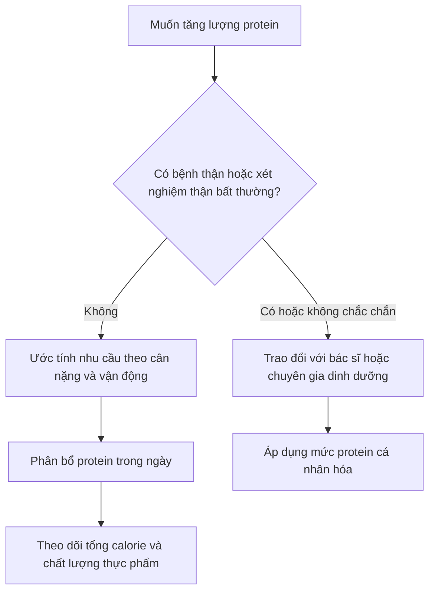

# 055 — Dieting Myth #3: Protein Is Bad For You

| Thuộc tính       | Nội dung                                 |
| ---------------- | ---------------------------------------- |
| **Module**       | Module 06 — Healthy Dieting              |
| **Bài học**      | Dieting Myth #3: Protein Is Bad For You  |
| **Thời lượng**   | 03:41                                    |
| **Chủ đề chính** | Lầm tưởng 3: Protein có hại cho sức khỏe |

> **Kết luận chính:** Với người trưởng thành khỏe mạnh, lượng protein phù hợp với nhu cầu — kể cả cao hơn mức tối thiểu ở người thường xuyên tập luyện — chưa được chứng minh là gây suy thận hoặc làm yếu xương. Tuy nhiên, người đã mắc bệnh thận cần áp dụng mức protein riêng theo hướng dẫn của bác sĩ hoặc chuyên gia dinh dưỡng.

## Mục lục

1. [Mục tiêu bài học](#1-mục-tiêu-bài-học)
2. [Nội dung chính](#2-nội-dung-chính)
3. [Áp dụng thực tế](#3-áp-dụng-thực-tế)
4. [Lưu ý & lỗi thường gặp](#4-lưu-ý--lỗi-thường-gặp)
5. [Checklist thực hành](#5-checklist-thực-hành)
6. [Tóm tắt](#6-tóm-tắt)

---

## 1. Mục tiêu bài học

Sau bài học này, người học có thể:

* Phân biệt ảnh hưởng của chế độ ăn giàu protein ở **người khỏe mạnh** và **người mắc bệnh thận**.
* Giải thích vì sao protein không tự động gây suy thận hoặc loãng xương.
* Hiểu vai trò khác nhau của protein từ thực phẩm nguyên bản và bột protein.
* Ước tính lượng protein phù hợp dựa trên cân nặng và mức độ vận động.
* Tránh quan niệm sai rằng “càng nhiều protein càng tốt”.

---

## 2. Nội dung chính

### 2.1. Protein có vai trò gì?

Protein được cấu tạo từ các amino acid và tham gia vào nhiều chức năng quan trọng:

* Xây dựng và sửa chữa cơ bắp cùng các mô cơ thể.
* Tạo enzyme, hormone và một số chất dẫn truyền.
* Hỗ trợ hệ miễn dịch.
* Duy trì khối cơ khi giảm calorie.
* Hỗ trợ phục hồi và thích nghi sau tập luyện.

Đối với người tập thể thao, tập kháng lực và cung cấp đủ protein có tác dụng bổ trợ lẫn nhau trong việc kích thích tổng hợp protein cơ.

*Hình 1. Một số nguồn protein từ động vật và thực vật. Ảnh: Smastronardo, giấy phép CC BY-SA 4.0.*

---

### 2.2. Lầm tưởng: Ăn nhiều protein sẽ gây suy thận

#### Protein và hoạt động của thận

Khi cơ thể chuyển hóa protein, một số sản phẩm chứa nitơ được tạo ra và phải được thận xử lý. Vì vậy, ăn nhiều protein có thể làm tăng tạm thời lưu lượng máu và mức lọc của thận.

Tuy nhiên, **thận phải làm việc nhiều hơn không đồng nghĩa với thận đang bị tổn thương**. Đây có thể là phản ứng thích nghi sinh lý, tương tự việc tim đập nhanh hơn khi vận động.

*Hình 2. Thận và nephron — đơn vị chức năng đảm nhiệm quá trình lọc máu.*

#### Bằng chứng ở người khỏe mạnh

Một phân tích tổng hợp gồm 28 nghiên cứu và 1.358 người trưởng thành không mắc bệnh thận so sánh chế độ ăn giàu protein với chế độ protein bình thường hoặc thấp hơn. Kết quả cho thấy mức thay đổi độ lọc cầu thận không khác biệt đáng kể giữa hai nhóm và không tìm thấy ảnh hưởng bất lợi rõ ràng lên chức năng thận.

Một phân tích tổng hợp công bố năm 2026 cũng ghi nhận chế độ ăn giàu protein có thể làm eGFR tăng nhẹ nhưng không làm thay đổi đáng kể creatinine huyết thanh hoặc tạo ra bằng chứng sinh hóa nhất quán về tổn thương thận ở người không mắc bệnh thận mạn. Tuy nhiên, phần lớn thử nghiệm có thời gian tương đối ngắn, vì vậy ảnh hưởng của lượng protein cực cao trong nhiều năm vẫn chưa được xác định đầy đủ.

Do đó, câu nói trong bài gốc rằng các nghiên cứu ở người “luôn cho thấy hoàn toàn không có vấn đề” là quá tuyệt đối. Cách diễn đạt chính xác hơn là:

> **Trong phạm vi liều lượng và thời gian đã được nghiên cứu, chưa có bằng chứng đáng tin cậy cho thấy chế độ ăn giàu protein gây tổn thương thận ở người trưởng thành khỏe mạnh. Dữ liệu dài hạn về lượng protein cực cao vẫn còn hạn chế.**

#### Trường hợp đã mắc bệnh thận

Kết luận trên **không áp dụng trực tiếp cho người mắc bệnh thận mạn**. Khi chức năng thận đã suy giảm, lượng chất thải từ chuyển hóa protein có thể tích tụ và việc điều chỉnh protein trở thành một phần của điều trị.

Theo National Kidney Foundation:

* Người mắc bệnh thận mạn nhưng chưa lọc máu thường có thể được yêu cầu hạn chế protein.
* Người đang lọc máu lại có thể cần nhiều protein hơn vì quá trình lọc máu làm mất một phần protein.
* Mức cụ thể phải được xác định dựa trên giai đoạn bệnh, xét nghiệm và phương pháp điều trị.

---

### 2.3. Lầm tưởng: Protein làm mất calcium và gây loãng xương

#### Nguồn gốc của giả thuyết

Một số nghiên cứu trước đây nhận thấy chế độ ăn nhiều protein có thể làm tăng độ acid và lượng calcium trong nước tiểu. Từ đó xuất hiện giả thuyết rằng cơ thể phải rút calcium từ xương để trung hòa acid.

Tuy nhiên, lượng calcium tăng trong nước tiểu không nhất thiết đến từ sự phân hủy xương. Một phần có thể bắt nguồn từ việc cơ thể hấp thu nhiều calcium hơn ở ruột.

#### Nghiên cứu hiện đại nói gì?

Phân tích tổng hợp của National Osteoporosis Foundation không tìm thấy tác động bất lợi của lượng protein cao hơn đối với sức khỏe xương. Nghiên cứu ghi nhận xu hướng tích cực tại một số vị trí đo mật độ xương, nhưng cũng nhấn mạnh rằng cần thêm nghiên cứu dài hạn chất lượng cao.

Một số tổng quan khác cho thấy lượng protein cao hơn mức tối thiểu có thể hỗ trợ duy trì mật độ xương và giảm nguy cơ gãy xương hông ở người lớn tuổi, đặc biệt khi khẩu phần có đủ calcium, vitamin D và tổng năng lượng.

Protein cũng là thành phần của nền hữu cơ trong xương và hỗ trợ duy trì cơ bắp. Cơ bắp khỏe hơn giúp cải thiện thăng bằng, khả năng vận động và giảm nguy cơ té ngã ở người cao tuổi.

*Hình 3. Xương liên tục trải qua quá trình tái cấu trúc: mô cũ được loại bỏ và mô mới được hình thành. Hình được phát hành theo giấy phép CC0.*

> **Protein không phải yếu tố duy nhất quyết định sức khỏe xương.** Calcium, vitamin D, hoạt động chịu tải, tập kháng lực, hormone, tuổi tác và tình trạng sức khỏe tổng thể đều có vai trò quan trọng.

---

### 2.4. Protein động vật có phải lúc nào cũng tốt hơn protein thực vật?

Protein động vật như trứng, sữa, cá, thịt và gia cầm thường cung cấp đủ chín amino acid thiết yếu với khả năng tiêu hóa cao. Tuy nhiên, điều đó không có nghĩa chế độ ăn thực vật không thể đáp ứng nhu cầu protein.

Một số nguồn thực vật có chất lượng protein tốt gồm:

* Đậu nành, đậu phụ và tempeh.
* Đậu lăng, đậu Hà Lan và các loại đậu.
* Hạt, quả hạch và ngũ cốc nguyên hạt.
* Seitan, quinoa và các sản phẩm protein thực vật cô đặc.

Một chế độ ăn thực vật đa dạng có thể cung cấp đủ amino acid thiết yếu. Không bắt buộc phải kết hợp các loại protein bổ sung trong cùng một bữa; điều quan trọng hơn là ăn đa dạng trong cả ngày. National Kidney Foundation cũng lưu ý khẩu phần thực vật được lập kế hoạch hợp lý có thể đáp ứng nhu cầu protein.

Nghiên cứu so sánh bổ sung whey và protein đậu nành trong tập kháng lực cho thấy cả hai đều có thể hỗ trợ tăng sức mạnh và khối nạc, không ghi nhận khác biệt đáng kể giữa hai nguồn trong phân tích tổng hợp được khảo sát.

---

### 2.5. Protein shake có hại không?

Bột protein không phải thuốc tăng cơ và cũng không phải thành phần bắt buộc của chế độ ăn. Nó đơn giản là một phương tiện thuận tiện để bổ sung protein.

#### Protein shake có thể hữu ích khi:

* Không có thời gian chuẩn bị một bữa ăn.
* Khó đạt nhu cầu protein chỉ từ thực phẩm.
* Cần một lựa chọn nhẹ, dễ sử dụng sau tập.
* Ăn chay hoặc thuần chay và muốn tăng mật độ protein.
* Đang giảm calorie nhưng vẫn cần duy trì lượng protein tương đối cao.

#### Protein shake không vượt trội hơn thực phẩm nếu:

* Tổng lượng protein trong ngày đã đầy đủ.
* Người dùng vẫn có thể ăn một bữa cân bằng.
* Sản phẩm chứa nhiều đường, chất béo hoặc calorie ngoài dự kiến.
* Shake thay thế quá nhiều thực phẩm giàu vitamin, khoáng chất và chất xơ.

ISSN khuyến nghị phần lớn protein nên đến từ thực phẩm, nhưng protein bổ sung là một cách an toàn và thuận tiện để đạt nhu cầu ở người khỏe mạnh, tập luyện thường xuyên.

#### Cần sửa một điểm trong nội dung bài gốc

Bài gốc cho rằng gần như chỉ protein supplement mới có thể cung cấp protein mà không làm tăng nhiều chất béo và calorie. Điều này chưa chính xác.

Nhiều thực phẩm nguyên bản cũng có tỷ lệ protein trên calorie cao:

| Thực phẩm                    | Đặc điểm                                 |
| ---------------------------- | ---------------------------------------- |
| Lòng trắng trứng             | Nhiều protein, gần như không có chất béo |
| Cá trắng, tôm                | Protein cao, tương đối ít calorie        |
| Ức gà bỏ da                  | Ít chất béo hơn nhiều phần thịt khác     |
| Sữa chua Hy Lạp ít béo       | Protein cao, dễ sử dụng                  |
| Phô mai cottage ít béo       | Protein cao, no lâu                      |
| Đậu phụ và sản phẩm đậu nành | Nguồn protein thực vật linh hoạt         |
| Cá ngừ ngâm nước             | Tiện lợi và ít chất béo                  |

Chất béo bão hòa và cholesterol phụ thuộc vào **loại thực phẩm, phần thịt và cách chế biến**, không phải đặc điểm bắt buộc của mọi thực phẩm giàu protein.

---

### 2.6. Ăn bao nhiêu protein là hợp lý?

| Đối tượng                         |                                                  Mức tham khảo |
| --------------------------------- | -------------------------------------------------------------: |
| Người trưởng thành ít vận động    | Khoảng **0,8 g/kg/ngày** là mức khuyến nghị tối thiểu phổ biến |
| Người tập luyện thường xuyên      |                                   Khoảng **1,4–2,0 g/kg/ngày** |
| Một khẩu phần cho người tập       |                  Khoảng **0,25 g/kg** hoặc **20–40 g protein** |
| Người giảm calorie và muốn giữ cơ |                Có thể cần gần phía trên của khoảng khuyến nghị |
| Người mắc bệnh thận               |        Không tự áp dụng các mức trên; cần chỉ định cá nhân hóa |

Các mức dành cho người tập được ISSN tổng hợp từ nghiên cứu trên người trưởng thành khỏe mạnh. Nhu cầu thực tế còn phụ thuộc tuổi, tổng năng lượng, cường độ vận động, mục tiêu và tình trạng sức khỏe.

#### Ví dụ với người nặng 70 kg

* Mức tối thiểu `0,8 × 70` = **56 g/ngày**.
* Người tập thường xuyên: `1,4 × 70` đến `2,0 × 70` = **98–140 g/ngày**.
* Có thể chia thành bốn bữa, mỗi bữa khoảng **25–35 g protein**.

Không nhất thiết phải ăn chính xác từng gram mỗi ngày. Trung bình trong nhiều ngày và tính nhất quán lâu dài quan trọng hơn một bữa ăn riêng lẻ.

Một phân tích tổng hợp về tập kháng lực cho thấy lợi ích tăng thêm đối với khối nạc có xu hướng giảm rõ rệt khi tổng lượng protein đã đạt khoảng 1,6 g/kg/ngày ở phần lớn người tập, vì vậy ăn nhiều hơn không đảm bảo cơ bắp sẽ tăng nhanh hơn.

---

## 3. Áp dụng thực tế

### Bước 1: Xác định nhóm của bản thân

* Ít vận động.
* Tập thể thao hoặc tập gym thường xuyên.
* Đang giảm mỡ và muốn giữ cơ.
* Có bệnh nền hoặc xét nghiệm thận bất thường.

### Bước 2: Đặt một khoảng mục tiêu

Ví dụ, người khỏe mạnh nặng 70 kg và tập kháng lực có thể bắt đầu trong khoảng 100–120 g protein mỗi ngày thay vì lập tức chọn mức cực cao.

### Bước 3: Chia protein qua các bữa

Ví dụ:

| Bữa ăn             | Protein dự kiến |
| ------------------ | --------------: |
| Bữa sáng           |            25 g |
| Bữa trưa           |            30 g |
| Bữa phụ hoặc shake |         20–25 g |
| Bữa tối            |         30–35 g |
| **Tổng**           |   **105–115 g** |

Phân bổ tương đối đều trong ngày có thể thuận lợi hơn cho việc kích thích tổng hợp protein cơ so với dồn phần lớn protein vào một bữa duy nhất. ISSN thường đề xuất các khẩu phần cách nhau khoảng 3–4 giờ cho người tập.

### Bước 4: Ưu tiên sự đa dạng

Một ngày có thể kết hợp:

* Trứng hoặc sữa chua vào buổi sáng.
* Thịt nạc, cá, đậu phụ hoặc đậu vào bữa chính.
* Đậu, hạt và ngũ cốc nguyên hạt.
* Protein shake khi cần sự tiện lợi.

### Bước 5: Đánh giá toàn bộ chế độ ăn

Một chế độ ăn giàu protein vẫn có thể thiếu lành mạnh nếu:

* Quá ít rau, trái cây hoặc chất xơ.
* Chủ yếu sử dụng thịt chế biến sẵn.
* Tổng calorie vượt nhu cầu quá nhiều.
* Hầu hết protein đến từ đồ uống thay vì bữa ăn cân bằng.

---

## 4. Lưu ý & lỗi thường gặp

### Lỗi 1: Cho rằng protein gây suy thận ở tất cả mọi người

Bằng chứng ở người khỏe mạnh và người đã mắc bệnh thận không thể được đánh đồng. Tình trạng thận ban đầu là yếu tố quyết định quan trọng.

### Lỗi 2: Coi eGFR tăng là bằng chứng chắc chắn của tổn thương

Chế độ ăn giàu protein có thể làm eGFR tăng do thay đổi huyết động học. Điều này cần được diễn giải cùng creatinine, albumin niệu, bệnh sử và các chỉ số khác, thay vì kết luận chỉ từ một con số.

### Lỗi 3: Cho rằng càng nhiều protein càng tăng cơ nhanh

Khi tổng protein đã đủ, tăng thêm protein thường mang lại lợi ích giảm dần. Tập luyện, giấc ngủ, tổng calorie và chương trình phục hồi vẫn là các yếu tố thiết yếu.

### Lỗi 4: Phụ thuộc hoàn toàn vào protein shake

Bột protein không cung cấp đầy đủ chất xơ và hệ vi chất giống một chế độ ăn đa dạng. Shake nên bổ sung cho khẩu phần, không nên trở thành toàn bộ khẩu phần.

### Lỗi 5: Tin rằng protein thực vật luôn “không hoàn chỉnh”

Chất lượng và hàm lượng amino acid khác nhau giữa các nguồn thực vật, nhưng một khẩu phần đa dạng hoàn toàn có thể đáp ứng nhu cầu protein.

### Lỗi 6: Tự áp dụng chế độ protein cao khi có bệnh nền

Nên trao đổi với bác sĩ hoặc chuyên gia dinh dưỡng nếu có:

* Bệnh thận hoặc tiền sử sỏi thận tái phát.
* Protein hoặc máu trong nước tiểu.
* eGFR thấp hoặc creatinine bất thường.
* Đái tháo đường kèm biến chứng thận.
* Bệnh gan nặng hoặc rối loạn chuyển hóa đặc biệt.

---

## 5. Checklist thực hành

* [ ] Tôi đã xác định mục tiêu protein theo cân nặng và mức vận động.
* [ ] Tôi không mặc định rằng càng nhiều protein càng tốt.
* [ ] Tôi chia protein vào nhiều bữa trong ngày.
* [ ] Phần lớn protein đến từ thực phẩm đa dạng.
* [ ] Tôi sử dụng protein shake vì sự tiện lợi, không phải vì cho rằng nó bắt buộc.
* [ ] Tôi vẫn ăn đủ rau, trái cây, ngũ cốc và chất béo có lợi.
* [ ] Tôi kiểm tra cả calorie, đường và chất béo trong sản phẩm protein.
* [ ] Tôi không tự áp dụng chế độ protein cao khi có bệnh thận.
* [ ] Tôi theo dõi sức khỏe và xét nghiệm theo chỉ định nếu có bệnh nền.

---

## 6. Tóm tắt

* Protein là dưỡng chất thiết yếu cho cơ, mô, enzyme, hormone và hệ miễn dịch.
* Ở người trưởng thành khỏe mạnh, các nghiên cứu hiện tại chưa cho thấy lượng protein cao hợp lý gây tổn thương thận.
* Dữ liệu dài hạn về mức protein cực cao vẫn hạn chế, vì vậy không nên diễn giải rằng protein có thể được ăn không giới hạn.
* Người đã mắc bệnh thận có thể cần hạn chế hoặc điều chỉnh protein tùy giai đoạn và phương pháp điều trị.
* Protein không được chứng minh là làm yếu xương; khi calcium và năng lượng đầy đủ, nó có thể hỗ trợ cơ và xương, đặc biệt ở người lớn tuổi.
* Thực phẩm nguyên bản nên là nguồn protein chính, nhưng protein powder có thể là công cụ thuận tiện.
* Protein động vật không phải lựa chọn duy nhất; chế độ ăn thực vật đa dạng vẫn có thể đáp ứng nhu cầu.
* Mục tiêu không phải là ăn **nhiều protein nhất**, mà là ăn **đủ protein trong một chế độ ăn cân bằng**.

> **Thông điệp cuối cùng:** Protein không phải kẻ thù của sức khỏe. Rủi ro phụ thuộc vào tình trạng sức khỏe ban đầu, tổng liều lượng, nguồn thực phẩm và chất lượng của toàn bộ chế độ ăn.

---

# Bài luyện tập

## Mục tiêu

## Đề bài

## Yêu cầu hoàn thành

- [ ] 
- [ ] 
- [ ] 

## Kết quả / lời giải

## Ghi chú
