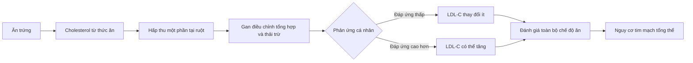

# 056 — Dieting Myth #4: Eating Eggs Raises Cholesterol

| Thuộc tính        | Nội dung                                                                                                                                                                       |
| ----------------- | ------------------------------------------------------------------------------------------------------------------------------------------------------------------------------ |
| **Module**        | Module 06 — Healthy Dieting                                                                                                                                                    |
| **Bài học**       | Dieting Myth #4: Eating Eggs Raises Cholesterol                                                                                                                                |
| **Thời lượng**    | 01:17                                                                                                                                                                          |
| **Chủ đề chính**  | Lầm tưởng 4: Ăn trứng làm tăng cholesterol                                                                                                                                     |
| **Kết luận ngắn** | Trứng không cần bị loại bỏ khỏi chế độ ăn của đa số người khỏe mạnh, nhưng cũng không nên kết luận rằng ăn bao nhiêu trứng cũng hoàn toàn không ảnh hưởng đến cholesterol máu. |

> [!IMPORTANT]
> **Cách diễn đạt chính xác hơn:** cholesterol trong thức ăn không chuyển thành cholesterol máu theo tỷ lệ 1:1. Tuy nhiên, ăn nhiều cholesterol từ thực phẩm vẫn có thể làm LDL-C tăng nhẹ ở một số người. Điều quan trọng là lượng ăn, cơ địa, mức LDL ban đầu và toàn bộ chế độ ăn.


*Ảnh minh họa bữa sáng gồm trứng, ngũ cốc nguyên hạt, rau và các nhóm thực phẩm khác; ảnh của USDA, thuộc phạm vi công cộng.* ([Wikimedia Commons][1])

## Mục lục

1. [Mục tiêu bài học](#1-mục-tiêu-bài-học)
2. [Nội dung chính](#2-nội-dung-chính)
3. [Áp dụng thực tế](#3-áp-dụng-thực-tế)
4. [Lưu ý & lỗi thường gặp](#4-lưu-ý--lỗi-thường-gặp)
5. [Checklist thực hành](#5-checklist-thực-hành)
6. [Tóm tắt](#6-tóm-tắt)

---

## 1. Mục tiêu bài học

Sau bài học này, người học có thể:

* Phân biệt **cholesterol trong thực phẩm** với **cholesterol lưu thông trong máu**.
* Hiểu vì sao ăn trứng không đồng nghĩa với việc cholesterol máu sẽ tăng tương ứng.
* Nhận biết điểm chưa chính xác trong nhận định “ăn nhiều trứng hoàn toàn không ảnh hưởng đến lipid máu”.
* Biết lượng trứng tham khảo phù hợp cho người khỏe mạnh.
* Biết những trường hợp cần cá nhân hóa lượng lòng đỏ và theo dõi xét nghiệm lipid máu.
* Lựa chọn cách chế biến và thực phẩm ăn kèm có lợi hơn cho sức khỏe tim mạch.

---

## 2. Nội dung chính

### 2.1. Vì sao trứng từng bị xem là thực phẩm “có hại”?

Lòng đỏ trứng chứa lượng cholesterol tương đối cao. Một quả trứng gà lớn cung cấp khoảng:

| Thành phần       |                      Hàm lượng tham khảo |
| ---------------- | ---------------------------------------: |
| Năng lượng       |                        Khoảng 70–80 kcal |
| Protein          |                               Khoảng 6 g |
| Chất béo         |                               Khoảng 5 g |
| Chất béo bão hòa |                             Khoảng 1,5 g |
| Cholesterol      |                            Khoảng 186 mg |
| Choline          | Khoảng 147 mg với một quả trứng luộc lớn |

Phần lớn cholesterol, choline và nhiều vitamin tan trong chất béo tập trung ở lòng đỏ. ([www.heart.org][2])

Do chứa gần 200 mg cholesterol, trứng từng bị suy luận đơn giản rằng:

```text
Ăn nhiều cholesterol
        ↓
Cholesterol máu tăng tương ứng
        ↓
Xơ vữa động mạch
        ↓
Bệnh tim mạch
```

Vấn đề là cơ thể không hoạt động theo một chuỗi tuyến tính đơn giản như vậy.

---

### 2.2. Cholesterol thực phẩm không giống cholesterol máu

Cơ thể cần cholesterol để tạo màng tế bào, hormone steroid, acid mật và nhiều hợp chất sinh học khác. Gan vừa tự tổng hợp cholesterol, vừa điều chỉnh lượng tổng hợp và thải trừ tùy theo lượng cholesterol hấp thu từ thức ăn.

Vì vậy, khi ăn thực phẩm có cholesterol, cơ thể có thể bù trừ bằng cách giảm tổng hợp nội sinh. Mức độ bù trừ khác nhau giữa từng người, nên cùng ăn một lượng trứng nhưng phản ứng LDL-C có thể không giống nhau.



Chất béo bão hòa, chất béo chuyển hóa, chất lượng thực phẩm, cân nặng, vận động, di truyền và tình trạng chuyển hóa thường có vai trò quan trọng hơn việc chỉ nhìn vào lượng cholesterol của một món ăn đơn lẻ. Vì vậy, Hiệp hội Tim mạch Hoa Kỳ khuyến nghị tập trung vào **mô hình ăn uống tổng thể**, đặc biệt là giảm chất béo bão hòa và tăng rau, trái cây, ngũ cốc nguyên hạt, hạt và nguồn protein lành mạnh. ([professional.heart.org][3])

---

### 2.3. Ăn trứng có làm tăng LDL-C không?

Câu trả lời chính xác là:

> **Có thể tăng nhẹ ở một số người, đặc biệt khi lượng ăn cao; nhưng mức tăng này không xảy ra đồng đều và không tự động có nghĩa là nguy cơ bệnh tim sẽ tăng tương ứng.**

Một tổng hợp 17 thử nghiệm can thiệp ghi nhận nhóm ăn nhiều trứng hơn có LDL-C trung bình cao hơn khoảng **8,14 mg/dL** và tỷ lệ LDL-C/HDL-C cao hơn khoảng **0,14** so với nhóm đối chứng. Ảnh hưởng có xu hướng rõ hơn trong các can thiệp kéo dài trên hai tháng. ([PubMed Central (PMC)][4])


*Hình nghiên cứu: biểu đồ rừng từ phân tích gộp các thử nghiệm ngẫu nhiên về lượng trứng tiêu thụ và LDL-C. Kết quả không ủng hộ nhận định tuyệt đối rằng ăn trứng luôn không làm thay đổi LDL-C.* ([PubMed Central (PMC)][4])

Điều này có nghĩa nội dung gốc của bài học đã **đơn giản hóa quá mức** khi nói rằng ăn nhiều trứng không gây ảnh hưởng bất lợi đến lipid máu.

---

### 2.4. LDL-C tăng nhẹ có đồng nghĩa chắc chắn mắc bệnh tim không?

Không thể kết luận trực tiếp từ một chỉ số đơn lẻ.

Các nghiên cứu quan sát dài hạn thường đánh giá biến cố thực tế như nhồi máu cơ tim, đột quỵ hoặc tử vong tim mạch. Một nghiên cứu đoàn hệ kết hợp phân tích gộp công bố trên *The BMJ* nhận thấy tiêu thụ trứng ở mức vừa phải — khoảng **tối đa một quả mỗi ngày** — không liên quan đến nguy cơ bệnh tim mạch cao hơn trong dân số nói chung. Kết quả tương tự đối với bệnh mạch vành và đột quỵ. ([BMJ][5])

Một đánh giá hệ thống năm 2025 cũng kết luận rằng chất lượng bằng chứng hiện có còn thấp và chưa đủ để khuyến cáo người dân nói chung phải tránh ăn trứng. ([Nmcd Journal][6])

Tuy nhiên, một số nghiên cứu đoàn hệ khác lại phát hiện mối liên hệ giữa lượng cholesterol hoặc trứng cao hơn với tỷ lệ tử vong và bệnh tim mạch cao hơn. Các kết quả trái chiều có thể liên quan đến:

* Sự khác biệt giữa các quần thể.
* Lượng trứng thực tế được tiêu thụ.
* Thực phẩm thường ăn kèm với trứng.
* Hút thuốc, vận động, cân nặng và tình trạng chuyển hóa.
* Sai số khi người tham gia tự khai khẩu phần.
* Khó phân biệt tác động của trứng với tác động của toàn bộ chế độ ăn. ([PubMed Central (PMC)][7])

Do đó, kết luận hợp lý không phải là “trứng hoàn toàn vô hại”, mà là:

> **Với đa số người khỏe mạnh, ăn trứng ở mức vừa phải trong một chế độ ăn lành mạnh có khả năng ít ảnh hưởng đến nguy cơ tim mạch tổng thể.**

---

### 2.5. Bằng chứng hiện nay cho thấy điều gì?

| Nhận định                                                           | Đánh giá                                   |
| ------------------------------------------------------------------- | ------------------------------------------ |
| Cholesterol trong trứng chuyển trực tiếp thành cholesterol máu      | ❌ Không chính xác                          |
| Trứng hoàn toàn không ảnh hưởng đến LDL-C                           | ❌ Quá tuyệt đối                            |
| Ăn nhiều trứng có thể làm LDL-C tăng nhẹ ở một số người             | ✅ Có bằng chứng từ thử nghiệm can thiệp    |
| Một quả trứng mỗi ngày làm tăng rõ rệt nguy cơ tim mạch ở mọi người | ❌ Không được phần lớn phân tích gộp ủng hộ |
| Chất lượng toàn bộ chế độ ăn quan trọng hơn một thực phẩm đơn lẻ    | ✅ Phù hợp với khuyến nghị tim mạch         |
| Người có LDL cao hoặc bệnh tim nên ăn trứng không giới hạn          | ❌ Không phù hợp                            |
| Trứng có thể là một phần của chế độ ăn lành mạnh                    | ✅ Phù hợp với hướng dẫn hiện hành          |

Hướng dẫn Dinh dưỡng Hoa Kỳ 2025–2030 tiếp tục xếp trứng trong nhóm thực phẩm giàu protein có thể được sử dụng như một phần của chế độ ăn đa dạng. ([Real Food][8])

---

### 2.6. Không nên bỏ toàn bộ lòng đỏ chỉ vì sợ cholesterol

Lòng trắng chủ yếu cung cấp protein, trong khi lòng đỏ chứa phần lớn:

* Choline.
* Vitamin B12.
* Vitamin A.
* Một lượng vitamin D.
* Selenium.
* Lutein và zeaxanthin.
* Chất béo và các phospholipid.

Một quả trứng luộc lớn cung cấp khoảng 147 mg choline, tương đương khoảng 27% giá trị tham khảo hằng ngày của Hoa Kỳ. ([ODS][9])

Do đó, bỏ lòng đỏ hoàn toàn có thể làm mất đi nhiều vi chất. Với người cần tăng protein nhưng phải kiểm soát cholesterol, một phương án linh hoạt là dùng **một quả trứng nguyên cùng một hoặc hai lòng trắng bổ sung**.

---

## 3. Áp dụng thực tế

### 3.1. Người khỏe mạnh nên ăn bao nhiêu trứng?

Hiệp hội Tim mạch Hoa Kỳ cho rằng người khỏe mạnh có thể đưa khoảng **một quả trứng nguyên mỗi ngày** vào một chế độ ăn tốt cho tim. Người lớn tuổi có cholesterol máu bình thường có thể dùng tới hai quả mỗi ngày trong bối cảnh chế độ ăn tổng thể lành mạnh. Đây là mức tham khảo, không phải giới hạn bắt buộc áp dụng giống nhau cho mọi người. ([www.heart.org][10])

Một cách thực hành đơn giản:

| Tình trạng                                              | Cách tiếp cận tham khảo                                            |
| ------------------------------------------------------- | ------------------------------------------------------------------ |
| Người khỏe mạnh, LDL-C bình thường                      | Khoảng 1 quả nguyên/ngày có thể phù hợp                            |
| Cần nhiều protein nhưng ít cholesterol hơn              | 1 quả nguyên + 1–3 lòng trắng                                      |
| Đang ăn nhiều thịt đỏ, bơ, phô mai, đồ chiên            | Nên điều chỉnh toàn bộ khẩu phần trước khi chỉ tập trung vào trứng |
| LDL-C cao, bệnh tim mạch hoặc tăng cholesterol gia đình | Cá nhân hóa với bác sĩ hoặc chuyên gia dinh dưỡng                  |
| Đang thay đổi lượng trứng đáng kể                       | Kiểm tra lipid máu sau một giai đoạn ổn định theo hướng dẫn y tế   |

---

### 3.2. Ăn trứng với gì quan trọng không kém số lượng

#### Lựa chọn tốt hơn

* Trứng luộc hoặc chần.
* Trứng ốp với ít dầu.
* Trứng xào cùng cà chua, nấm, rau chân vịt hoặc hành.
* Trứng ăn cùng bánh mì nguyên cám.
* Trứng kết hợp yến mạch, đậu, khoai hoặc salad.
* Dùng dầu thực vật không nhiệt đới thay cho nhiều bơ động vật.

#### Lựa chọn nên hạn chế dùng thường xuyên

* Trứng ăn cùng nhiều thịt xông khói hoặc xúc xích.
* Trứng chiên ngập dầu.
* Trứng chế biến với nhiều bơ, kem hoặc phô mai béo.
* Bữa sáng gồm trứng, thịt chế biến, bánh mì tinh chế và đồ uống nhiều đường.

Khi trứng thường xuyên xuất hiện cùng thịt chế biến, chất béo bão hòa và carbohydrate tinh chế, rất khó xác định nguy cơ đến từ trứng hay từ toàn bộ mô hình ăn uống. Nghiên cứu đoàn hệ của *The BMJ* cho thấy người ăn nhiều trứng trong các nhóm nghiên cứu Hoa Kỳ cũng thường ăn nhiều thịt đỏ, thịt chế biến, ngũ cốc tinh chế và đồ uống có đường hơn. ([BMJ][5])

---

### 3.3. Ba mẫu bữa ăn thực tế

#### Mẫu 1 — Bữa sáng cân bằng

```text
1–2 quả trứng
+ rau xào hoặc salad
+ bánh mì nguyên cám
+ một phần trái cây
```

#### Mẫu 2 — Tăng protein, giảm số lòng đỏ

```text
1 quả trứng nguyên
+ 2 lòng trắng
+ nấm, cà chua và rau xanh
+ khoai hoặc yến mạch
```

#### Mẫu 3 — Bữa chính đơn giản

```text
Trứng luộc
+ cơm vừa đủ
+ nhiều rau
+ đậu phụ hoặc đậu hạt
```

Điểm chung của các mẫu trên là trứng được đặt trong một bữa ăn có chất xơ, thực phẩm ít chế biến và lượng chất béo bão hòa hợp lý.

---

## 4. Lưu ý & lỗi thường gặp

### 4.1. Không nên khẳng định “ăn sáu quả trứng mỗi ngày vẫn hoàn toàn an toàn”

Phần chép lời cho rằng ngay cả sáu quả trứng mỗi ngày cũng không ảnh hưởng xấu đến lipid máu. Đây là tuyên bố quá rộng vì:

1. Các thử nghiệm ăn nhiều trứng thường có thời gian tương đối ngắn.
2. Một số nghiên cứu ghi nhận LDL-C tăng khi lượng trứng tăng.
3. Phản ứng phụ thuộc vào cơ địa và mức LDL-C ban đầu.
4. Dữ liệu dài hạn ở mức sáu quả mỗi ngày còn hạn chế.
5. Kết quả ở người trẻ khỏe không thể tự động áp dụng cho người có nguy cơ tim mạch cao. ([PubMed Central (PMC)][4])

---

### 4.2. Không đánh giá nguy cơ tim mạch chỉ bằng HDL-C

Một số nghiên cứu thấy trứng làm HDL-C tăng. Tuy nhiên, không nên suy luận rằng HDL-C tăng sẽ tự động “bù” cho LDL-C tăng.

Các nhãn “LDL xấu” và “HDL tốt” chỉ là cách giải thích đơn giản. Đánh giá nguy cơ đầy đủ còn có thể xét đến:

* LDL-C.
* Non-HDL-C.
* Triglyceride.
* Apolipoprotein B nếu có chỉ định.
* Huyết áp.
* Đường huyết.
* Hút thuốc.
* Tuổi, tiền sử gia đình và bệnh nền.

---

### 4.3. “Hạ đường huyết” có thể là lỗi chép lời

Cụm từ **hypoglycemia — hạ đường huyết** trong transcript không phải là nhóm cảnh báo tiêu chuẩn khi thảo luận về trứng và cholesterol. Có khả năng nội dung gốc muốn đề cập tới một trong các tình trạng sau:

* Đái tháo đường.
* Tăng cholesterol máu.
* Hội chứng chuyển hóa.
* Tăng cholesterol máu gia đình.

Bằng chứng về trứng ở người mắc đái tháo đường chưa hoàn toàn thống nhất. Nghiên cứu *The BMJ* không thấy mối liên hệ rõ ràng giữa lượng trứng và bệnh tim mạch ở nhóm đái tháo đường type 2, nhưng các tổng quan khác vẫn cho rằng cần thêm nghiên cứu trước khi đưa ra kết luận chắc chắn. ([BMJ][5])

---

### 4.4. Những người nên thận trọng hơn

Nên trao đổi với bác sĩ hoặc chuyên gia dinh dưỡng khi có:

* LDL-C rất cao.
* Tăng cholesterol máu gia đình.
* Bệnh mạch vành, tiền sử nhồi máu cơ tim hoặc đột quỵ.
* Đái tháo đường kèm kiểm soát lipid không tốt.
* Nhiều yếu tố nguy cơ tim mạch cùng lúc.
* LDL-C tăng đáng kể sau khi tăng lượng lòng đỏ.

Trong tăng cholesterol máu gia đình, thay đổi chế độ ăn vẫn có ý nghĩa nhưng thường không thay thế được thuốc hạ lipid khi đã có chỉ định. ([Nice][11])

---

### 4.5. Các lỗi tư duy thường gặp

| Lỗi                                                  | Cách sửa                                                                     |
| ---------------------------------------------------- | ---------------------------------------------------------------------------- |
| “Trứng chứa cholesterol nên chắc chắn gây bệnh tim”  | Phân biệt cholesterol thực phẩm với lipid máu và nguy cơ tim mạch            |
| “Không có mối liên hệ rõ nên ăn bao nhiêu cũng được” | Thiếu bằng chứng về tác hại không đồng nghĩa đã chứng minh an toàn tuyệt đối |
| “HDL tăng nên LDL tăng không quan trọng”             | Xem toàn bộ hồ sơ lipid và nguy cơ cá nhân                                   |
| “Chỉ cần bỏ trứng là LDL sẽ giảm”                    | Ưu tiên giảm chất béo bão hòa, thịt chế biến và cải thiện toàn bộ chế độ ăn  |
| “Tất cả mọi người phản ứng giống nhau”               | Theo dõi xét nghiệm khi thay đổi khẩu phần lớn                               |
| “Lòng trắng tốt, lòng đỏ hoàn toàn xấu”              | Lòng đỏ chứa cholesterol nhưng cũng chứa nhiều vi chất quan trọng            |

---

## 5. Checklist thực hành

### Trước khi quyết định lượng trứng

* [ ] Tôi có biết mức LDL-C gần đây của mình không?
* [ ] Tôi có bệnh tim mạch, đái tháo đường hoặc tăng cholesterol máu gia đình không?
* [ ] Chế độ ăn hiện tại có nhiều chất béo bão hòa không?
* [ ] Tôi đang ăn trứng cùng rau và thực phẩm giàu chất xơ hay cùng thịt chế biến?
* [ ] Tôi có đang tăng lượng trứng lên mức rất cao chỉ để đạt protein không?

### Khi chuẩn bị bữa ăn

* [ ] Ưu tiên luộc, chần, áp chảo hoặc xào với ít dầu.
* [ ] Thêm rau, đậu hoặc ngũ cốc nguyên hạt.
* [ ] Hạn chế dùng nhiều bơ, phô mai béo, thịt xông khói và xúc xích.
* [ ] Có thể dùng một quả nguyên cùng lòng trắng bổ sung nếu cần nhiều protein.
* [ ] Không bỏ lòng đỏ hoàn toàn nếu không có lý do y tế cụ thể.

### Khi theo dõi sức khỏe

* [ ] Duy trì khẩu phần ổn định trước khi xét nghiệm lại.
* [ ] Theo dõi LDL-C, non-HDL-C và triglyceride theo hướng dẫn y tế.
* [ ] Không tự kết luận chỉ dựa trên HDL-C.
* [ ] Điều chỉnh lượng lòng đỏ nếu LDL-C tăng rõ rệt.
* [ ] Trao đổi với bác sĩ khi có nguy cơ tim mạch cao.

---

## 6. Tóm tắt

1. **Trứng chứa nhiều cholesterol**, chủ yếu nằm trong lòng đỏ.
2. **Cholesterol trong thức ăn không chuyển trực tiếp thành cholesterol máu theo tỷ lệ 1:1** vì cơ thể có cơ chế điều hòa.
3. Tuy nhiên, nói rằng trứng **không bao giờ làm LDL-C tăng** là không chính xác; các thử nghiệm cho thấy lượng ăn cao hơn có thể làm LDL-C tăng nhẹ.
4. Các nghiên cứu dài hạn nhìn chung không phát hiện nguy cơ tim mạch cao hơn rõ rệt khi người khỏe mạnh ăn trứng ở mức vừa phải, khoảng tối đa một quả mỗi ngày. ([BMJ][5])
5. Không có đủ bằng chứng để khuyến cáo toàn bộ dân số phải tránh trứng, nhưng cũng chưa có cơ sở để khẳng định mức ăn rất cao như sáu quả mỗi ngày là an toàn lâu dài cho mọi người. ([Nmcd Journal][6])
6. Tác động của trứng phụ thuộc vào **lượng ăn, cơ địa, LDL-C ban đầu, bệnh nền, cách chế biến và những thực phẩm ăn kèm**.
7. Trứng có thể là nguồn protein và choline hữu ích khi được sử dụng trong một chế độ ăn giàu rau, ngũ cốc nguyên hạt, đậu, hạt và ít chất béo bão hòa.

> **Thông điệp cốt lõi:**
> Không cần sợ một quả trứng, nhưng cũng không nên biến kết quả nghiên cứu về “ăn vừa phải” thành giấy phép ăn lòng đỏ không giới hạn.

[1]: https://commons.wikimedia.org/wiki/File%3ABreakfast_meal_-_MyPlate_20210810-FNS-UNC-0018.jpg "File:Breakfast meal - MyPlate 20210810-FNS-UNC-0018.jpg - Wikimedia Commons"
[2]: https://www.heart.org/en/news/2018/08/15/are-eggs-good-for-you-or-not?utm_source=chatgpt.com "Are eggs good for you or not? | American Heart Association"
[3]: https://professional.heart.org/en/science-news/dietary-cholesterol-and-cardiovascular-risk/top-things-to-know?utm_source=chatgpt.com "Dietary Cholesterol and Cardiovascular Risk - Professional Heart Daily | American Heart Association"
[4]: https://pmc.ncbi.nlm.nih.gov/articles/PMC7400894/?utm_source=chatgpt.com "Association between Egg Consumption and Cholesterol Concentration: A Systematic Review and Meta-Analysis of Randomized Controlled Trials - PMC"
[5]: https://www.bmj.com/content/368/bmj.m513?utm_source=chatgpt.com "Egg consumption and risk of cardiovascular disease: three large prospective US cohort studies, systematic review, and updated meta-analysis | The BMJ"
[6]: https://www.nmcd-journal.com/article/S0939-4753%2825%2900003-1/fulltext?utm_source=chatgpt.com "Effect of egg consumption on health outcomes"
[7]: https://pmc.ncbi.nlm.nih.gov/articles/PMC6439941/?utm_source=chatgpt.com "Associations of Dietary Cholesterol or Egg Consumption With ..."
[8]: https://cdn.realfood.gov/DGA.pdf "Dietary Guidelines for Americans, 2025–2030"
[9]: https://ods.od.nih.gov/factsheets/Choline-HealthProfessional/?uid=443e10177dc17s16&utm_source=chatgpt.com "Choline - Health Professional Fact Sheet"
[10]: https://www.heart.org/en/news/2023/08/25/heres-the-latest-on-dietary-cholesterol-and-how-it-fits-in-with-a-healthy-diet?utm_source=chatgpt.com "Here's the latest on dietary cholesterol and how it fits ..."
[11]: https://www.nice.org.uk/guidance/cg71/chapter/recommendations?utm_source=chatgpt.com "Familial hypercholesterolaemia: identification and ..."
