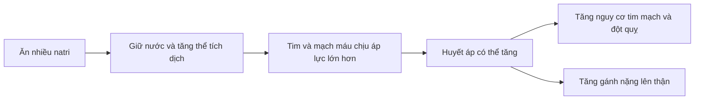

# 057 — Dieting Myth #5: Avoid Salt At All Cost

| Thuộc tính       | Nội dung                                                                                              |
| ---------------- | ----------------------------------------------------------------------------------------------------- |
| **Module**       | Module 06 — Healthy Dieting                                                                           |
| **Bài học**      | Dieting Myth #5: Avoid Salt At All Cost                                                               |
| **Thời lượng**   | 01:00                                                                                                 |
| **Chủ đề chính** | Lầm tưởng 5: Phải tránh hoàn toàn muối                                                                |
| **Kết luận**     | Không cần loại bỏ hoàn toàn muối; cần kiểm soát **tổng lượng natri** và ưu tiên thực phẩm ít chế biến |

> **Thông điệp cốt lõi:** Natri là khoáng chất thiết yếu, nhưng “thiết yếu” không có nghĩa là càng nhiều càng tốt. Mục tiêu hợp lý là **dùng vừa đủ**, hạn chế natri ẩn trong thực phẩm chế biến và không cực đoan loại bỏ hoàn toàn muối.


*Ảnh minh họa: muối ăn có bổ sung iod. Nguồn Wikimedia Commons, giấy phép CC BY-SA 4.0.* ([Wikimedia Commons][1])

## Mục lục

1. [Mục tiêu bài học](#1-mục-tiêu-bài-học)
2. [Nội dung chính](#2-nội-dung-chính)
3. [Áp dụng thực tế](#3-áp-dụng-thực-tế)
4. [Lưu ý và lỗi thường gặp](#4-lưu-ý-và-lỗi-thường-gặp)
5. [Checklist thực hành](#5-checklist-thực-hành)
6. [Tóm tắt](#6-tóm-tắt)

---

## 1. Mục tiêu bài học

Sau bài học này, người học có thể:

* Phân biệt **muối ăn** với **natri**.
* Hiểu vì sao cơ thể cần natri nhưng không nên tiêu thụ quá nhiều.
* Nhận biết điểm chưa chính xác trong quan niệm “natri chỉ làm tăng huyết áp ở người nhạy cảm với muối”.
* Biết giới hạn natri tham khảo dành cho người trưởng thành.
* Xác định các nguồn natri ẩn thường gặp như nước mắm, nước tương, mì ăn liền, thịt chế biến và đồ ăn nhà hàng.
* Điều chỉnh khẩu phần mà không phải ăn nhạt tuyệt đối hoặc loại bỏ hoàn toàn muối.

---

## 2. Nội dung chính

### 2.1. Muối và natri không hoàn toàn giống nhau

**Natri** là một khoáng chất và chất điện giải cần thiết cho:

* Duy trì cân bằng dịch và thể tích máu.
* Hoạt động của hệ thần kinh.
* Sự co cơ.
* Hoạt động bình thường của nhiều tế bào.

**Muối ăn** chủ yếu là natri clorua — `NaCl`. Vì vậy, natri chỉ là một thành phần của muối, đồng thời còn xuất hiện trong bột ngọt, baking soda, chất bảo quản và nhiều phụ gia thực phẩm khác. ([CDC][2])

Quy đổi gần đúng:

```text
1 g natri ≈ 2,5 g muối
2.000 mg natri ≈ 5 g muối
```

Do đó, “không rắc thêm muối” chưa chắc đồng nghĩa với chế độ ăn ít natri.

---

### 2.2. Lầm tưởng và sự thật

| Lầm tưởng                                                    | Thực tế                                                                                                                        |
| ------------------------------------------------------------ | ------------------------------------------------------------------------------------------------------------------------------ |
| Muối hoàn toàn có hại                                        | Cơ thể cần một lượng natri nhất định để duy trì chức năng sống                                                                 |
| Càng ăn ít muối càng tốt                                     | Mục tiêu là kiểm soát lượng tiêu thụ, không phải loại bỏ tuyệt đối                                                             |
| Natri chỉ ảnh hưởng người bị tăng huyết áp nhạy cảm với muối | Mức độ phản ứng khác nhau, nhưng giảm natri có thể làm giảm huyết áp ở cả người tăng huyết áp và người có huyết áp bình thường |
| Chỉ muối rắc khi nấu mới đáng lo                             | Phần lớn natri thường đến từ thực phẩm đóng gói, món ăn chế biến sẵn, gia vị và đồ ăn nhà hàng                                 |
| Muối biển hoặc muối “tự nhiên” có thể dùng không giới hạn    | Dù khác nhau về nguồn gốc, các loại muối vẫn có thể cung cấp lượng natri đáng kể                                               |

---

### 2.3. Hiệu chỉnh khoa học quan trọng

Trong lời thoại gốc có ý rằng:

> Khi kiểm soát những yếu tố khác, dường như có rất ít hoặc không có mối liên hệ giữa tiêu thụ muối và tăng huyết áp ở đa số mọi người.

Nhận định này **không phản ánh đầy đủ bằng chứng hiện nay**.

Các tổng quan hệ thống và phân tích gộp từ thử nghiệm ngẫu nhiên cho thấy:

* Giảm natri trong chế độ ăn nhìn chung làm giảm huyết áp.
* Mức giảm huyết áp thường lớn hơn ở người đã bị tăng huyết áp, người lớn tuổi và một số nhóm có độ nhạy với muối cao hơn.
* Mối quan hệ giữa natri và huyết áp có xu hướng theo liều: giảm natri nhiều hơn thường đi kèm mức giảm huyết áp lớn hơn, dù phản ứng của từng cá nhân không giống nhau. ([PubMed Central (PMC)][3])

Vì vậy, **nhạy cảm với muối làm thay đổi mức độ phản ứng**, chứ không có nghĩa natri hoàn toàn không ảnh hưởng đến những người còn lại.

---

### 2.4. Tăng huyết áp nhạy cảm với muối là gì?

Một người được xem là **nhạy cảm với muối** khi huyết áp của họ thay đổi rõ hơn trước sự thay đổi lượng natri ăn vào.

Khả năng nhạy cảm với muối có thể cao hơn ở:

* Người đang bị tăng huyết áp.
* Người lớn tuổi.
* Người mắc bệnh thận mạn.
* Người mắc đái tháo đường hoặc một số rối loạn chuyển hóa.
* Người có yếu tố di truyền hoặc khả năng đào thải natri kém.

Tuy nhiên, không có xét nghiệm đơn giản được sử dụng rộng rãi để mỗi người tự xác định chính xác mức độ nhạy cảm với muối. Vì thế, khuyến nghị kiểm soát natri thường được áp dụng ở cấp độ toàn bộ chế độ ăn. ([professional.heart.org][4])

---

### 2.5. Bao nhiêu natri là quá nhiều?

WHO khuyến nghị người trưởng thành tiêu thụ:

> **Dưới 2.000 mg natri mỗi ngày**, tương đương dưới khoảng **5 g muối**, tức gần một thìa cà phê muối cho toàn bộ lượng ăn trong ngày.

Con số này bao gồm natri từ:

* Muối dùng khi nấu.
* Nước chấm và gia vị.
* Thực phẩm đóng gói.
* Đồ ăn nhà hàng.
* Natri có sẵn trong thực phẩm.

WHO ước tính lượng natri trung bình toàn cầu của người trưởng thành năm 2021 vào khoảng **4.278 mg/ngày**, tương đương khoảng 11 g muối và cao hơn gấp đôi mức khuyến nghị. ([World Health Organization][5])

Một số hướng dẫn quốc gia sử dụng giới hạn khoảng **2.300 mg natri/ngày**. Sự khác biệt nhỏ giữa các hướng dẫn không làm thay đổi thông điệp chính: phần lớn mọi người nên giảm natri từ mức tiêu thụ hiện tại. ([CDC][2])

---

### 2.6. Natri thường đến từ đâu?

Natri không chỉ đến từ lọ muối trên bàn ăn. Thực phẩm đóng gói và đồ ăn nhà hàng có thể là những nguồn đóng góp lớn, kể cả khi món ăn không có vị quá mặn. ([CDC][2])

| Nhóm thực phẩm     | Ví dụ thường gặp                                | Cách giảm                                                      |
| ------------------ | ----------------------------------------------- | -------------------------------------------------------------- |
| Gia vị mặn         | Nước mắm, nước tương, hạt nêm, viên súp         | Đong bằng thìa, pha loãng, không dùng đồng thời quá nhiều loại |
| Món ăn liền        | Mì gói, cháo gói, súp ăn liền                   | Dùng một phần gói gia vị, thêm rau và thực phẩm tươi           |
| Thịt chế biến      | Xúc xích, giăm bông, thịt nguội, thịt xông khói | Chọn thịt tươi, cá, trứng hoặc đậu                             |
| Đồ ăn nhanh        | Pizza, hamburger, gà rán, khoai tây chiên       | Giảm sốt, phô mai và khẩu phần                                 |
| Đồ ăn vặt          | Khoai tây chiên, bánh quy mặn, khô chế biến     | Chọn trái cây, sữa chua hoặc các loại hạt không tẩm muối       |
| Thực phẩm đóng hộp | Cá hộp, thịt hộp, rau ngâm                      | Chọn loại ít natri; để ráo hoặc rửa khi phù hợp                |
| Món quen thuộc     | Bánh mì, phở, bún, cơm phần                     | Chú ý nước dùng, nước chấm và tần suất ăn                      |

WHO cũng lưu ý rằng bánh mì, thịt chế biến, đồ ăn nhẹ, nước tương, nước mắm và bột ngọt đều có thể đóng góp vào tổng lượng natri. ([World Health Organization][5])

---

### 2.7. Điều gì xảy ra khi ăn quá nhiều natri?



Tiêu thụ quá nhiều natri có thể làm tăng huyết áp; huyết áp cao là yếu tố nguy cơ quan trọng của bệnh tim và đột quỵ. ([CDC][2])

Đối với người mắc bệnh thận mạn, giảm muối có thể hỗ trợ kiểm soát huyết áp, tình trạng giữ nước và một số kết quả liên quan đến thận. Tuy nhiên, mức hạn chế nên được cá nhân hóa vì bằng chứng dài hạn về mọi kết cục thận vẫn chưa hoàn toàn đồng nhất. ([PubMed][6])

Mối liên hệ giữa natri và suy giảm nhận thức hiện vẫn chủ yếu dựa trên nghiên cứu quan sát. Một số nghiên cứu ghi nhận lượng natri cao liên quan đến chức năng nhận thức kém hơn, nhưng kết quả chưa nhất quán và chưa đủ để kết luận natri trực tiếp gây sa sút trí tuệ. ([PubMed][7])

---

### 2.8. Ảnh tham khảo về natri ẩn trong thực phẩm


*Infographic giáo dục sức khỏe của CDC. Các mốc 1.500–2.300 mg trong hình thuộc hướng dẫn và chiến dịch tại Hoa Kỳ; mốc WHO dùng trong bài này là dưới 2.000 mg natri/ngày.* ([CDC][8])

---

## 3. Áp dụng thực tế

### 3.1. Không cần chuyển sang chế độ ăn hoàn toàn không muối

Thay vì ngừng sử dụng muối đột ngột, hãy giảm dần để vị giác có thời gian thích nghi:

1. Giảm khoảng một phần tư lượng gia vị mặn đang dùng.
2. Nếm món ăn trước khi thêm nước mắm hoặc nước tương.
3. Không đặt nhiều loại nước chấm trên bàn.
4. Dùng chanh, giấm, tiêu, tỏi, gừng, hành, ớt và thảo mộc để tăng hương vị.
5. Ưu tiên nguyên liệu tươi thay cho thực phẩm chế biến sẵn.

---

### 3.2. Tập trung vào nguồn natri lớn nhất

Một thìa muối nhỏ trong món ăn nấu tại nhà có thể không phải là vấn đề chính nếu chế độ ăn còn có:

* Mì ăn liền.
* Xúc xích và thịt nguội.
* Đồ ăn nhanh.
* Nước dùng đậm.
* Nhiều nước chấm.
* Đồ ăn vặt mặn.

Hiệu quả lớn nhất thường đến từ việc giảm **tổng natri của cả ngày**, không phải chỉ bỏ lọ muối khỏi bàn ăn.

---

### 3.3. Đọc nhãn dinh dưỡng

Khi sản phẩm có nhãn natri:

* Kiểm tra lượng natri **trên một khẩu phần**.
* So sánh số khẩu phần thực tế đã ăn với khẩu phần ghi trên nhãn.
* So sánh các sản phẩm cùng loại.
* Theo quy ước trên nhãn Hoa Kỳ, `≤5% Daily Value` mỗi khẩu phần được xem là thấp và `≥20% Daily Value` được xem là cao về natri. ([U.S. Food and Drug Administration][9])

Ví dụ:

```text
Một gói mì có 850 mg natri mỗi khẩu phần
Nhưng gói mì chứa 2 khẩu phần

Nếu ăn hết:
850 × 2 = 1.700 mg natri
```

Chỉ một sản phẩm đã có thể cung cấp phần lớn giới hạn natri của cả ngày.

---

### 3.4. Vẫn nên sử dụng muối iod với lượng phù hợp

Nếu sử dụng muối trong nấu ăn, nên ưu tiên **muối được bổ sung iod**. Giảm natri không đồng nghĩa với loại bỏ iod khỏi chế độ ăn. WHO khuyến nghị lượng muối được sử dụng nên là muối iod hóa. ([World Health Organization][5])

Không nên tự ý dùng muối thay thế chứa nhiều kali nếu đang mắc bệnh thận, có nguy cơ tăng kali máu hoặc đang sử dụng thuốc ảnh hưởng đến kali mà chưa hỏi bác sĩ.

---

### 3.5. Mẫu điều chỉnh một ngày

| Thời điểm | Thói quen nhiều natri          | Lựa chọn điều chỉnh                            |
| --------- | ------------------------------ | ---------------------------------------------- |
| Sáng      | Mì gói dùng toàn bộ gói súp    | Dùng nửa gói súp, thêm trứng và rau            |
| Trưa      | Cơm phần kèm nước chấm đậm     | Yêu cầu để riêng nước sốt, dùng một lượng nhỏ  |
| Xế        | Khoai tây chiên hoặc bánh mặn  | Trái cây, sữa chua hoặc hạt không muối         |
| Tối       | Canh nhiều hạt nêm và nước mắm | Giảm gia vị, tăng hành, tiêu, gừng và rau thơm |
| Ăn khuya  | Xúc xích hoặc thịt nguội       | Trứng, sữa hoặc thực phẩm tươi ít chế biến     |

---

## 4. Lưu ý và lỗi thường gặp

### Lỗi 1: Loại bỏ hoàn toàn muối

Đây là cách tiếp cận cực đoan và thường không cần thiết đối với người khỏe mạnh. Mục tiêu là kiểm soát tổng lượng natri, không phải tạo ra nỗi sợ đối với mọi hạt muối.

### Lỗi 2: Nghĩ rằng người huyết áp bình thường có thể ăn mặn tùy ý

Người có huyết áp bình thường vẫn có thể giảm huyết áp khi giảm natri. Lợi ích thường rõ hơn ở người tăng huyết áp nhưng không giới hạn hoàn toàn ở nhóm này. ([PubMed][10])

### Lỗi 3: Chỉ giảm muối khi nấu nhưng vẫn ăn nhiều thực phẩm chế biến

Natri từ nước chấm, mì gói, thịt chế biến, bánh mì và đồ ăn nhà hàng có thể tích lũy nhanh hơn lượng muối tự thêm tại bàn.

### Lỗi 4: Chỉ dựa vào vị mặn

Một món ăn không quá mặn vẫn có thể chứa nhiều natri. Bánh mì, ngũ cốc ăn sáng, thịt gia cầm đã bơm dung dịch và một số loại sốt là ví dụ điển hình. ([CDC][2])

### Lỗi 5: Cắt giảm quá nhanh khiến chế độ ăn khó duy trì

Giảm dần trong vài tuần thường dễ thích nghi hơn. Khi vị giác quen với mức natri thấp hơn, món ăn trước đây có thể bắt đầu có cảm giác quá mặn.

### Lỗi 6: Tự sử dụng muối kali như một sản phẩm “tốt cho tất cả”

Muối thay thế chứa kali có thể hữu ích trong một số trường hợp, nhưng không phù hợp cho mọi người, đặc biệt khi khả năng đào thải kali bị suy giảm.

### Lỗi 7: Bỏ qua lời khuyên y tế cá nhân

Người mắc tăng huyết áp, suy tim, bệnh thận, phù hoặc đang dùng thuốc lợi tiểu và thuốc tim mạch có thể cần giới hạn natri riêng do bác sĩ hoặc chuyên gia dinh dưỡng hướng dẫn.

---

## 5. Checklist thực hành

### Kiểm tra chế độ ăn

* [ ] Tôi biết muối và natri không hoàn toàn giống nhau.
* [ ] Tôi không cố loại bỏ hoàn toàn muối một cách cực đoan.
* [ ] Tôi đã kiểm tra natri trên nhãn thực phẩm đóng gói.
* [ ] Tôi chú ý số khẩu phần thay vì chỉ nhìn lượng natri của một khẩu phần.
* [ ] Tôi hạn chế mì ăn liền, thịt chế biến và đồ ăn nhanh.
* [ ] Tôi kiểm soát lượng nước mắm, nước tương, hạt nêm và nước dùng.
* [ ] Tôi nếm món ăn trước khi thêm gia vị.
* [ ] Tôi sử dụng chanh, tiêu, tỏi, gừng và thảo mộc để tăng hương vị.
* [ ] Tôi ưu tiên thực phẩm tươi và món tự nấu.
* [ ] Khi dùng muối, tôi ưu tiên muối iod với lượng vừa phải.

### Khi cần tham khảo chuyên môn

* [ ] Tôi đã kiểm tra huyết áp định kỳ.
* [ ] Tôi hỏi bác sĩ nếu đang mắc bệnh thận, suy tim hoặc tăng huyết áp.
* [ ] Tôi không tự dùng muối thay thế chứa kali khi chưa rõ tình trạng thận và thuốc đang sử dụng.

---

## 6. Tóm tắt

* **Natri là khoáng chất thiết yếu**, hỗ trợ cân bằng dịch, hoạt động thần kinh và co cơ.
* Không cần và thường không nên áp dụng tư duy **“tránh muối bằng mọi giá”**.
* Điều đáng quan tâm là **tổng lượng natri quá cao**, đặc biệt từ thực phẩm đóng gói, đồ ăn nhà hàng và gia vị mặn.
* Bằng chứng thử nghiệm cho thấy giảm natri có thể làm giảm huyết áp ở nhiều nhóm, không chỉ riêng người bị tăng huyết áp nhạy cảm với muối.
* WHO khuyến nghị người trưởng thành tiêu thụ dưới khoảng **2.000 mg natri**, tương đương dưới **5 g muối mỗi ngày**. ([World Health Organization][5])
* Giải pháp bền vững là giảm dần gia vị, đọc nhãn, ăn ít thực phẩm chế biến và ưu tiên muối iod với lượng phù hợp.

> **Kết luận cuối cùng:** Muối không phải là “kẻ thù” cần loại bỏ hoàn toàn. Vấn đề nằm ở **liều lượng, nguồn natri và tổng thể chế độ ăn**.

[1]: https://commons.wikimedia.org/wiki/File%3ATable_Salt.jpg "File:Table Salt.jpg - Wikimedia Commons"
[2]: https://www.cdc.gov/salt/sodium-potassium-health/index.html "Effects of Sodium and Potassium | Salt | CDC"
[3]: https://pmc.ncbi.nlm.nih.gov/articles/PMC8055199/?utm_source=chatgpt.com "Blood Pressure Effects of Sodium Reduction: Dose–Response Meta-Analysis of Experimental Studies - PMC"
[4]: https://professional.heart.org/en/science-news/salt-sensitivity-of-blood-pressure/commentary?utm_source=chatgpt.com "Salt Sensitivity of Blood Pressure: An Enigmatic Hypertension ..."
[5]: https://www.who.int/news-room/fact-sheets/detail/sodium-reduction "Sodium reduction"
[6]: https://pubmed.ncbi.nlm.nih.gov/35017237/?utm_source=chatgpt.com "Effect of a low-salt diet on chronic kidney disease outcomes"
[7]: https://pubmed.ncbi.nlm.nih.gov/32675410/?utm_source=chatgpt.com "Link Between Dietary Sodium Intake, Cognitive Function ..."
[8]: https://www.cdc.gov/heart-disease/php/healthy-eating-kit/index.html "Healthy Eating Communications Kit | Heart Disease | CDC"
[9]: https://www.fda.gov/food/nutrition-education-resources-materials/sodium-your-diet "Sodium in Your Diet | FDA"
[10]: https://pubmed.ncbi.nlm.nih.gov/23558162/?utm_source=chatgpt.com "Effect of longer term modest salt reduction on blood pressure"

---

# Bài luyện tập

## Mục tiêu


## Đề bài


## Yêu cầu hoàn thành

- [ ] 
- [ ] 
- [ ] 

## Kết quả / lời giải


## Ghi chú
