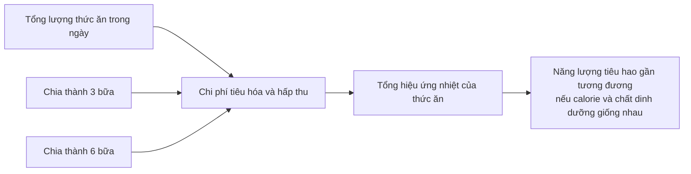
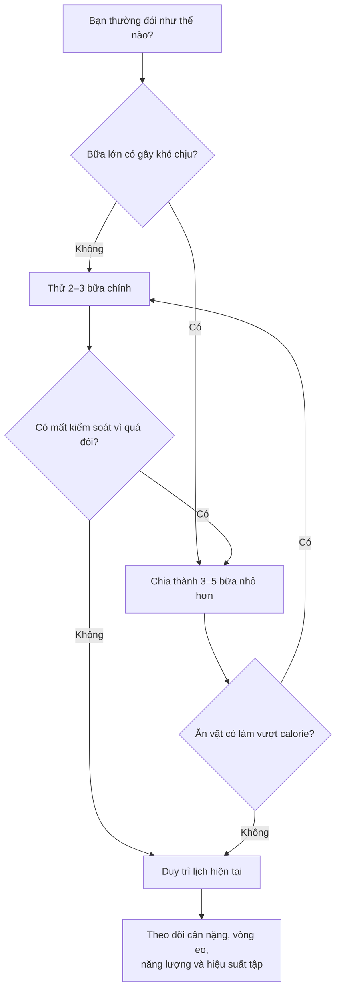

# 058 — Dieting Myth #6: Eat Several Small Meals To Boost Metabolism

| Thuộc tính         | Nội dung                                                                                                                                            |
| ------------------ | --------------------------------------------------------------------------------------------------------------------------------------------------- |
| **Module**         | Module 06 — Healthy Dieting                                                                                                                         |
| **Bài học**        | Dieting Myth #6: Eat Several Small Meals To Boost Metabolism                                                                                        |
| **Thời lượng**     | 01:19                                                                                                                                               |
| **Chủ đề chính**   | Lầm tưởng 6: Ăn nhiều bữa nhỏ giúp tăng trao đổi chất                                                                                               |
| **Kết luận nhanh** | Số bữa ăn không tự động làm cơ thể đốt nhiều calorie hơn; tổng năng lượng, thành phần cơ thể, vận động và khả năng duy trì chế độ ăn quan trọng hơn |

## Mục lục

1. [Mục tiêu bài học](#1-mục-tiêu-bài-học)
2. [Nội dung chính](#2-nội-dung-chính)
3. [Áp dụng thực tế](#3-áp-dụng-thực-tế)
4. [Lưu ý & lỗi thường gặp](#4-lưu-ý--lỗi-thường-gặp)
5. [Checklist thực hành](#5-checklist-thực-hành)
6. [Tóm tắt](#6-tóm-tắt)


*Ảnh minh họa: Một bữa ăn nhỏ có thể giàu dinh dưỡng, nhưng kích thước và số lượng bữa ăn không quyết định tốc độ trao đổi chất. Ảnh CC0 từ Wikimedia Commons.* ([Wikimedia Commons][1])

---

## 1. Mục tiêu bài học

Sau bài học này, người học có thể:

* Hiểu vì sao quan niệm **“ăn liên tục để giữ cho ngọn lửa trao đổi chất luôn cháy”** không phản ánh chính xác sinh lý học.
* Phân biệt **tần suất ăn**, **hiệu ứng nhiệt của thức ăn**, **trao đổi chất khi nghỉ** và **tổng năng lượng tiêu hao**.
* Biết rằng ăn nhiều bữa nhỏ có thể hữu ích đối với một số người trong việc kiểm soát cơn đói, nhưng không phải là phương pháp bắt buộc để giảm cân.
* Lựa chọn số bữa dựa trên lịch sinh hoạt, cảm giác đói, khả năng kiểm soát khẩu phần và mức độ duy trì lâu dài.
* Hiểu vai trò của tập luyện sức mạnh trong việc bảo vệ khối nạc khi giảm cân.

> **Thông điệp cốt lõi:**
> Cơ thể không đốt thêm một lượng calorie đáng kể chỉ vì cùng một lượng thức ăn được chia thành nhiều bữa hơn.

---

## 2. Nội dung chính

### 2.1. Lầm tưởng “thêm củi vào ngọn lửa trao đổi chất”

Lập luận thường được truyền miệng như sau:

> Ăn ít nhưng ăn liên tục sẽ thường xuyên “kích hoạt” tiêu hóa, nhờ đó duy trì trao đổi chất ở mức cao và đốt nhiều calorie hơn trong ngày.

Điểm đúng trong lập luận này là cơ thể thật sự cần năng lượng để tiêu hóa, hấp thu và chuyển hóa thức ăn. Quá trình đó được gọi là **hiệu ứng nhiệt của thức ăn** — *Thermic Effect of Food, TEF*.

Tuy nhiên, tổng TEF trong ngày chủ yếu phụ thuộc vào:

1. Tổng lượng calorie đã ăn.
2. Thành phần protein, carbohydrate và chất béo.
3. Đặc điểm sinh lý của từng người.

Nếu tổng calorie và các chất dinh dưỡng giống nhau, việc chia khẩu phần thành ba hay sáu bữa thường không tạo ra khác biệt đáng kể về tổng năng lượng tiêu hao. TEF chỉ chiếm khoảng 10% tổng năng lượng tiêu hao hằng ngày ở nhiều người. ([PubMed Central (PMC)][2])

### Ví dụ đơn giản

Giả sử hai người đều ăn **1.800 kcal/ngày**:

| Người A                              | Người B                              |
| ------------------------------------ | ------------------------------------ |
| 3 bữa × 600 kcal                     | 6 bữa × 300 kcal                     |
| Tổng: 1.800 kcal                     | Tổng: 1.800 kcal                     |
| Cùng lượng protein, carb và chất béo | Cùng lượng protein, carb và chất béo |

Người B có sáu lần tăng nhẹ tiêu hao năng lượng sau ăn, nhưng mỗi lần nhỏ hơn. Người A chỉ có ba lần, nhưng mỗi lần lớn hơn. Khi cộng lại, tổng chi phí tiêu hóa trong ngày thường tương tự nhau.



---

### 2.2. Những thành phần tạo nên tổng năng lượng tiêu hao


*Hình minh họa phép đo trao đổi chất khi nghỉ bằng nhiệt lượng kế gián tiếp. Ảnh CC BY-SA 4.0 từ Wikimedia Commons.* ([Wikimedia Commons][3])

Tổng năng lượng cơ thể tiêu hao trong ngày có thể được hình dung qua bốn thành phần chính:

| Thành phần                         | Ý nghĩa                                                                                       | Mức ảnh hưởng tương đối               |
| ---------------------------------- | --------------------------------------------------------------------------------------------- | ------------------------------------- |
| **RMR/BMR**                        | Năng lượng duy trì hô hấp, tuần hoàn, hoạt động não, gan, thận và các chức năng sống khi nghỉ | Thường là thành phần lớn nhất         |
| **TEF**                            | Năng lượng dùng để tiêu hóa và chuyển hóa thức ăn                                             | Khoảng 10% ở nhiều người              |
| **Vận động có chủ đích**           | Tập gym, chạy bộ, chơi thể thao                                                               | Thay đổi theo chương trình tập        |
| **Hoạt động không phải tập luyện** | Đi bộ, đứng, làm việc nhà, thay đổi tư thế                                                    | Có thể khác biệt lớn giữa các cá nhân |

Trao đổi chất khi nghỉ thường chiếm khoảng 60–70% tổng năng lượng tiêu hao, trong khi hoạt động thể chất và vận động tự nhiên có thể thay đổi đáng kể giữa các ngày. ([PubMed Central (PMC)][4])

Do đó, việc chỉ tăng số bữa ăn tác động tới một phần tương đối nhỏ của toàn bộ hệ thống.

---

### 2.3. Nghiên cứu nói gì về tần suất bữa ăn?

Một phân tích mạng gồm **22 thử nghiệm ngẫu nhiên với 647 người tham gia** so sánh các chế độ từ một đến tám bữa trở lên mỗi ngày. Khi năng lượng được kiểm soát, nghiên cứu không tìm thấy bằng chứng vững chắc rằng ăn nhiều bữa hơn giúp giảm cân tốt hơn. Một số so sánh thậm chí nghiêng nhẹ về hai bữa thay vì sáu bữa, nhưng tác động nhỏ và độ chắc chắn của nhiều kết quả còn hạn chế. ([PubMed Central (PMC)][5])


*Hình nghiên cứu: So sánh ảnh hưởng của các tần suất ăn khác nhau đối với cân nặng, vòng eo, khối mỡ và lượng calorie nạp vào. Phần lớn khoảng tin cậy giao với mức không khác biệt, cho thấy không có lợi thế nhất quán của việc ăn nhiều bữa.* ([PubMed Central (PMC)][5])

Một tổng quan hệ thống và phân tích gộp năm 2023 cũng so sánh tần suất ăn thấp — tối đa ba lần ăn mỗi ngày — với tần suất cao từ bốn lần trở lên. Kết quả nhìn chung không ủng hộ việc xem tăng số bữa là một phương pháp độc lập để cải thiện thành phần cơ thể hoặc sức khỏe chuyển hóa. ([PubMed Central (PMC)][6])

Phân tích năm 2024 về thời điểm và tần suất ăn ghi nhận chế độ có tần suất thấp hơn có thể liên quan tới mức giảm cân nhỉnh hơn, nhưng hiệu quả nhỏ, không chắc có ý nghĩa lâm sàng và bằng chứng có tính không đồng nhất cao. Điều này không có nghĩa mọi người nên ăn một hoặc hai bữa; nó chỉ cho thấy quan điểm **“càng nhiều bữa càng tăng chuyển hóa”** không được dữ liệu hiện tại xác nhận. ([PubMed][7])

---

### 2.4. Ăn nhiều bữa nhỏ vẫn có thể hữu ích khi nào?

Việc ăn thường xuyên hơn không “tăng tốc” trao đổi chất đáng kể, nhưng vẫn có thể là một công cụ hành vi phù hợp với một số người.

#### Có thể phù hợp khi:

* Người tập khó ăn đủ calorie hoặc protein trong hai hay ba bữa lớn.
* Một bữa quá lớn gây đầy bụng hoặc khó chịu.
* Khoảng cách giữa các bữa quá dài dẫn đến đói dữ dội và mất kiểm soát ở bữa sau.
* Lịch làm việc hoặc tập luyện thuận tiện hơn với các bữa nhỏ.
* Cần phân bổ protein qua nhiều bữa để hỗ trợ mục tiêu tập luyện.

#### Có thể không phù hợp khi:

* Mỗi bữa nhỏ biến thành một lần ăn không kiểm soát.
* Người ăn phải liên tục suy nghĩ, chuẩn bị và theo dõi thức ăn.
* Các món ăn vặt có mật độ calorie cao khiến tổng năng lượng tăng ngoài dự kiến.
* Người đó cảm thấy no và kiểm soát khẩu phần tốt hơn với ít bữa nhưng bữa lớn hơn.

> **Ăn nhiều bữa nhỏ là một lựa chọn tổ chức chế độ ăn, không phải một “mẹo tăng trao đổi chất”.**

---

### 2.5. Caffeine có làm tăng trao đổi chất không?

Caffeine có thể tạo ra tác động cấp tính nhỏ đối với sinh nhiệt và chuyển hóa chất béo. Một phân tích gộp của 94 nghiên cứu cho thấy caffeine làm tăng chuyển hóa chất béo ở mức nhỏ, và kết quả rõ hơn qua chỉ dấu trong máu so với các phép đo oxy hóa chất béo toàn cơ thể. ([PubMed][8])

Tuy nhiên:

* Hiệu ứng này không đủ để thay thế kiểm soát tổng calorie.
* Uống thêm cà phê không thể bù cho chế độ ăn dư năng lượng kéo dài.
* Thêm đường, kem hoặc syrup có thể làm lượng calorie của đồ uống tăng mạnh.
* Caffeine còn có thể ảnh hưởng đến giấc ngủ; ngủ kém có thể khiến việc kiểm soát ăn uống và phục hồi sau tập khó khăn hơn.

Vì vậy, không nên xem caffeine là công cụ chính để giảm cân.

---

### 2.6. Điều gì thực sự ảnh hưởng tới trao đổi chất khi nghỉ?

Trao đổi chất khi nghỉ chịu ảnh hưởng bởi nhiều yếu tố:

* Kích thước cơ thể.
* Khối nạc và khối mỡ.
* Các cơ quan có hoạt tính chuyển hóa cao như gan, não, tim và thận.
* Tuổi, giới tính và yếu tố di truyền.
* Mức năng lượng nạp vào trong thời gian dài.
* Một số tình trạng sức khỏe và thuốc đang sử dụng.

Khối nạc có liên quan mạnh với RMR, nhưng không nên hiểu rằng cơ bắp là yếu tố duy nhất. Các cơ quan nội tạng chỉ chiếm phần nhỏ khối lượng cơ thể nhưng có mức tiêu hao năng lượng trên mỗi kilogram rất cao. ([PubMed Central (PMC)][4])

#### Đính chính con số “14 kcal cho mỗi pound cơ”

Bản chép lời nói:

> Một pound mô không mỡ đốt khoảng 14 kcal/ngày, trong khi một pound mỡ chỉ đốt 2–3 kcal/ngày.

Cách diễn đạt này dễ khiến người học hiểu rằng **một pound cơ bắp** đốt 14 kcal mỗi ngày. Ước tính thường được trích dẫn trong nghiên cứu về mô cho thấy:

| Mô          |       Ước tính khi nghỉ |         Quy đổi gần đúng |
| ----------- | ----------------------: | -----------------------: |
| Cơ xương    |  Khoảng 13 kcal/kg/ngày | Khoảng 6 kcal/pound/ngày |
| Mô mỡ       | Khoảng 4,5 kcal/kg/ngày | Khoảng 2 kcal/pound/ngày |
| Gan         | Khoảng 200 kcal/kg/ngày |        Hoạt tính rất cao |
| Não         | Khoảng 240 kcal/kg/ngày |        Hoạt tính rất cao |
| Tim và thận | Khoảng 440 kcal/kg/ngày |        Hoạt tính rất cao |

Vì **khối không mỡ** bao gồm cơ, xương, nước và các cơ quan, không nên dùng một con số duy nhất rồi đồng nhất toàn bộ khối không mỡ với cơ bắp. ([PubMed Central (PMC)][9])

Tăng cơ vẫn có lợi cho sức khỏe, chức năng vận động và mức tiêu hao năng lượng, nhưng tác động trực tiếp của từng kilogram cơ lên RMR nhỏ hơn nhiều so với những tuyên bố phổ biến trên mạng.

---

## 3. Áp dụng thực tế

### 3.1. Chọn số bữa dựa trên khả năng duy trì

Thay vì hỏi:

> “Tôi phải ăn bao nhiêu bữa để tăng trao đổi chất?”

Hãy hỏi:

> “Số bữa nào giúp tôi kiểm soát tổng calorie, ăn đủ dinh dưỡng và duy trì ổn định nhất?”



Không có một con số tối ưu cho tất cả mọi người. Người phù hợp với ba bữa không cần ép bản thân ăn sáu bữa; người thấy dễ chịu hơn với bốn hoặc năm bữa nhỏ cũng không cần chuyển sang nhịn dài chỉ vì một xu hướng mới.

---

### 3.2. Ví dụ cùng 1.800 kcal với hai cấu trúc khác nhau

#### Phương án A: Ba bữa chính

| Bữa      | Năng lượng dự kiến |
| -------- | -----------------: |
| Bữa sáng |           500 kcal |
| Bữa trưa |           650 kcal |
| Bữa tối  |           650 kcal |
| **Tổng** |     **1.800 kcal** |

#### Phương án B: Ba bữa và hai bữa phụ

| Bữa           | Năng lượng dự kiến |
| ------------- | -----------------: |
| Bữa sáng      |           400 kcal |
| Bữa phụ sáng  |           200 kcal |
| Bữa trưa      |           500 kcal |
| Bữa phụ chiều |           200 kcal |
| Bữa tối       |           500 kcal |
| **Tổng**      |     **1.800 kcal** |

Về giảm mỡ, phương án hiệu quả hơn thường là phương án giúp người thực hiện:

* Giữ tổng năng lượng đúng kế hoạch.
* Ăn đủ protein, rau, trái cây và chất xơ.
* Không thường xuyên ăn mất kiểm soát.
* Tập luyện và sinh hoạt bình thường.
* Duy trì được trong nhiều tuần hoặc nhiều tháng.

---

### 3.3. Ưu tiên tập luyện sức mạnh khi giảm cân


*Ảnh minh họa tập luyện sức mạnh bằng tạ đơn, CC BY 2.0.* ([Wikimedia Commons][10])

Khi giảm cân, một phần cân nặng mất đi có thể đến từ khối nạc. Nghiên cứu được ACSM trình bày cho thấy nhóm kết hợp ăn kiêng với tập sức mạnh bảo vệ khối không mỡ tốt hơn nhóm chỉ ăn kiêng; mất nhiều khối không mỡ hơn cũng liên quan tới mức tăng cân trở lại cao hơn trong giai đoạn theo dõi. ([ACSM][11])

Các ưu tiên thực tế gồm:

1. Tạo mức thâm hụt calorie vừa phải thay vì cắt giảm cực đoan.
2. Tập sức mạnh đều đặn và tăng dần độ khó.
3. Ăn đủ protein.
4. Duy trì vận động hằng ngày.
5. Ngủ và phục hồi đầy đủ.
6. Đánh giá xu hướng cân nặng trong nhiều tuần, không chỉ một ngày.

Số bữa chỉ nên được điều chỉnh để hỗ trợ những ưu tiên trên.

---

### 3.4. Thử nghiệm cấu trúc bữa ăn trong 14 ngày

Trong hai tuần, hãy giữ tương đối ổn định:

* Tổng calorie.
* Lượng protein.
* Thời gian tập luyện.
* Số bước chân hoặc mức vận động.
* Thời gian ngủ.

Sau đó ghi lại:

| Tiêu chí                     | Điểm 1–5 |
| ---------------------------- | -------: |
| Cảm giác đói giữa các bữa    |          |
| Khả năng kiểm soát khẩu phần |          |
| Mức năng lượng trong ngày    |          |
| Sự thoải mái tiêu hóa        |          |
| Hiệu suất tập luyện          |          |
| Mức độ tiện lợi              |          |
| Khả năng duy trì lâu dài     |          |

Nếu ba bữa khiến anh đói quá mức, hãy thêm một bữa phụ có kế hoạch. Nếu năm hoặc sáu lần ăn khiến anh liên tục vượt calorie, hãy giảm số lần ăn và làm các bữa chính no lâu hơn.

---

## 4. Lưu ý & lỗi thường gặp

### Lỗi 1: Nghĩ rằng mỗi lần ăn đều “khởi động lại” quá trình đốt mỡ

Ăn thực phẩm làm tăng chi phí tiêu hóa, nhưng đồng thời cơ thể cũng đang tiếp nhận và lưu trữ năng lượng. Không thể chỉ nhìn vào phần calorie tiêu hao khi tiêu hóa mà bỏ qua lượng calorie vừa nạp vào.

### Lỗi 2: Chia bữa nhưng không chia calorie

Từ ba bữa chuyển sang sáu bữa chỉ có ý nghĩa khi tổng khẩu phần vẫn được kiểm soát. Sáu bữa bằng khẩu phần cũ cộng thêm ba bữa phụ sẽ làm tổng calorie tăng.

### Lỗi 3: Xem đồ ăn vặt là “không đáng kể”

Hạt, bơ hạt, bánh quy, đồ uống có đường và các món nhỏ có thể chứa nhiều calorie dù thể tích không lớn.

### Lỗi 4: Ép bản thân ăn khi không đói

Không cần đặt báo thức để ăn mỗi hai giờ chỉ vì sợ trao đổi chất “chậm lại”. Đối với người khỏe mạnh, khoảng cách thông thường giữa các bữa không làm cơ thể đột ngột ngừng đốt calorie.

### Lỗi 5: Cắt bữa quá mức rồi ăn mất kiểm soát

Ít bữa hơn không tự động tốt hơn. Nếu nhịn quá lâu khiến anh ăn bù vào cuối ngày, cấu trúc đó không còn giúp kiểm soát năng lượng.

### Lỗi 6: Chỉ tập cardio và bỏ qua tập sức mạnh

Cardio có giá trị đối với tim mạch và tiêu hao năng lượng, nhưng tập sức mạnh đặc biệt hữu ích để duy trì sức mạnh và khối nạc trong quá trình giảm cân. ([ACSM][11])

### Lỗi 7: Áp dụng một lịch ăn cho mọi đối tượng

Người mắc đái tháo đường, đang mang thai, có bệnh đường tiêu hóa, tiền sử rối loạn ăn uống hoặc đang dùng thuốc liên quan đến bữa ăn cần trao đổi với bác sĩ hoặc chuyên gia dinh dưỡng trước khi thay đổi đáng kể tần suất ăn.

---

## 5. Checklist thực hành

* [ ] Tôi không xem ăn nhiều bữa nhỏ là cách tự động tăng trao đổi chất.
* [ ] Tôi theo dõi tổng lượng thức ăn trong ngày, không chỉ kích thước từng bữa.
* [ ] Tôi chọn số bữa phù hợp với cảm giác đói và lịch sinh hoạt.
* [ ] Tôi có kế hoạch rõ ràng cho bữa phụ thay vì ăn ngẫu nhiên.
* [ ] Mỗi bữa chính có một nguồn protein phù hợp.
* [ ] Tôi ưu tiên thực phẩm giàu chất xơ và có độ no cao.
* [ ] Tôi không dùng caffeine để thay thế chế độ ăn và vận động.
* [ ] Tôi tập sức mạnh trong quá trình giảm cân.
* [ ] Tôi đánh giá tiến độ bằng xu hướng nhiều tuần.
* [ ] Tôi điều chỉnh số bữa khi cấu trúc hiện tại khiến mình quá đói hoặc thường xuyên vượt calorie.

---

## 6. Tóm tắt

> **Lầm tưởng:** Ăn nhiều bữa nhỏ giúp “giữ lửa” trao đổi chất và đốt nhiều calorie hơn.

> **Sự thật:** Khi tổng calorie và thành phần dinh dưỡng tương đương, chia thức ăn thành nhiều bữa hơn thường không làm tổng năng lượng tiêu hao tăng đáng kể. Các tổng quan thử nghiệm ngẫu nhiên không chứng minh được lợi thế nhất quán của tần suất ăn cao đối với giảm cân hoặc giảm mỡ. ([PubMed Central (PMC)][5])

Ăn nhiều bữa nhỏ vẫn có thể hữu ích nếu nó giúp:

* Hạn chế cơn đói quá mức.
* Ăn đủ protein và calorie.
* Giảm khó chịu khi ăn bữa lớn.
* Phù hợp hơn với lịch làm việc và tập luyện.

Nhưng yếu tố quyết định kết quả lâu dài vẫn là:

```text
Kiểm soát tổng năng lượng
        +
Chất lượng thực phẩm
        +
Đủ protein
        +
Tập luyện sức mạnh
        +
Vận động hằng ngày
        +
Khả năng duy trì
```

**Hãy chọn số bữa giúp anh tuân thủ chế độ ăn tốt nhất, thay vì chọn số bữa dựa trên lời hứa “tăng tốc trao đổi chất”.**

[1]: https://commons.wikimedia.org/wiki/File%3AHealthy_Meal_Prep_%28Unsplash%29.jpg "File:Healthy Meal Prep (Unsplash).jpg - Wikimedia Commons"
[2]: https://pmc.ncbi.nlm.nih.gov/articles/PMC4366678/?utm_source=chatgpt.com "The thermic effect of food is reduced in older adults - PMC - NIH"
[3]: https://commons.wikimedia.org/wiki/File%3AResting_Metabolic_Rate.png "File:Resting Metabolic Rate.png - Wikimedia Commons"
[4]: https://pmc.ncbi.nlm.nih.gov/articles/PMC7751004/?utm_source=chatgpt.com "Greater Skeletal Muscle Oxidative Capacity Is Associated With ..."
[5]: https://pmc.ncbi.nlm.nih.gov/articles/PMC7490164/ "Impact of Meal Frequency on Anthropometric Outcomes: A Systematic Review and Network Meta-Analysis of Randomized Controlled Trials - PMC"
[6]: https://pmc.ncbi.nlm.nih.gov/articles/PMC10647044/?utm_source=chatgpt.com "The effects of eating frequency on changes in body composition and cardiometabolic health in adults: a systematic review with meta-analysis of randomized trials - PMC"
[7]: https://pubmed.ncbi.nlm.nih.gov/39485353/?utm_source=chatgpt.com "Meal Timing and Anthropometric and Metabolic Outcomes"
[8]: https://pubmed.ncbi.nlm.nih.gov/36495873/ "Does Caffeine Increase Fat Metabolism? A Systematic Review and Meta-Analysis - PubMed"
[9]: https://pmc.ncbi.nlm.nih.gov/articles/PMC3139779/?utm_source=chatgpt.com "Evaluation of Specific Metabolic Rates of Major Organs and ..."
[10]: https://commons.wikimedia.org/wiki/File%3AWoman_lifting_dumbbells_in_a_modern_gym_during_a_workout_session_focused_on_strength_training_and_fitness.jpg "File:Woman lifting dumbbells in a modern gym during a workout session focused on strength training and fitness.jpg - Wikimedia Commons"
[11]: https://acsm.org/weight-loss-tissue-loss-weight-regain/ "Loss of Lean Tissue during Weight Loss Increases Weight Regain in the Long Term"
