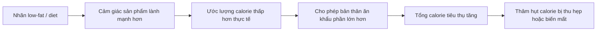

# 059 — Dieting Myth #7: Diet Foods Lead To Fat Loss

> **Lầm tưởng:** Chỉ cần chọn thực phẩm có nhãn “diet”, “light”, “low-fat”, “low-carb” hoặc “sugar-free” thì cơ thể sẽ tự động giảm mỡ.
>
> **Sự thật:** Những nhãn này chỉ mô tả **một đặc điểm của sản phẩm**, không đảm bảo sản phẩm ít calorie, giàu dinh dưỡng hoặc phù hợp với mục tiêu giảm mỡ.

| Thuộc tính       | Nội dung                                               |
| ---------------- | ------------------------------------------------------ |
| **Module**       | Module 06 — Healthy Dieting                            |
| **Bài học**      | Dieting Myth #7: Diet Foods Lead To Fat Loss           |
| **Thời lượng**   | 01:25                                                  |
| **Chủ đề chính** | Lầm tưởng 7: Thực phẩm “ăn kiêng” tự động giúp giảm mỡ |

## Mục lục

1. [Mục tiêu bài học](#1-mục-tiêu-bài-học)
2. [Nội dung chính](#2-nội-dung-chính)
3. [Áp dụng thực tế](#3-áp-dụng-thực-tế)
4. [Lưu ý & lỗi thường gặp](#4-lưu-ý--lỗi-thường-gặp)
5. [Checklist thực hành](#5-checklist-thực-hành)
6. [Tóm tắt](#6-tóm-tắt)

---

## 1. Mục tiêu bài học

Sau bài học này, người học có thể:

* Hiểu vì sao nhãn **“ăn kiêng” không đồng nghĩa với “giảm mỡ”**.
* Nhận biết hiệu ứng tâm lý **health halo — hào quang sức khỏe**.
* So sánh phiên bản thông thường và phiên bản “light” một cách chính xác.
* Đọc đúng calorie, khẩu phần và số khẩu phần trong một gói.
* Tránh tâm lý ăn bù vì cho rằng mình đã chọn một sản phẩm “lành mạnh hơn”.

---

## 2. Nội dung chính

### 2.1. Thực phẩm “ăn kiêng” là gì?

Trong marketing thực phẩm, một sản phẩm có thể được quảng bá bằng các cụm từ như:

* **Low-fat:** ít chất béo.
* **Fat-free:** không hoặc gần như không có chất béo.
* **Low-carb:** ít carbohydrate.
* **Sugar-free:** không đường hoặc chứa lượng đường rất thấp theo quy định áp dụng.
* **No added sugar:** không bổ sung thêm đường trong quá trình sản xuất.
* **Light/Lite:** đã giảm một thành phần nào đó so với phiên bản tham chiếu.
* **Diet:** thường được định vị dành cho người kiểm soát cân nặng hoặc calorie.

Điểm quan trọng là các nhãn trên thường chỉ nói về **một chất dinh dưỡng**, chứ không đánh giá toàn bộ sản phẩm.

Ví dụ:

* “Ít béo” không có nghĩa là ít đường.
* “Không đường” không có nghĩa là không có calorie.
* “Ít carb” không có nghĩa là khẩu phần có thể ăn tùy ý.
* “Giàu protein” không có nghĩa là tổng calorie thấp.

### 2.2. Giảm mỡ phụ thuộc vào tổng cân bằng năng lượng

Một sản phẩm không thể tự động đốt mỡ chỉ vì có chữ “diet” trên bao bì.

Về lâu dài, giảm cân xảy ra khi năng lượng cơ thể sử dụng lớn hơn năng lượng hấp thụ từ đồ ăn và thức uống. Việc tăng vận động kết hợp giảm lượng calorie tiêu thụ sẽ tạo ra thâm hụt năng lượng cần thiết cho quá trình giảm cân.

Công thức cần ghi nhớ:

[
\text{Calorie thực tế} =
\text{Calorie mỗi khẩu phần}
\times
\text{Số khẩu phần đã ăn}
]

Do đó:

> **Một món ăn “light” được ăn với khẩu phần gấp đôi vẫn có thể cung cấp nhiều calorie hơn một khẩu phần bình thường.**

### 2.3. “Ít chất béo” không nhất thiết là “ít calorie”

Fat cung cấp nhiều năng lượng hơn protein và carbohydrate tính trên mỗi gram. Tuy nhiên, khi giảm fat khỏi một sản phẩm, nhà sản xuất có thể thay đổi công thức, kích thước khẩu phần hoặc các thành phần khác để duy trì hương vị và kết cấu.

Vì vậy, thay vì chỉ nhìn dòng chữ **“30% less fat”**, cần kiểm tra trực tiếp:

1. Calorie trên mỗi khẩu phần.
2. Khối lượng của một khẩu phần.
3. Tổng số khẩu phần trong gói.
4. Đường bổ sung.
5. Protein và chất xơ.
6. Sodium nếu thường xuyên sử dụng sản phẩm.

FDA lưu ý rằng toàn bộ calorie và chất dinh dưỡng trên bảng thông tin thường được tính cho **một khẩu phần**, trong khi một gói có thể chứa nhiều khẩu phần. Nếu ăn hai khẩu phần, lượng calorie và chất dinh dưỡng cũng tăng gấp đôi.


*Ảnh minh họa bảng Nutrition Facts chính thức của FDA. Khi đọc nhãn, hãy bắt đầu từ “Serving size”, “Servings per container” và “Calories”.*

### 2.4. Hiệu ứng “hào quang sức khỏe”

Khi thấy những từ như “ít béo”, “tự nhiên”, “không đường” hoặc “keto”, người tiêu dùng có thể mặc định rằng toàn bộ sản phẩm tốt cho sức khỏe.

Hiện tượng này được gọi là **health halo effect**:



Nhãn “ăn kiêng” có thể ảnh hưởng đến hành vi qua hai cơ chế:

* Làm người dùng cho rằng khẩu phần phù hợp phải lớn hơn.
* Làm giảm cảm giác tội lỗi khi ăn đồ ăn vặt.

Một nghiên cứu thực nghiệm năm 2006 báo cáo rằng người tham gia có thể tiêu thụ **nhiều hơn tới khoảng 50%** khi đồ ăn vặt được dán nhãn “low-fat”. Nghiên cứu cho rằng nhãn ít béo làm tăng khẩu phần mà người dùng tự cho là phù hợp và giảm cảm giác tội lỗi khi ăn. Đây là kết quả trong một bối cảnh nghiên cứu cụ thể, không có nghĩa tất cả mọi người hoặc mọi sản phẩm đều tạo ra mức tăng 50%.


*Ảnh của National Cancer Institute minh họa cách thông điệp “low-fat” có thể trở thành tín hiệu sức khỏe nổi bật. Ảnh thuộc phạm vi công cộng.*

### 2.5. Nghiên cứu tổng hợp nói gì?

Một tổng quan hệ thống năm 2019 xem xét 11 nghiên cứu về các tuyên bố liên quan đến fat, đường và năng lượng trên bao bì. Kết quả cho thấy các tuyên bố dinh dưỡng có thể:

* Khiến sản phẩm được đánh giá là lành mạnh hơn.
* Làm người tiêu dùng đánh giá thấp hàm lượng năng lượng.
* Làm khẩu phần “hợp lý” được cảm nhận lớn hơn.
* Ảnh hưởng đến ý định mua hàng và lượng tiêu thụ.
* Trong một số trường hợp, làm tăng tổng năng lượng được ăn vào.

Tuy nhiên, phần lớn nghiên cứu được thực hiện trong phòng thí nghiệm, tập trung vào quyết định ăn uống ngắn hạn và có chất lượng phương pháp còn hạn chế. Các nghiên cứu chưa chứng minh rằng một nhãn cụ thể trực tiếp gây tăng cân dài hạn. Vì vậy, nên hiểu đây là **rủi ro hành vi**, không phải quy luật tuyệt đối.

---

## 3. Áp dụng thực tế

### 3.1. Quy trình kiểm tra nhãn trong 30 giây

Khi cầm một sản phẩm “diet” hoặc “light”, hãy thực hiện theo thứ tự:

#### Bước 1: Xem khẩu phần

Tìm hai dòng:

* **Serving size:** một khẩu phần là bao nhiêu gram hoặc bao nhiêu chiếc?
* **Servings per container:** cả gói có bao nhiêu khẩu phần?

Đừng mặc định rằng một gói nhỏ luôn tương đương một khẩu phần.

#### Bước 2: Tính lượng calorie thực tế

Ví dụ bảng nhãn ghi:

* 130 kcal mỗi khẩu phần.
* Một gói có 2,5 khẩu phần.

Nếu ăn hết gói:

[
130 \times 2{,}5 = 325\text{ kcal}
]

Sản phẩm không còn là món ăn vặt 130 kcal nếu người dùng ăn toàn bộ bao bì.

#### Bước 3: So sánh trên cùng một khối lượng

Không nên so sánh:

* Sản phẩm A: 100 kcal cho 20 g.
* Sản phẩm B: 130 kcal cho 35 g.

Hãy quy đổi về cùng một khối lượng, chẳng hạn 100 g:

[
\text{kcal/100 g}
=================

\frac{\text{kcal mỗi khẩu phần}}
{\text{khối lượng khẩu phần}}
\times 100
]

#### Bước 4: Xem mức độ no

Một món ăn phù hợp với giảm mỡ nên được đánh giá thêm qua:

* Protein.
* Chất xơ.
* Khối lượng thực phẩm.
* Khả năng kiểm soát khẩu phần.
* Mức độ tiện lợi.
* Cảm giác no sau khi ăn.

Calorie thấp nhưng khiến người dùng nhanh đói và ăn thêm nhiều món khác chưa chắc là lựa chọn hiệu quả.

### 3.2. Ví dụ so sánh giả định

| Tiêu chí              | Bánh thông thường | Bánh “low-fat” |
| --------------------- | ----------------: | -------------: |
| Khẩu phần             |              30 g |           30 g |
| Calorie mỗi khẩu phần |          150 kcal |       130 kcal |
| Lượng thực tế đã ăn   |              30 g |           60 g |
| Tổng calorie          |      **150 kcal** |   **260 kcal** |

Phiên bản ít béo thực sự có calorie thấp hơn trên mỗi khẩu phần. Tuy nhiên, lợi thế đó biến mất khi người dùng ăn gấp đôi vì nghĩ rằng sản phẩm “không gây béo”.

### 3.3. Đồ uống “diet” và tâm lý ăn bù

Đổi từ nước ngọt có đường sang phiên bản không đường có thể làm giảm lượng calorie từ chính đồ uống đó. Nhưng phần calorie tiết kiệm được không phải là “ngân sách thưởng” để ăn thêm bánh, chocolate hoặc đồ chiên.

```text
Tiết kiệm 140 kcal từ đồ uống
               ↓
Ăn thêm 300 kcal đồ ngọt vì nghĩ mình đã chọn lành mạnh
               ↓
Tổng bữa ăn vẫn tăng thêm 160 kcal
```

Không phải đồ uống “diet” làm người dùng tăng mỡ trong ví dụ này; vấn đề nằm ở **hành vi bù trừ calorie**.

### 3.4. Khi nào thực phẩm “diet” vẫn hữu ích?

Không cần tránh hoàn toàn mọi sản phẩm có nhãn “diet” hoặc “light”. Chúng vẫn có thể hữu ích khi:

* Thực sự có ít calorie hơn trên cùng một khối lượng.
* Hương vị đủ ngon để duy trì chế độ ăn lâu dài.
* Người dùng kiểm soát đúng khẩu phần.
* Sản phẩm giúp giảm đường bổ sung, saturated fat hoặc một chất cần hạn chế.
* Sản phẩm không khiến người dùng ăn bù ở những bữa khác.

Tiêu chí đúng không phải là:

> “Sản phẩm này có chữ diet không?”

Mà là:

> “Sản phẩm này giúp tổng chế độ ăn của mình dễ kiểm soát hơn không?”

---

## 4. Lưu ý & lỗi thường gặp

### Lỗi 1: Chỉ đọc mặt trước bao bì

Mặt trước được thiết kế để thu hút sự chú ý. Bảng thành phần và Nutrition Facts mới cho biết lượng calorie, đường, fat và khẩu phần.

**Cách khắc phục:** Luôn xoay sản phẩm lại trước khi quyết định mua.

### Lỗi 2: Không kiểm tra số khẩu phần trong một gói

Một gói nhìn giống “một phần ăn” có thể chứa hai hoặc ba khẩu phần.

**Cách khắc phục:** Nhân calorie mỗi khẩu phần với số khẩu phần thực sự đã ăn.

### Lỗi 3: So sánh hai sản phẩm có khẩu phần khác nhau

Một sản phẩm có thể trông ít calorie hơn chỉ vì nhà sản xuất sử dụng khẩu phần nhỏ hơn.

**Cách khắc phục:** So sánh trên cùng số gram hoặc cùng lượng thực tế sẽ ăn.

### Lỗi 4: Ăn nhiều hơn vì nghĩ sản phẩm “an toàn”

Đây là biểu hiện điển hình của health halo:

> “Bánh này ít béo nên ăn thêm vài chiếc cũng không sao.”

**Cách khắc phục:** Chia sẵn khẩu phần ra đĩa hoặc hộp, không ăn trực tiếp từ túi lớn.

### Lỗi 5: Dùng một lựa chọn tốt để biện minh cho lựa chọn khác

Ví dụ:

* Chọn nước không đường rồi gọi thêm khoai chiên.
* Chọn sữa chua ít béo rồi thêm nhiều granola và syrup.
* Chọn bánh protein rồi ăn hai hoặc ba thanh.

**Cách khắc phục:** Đánh giá tổng bữa ăn, không đánh giá từng món riêng lẻ.

### Lỗi 6: Cấm hoàn toàn những món yêu thích

Loại bỏ tất cả đồ ăn yêu thích ngay lập tức có thể khiến chế độ ăn khó duy trì.

**Cách khắc phục:** Bắt đầu bằng thay đổi nhỏ:

* Giảm khẩu phần.
* Giảm tần suất.
* Mua gói nhỏ.
* Ăn chậm hơn.
* Kết hợp món ăn vặt với protein hoặc trái cây để tăng độ no.

---

## 5. Checklist thực hành

Trước khi mua một sản phẩm có nhãn “diet”, “light” hoặc “low-fat”:

* [ ] Tôi đã kiểm tra **calorie trên mỗi khẩu phần**.
* [ ] Tôi biết **một khẩu phần nặng bao nhiêu gram**.
* [ ] Tôi đã kiểm tra **cả gói có bao nhiêu khẩu phần**.
* [ ] Tôi đã tính lượng calorie nếu ăn hết gói.
* [ ] Tôi đã so sánh với phiên bản thông thường trên cùng khối lượng.
* [ ] Tôi đã xem lượng protein và chất xơ.
* [ ] Tôi đã kiểm tra đường bổ sung và sodium khi cần thiết.
* [ ] Tôi không định ăn nhiều hơn chỉ vì sản phẩm có nhãn “ăn kiêng”.
* [ ] Tôi không dùng món ít calorie để biện minh cho việc ăn thêm món khác.
* [ ] Sản phẩm này phù hợp với tổng kế hoạch ăn uống trong ngày.

### Quy tắc mua hàng nhanh

> **Mặt trước để quảng cáo — mặt sau để quyết định.**

---

## 6. Tóm tắt

* Thực phẩm “diet”, “light”, “low-fat” hoặc “sugar-free” không tự động tạo ra giảm mỡ.
* Giảm mỡ vẫn phụ thuộc vào tổng năng lượng tiêu thụ và năng lượng cơ thể sử dụng.
* Một tuyên bố dinh dưỡng chỉ mô tả một khía cạnh của sản phẩm.
* Nhãn “lành mạnh” có thể tạo hiệu ứng hào quang sức khỏe, khiến người dùng đánh giá thấp calorie và ăn khẩu phần lớn hơn.
* Luôn kiểm tra khẩu phần, calorie, số khẩu phần trong gói và so sánh trên cùng khối lượng.
* Sản phẩm “ăn kiêng” có thể hữu ích, nhưng chỉ khi nó giúp kiểm soát tổng chế độ ăn mà không kích thích hành vi ăn bù.

> **Thông điệp cốt lõi:**
> Đừng ăn theo lời quảng cáo ở mặt trước bao bì. Hãy ăn theo khẩu phần, bảng dinh dưỡng và mục tiêu calorie của chính mình.

---

### Nguồn nghiên cứu chính

* Wansink, B. & Chandon, P. — *Can “Low-Fat” Nutrition Labels Lead to Obesity?*, Journal of Marketing Research, 2006.
* Oostenbach, L. H. và cộng sự — Tổng quan hệ thống về ảnh hưởng của tuyên bố fat, đường và năng lượng tới lựa chọn thực phẩm, 2019.
* FDA — Hướng dẫn đọc khẩu phần và calorie trên Nutrition Facts Label.
* CDC — Cân bằng calorie và thâm hụt năng lượng trong kiểm soát cân nặng.
