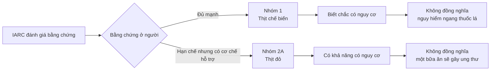
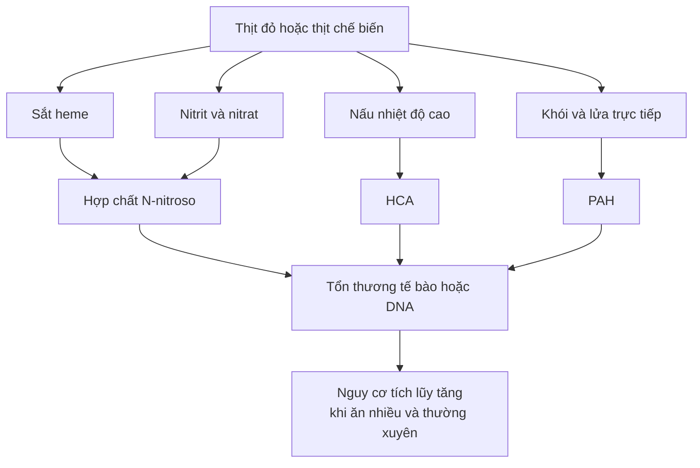
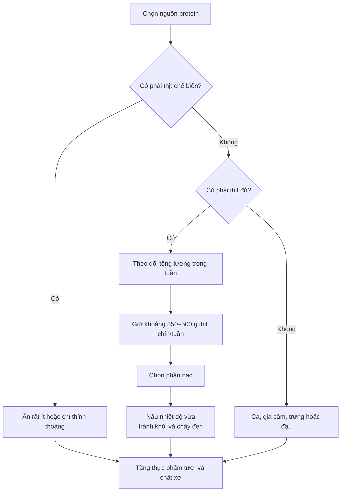

# 060 — Dieting Myth #8: Red Meat Causes Cancer

| Thuộc tính       | Nội dung                                |
| ---------------- | --------------------------------------- |
| **Module**       | Module 06 — Healthy Dieting             |
| **Bài học**      | Dieting Myth #8: Red Meat Causes Cancer |
| **Thời lượng**   | 02:31                                   |
| **Chủ đề chính** | Lầm tưởng 8: Thịt đỏ gây ung thư        |

> [!IMPORTANT]
> **Cách diễn đạt “thịt đỏ gây ung thư chỉ là lầm tưởng” không hoàn toàn chính xác.**
>
> Kết luận phù hợp với bằng chứng hiện nay là:
>
> * **Thịt chế biến sẵn** được IARC xếp vào **Nhóm 1 — có bằng chứng gây ung thư ở người**, chủ yếu liên quan đến ung thư đại trực tràng.
> * **Thịt đỏ** được xếp vào **Nhóm 2A — có khả năng gây ung thư ở người**, với mức độ chắc chắn thấp hơn thịt chế biến.
> * Điều này không có nghĩa một bữa thịt đỏ sẽ gây ung thư. Nguy cơ phụ thuộc vào **loại thịt, lượng ăn, tần suất, cách chế biến và toàn bộ lối sống trong thời gian dài**. ([IARC][1])

## Mục lục

1. [Mục tiêu bài học](#1-mục-tiêu-bài-học)
2. [Nội dung chính](#2-nội-dung-chính)
3. [Áp dụng thực tế](#3-áp-dụng-thực-tế)
4. [Lưu ý & lỗi thường gặp](#4-lưu-ý--lỗi-thường-gặp)
5. [Checklist thực hành](#5-checklist-thực-hành)
6. [Tóm tắt](#6-tóm-tắt)
7. [Tài liệu tham khảo](#7-tài-liệu-tham-khảo)

---

## 1. Mục tiêu bài học

Sau bài học, người học có thể:

* Phân biệt **thịt đỏ** với **thịt chế biến sẵn**.
* Hiểu đúng ý nghĩa của phân loại IARC Nhóm 1 và Nhóm 2A.
* Không đánh đồng thịt chế biến với thuốc lá chỉ vì chúng cùng thuộc Nhóm 1.
* Nhận biết các cơ chế có thể làm tăng nguy cơ ung thư đại trực tràng.
* Biết cách điều chỉnh khẩu phần và chế biến thịt để giảm nguy cơ.
* Xây dựng chế độ ăn cân bằng mà không cần hoảng sợ hoặc loại bỏ mọi loại thịt.

---

## 2. Nội dung chính

### 2.1. Trước hết, cần phân biệt hai nhóm thực phẩm

| Nhóm                  | Định nghĩa                                                                            | Ví dụ                                                              |
| --------------------- | ------------------------------------------------------------------------------------- | ------------------------------------------------------------------ |
| **Thịt đỏ tươi**      | Thịt cơ của động vật có vú, chưa được bảo quản bằng hun khói, ướp muối hoặc lên men   | Thịt bò, lợn, cừu, dê, bê                                          |
| **Thịt chế biến sẵn** | Thịt đã được biến đổi bằng ướp muối, xử lý, lên men, hun khói hoặc thêm chất bảo quản | Xúc xích, thịt nguội, giăm bông, thịt xông khói, salami, pepperoni |

Theo định nghĩa khoa học, **thịt lợn cũng được xếp vào thịt đỏ**. Ngoài ra, thịt chế biến không nhất thiết phải là thịt đỏ; thịt gà hoặc gà tây đã hun khói, ướp muối hay bổ sung chất bảo quản cũng có thể được xem là thịt chế biến. ([World Cancer Research Fund][2])

### Ảnh minh họa: phân loại thịt đỏ và thịt chế biến


*Nguồn ảnh: [Cancer Research UK — Meat and cancer classification](https://news.cancerresearchuk.org/2015/10/26/processed-meat-and-cancer-what-you-need-to-know/). Đây là hình minh họa cho phân loại IARC năm 2015; tình trạng phân loại của thịt đỏ và thịt chế biến hiện vẫn được IARC duy trì.* ([Cancer Research UK - Cancer News][3])

---

### 2.2. WHO/IARC thực sự kết luận điều gì?

Năm 2015, nhóm chuyên gia IARC đã xem xét hơn 800 nghiên cứu và đưa ra hai kết luận khác nhau:

| Thực phẩm         | Phân loại IARC | Ý nghĩa                                                                                               |
| ----------------- | -------------- | ----------------------------------------------------------------------------------------------------- |
| **Thịt chế biến** | **Nhóm 1**     | Có đủ bằng chứng ở người rằng việc tiêu thụ thịt chế biến gây ung thư đại trực tràng                  |
| **Thịt đỏ**       | **Nhóm 2A**    | Có khả năng gây ung thư ở người; bằng chứng dịch tễ học còn hạn chế nhưng có bằng chứng cơ chế hỗ trợ |

Phân loại IARC thể hiện **mức độ chắc chắn của bằng chứng rằng một tác nhân có thể gây ung thư**, không thể hiện tác nhân đó nguy hiểm đến mức nào hoặc sẽ gây ra bao nhiêu ca ung thư. Vì vậy, việc thịt chế biến và thuốc lá cùng nằm trong Nhóm 1 **không có nghĩa mức nguy hiểm của chúng ngang nhau**. ([IARC][1])



---

### 2.3. Nguy cơ lớn đến mức nào?

Phân tích được IARC trích dẫn ước tính rằng ăn thêm **50 g thịt chế biến mỗi ngày** có liên quan đến mức tăng khoảng **18% nguy cơ tương đối** mắc ung thư đại trực tràng. Đối với thịt đỏ, nếu mối liên hệ được xác nhận là nhân quả, mức tăng ước tính khoảng **17% cho mỗi 100 g ăn hằng ngày**, nhưng bằng chứng về thịt đỏ yếu hơn. ([IARC][1])

> [!NOTE]
> **Tăng 18% nguy cơ tương đối không có nghĩa nguy cơ tăng thêm 18 điểm phần trăm.**
>
> Ví dụ minh họa: nếu nguy cơ ban đầu giả định là 5%, mức tăng tương đối 18% sẽ đưa nguy cơ lên khoảng 5,9%, không phải 23%. Nguy cơ thực tế của mỗi người còn phụ thuộc tuổi, di truyền, cân nặng, hút thuốc, uống rượu, vận động, chế độ ăn và tiền sử bệnh.

Một nghiên cứu đoàn hệ lớn tại Anh cũng ghi nhận rằng nhóm tiêu thụ trung bình khoảng 79 g thịt đỏ và thịt chế biến mỗi ngày có nguy cơ ung thư đại trực tràng cao hơn nhóm ăn dưới 11 g/ngày, ngay cả sau khi các nhà nghiên cứu đã điều chỉnh nhiều yếu tố như hút thuốc, vận động, rượu, chỉ số khối cơ thể và các thành phần khác của chế độ ăn. ([Cancer Research UK - Cancer News][4])

---

### 2.4. Vì sao thịt đỏ và thịt chế biến có thể làm tăng nguy cơ?

Không chỉ có một cơ chế duy nhất. Các yếu tố chính đang được nghiên cứu gồm:

#### 1. Sắt heme có sẵn trong thịt đỏ

Sắt heme tạo nên màu đỏ của thịt và là dạng sắt cơ thể hấp thu tốt. Tuy nhiên, trong đường ruột, heme có thể thúc đẩy hình thành các hợp chất N-nitroso và gây tổn thương lớp tế bào lót đại tràng. Như vậy, không phải tất cả hợp chất liên quan đến nguy cơ đều chỉ xuất hiện khi thịt tiếp xúc với lửa; **heme vốn có trong thịt đỏ** cũng là một cơ chế được đề xuất. ([World Cancer Research Fund][2])

#### 2. Nitrit và nitrat trong thịt chế biến

Nitrit hoặc nitrat có thể được sử dụng để bảo quản, ổn định màu sắc và kéo dài thời gian sử dụng của xúc xích, thịt nguội hoặc thịt xông khói. Trong một số điều kiện, chúng có thể tham gia hình thành các hợp chất N-nitroso có khả năng gây tổn thương tế bào. ([World Cancer Research Fund][2])

#### 3. HCA hình thành khi nấu ở nhiệt độ cao

Các amin dị vòng, gọi tắt là **HCA**, có thể hình thành khi amino acid, đường và creatine trong thịt phản ứng ở nhiệt độ cao. Thịt nấu quá lâu, áp chảo nhiệt độ cao hoặc nướng cháy thường tạo ra nhiều HCA hơn. ([National Cancer Institute][5])

#### 4. PAH từ khói và ngọn lửa trực tiếp

Khi mỡ hoặc nước thịt nhỏ xuống than hay ngọn lửa, khói được tạo ra có thể chứa hydrocarbon thơm đa vòng, gọi tắt là **PAH**. PAH có thể bám trở lại bề mặt miếng thịt, đặc biệt khi nướng trực tiếp trên lửa hoặc hun khói. ([National Cancer Institute][5])



> [!CAUTION]
> NCI lưu ý rằng HCA và PAH gây đột biến trong thí nghiệm và gây ung thư ở động vật khi sử dụng liều rất cao. Tuy nhiên, nghiên cứu dân số chưa xác định chính xác mức nguy cơ ung thư ở người chỉ riêng từ HCA hoặc PAH trong thịt nấu chín. Vì vậy, không nên biến một cơ chế tiềm năng thành tuyên bố tuyệt đối rằng “một miếng thịt nướng cháy chắc chắn gây ung thư”. ([National Cancer Institute][6])

---

### 2.5. Lối sống có quan trọng không?

Có. Thừa cân hoặc béo phì, ít vận động, hút thuốc, uống rượu và chế độ ăn ít rau quả đều là những yếu tố có thể làm tăng nguy cơ ung thư đại trực tràng. Duy trì cân nặng phù hợp, vận động, không hút thuốc và ăn nhiều thực phẩm thực vật đều giúp giảm nguy cơ tổng thể. ([World Health Organization][7])

Tuy nhiên, phát biểu rằng **“chỉ những người thừa cân, không tập thể dục hoặc ăn uống kém mới có nguy cơ từ thịt”** là quá đơn giản. Các nghiên cứu dịch tễ học thường cố gắng điều chỉnh hút thuốc, cân nặng, vận động, rượu và nhiều yếu tố khác; sau điều chỉnh, mối liên hệ giữa lượng thịt chế biến cao và ung thư đại trực tràng vẫn được ghi nhận. Một lối sống tốt có thể giảm nguy cơ nền nhưng không nhất thiết triệt tiêu hoàn toàn ảnh hưởng của lượng thịt chế biến cao. ([Cancer Research UK - Cancer News][4])

---

### 2.6. Thịt đỏ vẫn có giá trị dinh dưỡng

Thịt đỏ cung cấp:

* Protein có giá trị sinh học cao.
* Sắt heme dễ hấp thu.
* Kẽm.
* Vitamin B12.
* Một số vitamin nhóm B khác.

Do đó, kết luận phù hợp không phải là “thịt đỏ hoàn toàn độc hại”, mà là **không nên ăn quá nhiều, quá thường xuyên và không nên để thịt chế biến trở thành nguồn protein chính**. ([IARC Publications][8])

---

## 3. Áp dụng thực tế

### 3.1. Ưu tiên giảm thịt chế biến trước

Nếu cần thay đổi một việc đầu tiên, hãy giảm:

* Xúc xích.
* Thịt nguội.
* Giăm bông.
* Thịt xông khói.
* Salami và pepperoni.
* Thịt hộp hoặc thịt được hun khói, ướp muối thường xuyên.

WCRF khuyến nghị ăn **rất ít hoặc không ăn thịt chế biến**, vì chưa xác định được một mức tiêu thụ hoàn toàn không liên quan đến nguy cơ ung thư đại trực tràng. ([World Cancer Research Fund][9])


*Nguồn ảnh: [Cancer Research UK](https://news.cancerresearchuk.org/2024/08/01/bacon-ham-hot-dogs-salami-how-does-processed-meat-cause-cancer-and-how-much-matters/).*

---

### 3.2. Kiểm soát tổng lượng thịt đỏ

WCRF khuyến nghị người có ăn thịt đỏ nên giới hạn ở khoảng:

* **350–500 g thịt đỏ đã nấu chín mỗi tuần**.
* Tương đương khoảng **3 khẩu phần vừa mỗi tuần**.
* Khoảng 500 g thịt chín tương đương 700–750 g thịt sống, tùy loại thịt và cách nấu. ([World Cancer Research Fund][2])

Ví dụ phân bổ:

| Ngày     | Nguồn protein chính             |
| -------- | ------------------------------- |
| Thứ Hai  | Cá                              |
| Thứ Ba   | 120–150 g thịt bò               |
| Thứ Tư   | Đậu phụ, đậu lăng hoặc đậu nành |
| Thứ Năm  | Thịt gà                         |
| Thứ Sáu  | 120–150 g thịt lợn              |
| Thứ Bảy  | Trứng hoặc cá                   |
| Chủ Nhật | 120–150 g thịt bò, cừu hoặc dê  |

Tổng lượng thịt đỏ của thực đơn mẫu vào khoảng **360–450 g thịt chín mỗi tuần**, nằm trong giới hạn khuyến nghị của WCRF.

---

### 3.3. Chọn cách nấu ít tạo khói và cháy xém

Nên ưu tiên:

* Hấp.
* Luộc.
* Kho hoặc hầm.
* Nướng trong lò với nhiệt độ vừa.
* Áp chảo nhanh ở nhiệt độ kiểm soát.
* Dùng nồi chiên hoặc lò nướng nhưng không để bề mặt cháy đen.

Nên hạn chế:

* Nướng thịt trực tiếp trên ngọn lửa.
* Để mỡ nhỏ xuống than tạo nhiều khói.
* Chiên hoặc áp chảo ở nhiệt độ rất cao trong thời gian dài.
* Ăn phần thịt đã cháy đen.
* Dùng nước sốt làm từ mỡ hoặc phần nước thịt cháy đọng lại.

Nấu ở nhiệt độ cao và kéo dài thường làm tăng sự hình thành HCA; tiếp xúc trực tiếp với khói và lửa làm tăng PAH trên bề mặt thực phẩm. ([National Cancer Institute][5])

---

### 3.4. Ướp thịt trước khi nấu

Một số nghiên cứu thực phẩm cho thấy các loại nước ướp chứa gia vị và chất chống oxy hóa có thể làm giảm sự hình thành một số HCA trong quá trình nấu. NCI Frederick cũng khuyến nghị ướp thịt ít nhất khoảng một giờ, lật thịt thường xuyên và loại bỏ phần cháy đen khi nướng. ([NCI Frederick][10])

Gợi ý nước ướp:

* Nước cốt chanh hoặc giấm.
* Tỏi, hành và gừng.
* Nghệ.
* Hương thảo.
* Tiêu và các loại thảo mộc.
* Một lượng vừa phải dầu ô liu.

> Ướp thịt chỉ giúp giảm một số hợp chất sinh ra khi nấu. Biện pháp này **không biến xúc xích, thịt xông khói hoặc thịt chế biến thành thực phẩm có thể ăn không giới hạn**.

---

### 3.5. Ăn thịt cùng một chế độ ăn giàu chất xơ

Chất xơ từ ngũ cốc nguyên hạt, đậu, rau và trái cây có liên quan đến sức khỏe đường ruột tốt hơn. Một bữa ăn hợp lý có thể được bố trí như sau:

* **½ đĩa:** rau củ.
* **¼ đĩa:** nguồn protein.
* **¼ đĩa:** cơm, khoai hoặc ngũ cốc nguyên hạt.
* Kèm trái cây hoặc sữa chua không đường tùy nhu cầu năng lượng.

Không nên sử dụng rau củ như một “chất giải độc” để bù trừ cho lượng lớn thịt chế biến. Lợi ích đến từ **mô hình ăn uống tổng thể được duy trì lâu dài**, không phải một nguyên liệu riêng lẻ có thể vô hiệu hóa thực phẩm khác. ([Cancer Research UK - Cancer News][4])

---

### 3.6. Quy trình lựa chọn nhanh



---

## 4. Lưu ý & lỗi thường gặp

### Lỗi 1: “Thịt chế biến cùng Nhóm 1 với thuốc lá nên nguy hiểm ngang thuốc lá”

**Sai.** Nhóm IARC phản ánh độ chắc chắn của bằng chứng về khả năng gây ung thư, không phản ánh kích thước nguy cơ. Thuốc lá gây ra mức nguy cơ và số ca ung thư lớn hơn rất nhiều. ([Cancer Research UK - Cancer News][4])

### Lỗi 2: “Chỉ thịt bị cháy mới có vấn đề”

**Không đầy đủ.** Nhiệt độ cao và khói tạo ra HCA, PAH, nhưng thịt đỏ còn chứa sắt heme, trong khi thịt chế biến có thể chứa nitrit, nitrat và các sản phẩm của quá trình hun khói hoặc xử lý. ([World Cancer Research Fund][2])

### Lỗi 3: “Tập thể dục sẽ bù được việc ăn nhiều thịt chế biến”

Vận động và cân nặng khỏe mạnh rất quan trọng nhưng không phải giấy phép để ăn không giới hạn. Các yếu tố nguy cơ có thể tồn tại đồng thời và không nhất thiết triệt tiêu lẫn nhau. ([World Health Organization][7])

### Lỗi 4: “Muốn phòng ung thư phải bỏ hoàn toàn thịt đỏ”

Không nhất thiết đối với phần lớn người khỏe mạnh. Có thể ăn thịt đỏ với lượng vừa phải, ưu tiên phần nạc và luân phiên với cá, gia cầm, trứng, đậu phụ và các loại đậu. ([World Cancer Research Fund][9])

### Lỗi 5: “Thịt hữu cơ hoặc thịt đắt tiền không có nguy cơ”

Thịt có chất lượng tốt có thể có lợi về hương vị, an toàn thực phẩm hoặc thành phần dinh dưỡng, nhưng không loại bỏ sắt heme hay các hợp chất được tạo ra khi nướng cháy. Cách chế biến và tổng lượng tiêu thụ vẫn quan trọng. ([Cancer Research UK - Cancer News][4])

### Lỗi 6: “Ướp thịt là đủ để ngăn ung thư”

Ướp thịt có thể làm giảm sự hình thành một số HCA trong thí nghiệm thực phẩm, nhưng chưa chứng minh rằng nó loại bỏ hoàn toàn nguy cơ ung thư ở người. Đây chỉ là một biện pháp giảm phơi nhiễm, không phải biện pháp bảo vệ tuyệt đối. ([PubMed][11])

### Lỗi 7: “Ăn một bữa thịt đỏ sẽ gây ung thư”

Ung thư là bệnh đa yếu tố phát triển qua thời gian dài. Vấn đề chính là **mô hình tiêu thụ thường xuyên với lượng cao**, đặc biệt là thịt chế biến, chứ không phải một bữa ăn đơn lẻ. ([IARC][1])

---

## 5. Checklist thực hành

* [ ] Phân biệt được thịt đỏ tươi và thịt chế biến.
* [ ] Không dùng xúc xích, thịt nguội hoặc bacon làm nguồn protein hằng ngày.
* [ ] Giữ tổng lượng thịt đỏ trong khoảng 350–500 g thịt chín mỗi tuần.
* [ ] Chọn phần thịt nạc và loại bỏ mỡ thừa.
* [ ] Luân phiên thịt đỏ với cá, gà, trứng, đậu phụ và các loại đậu.
* [ ] Tránh nướng trực tiếp trên ngọn lửa trong thời gian dài.
* [ ] Không ăn phần thịt cháy đen.
* [ ] Có thể ướp thịt trước khi nướng hoặc áp chảo.
* [ ] Ăn đủ rau, trái cây, đậu và ngũ cốc nguyên hạt.
* [ ] Duy trì cân nặng phù hợp và vận động thường xuyên.
* [ ] Không hút thuốc.
* [ ] Hạn chế rượu bia.
* [ ] Không xem bất kỳ một thực phẩm riêng lẻ nào là nguyên nhân duy nhất hoặc biện pháp phòng ngừa tuyệt đối đối với ung thư.

---

## 6. Tóm tắt

> **Thịt đỏ không phải là chất độc khiến người ăn chắc chắn mắc ung thư, nhưng cũng không chính xác khi phủ nhận hoàn toàn mối liên hệ.**

* Thịt chế biến có bằng chứng rõ ràng hơn và được IARC xếp vào **Nhóm 1**.
* Thịt đỏ được xếp vào **Nhóm 2A**, nghĩa là có khả năng gây ung thư.
* Mối liên hệ mạnh nhất được ghi nhận với **ung thư đại trực tràng**.
* Nguy cơ có xu hướng tăng khi ăn nhiều và ăn thường xuyên.
* Heme trong thịt đỏ, nitrit và nitrat trong thịt chế biến, cùng HCA và PAH từ quá trình nấu là những cơ chế tiềm năng.
* Một chế độ sống lành mạnh giúp giảm nguy cơ tổng thể nhưng không thể biến lượng lớn thịt chế biến thành vô hại.
* Ưu tiên ăn rất ít thịt chế biến, giữ thịt đỏ ở mức vừa phải, tránh cháy xém và đa dạng hóa nguồn protein.

**Thông điệp thực hành:**

```text
Không cần hoảng sợ và bỏ mọi loại thịt
                    ↓
Giảm thịt chế biến trước
                    ↓
Ăn thịt đỏ với lượng vừa phải
                    ↓
Tránh nướng cháy và khói trực tiếp
                    ↓
Tăng rau, chất xơ và nguồn protein thay thế
                    ↓
Duy trì lối sống khỏe mạnh lâu dài
```

> Người đang điều trị ung thư, từng mắc ung thư đại trực tràng, thiếu máu thiếu sắt hoặc có nhu cầu dinh dưỡng đặc biệt nên trao đổi với bác sĩ hoặc chuyên gia dinh dưỡng trước khi cắt giảm mạnh một nhóm thực phẩm.

---

## 7. Tài liệu tham khảo

1. [WHO — Cancer: Carcinogenicity of the consumption of red meat and processed meat](https://www.who.int/news-room/questions-and-answers/item/cancer-carcinogenicity-of-the-consumption-of-red-meat-and-processed-meat) ([World Health Organization][12])
2. [IARC — Red Meat and Processed Meat, Monograph Volume 114](https://publications.iarc.who.int/564) ([IARC Publications][8])
3. [IARC — Press release: Evaluation of red meat and processed meat](https://www.iarc.who.int/wp-content/uploads/2018/07/pr240_E.pdf) ([IARC][1])
4. [World Cancer Research Fund — Limit red and processed meat](https://www.wcrf.org/research-policy/evidence-for-our-recommendations/limit-red-processed-meat/) ([World Cancer Research Fund][9])
5. [World Cancer Research Fund — Meat and cancer](https://www.wcrf.org/preventing-cancer/topics/meat-and-cancer/) ([World Cancer Research Fund][2])
6. [National Cancer Institute — Chemicals in meat cooked at high temperatures](https://www.cancer.gov/about-cancer/causes-prevention/risk/diet/cooked-meats-fact-sheet) ([National Cancer Institute][5])
7. [WHO — Colorectal cancer fact sheet](https://www.who.int/news-room/fact-sheets/detail/colorectal-cancer) ([World Health Organization][7])
8. [PubMed — Effect of marinades on the formation of heterocyclic amines in grilled beef](https://pubmed.ncbi.nlm.nih.gov/19241593/) ([PubMed][11])

[1]: https://www.iarc.who.int/wp-content/uploads/2018/07/pr240_E.pdf?utm_source=chatgpt.com "IARC Monographs evaluate consumption of red meat and ..."
[2]: https://www.wcrf.org/preventing-cancer/topics/meat-and-cancer/ "Meat and cancer | World Cancer Research Fund"
[3]: https://news.cancerresearchuk.org/2015/10/26/processed-meat-and-cancer-what-you-need-to-know/ "Processed meat and cancer – what you need to know"
[4]: https://news.cancerresearchuk.org/2024/08/01/bacon-ham-hot-dogs-salami-how-does-processed-meat-cause-cancer-and-how-much-matters/ "How does processed meat cause cancer and how much matters?"
[5]: https://www.cancer.gov/about-cancer/causes-prevention/risk/diet/cooked-meats-fact-sheet "Chemicals in Meat Cooked at High Temperatures and Cancer Risk - NCI"
[6]: https://www.cancer.gov/about-cancer/causes-prevention/risk/diet/cooked-meats-fact-sheet?utm_source=chatgpt.com "Chemicals in Meat Cooked at High Temperatures and ..."
[7]: https://www.who.int/news-room/fact-sheets/detail/colorectal-cancer?utm_source=chatgpt.com "Colorectal cancer"
[8]: https://publications.iarc.who.int/Book-And-Report-Series/Iarc-Monographs-On-The-Identification-Of-Carcinogenic-Hazards-To-Humans/Red-Meat-And-Processed-Meat-2018 "IARC Publications Website - Red Meat and Processed Meat"
[9]: https://www.wcrf.org/research-policy/evidence-for-our-recommendations/limit-red-processed-meat/ "Limit consumption of red and processed meat | Recommendation evidence | World Cancer Research Fund"
[10]: https://ncifrederick.cancer.gov/about/theposter/content/grilling-healthier-mindset?utm_source=chatgpt.com "Health & Safety - Grilling with a Healthier Mindset"
[11]: https://pubmed.ncbi.nlm.nih.gov/19241593/?utm_source=chatgpt.com "Effect of marinades on the formation of heterocyclic amines ..."
[12]: https://www.who.int/news-room/questions-and-answers/item/cancer-carcinogenicity-of-the-consumption-of-red-meat-and-processed-meat?utm_source=chatgpt.com "Cancer: Carcinogenicity of the consumption of red meat ..."
