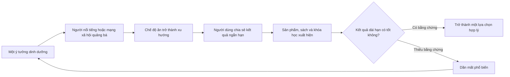
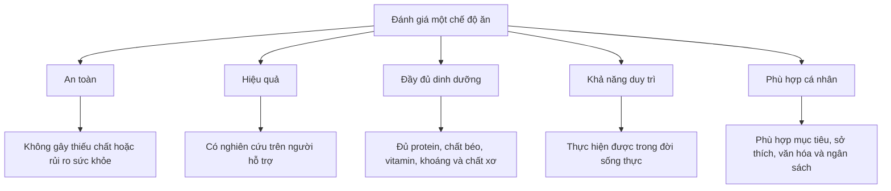
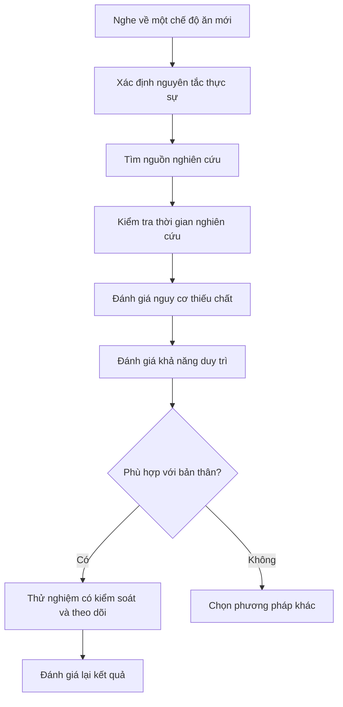

# 061 — Giới thiệu các chế độ ăn phổ biến

## Common Diets Introduction

| Thuộc tính             | Nội dung                                                                                              |
| ---------------------- | ----------------------------------------------------------------------------------------------------- |
| **Module**             | Module 07 — Common Dieting Trends Explained                                                           |
| **Bài học**            | Common Diets Introduction                                                                             |
| **Thời lượng**         | 00:52                                                                                                 |
| **Chủ đề chính**       | Giới thiệu các chế độ ăn phổ biến                                                                     |
| **Mục tiêu tổng quát** | Hiểu cách đánh giá một chế độ ăn dựa trên cơ chế, bằng chứng khoa học, độ an toàn và khả năng duy trì |

> **Thông điệp cốt lõi:** Một chế độ ăn đang thịnh hành chưa chắc là chế độ ăn tốt nhất. Giá trị thực sự của nó phụ thuộc vào bằng chứng khoa học, chất lượng thực phẩm, mức độ phù hợp với cá nhân và khả năng duy trì lâu dài.


*Nguồn ảnh: World Health Organization. WHO nhấn mạnh chế độ ăn lành mạnh cần đa dạng thực phẩm, đồng thời hạn chế đường, muối, chất béo bão hòa và chất béo chuyển hóa công nghiệp.* ([World Health Organization][1])

---

## Mục lục

1. [Mục tiêu bài học](#1-mục-tiêu-bài-học)
2. [Nội dung chính](#2-nội-dung-chính)
3. [Áp dụng thực tế](#3-áp-dụng-thực-tế)
4. [Lưu ý và lỗi thường gặp](#4-lưu-ý-và-lỗi-thường-gặp)
5. [Checklist thực hành](#5-checklist-thực-hành)
6. [Tóm tắt](#6-tóm-tắt)

---

## 1. Mục tiêu bài học

Sau bài học này, người học có thể:

* Nhận biết rằng các chế độ ăn thường xuất hiện và biến mất theo từng xu hướng.
* Phân biệt giữa một **nguyên tắc dinh dưỡng hợp lý** và một **trào lưu ăn kiêng nhất thời**.
* Hiểu rằng mỗi chế độ ăn có thể phù hợp với một số người, mục tiêu hoặc tình trạng sức khỏe nhất định.
* Không đánh giá chế độ ăn chỉ dựa vào quảng cáo, lời chứng thực hoặc ảnh “trước và sau”.
* Biết sử dụng các tiêu chí khách quan như:

  * bằng chứng khoa học;
  * mức độ an toàn;
  * tính đầy đủ dinh dưỡng;
  * khả năng duy trì;
  * mức độ phù hợp với sức khỏe và lối sống cá nhân.
* Chuẩn bị nền tảng để tìm hiểu những chế độ ăn phổ biến trong các bài tiếp theo.

---

## 2. Nội dung chính

### 2.1. Sau các lầm tưởng dinh dưỡng là những trào lưu ăn kiêng

Ở module trước, chúng ta đã xem xét một số lầm tưởng phổ biến như:

* carbohydrate luôn có hại;
* chất béo luôn có hại;
* protein gây tổn thương cơ thể;
* ăn trứng chắc chắn làm tăng cholesterol;
* phải tránh hoàn toàn muối;
* ăn nhiều bữa nhỏ sẽ làm tăng trao đổi chất;
* thực phẩm gắn nhãn “diet” tự động giúp giảm mỡ;
* mọi loại thịt đỏ đều gây ung thư.

Bước tiếp theo là tìm hiểu những **chế độ ăn có tên gọi cụ thể** từng hoặc đang được nhiều người áp dụng.

Một số chế độ ăn được xây dựng dựa trên những nguyên tắc hợp lý. Tuy nhiên, một số khác được quảng bá quá mức, đơn giản hóa vấn đề hoặc đưa ra những lời hứa chưa được bằng chứng khoa học hỗ trợ đầy đủ.

---

### 2.2. Ngành công nghiệp ăn kiêng có nhiều điểm giống thời trang

Các chế độ ăn thường trở thành xu hướng theo chu kỳ:



Một chế độ ăn có thể trở nên nổi tiếng vì:

* có quy tắc đơn giản, dễ truyền đạt;
* hứa hẹn kết quả nhanh;
* loại bỏ một nhóm thực phẩm cụ thể;
* được người nổi tiếng hoặc người có ảnh hưởng quảng bá;
* tạo ra cảm giác rằng người dùng đã tìm được một “bí quyết” mới;
* có nhiều câu chuyện thành công nhưng ít thông tin về những người đã bỏ cuộc.

NIDDK cảnh báo nên thận trọng với các chương trình hứa hẹn giảm cân cực nhanh, giảm cân mà không cần thay đổi ăn uống hoặc vận động, hay giảm mỡ tại một vị trí cụ thể trên cơ thể. ([Viện Quốc gia về Bệnh Tiểu đường và Thận][2])

---

### 2.3. “Chế độ ăn” không chỉ có nghĩa là giảm cân

Trong khoa học dinh dưỡng, **diet** có thể được hiểu rộng hơn là cách một người lựa chọn, phân bổ và tiêu thụ thực phẩm trong thời gian dài.

Một chế độ ăn có thể được thiết kế để:

| Mục tiêu                         | Ví dụ định hướng                                              |
| -------------------------------- | ------------------------------------------------------------- |
| **Giảm cân hoặc giảm mỡ**        | Giảm tổng năng lượng, kiểm soát khẩu phần                     |
| **Tăng cơ**                      | Đủ năng lượng, protein và carbohydrate phục vụ tập luyện      |
| **Kiểm soát đường huyết**        | Điều chỉnh chất lượng và lượng carbohydrate                   |
| **Hỗ trợ sức khỏe tim mạch**     | Tăng thực phẩm nguyên chất, chất xơ và chất béo không bão hòa |
| **Phù hợp đạo đức hoặc văn hóa** | Ăn chay, thuần chay, chế độ ăn theo tôn giáo                  |
| **Điều trị y khoa**              | Chế độ ăn được chuyên gia thiết kế cho bệnh lý cụ thể         |
| **Đơn giản hóa việc ăn uống**    | Giới hạn thời gian ăn hoặc giới hạn nhóm thực phẩm            |

Do đó, không nên hỏi đơn giản:

> “Chế độ ăn này có tốt không?”

Câu hỏi phù hợp hơn là:

> “Chế độ ăn này tốt cho ai, nhằm mục tiêu gì, trong khoảng thời gian nào và có thể duy trì an toàn hay không?”

---

### 2.4. Các chế độ ăn phổ biến khác nhau ở điểm nào?

Phần lớn các chế độ ăn có thể được phân loại theo một hoặc nhiều đặc điểm sau:

| Nhóm                                    | Nguyên tắc chính                                         | Ví dụ                                 |
| --------------------------------------- | -------------------------------------------------------- | ------------------------------------- |
| **Điều chỉnh carbohydrate**             | Hạn chế lượng carbohydrate                               | Low-carb, ketogenic                   |
| **Điều chỉnh chất béo**                 | Giảm tỷ lệ năng lượng từ chất béo                        | Low-fat                               |
| **Điều chỉnh protein**                  | Tăng tỷ lệ hoặc lượng protein                            | High-protein                          |
| **Điều chỉnh thời gian ăn**             | Quy định khung giờ hoặc ngày ăn                          | Intermittent fasting                  |
| **Tập trung vào mô hình thực phẩm**     | Ưu tiên một số nhóm thực phẩm có lợi                     | Mediterranean, DASH                   |
| **Loại bỏ nhóm thực phẩm**              | Không sử dụng một hoặc nhiều nhóm thực phẩm              | Vegan, Paleo, gluten-free             |
| **Kiểm soát khẩu phần hoặc năng lượng** | Quy định lượng thức ăn hoặc calorie                      | Calorie restriction, meal replacement |
| **Cá nhân hóa**                         | Điều chỉnh theo sức khỏe, sở thích hoặc phản ứng cá nhân | Personalized diet                     |

Nhiều chế độ giảm cân hoạt động bằng cách trực tiếp hoặc gián tiếp giúp người áp dụng giảm tổng năng lượng ăn vào. Tuy nhiên, một chương trình phù hợp còn phải đáp ứng nhu cầu sức khỏe, văn hóa, sở thích và có thể duy trì lâu dài. ([Viện Quốc gia về Bệnh Tiểu đường và Thận][2])

---

### 2.5. Không có một chế độ ăn hoàn hảo cho tất cả mọi người

Một chế độ ăn có thể mang lại kết quả tốt cho người này nhưng không phù hợp với người khác vì sự khác biệt về:

* tình trạng sức khỏe;
* nhu cầu năng lượng;
* mức độ vận động;
* sở thích thực phẩm;
* văn hóa và thói quen gia đình;
* ngân sách;
* thời gian nấu ăn;
* khả năng tuân thủ;
* mục tiêu giảm mỡ, tăng cơ hay cải thiện sức khỏe.

Harvard Nutrition Source lưu ý rằng không có một chế độ ăn “hoàn hảo” cho tất cả mọi người do sự khác biệt về lối sống và đặc điểm cá nhân. Thay vì chỉ tập trung vào calorie, chất lượng của thực phẩm cũng là một yếu tố quan trọng. ([The Nutrition Source][3])

---

### 2.6. Điều gì quan trọng hơn tên của chế độ ăn?

Một chế độ ăn nên được xem xét dựa trên các nền tảng sau:



#### Năm câu hỏi nền tảng

1. **Chế độ ăn có đủ chất không?**
2. **Có bằng chứng từ nghiên cứu trên người không?**
3. **Kết quả được đo trong bao lâu?**
4. **Người áp dụng có thể duy trì lâu dài không?**
5. **Nó có phù hợp với sức khỏe và mục tiêu cá nhân không?**

---

### 2.7. Khoa học nói gì về các chế độ ăn phổ biến?

Một tổng quan hệ thống và phân tích mạng đăng trên *The BMJ* đã so sánh 14 chương trình ăn kiêng phổ biến, dựa trên 121 thử nghiệm ngẫu nhiên với 21.942 người trưởng thành.

Kết quả cho thấy:

* sau khoảng sáu tháng, đa số mô hình ăn kiêng tạo ra mức giảm cân tương đối khiêm tốn và cải thiện một số chỉ số huyết áp;
* khác biệt giữa các chế độ ăn nhìn chung không lớn;
* đến 12 tháng, phần lớn lợi ích về giảm cân và yếu tố nguy cơ tim mạch đã suy giảm;
* điều này gợi ý rằng khả năng duy trì hành vi có thể quan trọng không kém tên gọi của chế độ ăn. ([BMJ][4])

#### Hình nghiên cứu: so sánh 14 chế độ ăn phổ biến


*Nguồn: Ge và cộng sự, The BMJ, 2020. Trong trường hợp trình đọc Markdown chặn ảnh từ BMJ, có thể xem nghiên cứu qua trang bài báo.* ([BMJ][4])

Một tổng quan Cochrane cũng nhận thấy chế độ low-carb và chế độ carbohydrate cân bằng có thể tạo ra rất ít hoặc không có khác biệt đáng kể về giảm cân và các yếu tố nguy cơ tim mạch trong thời gian theo dõi đến khoảng hai năm. ([Cochrane Library][5])

> **Kết luận khoa học sơ bộ:** Không nên mặc định rằng một chế độ ăn sẽ vượt trội chỉ vì nó cắt bỏ carbohydrate, chất béo hoặc quy định một khung giờ ăn đặc biệt.

---

### 2.8. Chất lượng thực phẩm vẫn là nền tảng chung

Dù lựa chọn mô hình ăn uống nào, một chế độ ăn lành mạnh thường vẫn ưu tiên:

* rau củ và trái cây đa dạng;
* ngũ cốc nguyên hạt;
* các nguồn protein phù hợp;
* đậu, hạt và các nguồn chất xơ;
* chất béo không bão hòa;
* nước và đồ uống ít hoặc không thêm đường;
* thực phẩm ít qua chế biến.

WHO khuyến nghị chế độ ăn đa dạng và hạn chế đường, muối, chất béo bão hòa cùng chất béo chuyển hóa công nghiệp. Harvard Healthy Eating Plate cũng đề xuất khoảng một nửa bữa ăn là rau quả, một phần tư là ngũ cốc nguyên hạt và một phần tư là protein lành mạnh. ([World Health Organization][1])


*Nguồn: Harvard T.H. Chan School of Public Health. Hình được sử dụng nhằm mục đích giáo dục, kèm ghi nguồn theo hướng dẫn của Harvard.* ([The Nutrition Source][6])

---

## 3. Áp dụng thực tế

### 3.1. Quy trình đánh giá một chế độ ăn mới

Khi nghe đến một chế độ ăn đang thịnh hành, hãy áp dụng quy trình:



---

### 3.2. Bảy câu hỏi cần đặt ra

#### 1. Chế độ ăn này hứa hẹn điều gì?

Cẩn thận với các thông điệp như:

* “giảm 10 kg trong vài tuần”;
* “không cần kiểm soát khẩu phần”;
* “ăn bao nhiêu cũng được”;
* “thải mọi độc tố”;
* “đốt mỡ tại bụng”;
* “phù hợp với tất cả mọi người”.

Những lời hứa cực đoan là dấu hiệu cảnh báo được NIDDK khuyên người dùng nên tránh. ([Viện Quốc gia về Bệnh Tiểu đường và Thận][2])

#### 2. Cơ chế được giải thích có hợp lý không?

Ví dụ, một chế độ ăn có thể giúp giảm cân vì:

* giảm số lượng thực phẩm có thể lựa chọn;
* tăng protein hoặc chất xơ, hỗ trợ cảm giác no;
* giảm thức ăn siêu chế biến;
* tạo ra khung giờ ăn rõ ràng;
* giúp giảm tổng năng lượng tiêu thụ.

Không nên mặc định rằng kết quả đến từ một cơ chế “đặc biệt” nếu chưa loại trừ các yếu tố đơn giản hơn.

#### 3. Bằng chứng thuộc loại nào?

Thứ tự tham khảo tương đối:

```text
Tổng quan hệ thống / phân tích gộp
                  ↓
Thử nghiệm ngẫu nhiên có đối chứng
                  ↓
Nghiên cứu quan sát
                  ↓
Ý kiến chuyên gia
                  ↓
Trải nghiệm cá nhân / lời chứng thực
```

Trải nghiệm cá nhân có thể hữu ích để hình thành giả thuyết, nhưng không đủ để chứng minh một chế độ ăn hiệu quả hoặc an toàn cho số đông.

#### 4. Nghiên cứu kéo dài bao lâu?

Một chế độ ăn có thể tạo kết quả trong 4–12 tuần nhưng khó duy trì trong 1–2 năm. Vì vậy, cần phân biệt:

* **hiệu quả ngắn hạn**;
* **khả năng duy trì cân nặng**;
* **tác động sức khỏe dài hạn**.

#### 5. Chế độ ăn có loại bỏ quá nhiều thực phẩm không?

Việc loại bỏ toàn bộ nhóm thực phẩm có thể:

* làm giảm sự đa dạng;
* gây khó khăn khi ăn cùng gia đình;
* tăng chi phí;
* làm tăng nguy cơ thiếu một số chất;
* khiến người dùng dễ bỏ cuộc.

#### 6. Có phù hợp với lịch sống không?

Một chế độ ăn chỉ có giá trị thực tế khi có thể thực hiện được trong:

* lịch học hoặc lịch làm việc;
* ngân sách hiện có;
* điều kiện nấu ăn;
* thói quen gia đình;
* các buổi gặp gỡ xã hội;
* lịch tập luyện.

#### 7. Có cần chuyên gia giám sát không?

Người có bệnh nền, đang dùng thuốc, mang thai, cho con bú hoặc có tiền sử rối loạn ăn uống nên trao đổi với bác sĩ hoặc chuyên gia dinh dưỡng trước khi thực hiện một chế độ ăn hạn chế nghiêm ngặt. NIDDK cũng khuyến nghị thảo luận với chuyên gia y tế để lựa chọn phương pháp phù hợp với sức khỏe và nhu cầu cá nhân. ([Viện Quốc gia về Bệnh Tiểu đường và Thận][2])

---

### 3.3. Bảng chấm điểm nhanh

Có thể chấm mỗi tiêu chí từ **0–2 điểm**:

| Tiêu chí              | 0 điểm                       | 1 điểm                      | 2 điểm                          |
| --------------------- | ---------------------------- | --------------------------- | ------------------------------- |
| **Bằng chứng**        | Chỉ có quảng cáo             | Có nghiên cứu nhưng hạn chế | Có nhiều nghiên cứu chất lượng  |
| **An toàn**           | Có nguy cơ rõ ràng           | An toàn khi theo dõi        | An toàn với đa số người phù hợp |
| **Đầy đủ dinh dưỡng** | Loại bỏ nhiều nhóm thực phẩm | Cần lên kế hoạch bổ sung    | Đa dạng và cân bằng             |
| **Khả năng duy trì**  | Quá khắt khe                 | Có thể làm ngắn hạn         | Có thể duy trì lâu dài          |
| **Tính cá nhân hóa**  | Một công thức cho tất cả     | Điều chỉnh được một phần    | Phù hợp sức khỏe và lối sống    |
| **Chi phí**           | Rất đắt                      | Chi phí trung bình          | Phù hợp ngân sách               |
| **Mức độ linh hoạt**  | Không có ngoại lệ            | Linh hoạt hạn chế           | Dễ áp dụng trong đời sống       |

#### Diễn giải

* **0–5 điểm:** nên thận trọng hoặc tránh.
* **6–9 điểm:** cần nghiên cứu thêm và điều chỉnh.
* **10–12 điểm:** có thể là lựa chọn hợp lý với một số người.
* **13–14 điểm:** có nền tảng tốt, nhưng vẫn cần theo dõi phản ứng cá nhân.

> Bảng trên là công cụ tư duy, không phải thang đo y khoa đã được xác nhận.

---

## 4. Lưu ý và lỗi thường gặp

### Lỗi 1: Đồng nhất “phổ biến” với “hiệu quả”

Một chế độ ăn có nhiều người theo không đồng nghĩa với việc nó:

* đã được kiểm chứng dài hạn;
* an toàn cho mọi người;
* tốt hơn các phương pháp khác.

---

### Lỗi 2: Chỉ nhìn vào kết quả giảm cân ban đầu

Trong những tuần đầu, cân nặng có thể giảm do:

* giảm glycogen;
* thay đổi lượng nước;
* giảm lượng thức ăn trong hệ tiêu hóa;
* giảm calorie đột ngột.

Vì vậy, cân nặng giảm nhanh ban đầu không nhất thiết đồng nghĩa với giảm lượng mỡ tương ứng.

---

### Lỗi 3: Chỉ hỏi “low-carb hay low-fat tốt hơn?”

Câu hỏi này bỏ qua nhiều yếu tố quan trọng:

* chất lượng thực phẩm;
* tổng năng lượng;
* protein và chất xơ;
* mức độ chế biến;
* khả năng tuân thủ;
* tình trạng sức khỏe.

Nghiên cứu hiện có cho thấy khác biệt trung bình giữa nhiều mô hình ăn kiêng thường nhỏ, đặc biệt khi đánh giá dài hạn. ([BMJ][4])

---

### Lỗi 4: Nghĩ rằng phải tuân thủ 100% mới có kết quả

Một chế độ ăn quá cứng nhắc có thể tạo tư duy:

```text
Ăn đúng hoàn toàn
        ↓
Một bữa không đúng kế hoạch
        ↓
Cảm giác thất bại
        ↓
Ăn mất kiểm soát
        ↓
Bỏ toàn bộ chế độ
```

Cách tiếp cận linh hoạt thường thực tế hơn:

```text
Phần lớn bữa ăn có chất lượng tốt
        +
Một phần thực phẩm theo sở thích
        =
Kế hoạch dễ duy trì hơn
```

---

### Lỗi 5: Tin rằng thực phẩm riêng lẻ quyết định toàn bộ kết quả

Không có một thực phẩm đơn lẻ tự động:

* gây béo;
* đốt mỡ;
* “thải độc” toàn bộ cơ thể;
* làm một chế độ ăn trở nên lành mạnh.

Cần đánh giá **toàn bộ mô hình ăn uống** và thói quen được duy trì theo thời gian.

---

### Lỗi 6: Bỏ qua sức khỏe tâm lý và đời sống xã hội

Một chế độ ăn không nên khiến người áp dụng:

* ám ảnh quá mức về thực phẩm;
* sợ ăn ngoài;
* tránh giao tiếp xã hội;
* thường xuyên cảm thấy tội lỗi sau khi ăn;
* phải liên tục bắt đầu lại từ đầu.

---

### Lỗi 7: Tự áp dụng chế độ ăn điều trị

Các chế độ được sử dụng trong điều trị bệnh lý có thể yêu cầu:

* xét nghiệm;
* điều chỉnh thuốc;
* theo dõi điện giải;
* theo dõi đường huyết;
* bổ sung vitamin hoặc khoáng chất;
* giám sát bởi chuyên gia.

Không nên sao chép một chế độ điều trị y khoa chỉ vì nó đang phổ biến trên mạng.

---

## 5. Checklist thực hành

### Trước khi áp dụng một chế độ ăn

* [ ] Tôi đã xác định rõ mục tiêu của mình.
* [ ] Tôi hiểu nguyên tắc thật sự của chế độ ăn.
* [ ] Tôi đã kiểm tra nguồn nghiên cứu, không chỉ xem video quảng cáo.
* [ ] Tôi biết nghiên cứu kéo dài bao lâu.
* [ ] Tôi đã xem xét nguy cơ thiếu chất.
* [ ] Chế độ ăn không yêu cầu mua quá nhiều sản phẩm độc quyền.
* [ ] Chế độ ăn phù hợp với ngân sách.
* [ ] Chế độ ăn phù hợp với lịch học, làm việc và tập luyện.
* [ ] Tôi vẫn có thể ăn uống cùng gia đình hoặc bạn bè.
* [ ] Tôi có kế hoạch theo dõi cân nặng, sức khỏe và hiệu suất tập luyện.
* [ ] Tôi biết khi nào cần dừng hoặc điều chỉnh.
* [ ] Tôi đã hỏi chuyên gia nếu có bệnh nền hoặc đang dùng thuốc.

### Dấu hiệu cảnh báo

* [ ] Hứa giảm cân cực nhanh.
* [ ] Khẳng định phù hợp với tất cả mọi người.
* [ ] Bắt buộc mua thực phẩm bổ sung hoặc sản phẩm độc quyền.
* [ ] Cấm hoàn toàn nhiều nhóm thực phẩm mà không có lý do y khoa.
* [ ] Chỉ sử dụng ảnh trước–sau làm bằng chứng.
* [ ] Không công bố tác dụng phụ hoặc tỷ lệ bỏ cuộc.
* [ ] Khẳng định giới y khoa đang “che giấu bí mật”.
* [ ] Không có kế hoạch duy trì kết quả sau khi kết thúc chế độ.

Nếu đánh dấu nhiều mục trong phần cảnh báo, nên xem xét lại trước khi áp dụng.

---

## 6. Tóm tắt

* Thị trường ăn kiêng thay đổi liên tục, tương tự các xu hướng thời trang.
* Một số chế độ ăn chứa các nguyên tắc hữu ích, trong khi một số khác chỉ là trào lưu ngắn hạn.
* Không nên đánh giá chế độ ăn dựa trên độ phổ biến, người quảng bá hoặc kết quả của một cá nhân.
* Các chế độ ăn thường khác nhau về:

  * tỷ lệ các chất đa lượng;
  * thời gian ăn;
  * nhóm thực phẩm được ưu tiên;
  * nhóm thực phẩm bị loại bỏ;
  * cách kiểm soát năng lượng.
* Nghiên cứu cho thấy nhiều chế độ ăn phổ biến có thể tạo mức giảm cân khiêm tốn trong ngắn hạn, nhưng sự khác biệt thường giảm dần theo thời gian. ([BMJ][4])
* Một chế độ ăn phù hợp cần:

  * an toàn;
  * đầy đủ dinh dưỡng;
  * có bằng chứng;
  * phù hợp với cá nhân;
  * có thể duy trì lâu dài.
* Tên gọi của chế độ ăn ít quan trọng hơn chất lượng thực phẩm và các hành vi mà người áp dụng có thể duy trì.
* Các bài tiếp theo sẽ phân tích từng chế độ ăn dựa trên cơ chế, ưu điểm, hạn chế và bằng chứng khách quan.

> **Ghi nhớ:** Chế độ ăn tốt nhất không nhất thiết là chế độ đang nổi tiếng nhất, mà là chế độ an toàn, có cơ sở khoa học và đủ thực tế để bạn duy trì trong đời sống lâu dài.

[1]: https://www.who.int/initiatives/behealthy/healthy-diet "Healthy diet"
[2]: https://www.niddk.nih.gov/health-information/weight-management/choosing-a-safe-successful-weight-loss-program "Choosing a Safe & Successful Weight-loss Program - NIDDK"
[3]: https://nutritionsource.hsph.harvard.edu/healthy-weight/best-diet-quality-counts/ "The Best Diet: Quality Counts • The Nutrition Source"
[4]: https://www.bmj.com/content/369/bmj.m696?utm_source=chatgpt.com "Comparison of dietary macronutrient patterns of 14 popular ..."
[5]: https://www.cochranelibrary.com/cdsr/doi/10.1002/14651858.CD013334.pub2/full?utm_source=chatgpt.com "Low‐carbohydrate versus balanced‐carbohydrate diets for ..."
[6]: https://nutritionsource.hsph.harvard.edu/healthy-eating-plate/ "Healthy Eating Plate • The Nutrition Source"
