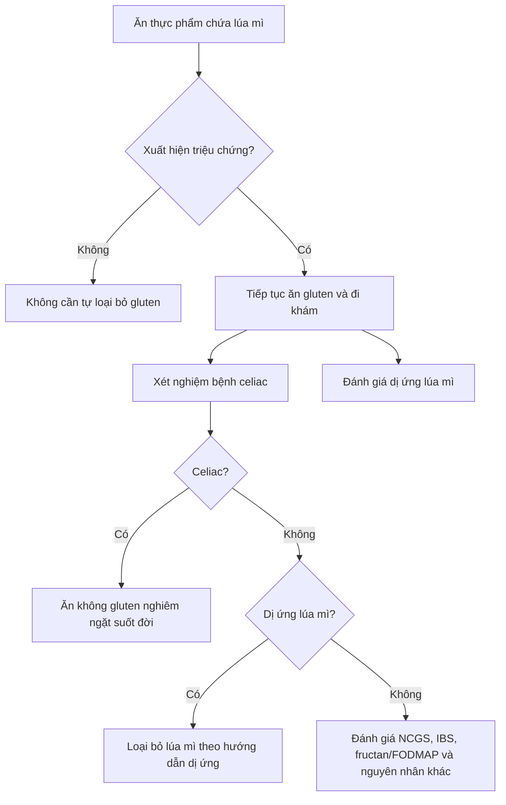

# 062 — Gluten-Free Diet Explained

# Giải thích chế độ ăn không gluten

| Thuộc tính       | Nội dung                                                          |
| ---------------- | ----------------------------------------------------------------- |
| **Module**       | Module 07 — Common Dieting Trends Explained                       |
| **Bài học**      | Gluten-Free Diet Explained                                        |
| **Thời lượng**   | 03:27                                                             |
| **Chủ đề chính** | Chế độ ăn không gluten: ai thực sự cần và có giúp giảm cân không? |

> [!IMPORTANT]
> Chế độ ăn không gluten là phương pháp điều trị bắt buộc đối với người mắc **bệnh celiac**, nhưng không mặc nhiên là chế độ ăn lành mạnh hơn hoặc giảm cân tốt hơn đối với người khỏe mạnh.

*Nguồn ảnh: [Wikimedia Commons – Wheat and wheat based foods](https://commons.wikimedia.org/wiki/File:Wheat_and_wheat_based_foods.jpg).*

## Mục lục

1. [Mục tiêu bài học](#1-mục-tiêu-bài-học)
2. [Nội dung chính](#2-nội-dung-chính)
3. [Áp dụng thực tế](#3-áp-dụng-thực-tế)
4. [Lưu ý và lỗi thường gặp](#4-lưu-ý-và-lỗi-thường-gặp)
5. [Checklist thực hành](#5-checklist-thực-hành)
6. [Tóm tắt](#6-tóm-tắt)

---

## 1. Mục tiêu bài học

Sau bài học này, bạn có thể:

* Hiểu gluten là gì và xuất hiện trong những thực phẩm nào.
* Phân biệt bệnh celiac, dị ứng lúa mì và nhạy cảm với gluten/lúa mì không do celiac.
* Xác định ai thực sự cần thực hiện chế độ ăn không gluten.
* Hiểu tại sao nhãn “gluten-free” không đồng nghĩa với “lành mạnh” hoặc “giúp giảm cân”.
* Biết cách xây dựng một chế độ ăn không gluten cân bằng nếu có chỉ định y khoa.
* Tránh tự loại bỏ gluten trước khi được kiểm tra bệnh celiac.

---

## 2. Nội dung chính

### 2.1. Gluten là gì?

**Gluten** là tên gọi chung của một nhóm protein dự trữ có trong:

* Lúa mì — wheat.
* Lúa mạch đen — rye.
* Lúa mạch — barley.
* Triticale — giống lai giữa lúa mì và lúa mạch đen.

Trong lúa mì, hai nhóm protein chính tạo nên gluten là:

* **Gliadin:** góp phần làm bột có khả năng kéo giãn.
* **Glutenin:** góp phần tạo độ đàn hồi và cấu trúc.

Gluten giúp bột bánh kết dính, đàn hồi, giữ khí và nở khi nướng. Vì vậy, gluten thường xuất hiện trong bánh mì, mì sợi, pizza, bánh quy và nhiều sản phẩm chế biến từ ngũ cốc.

> **Hiệu đính bản chép lời:** Gluten trong lúa mì chủ yếu gồm **gliadin và glutenin**, không phải “glutamine và gliadin”.

### 2.2. Những thực phẩm thường chứa gluten

| Nhóm                                | Ví dụ                                                                          |
| ----------------------------------- | ------------------------------------------------------------------------------ |
| **Sản phẩm từ lúa mì**              | Bánh mì, mì Ý, mì trứng, bánh quy, bánh ngọt, pizza                            |
| **Sản phẩm từ lúa mạch**            | Bia, malt, siro malt, giấm malt                                                |
| **Lúa mạch đen**                    | Bánh mì rye, ngũ cốc rye                                                       |
| **Thực phẩm chế biến**              | Một số loại nước tương, súp đóng gói, sốt, gia vị hỗn hợp                      |
| **Thực phẩm có nguy cơ nhiễm chéo** | Yến mạch thông thường, đồ chiên chung dầu, thực phẩm chế biến chung dây chuyền |

Yến mạch về bản chất không thuộc nhóm ngũ cốc chứa gluten gây bệnh celiac. Tuy nhiên, yến mạch thường bị nhiễm lúa mì, lúa mạch hoặc lúa mạch đen trong quá trình trồng, vận chuyển và chế biến. Người mắc celiac chỉ nên sử dụng yến mạch được ghi rõ hoặc chứng nhận **gluten-free** và nên trao đổi với bác sĩ hoặc chuyên gia dinh dưỡng.

### 2.3. Gluten có gây hại cho tất cả mọi người không?

Không.

Phản ứng bất lợi với gluten hoặc lúa mì chủ yếu liên quan đến ba tình trạng khác nhau:

| Tình trạng                                 | Cơ chế                                | Đặc điểm chính                                                         |
| ------------------------------------------ | ------------------------------------- | ---------------------------------------------------------------------- |
| **Bệnh celiac**                            | Bệnh tự miễn                          | Gluten kích hoạt miễn dịch và gây tổn thương niêm mạc ruột non         |
| **Dị ứng lúa mì**                          | Phản ứng dị ứng, thường liên quan IgE | Có thể gây ngứa, nổi mề đay, sưng, khó thở hoặc phản vệ                |
| **Nhạy cảm gluten/lúa mì không do celiac** | Cơ chế chưa hoàn toàn rõ              | Có triệu chứng nhưng không có bằng chứng của celiac hoặc dị ứng lúa mì |

---

### 2.4. Bệnh celiac

Bệnh celiac là một bệnh tự miễn mạn tính. Ở người có cơ địa phù hợp, việc ăn gluten kích hoạt hệ miễn dịch tấn công niêm mạc ruột non, làm các nhung mao ruột bị tổn thương hoặc teo đi. Điều này làm giảm khả năng hấp thu chất dinh dưỡng.

*Nguồn ảnh nghiên cứu minh họa: [Wikimedia Commons – Inflamed intestinal villi depicting celiac disease](https://commons.wikimedia.org/wiki/File:Inflammed_mucous_layer_of_the_intestinal_villi_depicting_Celiac_disease.jpg), giấy phép CC BY-SA 4.0.*

Các triệu chứng có thể bao gồm:

* Đầy hơi, đau bụng.
* Tiêu chảy hoặc táo bón kéo dài.
* Buồn nôn.
* Sụt cân không chủ ý.
* Mệt mỏi.
* Thiếu máu thiếu sắt.
* Loãng xương hoặc giảm mật độ xương.
* Phát ban dạng viêm da dạng herpes.
* Trẻ em chậm tăng trưởng.

Tuy nhiên, một số người mắc celiac có rất ít triệu chứng tiêu hóa hoặc hoàn toàn không có triệu chứng rõ ràng.

Các phân tích tổng hợp ước tính tỷ lệ bệnh celiac toàn cầu vào khoảng **0,7% khi xác nhận bằng sinh thiết** và khoảng **1,4% khi dựa trên xét nghiệm huyết thanh**, nhưng tỷ lệ khác nhau tùy khu vực và quần thể.

#### Chẩn đoán bệnh celiac

Bác sĩ có thể sử dụng:

1. Xét nghiệm máu tìm kháng thể, thường gồm tTG-IgA và tổng IgA.
2. Nội soi và sinh thiết ruột non khi cần.
3. Xét nghiệm di truyền HLA-DQ2 hoặc HLA-DQ8 trong một số trường hợp.

> [!WARNING]
> Không nên tự ngừng ăn gluten trước khi xét nghiệm bệnh celiac. Việc loại bỏ gluten có thể làm nồng độ kháng thể giảm và niêm mạc ruột hồi phục, khiến kết quả xét nghiệm âm tính giả hoặc khó diễn giải.

Khi đã được chẩn đoán celiac, người bệnh cần tuân thủ chế độ ăn không gluten nghiêm ngặt và lâu dài. Chế độ ăn này giúp giảm triệu chứng, phục hồi ruột non và phòng ngừa tổn thương tái phát.

---

### 2.5. Dị ứng lúa mì không giống bệnh celiac

Dị ứng lúa mì là phản ứng dị ứng với một hoặc nhiều protein trong lúa mì, không nhất thiết chỉ riêng gluten.

Triệu chứng có thể xuất hiện nhanh trong vài phút đến vài giờ:

* Nổi mề đay hoặc ngứa.
* Sưng môi, lưỡi hoặc họng.
* Khò khè, khó thở.
* Nôn ói.
* Trong trường hợp nặng có thể xảy ra phản vệ.

Bệnh celiac là bệnh tự miễn, còn dị ứng lúa mì là phản ứng dị ứng. Hai tình trạng này cần phương pháp đánh giá và theo dõi khác nhau.

---

### 2.6. Nhạy cảm với gluten không do celiac

Một số người xuất hiện đầy hơi, đau bụng, thay đổi đại tiện, mệt mỏi hoặc cảm giác “sương mù não” sau khi ăn thực phẩm chứa lúa mì, mặc dù xét nghiệm không cho thấy bệnh celiac hoặc dị ứng lúa mì.

Tình trạng này thường được gọi là:

* **Non-celiac gluten sensitivity — NCGS**, hoặc
* **Non-celiac wheat sensitivity — NCWS**.

Hiện chưa có xét nghiệm sinh học đặc hiệu để xác nhận NCGS. Việc chẩn đoán thường dựa trên loại trừ bệnh celiac, dị ứng lúa mì và các nguyên nhân tiêu hóa khác, sau đó đánh giá phản ứng khi loại bỏ và đưa thực phẩm trở lại có kiểm soát.

Tỷ lệ thực sự của NCGS vẫn chưa được xác định chính xác. Vì vậy, tuyên bố rằng cứ một người mắc celiac thì có sáu hoặc bảy người nhạy cảm gluten là chưa đủ chắc chắn để áp dụng cho toàn bộ dân số.

#### Không phải lúc nào gluten cũng là nguyên nhân

Lúa mì còn chứa **fructan**, một loại carbohydrate thuộc nhóm FODMAP có thể lên men trong ruột và gây đầy hơi, đau bụng hoặc thay đổi đại tiện ở người nhạy cảm.

Trong một thử nghiệm ngẫu nhiên, mù đôi, bắt chéo trên những người tự nhận nhạy cảm với gluten, fructan gây triệu chứng rõ hơn gluten. Điều này cho thấy một số người có thể đang phản ứng với fructan hoặc thành phần khác của lúa mì thay vì chính gluten.

---

### 2.7. Người khỏe mạnh có cần tránh gluten không?

Đối với người:

* Không mắc bệnh celiac.
* Không dị ứng lúa mì.
* Không có nhạy cảm gluten hoặc lúa mì đã được đánh giá hợp lý.
* Không xuất hiện triệu chứng sau khi ăn thực phẩm chứa gluten.

Hiện không có bằng chứng thuyết phục rằng loại bỏ gluten mang lại lợi ích sức khỏe đặc biệt. Cũng không có cơ sở để khuyến nghị người khỏe mạnh phải “giới hạn gluten vài bữa mỗi tuần để phòng tổn thương ruột”.

Điều quan trọng hơn là:

* Chất lượng tổng thể của chế độ ăn.
* Lượng rau, trái cây, đậu và ngũ cốc nguyên hạt.
* Tổng năng lượng nạp vào.
* Lượng protein, chất xơ và vi chất.
* Mức độ chế biến của thực phẩm.

---

### 2.8. Gluten-free không đồng nghĩa với lành mạnh hơn

Một chiếc bánh quy không gluten vẫn có thể chứa:

* Nhiều đường.
* Nhiều chất béo.
* Nhiều calorie.
* Ít protein.
* Ít chất xơ.
* Ít vitamin và khoáng chất.

Nhiều sản phẩm không gluten sử dụng bột gạo tinh chế, tinh bột ngô, tinh bột khoai tây hoặc đường để thay thế cấu trúc của gluten. Do đó, chất lượng dinh dưỡng của chúng không mặc nhiên tốt hơn sản phẩm thông thường.

Các nghiên cứu so sánh cho thấy nhiều nhóm sản phẩm đóng gói không gluten có giá cao hơn và có thể ít protein, chất xơ hoặc một số vi chất hơn sản phẩm tương đương chứa gluten. Tuy nhiên, điều này không đúng với mọi sản phẩm; người tiêu dùng vẫn cần đọc nhãn dinh dưỡng cụ thể.

### So sánh hai cách ăn không gluten

| Cách ăn kém cân bằng       | Cách ăn cân bằng hơn                       |
| -------------------------- | ------------------------------------------ |
| Bánh quy không gluten      | Trái cây và sữa chua                       |
| Bánh mì trắng không gluten | Khoai lang, ngô, gạo lứt                   |
| Mì ăn liền không gluten    | Bún gạo với thịt, trứng và rau             |
| Snack không gluten         | Hạt, đậu rang hoặc trái cây                |
| Bánh ngọt không gluten     | Cháo yến mạch được chứng nhận không gluten |

---

### 2.9. Chế độ ăn không gluten có giúp giảm cân không?

Không có bằng chứng cho thấy việc loại bỏ gluten tự nó làm tăng tốc độ giảm mỡ ở người không mắc bệnh liên quan đến gluten.

Giảm cân vẫn phụ thuộc chủ yếu vào:

[
\text{Năng lượng nạp vào} < \text{Năng lượng tiêu hao}
]

Một người có thể giảm cân sau khi bỏ gluten vì họ đồng thời:

* Giảm bánh ngọt, pizza và đồ ăn nhanh.
* Ăn nhiều thực phẩm nguyên chất hơn.
* Kiểm soát khẩu phần tốt hơn.
* Nạp ít calorie hơn trước.

Trong trường hợp đó, nguyên nhân chính là **thâm hụt calorie và thay đổi chất lượng thực phẩm**, không phải do gluten có tác dụng gây tăng mỡ.

Ngược lại, ăn nhiều bánh mì, bánh quy và đồ ăn vặt được dán nhãn gluten-free vẫn có thể dẫn đến dư thừa calorie và tăng cân.

---

## 3. Áp dụng thực tế

### 3.1. Ai nên thực hiện chế độ ăn không gluten?

| Đối tượng                                         | Mức độ cần thiết                                                  |
| ------------------------------------------------- | ----------------------------------------------------------------- |
| **Người đã được chẩn đoán celiac**                | Bắt buộc, nghiêm ngặt và lâu dài                                  |
| **Người bị viêm da dạng herpes liên quan celiac** | Thường cần chế độ ăn không gluten nghiêm ngặt                     |
| **Người dị ứng lúa mì**                           | Tránh lúa mì theo chỉ dẫn; không hoàn toàn giống chế độ ăn celiac |
| **Người được đánh giá có NCGS/NCWS**              | Có thể thử loại bỏ có kiểm soát dưới hướng dẫn chuyên môn         |
| **Người khỏe mạnh, không triệu chứng**            | Thường không cần loại bỏ gluten                                   |

### 3.2. Thực phẩm tự nhiên không chứa gluten

Các lựa chọn thường không chứa gluten khi chưa thêm sốt, bột tẩm hoặc phụ gia:

* Gạo, gạo lứt, bún gạo, bánh phở nguyên chất.
* Ngô.
* Khoai tây, khoai lang, sắn.
* Quinoa, kiều mạch và hạt kê.
* Đậu, đậu lăng.
* Rau và trái cây.
* Thịt, cá, trứng.
* Sữa và sữa chua nguyên chất.
* Các loại hạt.

> **Lưu ý:** “Kiều mạch” — buckwheat — không phải là lúa mì và tự nhiên không chứa gluten.

### 3.3. Thực đơn không gluten mẫu trong một ngày

| Bữa               | Gợi ý                                                        |
| ----------------- | ------------------------------------------------------------ |
| **Bữa sáng**      | Trứng, khoai lang, một phần trái cây                         |
| **Bữa trưa**      | Cơm, cá hoặc thịt gà, rau luộc, canh                         |
| **Bữa phụ**       | Sữa chua nguyên chất và hạt                                  |
| **Bữa tối**       | Bún gạo hoặc cơm, thịt nạc, nhiều rau                        |
| **Sau tập luyện** | Sữa, chuối và bột protein có chứng nhận không gluten nếu cần |

Thực đơn trên chỉ là ví dụ. Nhu cầu calorie, protein và vi chất cần được điều chỉnh theo cơ thể, hoạt động thể chất và tình trạng sức khỏe của từng người.

### 3.4. Cách đọc nhãn thực phẩm

Kiểm tra:

1. Danh sách thành phần có wheat, barley, rye, malt hoặc triticale hay không.
2. Cảnh báo “may contain wheat” hoặc chế biến trên dây chuyền có lúa mì.
3. Chứng nhận gluten-free nếu người dùng mắc celiac.
4. Lượng protein, chất xơ, đường, chất béo bão hòa và calorie.
5. Kích thước khẩu phần trên nhãn.

Theo quy định của FDA Hoa Kỳ, sản phẩm ghi “gluten-free” phải có lượng gluten không tránh khỏi dưới **20 phần triệu — ppm**. Các quốc gia có thể áp dụng hệ thống ghi nhãn khác nhau, vì vậy người mắc celiac nên kiểm tra tiêu chuẩn và chứng nhận tại nơi mua sản phẩm.

### 3.5. Ngăn nhiễm chéo trong bệnh celiac

Một lượng gluten rất nhỏ cũng có thể gây vấn đề đối với người mắc celiac. Vì vậy cần chú ý:

* Không dùng chung máy nướng bánh mì.
* Không dùng chung thớt, dao hoặc dụng cụ còn vụn bánh.
* Không chiên chung dầu với thực phẩm tẩm bột mì.
* Bảo quản thực phẩm không gluten riêng.
* Làm sạch bề mặt trước khi chế biến.
* Tránh bột mì phát tán trong không khí tại khu vực chế biến.
* Hỏi rõ thành phần và quy trình chế biến khi ăn ngoài.

---

## 4. Lưu ý và lỗi thường gặp

### Lỗi 1: Cho rằng mọi triệu chứng tiêu hóa đều do gluten

Đầy hơi, đau bụng và tiêu chảy còn có thể liên quan đến:

* Hội chứng ruột kích thích.
* Không dung nạp lactose.
* Nhạy cảm với fructan hoặc FODMAP.
* Nhiễm trùng đường ruột.
* Bệnh viêm ruột.
* Rối loạn hấp thu hoặc các bệnh tiêu hóa khác.

Không nên tự chẩn đoán chỉ dựa trên việc cảm thấy đỡ hơn sau vài ngày bỏ bánh mì.

### Lỗi 2: Bỏ gluten trước khi xét nghiệm celiac

Điều này có thể làm kết quả xét nghiệm thiếu chính xác. Hãy trao đổi với bác sĩ trước khi thay đổi chế độ ăn.

### Lỗi 3: Đồng nhất bệnh celiac với dị ứng gluten

Bệnh celiac là bệnh tự miễn, không phải dị ứng thức ăn thông thường.

### Lỗi 4: Cho rằng “không gluten” đồng nghĩa với “ít calorie”

Nhãn gluten-free chỉ phản ánh hàm lượng gluten, không phản ánh lượng calorie, đường, chất béo hoặc mức độ chế biến.

### Lỗi 5: Thay toàn bộ thực phẩm bằng sản phẩm đóng gói gluten-free

Điều này có thể làm chế độ ăn:

* Thiếu chất xơ.
* Thiếu sắt, folate, vitamin nhóm B hoặc calcium.
* Tăng chi phí.
* Phụ thuộc nhiều hơn vào tinh bột tinh chế.

NIDDK lưu ý rằng chế độ không gluten xây dựng không hợp lý có thể thiếu chất xơ, sắt và calcium; một số sản phẩm đóng gói cũng có thể chứa nhiều đường hoặc chất béo hơn.

### Lỗi 6: Hạn chế gluten “để phòng bệnh” dù không có triệu chứng

Hiện chưa có bằng chứng đủ mạnh để khuyến nghị người khỏe mạnh phải ăn gluten ít lần hơn trong tuần nhằm bảo vệ ruột.

### Lỗi 7: Quên đánh giá chất lượng toàn bộ chế độ ăn

Một chế độ không gluten lành mạnh nên dựa chủ yếu trên thực phẩm tự nhiên, thay vì chỉ thay bánh mì thông thường bằng bánh mì không gluten.

---

## 5. Checklist thực hành

### Trước khi loại bỏ gluten

* [ ] Tôi có triệu chứng rõ ràng sau khi ăn thực phẩm chứa lúa mì không?
* [ ] Tôi đã trao đổi với bác sĩ hoặc chuyên gia dinh dưỡng chưa?
* [ ] Tôi đã được kiểm tra bệnh celiac khi vẫn đang ăn gluten chưa?
* [ ] Tôi đã được đánh giá khả năng dị ứng lúa mì chưa?
* [ ] Tôi đã cân nhắc các nguyên nhân khác như lactose, fructan hoặc IBS chưa?

### Khi bắt buộc phải ăn không gluten

* [ ] Ưu tiên gạo, ngô, khoai, đậu, rau, trái cây, thịt, cá và trứng.
* [ ] Kiểm tra lúa mì, lúa mạch, lúa mạch đen và malt trên nhãn.
* [ ] Chọn yến mạch có chứng nhận gluten-free.
* [ ] Kiểm soát nguy cơ nhiễm chéo.
* [ ] Bảo đảm đủ protein và chất xơ.
* [ ] Theo dõi sắt, folate, vitamin B12, vitamin D và calcium khi được chỉ định.
* [ ] Không mặc định sản phẩm gluten-free là sản phẩm giảm cân.
* [ ] Làm việc với chuyên gia dinh dưỡng nếu mắc bệnh celiac.

### Khi mục tiêu là giảm cân

* [ ] Theo dõi tổng lượng calorie.
* [ ] Ăn đủ protein.
* [ ] Ưu tiên thực phẩm ít chế biến.
* [ ] Ăn đủ rau, trái cây và chất xơ.
* [ ] Kiểm soát khẩu phần.
* [ ] Không dựa vào nhãn gluten-free để đánh giá chất lượng thực phẩm.

---

## 6. Tóm tắt

* Gluten là nhóm protein có trong lúa mì, lúa mạch và lúa mạch đen.
* Bệnh celiac là bệnh tự miễn trong đó gluten gây tổn thương ruột non.
* Người mắc celiac cần ăn không gluten nghiêm ngặt và lâu dài.
* Dị ứng lúa mì và nhạy cảm gluten/lúa mì không do celiac là những tình trạng khác với celiac.
* Tỷ lệ nhạy cảm gluten thực sự chưa được xác định chính xác; một số người có thể phản ứng với fructan hoặc thành phần khác của lúa mì.
* Người khỏe mạnh không có triệu chứng thường không cần loại bỏ hoặc hạn chế gluten.
* Chế độ không gluten không tự động giúp giảm cân.
* Sản phẩm gluten-free không mặc nhiên giàu dinh dưỡng hơn và đôi khi đắt hơn, ít protein hoặc ít chất xơ hơn.
* Muốn giảm mỡ vẫn cần duy trì thâm hụt calorie và một chế độ ăn cân bằng.
* Không nên ngừng ăn gluten trước khi được xét nghiệm bệnh celiac.

> **Thông điệp cốt lõi:**
> **Không gluten là một yêu cầu điều trị đối với một số người, không phải biểu tượng mặc định của thực phẩm lành mạnh.**
