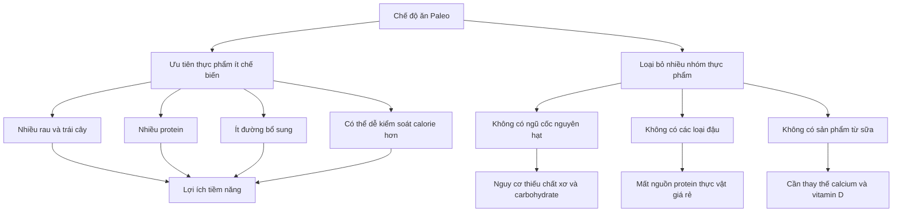
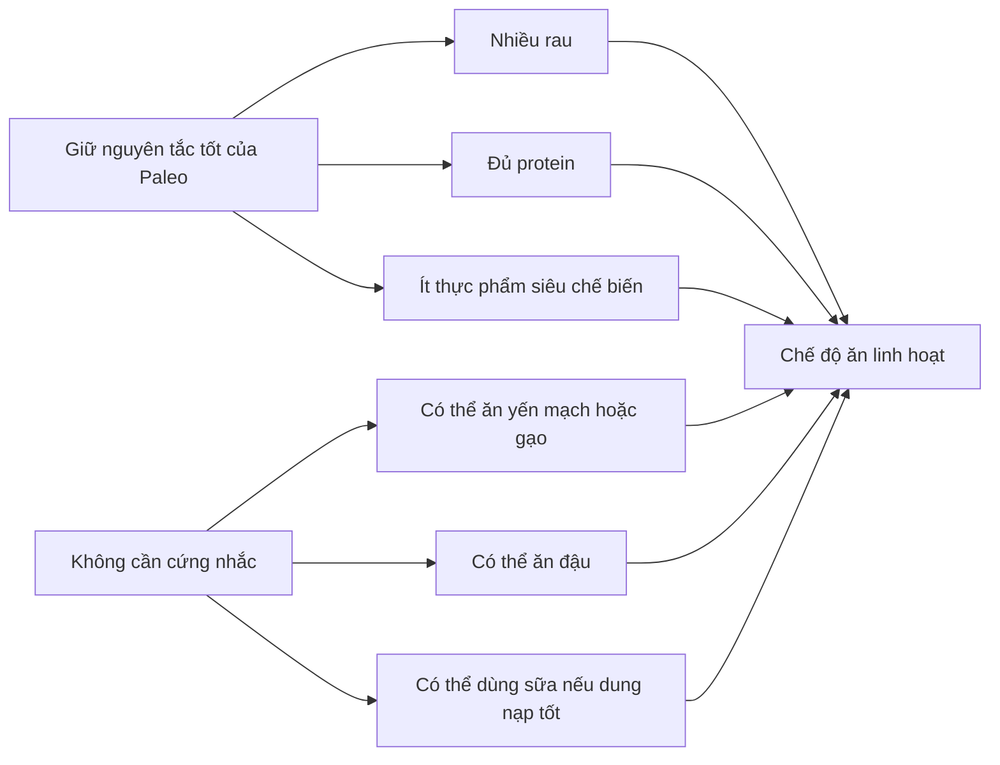

# 063 — Giải thích chế độ ăn Paleo

## Paleo Diet Explained

| Thuộc tính         | Nội dung                                                                                                                                           |
| ------------------ | -------------------------------------------------------------------------------------------------------------------------------------------------- |
| **Module**         | Module 07 — Common Dieting Trends Explained                                                                                                        |
| **Bài học**        | Paleo Diet Explained                                                                                                                               |
| **Thời lượng**     | 03:37                                                                                                                                              |
| **Chủ đề chính**   | Giải thích chế độ ăn Paleo                                                                                                                         |
| **Kết luận nhanh** | Paleo có nhiều nguyên tắc tốt, nhưng việc loại bỏ hoàn toàn ngũ cốc nguyên hạt, các loại đậu và sữa thường không cần thiết đối với người khỏe mạnh |

*Hình minh họa: cá, thịt, trứng, rau, trái cây, quả bơ và các loại hạt — những thực phẩm thường gặp trong Paleo.*
[Nguồn ảnh](https://nutritiongeeks.com/paleo/) — nên kiểm tra giấy phép trước khi sử dụng trong sản phẩm thương mại.

## Mục lục

1. [Mục tiêu bài học](#1-mục-tiêu-bài-học)
2. [Nội dung chính](#2-nội-dung-chính)
3. [Áp dụng thực tế](#3-áp-dụng-thực-tế)
4. [Lưu ý và lỗi thường gặp](#4-lưu-ý-và-lỗi-thường-gặp)
5. [Checklist thực hành](#5-checklist-thực-hành)
6. [Tóm tắt](#6-tóm-tắt)
7. [Tài liệu khoa học tham khảo](#7-tài-liệu-khoa-học-tham-khảo)

---

## 1. Mục tiêu bài học

Sau bài học này, người học có thể:

* Giải thích được Paleo là gì và chế độ ăn này dựa trên ý tưởng nào.
* Phân biệt nhóm thực phẩm thường được ăn, hạn chế hoặc loại bỏ trong Paleo.
* Nhận biết những điểm tích cực của Paleo, đặc biệt là việc ưu tiên thực phẩm ít chế biến.
* Hiểu vì sao việc loại bỏ hoàn toàn ngũ cốc nguyên hạt, các loại đậu và sản phẩm từ sữa có thể không cần thiết.
* Biết cách áp dụng một phiên bản **Paleo linh hoạt**, phù hợp hơn với sức khỏe, luyện tập và đời sống thực tế.
* Đánh giá Paleo dựa trên chất lượng thực phẩm và khả năng duy trì, thay vì xem đây là một chế độ ăn “thần kỳ”.

> **Thông điệp cốt lõi:** Paleo có thể là một chế độ ăn tương đối lành mạnh khi ưu tiên rau, trái cây, cá, thịt nạc và thực phẩm ít chế biến. Tuy nhiên, lợi ích của nó không chứng minh rằng tất cả ngũ cốc, đậu hay sản phẩm từ sữa đều có hại.

---

## 2. Nội dung chính

### 2.1. Chế độ ăn Paleo là gì?

Paleo, còn gọi là:

* Paleolithic diet;
* Stone Age diet;
* Caveman diet;
* Chế độ ăn thời đồ đá,

là một mô hình ăn uống hiện đại được xây dựng dựa trên ý tưởng mô phỏng thực phẩm mà con người thời săn bắt – hái lượm có thể đã sử dụng.

Nguyên tắc đơn giản thường được diễn đạt là:

> **“Nếu người tiền sử không thể săn bắt hoặc hái lượm thực phẩm đó, người theo Paleo không nên ăn.”**

Tuy nhiên, đây chỉ là một cách đơn giản hóa. Các bằng chứng về tiến hóa và khảo cổ cho thấy không tồn tại một “thực đơn Paleo” duy nhất. Chế độ ăn của tổ tiên loài người thay đổi đáng kể tùy khí hậu, địa điểm, mùa, công cụ và nguồn thực phẩm sẵn có. ([PubMed Central (PMC)][1])

### 2.2. Paleo thường ăn và tránh những gì?

| Nhóm                    | Thực phẩm phổ biến                              |
| ----------------------- | ----------------------------------------------- |
| **Thường được ăn**      | Thịt tươi, thịt gia cầm, cá, hải sản, trứng     |
| **Thường được ăn**      | Rau, trái cây, củ, quả bơ                       |
| **Thường được ăn**      | Hạt cây, hạt giống, dầu ô liu                   |
| **Thường bị loại bỏ**   | Bánh mì, mì, yến mạch, gạo và các loại ngũ cốc  |
| **Thường bị loại bỏ**   | Đậu, đậu lăng, đậu gà, đậu nành, đậu phộng      |
| **Thường bị loại bỏ**   | Sữa, sữa chua, phô mai và nhiều sản phẩm từ sữa |
| **Thường bị loại bỏ**   | Đường tinh luyện, nước ngọt, bánh kẹo           |
| **Thường bị hạn chế**   | Thức ăn nhanh và thực phẩm siêu chế biến        |
| **Tùy phiên bản Paleo** | Khoai tây, cà phê, mật ong, bơ sữa, gạo trắng   |

> **Lưu ý:** Không có một bộ quy tắc Paleo thống nhất. Một số phiên bản cho phép khoai tây, bơ sữa hoặc một lượng nhỏ gạo, trong khi phiên bản nghiêm ngặt loại bỏ gần như toàn bộ.

### 2.3. Logic phía sau Paleo

Những người ủng hộ Paleo thường lập luận rằng:

1. Gen của con người được hình thành chủ yếu trước thời kỳ nông nghiệp.
2. Ngũ cốc, sữa và thực phẩm công nghiệp xuất hiện tương đối muộn.
3. Cơ thể chưa thích nghi hoàn toàn với các thực phẩm hiện đại.
4. Vì vậy, quay về cách ăn “gần tự nhiên” hơn có thể cải thiện sức khỏe.

Vấn đề là giả thuyết này quá đơn giản. Con người là loài ăn tạp có khả năng thích nghi cao; chế độ ăn của các cộng đồng săn bắt – hái lượm cũng rất đa dạng. Vì vậy, không thể kết luận rằng một thực phẩm có hại chỉ vì nó xuất hiện sau thời kỳ đồ đá. ([PubMed Central (PMC)][1])

---

### 2.4. Những điểm tích cực của Paleo

#### A. Khuyến khích ăn thực phẩm ít chế biến

Paleo thường làm giảm lượng:

* Nước ngọt;
* Bánh kẹo;
* Đường bổ sung;
* Khoai tây chiên;
* Thức ăn nhanh;
* Các món ăn đóng gói giàu calorie nhưng ít dinh dưỡng.

Đối với người trước đây ăn nhiều thực phẩm siêu chế biến, chỉ riêng thay đổi này cũng có thể giúp giảm lượng calorie, tăng cảm giác no và cải thiện chất lượng khẩu phần.

#### B. Cung cấp nhiều protein

Cá, thịt nạc, trứng và hải sản cung cấp protein giúp:

* Duy trì và xây dựng cơ bắp;
* Hỗ trợ phục hồi sau tập;
* Tạo cảm giác no;
* Hạn chế mất khối cơ khi giảm cân.

Tuy nhiên, không cần ăn lượng thịt rất lớn để nhận được lợi ích. Chất lượng và tổng lượng protein quan trọng hơn việc thực phẩm có được gắn nhãn “Paleo” hay không.

#### C. Khuyến khích ăn rau và trái cây

Rau và trái cây cung cấp:

* Chất xơ;
* Vitamin;
* Khoáng chất;
* Các hợp chất thực vật có hoạt tính sinh học;
* Thể tích thực phẩm lớn nhưng mật độ calorie tương đối thấp.

#### D. Có thể cải thiện một số chỉ số trong ngắn hạn

Một số phân tích thử nghiệm ngẫu nhiên ghi nhận Paleo có thể giúp giảm nhẹ cân nặng, vòng eo và một số yếu tố nguy cơ tim mạch trong ngắn hạn. Tuy nhiên, số nghiên cứu còn hạn chế, thời gian theo dõi thường ngắn và các phiên bản Paleo giữa các nghiên cứu không hoàn toàn giống nhau. ([PubMed Central (PMC)][2])

Điều này không có nghĩa Paleo sở hữu một cơ chế giảm mỡ đặc biệt. Trong thực tế, giảm cân thường xảy ra vì người áp dụng:

* Ăn ít đồ ngọt và đồ ăn nhanh hơn;
* Tăng protein và rau;
* Ăn no sớm hơn;
* Vô tình giảm tổng lượng calorie.

---

### 2.5. Hạn chế lớn của Paleo

#### A. Loại bỏ ngũ cốc nguyên hạt

Paleo nghiêm ngặt loại bỏ cả:

* Yến mạch;
* Gạo lứt;
* Lúa mạch;
* Bánh mì nguyên cám;
* Kiều mạch;
* Các loại ngũ cốc nguyên hạt khác.

Đây là điểm gây tranh luận vì ngũ cốc nguyên hạt có thể cung cấp:

* Carbohydrate phục vụ vận động;
* Chất xơ;
* Vitamin nhóm B;
* Magnesium;
* Các hợp chất thực vật;
* Nguồn năng lượng tương đối tiết kiệm.

Các tổng quan hệ thống cho thấy tiêu thụ ngũ cốc nguyên hạt có liên quan đến nguy cơ bệnh tim mạch và tử vong thấp hơn so với tiêu thụ ít ngũ cốc nguyên hạt. ([ScienceDirect][3])

Tuyên bố “ngũ cốc nguyên hạt luôn gây viêm” cũng quá tuyệt đối. Một số phân tích thử nghiệm ghi nhận tác dụng giảm nhẹ một vài dấu ấn viêm, nhưng kết quả giữa các nghiên cứu không hoàn toàn đồng nhất. ([PubMed Central (PMC)][4])

> **Kết luận:** Ngũ cốc tinh chế và bánh kẹo không giống ngũ cốc nguyên hạt. Không nên đánh đồng bánh ngọt với yến mạch hoặc gạo lứt.

#### B. Loại bỏ các loại đậu

Paleo thường loại bỏ:

* Đậu đen;
* Đậu đỏ;
* Đậu gà;
* Đậu lăng;
* Đậu nành;
* Đậu Hà Lan.

Trong khi đó, các loại đậu là nguồn:

* Protein thực vật;
* Chất xơ;
* Folate;
* Potassium;
* Magnesium;
* Carbohydrate tiêu hóa chậm.

Một phân tích các thử nghiệm ngẫu nhiên ghi nhận chế độ ăn giàu các loại đậu không phải đậu nành có thể làm giảm cholesterol toàn phần và LDL cholesterol. ([PubMed Central (PMC)][5])

#### C. Loại bỏ sản phẩm từ sữa

Sữa, sữa chua và phô mai có thể cung cấp:

* Protein;
* Calcium;
* Phosphorus;
* Vitamin B12;
* Potassium.

Sữa và sữa chua là những nguồn calcium tự nhiên quan trọng. Vitamin D chủ yếu có trong sữa hoặc sản phẩm đã được **tăng cường vitamin D**, chứ không phải mọi sản phẩm từ sữa đều tự nhiên giàu vitamin D. ([ODS][6])

Người không dung nạp lactose cũng không nhất thiết phải loại bỏ toàn bộ sản phẩm từ sữa. Nhiều người vẫn có thể dung nạp một lượng nhỏ, sữa không lactose, sữa chua hoặc phô mai cứng. ([Viện Quốc gia về Bệnh Tiểu đường và Thận][7])

Nếu không dùng sữa, cần chủ động bổ sung calcium từ:

* Cá mòi hoặc cá hồi đóng hộp có xương;
* Đậu phụ làm bằng calcium sulfate;
* Rau cải thìa, cải xoăn;
* Sữa thực vật tăng cường calcium;
* Thực phẩm tăng cường vitamin D.

#### D. Hiểu sai về “chất kháng dinh dưỡng”

Người ủng hộ Paleo đôi khi cho rằng các loại đậu và ngũ cốc có:

* Phytate;
* Lectin;
* Oxalate;
* Tannin,

nên gây tổn thương ruột hoặc ngăn cản hấp thụ dưỡng chất.

Trên thực tế:

* Những chất này có thể ảnh hưởng đến khả năng hấp thụ một số khoáng chất trong điều kiện nhất định.
* Mức độ ảnh hưởng phụ thuộc vào tổng khẩu phần và cách chế biến.
* Ngâm, nảy mầm, lên men và nấu chín có thể làm giảm đáng kể nhiều hợp chất kháng dinh dưỡng.
* Với khẩu phần đa dạng, chúng thường không phải vấn đề nghiêm trọng đối với người khỏe mạnh. ([PubMed Central (PMC)][8])

> **Ví dụ:** Đậu sống hoặc chưa nấu chín kỹ có thể chứa nhiều lectin. Đậu đã được ngâm và nấu chín hoàn toàn là một thực phẩm hoàn toàn khác về mặt an toàn.

#### E. Paleo không tự động lành mạnh

Một thực đơn vẫn có thể được gọi là Paleo nhưng chứa quá nhiều:

* Thịt đỏ nhiều mỡ;
* Thịt chế biến;
* Dầu dừa;
* Món tráng miệng làm từ bột hạnh nhân;
* Hạt và bơ hạt với lượng calorie rất lớn.

Do đó:

> **“Đúng quy tắc Paleo” không đồng nghĩa với “tối ưu cho sức khỏe”.**

---

### 2.6. So sánh Paleo nghiêm ngặt và Paleo linh hoạt

| Yếu tố                            | Paleo nghiêm ngặt              | Paleo linh hoạt       |
| --------------------------------- | ------------------------------ | --------------------- |
| Rau và trái cây                   | Có                             | Có                    |
| Cá, trứng, thịt nạc               | Có                             | Có                    |
| Thực phẩm siêu chế biến           | Hạn chế mạnh                   | Hạn chế mạnh          |
| Ngũ cốc nguyên hạt                | Không                          | Có thể sử dụng        |
| Các loại đậu                      | Không                          | Có thể sử dụng        |
| Sữa và sữa chua                   | Không                          | Dùng nếu dung nạp tốt |
| Khả năng đáp ứng carbohydrate     | Có thể thấp                    | Dễ điều chỉnh hơn     |
| Khả năng duy trì                  | Khó hơn                        | Thường dễ hơn         |
| Nguy cơ thiếu calcium/chất xơ     | Cao hơn nếu không lập kế hoạch | Thấp hơn              |
| Phù hợp với vận động cường độ cao | Cần lập kế hoạch kỹ            | Linh hoạt hơn         |

---

### 2.7. Đánh giá bằng chứng khoa học

| Câu hỏi                                         | Bằng chứng hiện tại                                 | Cách hiểu thực tế                                                     |
| ----------------------------------------------- | --------------------------------------------------- | --------------------------------------------------------------------- |
| Paleo có giúp giảm cân không?                   | Có thể giúp trong ngắn hạn                          | Chủ yếu do ăn ít calorie, nhiều protein và ít thực phẩm siêu chế biến |
| Paleo có tốt hơn mọi chế độ ăn khác không?      | Chưa có bằng chứng thuyết phục                      | Khả năng duy trì và tổng calorie vẫn rất quan trọng                   |
| Ngũ cốc nguyên hạt có gây viêm không?           | Không thể kết luận như vậy                          | Nhiều nghiên cứu cho thấy lợi ích hoặc tác động trung tính            |
| Đậu có gây hại vì “kháng dinh dưỡng” không?     | Không ở mức ăn bình thường khi đã nấu chín          | Đậu vẫn là thực phẩm giàu dinh dưỡng                                  |
| Có cần tránh sữa không?                         | Chỉ khi dị ứng, không dung nạp hoặc có lý do cụ thể | Người dung nạp tốt không cần loại bỏ                                  |
| Paleo có ngăn ngừa bệnh mạn tính lâu dài không? | Bằng chứng dài hạn còn hạn chế                      | Không nên coi Paleo là phương pháp điều trị bệnh                      |

---

## 3. Áp dụng thực tế

### 3.1. Nên áp dụng nguyên tắc, không nhất thiết áp dụng toàn bộ luật lệ

Một phiên bản thực tế hơn là **Paleo-inspired diet** — chế độ ăn lấy cảm hứng từ Paleo:

* Ăn nhiều rau và trái cây.
* Chọn cá, hải sản, trứng và thịt nạc.
* Hạn chế đồ uống có đường, bánh kẹo và thức ăn nhanh.
* Ưu tiên món ăn được chế biến từ nguyên liệu cơ bản.
* Vẫn giữ ngũ cốc nguyên hạt, các loại đậu hoặc sữa nếu chúng phù hợp với cơ thể và mục tiêu.

### 3.2. Công thức xây dựng một bữa ăn

Một bữa ăn cân bằng có thể gồm:

| Thành phần       | Gợi ý                                                   |
| ---------------- | ------------------------------------------------------- |
| **Protein**      | Cá, trứng, thịt gà, thịt nạc, đậu phụ hoặc các loại đậu |
| **Rau**          | Ít nhất 1–2 loại rau                                    |
| **Carbohydrate** | Khoai, trái cây, gạo, yến mạch hoặc ngũ cốc nguyên hạt  |
| **Chất béo**     | Dầu ô liu, quả bơ, hạt hoặc cá béo                      |
| **Gia vị**       | Hành, tỏi, tiêu, thảo mộc; kiểm soát lượng muối phù hợp |

### 3.3. Thực đơn Paleo nghiêm ngặt mẫu

#### Bữa sáng

* Trứng xào rau chân vịt;
* Quả mọng;
* Một ít hạnh nhân.

#### Bữa trưa

* Ức gà nướng;
* Salad rau;
* Quả bơ;
* Dầu ô liu.

#### Bữa tối

* Cá hồi;
* Bông cải xanh;
* Khoai lang nướng.

*Hình minh họa: trứng và quả mọng; salad gà và bơ; cá hồi, rau và khoai lang.*
[Nguồn ảnh](https://nutritiongeeks.com/paleo/)

### 3.4. Thực đơn Paleo linh hoạt mẫu

| Bữa         | Ví dụ                                                       |
| ----------- | ----------------------------------------------------------- |
| **Sáng**    | Trứng, rau, yến mạch và trái cây                            |
| **Trưa**    | Cá hoặc thịt gà, cơm gạo lứt, rau                           |
| **Bữa phụ** | Sữa chua không đường và quả mọng                            |
| **Tối**     | Thịt nạc hoặc đậu phụ, khoai, salad                         |
| **Sau tập** | Sữa, sữa chua, whey hoặc một bữa có protein và carbohydrate |

Phiên bản linh hoạt vẫn giữ được phần lớn lợi ích của Paleo nhưng dễ đáp ứng:

* Nhu cầu carbohydrate khi tập luyện;
* Lượng calcium;
* Lượng chất xơ;
* Ngân sách thực phẩm;
* Tính đa dạng và khả năng duy trì.

### 3.5. Hình minh họa những nhóm thực phẩm thường bị Paleo loại bỏ

Trong hình trên, Paleo thường giữ lại:

* Rau;
* Trái cây;
* Thịt, cá, trứng, hạt.

Paleo nghiêm ngặt thường loại bỏ hoặc hạn chế:

* Ngũ cốc;
* Các loại đậu;
* Sữa, phô mai và sữa chua.

Điều này cho thấy việc tuân thủ Paleo nghiêm ngặt cần có kế hoạch thay thế chất dinh dưỡng cẩn thận.

---

## 4. Lưu ý và lỗi thường gặp

### Lỗi 1: Cho rằng ăn Paleo sẽ tự động giảm cân

Dù thực phẩm lành mạnh, bạn vẫn có thể ăn dư calorie từ:

* Hạt;
* Bơ hạt;
* Dầu;
* Quả bơ;
* Thịt nhiều mỡ;
* Các món bánh “Paleo”.

**Cách khắc phục:** Theo dõi khẩu phần và xu hướng cân nặng trong nhiều tuần.

---

### Lỗi 2: Ăn quá nhiều thịt và quá ít rau

Paleo không nên được hiểu thành:

> “Ăn thịt không giới hạn.”

**Cách khắc phục:**

* Ưu tiên cá, hải sản và thịt nạc;
* Ăn nhiều loại rau;
* Không dùng thịt chế biến làm nguồn protein chính.

---

### Lỗi 3: Loại bỏ mọi loại carbohydrate

Paleo không nhất thiết là ketogenic. Trái cây, khoai, củ và rau vẫn cung cấp carbohydrate.

Người tập luyện cường độ cao có thể cần lượng carbohydrate lớn hơn khả năng cung cấp của một thực đơn Paleo nghiêm ngặt.

**Cách khắc phục:** Điều chỉnh khoai, trái cây, gạo hoặc ngũ cốc nguyên hạt theo khối lượng luyện tập.

---

### Lỗi 4: Loại bỏ sữa mà không thay thế calcium

Điều này có thể khiến khẩu phần calcium thấp, đặc biệt nếu người ăn không thường xuyên sử dụng:

* Cá nhỏ ăn cả xương;
* Rau giàu calcium;
* Đậu phụ làm bằng calcium;
* Sữa thực vật tăng cường calcium.

---

### Lỗi 5: Sợ tất cả các “chất kháng dinh dưỡng”

Không nên đánh giá một loại thực phẩm chỉ dựa trên một hợp chất riêng lẻ.

Ví dụ:

* Đậu có phytate nhưng cũng cung cấp chất xơ, protein và khoáng chất.
* Ngũ cốc nguyên hạt có phytate nhưng vẫn liên quan đến nhiều kết quả sức khỏe tích cực.
* Nấu chín và ngâm làm giảm nhiều hợp chất gây lo ngại.

---

### Lỗi 6: Nhầm không dung nạp lactose với dị ứng sữa

* **Không dung nạp lactose:** khó tiêu hóa đường lactose; mức độ dung nạp khác nhau.
* **Dị ứng sữa:** phản ứng miễn dịch với protein sữa; có thể nghiêm trọng hơn.

Không nên tự loại bỏ toàn bộ nhóm thực phẩm chỉ dựa trên cảm giác mơ hồ mà chưa xác định nguyên nhân.

---

### Lỗi 7: Tin rằng Paleo chữa được mọi bệnh

Paleo không phải phương pháp được chứng minh có thể chữa:

* Dị ứng;
* Bệnh tự miễn;
* Tiểu đường;
* Bệnh tim;
* Các bệnh đường ruột.

Một chế độ ăn có thể hỗ trợ quản lý sức khỏe, nhưng không thay thế chẩn đoán và điều trị y khoa.

---

## 5. Checklist thực hành

### Trước khi bắt đầu

* [ ] Tôi hiểu Paleo là một mô hình ăn uống, không phải phương pháp giảm mỡ thần kỳ.
* [ ] Tôi đã xác định mục tiêu: giảm mỡ, tăng cơ, kiểm soát thực phẩm chế biến hay cải thiện thói quen.
* [ ] Tôi không loại bỏ thực phẩm chỉ vì nghe nói chúng “gây viêm”.
* [ ] Tôi biết mình có dị ứng hoặc không dung nạp thực phẩm thật sự hay không.
* [ ] Tôi đã xác định nguồn calcium nếu không sử dụng sữa.
* [ ] Tôi đã xác định nguồn carbohydrate phù hợp với mức vận động.
* [ ] Tôi có kế hoạch duy trì trong các bữa ăn gia đình, đi học hoặc đi làm.

### Khi xây dựng bữa ăn

* [ ] Mỗi bữa có nguồn protein.
* [ ] Mỗi bữa có ít nhất một loại rau.
* [ ] Tôi ưu tiên cá, hải sản và thịt nạc.
* [ ] Tôi hạn chế nước ngọt, bánh kẹo và thức ăn nhanh.
* [ ] Tôi kiểm soát lượng dầu, hạt và bơ hạt.
* [ ] Tôi không ăn thịt chế biến thường xuyên chỉ vì sản phẩm được ghi “Paleo”.
* [ ] Tôi bổ sung carbohydrate khi cần cho tập luyện và phục hồi.

### Khi đánh giá kết quả

* [ ] Theo dõi cân nặng bằng mức trung bình tuần.
* [ ] Theo dõi cảm giác đói và mức năng lượng.
* [ ] Theo dõi hiệu suất tập luyện.
* [ ] Theo dõi tiêu hóa và chất lượng giấc ngủ.
* [ ] Đánh giá khả năng duy trì sau ít nhất 2–4 tuần.
* [ ] Điều chỉnh dựa trên kết quả thực tế, không dựa trên nhãn chế độ ăn.

---

## 6. Tóm tắt

Chế độ ăn Paleo ưu tiên:

* Thịt, cá, trứng;
* Rau và trái cây;
* Các loại hạt;
* Thực phẩm ít chế biến.

Đồng thời, Paleo nghiêm ngặt thường loại bỏ:

* Ngũ cốc;
* Các loại đậu;
* Sản phẩm từ sữa;
* Đường tinh luyện;
* Thực phẩm siêu chế biến.

### Điểm mạnh

* Khuyến khích ăn thực phẩm nguyên bản và ít chế biến.
* Giảm bánh kẹo, nước ngọt và đường bổ sung.
* Thường cung cấp nhiều protein, rau và trái cây.
* Có thể giúp giảm cân và cải thiện một số chỉ số sức khỏe trong ngắn hạn.

### Điểm hạn chế

* Loại bỏ nhiều thực phẩm giàu dinh dưỡng mà không có lý do cần thiết.
* Có thể thiếu calcium, chất xơ hoặc carbohydrate nếu lập kế hoạch kém.
* Có thể tốn kém và khó duy trì.
* Không có bằng chứng cho thấy mọi người đều nên tránh ngũ cốc, đậu hoặc sữa.
* Không có một “chế độ ăn của tổ tiên” duy nhất để con người hiện đại sao chép.

> ## Kết luận cuối cùng
>
> **Nên học từ Paleo, nhưng không nhất thiết phải tuân thủ Paleo tuyệt đối.**
>
> Hãy giữ lại những nguyên tắc tốt:
>
> * Ăn nhiều rau;
> * Chọn protein chất lượng;
> * Hạn chế thực phẩm siêu chế biến;
> * Giảm đường bổ sung;
> * Nấu ăn từ nguyên liệu cơ bản.
>
> Đồng thời, vẫn có thể sử dụng ngũ cốc nguyên hạt, các loại đậu và sản phẩm từ sữa nếu chúng phù hợp với cơ thể, mục tiêu và lối sống của bạn.

---

## 7. Tài liệu khoa học tham khảo

1. **Effects of a Paleolithic Diet on Cardiovascular Disease Risk Factors: A Systematic Review and Meta-Analysis of Randomized Controlled Trials.** Phân tích tám nghiên cứu cho thấy một số cải thiện ngắn hạn về cân nặng, vòng eo và các yếu tố nguy cơ tim mạch. ([PubMed][9])

2. **Paleolithic Nutrition for Metabolic Syndrome: Systematic Review and Meta-analysis.** Kết quả cho thấy Paleo có thể cải thiện một số thành phần của hội chứng chuyển hóa trong ngắn hạn, nhưng cần thêm nghiên cứu. ([PubMed Central (PMC)][10])

3. **Beyond the Paleolithic Prescription.** Nghiên cứu nhấn mạnh sự đa dạng và linh hoạt trong quá trình tiến hóa chế độ ăn của con người, thay vì giả định có một chế độ ăn tổ tiên duy nhất. ([PubMed Central (PMC)][1])

4. **Consumption of Whole Grains and Refined Grains and Cardiovascular Outcomes.** Tổng quan cho thấy ngũ cốc nguyên hạt, thay vì ngũ cốc tinh chế, có thể hỗ trợ giảm nguy cơ bệnh tim mạch và tử vong. ([ScienceDirect][3])

5. **Whole Grain Consumption and Inflammatory Markers.** Bằng chứng thử nghiệm về dấu ấn viêm chưa hoàn toàn đồng nhất, nhưng không ủng hộ tuyên bố rằng mọi loại ngũ cốc nguyên hạt đều gây viêm. ([PubMed Central (PMC)][4])

6. **Non-soy Legume Consumption Lowers Cholesterol Levels.** Phân tích thử nghiệm ngẫu nhiên cho thấy các loại đậu có thể giúp giảm cholesterol toàn phần và LDL. ([PubMed][11])

7. **Is There Such a Thing as “Anti-Nutrients”?** Tổng quan cho thấy ngâm, nấu và chế biến đúng cách có thể giảm đáng kể lectin cùng nhiều hợp chất kháng dinh dưỡng. ([PubMed Central (PMC)][8])

8. **NIH Calcium and Vitamin D Resources.** Sữa, sữa chua và phô mai là nguồn calcium quan trọng; vitamin D thường đến từ thực phẩm đã được tăng cường. ([ODS][6])

[1]: https://pmc.ncbi.nlm.nih.gov/articles/PMC4091895/?utm_source=chatgpt.com "BEYOND THE PALEOLITHIC PRESCRIPTION: INCORPORATING DIVERSITY AND FLEXIBILITY IN THE STUDY OF HUMAN DIET EVOLUTION - PMC"
[2]: https://pmc.ncbi.nlm.nih.gov/articles/PMC6628854/?utm_source=chatgpt.com "Effects of a Paleolithic Diet on Cardiovascular Disease Risk ..."
[3]: https://www.sciencedirect.com/science/article/pii/S0002916522105186?utm_source=chatgpt.com "Consumption of whole grains and refined ..."
[4]: https://pmc.ncbi.nlm.nih.gov/articles/PMC8778110/?utm_source=chatgpt.com "Whole Grain Consumption and Inflammatory Markers: A Systematic Literature Review of Randomized Control Trials - PMC"
[5]: https://pmc.ncbi.nlm.nih.gov/articles/PMC2888631/?utm_source=chatgpt.com "Non-Soy Legume Consumption Lowers Cholesterol Levels"
[6]: https://ods.od.nih.gov/factsheets/calcium-HealthProfessional/ "Calcium - Health Professional Fact Sheet"
[7]: https://www.niddk.nih.gov/health-information/digestive-diseases/lactose-intolerance/eating-diet-nutrition "Eating, Diet, & Nutrition for Lactose Intolerance - NIDDK"
[8]: https://pmc.ncbi.nlm.nih.gov/articles/PMC7600777/?utm_source=chatgpt.com "Is There Such a Thing as “Anti-Nutrients”? A Narrative Review ..."
[9]: https://pubmed.ncbi.nlm.nih.gov/31041449/?utm_source=chatgpt.com "Effects of a Paleolithic Diet on Cardiovascular Disease Risk Factors: A Systematic Review and Meta-Analysis of Randomized Controlled Trials - PubMed"
[10]: https://pmc.ncbi.nlm.nih.gov/articles/PMC4588744/?utm_source=chatgpt.com "Paleolithic nutrition for metabolic syndrome: systematic review ..."
[11]: https://pubmed.ncbi.nlm.nih.gov/19939654/?utm_source=chatgpt.com "Non-soy legume consumption lowers cholesterol levels"

---

# Bài luyện tập

## Mục tiêu

## Đề bài

## Yêu cầu hoàn thành

- [ ] 
- [ ] 
- [ ] 

## Kết quả / lời giải

## Ghi chú
