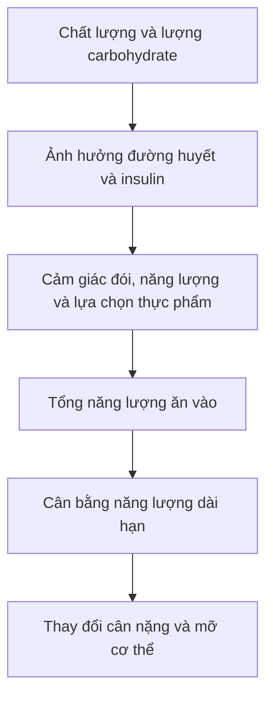

# 064 — Low Carb Explained

## Giải thích chế độ ăn ít carbohydrate

| Thuộc tính           | Nội dung                                                                               |
| -------------------- | -------------------------------------------------------------------------------------- |
| **Module**           | Module 07 — Common Dieting Trends Explained                                            |
| **Bài học**          | Low Carb Explained                                                                     |
| **Thời lượng**       | 03:23                                                                                  |
| **Chủ đề chính**     | Giải thích chế độ ăn ít carbohydrate                                                   |
| **Kết luận cốt lõi** | Low-carb là một công cụ có thể hữu ích, nhưng không tự động tốt hơn chế độ ăn cân bằng |

## Mục lục

1. [Mục tiêu bài học](#1-mục-tiêu-bài-học)
2. [Nội dung chính](#2-nội-dung-chính)
3. [Áp dụng thực tế](#3-áp-dụng-thực-tế)
4. [Lưu ý và lỗi thường gặp](#4-lưu-ý-và-lỗi-thường-gặp)
5. [Checklist thực hành](#5-checklist-thực-hành)
6. [Tóm tắt](#6-tóm-tắt)

---

> **Ảnh minh họa:** Một bữa ăn ít carbohydrate có thể gồm nguồn protein, rau, quả bơ và một lượng chất béo phù hợp.
> Nguồn: [Wikimedia Commons — CC BY-SA 4.0](https://commons.wikimedia.org/wiki/File:Eggs,fried_fish,avocado_and_some_vegetables_on_display.jpg). ([Wikimedia Commons][1])

---

## 1. Mục tiêu bài học

Sau bài học, người học có thể:

* Hiểu chế độ ăn low-carb là gì và phân biệt với ketogenic.
* Biết điều gì xảy ra khi giảm carbohydrate trong khẩu phần.
* Hiểu đúng mối quan hệ giữa carbohydrate, insulin và tích trữ mỡ.
* Đánh giá ưu, nhược điểm của low-carb đối với giảm cân và tập luyện.
* Biết cách giảm carbohydrate mà không làm khẩu phần thiếu chất xơ hoặc quá nhiều chất béo bão hòa.
* Quyết định low-carb có phù hợp với mục tiêu và lối sống cá nhân hay không.

---

## 2. Nội dung chính

### 2.1. Low-carb là gì?

**Low-carb** là cách ăn giảm lượng carbohydrate so với khẩu phần thông thường. Tuy nhiên, thuật ngữ này **không có một ngưỡng duy nhất được thống nhất trong mọi nghiên cứu**.

Một cách phân loại mang tính tham khảo:

| Mức độ                | Carbohydrate mỗi ngày | Đặc điểm                                     |
| --------------------- | --------------------: | -------------------------------------------- |
| **Giảm nhẹ**          |      Khoảng 130–180 g | Giảm đồ ngọt, nước ngọt và tinh bột tinh chế |
| **Low-carb vừa phải** |       Khoảng 50–130 g | Hạn chế rõ rệt cơm, mì, bánh mì và đồ ngọt   |
| **Very low-carb**     |      Dưới khoảng 50 g | Rất ít thực phẩm giàu carbohydrate           |
| **Ketogenic**         | Thường khoảng 20–50 g | Mục tiêu tạo và duy trì trạng thái ketosis   |

Các ngưỡng trên chỉ dùng để định hướng. Một số tài liệu coi dưới 130 g/ngày là low-carb, trong khi các chế độ nghiêm ngặt có thể giới hạn dưới 50 g/ngày. ([Verbraucherzentrale Hessen][2])

> **Low-carb không đồng nghĩa với keto.**
> Mọi chế độ keto đều rất ít carbohydrate, nhưng không phải mọi chế độ low-carb đều tạo ra ketosis.

---

### 2.2. Giảm carbohydrate thì phải tăng chất gì?

Carbohydrate cung cấp khoảng **4 kcal mỗi gram**. Khi cắt giảm carbohydrate nhưng vẫn giữ nguyên tổng năng lượng, lượng calorie thiếu hụt phải được thay bằng:

* Protein;
* Chất béo;
* Hoặc kết hợp cả hai.

Ví dụ, nếu giảm 100 g carbohydrate, khẩu phần sẽ giảm khoảng 400 kcal. Nếu không muốn tạo thâm hụt năng lượng, người ăn phải bổ sung calorie từ protein hoặc chất béo.

Điều này giải thích vì sao nhiều chế độ low-carb đồng thời là:

* Chế độ giàu protein;
* Chế độ giàu chất béo;
* Hoặc cả hai.

Tuy nhiên, **chất lượng thực phẩm thay thế carbohydrate rất quan trọng**. Thay bánh kẹo và nước ngọt bằng cá, trứng, đậu phụ, rau, hạt và dầu thực vật khác hoàn toàn với việc thay chúng bằng thịt chế biến, xúc xích, bơ và lượng lớn phô mai.

---

### 2.3. Carbohydrate không phải “vi chất”

Transcript gốc gọi carbohydrate là một **micronutrient**, nhưng đây là lỗi thuật ngữ.

Carbohydrate là một trong ba **chất dinh dưỡng đa lượng — macronutrients**:

1. Carbohydrate;
2. Protein;
3. Chất béo.

Cơ thể có thể tự tạo glucose từ một số amino acid, glycerol và các chất nền khác thông qua quá trình **tân tạo đường — gluconeogenesis**. Vì vậy, về mặt sinh hóa, không có một loại carbohydrate cụ thể được phân loại là “carbohydrate thiết yếu” giống như các amino acid hoặc acid béo thiết yếu.

Tuy nhiên, điều đó **không có nghĩa thực phẩm giàu carbohydrate là không cần thiết hoặc không có giá trị**. Ngũ cốc nguyên hạt, đậu, rau và trái cây còn cung cấp:

* Chất xơ;
* Vitamin và khoáng chất;
* Hợp chất thực vật;
* Nguồn năng lượng thuận lợi cho vận động.

WHO khuyến nghị tập trung vào **chất lượng carbohydrate**, ưu tiên ngũ cốc nguyên hạt, rau, trái cây và các loại đậu; người trên 10 tuổi nên hướng tới ít nhất khoảng 25 g chất xơ tự nhiên mỗi ngày. ([World Health Organization][3])

---

### 2.4. Carbohydrate, insulin và tích trữ mỡ

Lập luận thường gặp của những người ủng hộ low-carb là:

Chuỗi trên mô tả **một phần sinh lý học**, nhưng kết luận “ăn carbohydrate tất yếu làm tăng mỡ” là quá đơn giản.

Insulin giúp:

* Đưa glucose vào tế bào;
* Tăng tổng hợp glycogen;
* Hỗ trợ sử dụng glucose;
* Hạn chế giải phóng năng lượng dự trữ trong thời gian sau bữa ăn.

> **Sơ đồ:** Insulin liên kết với thụ thể, thúc đẩy vận chuyển glucose vào tế bào, tổng hợp glycogen, đường phân và một số quá trình lưu trữ năng lượng.
> Nguồn: [Wikimedia Commons — Public Domain](https://commons.wikimedia.org/wiki/File:Insulin_glucose_metabolism_ZP.svg). ([Wikimedia Commons][4])

Tuy nhiên, insulin tăng sau bữa ăn **không tự động tạo ra sự tăng mỡ ròng trong nhiều ngày hoặc nhiều tuần**. Điều đó còn phụ thuộc vào:

* Tổng năng lượng ăn vào;
* Tổng năng lượng tiêu hao;
* Thành phần thực phẩm;
* Mức vận động;
* Thời gian duy trì chế độ ăn.

Trong một nghiên cứu chuyển hóa có kiểm soát, việc giảm carbohydrate làm insulin giảm rõ rệt, nhưng giảm chất béo lại tạo ra mức giảm mỡ cơ thể hơi lớn hơn trong thời gian thử nghiệm ngắn. Kết quả này không chứng minh rằng low-fat luôn tốt hơn, nhưng cho thấy việc giảm insulin không đồng nghĩa với lợi thế giảm mỡ tự động. ([PubMed][5])

#### Kết luận phù hợp hơn

---

### 2.5. Có phải mọi carbohydrate đều giống nhau?

Không nên đánh đồng các nguồn carbohydrate sau:

| Nên hạn chế                       | Có thể giữ trong khẩu phần                  |
| --------------------------------- | ------------------------------------------- |
| Nước ngọt có đường                | Rau củ                                      |
| Kẹo và bánh ngọt                  | Trái cây nguyên quả                         |
| Ngũ cốc ăn sáng nhiều đường       | Yến mạch và ngũ cốc nguyên hạt              |
| Bánh mì trắng                     | Khoai, gạo nguyên cám với khẩu phần phù hợp |
| Trà sữa, nước trái cây thêm đường | Đậu, đậu lăng và đậu gà                     |
| Đồ ăn siêu chế biến               | Sữa chua không đường                        |

Việc giảm carbohydrate thường đem lại lợi ích rõ nhất khi người ăn loại bỏ:

* Đường bổ sung;
* Nước ngọt;
* Bánh kẹo;
* Thực phẩm làm từ bột tinh chế;
* Đồ ăn siêu chế biến.

WHO nhấn mạnh nên thay carbohydrate tinh chế bằng thực phẩm chứa carbohydrate tự nhiên và chất xơ như ngũ cốc nguyên hạt, rau, trái cây và các loại đậu. ([World Health Organization][6])

---

### 2.6. Low-carb đối với tập luyện và tăng cơ

Carbohydrate được lưu trữ dưới dạng **glycogen** trong cơ và gan. Glycogen đặc biệt hữu ích trong:

* Chạy nước rút;
* HIIT;
* Các môn thể thao đồng đội;
* Buổi tập kéo dài;
* Tập có nhiều hiệp với tổng khối lượng lớn.

Quan điểm trong transcript rằng thiếu carbohydrate chắc chắn làm mọi người yếu đi là hơi tuyệt đối. Phản ứng phụ thuộc vào:

* Loại hình tập;
* Thời lượng và cường độ;
* Tổng calorie;
* Protein;
* Mức thích nghi với chế độ ăn;
* Lượng carbohydrate còn lại.

Tuyên bố lập trường năm 2024 của International Society of Sports Nutrition kết luận chế độ ketogenic nhìn chung tạo hiệu quả **trung tính hoặc bất lợi** đối với thành tích thể thao khi so với chế độ nhiều carbohydrate và ít chất béo hơn, mặc dù khả năng oxy hóa chất béo tăng lên. ([PubMed Central (PMC)][7])

Tuy vậy, tổng quan về tập sức mạnh cho thấy việc tăng carbohydrate không phải lúc nào cũng cải thiện thành tích trong các buổi tập đã ăn no và có khối lượng vừa phải. Một tổng quan năm 2026 cũng chưa tìm thấy bằng chứng chắc chắn rằng lượng carbohydrate cao hơn tự nó làm tăng phì đại cơ, nhưng độ chắc chắn của bằng chứng còn thấp. ([PubMed Central (PMC)][8])

#### Kết luận thực hành

* Người tập nhẹ hoặc tập sức mạnh với khối lượng vừa phải có thể hoạt động tốt với lượng carbohydrate thấp hơn.
* Người tập HIIT, chạy tốc độ, CrossFit, bóng đá hoặc tập bodybuilding khối lượng lớn thường hưởng lợi từ lượng carbohydrate cao hơn.
* Low-carb **không làm tăng cơ trở nên bất khả thi**, nhưng giảm quá sâu có thể làm giảm chất lượng tập ở một số người.

---

### 2.7. Low-carb có giúp giảm cân không?

**Có thể có.** Nhưng low-carb không loại bỏ yêu cầu kiểm soát tổng năng lượng.

Low-carb có thể tạo thâm hụt calorie bằng cách:

* Loại bỏ đồ uống có đường;
* Giảm đồ ăn vặt;
* Tăng lượng protein;
* Đơn giản hóa lựa chọn thực phẩm;
* Giảm sự đa dạng của thực phẩm dễ ăn quá mức.

Tuy nhiên, người ăn vẫn có thể tăng cân khi tiêu thụ quá nhiều:

* Các loại hạt;
* Phô mai;
* Bơ;
* Dầu;
* Thịt nhiều mỡ;
* Đồ ăn vặt mang nhãn “keto”.

Tổng quan Cochrane cho thấy chế độ low-carb và chế độ carbohydrate cân bằng tạo ra **ít hoặc không có khác biệt đáng kể về giảm cân và phần lớn yếu tố nguy cơ tim mạch trong thời gian theo dõi đến hai năm**. Điều này cho thấy khả năng tuân thủ và chất lượng khẩu phần thường quan trọng hơn việc chọn một tỷ lệ carbohydrate “hoàn hảo”. ([Cochrane Library][9])

---

### 2.8. Low-carb có chắc chắn gây đói không?

Không.

Transcript cho rằng low-carb “gần như đảm bảo” người ăn phải vật lộn với cơn đói. Khẳng định này không phù hợp với toàn bộ bằng chứng.

Cảm giác no phụ thuộc vào nhiều yếu tố:

* Protein;
* Chất xơ;
* Mật độ năng lượng;
* Thể tích thực phẩm;
* Mức độ chế biến;
* Khả năng thích nghi cá nhân;
* Ketosis trong các chế độ rất ít carbohydrate.

Một phân tích về chế độ ketogenic ghi nhận nhiều người ít đói hơn hoặc duy trì cảm giác no tốt hơn khi ở trạng thái ketosis, mặc dù kết quả giữa các nghiên cứu không hoàn toàn đồng nhất. ([PubMed][10])

Vấn đề phát sinh khi người ăn:

1. Cắt bỏ yến mạch, đậu, trái cây và ngũ cốc nguyên hạt;
2. Không bổ sung đủ rau và chất xơ;
3. Ăn chủ yếu thực phẩm giàu chất béo nhưng thể tích nhỏ;
4. Không ăn đủ protein.

Do đó, không thể kết luận low-carb luôn gây đói hoặc luôn làm giảm đói.

---

### 2.9. Ai có thể phù hợp với low-carb?

Low-carb có thể là lựa chọn hợp lý với người:

* Thường xuyên ăn nhiều bánh kẹo, nước ngọt hoặc tinh bột tinh chế;
* Ít vận động và không cần lượng lớn carbohydrate phục vụ tập luyện;
* Dễ kiểm soát khẩu phần hơn khi giảm cơm, mì và đồ ngọt;
* Thích thực phẩm giàu protein, rau và chất béo không bão hòa;
* Có tình trạng rối loạn đường huyết và được chuyên gia y tế hướng dẫn.

Ở người đái tháo đường type 2, các chế độ low-carb có thể cải thiện HbA1c, glucose đói, triglyceride và HDL trong một số thử nghiệm. Tuy nhiên, hiệu quả phụ thuộc vào mức độ tuân thủ, thời gian theo dõi, thuốc đang dùng và thành phần chất béo thay thế carbohydrate. ([PubMed Central (PMC)][11])

---

### 2.10. Ai cần thận trọng?

Không nên tự áp dụng low-carb nghiêm ngặt khi:

* Đang dùng insulin hoặc thuốc có nguy cơ gây hạ đường huyết;
* Đang mang thai hoặc cho con bú;
* Có tiền sử rối loạn ăn uống;
* Có bệnh thận, gan hoặc tụy;
* Là vận động viên có khối lượng tập lớn;
* Có triệu chứng mệt mỏi, chóng mặt hoặc giảm hiệu suất kéo dài.

Người đang điều trị đái tháo đường cần trao đổi với bác sĩ vì giảm carbohydrate có thể làm nhu cầu thuốc thay đổi.

---

## 3. Áp dụng thực tế

### 3.1. Nguyên tắc “giảm carbohydrate thông minh”

Thứ tự ưu tiên nên là:

Không nên bắt đầu bằng việc loại bỏ toàn bộ:

* Rau củ;
* Trái cây;
* Đậu;
* Ngũ cốc nguyên hạt.

---

### 3.2. Cấu trúc một bữa low-carb cân bằng

| Thành phần                        | Tỷ lệ tham khảo | Ví dụ                               |
| --------------------------------- | --------------: | ----------------------------------- |
| **Rau không chứa nhiều tinh bột** |           ½ đĩa | Rau cải, súp lơ, bí xanh, dưa chuột |
| **Protein**                       |         ¼–⅓ đĩa | Cá, thịt nạc, trứng, đậu phụ        |
| **Carbohydrate giàu chất xơ**     |         0–¼ đĩa | Gạo lứt, khoai, đậu, yến mạch       |
| **Chất béo không bão hòa**        |       Lượng nhỏ | Dầu ô liu, bơ, hạt                  |

> Low-carb là **giảm khẩu phần carbohydrate**, không nhất thiết phải xóa hoàn toàn nhóm thực phẩm này khỏi đĩa ăn.

---

### 3.3. Ví dụ thực đơn một ngày

#### Bữa sáng

* Trứng ốp hoặc trứng luộc;
* Rau củ;
* Sữa chua không đường;
* Một phần nhỏ trái cây.

#### Bữa trưa

* Cá hoặc ức gà;
* Nhiều rau;
* Một phần cơm hoặc khoai nhỏ;
* Canh rau.

#### Bữa phụ

* Sữa chua Hy Lạp không đường;
* Hoặc một lượng hạt được chia khẩu phần trước.

#### Bữa tối

* Đậu phụ, thịt nạc hoặc cá;
* Rau xào ít dầu;
* Đậu hoặc một lượng nhỏ ngũ cốc nguyên hạt nếu cần.

---

### 3.4. Điều chỉnh carbohydrate theo vận động

| Mức hoạt động                        | Cách tiếp cận                                           |
| ------------------------------------ | ------------------------------------------------------- |
| Ít vận động                          | Có thể giảm phần cơm, mì và đồ ăn vặt                   |
| Đi bộ, tập nhẹ                       | Giữ một lượng vừa phải từ rau, trái cây, đậu và ngũ cốc |
| Tập tạ khối lượng cao                | Có thể bố trí carbohydrate trước hoặc sau tập           |
| HIIT, chạy tốc độ, thể thao đồng đội | Không nên giảm quá sâu nếu hiệu suất suy giảm           |
| Tập sức bền kéo dài                  | Nhu cầu carbohydrate thường cao hơn                     |

---

### 3.5. Thử nghiệm cá nhân trong 14 ngày

Có thể đánh giá một chế độ low-carb vừa phải theo quy trình:

1. Giữ nguyên protein.
2. Loại bỏ nước ngọt và bánh kẹo.
3. Giảm khoảng ¼–⅓ khẩu phần cơm, mì hoặc bánh mì.
4. Tăng rau và thực phẩm giàu chất xơ.
5. Không tự do thêm dầu, bơ, phô mai và các loại hạt.
6. Theo dõi:

   * Cảm giác đói;
   * Năng lượng;
   * Tiêu hóa;
   * Hiệu suất tập;
   * Khả năng duy trì;
   * Cân nặng trung bình theo tuần.
7. Điều chỉnh dựa trên phản ứng thực tế thay vì cố tuân theo một con số cứng nhắc.

---

## 4. Lưu ý và lỗi thường gặp

### Lỗi 1: Cho rằng mọi carbohydrate đều có hại

Carbohydrate trong nước ngọt không tương đương carbohydrate trong đậu, rau, trái cây hoặc ngũ cốc nguyên hạt.

**Cách sửa:** đánh giá nguồn thực phẩm, lượng chất xơ và mức độ chế biến.

---

### Lỗi 2: Tin rằng insulin tăng đồng nghĩa với tăng mỡ

Insulin có vai trò lưu trữ năng lượng, nhưng thay đổi mỡ cơ thể dài hạn vẫn chịu ảnh hưởng lớn từ tổng năng lượng và hành vi ăn uống. Mô hình carbohydrate–insulin vẫn là chủ đề tranh luận khoa học, không phải lời giải thích duy nhất cho béo phì. ([PubMed][12])

---

### Lỗi 3: Low-carb nên ăn bao nhiêu chất béo cũng được

Một gram chất béo cung cấp nhiều năng lượng hơn một gram carbohydrate. Các loại hạt, dầu, bơ và phô mai có thể khiến tổng calorie tăng rất nhanh.

**Cách sửa:** dùng chất béo như thành phần của bữa ăn, không coi đó là thực phẩm “miễn phí”.

---

### Lỗi 4: Thay carbohydrate bằng thịt chế biến và chất béo bão hòa

Low-carb không tự động lành mạnh. Chất lượng protein và chất béo vẫn quan trọng.

**Nên ưu tiên:**

* Cá;
* Thịt nạc;
* Trứng với khẩu phần phù hợp;
* Đậu phụ;
* Dầu thực vật;
* Quả bơ;
* Các loại hạt đã kiểm soát lượng.

---

### Lỗi 5: Cắt cả chất xơ

Loại bỏ đồng thời trái cây, đậu và ngũ cốc nguyên hạt có thể khiến khẩu phần ít chất xơ.

**Cách sửa:** tăng rau không chứa nhiều tinh bột, hạt, đậu với khẩu phần phù hợp và các nguồn chất xơ khác.

---

### Lỗi 6: Cho rằng low-carb chắc chắn gây đói

Một số người đói hơn; một số lại ít đói hơn vì ăn nhiều protein hoặc nhờ ketosis.

**Cách sửa:** đánh giá cảm giác đói thực tế và thành phần toàn bộ bữa ăn.

---

### Lỗi 7: Áp dụng con số 100 g cho mọi người ít vận động

Nhu cầu carbohydrate không chỉ phụ thuộc vào việc tập thể dục mà còn liên quan đến:

* Tổng năng lượng;
* Khối lượng cơ thể;
* Công việc;
* Sở thích;
* Bệnh lý;
* Khả năng tuân thủ.

Không có cơ sở để coi 100 g/ngày là mức tối ưu cho mọi người ít vận động.

---

### Lỗi 8: Đánh giá hiệu quả chỉ bằng vài ngày đầu

Cân nặng ngắn hạn có thể thay đổi do lượng nước, glycogen và thức ăn trong đường tiêu hóa.

**Cách sửa:** đánh giá xu hướng trung bình trong ít nhất vài tuần cùng với vòng eo, hiệu suất và cảm giác khỏe mạnh.

---

## 5. Checklist thực hành

### Trước khi bắt đầu

* [ ] Xác định mục tiêu: giảm mỡ, kiểm soát đường huyết hay đơn giản hóa khẩu phần.
* [ ] Phân biệt low-carb vừa phải với ketogenic.
* [ ] Kiểm tra tình trạng sức khỏe và thuốc đang dùng.
* [ ] Xác định những nguồn carbohydrate tinh chế cần giảm trước.

### Trong quá trình thực hiện

* [ ] Mỗi bữa có một nguồn protein.
* [ ] Khoảng một nửa đĩa là rau.
* [ ] Không loại bỏ chất xơ một cách vô tình.
* [ ] Ưu tiên chất béo không bão hòa.
* [ ] Kiểm soát dầu, hạt, phô mai và thịt nhiều mỡ.
* [ ] Theo dõi năng lượng và hiệu suất tập.
* [ ] Không mặc định thực phẩm dán nhãn “low-carb” là lành mạnh.

### Khi đánh giá kết quả

* [ ] Tôi có kiểm soát cơn đói tốt hơn không?
* [ ] Chất lượng tập luyện có giảm không?
* [ ] Tiêu hóa có ổn định không?
* [ ] Tôi có thể duy trì cách ăn này lâu dài không?
* [ ] Cân nặng và vòng eo có thay đổi theo hướng mong muốn không?
* [ ] Chất lượng thực phẩm có tốt hơn trước không?

---

## 6. Tóm tắt

> **Low-carb là một lựa chọn, không phải quy luật bắt buộc.**

* Low-carb nghĩa là giảm carbohydrate, nhưng không có một ngưỡng duy nhất cho tất cả mọi người.
* Carbohydrate là **chất dinh dưỡng đa lượng**, không phải vi chất.
* Cơ thể có thể tồn tại với rất ít carbohydrate, nhưng điều đó không có nghĩa thực phẩm giàu carbohydrate và chất xơ là vô ích.
* Carbohydrate làm insulin tăng, nhưng insulin không tự động khiến cơ thể tăng mỡ bất chấp tổng năng lượng.
* Low-carb có thể hỗ trợ giảm cân nếu giúp người ăn giảm tổng calorie và cải thiện chất lượng thực phẩm.
* Bằng chứng hiện có không cho thấy low-carb luôn giảm cân tốt hơn chế độ ăn carbohydrate cân bằng trong dài hạn. ([Cochrane][13])
* Low-carb không chắc chắn gây đói; phản ứng khác nhau giữa từng người.
* Người tập cường độ cao hoặc khối lượng lớn thường cần nhiều carbohydrate hơn người ít vận động.
* Cách tiếp cận hợp lý nhất là **giảm đường và carbohydrate tinh chế trước**, sau đó điều chỉnh lượng carbohydrate toàn phần dựa trên mục tiêu, hiệu suất và khả năng duy trì.

> **Công thức thực hành:**
> **Protein đầy đủ + nhiều rau + carbohydrate chất lượng với lượng phù hợp + chất béo lành mạnh + tổng calorie phù hợp.**

[1]: https://commons.wikimedia.org/wiki/File%3AEggs%2Cfried_fish%2Cavocado_and_some_vegetables_on_display.jpg "File:Eggs,fried fish,avocado and some vegetables on display.jpg - Wikimedia Commons"
[2]: https://www.verbraucherzentrale-hessen.de/lebensmittel/schlankheitsmittel-und-diaeten/low-carb-sinnvoll-oder-ueberfluessig-28678 "Low Carb, Slow Carb, No Carb: Sinnvoll oder überflüssig? | Verbraucherzentrale Hessen"
[3]: https://www.who.int/publications/i/item/9789240073593?utm_source=chatgpt.com "Carbohydrate intake for adults and children: WHO guideline"
[4]: https://commons.wikimedia.org/wiki/File%3AInsulin_glucose_metabolism_ZP.svg "File:Insulin glucose metabolism ZP.svg - Wikimedia Commons"
[5]: https://pubmed.ncbi.nlm.nih.gov/26278052/?utm_source=chatgpt.com "Calorie for Calorie, Dietary Fat Restriction Results in More Body Fat Loss than Carbohydrate Restriction in People with Obesity - PubMed"
[6]: https://www.who.int/news/item/17-07-2023-who-updates-guidelines-on-fats-and-carbohydrates?utm_source=chatgpt.com "WHO updates guidelines on fats and carbohydrates"
[7]: https://pmc.ncbi.nlm.nih.gov/articles/PMC11212571/?utm_source=chatgpt.com "International society of sports nutrition position stand - PMC"
[8]: https://pmc.ncbi.nlm.nih.gov/articles/PMC8878406/?utm_source=chatgpt.com "The Effect of Carbohydrate Intake on Strength and Resistance ..."
[9]: https://www.cochranelibrary.com/cdsr/doi/10.1002/14651858.CD013334.pub2/pdf/CDSR/CD013334/CD013334_abstract.pdf?utm_source=chatgpt.com "Cochrane
Library
Cochrane Database of Systematic R"
[10]: https://pubmed.ncbi.nlm.nih.gov/25402637/?utm_source=chatgpt.com "Do ketogenic diets really suppress appetite? A systematic ..."
[11]: https://pmc.ncbi.nlm.nih.gov/articles/PMC11743357/?utm_source=chatgpt.com "The effects of low-carbohydrate diet on glucose and lipid ..."
[12]: https://pubmed.ncbi.nlm.nih.gov/29971406/?utm_source=chatgpt.com "The Carbohydrate-Insulin Model of Obesity: Beyond \"Calories In, Calories Out\" - PubMed"
[13]: https://www.cochrane.org/evidence/CD013334_low-carbohydrate-diets-or-balanced-carbohydrate-diets-which-works-better-weight-loss-and-heart?utm_source=chatgpt.com "Low-carbohydrate diets or balanced-carbohydrate diets: which works better for weight loss and heart disease risks? | Cochrane"

---

# Bài luyện tập

## Mục tiêu

## Đề bài

## Yêu cầu hoàn thành

- [ ] 
- [ ] 
- [ ] 

## Kết quả / lời giải

## Ghi chú
