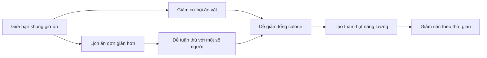

# 065 — Intermittent Fasting

| Thuộc tính           | Nội dung                                                                          |
| -------------------- | --------------------------------------------------------------------------------- |
| **Module**           | Module 07 — Common Dieting Trends Explained                                       |
| **Bài học**          | Intermittent Fasting                                                              |
| **Thời lượng**       | 03:16                                                                             |
| **Chủ đề chính**     | Nhịn ăn gián đoạn                                                                 |
| **Tên tiếng Việt**   | Nhịn ăn gián đoạn / giới hạn khung giờ ăn                                         |
| **Kết luận cốt lõi** | Đây là một cách **sắp xếp thời gian ăn**, không phải “phương pháp đốt mỡ thần kỳ” |

> **Lưu ý học thuật:** Nội dung gốc đúng ở điểm nhịn ăn gián đoạn thường **không vượt trội rõ rệt** so với chế độ giảm calorie thông thường. Tuy nhiên, tuyên bố rằng phương pháp này hoàn toàn không mang lại lợi ích về chuyển hóa là quá tuyệt đối. Một số thử nghiệm cho thấy lợi ích khiêm tốn trong những điều kiện cụ thể, đặc biệt với khung giờ ăn sớm; kết quả nghiên cứu hiện vẫn chưa hoàn toàn đồng nhất. ([New England Journal of Medicine][1])

---

## Mục lục

1. [Mục tiêu bài học](#1-mục-tiêu-bài-học)
2. [Nội dung chính](#2-nội-dung-chính)
3. [Áp dụng thực tế](#3-áp-dụng-thực-tế)
4. [Lưu ý & lỗi thường gặp](#4-lưu-ý--lỗi-thường-gặp)
5. [Checklist thực hành](#5-checklist-thực-hành)
6. [Tóm tắt](#6-tóm-tắt)

---

## 1. Mục tiêu bài học

Sau bài học này, người học có thể:

* Giải thích được **nhịn ăn gián đoạn là gì** và phân biệt nó với việc nhịn đói kéo dài.
* Hiểu cách hoạt động của các mô hình phổ biến như `12:12`, `14:10`, `16:8`, `18:6` và `5:2`.
* Nhận biết rằng giảm cân chủ yếu vẫn phụ thuộc vào **cân bằng năng lượng**, chất lượng khẩu phần và khả năng duy trì.
* Đánh giá đúng các tuyên bố về insulin, hormone, sửa chữa tế bào và “đốt mỡ”.
* Xác định người phù hợp, người không phù hợp và cách thử nghiệm phương pháp này an toàn.

---

## 2. Nội dung chính

### 2.1. Nhịn ăn gián đoạn là gì?

**Intermittent fasting — IF** là thuật ngữ chỉ các mô hình ăn uống xen kẽ giữa:

* **Giai đoạn ăn:** được phép tiêu thụ thực phẩm chứa năng lượng.
* **Giai đoạn nhịn:** không ăn hoặc giảm mạnh lượng năng lượng nạp vào.

Mô hình được nghiên cứu nhiều nhất là **time-restricted eating — TRE**, tức giới hạn toàn bộ bữa ăn trong một khung giờ nhất định mỗi ngày. Phần lớn mọi người thường ăn trong khoảng 12–14 giờ; TRE rút ngắn khoảng này xuống còn khoảng 6–10 giờ. ([Viện Quốc gia về Bệnh Tiểu đường và Thận][2])


*Nguồn ảnh: Wikimedia Commons, giấy phép Apache 2.0.* ([Wikimedia Commons][3])

---

### 2.2. Một ngày ăn uống thông thường

Một người có thể:

* Ăn sáng lúc `08:00`.
* Ăn các bữa chính và đồ ăn nhẹ trong ngày.
* Ăn bữa cuối lúc `21:00`.

Như vậy:

```text
Khung giờ ăn: 08:00 → 21:00 = 13 giờ
Khoảng không ăn: 21:00 → 08:00 = 11 giờ
```

Quá trình chuyển từ trạng thái sau ăn sang trạng thái nhịn diễn ra **dần dần**, không có một thời điểm chính xác mà cơ thể đột ngột “bật chế độ đốt mỡ”.

---

### 2.3. Mô hình 16:8

Với phương pháp `16:8`:

* Nhịn ăn trong **16 giờ**.
* Ăn trong khung thời gian **8 giờ**.

Ví dụ:

```mermaid
timeline
    title Ví dụ lịch ăn 16:8
    06:00 : Nước lọc
          : Cà phê đen hoặc trà không đường
    10:00 : Bắt đầu khung giờ ăn
          : Bữa ăn thứ nhất
    14:00 : Bữa ăn hoặc bữa phụ
    18:00 : Bữa ăn cuối
          : Kết thúc khung giờ ăn
    18:00 - 10:00 : Giai đoạn nhịn
```

Một lịch khác thường gặp là ăn từ `12:00–20:00`. Trong thời gian nhịn, nước lọc và đồ uống không calorie như trà không đường hoặc cà phê đen thường được sử dụng. ([Viện Quốc gia về Bệnh Tiểu đường và Thận][2])

---

### 2.4. Các hình thức phổ biến

| Phương pháp        | Cách thực hiện                                         | Mức độ                    |
| ------------------ | ------------------------------------------------------ | ------------------------- |
| **12:12**          | Ăn trong 12 giờ, nhịn 12 giờ                           | Dễ bắt đầu                |
| **14:10**          | Ăn trong 10 giờ, nhịn 14 giờ                           | Tương đối nhẹ             |
| **16:8**           | Ăn trong 8 giờ, nhịn 16 giờ                            | Phổ biến nhất             |
| **18:6**           | Ăn trong 6 giờ, nhịn 18 giờ                            | Khá nghiêm ngặt           |
| **20:4**           | Ăn trong 4 giờ, nhịn 20 giờ                            | Khó đáp ứng đủ dinh dưỡng |
| **5:2**            | Ăn bình thường 5 ngày, giảm mạnh năng lượng 2 ngày     | Lịch theo tuần            |
| **Nhịn cách ngày** | Xen kẽ ngày ăn bình thường và ngày nhịn hoặc ăn rất ít | Khó duy trì               |

Các hình thức càng nghiêm ngặt không đồng nghĩa với hiệu quả càng cao. Cửa sổ ăn quá ngắn có thể khiến việc nạp đủ protein, chất xơ, vitamin và khoáng chất trở nên khó khăn.

---

### 2.5. Nhịn ăn gián đoạn giúp giảm cân như thế nào?

Cơ chế thực tế thường là:



Nhịn ăn gián đoạn không tự động làm giảm mỡ. Nó chủ yếu giúp một số người:

1. Bỏ bớt bữa ăn hoặc đồ ăn nhẹ.
2. Giảm số giờ có thể ăn trong ngày.
3. Giảm tổng năng lượng mà không phải ghi chép mọi món ăn.
4. Tuân thủ kế hoạch dễ hơn.

Trong nghiên cứu kéo dài 12 tháng, nhóm ăn trong cửa sổ 8 giờ và nhóm hạn chế calorie hằng ngày đều giảm khoảng 5% trọng lượng; hai phương pháp không khác biệt có ý nghĩa về mức giảm cân. ([PubMed Central (PMC)][4])

---

### 2.6. Bằng chứng nghiên cứu nói gì?

#### Thử nghiệm TREAT năm 2020

Trong thử nghiệm trên 116 người trưởng thành thừa cân hoặc béo phì, lịch ăn `12:00–20:00` không tạo ra mức giảm cân hoặc cải thiện chuyển hóa rõ rệt hơn so với nhóm ăn ba bữa thông thường. ([JAMA Network][5])

#### Thử nghiệm 12 tháng năm 2022

Người tham gia được chia thành:

* Giảm calorie kết hợp ăn trong khung `08:00–16:00`.
* Chỉ giảm calorie hằng ngày.

Sau 12 tháng, việc thêm giới hạn giờ ăn không giúp giảm thêm đáng kể cân nặng, mỡ cơ thể, mỡ nội tạng, huyết áp, glucose hoặc lipid máu. ([New England Journal of Medicine][1])

#### Ăn sớm trong ngày

Một số nghiên cứu nhỏ cho thấy **early time-restricted eating** — ưu tiên ăn sớm và kết thúc bữa tối sớm — có thể cải thiện insulin, độ nhạy insulin hoặc huyết áp ngay cả khi thay đổi cân nặng còn hạn chế. Tuy nhiên, những nghiên cứu ban đầu thường có quy mô nhỏ và thời gian ngắn. ([Cell][6])

Một thử nghiệm khác cho thấy kết hợp ăn sớm với hạn chế năng lượng tạo mức giảm cân lớn hơn đôi chút so với chỉ hạn chế năng lượng sau 14 tuần. Điều này gợi ý thời điểm ăn có thể ảnh hưởng đến kết quả, nhưng chưa chứng minh rằng mọi hình thức IF đều vượt trội. ([JAMA Network][7])

#### Người mắc đái tháo đường type 2

Trong một thử nghiệm kéo dài sáu tháng trên 75 người mắc đái tháo đường type 2, nhóm giới hạn giờ ăn giảm cân nhiều hơn nhóm hạn chế calorie, nhưng mức giảm HbA1c không khác biệt đáng kể giữa hai phương pháp. ([JAMA Network][8])


*Nguồn ảnh: National Institute of Diabetes and Digestive and Kidney Diseases — NIDDK.* 

---

### 2.7. Nhịn ăn có làm giảm insulin không?

Trong thời gian không ăn, insulin thường giảm so với giai đoạn ngay sau bữa ăn. Tuy nhiên:

* Insulin giảm tạm thời **không đồng nghĩa** với việc cơ thể sẽ giảm nhiều mỡ hơn trong nhiều tuần hoặc nhiều tháng.
* Kết quả dài hạn còn phụ thuộc tổng calorie, cân nặng, mức vận động, giấc ngủ và chất lượng thực phẩm.
* Khi tổng calorie và mức giảm cân tương đương, lợi ích chuyển hóa giữa IF và chế độ ăn thông thường thường khá giống nhau. ([New England Journal of Medicine][1])

---

### 2.8. Testosterone, sửa chữa tế bào và biểu hiện gene

Các nội dung quảng cáo thường cho rằng nhịn ăn:

* Tăng mạnh testosterone.
* Kích hoạt tự thực bào — autophagy.
* “Tái tạo” tế bào.
* Thay đổi gene theo hướng kéo dài tuổi thọ.

Những cơ chế này có cơ sở sinh học nhất định trong nghiên cứu tế bào và động vật, nhưng bằng chứng trực tiếp ở người chưa đủ để sử dụng chúng như những lợi ích lâm sàng chắc chắn của chế độ `16:8`.

Các thử nghiệm ở người chủ yếu ghi nhận các kết quả thực tế như cân nặng, glucose, insulin, huyết áp và lipid máu; chúng chưa cho thấy IF là phương pháp “trẻ hóa” hay tăng cơ vượt trội.

---

### 2.9. Yếu tố nào vẫn quyết định kết quả?

Dù áp dụng lịch ăn nào, kết quả dài hạn vẫn phụ thuộc vào:

[
\text{Kết quả} \approx
\text{Tổng calorie}

* \text{Protein}
* \text{Chất lượng thực phẩm}
* \text{Vận động}
* \text{Giấc ngủ}
* \text{Khả năng duy trì}
  ]

Nếu một người ăn cùng tổng calorie và cùng tỷ lệ protein, carbohydrate, chất béo như trước, chỉ thay đổi giờ ăn thì thay đổi về thành phần cơ thể có thể rất nhỏ.

---

## 3. Áp dụng thực tế

### 3.1. Ai có thể phù hợp?

Nhịn ăn gián đoạn có thể phù hợp với người:

* Không thích ăn sáng.
* Thích hai hoặc ba bữa lớn thay vì nhiều bữa nhỏ.
* Hay ăn vặt vào buổi tối và muốn đặt ra giới hạn rõ ràng.
* Cảm thấy việc theo dõi thời gian dễ hơn đếm calorie.
* Có lịch làm việc ổn định.
* Không bị giảm hiệu suất khi tập lúc bụng đói.
* Có thể ăn đủ protein và rau quả trong cửa sổ ăn.

---

### 3.2. Hai nhóm có thể hưởng lợi nhiều nhất

#### Nhóm 1: Thích ăn ít bữa nhưng khẩu phần lớn

Tần suất bữa ăn không quyết định trực tiếp tốc độ trao đổi chất. Một người không bắt buộc phải ăn năm hoặc sáu bữa mỗi ngày để giảm mỡ hoặc xây dựng cơ bắp.

IF cho phép tập trung năng lượng thành hai hoặc ba bữa lớn, nhờ đó người thực hiện có thể cảm thấy no và thỏa mãn hơn.

#### Nhóm 2: Khó kiểm soát đồ ăn vặt

Quy tắc “không ăn sau 20:00” có thể loại bỏ:

* Khoai tây chiên khi xem phim.
* Bánh ngọt vào ban đêm.
* Nước ngọt chứa đường.
* Ăn do buồn chán thay vì đói.
* Các calorie không được ghi chép.

Trong trường hợp này, hiệu quả đến từ **môi trường ăn uống được kiểm soát**, không phải do giai đoạn nhịn tạo ra phép màu sinh học.

---

### 3.3. Cách bắt đầu hợp lý

Không cần chuyển ngay sang `16:8` hoặc `20:4`.

#### Tuần 1: 12:12

```text
Ăn: 07:00–19:00
Nhịn: 19:00–07:00
```

Mục tiêu chính là bỏ thói quen ăn vặt muộn.

#### Tuần 2: 14:10

```text
Ăn: 08:00–18:00
Nhịn: 18:00–08:00
```

#### Tuần 3 trở đi: cân nhắc 16:8

```text
Ăn: 10:00–18:00
Nhịn: 18:00–10:00
```

Không nhất thiết phải tăng thời gian nhịn nếu `12:12` hoặc `14:10` đã giúp kiểm soát năng lượng tốt.

---

### 3.4. Khung giờ ăn sớm hay muộn?

Nếu lịch sinh hoạt cho phép, khung giờ ăn sớm thường hợp lý hơn:

| Khung giờ     | Đánh giá                                             |
| ------------- | ---------------------------------------------------- |
| `08:00–16:00` | Phù hợp nhịp ngày–đêm nhưng khó ăn tối cùng gia đình |
| `10:00–18:00` | Cân bằng giữa sinh học và tính thực tế               |
| `12:00–20:00` | Dễ tham gia bữa tối xã hội                           |
| `14:00–22:00` | Dễ ăn muộn, có thể ảnh hưởng giấc ngủ ở một số người |

Một số thử nghiệm cho thấy ăn sớm có thể tạo lợi ích chuyển hóa tốt hơn, nhưng lịch ăn có thể duy trì lâu dài vẫn quan trọng hơn một lịch “tối ưu” nhưng thường xuyên bị phá vỡ. ([Cell][6])

---

### 3.5. Cấu trúc bữa ăn trong cửa sổ ăn

Mỗi bữa chính nên bao gồm:

| Thành phần                    | Ví dụ                                         |
| ----------------------------- | --------------------------------------------- |
| **Protein**                   | Trứng, cá, thịt nạc, sữa chua, đậu phụ        |
| **Rau và trái cây**           | Rau lá xanh, cà chua, bông cải, táo, quả mọng |
| **Carbohydrate giàu chất xơ** | Gạo, khoai, yến mạch, bánh mì nguyên hạt      |
| **Chất béo phù hợp**          | Cá béo, quả bơ, các loại hạt, dầu thực vật    |
| **Chất lỏng**                 | Nước lọc, canh, sữa tùy nhu cầu               |

#### Ví dụ thực đơn 16:8

**10:00 — Bữa đầu tiên**

* Trứng hoặc sữa chua giàu protein.
* Yến mạch hoặc bánh mì nguyên hạt.
* Một phần trái cây.
* Rau hoặc salad.

**14:00 — Bữa phụ**

* Sữa chua không đường.
* Trái cây.
* Một lượng nhỏ các loại hạt.

**17:30 — Bữa cuối**

* Cá, thịt nạc hoặc đậu phụ.
* Cơm hoặc khoai.
* Nhiều rau.
* Nước lọc.

---

### 3.6. Tập luyện trong khi nhịn

Có ba lựa chọn:

#### Tập gần cuối thời gian nhịn

```text
09:00 tập → 10:00 ăn bữa đầu
```

Phù hợp khi cơ thể vẫn duy trì được hiệu suất.

#### Ăn trước rồi mới tập

```text
10:00 ăn → 12:00 tập
```

Phù hợp với buổi tập nặng hoặc người dễ chóng mặt khi đói.

#### Tập giữa cửa sổ ăn

```text
10:00 ăn → 15:00 tập → 17:30 ăn
```

Đây thường là phương án thuận tiện để có dinh dưỡng cả trước và sau tập.

> Không có yêu cầu bắt buộc phải tập lúc đói để giảm mỡ. Hiệu suất, khả năng phục hồi và sự an toàn quan trọng hơn.

---

### 3.7. Đánh giá sau 2–4 tuần

Theo dõi:

* Mức đói.
* Năng lượng trong ngày.
* Chất lượng giấc ngủ.
* Hiệu suất tập luyện.
* Khả năng tập trung.
* Số lần ăn quá mức.
* Cân nặng trung bình tuần.
* Vòng eo.
* Khả năng duy trì trong ngày làm việc và cuối tuần.

Nếu thường xuyên mệt mỏi, ăn bù mất kiểm soát hoặc hiệu suất tập giảm mạnh, lịch nhịn có thể không phù hợp.

---

## 4. Lưu ý & lỗi thường gặp

### 4.1. Xem IF như một phương pháp đốt mỡ thần kỳ

```text
Sai:
Nhịn 16 giờ → insulin thấp → tự động giảm mỡ

Đúng hơn:
Giới hạn giờ ăn → có thể ăn ít calorie hơn
→ duy trì thâm hụt năng lượng → giảm cân
```

IF chỉ hiệu quả khi nó giúp kiểm soát tổng năng lượng hoặc cải thiện khả năng tuân thủ.

---

### 4.2. Ăn bù trong cửa sổ ăn

Một người có thể nhịn 16 giờ nhưng sau đó ăn:

* Thức ăn nhanh.
* Đồ chiên.
* Bánh ngọt.
* Nước uống nhiều đường.
* Khẩu phần rất lớn.

Tổng calorie vẫn có thể vượt nhu cầu, khiến cân nặng không giảm hoặc tiếp tục tăng.

---

### 4.3. Chỉ quan tâm “khi nào ăn”

IF kiểm soát **thời gian**, nhưng không tự bảo đảm:

* Đủ protein.
* Đủ chất xơ.
* Đủ vitamin và khoáng chất.
* Chất lượng chất béo tốt.
* Khẩu phần phù hợp.

Khung giờ ăn tốt không thể bù đắp hoàn toàn cho một khẩu phần nghèo dinh dưỡng.

---

### 4.4. Bắt đầu bằng phương pháp quá cực đoan

Chuyển ngay sang `20:4` hoặc nhịn cách ngày có thể gây:

* Đói dữ dội.
* Đau đầu.
* Khó tập trung.
* Cáu gắt.
* Ăn quá mức khi kết thúc thời gian nhịn.
* Khó đạt đủ protein và vi chất.

Nên bắt đầu bằng `12:12` hoặc `14:10`.

---

### 4.5. Bỏ qua tình trạng sức khỏe và thuốc

Người mắc đái tháo đường, đặc biệt khi sử dụng insulin hoặc thuốc có nguy cơ gây hạ đường huyết, không nên tự ý thay đổi lịch ăn. Nhịn ăn có thể làm tăng nguy cơ hạ đường huyết, tăng đường huyết, mất nước hoặc nhiễm toan ceton nếu thuốc được điều chỉnh không phù hợp. ([Viện Quốc gia về Bệnh Tiểu đường và Thận][9])


*Nguồn ảnh: NIDDK.* 

---

### 4.6. Những người cần tránh hoặc tham vấn chuyên môn

Cần trao đổi với bác sĩ hoặc chuyên gia dinh dưỡng trước khi áp dụng nếu thuộc một trong các nhóm:

* Đang mang thai hoặc cho con bú.
* Có tiền sử rối loạn ăn uống.
* Đang dùng insulin, sulfonylurea hoặc thuốc ảnh hưởng đường huyết.
* Mắc đái tháo đường type 1.
* Thường xuyên bị hạ đường huyết.
* Thiếu cân hoặc suy dinh dưỡng.
* Người cao tuổi có nguy cơ mất khối cơ.
* Trẻ em và thanh thiếu niên đang phát triển.
* Người có bệnh mạn tính cần dùng thuốc cùng thức ăn.

NIDDK đặc biệt khuyến nghị người mắc đái tháo đường phải phối hợp với bác sĩ để điều chỉnh thuốc; người có tiền sử rối loạn ăn uống và phụ nữ mang thai không nên tự áp dụng chế độ nhịn ăn. ([Viện Quốc gia về Bệnh Tiểu đường và Thận][2])

---

### 4.7. Nhịn khô

**Nhịn khô** là không uống cả nước trong giai đoạn nhịn. Đây không phải yêu cầu của IF phục vụ kiểm soát cân nặng và làm tăng nguy cơ mất nước.

Với TRE thông thường, nên duy trì nước lọc đầy đủ.

---

### 4.8. Bỏ qua khối lượng cơ

Khi giảm cân, một phần trọng lượng giảm có thể đến từ khối nạc. Để hạn chế mất cơ:

* Ăn đủ protein.
* Tập kháng lực đều đặn.
* Không tạo thâm hụt calorie quá lớn.
* Không ép cửa sổ ăn ngắn đến mức không thể ăn đủ.
* Theo dõi sức mạnh khi tập.

Nguy cơ mất cơ cần được chú ý hơn ở người lớn tuổi. ([Viện Quốc gia về Bệnh Tiểu đường và Thận][2])

---

## 5. Checklist thực hành

### Trước khi bắt đầu

* [ ] Tôi không có tiền sử rối loạn ăn uống.
* [ ] Tôi không mang thai hoặc cho con bú.
* [ ] Tôi đã hỏi bác sĩ nếu đang dùng thuốc kiểm soát đường huyết.
* [ ] Tôi chọn mục tiêu thực tế, bắt đầu bằng `12:12` hoặc `14:10`.
* [ ] Tôi xác định rõ giờ bắt đầu và kết thúc khung ăn.
* [ ] Tôi đã chuẩn bị nước và đồ uống không calorie.
* [ ] Tôi có kế hoạch ăn đủ protein, rau và thực phẩm giàu chất xơ.

### Trong quá trình thực hiện

* [ ] Tôi uống đủ nước.
* [ ] Tôi không dùng thời gian nhịn để “bù” cho việc ăn quá mức.
* [ ] Tôi không biến cửa sổ ăn thành khoảng thời gian ăn tự do không giới hạn.
* [ ] Tôi duy trì tập luyện kháng lực.
* [ ] Tôi theo dõi mức đói, giấc ngủ và hiệu suất tập.
* [ ] Tôi đánh giá cân nặng bằng trung bình tuần, không chỉ một ngày.
* [ ] Tôi vẫn linh hoạt trong các dịp xã hội cần thiết.

### Dấu hiệu nên dừng hoặc điều chỉnh

* [ ] Chóng mặt hoặc gần ngất.
* [ ] Hạ đường huyết.
* [ ] Mệt mỏi kéo dài.
* [ ] Mất ngủ.
* [ ] Ăn vô độ sau thời gian nhịn.
* [ ] Ám ảnh về giờ ăn.
* [ ] Giảm rõ rệt hiệu suất học tập hoặc làm việc.
* [ ] Giảm sức mạnh tập luyện liên tục.
* [ ] Rối loạn chu kỳ kinh nguyệt.
* [ ] Không thể đáp ứng đủ dinh dưỡng.

---

## 6. Tóm tắt

### Những điểm cần nhớ

1. **Nhịn ăn gián đoạn là một lịch ăn**, không phải một loại thực phẩm hoặc công thức giảm mỡ đặc biệt.

2. Mô hình phổ biến nhất là `16:8`, nhưng `12:12` hoặc `14:10` có thể dễ duy trì hơn.

3. IF thường giúp giảm cân vì nó làm giảm cơ hội ăn vặt và tổng calorie, không phải vì cơ thể bước vào một “trạng thái đốt mỡ thần kỳ”.

4. Khi calorie tương đương, phần lớn các thử nghiệm dài hạn không cho thấy IF vượt trội rõ rệt so với hạn chế calorie thông thường. ([New England Journal of Medicine][1])

5. Một số nghiên cứu về khung giờ ăn sớm ghi nhận cải thiện khiêm tốn về insulin, huyết áp hoặc cân nặng, nhưng kết quả còn phụ thuộc đối tượng và thiết kế nghiên cứu. ([Cell][6])

6. Chất lượng thực phẩm, protein, tổng calorie, tập luyện và khả năng duy trì vẫn quan trọng hơn việc cố kéo dài thời gian nhịn.

7. Người có bệnh nền, đang dùng thuốc hạ đường huyết, mang thai hoặc có tiền sử rối loạn ăn uống không nên tự áp dụng.

### Kết luận cuối cùng

> **Intermittent fasting không phải thuốc chữa mọi vấn đề về giảm cân hoặc xây dựng cơ bắp. Đây đơn giản là một công cụ tổ chức bữa ăn. Nếu công cụ này giúp anh kiểm soát calorie, hạn chế ăn vặt và duy trì khẩu phần tốt hơn, nó có thể hữu ích. Nếu nó khiến anh mệt, ăn bù hoặc tập luyện kém đi, một lịch ăn truyền thống sẽ phù hợp hơn.**

[1]: https://www.nejm.org/doi/full/10.1056/NEJMoa2114833?utm_source=chatgpt.com "Calorie Restriction with or without Time-Restricted Eating ..."
[2]: https://www.niddk.nih.gov/health-information/professionals/diabetes-discoveries-practice/patients-intermittent-fasting "What Can You Tell Your Patients About Intermittent Fasting and Type 2 Diabetes? - Blog - NIDDK"
[3]: https://commons.wikimedia.org/wiki/File%3AIntermittent_fasting.svg "File:Intermittent fasting.svg - Wikimedia Commons"
[4]: https://pmc.ncbi.nlm.nih.gov/articles/PMC11192144/?utm_source=chatgpt.com "Time-Restricted Eating Without Calorie Counting for Weight Loss in a Racially Diverse Population: A Randomized Controlled Trial - PMC"
[5]: https://jamanetwork.com/journals/jamainternalmedicine/fullarticle/2771095?utm_source=chatgpt.com "Effects of Time-Restricted Eating on Weight Loss and Other ..."
[6]: https://www.cell.com/cell-metabolism/fulltext/S1550-4131%2818%2930253-5?utm_source=chatgpt.com "Early Time-Restricted Feeding Improves Insulin Sensitivity ..."
[7]: https://jamanetwork.com/journals/jamainternalmedicine/fullarticle/2794819?utm_source=chatgpt.com "Effectiveness of Early Time-Restricted Eating for Weight ..."
[8]: https://jamanetwork.com/journals/jamanetworkopen/fullarticle/2811116?utm_source=chatgpt.com "Effect of Time-Restricted Eating on Weight Loss in Adults ..."
[9]: https://www.niddk.nih.gov/health-information/professionals/diabetes-discoveries-practice/fasting-safely-with-diabetes "Fasting Safely with Diabetes - Blog - NIDDK"
