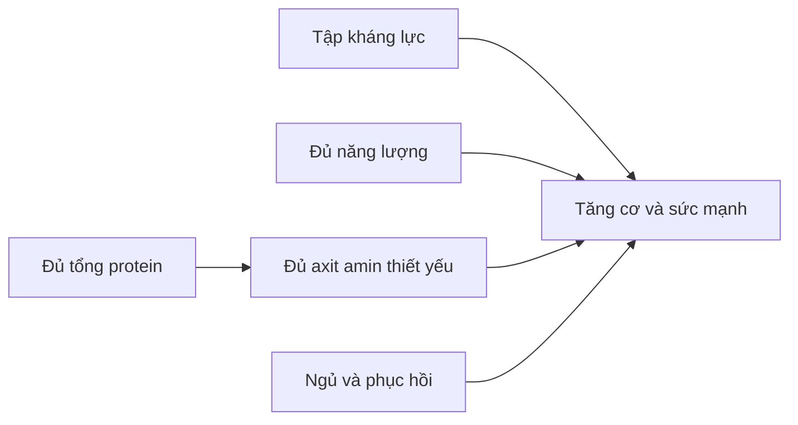
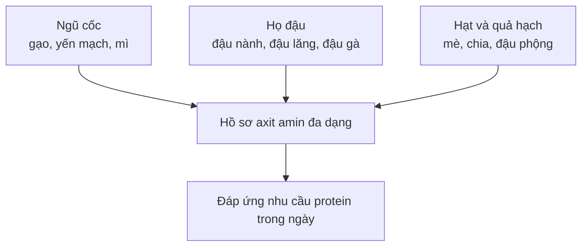
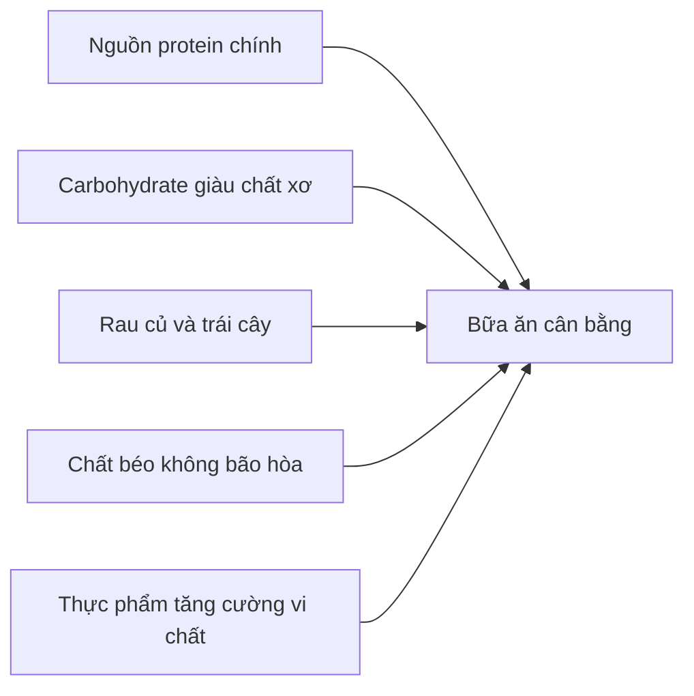

# 066 — Vegan Diet Explained

| Thuộc tính       | Nội dung                                    |
| ---------------- | ------------------------------------------- |
| **Module**       | Module 07 — Common Dieting Trends Explained |
| **Bài học**      | Vegan Diet Explained                        |
| **Thời lượng**   | 05:24                                       |
| **Chủ đề chính** | Giải thích chế độ ăn thuần chay             |


*Ảnh minh họa: một bữa ăn thuần chay gồm gạo đen, đậu lăng, rau xanh và đậu phụ.* ([Wikimedia Commons][1])

## Mục lục

1. [Mục tiêu bài học](#1-mục-tiêu-bài-học)
2. [Nội dung chính](#2-nội-dung-chính)
3. [Áp dụng thực tế](#3-áp-dụng-thực-tế)
4. [Lưu ý & lỗi thường gặp](#4-lưu-ý--lỗi-thường-gặp)
5. [Checklist thực hành](#5-checklist-thực-hành)
6. [Tóm tắt](#6-tóm-tắt)

---

## 1. Mục tiêu bài học

Sau bài học này, người học có thể:

* Phân biệt **ăn chay** và **ăn thuần chay**.
* Hiểu rằng người ăn thuần chay **vẫn có thể tăng cơ và tăng sức mạnh**.
* Nhận biết những hạn chế thường gặp của protein thực vật.
* Biết cách lựa chọn và phân bổ nguồn protein thuần chay.
* Nhận diện các vi chất cần quan tâm, đặc biệt là **vitamin B12, vitamin D, sắt, canxi, kẽm, i-ốt và omega-3**.
* Xây dựng một chế độ ăn thuần chay cân bằng thay vì chỉ đơn giản loại bỏ thực phẩm động vật.

> **Thông điệp trọng tâm:**
> Chế độ ăn thuần chay không tự động tốt hơn hoặc kém hơn chế độ ăn thông thường. Kết quả phụ thuộc chủ yếu vào **tổng năng lượng, lượng protein, chất lượng thực phẩm, vi chất và khả năng duy trì lâu dài**.

---

## 2. Nội dung chính

### 2.1. Chế độ ăn thuần chay là gì?

Người ăn chay thường không ăn thịt, gia cầm và thủy sản, nhưng một số hình thức ăn chay vẫn sử dụng trứng hoặc sữa.

Người ăn **thuần chay – vegan** loại bỏ toàn bộ thực phẩm có nguồn gốc động vật, bao gồm:

* Thịt và gia cầm.
* Cá, tôm, cua và các loại hải sản.
* Trứng.
* Sữa, phô mai, bơ và các sản phẩm từ sữa.
* Mật ong.
* Các nguyên liệu có nguồn gốc động vật như gelatin.

Theo định nghĩa rộng, veganism còn liên quan đến việc hạn chế sử dụng động vật trong quần áo, mỹ phẩm và các hoạt động khác. Trong bài học này, nội dung chỉ tập trung vào **dinh dưỡng, sức khỏe và thể hình**. ([The Vegan Society][2])

### 2.2. Ăn thuần chay có thể lành mạnh không?

Có. Quan điểm cập nhật năm 2025 của Academy of Nutrition and Dietetics cho rằng chế độ ăn chay và thuần chay được xây dựng phù hợp có thể đáp ứng nhu cầu dinh dưỡng của người trưởng thành và mang lại một số lợi ích lâu dài đối với sức khỏe chuyển hóa – tim mạch. Tuy nhiên, từ khóa quan trọng là **“được xây dựng phù hợp”**. ([Jand Online][3])

Một người có thể ăn thuần chay nhưng vẫn sử dụng chủ yếu:

* Nước ngọt.
* Bánh kẹo.
* Khoai tây chiên.
* Mì ăn liền.
* Thịt chay chế biến sẵn.
* Ngũ cốc tinh chế.
* Thực phẩm nhiều dầu, đường và muối.

Vì vậy:

> **Thuần chay không đồng nghĩa với lành mạnh.**
> Chất lượng tổng thể của chế độ ăn vẫn quan trọng hơn nhãn “vegan” trên bao bì.

---

### 2.3. Người ăn thuần chay có thể xây dựng cơ bắp không?

**Có thể.**

Cơ thể không trực tiếp cần “thịt” hay “sữa” để tạo cơ. Cơ thể cần:

1. Kích thích từ tập kháng lực.
2. Đủ năng lượng.
3. Đủ protein.
4. Đủ axit amin thiết yếu.
5. Ngủ và phục hồi phù hợp.

Các thử nghiệm đối chứng cho thấy chế độ ăn thuần chay giàu protein có thể hỗ trợ tốc độ tổng hợp protein cơ, tăng khối lượng cơ và thích nghi với tập kháng lực tương đương chế độ ăn hỗn hợp khi **tổng protein và năng lượng được kiểm soát tương đương**. ([PubMed][4])



Nguồn protein có ảnh hưởng, nhưng nó chỉ là **một phần** của toàn bộ hệ thống.

---

### 2.4. Tại sao tăng cơ bằng chế độ thuần chay có thể khó hơn?

#### Khó khăn 1: Mật độ protein thấp hơn

Nhiều thực phẩm động vật chứa lượng protein cao trong một khẩu phần tương đối nhỏ. Trong khi đó, một số nguồn thực vật như đậu nguyên hạt, ngũ cốc và các loại hạt đi kèm khá nhiều:

* Carbohydrate.
* Chất béo.
* Chất xơ.
* Thể tích thức ăn.

Vì thế, để đạt cùng lượng protein, người ăn thuần chay đôi khi phải ăn khẩu phần lớn hơn hoặc chủ động sử dụng các nguồn đậm đặc protein như:

* Đậu phụ.
* Tempeh.
* Seitan.
* Đạm đậu nành dạng hạt – TVP.
* Sữa đậu nành.
* Đậu edamame.
* Bột protein đậu Hà Lan hoặc đậu nành.

#### Khó khăn 2: Khả năng tiêu hóa và hấp thu

Một số protein thực vật có khả năng tiêu hóa thấp hơn protein động vật do cấu trúc thực phẩm và sự hiện diện của chất xơ hoặc các hợp chất như phytate. Hàm lượng leucine và một số axit amin thiết yếu trong từng nguồn cũng có thể thấp hơn. ([PubMed][5])

Những hạn chế này có thể được khắc phục bằng cách:

* Ăn đủ tổng lượng protein.
* Sử dụng nhiều nhóm thực phẩm khác nhau.
* Ưu tiên đậu nành, đậu Hà Lan, tempeh, tofu, seitan và các sản phẩm giàu protein.
* Chia protein tương đối đều trong ngày.
* Ngâm, nấu chín, lên men hoặc sử dụng protein đã được tinh chế khi phù hợp.
* Tăng khẩu phần protein thực vật thay vì chỉ dùng một lượng nhỏ.

Các tổng quan nghiên cứu cho thấy protein thực vật vẫn có thể kích thích tổng hợp protein cơ, đặc biệt khi tăng khẩu phần, phối hợp nhiều nhóm thực phẩm và tối ưu quá trình chế biến. ([PubMed][6])

---

### 2.5. Có phải protein thực vật đều là “protein không hoàn chỉnh”?

Đây là cách giải thích **quá đơn giản**.

Hầu hết thực phẩm thực vật chứa cả chín axit amin thiết yếu, nhưng tỷ lệ của một hoặc vài axit amin có thể tương đối thấp so với nhu cầu của cơ thể. Ví dụ:

| Nhóm thực phẩm  | Axit amin thường tương đối hạn chế |
| --------------- | ---------------------------------- |
| Ngũ cốc         | Lysine                             |
| Các loại đậu    | Methionine                         |
| Hạt và quả hạch | Có thể thấp hơn về lysine          |
| Rau củ          | Mật độ tổng protein thường thấp    |

Một số nguồn thực vật có hồ sơ axit amin khá cân bằng, chẳng hạn:

* Đậu nành.
* Quinoa.
* Kiều mạch.
* Hạt dền.
* Protein đậu Hà Lan phối hợp với protein gạo.

#### Protein bổ trợ

Việc kết hợp các nhóm thực phẩm giúp bù trừ axit amin:

* Cơm + đậu.
* Bánh mì nguyên cám + hummus.
* Mì + sốt đậu phộng.
* Yến mạch + sữa đậu nành.
* Đậu lăng + ngũ cốc.
* Đậu phụ + cơm.

Tuy nhiên, người khỏe mạnh **không bắt buộc phải kết hợp chính xác các nguồn này trong cùng một bữa**. Ăn đa dạng nguồn protein trong cả ngày thường có thể cung cấp đủ axit amin thiết yếu. ([Jand Online][3])



---

### 2.6. Những nguồn protein thuần chay nên được ưu tiên

#### Nhóm có mật độ protein cao

| Nhóm                     | Ví dụ                               | Cách sử dụng                        |
| ------------------------ | ----------------------------------- | ----------------------------------- |
| **Đậu nành**             | Tofu, tempeh, edamame, sữa đậu nành | Xào, áp chảo, nấu canh, làm sinh tố |
| **Đạm thực vật cô đặc**  | TVP, soy curls, protein đậu Hà Lan  | Sốt mì, nhân cuốn, cháo, sinh tố    |
| **Gluten lúa mì**        | Seitan                              | Xào, nướng, làm nhân bánh mì        |
| **Các loại đậu**         | Đậu lăng, đậu gà, đậu đen, đậu đỏ   | Súp, cà ri, salad, hummus           |
| **Ngũ cốc giàu protein** | Yến mạch, quinoa, kiều mạch         | Cháo, cơm trộn, salad               |
| **Hạt và quả hạch**      | Đậu phộng, hạt bí, hạt gai dầu      | Ăn kèm, làm sốt hoặc topping        |

> Nấm, rau xanh và sữa hạt loãng có thể đóng góp một phần protein nhưng thường **không nên được xem là nguồn protein chính**.


*Ảnh minh họa: bowl thuần chay với đậu phụ caramel hóa và rau củ.* ([Wikimedia Commons][7])

---

### 2.7. Người tập luyện cần bao nhiêu protein?

Đối với người tập thể thao hoặc tập kháng lực, mức khoảng **1,4–2,0 g protein/kg cân nặng/ngày** thường được sử dụng như một khoảng tham khảo. Người ăn thuần chay có thể ưu tiên phần giữa hoặc phần trên của khoảng này nếu chế độ ăn chủ yếu sử dụng thực phẩm toàn phần có mật độ protein thấp. ([PubMed][8])

#### Ví dụ

Một người nặng 70 kg tập kháng lực:

```text
70 kg × 1,6 g protein = 112 g protein/ngày
```

Có thể chia thành bốn lần ăn:

```text
Bữa sáng:     25–30 g
Bữa trưa:     25–30 g
Sau tập:      20–30 g
Bữa tối:      25–30 g
```

Đây chỉ là ví dụ cho người trưởng thành khỏe mạnh. Người có bệnh thận, bệnh gan, đang mang thai hoặc có tình trạng y tế đặc biệt cần trao đổi với bác sĩ hoặc chuyên gia dinh dưỡng trước khi thay đổi mạnh lượng protein.

---

### 2.8. Những vi chất cần đặc biệt quan tâm

#### Vitamin B12

Vitamin B12 tự nhiên chủ yếu có trong thực phẩm động vật. Vì vậy, người ăn thuần chay cần một **nguồn B12 đáng tin cậy** từ:

* Thực phẩm tăng cường B12.
* Viên bổ sung B12.

Không nên mặc định rằng tảo xoắn, thực phẩm lên men hoặc rau hữu cơ có thể cung cấp đủ B12 hoạt tính. ([ODS][9])

> **B12 không phải chất nên để “tính sau”. Đây là phần bắt buộc trong kế hoạch ăn thuần chay dài hạn.**

#### Sắt

Sắt trong thực vật là sắt không heme, thường được hấp thu kém hơn sắt heme từ động vật. NIH lưu ý rằng mức nhu cầu tham khảo đối với người ăn chay có thể cao hơn do khác biệt về khả năng hấp thu. ([ODS][10])

Nguồn sắt thực vật:

* Đậu lăng và các loại đậu.
* Tofu và tempeh.
* Hạt bí, hạt mè.
* Ngũ cốc tăng cường sắt.
* Rau lá xanh.

Ăn cùng thực phẩm giàu vitamin C như cam, ổi, ớt chuông hoặc cà chua có thể hỗ trợ hấp thu sắt.

#### Canxi

Nguồn canxi phù hợp gồm:

* Sữa thực vật tăng cường canxi.
* Tofu được làm đông bằng muối canxi.
* Cải thìa, cải xoăn và một số rau ít oxalate.
* Mè hoặc tahini.
* Thực phẩm tăng cường canxi.

Không phải mọi loại sữa hạt đều được tăng cường canxi, vì vậy cần đọc nhãn sản phẩm. ([ODS][11])

#### Vitamin D

Vitamin D tự nhiên có trong khá ít thực phẩm. Người ăn thuần chay có nguy cơ thiếu vitamin D cao hơn nếu ít tiếp xúc với ánh nắng và không sử dụng thực phẩm tăng cường hoặc sản phẩm bổ sung phù hợp. ([ODS][12])

#### Kẽm

Phytate trong ngũ cốc nguyên hạt và các loại đậu có thể làm giảm khả năng hấp thu kẽm. Các phương pháp như ngâm, nảy mầm, lên men và nấu chín có thể hỗ trợ cải thiện khả năng sử dụng khoáng chất. ([ODS][13])

Nguồn kẽm:

* Hạt bí.
* Hạt mè.
* Đậu gà.
* Yến mạch.
* Tofu và tempeh.
* Ngũ cốc tăng cường.

#### Omega-3

Hạt chia, hạt lanh, hạt óc chó và dầu cải cung cấp ALA. Cơ thể có thể chuyển một phần ALA thành EPA và DHA, nhưng lượng chuyển đổi thường nhỏ. Dầu vi tảo là nguồn EPA/DHA phù hợp với người ăn thuần chay khi cần bổ sung. ([ODS][14])

#### I-ốt

Người không ăn hải sản, trứng hoặc sữa có thể thiếu i-ốt nếu không sử dụng muối i-ốt. Hàm lượng i-ốt trong rong biển biến động rất lớn; ăn quá nhiều một số loại rong biển cũng có thể cung cấp lượng i-ốt quá cao. ([ODS][15])

---

## 3. Áp dụng thực tế

### 3.1. Công thức xây dựng một bữa ăn thuần chay cân bằng



| Thành phần        | Ví dụ                                        |
| ----------------- | -------------------------------------------- |
| **Protein chính** | Tofu, tempeh, seitan, TVP, đậu lăng          |
| **Carbohydrate**  | Cơm, khoai, yến mạch, mì nguyên cám          |
| **Rau củ**        | Cải thìa, súp lơ, cà rốt, cà chua            |
| **Chất béo**      | Hạt, bơ đậu phộng, bơ quả, dầu ô liu         |
| **Vi chất**       | Sữa đậu nành tăng cường canxi/B12, muối i-ốt |

### 3.2. Thực đơn mẫu một ngày

#### Bữa sáng

* Yến mạch.
* Sữa đậu nành tăng cường canxi và B12.
* Bột protein đậu Hà Lan hoặc đậu nành.
* Chuối.
* Hạt chia hoặc hạt lanh xay.

#### Bữa trưa

* Cơm.
* Tofu hoặc tempeh áp chảo.
* Rau cải xào.
* Salad cà chua và ớt chuông.
* Trái cây giàu vitamin C.

#### Bữa phụ hoặc sau tập

* Sinh tố sữa đậu nành.
* Bột protein thực vật.
* Chuối hoặc yến mạch.
* Một lượng nhỏ bơ đậu phộng.

#### Bữa tối

* Mì nguyên cám.
* Sốt cà chua với TVP hoặc đậu lăng.
* Nấm và rau củ.
* Rắc men dinh dưỡng có tăng cường B12 nếu sản phẩm thực sự có B12 trên nhãn.

---

### 3.3. Điều chỉnh theo mục tiêu

#### Khi muốn tăng cơ hoặc tăng cân

* Đưa một nguồn protein đậm đặc vào mỗi bữa.
* Không để lượng chất xơ quá lớn khiến no sớm.
* Thêm sữa đậu nành, tofu, tempeh, seitan hoặc protein powder.
* Tăng năng lượng bằng bơ đậu phộng, hạt, dầu ô liu và quả bơ.
* Theo dõi cân nặng và hiệu suất tập luyện.

#### Khi muốn giảm mỡ

* Vẫn duy trì lượng protein đủ cao.
* Ưu tiên thực phẩm ít chế biến.
* Kiểm soát khẩu phần dầu, bơ hạt và các loại hạt.
* Không mặc định thịt chay, phô mai chay hoặc bánh vegan là ít calorie.
* Duy trì tập kháng lực để hạn chế mất cơ.

---

## 4. Lưu ý & lỗi thường gặp

### Lỗi 1: Chỉ loại bỏ thịt mà không thay thế protein

Ví dụ:

```text
Trước: Cơm + thịt + rau
Sau:   Cơm + rau
```

Bữa ăn sau có thể thiếu protein và năng lượng.

Cách sửa:

```text
Cơm + tofu/tempeh/đậu lăng + rau
```

### Lỗi 2: Cho rằng rau xanh là nguồn protein chính

Rau xanh có chứa protein nhưng mật độ thường thấp. Rau nên được xem là nguồn chất xơ, vitamin và khoáng chất; protein chính cần đến từ đậu nành, các loại đậu, seitan hoặc sản phẩm protein thực vật.

### Lỗi 3: Ăn chủ yếu các loại hạt để lấy protein

Hạt và bơ hạt giàu dinh dưỡng nhưng cũng giàu chất béo và calorie. Chúng phù hợp làm nguồn chất béo và protein bổ sung hơn là nguồn protein duy nhất.

### Lỗi 4: Cố kết hợp protein trong từng bữa một cách cứng nhắc

Không cần lúc nào cũng phải ghép “cơm + đậu” theo một công thức chính xác. Điều quan trọng hơn là ăn đủ protein và đa dạng thực phẩm trong cả ngày.

### Lỗi 5: Không bổ sung vitamin B12

Đây là một trong những sai lầm nghiêm trọng nhất. B12 cần được cung cấp từ thực phẩm tăng cường hoặc sản phẩm bổ sung đáng tin cậy. ([ODS][9])

### Lỗi 6: Lạm dụng thực phẩm “vegan” chế biến sẵn

Thịt chay, xúc xích chay, phô mai chay và bánh vegan có thể chứa nhiều:

* Muối.
* Dầu.
* Đường.
* Chất béo bão hòa.
* Calorie.

Chúng có thể được sử dụng để tăng tính tiện lợi nhưng không nên thay thế hoàn toàn thực phẩm ít chế biến.

### Lỗi 7: Tăng chất xơ quá nhanh

Chuyển đột ngột từ chế độ ít rau sang lượng lớn đậu, ngũ cốc nguyên hạt và hạt có thể gây:

* Đầy bụng.
* Chướng hơi.
* Khó tiêu.
* Đi ngoài nhiều hơn.

Nên tăng lượng chất xơ từ từ, uống đủ nước, ngâm đậu và bắt đầu bằng khẩu phần vừa phải.

### Lỗi 8: Tự bổ sung nhiều vi chất mà không kiểm soát

Không phải càng nhiều vitamin và khoáng chất càng tốt. Sắt, vitamin D, i-ốt và selenium đều có thể gây vấn đề khi sử dụng quá mức. Việc bổ sung liều cao nên dựa trên chế độ ăn, xét nghiệm và hướng dẫn chuyên môn.

### Nhóm cần được theo dõi kỹ hơn

Nên có hướng dẫn từ bác sĩ hoặc chuyên gia dinh dưỡng khi áp dụng chế độ thuần chay cho:

* Phụ nữ mang thai hoặc cho con bú.
* Trẻ sơ sinh, trẻ em và thanh thiếu niên.
* Người cao tuổi.
* Người có bệnh thận, bệnh đường tiêu hóa hoặc thiếu máu.
* Vận động viên có khối lượng tập luyện rất cao.
* Người có tiền sử rối loạn ăn uống.

---

## 5. Checklist thực hành

### Protein

* [ ] Tôi có một nguồn protein chính trong mỗi bữa.
* [ ] Tôi ăn đa dạng đậu nành, các loại đậu, ngũ cốc và hạt.
* [ ] Tôi không chỉ dựa vào rau xanh hoặc sữa hạt loãng để lấy protein.
* [ ] Nếu tập kháng lực, tôi đã ước tính nhu cầu protein theo cân nặng.
* [ ] Tôi phân bổ protein qua nhiều bữa thay vì dồn vào một bữa.

### Vi chất

* [ ] Tôi có nguồn vitamin B12 đáng tin cậy.
* [ ] Tôi kiểm tra nhãn sữa thực vật để tìm canxi, B12 và vitamin D.
* [ ] Tôi thường xuyên ăn thực phẩm giàu sắt cùng vitamin C.
* [ ] Tôi sử dụng muối i-ốt với lượng hợp lý.
* [ ] Tôi có nguồn ALA như hạt chia hoặc hạt lanh xay.
* [ ] Tôi cân nhắc EPA/DHA từ vi tảo khi phù hợp.
* [ ] Tôi không tự dùng sắt, vitamin D hoặc i-ốt liều cao tùy tiện.

### Chất lượng chế độ ăn

* [ ] Phần lớn thực phẩm của tôi là thực phẩm ít chế biến.
* [ ] Tôi vẫn ăn đủ rau, trái cây và ngũ cốc nguyên hạt.
* [ ] Tôi không phụ thuộc quá nhiều vào đồ ăn vegan chế biến sẵn.
* [ ] Tôi uống đủ nước khi tăng lượng chất xơ.
* [ ] Tôi theo dõi năng lượng, sức khỏe, hiệu suất tập và khả năng phục hồi.

---

## 6. Tóm tắt

Chế độ ăn thuần chay loại bỏ tất cả thực phẩm có nguồn gốc động vật, bao gồm thịt, cá, trứng, sữa và mật ong.

Người ăn thuần chay **hoàn toàn có thể tăng cơ và tăng sức mạnh**. Khi tổng năng lượng và protein được đáp ứng, các nghiên cứu cho thấy chế độ thuần chay giàu protein có thể tạo ra kết quả tương đương chế độ ăn hỗn hợp. ([PubMed][4])

Tuy nhiên, chế độ này đòi hỏi sự chủ động hơn trong việc:

* Lựa chọn nguồn protein có mật độ cao.
* Ăn đa dạng thực phẩm thực vật.
* Đáp ứng đủ axit amin thiết yếu.
* Theo dõi vitamin B12, vitamin D, sắt, canxi, kẽm, i-ốt và omega-3.
* Sử dụng thực phẩm tăng cường hoặc sản phẩm bổ sung khi cần thiết.

> **Kết luận:**
> Ăn thuần chay không phải con đường duy nhất để khỏe mạnh hoặc tăng cơ, nhưng đây có thể là một lựa chọn dinh dưỡng hiệu quả khi được lập kế hoạch cẩn thận. Yếu tố quyết định không phải là thực đơn có thịt hay không, mà là liệu chế độ ăn có cung cấp **đủ năng lượng, protein, axit amin và vi chất** hay không.

[1]: https://commons.wikimedia.org/wiki/File%3ABalanced_Vegan_Dinner.png?utm_source=chatgpt.com "File:Balanced Vegan Dinner.png - Wikimedia Commons"
[2]: https://www.vegansociety.com/go-vegan/definition-veganism?utm_source=chatgpt.com "Definition of veganism"
[3]: https://www.jandonline.org/article/S2212-2672%2825%2900042-5/fulltext?utm_source=chatgpt.com "Vegetarian Dietary Patterns for Adults: A Position Paper ..."
[4]: https://pubmed.ncbi.nlm.nih.gov/36822394/?utm_source=chatgpt.com "Vegan and Omnivorous High Protein Diets Support ... - PubMed"
[5]: https://pubmed.ncbi.nlm.nih.gov/31394788/?utm_source=chatgpt.com "versus Animal-Based Protein Sources in Supporting Muscle Mass ..."
[6]: https://pubmed.ncbi.nlm.nih.gov/35508011/?utm_source=chatgpt.com "Plant-based food patterns to stimulate muscle protein ..."
[7]: https://commons.wikimedia.org/wiki/File%3ABali_vegan_bowl_with_tofu.jpg?utm_source=chatgpt.com "File:Bali vegan bowl with tofu.jpg - Wikimedia Commons"
[8]: https://pubmed.ncbi.nlm.nih.gov/28642676/?utm_source=chatgpt.com "International Society of Sports Nutrition Position Stand: protein and exercise - PubMed"
[9]: https://ods.od.nih.gov/factsheets/VitaminB12-HealthProfessional/?utm_source=chatgpt.com "Vitamin B12 - Health Professional Fact Sheet"
[10]: https://ods.od.nih.gov/factsheets/Iron-HealthProfessional/?utm_source=chatgpt.com "Iron - Health Professional Fact Sheet"
[11]: https://ods.od.nih.gov/factsheets/Calcium-HealthProfessional/?utm_source=chatgpt.com "Calcium - Health Professional Fact Sheet"
[12]: https://ods.od.nih.gov/factsheets/VitaminD-HealthProfessional/?utm_source=chatgpt.com "Vitamin D - Health Professional Fact Sheet"
[13]: https://ods.od.nih.gov/factsheets/Zinc-HealthProfessional/?utm_source=chatgpt.com "Zinc - Health Professional Fact Sheet"
[14]: https://ods.od.nih.gov/factsheets/Omega3FattyAcids-Consumer/?utm_source=chatgpt.com "Omega-3 Fatty Acids - Consumer"
[15]: https://ods.od.nih.gov/HealthInformation/ODS_Frequently_Asked_Questions.aspx?ct=39988&utm_source=chatgpt.com "Frequently Asked Questions (FAQ)"

---

# Bài luyện tập

## Mục tiêu


## Đề bài


## Yêu cầu hoàn thành

- [ ] 
- [ ] 
- [ ] 

## Kết quả / lời giải


## Ghi chú
