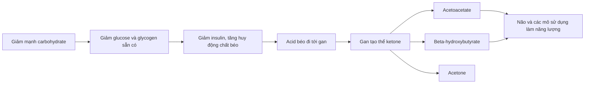

# 067 — Ketogenic Diet Explained

| Thuộc tính           | Nội dung                                              |
| -------------------- | ----------------------------------------------------- |
| **Module**           | Module 07 — Common Dieting Trends Explained           |
| **Bài học**          | Ketogenic Diet Explained                              |
| **Thời lượng**       | 06:32                                                 |
| **Chủ đề chính**     | Giải thích chế độ ăn Ketogenic                        |
| **Tên gọi phổ biến** | Keto, chế độ ăn ketogenic                             |
| **Đặc điểm**         | Rất ít carbohydrate, nhiều chất béo, protein vừa phải |

> **Lưu ý:** Nội dung này nhằm mục đích giáo dục. Người mắc tiểu đường, bệnh gan, bệnh thận, bệnh tụy, rối loạn lipid máu hoặc đang sử dụng thuốc cần trao đổi với bác sĩ hoặc chuyên gia dinh dưỡng trước khi áp dụng.

## Mục lục

1. [Mục tiêu bài học](#1-mục-tiêu-bài-học)
2. [Nội dung chính](#2-nội-dung-chính)
3. [Áp dụng thực tế](#3-áp-dụng-thực-tế)
4. [Lưu ý & lỗi thường gặp](#4-lưu-ý--lỗi-thường-gặp)
5. [Checklist thực hành](#5-checklist-thực-hành)
6. [Tóm tắt](#6-tóm-tắt)

---

## 1. Mục tiêu bài học

Sau bài học này, người học có thể:

* Giải thích chế độ ăn ketogenic và trạng thái **ketosis dinh dưỡng**.
* Phân biệt keto với một chế độ ăn ít carbohydrate thông thường.
* Hiểu cơ chế tạo thể ketone tại gan.
* Đánh giá lợi ích, hạn chế và nguy cơ của keto.
* Xác định những trường hợp có thể cân nhắc keto và những trường hợp cần tránh.
* Thiết kế một bữa ăn keto ưu tiên thực phẩm ít chế biến và chất béo không bão hòa.
* Nhận biết các tuyên bố phóng đại như “keto phù hợp với tất cả mọi người” hoặc “vào ketosis là tự động giảm mỡ”.

---

## 2. Nội dung chính

### 2.1. Chế độ ăn ketogenic là gì?

Ketogenic là chế độ ăn:

* **Rất ít carbohydrate**
* **Nhiều chất béo**
* **Protein ở mức vừa phải**

Một chế độ keto phổ biến thường cung cấp khoảng:

| Chất dinh dưỡng  | Tỷ lệ năng lượng tham khảo |
| ---------------- | -------------------------: |
| **Chất béo**     |                     70–80% |
| **Protein**      |                     10–20% |
| **Carbohydrate** |                      5–10% |

Lượng carbohydrate thường được hạ xuống dưới **50 g/ngày**, đôi khi khoảng **20–30 g/ngày**. Tuy nhiên, ngưỡng tạo ketosis khác nhau giữa từng người và còn phụ thuộc vào mức vận động, tổng năng lượng, lượng protein cùng đặc điểm chuyển hóa cá nhân.

> Keto không đơn giản là “ăn nhiều thịt”. Protein quá cao có thể khiến chế độ ăn không còn mang tính ketogenic rõ rệt. Phần năng lượng lớn nhất của keto đến từ chất béo.

### 2.2. Ketosis diễn ra như thế nào?

Trong chế độ ăn thông thường, carbohydrate được tiêu hóa thành glucose và đóng vai trò quan trọng trong việc cung cấp năng lượng. Khi lượng carbohydrate giảm mạnh, glycogen dự trữ dần giảm xuống, insulin giảm và cơ thể tăng sử dụng acid béo.

Gan chuyển một phần acid béo thành ba thể ketone chính:

1. **Acetoacetate**
2. **Beta-hydroxybutyrate — BHB**
3. **Acetone**

Các thể ketone được đưa vào máu để nhiều mô, trong đó có não, sử dụng làm nguồn năng lượng thay thế một phần glucose.




*Nguồn ảnh khoa học: [Wikimedia Commons — Ketogenesis.svg](https://commons.wikimedia.org/wiki/File:Ketogenesis.svg), giấy phép CC0/Public Domain.*

### 2.3. Ketosis dinh dưỡng không phải nhiễm toan ceton

| Ketosis dinh dưỡng                                       | Nhiễm toan ceton do tiểu đường                  |
| -------------------------------------------------------- | ----------------------------------------------- |
| Mức ketone tăng có kiểm soát                             | Ketone và acid trong máu tăng nguy hiểm         |
| Vẫn có đủ insulin để hạn chế sản xuất ketone quá mức     | Thường liên quan đến thiếu insulin nghiêm trọng |
| Có thể xuất hiện khi nhịn ăn hoặc ăn rất ít carbohydrate | Là tình trạng cấp cứu y khoa                    |
| Thường không làm pH máu giảm nguy hiểm ở người khỏe mạnh | Có thể đe dọa tính mạng                         |

Nhiễm toan ceton thường gặp nhất ở người mắc tiểu đường type 1, nhưng cũng có thể liên quan đến một số thuốc hoặc hoàn cảnh bệnh lý khác. Không nên xem ketosis và nhiễm toan ceton là cùng một trạng thái.

---

### 2.4. Lợi ích tiềm năng của keto

#### A. Loại bỏ nhiều thực phẩm siêu chế biến

Khi hạn chế carbohydrate rất nghiêm ngặt, người ăn keto thường phải giảm:

* Nước ngọt và đồ uống có đường
* Bánh ngọt, bánh quy
* Kẹo và chocolate nhiều đường
* Ngũ cốc tinh chế
* Đồ ăn nhanh giàu bột và đường

Việc giảm các thực phẩm này có thể làm tổng năng lượng nạp vào thấp hơn. Tuy nhiên, lợi ích đến từ việc cải thiện chất lượng thực phẩm và tạo thâm hụt năng lượng, không phải vì carbohydrate tự thân luôn có hại.

Carbohydrate từ rau, trái cây, đậu và ngũ cốc nguyên hạt mang lại chất xơ, vitamin, khoáng chất cùng các hợp chất thực vật có lợi; chúng không nên bị đánh đồng với đường bổ sung và tinh bột tinh chế.

#### B. Có thể hỗ trợ giảm cân trong ngắn hạn

Keto có thể giúp giảm cân thông qua một số yếu tố:

* Giảm lượng thực phẩm giàu đường và tinh bột tinh chế.
* Giảm cảm giác đói ở một số người.
* Làm cơ thể mất một phần nước khi glycogen giảm.
* Tạo thâm hụt calorie nếu tổng lượng ăn giảm.

Các nghiên cứu cho thấy keto hoặc chế độ rất ít carbohydrate có thể tạo mức giảm cân tốt trong vài tháng đầu. Tuy nhiên, lợi thế so với các chế độ ăn khác thường giảm dần khi theo dõi dài hơn, đặc biệt khi tổng calorie và mức độ tuân thủ tương đương.

> **Ketosis không đồng nghĩa với giảm mỡ.** Cơ thể có thể đốt nhiều chất béo hơn nhưng đó có thể là chất béo vừa được ăn vào. Muốn giảm mỡ cơ thể, tổng năng lượng nạp vào vẫn cần thấp hơn mức tiêu hao trong một khoảng thời gian đủ dài.

#### C. Có thể cải thiện đường huyết ở một số người

Giảm carbohydrate làm giảm lượng glucose đi vào máu sau bữa ăn. Vì vậy, chế độ ít carbohydrate có thể hỗ trợ kiểm soát đường huyết ở một số người mắc tiểu đường type 2 hoặc kháng insulin.

Tuy vậy:

* Không có một tỷ lệ carbohydrate–protein–chất béo tối ưu cho tất cả mọi người.
* Mediterranean, DASH, ăn chay và các chế độ hạn chế carbohydrate đều có thể là lựa chọn dựa trên nhu cầu cá nhân.
* Người sử dụng insulin hoặc thuốc hạ đường huyết có thể phải điều chỉnh thuốc để tránh hạ đường huyết.

#### D. Có thể giúp ổn định cảm giác đói

Chất béo và protein thường được tiêu hóa chậm hơn carbohydrate tinh chế. Một số người vì thế cảm thấy:

* No lâu hơn
* Ít thèm đồ ngọt
* Ít phải ăn vặt
* Dễ duy trì thâm hụt calorie hơn

Tác dụng này không xuất hiện ở tất cả mọi người. Một người vẫn có thể ăn dư calorie trên keto nếu thường xuyên dùng nhiều phô mai, bơ, kem, các loại hạt hoặc dầu.

#### E. Ứng dụng điều trị động kinh

Keto có lịch sử lâu đời trong điều trị một số trường hợp động kinh kháng thuốc, đặc biệt ở trẻ em. Đây là chế độ keto điều trị được tính toán và theo dõi chặt chẽ bởi đội ngũ thần kinh, bác sĩ cùng chuyên gia dinh dưỡng; không giống với việc tự ăn keto để giảm cân.

---

### 2.5. Hạn chế và nguy cơ

#### A. Dễ ăn quá nhiều calorie

Chất béo cung cấp khoảng **9 kcal/g**, trong khi carbohydrate và protein cung cấp khoảng **4 kcal/g**.

| Thực phẩm              | Đặc điểm dễ gây dư năng lượng               |
| ---------------------- | ------------------------------------------- |
| Dầu olive, dầu dừa     | Một lượng nhỏ đã chứa nhiều calorie         |
| Các loại hạt           | Dễ ăn liên tục mà không kiểm soát khẩu phần |
| Phô mai                | Giàu chất béo và thường dễ ăn quá mức       |
| Bơ, kem béo            | Mật độ năng lượng rất cao                   |
| “Keto bomb”, bánh keto | Ít đường nhưng không nhất thiết ít calorie  |

Do đó, “đúng tỷ lệ keto” không đảm bảo giảm cân nếu tổng năng lượng vẫn vượt nhu cầu.

#### B. Hiệu suất tập cường độ cao có thể giảm

Carbohydrate hỗ trợ tạo năng lượng nhanh trong:

* Nâng tạ nặng
* Chạy nước rút
* HIIT
* Các môn thi đấu có nhiều pha tăng tốc
* Buổi tập dài với cường độ cao

Đánh giá của International Society of Sports Nutrition năm 2024 cho thấy keto nhìn chung tạo tác động **trung tính hoặc bất lợi** đối với thành tích thể thao khi so với chế độ nhiều carbohydrate hơn, dù khả năng oxy hóa chất béo tăng đáng kể. Ảnh hưởng phụ thuộc môn thể thao, thời gian thích nghi, tổng calorie và protein.

Keto không khiến việc tăng cơ trở thành bất khả thi, nhưng vận động viên cần kiểm soát kỹ:

* Tổng calorie
* Lượng protein
* Chất lượng buổi tập
* Glycogen
* Điện giải
* Khả năng hồi phục

#### C. Có thể làm LDL cholesterol tăng

Keto thường làm triglyceride giảm và HDL tăng ở một số người, nhưng LDL cholesterol cũng có thể tăng, đôi khi tăng mạnh ở người gầy, hoạt động nhiều hoặc có yếu tố di truyền.

Một phân tích tổng hợp 53 thử nghiệm ngẫu nhiên công bố năm 2026 ghi nhận keto nhìn chung làm triglyceride giảm nhưng đồng thời làm HDL, LDL và cholesterol toàn phần tăng. Điều này cho thấy phản ứng lipid khá phức tạp và cần được theo dõi thay vì giả định rằng “ăn nhiều mỡ luôn an toàn”.

Nên ưu tiên:

* Dầu olive
* Quả bơ
* Hạt và quả hạch
* Cá béo
* Các loại hạt giống

Hạn chế việc xây dựng chế độ keto chủ yếu từ:

* Bơ động vật
* Mỡ lợn
* Thịt chế biến
* Xúc xích, thịt xông khói
* Thịt đỏ nhiều mỡ
* Dầu dừa với số lượng lớn

Harvard khuyến nghị ưu tiên chất béo không bão hòa thay cho chất béo bão hòa khi theo keto.

#### D. Thiếu chất xơ và vi chất

Nếu chỉ tập trung vào thịt, trứng, bơ và phô mai, chế độ ăn có thể thiếu:

* Chất xơ
* Folate
* Vitamin C
* Kali
* Magie
* Một số hợp chất thực vật

Hậu quả có thể gồm táo bón, chế độ ăn đơn điệu và khó duy trì. Người ăn keto vẫn cần nhiều rau ít tinh bột và lựa chọn thực phẩm đa dạng.

#### E. Tác dụng phụ trong giai đoạn đầu

Trong vài ngày hoặc vài tuần đầu, một số người gặp hiện tượng thường được gọi là **“keto flu”**:

* Mệt mỏi
* Đau đầu
* Chóng mặt
* Chuột rút
* Táo bón
* Buồn nôn
* Hơi thở có mùi acetone
* Hiệu suất tập luyện giảm

Các biểu hiện này có thể liên quan đến thay đổi nước, natri, glycogen, lượng chất xơ và quá trình thích nghi chuyển hóa. Các chương trình keto điều trị cũng ghi nhận nguy cơ thiếu vi chất, rối loạn tiêu hóa, sỏi thận và biến đổi lipid, vì vậy cần được giám sát.

#### F. Khó duy trì trong đời sống thực tế

Keto hạn chế nhiều nhóm thực phẩm quen thuộc:

* Cơm, bún, phở, mì
* Bánh mì
* Khoai
* Phần lớn trái cây
* Đậu và ngũ cốc
* Nhiều món ăn xã hội

Vì vậy, vấn đề lớn nhất thường không phải “keto có hiệu quả không”, mà là người thực hiện có thể duy trì nó đủ lâu, ăn đủ chất và không hình thành mối quan hệ căng thẳng với thực phẩm hay không.

---

### 2.6. Keto phù hợp với ai?

Keto có thể được cân nhắc trong một số trường hợp:

| Có thể cân nhắc                                  | Điều kiện                                                |
| ------------------------------------------------ | -------------------------------------------------------- |
| Người thừa cân hoặc béo phì                      | Thích thực phẩm ít carbohydrate và có thể duy trì chế độ |
| Người mắc tiểu đường type 2                      | Có bác sĩ theo dõi đường huyết và điều chỉnh thuốc       |
| Người thường xuyên thèm đồ ngọt                  | Keto giúp họ kiểm soát thực phẩm kích thích ăn quá mức   |
| Người không phụ thuộc nhiều vào tập cường độ cao | Chấp nhận giai đoạn thích nghi                           |
| Người bị động kinh kháng thuốc                   | Chỉ thực hiện theo chương trình điều trị chuyên môn      |

Keto có thể không phải lựa chọn tối ưu nếu:

* Bạn tập tạ, chạy nước rút hoặc thi đấu cường độ cao thường xuyên.
* Bạn kiểm soát tốt lượng ăn với một chế độ cân bằng hơn.
* Bạn thích trái cây, đậu và ngũ cốc nguyên hạt.
* Việc hạn chế thực phẩm nghiêm ngặt làm tăng nguy cơ ăn uống mất kiểm soát.
* LDL cholesterol của bạn tăng mạnh khi ăn nhiều chất béo.

> Không nên kết luận rằng một người “không xử lý được carbohydrate” chỉ vì họ buồn ngủ sau một bữa ăn lớn. Tổng lượng thức ăn, chất lượng carbohydrate, giấc ngủ, thuốc, bệnh lý và thời điểm ăn đều có thể ảnh hưởng tới cảm giác sau bữa ăn.

---

## 3. Áp dụng thực tế

### 3.1. Xây dựng “keto lành mạnh”


*Nguồn ảnh: [Wikimedia Commons — Low carb breakfast](https://commons.wikimedia.org/wiki/File:Low_carb_breakfast.jpg), tác giả Ted Eytan, giấy phép CC BY-SA.*

Một bữa keto nên được xây dựng theo thứ tự:

```text
Rau ít tinh bột
      ↓
Nguồn protein vừa đủ
      ↓
Chất béo không bão hòa
      ↓
Gia vị, nước và điện giải phù hợp
```

| Nhóm         | Nên ưu tiên                                             | Cần kiểm soát                       |
| ------------ | ------------------------------------------------------- | ----------------------------------- |
| **Rau**      | Rau lá xanh, súp lơ, bông cải, nấm, dưa chuột, bí ngòi  | Rau củ nhiều tinh bột               |
| **Protein**  | Cá, hải sản, trứng, thịt gia cầm, đậu phụ               | Thịt chế biến, protein quá cao      |
| **Chất béo** | Dầu olive, bơ quả, hạt, cá béo                          | Bơ động vật, mỡ, dầu dừa quá nhiều  |
| **Sữa**      | Sữa chua Hy Lạp không đường, một lượng phô mai vừa phải | Kem béo, phô mai ăn không kiểm soát |
| **Đồ uống**  | Nước lọc, trà, cà phê không đường                       | Nước ngọt, trà sữa, nước ép         |
| **Gia vị**   | Thảo mộc, tiêu, chanh với lượng phù hợp                 | Sốt chứa đường ẩn                   |

### 3.2. Ví dụ thực đơn một ngày

> Đây chỉ là ví dụ cấu trúc, không phải khẩu phần cá nhân hóa.

#### Bữa sáng

* Trứng ốp hoặc trứng cuộn với nấm và rau chân vịt
* Nửa quả bơ
* Cà phê hoặc trà không đường

#### Bữa trưa

* Cá hồi hoặc ức gà
* Salad rau lá, dưa chuột, cà chua với khẩu phần phù hợp
* Dầu olive và hạt bí

#### Bữa phụ — khi thực sự đói

* Sữa chua Hy Lạp không đường
  hoặc
* Một khẩu phần nhỏ hạt hạnh nhân

#### Bữa tối

* Cá, thịt nạc hoặc đậu phụ
* Bông cải xanh và súp lơ
* Dầu olive hoặc sốt từ bơ quả

### 3.3. Quy trình thử nghiệm an toàn

#### Bước 1 — Xác định mục tiêu

Mục tiêu cần cụ thể:

* Giảm cân
* Kiểm soát đường huyết
* Giảm thèm đồ ngọt
* Điều trị bệnh theo chỉ định
* Thử nghiệm khả năng đáp ứng cá nhân

Không nên bắt đầu chỉ vì người nổi tiếng hoặc mạng xã hội tuyên bố keto phù hợp với tất cả mọi người.

#### Bước 2 — Kiểm tra tình trạng sức khỏe

Nên cân nhắc đánh giá:

* Đường huyết hoặc HbA1c
* Huyết áp
* LDL, HDL và triglyceride
* Chức năng gan, thận nếu có nguy cơ
* Thuốc đang sử dụng
* Tiền sử rối loạn ăn uống

#### Bước 3 — Cải thiện chất lượng thực phẩm trước

Trước khi giảm carbohydrate xuống mức cực thấp, có thể thử:

1. Loại bỏ nước ngọt và đường bổ sung.
2. Giảm bánh kẹo và tinh bột tinh chế.
3. Tăng rau, protein và thực phẩm ít chế biến.
4. Theo dõi cảm giác đói, năng lượng và cân nặng.

Nhiều người đạt được phần lớn lợi ích chỉ bằng chế độ **low-carb vừa phải**, không nhất thiết phải vào ketosis.

#### Bước 4 — Theo dõi phản ứng

Theo dõi trong ít nhất vài tuần:

| Chỉ số           | Câu hỏi cần đặt ra                                               |
| ---------------- | ---------------------------------------------------------------- |
| **Cảm giác đói** | Tôi no lâu hơn hay luôn muốn ăn đồ nhiều mỡ?                     |
| **Năng lượng**   | Năng lượng ổn định hay mệt mỏi kéo dài?                          |
| **Tập luyện**    | Sức mạnh, tốc độ và khả năng hồi phục có giảm không?             |
| **Tiêu hóa**     | Có táo bón, buồn nôn hoặc đau bụng không?                        |
| **Tuân thủ**     | Tôi có thể duy trì khi đi làm, đi học và ăn cùng gia đình không? |
| **Xét nghiệm**   | LDL, đường huyết và triglyceride thay đổi thế nào?               |

#### Bước 5 — Đánh giá lại

Dừng hoặc điều chỉnh chế độ nếu:

* Hiệu suất và sức khỏe suy giảm kéo dài.
* LDL tăng đáng kể.
* Xuất hiện hành vi ăn uống mất kiểm soát.
* Chế độ ăn không thể duy trì.
* Bạn không đạt được lợi ích rõ ràng so với một chế độ ít hạn chế hơn.

---

## 4. Lưu ý & lỗi thường gặp

### Lỗi 1 — Nghĩ rằng keto tự động tạo thâm hụt calorie

Keto chỉ hỗ trợ giảm cân khi nó giúp bạn ăn ít năng lượng hơn hoặc kiểm soát khẩu phần tốt hơn.

**Cách sửa:** Theo dõi khẩu phần của dầu, bơ, hạt, phô mai và đồ ăn vặt keto.

### Lỗi 2 — Biến keto thành chế độ “thịt xông khói và bơ”

Điều này làm tăng chất béo bão hòa, natri và thịt chế biến nhưng lại thiếu rau cùng chất xơ.

**Cách sửa:** Lấy dầu olive, quả bơ, hạt và cá làm nguồn chất béo chính.

### Lỗi 3 — Ăn quá ít rau

Rau ít tinh bột vẫn là thành phần quan trọng của keto.

**Cách sửa:** Mỗi bữa có ít nhất một hoặc hai loại rau phù hợp với mục tiêu carbohydrate.

### Lỗi 4 — Ăn protein quá ít hoặc quá nhiều

Protein quá ít có thể bất lợi cho khối cơ. Protein quá cao khiến chế độ ăn khác với keto truyền thống và có thể làm việc duy trì ketosis khó hơn.

**Cách sửa:** Cá nhân hóa protein theo cân nặng, tuổi, mức vận động và mục tiêu cơ thể.

### Lỗi 5 — Đánh giá giảm cân từ tuần đầu

Cân nặng giảm nhanh ban đầu phần lớn có thể đến từ glycogen và nước.

**Cách sửa:** Đánh giá xu hướng trong nhiều tuần, kết hợp vòng eo, sức mạnh và khả năng duy trì.

### Lỗi 6 — Bỏ qua điện giải và chất xơ

Việc giảm glycogen kéo theo thay đổi nước và natri, trong khi giảm ngũ cốc, đậu và trái cây có thể làm lượng chất xơ thấp.

**Cách sửa:** Ăn đủ rau, uống nước hợp lý và trao đổi với chuyên gia trước khi tự bổ sung điện giải.

### Lỗi 7 — Tự thay đổi thuốc tiểu đường

Giảm carbohydrate mạnh có thể khiến liều thuốc hiện tại trở nên quá cao và gây hạ đường huyết.

Đặc biệt, hướng dẫn về thuốc ức chế SGLT2 khuyến cáo người sử dụng tránh chế độ ketogenic do nguy cơ nhiễm toan ceton, kể cả khi đường huyết không tăng quá cao.

### Lỗi 8 — Nhầm ketone cao với thành công

Mức ketone cao hơn không đồng nghĩa giảm mỡ nhanh hơn hoặc khỏe mạnh hơn.

**Cách sửa:** Ưu tiên kết quả thực tế như sức khỏe, đường huyết, thành phần cơ thể, hiệu suất và khả năng duy trì.

---

### Những người không nên tự áp dụng keto

Cần hỏi bác sĩ trước khi thực hiện nếu thuộc một trong các nhóm:

* Tiểu đường type 1.
* Đang sử dụng insulin, sulfonylurea hoặc thuốc SGLT2.
* Mang thai hoặc cho con bú.
* Tiền sử rối loạn ăn uống.
* Viêm tụy cấp hoặc bệnh tụy.
* Bệnh gan hoặc bệnh thận tiến triển.
* Rối loạn chuyển hóa acid béo hoặc carnitine.
* Rối loạn lipid máu gia đình.
* Trẻ em và thanh thiếu niên.
* Người đang điều trị bệnh nghiêm trọng.

Các chống chỉ định tuyệt đối hoặc tương đối còn phụ thuộc bệnh lý cụ thể; một tổng quan năm 2026 nhấn mạnh nguy cơ ở các rối loạn oxy hóa acid béo, bệnh gan–thận tiến triển, viêm tụy và tăng cholesterol máu gia đình.

---

## 5. Checklist thực hành

### Trước khi bắt đầu

* [ ] Tôi có một mục tiêu rõ ràng thay vì chỉ chạy theo xu hướng.
* [ ] Tôi hiểu keto khác với low-carb thông thường.
* [ ] Tôi đã kiểm tra thuốc và bệnh lý có thể tạo rủi ro.
* [ ] Tôi đã cân nhắc một chế độ ít hạn chế hơn.
* [ ] Tôi biết keto không làm calorie mất tác dụng.

### Khi thiết kế khẩu phần

* [ ] Carbohydrate được xác định ở mức phù hợp với mục tiêu.
* [ ] Protein đủ để hỗ trợ khối cơ.
* [ ] Chất béo chủ yếu đến từ nguồn không bão hòa.
* [ ] Mỗi bữa có rau ít tinh bột.
* [ ] Tôi hạn chế thịt chế biến và chất béo bão hòa.
* [ ] Tôi chú ý đến chất xơ, nước và điện giải.
* [ ] Tôi không lạm dụng đồ ăn đóng nhãn “keto”.

### Trong quá trình theo dõi

* [ ] Theo dõi cân nặng theo xu hướng, không chỉ từng ngày.
* [ ] Theo dõi vòng eo và khả năng kiểm soát cơn đói.
* [ ] Ghi nhận hiệu suất tập luyện và phục hồi.
* [ ] Theo dõi tiêu hóa và chất lượng giấc ngủ.
* [ ] Kiểm tra đường huyết nếu có bệnh chuyển hóa.
* [ ] Kiểm tra lipid máu sau một khoảng thời gian phù hợp.
* [ ] Dừng hoặc điều chỉnh nếu lợi ích không lớn hơn bất lợi.

---

## 6. Tóm tắt

Chế độ ketogenic là một chế độ **rất ít carbohydrate, nhiều chất béo và protein vừa phải**, nhằm đưa cơ thể vào trạng thái ketosis dinh dưỡng.

Keto có thể:

* Giúp một số người giảm lượng thực phẩm siêu chế biến.
* Hỗ trợ giảm cân trong ngắn hạn.
* Giảm cảm giác đói ở một bộ phận người thực hiện.
* Cải thiện kiểm soát đường huyết trong một số trường hợp tiểu đường type 2.
* Được sử dụng như liệu pháp điều trị động kinh dưới sự giám sát y khoa.

Nhưng keto cũng có thể:

* Dẫn đến dư calorie vì chất béo có mật độ năng lượng cao.
* Làm giảm hiệu suất tập cường độ cao.
* Làm LDL cholesterol tăng.
* Gây táo bón, thiếu vi chất hoặc rối loạn điện giải.
* Khó duy trì trong đời sống lâu dài.
* Tương tác nguy hiểm với một số thuốc điều trị tiểu đường.

> **Thông điệp chính:** Keto là một công cụ dinh dưỡng, không phải chế độ ăn tốt nhất cho mọi người. Chất lượng thực phẩm, tổng năng lượng, khả năng duy trì, sức khỏe chuyển hóa và mục tiêu cá nhân quan trọng hơn việc chỉ cố gắng đạt một con số ketone cụ thể.

### Công thức ghi nhớ

```text
Keto hiệu quả
= hạn chế carbohydrate phù hợp
+ đủ protein
+ chất béo chất lượng
+ nhiều rau ít tinh bột
+ kiểm soát tổng năng lượng
+ theo dõi sức khỏe
+ khả năng duy trì
```

### Tài liệu nghiên cứu chọn lọc

* Harvard T.H. Chan School of Public Health: định nghĩa, tỷ lệ dinh dưỡng, cơ chế và bằng chứng giảm cân của keto.
* Standards of Care in Diabetes 2026: cá nhân hóa chế độ ăn và công nhận nhiều mô hình ăn uống dựa trên bằng chứng.
* International Society of Sports Nutrition 2024: keto nhìn chung không vượt trội và có thể bất lợi cho hiệu suất thể thao.
* Phân tích tổng hợp năm 2026 về lipid: triglyceride có thể giảm nhưng LDL và cholesterol toàn phần có thể tăng.
* Tổng quan chống chỉ định và tương tác thuốc của ketogenic diet.
