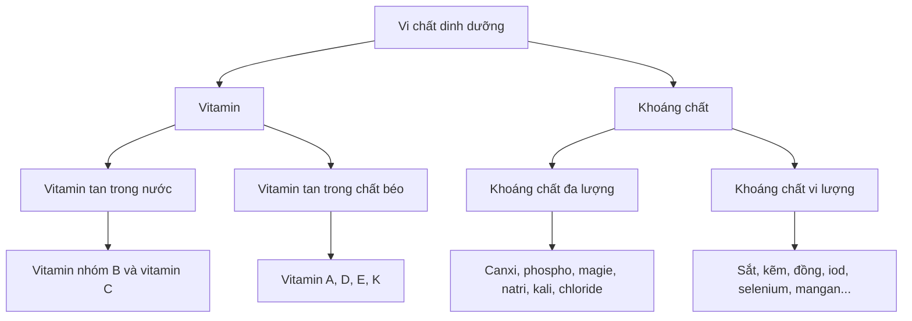

# 068 — Giới thiệu về vi chất dinh dưỡng
[](https://www.m-pathnaturopathy.com.au/post/vitamins-minerals-from-food-sources?utm_source=chatgpt.com)
| Thuộc tính       | Nội dung                         |
| ---------------- | -------------------------------- |
| **Module**       | Module 08 — Micronutrients       |
| **Bài học**      | Micronutrients Introduction      |
| **Thời lượng**   | 00:48                            |
| **Chủ đề chính** | Giới thiệu về vi chất dinh dưỡng |

> [!NOTE]
> **Hiệu chỉnh bản ghi bài giảng**
>
> * “Optimal **micronutrient** intake” nhiều khả năng phải là “optimal **macronutrient** intake”.
> * “You not only **handle** muscle growth” nên hiểu là “you may **hinder** muscle growth” — cản trở sự phát triển cơ bắp.
> * “Macroom minerals” là lỗi phiên âm của **macrominerals** — khoáng chất đa lượng.

## Mục lục

1. [Mục tiêu bài học](#1-mục-tiêu-bài-học)
2. [Nội dung chính](#2-nội-dung-chính)
3. [Áp dụng thực tế](#3-áp-dụng-thực-tế)
4. [Lưu ý và lỗi thường gặp](#4-lưu-ý-và-lỗi-thường-gặp)
5. [Checklist thực hành](#5-checklist-thực-hành)
6. [Tóm tắt](#6-tóm-tắt)

---

## 1. Mục tiêu bài học

Sau bài học này, người học có thể:

* Giải thích **vi chất dinh dưỡng** là gì.
* Phân biệt vi chất với carbohydrate, protein và chất béo.
* Nhận biết ba nhóm chính sẽ được học trong module:

  * Vitamin.
  * Khoáng chất đa lượng.
  * Khoáng chất vi lượng.
* Hiểu vai trò của vi chất đối với trao đổi chất, miễn dịch, hệ thần kinh, xương và hoạt động thể chất.
* Nhận biết rằng cả **thiếu hụt** lẫn **dư thừa** vi chất đều có thể gây hại.
* Áp dụng nguyên tắc **ưu tiên thực phẩm trước, bổ sung khi có lý do phù hợp**.

---

## 2. Nội dung chính

### 2.1. Vi chất dinh dưỡng là gì?

**Vi chất dinh dưỡng — micronutrients** là các vitamin và khoáng chất mà cơ thể chỉ cần với lượng tương đối nhỏ, thường được tính bằng miligam hoặc microgam mỗi ngày.

Mặc dù cần với lượng nhỏ, chúng tham gia vào rất nhiều chức năng sống như:

* Sản xuất enzyme và hormone.
* Chuyển hóa thức ăn thành năng lượng sử dụng được.
* Duy trì miễn dịch.
* Tạo máu và vận chuyển oxy.
* Duy trì xương, cơ và hệ thần kinh.
* Hỗ trợ tăng trưởng, phát triển và sửa chữa mô.

Vi chất **không trực tiếp cung cấp calorie**, nhưng lại giúp cơ thể xử lý và sử dụng năng lượng từ carbohydrate, protein và chất béo. ([World Health Organization][1])

### 2.2. Vi chất và đa lượng khác nhau thế nào?

| Đặc điểm                | Chất dinh dưỡng đa lượng                            | Vi chất dinh dưỡng                                     |
| ----------------------- | --------------------------------------------------- | ------------------------------------------------------ |
| **Tên tiếng Anh**       | Macronutrients                                      | Micronutrients                                         |
| **Nhóm chính**          | Protein, carbohydrate, chất béo                     | Vitamin và khoáng chất                                 |
| **Lượng cần thiết**     | Gram mỗi ngày                                       | Thường là mg hoặc µg mỗi ngày                          |
| **Cung cấp năng lượng** | Có, ngoại trừ một số thành phần như nước và chất xơ | Không trực tiếp cung cấp năng lượng                    |
| **Vai trò nổi bật**     | Năng lượng, xây dựng mô và dự trữ năng lượng        | Điều hòa phản ứng sinh hóa và duy trì chức năng cơ thể |
| **Ví dụ**               | Cơm, khoai, thịt, cá, dầu ăn                        | Sắt, kẽm, canxi, vitamin A, C, D                       |


*Hình 1. Sơ đồ khái quát các nhóm chất dinh dưỡng. Ảnh do Ryanimage phát hành theo giấy phép CC0 — phạm vi công cộng.* ([Wikimedia Commons][2])

---

### 2.3. Ba nhóm vi chất chính



#### A. Vitamin

Vitamin là các hợp chất hữu cơ cần thiết cho quá trình trao đổi chất và duy trì sức khỏe.

| Phân nhóm              | Thành phần          | Đặc điểm chính                                                           |
| ---------------------- | ------------------- | ------------------------------------------------------------------------ |
| **Tan trong nước**     | Vitamin C và nhóm B | Khả năng dự trữ thường hạn chế; cần được cung cấp tương đối thường xuyên |
| **Tan trong chất béo** | A, D, E và K        | Được hấp thu cùng chất béo và có thể tích lũy trong cơ thể               |

Do vitamin tan trong chất béo có thể được dự trữ trong gan và mô mỡ, việc sử dụng liều cao kéo dài có nguy cơ gây độc cao hơn so với việc chỉ lấy vitamin từ khẩu phần thông thường. Một số vitamin tan trong nước cũng có thể gây tác dụng phụ khi sử dụng quá mức. ([NCBI][3])

#### B. Khoáng chất đa lượng

Đây là những khoáng chất cơ thể cần với lượng lớn hơn tương đối so với khoáng chất vi lượng.

Một số ví dụ:

* **Canxi:** cấu trúc xương, co cơ và dẫn truyền thần kinh.
* **Magie:** phản ứng enzyme, chức năng cơ và thần kinh.
* **Natri, kali và chloride:** cân bằng dịch, dẫn truyền điện và co cơ.
* **Phospho:** cấu trúc xương, màng tế bào và chuyển hóa năng lượng.

> “Đa lượng” ở đây nói về **lượng khoáng chất cần thiết**, không có nghĩa chúng cung cấp calorie như carbohydrate, protein hoặc chất béo.

#### C. Khoáng chất vi lượng

Khoáng chất vi lượng chỉ cần với lượng rất nhỏ nhưng vẫn thiết yếu.

| Khoáng chất  | Vai trò điển hình                                |
| ------------ | ------------------------------------------------ |
| **Sắt**      | Tạo hemoglobin và vận chuyển oxy                 |
| **Kẽm**      | Miễn dịch, tổng hợp protein và lành vết thương   |
| **Iod**      | Sản xuất hormone tuyến giáp                      |
| **Selenium** | Hoạt động của enzyme chống oxy hóa và tuyến giáp |
| **Đồng**     | Chuyển hóa sắt và hình thành mô liên kết         |
| **Mangan**   | Hoạt hóa nhiều enzyme chuyển hóa                 |

---

### 2.4. Vi chất hoạt động như thế nào?

Có thể hình dung:

```text
Thực phẩm
   │
   ├── Carbohydrate, protein, chất béo
   │           │
   │           └── Cung cấp năng lượng và nguyên liệu
   │
   └── Vitamin và khoáng chất
               │
               └── Giúp enzyme, hormone và tế bào
                   sử dụng nguồn năng lượng, xây dựng
                   và sửa chữa cơ thể
```

Một số chức năng tiêu biểu:

| Hệ thống                          | Vi chất có liên quan                                   |
| --------------------------------- | ------------------------------------------------------ |
| **Tạo năng lượng tế bào**         | Vitamin nhóm B, magie, sắt                             |
| **Vận chuyển oxy**                | Sắt, folate, vitamin B12                               |
| **Xương và răng**                 | Canxi, phospho, magie, vitamin D, vitamin K            |
| **Co cơ và dẫn truyền thần kinh** | Natri, kali, canxi, magie                              |
| **Miễn dịch**                     | Vitamin A, C, D, E, kẽm, selenium                      |
| **Tuyến giáp**                    | Iod, selenium                                          |
| **Đông máu**                      | Vitamin K, canxi                                       |
| **Chống oxy hóa**                 | Vitamin C, E, selenium và một số enzyme chứa kẽm, đồng |

---

### 2.5. Người tập luyện có cần nhiều vi chất hơn không?

Bản ghi bài học cho rằng người vận động thường xuyên “sử dụng nhiều vi chất hơn người bình thường”. Ý này đúng ở một mức độ nhất định nhưng cần hiểu chính xác hơn:

* Tập luyện có thể làm tăng tốc độ chuyển hóa năng lượng.
* Một số khoáng chất điện giải bị mất qua mồ hôi.
* Tổn thương và sửa chữa mô có thể làm tăng nhu cầu đối với một số chất.
* Người hạn chế calorie, loại bỏ nhiều nhóm thực phẩm hoặc tập luyện với khối lượng lớn dễ có khẩu phần thiếu vi chất hơn.
* Tuy nhiên, **không phải mọi vận động viên đều cần liều vitamin và khoáng chất cao hơn**, và hiện không có một bộ khuyến nghị vi chất riêng áp dụng cho tất cả người tập.

Nguy cơ phụ thuộc vào môn thể thao, khối lượng tập, chế độ ăn, lượng mồ hôi, giới tính và tình trạng sức khỏe. Người tập thường được khuyến nghị bắt đầu bằng khẩu phần đủ năng lượng và đa dạng thực phẩm, sau đó mới đánh giá nhu cầu bổ sung riêng. ([Ernährungs Umschau][4])

> [!IMPORTANT]
> Uống vitamin liều cao không tự động làm tăng cơ, tăng sức mạnh hoặc tăng tốc độ phục hồi khi cơ thể vốn không bị thiếu chất.

---

### 2.6. Điều gì xảy ra khi thiếu vi chất?

Thiếu vi chất có thể xuất hiện do:

* Khẩu phần đơn điệu hoặc quá ít calorie.
* Loại bỏ nhiều nhóm thực phẩm.
* Hấp thu kém do bệnh đường tiêu hóa.
* Nhu cầu tăng trong thai kỳ hoặc giai đoạn phát triển.
* Mất chất qua mồ hôi, máu hoặc bệnh lý.
* Tương tác với thuốc.
* Không được tiếp xúc đủ ánh nắng trong trường hợp vitamin D.

Hậu quả phụ thuộc vào loại vi chất bị thiếu:

| Vi chất thiếu               | Hậu quả có thể gặp                                      |
| --------------------------- | ------------------------------------------------------- |
| **Sắt**                     | Thiếu máu, mệt mỏi, giảm khả năng vận động              |
| **Vitamin D hoặc canxi**    | Ảnh hưởng sức khỏe xương và chức năng cơ                |
| **Vitamin B12 hoặc folate** | Thiếu máu và rối loạn thần kinh trong một số trường hợp |
| **Iod**                     | Rối loạn chức năng tuyến giáp                           |
| **Vitamin A**               | Ảnh hưởng thị giác và miễn dịch                         |
| **Kẽm**                     | Suy giảm miễn dịch, chậm lành vết thương                |

WHO lưu ý rằng thiếu vi chất có thể gây bệnh rõ rệt, nhưng cũng có thể biểu hiện kín đáo hơn qua giảm năng lượng, giảm sự minh mẫn và giảm khả năng làm việc. ([World Health Organization][1])


---

### 2.7. Thiếu và thừa đều có thể gây hại

Mục tiêu không phải là “càng nhiều càng tốt”, mà là nằm trong **khoảng phù hợp**.

```text
Thiếu hụt                  Đủ nhu cầu                   Dư thừa
   │                           │                           │
Chức năng suy giảm       Cơ thể hoạt động tốt       Nguy cơ độc tính
```

Ví dụ:

* Quá nhiều vitamin A có thể gây độc.
* Quá nhiều sắt có thể làm tổn thương cơ quan.
* Vitamin B6 liều cao kéo dài có thể gây tổn thương thần kinh.
* Quá nhiều natri có thể bất lợi cho huyết áp ở nhiều người.
* Quá nhiều kẽm có thể làm giảm hấp thu đồng.

Vì vậy, không nên dùng nhiều sản phẩm bổ sung chồng chéo mà không kiểm tra tổng liều.

---

### 2.8. Góc nhìn từ nghiên cứu

Một phân tích mô hình hóa đăng trên *The Lancet Global Health* năm 2024 đã ước tính mức hấp thu không đầy đủ của 15 vi chất tại 185 quốc gia. Nghiên cứu cho thấy khẩu phần không đủ iod, vitamin E, canxi và sắt có mức độ phổ biến cao trên toàn cầu. Các số liệu này phản ánh **lượng ăn vào ước tính**, không đồng nghĩa tất cả những người đó đã mắc bệnh thiếu chất được xác nhận bằng xét nghiệm. ([ScienceDirect][5])


*Hình 2. Bản đồ minh họa sự phân bố không đồng đều của thiếu vitamin A ở trẻ em. Tệp được tổng hợp từ Our World in Data theo giấy phép CC BY 4.0; metadata của tệp không xác định rõ năm dữ liệu, vì vậy chỉ nên dùng để minh họa, không dùng như số liệu hiện hành.* ([Wikimedia Commons][6])

---

## 3. Áp dụng thực tế

### 3.1. Ưu tiên khẩu phần đa dạng

Một chế độ ăn có mật độ dinh dưỡng tốt thường kết hợp:

| Nhóm thực phẩm                             | Vi chất nổi bật                            |
| ------------------------------------------ | ------------------------------------------ |
| **Rau xanh đậm**                           | Folate, vitamin K, magie, carotenoid       |
| **Rau củ và trái cây nhiều màu**           | Vitamin C, carotenoid, kali                |
| **Đậu và ngũ cốc nguyên hạt**              | Vitamin nhóm B, magie, sắt, kẽm            |
| **Sữa hoặc thực phẩm thay thế tăng cường** | Canxi, vitamin D, vitamin B12 tùy sản phẩm |
| **Thịt, cá, trứng**                        | Sắt, kẽm, vitamin B12, selenium            |
| **Hải sản**                                | Iod, selenium, vitamin B12                 |
| **Hạt và quả hạch**                        | Vitamin E, magie, đồng                     |
| **Muối iod**                               | Iod                                        |

WHO khuyến nghị một chế độ ăn đa dạng gồm rau quả, đậu, ngũ cốc nguyên hạt, các loại hạt và nguồn protein phù hợp để tăng khả năng đáp ứng nhu cầu vitamin và khoáng chất. ([World Health Organization][7])

### 3.2. Công thức xây dựng bữa ăn


Ví dụ một bữa ăn:

* Cơm hoặc khoai.
* Cá, thịt nạc, trứng, đậu phụ hoặc các loại đậu.
* Một món rau xanh.
* Một loại rau củ có màu đỏ, cam hoặc tím.
* Trái cây sau bữa ăn.
* Một lượng chất béo phù hợp như dầu thực vật, hạt hoặc cá béo.

### 3.3. Theo dõi khẩu phần theo tuần

Không cần cố gắng đạt đủ tất cả vi chất trong từng bữa. Thay vào đó, hãy đánh giá xu hướng trong nhiều ngày:

1. Ghi lại khẩu phần trong 3–7 ngày.
2. Kiểm tra xem có nhóm thực phẩm nào thường xuyên bị bỏ qua.
3. Xác định chế độ ăn có quá đơn điệu hay không.
4. Ưu tiên điều chỉnh thực phẩm.
5. Chỉ xét nghiệm hoặc bổ sung khi có triệu chứng, yếu tố nguy cơ hoặc chỉ định chuyên môn.

### 3.4. Khi nào có thể cần đánh giá kỹ hơn?

Nên chú ý hơn đến vi chất khi:

* Ăn chay thuần hoặc loại bỏ toàn bộ một nhóm thực phẩm.
* Đang giảm cân với mức calorie rất thấp.
* Tập luyện sức bền hoặc ra mồ hôi nhiều.
* Có kinh nguyệt nhiều.
* Đang mang thai hoặc cho con bú.
* Có bệnh đường tiêu hóa hoặc tiền sử phẫu thuật tiêu hóa.
* Dùng thuốc ảnh hưởng đến hấp thu dinh dưỡng.
* Có mệt mỏi kéo dài, yếu cơ, chóng mặt hoặc giảm hiệu suất không rõ nguyên nhân.

Việc lựa chọn xét nghiệm cần dựa trên triệu chứng và đánh giá lâm sàng; một xét nghiệm đơn lẻ không phải lúc nào cũng phản ánh đầy đủ tình trạng của toàn bộ hệ vi chất.

---

## 4. Lưu ý và lỗi thường gặp

### Lỗi 1: Chỉ quan tâm calorie và macronutrient

Một khẩu phần có thể đạt đủ protein và calorie nhưng vẫn nghèo vitamin, khoáng chất nếu chủ yếu gồm thực phẩm tinh chế và ít rau quả.

**Khắc phục:** đánh giá cả **số lượng** lẫn **chất lượng** thực phẩm.

---

### Lỗi 2: Cho rằng tập luyện đồng nghĩa phải uống multivitamin

Người vận động không tự động cần bổ sung tất cả vitamin và khoáng chất.

**Khắc phục:** bắt đầu bằng khẩu phần đủ năng lượng, đa dạng thực phẩm và đánh giá nguy cơ cá nhân.

---

### Lỗi 3: Dùng liều cao để “tăng hiệu suất”

Khi không thiếu chất, bổ sung liều cao thường không đem lại lợi ích tương ứng và có thể gây tác dụng phụ.

**Khắc phục:** không vượt liều khuyến nghị hoặc ngưỡng tối đa nếu không có chỉ định.

---

### Lỗi 4: Dùng nhiều sản phẩm có thành phần trùng nhau

Multivitamin, nước điện giải, pre-workout và sản phẩm hỗ trợ giấc ngủ có thể cùng chứa B6, kẽm hoặc magie.

**Khắc phục:** đọc bảng thành phần và cộng tổng liều từ tất cả sản phẩm.

---

### Lỗi 5: Tự chẩn đoán thiếu chất dựa trên triệu chứng chung

Mệt mỏi, rụng tóc, mất ngủ hoặc giảm hiệu suất có thể có nhiều nguyên nhân khác nhau.

**Khắc phục:** xem xét giấc ngủ, năng lượng khẩu phần, tải tập, bệnh lý và xét nghiệm phù hợp trước khi bổ sung.

---

### Lỗi 6: Tin rằng một “siêu thực phẩm” có thể cung cấp mọi thứ

Không một thực phẩm riêng lẻ nào đáp ứng tối ưu toàn bộ nhu cầu vi chất.

**Khắc phục:** luân phiên nguồn protein, rau củ, trái cây, ngũ cốc và chất béo.

---

## 5. Checklist thực hành

### Kiểm tra khẩu phần hằng tuần

* [ ] Tôi ăn nhiều loại rau củ và trái cây khác nhau.
* [ ] Tôi có nguồn protein chất lượng trong các bữa chính.
* [ ] Tôi thường xuyên dùng đậu, ngũ cốc nguyên hạt, hạt hoặc quả hạch.
* [ ] Tôi có nguồn canxi phù hợp.
* [ ] Tôi có nguồn sắt và vitamin B12 phù hợp với chế độ ăn.
* [ ] Tôi sử dụng muối iod với lượng hợp lý.
* [ ] Tổng năng lượng không quá thấp so với mức vận động.
* [ ] Tôi không tự ý dùng vitamin hoặc khoáng chất liều cao.
* [ ] Tôi đã kiểm tra thành phần trùng lặp giữa các sản phẩm bổ sung.
* [ ] Tôi tham khảo chuyên gia khi có triệu chứng hoặc nguy cơ thiếu hụt.

### Kiểm tra dành cho người tập luyện

* [ ] Khẩu phần đã tăng tương ứng với khối lượng tập.
* [ ] Tôi bù nước và điện giải phù hợp với lượng mồ hôi.
* [ ] Tôi không loại bỏ quá nhiều nhóm thực phẩm để giảm cân nhanh.
* [ ] Tôi theo dõi mệt mỏi, khả năng phục hồi và hiệu suất tập.
* [ ] Việc bổ sung sắt, vitamin D hoặc chất khác dựa trên đánh giá phù hợp.

---

## 6. Tóm tắt

> **Vi chất dinh dưỡng gồm vitamin và khoáng chất. Cơ thể chỉ cần chúng với lượng nhỏ nhưng chúng giữ vai trò thiết yếu trong hầu hết các quá trình sinh lý.**

Các ý quan trọng:

1. Vi chất không trực tiếp cung cấp calorie nhưng giúp cơ thể chuyển hóa và sử dụng năng lượng.
2. Vi chất gồm vitamin, khoáng chất đa lượng và khoáng chất vi lượng.
3. Thiếu vi chất có thể ảnh hưởng miễn dịch, tạo máu, xương, thần kinh, cơ bắp và hiệu suất vận động.
4. Người tập luyện có thể có nguy cơ thiếu một số chất cao hơn, nhưng không phải ai cũng cần bổ sung.
5. Một chế độ ăn đủ năng lượng và đa dạng thường là nền tảng tốt nhất.
6. Thực phẩm bổ sung nên được sử dụng có mục tiêu, đúng liều và dựa trên nhu cầu thực tế.
7. Trong các bài tiếp theo, từng vitamin và khoáng chất sẽ được phân tích theo ba câu hỏi:

```text
Tại sao cơ thể cần chất này?
        ↓
Cần bao nhiêu?
        ↓
Những thực phẩm nào cung cấp chất đó?
```

[1]: https://www.who.int/health-topics/micronutrients?utm_source=chatgpt.com "Micronutrients"
[2]: https://commons.wikimedia.org/wiki/File%3AFood_Nutrient_Group_Chart.png "File:Food Nutrient Group Chart.png - Wikimedia Commons"
[3]: https://www.ncbi.nlm.nih.gov/books/NBK591829/?utm_source=chatgpt.com "Chapter 14 Nutrition - Nursing Fundamentals - NCBI Bookshelf"
[4]: https://ernaehrungs-umschau.de/fileadmin/Ernaehrungs-Umschau/pdfs/pdf_2019/12_19/EU12_2019_DGE_engl.pdf?utm_source=chatgpt.com "Minerals and vitamins in sports nutrition"
[5]: https://www.sciencedirect.com/science/article/pii/S2214109X24002766?utm_source=chatgpt.com "Global estimation of dietary micronutrient inadequacies"
[6]: https://commons.wikimedia.org/wiki/File%3APrevalence-of-vitamin-a-deficiency-in-children.png "File:Prevalence-of-vitamin-a-deficiency-in-children.png - Wikimedia Commons"
[7]: https://www.who.int/news-room/fact-sheets/detail/healthy-diet?utm_source=chatgpt.com "Healthy diet"

---

# Bài luyện tập

## Mục tiêu


## Đề bài


## Yêu cầu hoàn thành

- [ ] 
- [ ] 
- [ ] 

## Kết quả / lời giải


## Ghi chú
