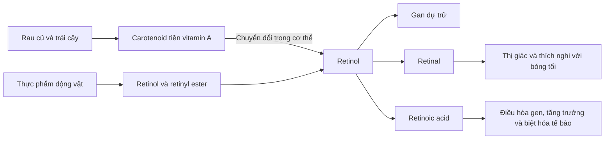

# 069 — Vitamin A

| Thuộc tính       | Nội dung                                                      |
| ---------------- | ------------------------------------------------------------- |
| **Module**       | Module 08 — Micronutrients                                    |
| **Bài học**      | Vitamin A                                                     |
| **Thời lượng**   | 01:41                                                         |
| **Chủ đề chính** | Vai trò, nguồn thực phẩm, nhu cầu và độ an toàn của vitamin A |

> [!IMPORTANT]
> **Hiệu đính nội dung gốc**
>
> * Câu “vitamin E làm chậm lão hóa” không thuộc bài vitamin A và không nên dùng như một kết luận khoa học.
> * Chưa có cơ sở để nói vitamin A trực tiếp “hạ cholesterol” hoặc tự nó phòng bệnh tim và đột quỵ.
> * Vitamin A **hỗ trợ chức năng miễn dịch bình thường**, nhưng uống thêm vitamin A không đồng nghĩa với phòng được cảm lạnh hoặc cúm.
> * Thuật ngữ đúng là **preformed vitamin A** — vitamin A dạng tạo sẵn và **provitamin A carotenoids** — carotenoid tiền vitamin A.
> * Một miếng bánh bí đỏ thương mại không nhất thiết cung cấp hơn 100% nhu cầu. Theo bảng dữ liệu NIH, một miếng cung cấp khoảng 54% Daily Value, trong khi một củ khoai lang nướng có thể cung cấp khoảng 156%. ([ODS][1])

## Hình ảnh minh họa


*Bí đỏ, cà rốt và khoai lang là những nguồn beta-carotene phổ biến. Ảnh: Wikimedia Commons.* ([Wikimedia Commons][2])

---

## Mục lục

1. [Mục tiêu bài học](#1-mục-tiêu-bài-học)
2. [Nội dung chính](#2-nội-dung-chính)
3. [Áp dụng thực tế](#3-áp-dụng-thực-tế)
4. [Lưu ý & lỗi thường gặp](#4-lưu-ý--lỗi-thường-gặp)
5. [Checklist thực hành](#5-checklist-thực-hành)
6. [Tóm tắt](#6-tóm-tắt)

---

## 1. Mục tiêu bài học

Sau bài học này, người học có thể:

* Giải thích vitamin A là gì và vì sao đây là vitamin tan trong chất béo.
* Trình bày vai trò của vitamin A đối với thị giác, miễn dịch, tăng trưởng và biệt hóa tế bào.
* Phân biệt vitamin A dạng tạo sẵn với carotenoid tiền vitamin A.
* Nhận diện các nguồn thực phẩm giàu vitamin A.
* Ghi nhớ nhu cầu khuyến nghị cho người trưởng thành.
* Nhận biết dấu hiệu thiếu hụt và nguy cơ dùng quá liều.
* Đánh giá khi nào thực phẩm bổ sung có thể cần thiết và khi nào không nên tự ý sử dụng.

---

## 2. Nội dung chính

### 2.1. Vitamin A là gì?

Vitamin A là một **vitamin tan trong chất béo**. Khái niệm “vitamin A” bao gồm một nhóm hợp chất có hoạt tính sinh học liên quan, trong đó có:

* **Retinol**.
* **Retinal**.
* **Retinoic acid**.
* Các **retinyl ester** dự trữ trong cơ thể.
* Một số carotenoid có thể được chuyển đổi thành vitamin A, nổi bật nhất là **beta-carotene**.

Vitamin A cần thiết cho thị giác bình thường, miễn dịch, sinh sản, tăng trưởng và phát triển. Nó cũng tham gia duy trì hoạt động bình thường của tim, phổi và nhiều cơ quan khác. ([ODS][3])

### 2.2. Hai nguồn vitamin A chính

| Nhóm                          | Dạng phổ biến                                     | Nguồn thực phẩm                                    | Đặc điểm                                                                        |
| ----------------------------- | ------------------------------------------------- | -------------------------------------------------- | ------------------------------------------------------------------------------- |
| **Vitamin A dạng tạo sẵn**    | Retinol, retinyl ester                            | Gan, cá, trứng, sữa và sản phẩm từ sữa             | Cơ thể sử dụng trực tiếp; hấp thu hiệu quả nhưng dễ tích lũy nếu dùng quá nhiều |
| **Carotenoid tiền vitamin A** | Beta-carotene, alpha-carotene, beta-cryptoxanthin | Rau củ và trái cây màu vàng, cam, đỏ hoặc xanh đậm | Cơ thể phải chuyển đổi thành vitamin A; hiệu suất chuyển đổi thấp hơn           |

Không phải carotenoid nào cũng tạo ra vitamin A. Chẳng hạn, lutein, zeaxanthin và lycopene có những vai trò sinh học riêng nhưng không được chuyển đổi thành retinol. ([ODS][3])

### Sơ đồ chuyển hóa đơn giản



### 2.3. Vai trò đối với thị giác

Trong võng mạc, một dạng vitamin A là **11-cis-retinal** kết hợp với protein opsin để tạo nên sắc tố thị giác. Khi ánh sáng tác động, retinal thay đổi cấu hình và khởi động chuỗi tín hiệu thần kinh giúp não nhận biết hình ảnh.

Khi dự trữ vitamin A suy giảm, lượng rhodopsin trong võng mạc có thể giảm. Vì vậy, một trong những biểu hiện sớm của thiếu vitamin A là **khó nhìn trong điều kiện ánh sáng yếu hoặc quáng gà**. ([ODS][1])


*Sơ đồ nghiên cứu minh họa quá trình retinal được tái tạo trong chu trình thị giác. Ảnh: Wikimedia Commons.* ([Wikimedia Commons][4])

### 2.4. Vai trò đối với miễn dịch và hàng rào bảo vệ

Vitamin A góp phần:

* Duy trì cấu trúc của da và các lớp niêm mạc.
* Hỗ trợ hoạt động bình thường của nhiều tế bào miễn dịch.
* Duy trì hàng rào bảo vệ tại đường hô hấp và đường tiêu hóa.
* Tham gia tăng trưởng và phát triển của trẻ em.

Thiếu vitamin A kéo dài có liên quan đến nguy cơ nhiễm trùng nặng hơn, đặc biệt ở trẻ em sống tại các khu vực có tỷ lệ suy dinh dưỡng cao. Tuy nhiên, điều này không có nghĩa người khỏe mạnh uống liều cao vitamin A sẽ phòng được cảm lạnh, cúm hay các bệnh nhiễm trùng thông thường. ([ODS][1])

### 2.5. Tăng trưởng và biệt hóa tế bào

Retinoic acid có vai trò điều hòa biểu hiện gen, qua đó hỗ trợ:

* Tạo và biệt hóa tế bào mới.
* Phát triển mô và cơ quan.
* Sinh sản.
* Phát triển phôi thai.
* Duy trì biểu mô của da, mắt, phổi và đường tiêu hóa.

Vitamin A cần thiết cho tăng trưởng bình thường, nhưng **bổ sung nhiều hơn nhu cầu không làm cơ bắp phát triển nhanh hơn** và có thể gây độc do vitamin A được lưu trữ trong gan. ([ODS][3])

### 2.6. Đơn vị đo và nhu cầu khuyến nghị

Nhu cầu vitamin A thường được biểu thị bằng **microgam đương lượng hoạt tính retinol — mcg RAE**.

> **1 microgam — mcg = 0,001 miligam — mg.**

RAE được dùng vì retinol và carotenoid từ thực phẩm không có hoạt tính vitamin A tương đương nhau:

* 1 mcg RAE = 1 mcg retinol.
* 1 mcg RAE = 12 mcg beta-carotene từ thực phẩm.
* 1 mcg RAE = 24 mcg alpha-carotene hoặc beta-cryptoxanthin từ thực phẩm.
* 1 mcg RAE = 2 mcg beta-carotene từ thực phẩm bổ sung. ([ODS][1])

#### Nhu cầu hằng ngày tham khảo

| Đối tượng                     |      Lượng khuyến nghị |
| ----------------------------- | ---------------------: |
| Nam giới trưởng thành         |   **900 mcg RAE/ngày** |
| Nữ giới trưởng thành          |   **700 mcg RAE/ngày** |
| Phụ nữ mang thai trưởng thành |   **770 mcg RAE/ngày** |
| Phụ nữ đang cho con bú        | **1.300 mcg RAE/ngày** |

Các mức trên là lượng khuyến nghị trung bình cho người khỏe mạnh, không phải liều thuốc điều trị. ([ODS][3])

### 2.7. Nguồn thực phẩm

Vitamin A dạng tạo sẵn có nhiều trong gan, cá, trứng và sản phẩm từ sữa. Carotenoid tiền vitamin A có nhiều trong rau lá xanh đậm và rau củ màu vàng, cam hoặc đỏ. ([ODS][1])

#### Hàm lượng tham khảo trong một số thực phẩm

| Thực phẩm và khẩu phần            |     Vitamin A | % Daily Value tham khảo |
| --------------------------------- | ------------: | ----------------------: |
| Gan bò áp chảo, khoảng 85 g       | 6.582 mcg RAE |                    731% |
| Một củ khoai lang nướng nguyên vỏ | 1.403 mcg RAE |                    156% |
| Cải bó xôi nấu chín, ½ cốc        |   573 mcg RAE |                     64% |
| Một miếng bánh bí đỏ thương mại   |   488 mcg RAE |                     54% |
| Cà rốt sống, ½ cốc                |   459 mcg RAE |                     51% |
| Cá trích, khoảng 85 g             |   219 mcg RAE |                     24% |
| Ớt chuông đỏ sống, ½ cốc          |   117 mcg RAE |                     13% |
| Một quả trứng luộc                |    75 mcg RAE |                      8% |
| Cá hồi nấu chín, khoảng 85 g      |    59 mcg RAE |                      7% |
| Bông cải xanh nấu chín, ½ cốc     |    60 mcg RAE |                      7% |

Giá trị thực tế có thể thay đổi theo giống thực phẩm, kích thước khẩu phần và cách chế biến. Bảng trên cho thấy gan chứa lượng vitamin A dạng tạo sẵn rất cao; gan không phải là thực phẩm “xấu”, nhưng không nên xem đây là món cần ăn với số lượng lớn hoặc hằng ngày. ([ODS][1])

### 2.8. Hấp thu carotenoid từ thực vật

Carotenoid nằm trong cấu trúc tế bào thực vật nên thường không được hấp thu hoàn toàn. Một số cách có thể hỗ trợ giải phóng và hấp thu carotenoid gồm:

* Nấu chín vừa phải.
* Thái nhỏ, nghiền hoặc xay.
* Ăn cùng một lượng chất béo phù hợp như dầu thực vật, trứng, bơ quả hoặc các loại hạt.

NIH ghi nhận xử lý nhiệt có thể làm tăng khả dụng sinh học của beta-carotene. Các nghiên cứu trên người cũng cho thấy thành phần chất béo trong bữa ăn có ảnh hưởng đến khả năng hấp thu carotenoid. ([ODS][1])

### 2.9. Thiếu vitamin A

Các biểu hiện có thể gặp gồm:

* Khó nhìn khi trời tối hoặc quáng gà.
* Khô kết mạc và giác mạc.
* Các đốm Bitot trên kết mạc.
* Da khô hoặc sần, nhưng đây là dấu hiệu không đặc hiệu.
* Tăng nguy cơ biến chứng do nhiễm trùng.
* Trong trường hợp nặng, tổn thương giác mạc và mất thị lực vĩnh viễn.

Quáng gà là một dấu hiệu quan trọng nhưng không phải mọi trường hợp nhìn kém ban đêm đều do thiếu vitamin A. Người gặp biểu hiện này cần được khám mắt và đánh giá y tế thay vì tự uống vitamin liều cao. ([World Health Organization][5])


*Hình mô phỏng tác động của quáng gà đối với khả năng nhìn trong ánh sáng yếu. Ảnh: Wikimedia Commons.* ([Wikimedia Commons][6])

### 2.10. Thừa vitamin A và ngộ độc

Do tan trong chất béo, vitamin A dạng tạo sẵn có thể tích lũy, chủ yếu trong gan. Dùng liều rất cao trong thời gian ngắn có thể gây:

* Đau đầu dữ dội.
* Buồn nôn và chóng mặt.
* Nhìn mờ.
* Đau cơ.
* Mất phối hợp vận động.

Sử dụng liều cao kéo dài có thể gây khô da, đau cơ khớp, mệt mỏi và bất thường chức năng gan. ([ODS][1])

#### Giới hạn tối đa

Với người trưởng thành từ 19 tuổi, giới hạn trên là:

> **3.000 mcg RAE vitamin A dạng tạo sẵn mỗi ngày.**

Giới hạn này áp dụng cho retinol và retinyl ester từ thực phẩm, thực phẩm bổ sung và thuốc; không áp dụng theo cùng cách đối với beta-carotene tự nhiên trong rau củ. ([ODS][1])

---

## 3. Áp dụng thực tế

### 3.1. Nguyên tắc xây dựng khẩu phần

Không cần cố gắng ăn một thực phẩm “siêu giàu” vitamin A mỗi ngày. Có thể luân phiên:

* Khoai lang, cà rốt hoặc bí đỏ.
* Rau lá xanh đậm.
* Ớt chuông đỏ.
* Xoài, đu đủ hoặc các loại quả màu cam.
* Trứng, sữa hoặc cá.
* Gan với khẩu phần và tần suất phù hợp.

### 3.2. Ví dụ bữa ăn

#### Bữa sáng

* Trứng kết hợp rau lá xanh.
* Sữa hoặc sữa chua.
* Một phần trái cây màu vàng hoặc cam.

#### Bữa trưa

* Cơm.
* Cá hoặc thịt nạc.
* Canh bí đỏ.
* Rau xanh xào với lượng dầu vừa phải.

#### Bữa tối

* Khoai lang.
* Cá hồi hoặc trứng.
* Bông cải xanh và ớt chuông.

### 3.3. Công thức ghi nhớ

```text
Rau màu cam + rau xanh đậm + một ít chất béo
                    ↓
       Hỗ trợ hấp thu carotenoid tốt hơn
```

Ví dụ:

* Cà rốt xào với một ít dầu.
* Canh bí đỏ có thịt hoặc dầu thực vật.
* Salad rau xanh ăn cùng trứng hoặc sốt chứa dầu.
* Khoai lang kết hợp sữa chua và các loại hạt.

### 3.4. Đối với người tập luyện

Người tập gym hoặc chơi thể thao không cần dùng vitamin A liều cao để:

* Tăng cơ nhanh hơn.
* Đốt mỡ.
* Tăng testosterone.
* “Tăng miễn dịch” vượt mức sinh lý bình thường.

Một chế độ ăn đa dạng thường đã cung cấp vitamin A. Thực phẩm bổ sung chỉ nên được cân nhắc khi có chế độ ăn hạn chế, bệnh gây kém hấp thu, thiếu hụt đã được đánh giá hoặc chỉ định của bác sĩ.

---

## 4. Lưu ý & lỗi thường gặp

### 4.1. Cho rằng vitamin A phòng được cảm lạnh và cúm

Vitamin A cần cho miễn dịch bình thường, nhưng điều đó khác với việc bổ sung vitamin A để phòng hoặc điều trị cảm lạnh và cúm. Người không thiếu vitamin A thường không nhận thêm lợi ích rõ ràng từ việc dùng liều cao.

### 4.2. Xem thực phẩm động vật là “không tối ưu”

Nguồn động vật không mặc nhiên xấu cho chế độ ăn thể hình. Trứng, cá và sữa có thể cung cấp vitamin A cùng protein và nhiều dưỡng chất khác. Vấn đề cần lưu ý nhất là **gan chứa vitamin A cực kỳ cao**, không phải vì gan không phù hợp với người tập luyện.

### 4.3. Nghĩ rằng càng nhiều càng tốt

Vitamin A dạng tạo sẵn có thể tích lũy và gây độc. Một số sản phẩm bổ sung chứa tới 3.000 mcg RAE, bằng giới hạn trên cho người trưởng thành. Cần đọc kỹ nhãn và cộng cả lượng từ nhiều sản phẩm khác nhau. ([ODS][1])

### 4.4. Phụ nữ mang thai tự dùng retinol liều cao

Vitamin A dạng tạo sẵn ở liều cao có thể gây dị tật bẩm sinh. Người đang mang thai, có khả năng mang thai hoặc đang dùng thuốc retinoid trị mụn và bệnh da không nên tự phối hợp thêm vitamin A. ([ODS][1])

### 4.5. Người hút thuốc dùng beta-carotene liều cao

Các thử nghiệm ATBC và CARET cho thấy beta-carotene liều cao dạng bổ sung làm tăng nguy cơ ung thư phổi ở một số nhóm người hút thuốc, từng hút thuốc hoặc phơi nhiễm amiăng. Cảnh báo này liên quan đến **thực phẩm bổ sung liều cao**, không phải cà rốt và rau củ thông thường. ([ODS][1])

### 4.6. Chẩn đoán thiếu vitamin A chỉ dựa vào da khô

Da khô, bong vảy có nhiều nguyên nhân. Không nên kết luận thiếu vitamin A hoặc tự bổ sung liều cao chỉ từ biểu hiện ngoài da.

### 4.7. Bỏ qua rau màu xanh

Rau không cần có màu cam mới chứa carotenoid. Cải bó xôi và nhiều rau lá xanh đậm cũng giàu beta-carotene; màu cam bị che khuất bởi diệp lục.

---

## 5. Checklist thực hành

* [ ] Tôi hiểu vitamin A là vitamin tan trong chất béo.
* [ ] Tôi phân biệt được vitamin A dạng tạo sẵn và carotenoid tiền vitamin A.
* [ ] Tôi ăn rau xanh đậm hoặc rau củ màu vàng, cam, đỏ thường xuyên.
* [ ] Tôi kết hợp rau giàu carotenoid với một lượng chất béo phù hợp.
* [ ] Tôi không xem gan là thực phẩm cần ăn hằng ngày.
* [ ] Tôi kiểm tra đơn vị `mcg RAE` trên nhãn thực phẩm bổ sung.
* [ ] Tôi không tự dùng vitamin A liều cao để phòng cảm lạnh hoặc tăng cơ.
* [ ] Tôi biết giới hạn trên cho người trưởng thành là 3.000 mcg RAE/ngày đối với vitamin A dạng tạo sẵn.
* [ ] Tôi thận trọng với vitamin A khi mang thai hoặc đang dùng thuốc retinoid.
* [ ] Nếu hút thuốc hoặc từng hút thuốc, tôi tránh beta-carotene liều cao dạng bổ sung.
* [ ] Tôi đi khám nếu xuất hiện quáng gà hoặc thay đổi thị lực bất thường.

---

## 6. Tóm tắt

Vitamin A là vitamin tan trong chất béo, cần thiết cho **thị giác, miễn dịch, tăng trưởng, sinh sản và biệt hóa tế bào**. Cơ thể nhận vitamin A từ hai nhóm nguồn:

```text
Thực phẩm động vật → vitamin A dạng tạo sẵn
Thực vật          → carotenoid tiền vitamin A
```

Nam giới trưởng thành cần khoảng **900 mcg RAE/ngày**, nữ giới trưởng thành cần khoảng **700 mcg RAE/ngày**. Khoai lang, cà rốt, bí đỏ, rau lá xanh, trứng, cá, sữa và gan đều có thể đóng góp vitamin A, nhưng gan chứa hàm lượng rất cao. ([ODS][3])

Thiếu vitamin A có thể gây quáng gà và tổn thương mắt nghiêm trọng. Ngược lại, quá nhiều vitamin A dạng tạo sẵn có thể gây ngộ độc và tổn thương gan. Vì vậy, với phần lớn người khỏe mạnh, chiến lược phù hợp là **ăn đa dạng thực phẩm thay vì tự bổ sung liều cao**.

[1]: https://ods.od.nih.gov/factsheets/VitaminA-HealthProfessional/ "Vitamin A and Carotenoids - Health Professional Fact Sheet"
[2]: https://commons.wikimedia.org/wiki/File%3APumpkins%2C_carrots%2C_and_sweet_potatoes_in_the_market.jpg?utm_source=chatgpt.com "File:Pumpkins, carrots, and sweet potatoes in the market.jpg - Wikimedia Commons"
[3]: https://ods.od.nih.gov/factsheets/VitaminA-Consumer/ "Vitamin A and Carotenoids - Consumer"
[4]: https://commons.wikimedia.org/wiki/File%3AVisual_cycle.svg?utm_source=chatgpt.com "File:Visual cycle.svg - Wikimedia Commons"
[5]: https://www.who.int/data/nutrition/nlis/info/vitamin-a-deficiency "Vitamin A deficiency"
[6]: https://commons.wikimedia.org/wiki/File%3ADepiction_of_vision_of_a_person_suffering_from_night_blindness.png?utm_source=chatgpt.com "File:Depiction of vision of a person suffering from night blindness.png - Wikimedia Commons"

---

# Bài luyện tập

## Mục tiêu


## Đề bài


## Yêu cầu hoàn thành

- [ ] 
- [ ] 
- [ ] 

## Kết quả / lời giải


## Ghi chú
