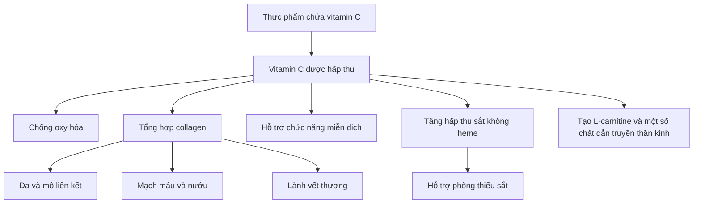
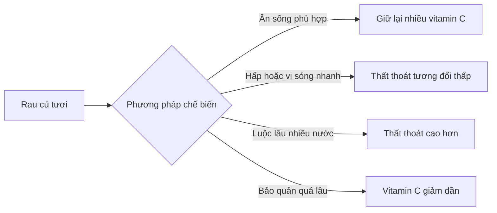

# 071 — Vitamin C

| Thuộc tính       | Nội dung                                                    |
| ---------------- | ----------------------------------------------------------- |
| **Module**       | Module 08 — Micronutrients                                  |
| **Bài học**      | Vitamin C                                                   |
| **Thời lượng**   | 01:13                                                       |
| **Chủ đề chính** | Vai trò, nguồn thực phẩm, nhu cầu và cách sử dụng vitamin C |
| **Tên khoa học** | L-ascorbic acid — axit L-ascorbic                           |
| **Phân loại**    | Vitamin tan trong nước                                      |

> **Lưu ý khoa học:** Vitamin C rất cần thiết, nhưng không phải là thuốc chữa cảm lạnh hay chất “tăng miễn dịch” tức thời. Phần dưới đây đã điều chỉnh một số diễn đạt trong nội dung gốc để phù hợp hơn với bằng chứng hiện có.


*Hình 1. Một số nguồn vitamin C trong thực phẩm. Ảnh của National Cancer Institute/NIH, thuộc phạm vi công cộng, qua Wikimedia Commons.* ([Wikimedia Commons][1])

## Mục lục

1. [Mục tiêu bài học](#1-mục-tiêu-bài-học)
2. [Nội dung chính](#2-nội-dung-chính)
3. [Áp dụng thực tế](#3-áp-dụng-thực-tế)
4. [Lưu ý & lỗi thường gặp](#4-lưu-ý--lỗi-thường-gặp)
5. [Checklist thực hành](#5-checklist-thực-hành)
6. [Tóm tắt](#6-tóm-tắt)

---

## 1. Mục tiêu bài học

Sau bài học này, người học có thể:

* Giải thích vitamin C là gì và vì sao cơ thể phải lấy vitamin C từ chế độ ăn.
* Nêu được các vai trò chính của vitamin C đối với collagen, chống oxy hóa, miễn dịch và hấp thu sắt.
* Nhận biết những thực phẩm giàu vitamin C.
* Ước tính nhu cầu vitamin C hằng ngày ở người trưởng thành.
* Hiểu giới hạn của vitamin C trong phòng ngừa và điều trị cảm lạnh.
* Tránh lạm dụng viên bổ sung liều cao.

---

## 2. Nội dung chính

### 2.1. Vitamin C là gì?

Vitamin C, hay **axit L-ascorbic**, là một vitamin tan trong nước. Con người không thể tự tổng hợp đủ vitamin C nên phải lấy chất này từ thức ăn hoặc, trong một số trường hợp, từ thực phẩm bổ sung. Cơ thể kiểm soát khá chặt nồng độ vitamin C; khi dùng liều rất cao, tỷ lệ hấp thu giảm và lượng không được chuyển hóa sẽ được đào thải qua nước tiểu. ([ODS][2])


*Hình 2. Cấu trúc hóa học của axit ascorbic. Hình thuộc phạm vi công cộng, qua Wikimedia Commons.* ([Wikimedia Commons][3])

---

### 2.2. Những vai trò chính của vitamin C

#### Chống oxy hóa

Vitamin C hoạt động như một chất chống oxy hóa sinh lý, giúp hạn chế tổn thương do các gốc tự do và có thể hỗ trợ tái tạo một số chất chống oxy hóa khác, chẳng hạn vitamin E. Tuy nhiên, điều này không có nghĩa rằng dùng càng nhiều vitamin C thì sức khỏe càng tốt. ([ODS][2])

#### Tổng hợp collagen và phục hồi mô

Vitamin C cần thiết cho quá trình tổng hợp **collagen** — một protein cấu trúc quan trọng của:

* Da.
* Mạch máu.
* Nướu và răng.
* Sụn, xương và mô liên kết.
* Quá trình lành vết thương.

Thiếu vitamin C làm suy giảm quá trình hình thành collagen, khiến mô liên kết yếu, vết thương lâu lành và mao mạch dễ tổn thương. ([ODS][2])

#### Tham gia chuyển hóa

Vitamin C tham gia quá trình tạo:

* Collagen.
* L-carnitine, một chất liên quan đến chuyển hóa năng lượng.
* Một số chất dẫn truyền thần kinh.
* Quá trình chuyển hóa protein. ([ODS][2])

Vì vậy, câu nói vitamin C tham gia “hơn 300 chức năng chuyển hóa” không nên được sử dụng như một con số chính xác nếu không có nguồn chứng minh cụ thể.

#### Hỗ trợ hệ miễn dịch

Vitamin C cần thiết để nhiều thành phần của hệ miễn dịch hoạt động bình thường. Tuy nhiên, vitamin C nên được hiểu là **một dưỡng chất hỗ trợ chức năng miễn dịch**, không phải một chất có khả năng “tăng cường miễn dịch” ngay lập tức hay ngăn chặn mọi bệnh nhiễm trùng. ([ODS][2])

#### Tăng hấp thu sắt không heme

Vitamin C giúp tăng hấp thu **sắt không heme** — dạng sắt chủ yếu có trong thực phẩm thực vật. Tác dụng rõ nhất khi thực phẩm chứa vitamin C và sắt được ăn trong cùng một bữa. ([PubMed][4])

Ví dụ:

```text
Đậu, đậu phụ hoặc rau xanh chứa sắt
                    +
Ớt chuông, cam, ổi, kiwi hoặc cà chua
                    ↓
       Hỗ trợ hấp thu sắt không heme
```

---

### 2.3. Sơ đồ vai trò của vitamin C



---

### 2.4. Nguồn thực phẩm giàu vitamin C

Trái cây và rau củ là những nguồn vitamin C tốt nhất. Nhóm thực phẩm nổi bật gồm ớt chuông, kiwi, cam quýt, dâu tây, bông cải xanh và cải Brussels. Một số loại ngũ cốc ăn sáng cũng được tăng cường vitamin C, nhưng nên kiểm tra nhãn vì không phải sản phẩm nào cũng có. ([ODS][2])

| Thực phẩm           | Khẩu phần tham khảo | Vitamin C ước tính |
| ------------------- | ------------------: | -----------------: |
| Ớt chuông đỏ sống   |               ½ cốc |              95 mg |
| Nước cam            |               ¾ cốc |              93 mg |
| Cam                 |           1 quả vừa |              70 mg |
| Kiwi                |           1 quả vừa |              64 mg |
| Ớt chuông xanh sống |               ½ cốc |              60 mg |
| Bông cải xanh chín  |               ½ cốc |              51 mg |
| Dâu tây cắt lát     |               ½ cốc |              49 mg |
| Cải Brussels chín   |               ½ cốc |              48 mg |
| Bông cải xanh sống  |               ½ cốc |              39 mg |
| Cà chua             |           1 quả vừa |              17 mg |
| Rau bina chín       |               ½ cốc |               9 mg |

*Hàm lượng là giá trị tham khảo; có thể thay đổi theo giống cây, độ chín, bảo quản và phương pháp chế biến.* ([ODS][2])

> **Điểm cần chỉnh từ nội dung gốc:** Rau bina có chứa vitamin C nhưng không phải nguồn đậm đặc nhất. Chỉ ½ cốc rau bina chín cung cấp khoảng 9 mg, thấp hơn đáng kể so với ớt chuông, kiwi, cam hoặc bông cải xanh. ([ODS][2])

---

### 2.5. Vitamin C và nhiệt độ

Vitamin C tan trong nước và nhạy cảm với nhiệt. Bảo quản quá lâu, luộc trong nhiều nước hoặc nấu trong thời gian dài có thể làm giảm hàm lượng vitamin C. Hấp, quay lò vi sóng hoặc nấu nhanh với ít nước thường giúp hạn chế thất thoát tốt hơn. ([ODS][2])



---

### 2.6. Nhu cầu vitamin C hằng ngày

Theo mức RDA do Food and Nutrition Board của Hoa Kỳ thiết lập:

| Nhóm                         |    Nhu cầu vitamin C |
| ---------------------------- | -------------------: |
| Nam từ 19 tuổi               |           90 mg/ngày |
| Nữ từ 19 tuổi                |           75 mg/ngày |
| Phụ nữ mang thai từ 19 tuổi  |           85 mg/ngày |
| Phụ nữ cho con bú từ 19 tuổi |          120 mg/ngày |
| Người hút thuốc              | Cộng thêm 35 mg/ngày |

Các giá trị tham khảo có thể khác đôi chút giữa các quốc gia và tổ chức dinh dưỡng. ([ODS][2])

Chỉ cần một số lựa chọn đơn giản đã có thể đáp ứng nhu cầu:

* ½ cốc ớt chuông đỏ: khoảng 95 mg.
* Một quả cam vừa: khoảng 70 mg.
* Một quả kiwi: khoảng 64 mg.
* ½ cốc bông cải xanh chín: khoảng 51 mg. ([ODS][2])

---

### 2.7. Vitamin C có ngăn ngừa cảm lạnh không?

Bằng chứng hiện tại cho thấy:

| Cách sử dụng                                                 | Kết quả quan sát được                                    |
| ------------------------------------------------------------ | -------------------------------------------------------- |
| Uống vitamin C thường xuyên ở dân số nói chung               | Không làm giảm đáng kể khả năng mắc cảm lạnh             |
| Uống thường xuyên trước khi mắc bệnh                         | Có thể rút ngắn nhẹ thời gian cảm lạnh                   |
| Bắt đầu uống sau khi đã xuất hiện triệu chứng                | Chưa cho thấy lợi ích rõ ràng                            |
| Người vận động thể lực cực độ hoặc tiếp xúc lạnh khắc nghiệt | Có thể giảm nguy cơ mắc cảm lạnh trong một số nghiên cứu |

Trong tổng quan Cochrane, sử dụng vitamin C đều đặn làm giảm thời gian cảm lạnh trung bình khoảng **8% ở người lớn và 14% ở trẻ em**, nhưng không chứng minh rằng vitamin C ngăn cảm lạnh ở phần lớn dân số. ([Cochrane Library][5])

Do đó, câu “nên bổ sung vitamin C ngay khi bắt đầu cảm thấy ốm” là diễn đạt quá chắc chắn. Vitamin C không thay thế việc nghỉ ngơi, uống đủ nước, dinh dưỡng phù hợp hoặc điều trị y tế khi cần.

---

### 2.8. Thiếu vitamin C

Thiếu vitamin C kéo dài có thể gây **bệnh scorbut**. Các biểu hiện có thể gồm:

* Mệt mỏi và suy nhược.
* Nướu sưng hoặc chảy máu.
* Dễ bầm tím, xuất huyết dưới da.
* Đau khớp.
* Vết thương lâu lành.
* Tóc mọc xoắn bất thường.
* Thiếu máu do chảy máu và giảm hấp thu sắt.

Triệu chứng có thể xuất hiện sau khoảng một tháng nếu lượng vitamin C duy trì dưới khoảng 10 mg/ngày, mặc dù thời điểm cụ thể phụ thuộc dự trữ vitamin C của từng người. ([ODS][2])

Các nhóm có nguy cơ thiếu vitamin C cao hơn gồm người hút thuốc, người có chế độ ăn rất hạn chế, người mắc rối loạn hấp thu nặng và một số người mắc bệnh mạn tính. ([ODS][2])

---

## 3. Áp dụng thực tế

### 3.1. Công thức xây dựng một bữa ăn giàu vitamin C

```text
Một nguồn đạm
      +
Một nguồn carbohydrate
      +
Ít nhất một loại rau hoặc trái cây giàu vitamin C
```

Ví dụ:

| Bữa ăn                          | Nguồn vitamin C | Lợi ích thực tế                 |
| ------------------------------- | --------------- | ------------------------------- |
| Cơm + thịt bò + ớt chuông       | Ớt chuông       | Bổ sung vitamin C cho bữa chính |
| Cơm + đậu phụ + bông cải xanh   | Bông cải        | Hỗ trợ hấp thu sắt từ đậu phụ   |
| Yến mạch + sữa chua + dâu tây   | Dâu tây         | Bữa sáng giàu vi chất           |
| Đậu lăng + cà chua + nước chanh | Cà chua, chanh  | Hỗ trợ hấp thu sắt không heme   |
| Bánh mì + trứng + kiwi          | Kiwi            | Cách đơn giản để tăng vitamin C |

---

### 3.2. Cách kết hợp vitamin C với sắt

Đối với người ăn chay hoặc ăn ít thịt, có thể kết hợp:

* Đậu phụ với ớt chuông.
* Đậu lăng với cà chua.
* Rau xanh với nước chanh.
* Ngũ cốc tăng cường sắt với kiwi hoặc dâu tây.
* Các loại đậu với bông cải xanh.

Vitamin C nên xuất hiện **trong cùng bữa ăn** với nguồn sắt thực vật để tạo điều kiện thuận lợi nhất cho hấp thu sắt không heme. ([PubMed][4])

---

### 3.3. Có cần dùng viên bổ sung không?

Người khỏe mạnh có chế độ ăn đa dạng thường có thể đáp ứng nhu cầu vitamin C bằng thực phẩm. NIH cho biết năm khẩu phần trái cây và rau củ đa dạng mỗi ngày có thể cung cấp trên 200 mg vitamin C. ([ODS][2])

Viên bổ sung có thể được cân nhắc khi:

* Chế độ ăn rất hạn chế.
* Không thể ăn đủ rau và trái cây.
* Có rối loạn hấp thu.
* Có nhu cầu tăng theo đánh giá của bác sĩ hoặc chuyên gia dinh dưỡng.
* Đang điều trị tình trạng thiếu vitamin C đã được xác định.

Thực phẩm bổ sung không nên được sử dụng để thay thế hoàn toàn rau củ và trái cây, vì thực phẩm còn cung cấp chất xơ, kali, folate và nhiều hợp chất thực vật khác.

---

## 4. Lưu ý & lỗi thường gặp

### Lỗi 1: Cho rằng mọi loại rau đều rất giàu vitamin C

Rau xanh có thể góp phần cung cấp vitamin C, nhưng hàm lượng khác nhau đáng kể. Rau bina chín cung cấp ít vitamin C hơn nhiều so với ớt chuông, kiwi hoặc cam. ([ODS][2])

### Lỗi 2: Dùng nước cam như nguồn vitamin C duy nhất

Nước cam có vitamin C nhưng cũng dễ được uống với lượng lớn và cung cấp ít chất xơ hơn cam nguyên quả. Nên đa dạng hóa nguồn vitamin C từ rau củ và trái cây nguyên dạng.

### Lỗi 3: Nghĩ rằng vitamin C chữa được cảm lạnh

Vitamin C không phải thuốc chữa cảm lạnh. Dùng thường xuyên có thể rút ngắn nhẹ thời gian mắc bệnh, nhưng bắt đầu bổ sung sau khi triệu chứng xuất hiện chưa cho thấy hiệu quả ổn định. ([ODS][2])

### Lỗi 4: Uống liều càng cao càng tốt

Ở liều trên 1 g/ngày, tỷ lệ vitamin C được hấp thu giảm xuống dưới 50%. Liều cao có thể gây tiêu chảy, buồn nôn, đau quặn bụng và các rối loạn tiêu hóa khác. ([ODS][2])

Ngưỡng dung nạp tối đa được NIH/FNB đặt ra cho người trưởng thành là **2.000 mg/ngày**, tính tổng từ thực phẩm và thực phẩm bổ sung. Đây là giới hạn an toàn, không phải liều khuyến nghị nên sử dụng mỗi ngày. ([ODS][2])

### Lỗi 5: Cho rằng vitamin C “chống đông máu”

Vitamin C giúp duy trì collagen và độ bền của mô liên kết, nên thiếu vitamin C có thể làm mao mạch dễ tổn thương và gây chảy máu. Tuy nhiên, không nên mô tả vitamin C là chất “ngăn máu đông bất thường” vì đây không phải vai trò dinh dưỡng chính đã được xác lập.

### Lỗi 6: Tự dùng liều cao trong mọi trường hợp

Cần thận trọng và trao đổi với bác sĩ trước khi dùng liều cao nếu:

* Có bệnh thận hoặc tiền sử tăng oxalate.
* Có bệnh thừa sắt di truyền như hemochromatosis.
* Đang hóa trị hoặc xạ trị.
* Đang dùng thuốc điều trị dài hạn.

Vitamin C liều cao có thể làm tăng hấp thu sắt; ở người mắc hemochromatosis, điều này có thể làm tình trạng quá tải sắt nghiêm trọng hơn. Khả năng liên quan đến sỏi thận chưa hoàn toàn thống nhất, nhưng cần đặc biệt thận trọng ở người có bệnh thận hoặc tăng oxalate từ trước. ([ODS][2])

---

## 5. Checklist thực hành

* [ ] Ăn ít nhất một loại rau hoặc trái cây giàu vitamin C mỗi ngày.
* [ ] Ưu tiên ớt chuông, kiwi, cam, dâu tây hoặc bông cải xanh.
* [ ] Kết hợp vitamin C với đậu, đậu phụ hoặc rau xanh chứa sắt.
* [ ] Không luộc rau quá lâu trong nhiều nước.
* [ ] Đa dạng hóa nguồn vitamin C thay vì chỉ uống nước cam.
* [ ] Không xem vitamin C là thuốc chữa cảm lạnh.
* [ ] Không tự động dùng viên 500–1.000 mg khi chế độ ăn đã đầy đủ.
* [ ] Không vượt 2.000 mg/ngày nếu không có chỉ định và theo dõi y tế.
* [ ] Tham khảo chuyên môn nếu có bệnh thận, quá tải sắt hoặc đang điều trị ung thư.

---

## 6. Tóm tắt

Vitamin C là một vitamin tan trong nước, cần thiết cho quá trình tổng hợp collagen, lành vết thương, chống oxy hóa, hoạt động miễn dịch và hấp thu sắt không heme. ([ODS][2])

Nguồn vitamin C tốt gồm ớt chuông, kiwi, cam quýt, dâu tây, bông cải xanh và cải Brussels. Chỉ ½ cốc ớt chuông đỏ sống đã cung cấp khoảng 95 mg, đủ đáp ứng RDA của phần lớn người trưởng thành trong một ngày. ([ODS][2])

Mức RDA tham khảo là **90 mg/ngày đối với nam trưởng thành** và **75 mg/ngày đối với nữ trưởng thành**; người hút thuốc cần thêm khoảng 35 mg/ngày. ([ODS][2])

Phần lớn người khỏe mạnh có thể đáp ứng nhu cầu bằng chế độ ăn đa dạng. Vitamin C không ngăn ngừa cảm lạnh ở phần lớn dân số và việc bắt đầu uống sau khi đã xuất hiện triệu chứng chưa cho thấy lợi ích rõ ràng. Dùng liều cao không mang lại lợi ích tỷ lệ thuận và có thể gây rối loạn tiêu hóa. ([ODS][2])

> **Thông điệp chính:** Hãy ưu tiên rau củ và trái cây giàu vitamin C, kết hợp chúng với nguồn sắt thực vật, chế biến nhẹ và chỉ sử dụng viên bổ sung khi thực sự cần thiết.

[1]: https://commons.wikimedia.org/wiki/File%3ACrate_of_fruit_and_vegetables.jpg "File:Crate of fruit and vegetables.jpg - Wikimedia Commons"
[2]: https://ods.od.nih.gov/factsheets/VitaminC-HealthProfessional/ "Vitamin C - Health Professional Fact Sheet"
[3]: https://commons.wikimedia.org/wiki/File%3AAscorbic_acid_structure.svg "File:Ascorbic acid structure.svg - Wikimedia Commons"
[4]: https://pubmed.ncbi.nlm.nih.gov/6940487/?utm_source=chatgpt.com "Interaction of vitamin C and iron"
[5]: https://www.cochranelibrary.com/cdsr/doi/10.1002/14651858.CD000980.pub4/abstract?utm_source=chatgpt.com "Vitamin C for preventing and treating the common cold"
