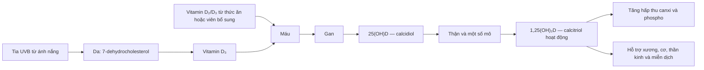
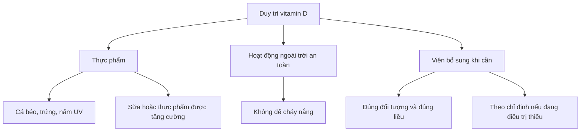
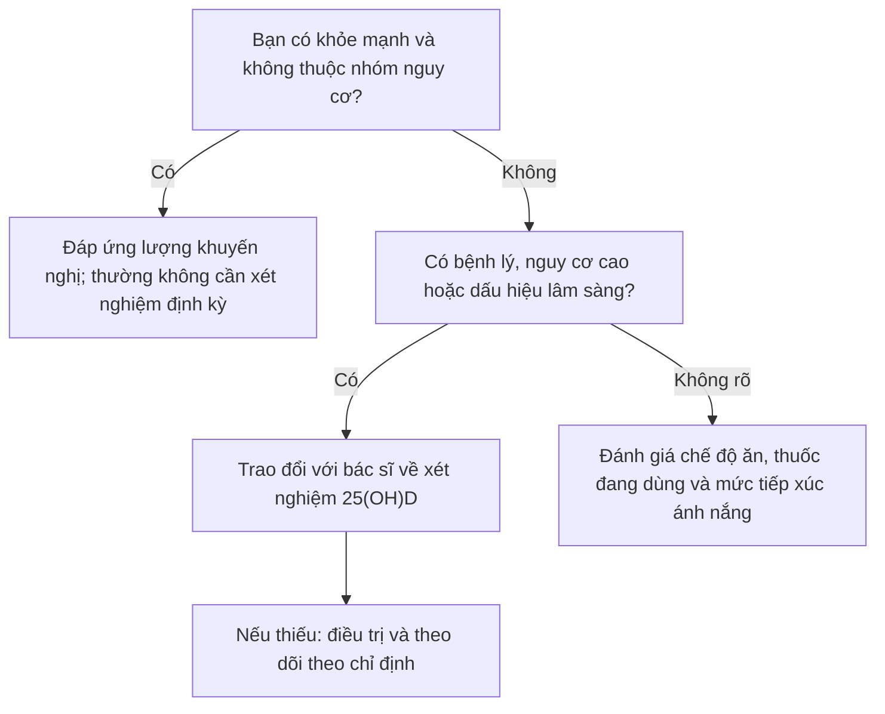

# 072 — Vitamin D

[](https://www.mdpi.com/2076-3417/14/11/4339?utm_source=chatgpt.com)
 
| Thuộc tính       | Nội dung                                                           |
| ---------------- | ------------------------------------------------------------------ |
| **Module**       | Module 08 — Micronutrients                                         |
| **Bài học**      | Vitamin D                                                          |
| **Thời lượng**   | 01:41                                                              |
| **Chủ đề chính** | Vai trò, nguồn cung cấp, nhu cầu và cách sử dụng vitamin D an toàn |

> **Thông điệp cốt lõi:** Vitamin D giúp cơ thể hấp thu canxi và phospho, duy trì xương, răng, cơ và chức năng thần kinh–miễn dịch. Cơ thể có thể tổng hợp vitamin D dưới tác động của tia UVB, nhưng không nên vì thế mà phơi nắng quá mức hoặc mặc định rằng mọi người đều cần bổ sung 1.000–2.000 IU mỗi ngày. ([ODS][1])

## Mục lục

1. [Mục tiêu bài học](#1-mục-tiêu-bài-học)
2. [Nội dung chính](#2-nội-dung-chính)
3. [Áp dụng thực tế](#3-áp-dụng-thực-tế)
4. [Lưu ý & lỗi thường gặp](#4-lưu-ý--lỗi-thường-gặp)
5. [Checklist thực hành](#5-checklist-thực-hành)
6. [Tóm tắt](#6-tóm-tắt)

---

## 1. Mục tiêu bài học

Sau bài học này, người học có thể:

* Giải thích vai trò của vitamin D đối với hấp thu canxi, phospho và sức khỏe xương.
* Mô tả quá trình tổng hợp và hoạt hóa vitamin D tại da, gan và thận.
* Nhận biết các nguồn vitamin D từ thực phẩm, ánh nắng và thực phẩm bổ sung.
* Nắm được lượng vitamin D khuyến nghị theo độ tuổi.
* Nhận diện nhóm có nguy cơ thiếu vitamin D.
* Phân biệt giữa **đáp ứng nhu cầu hằng ngày**, **bổ sung phòng ngừa** và **điều trị thiếu vitamin D**.
* Tránh phơi nắng quá mức và tự dùng vitamin D liều cao kéo dài.

---

## 2. Nội dung chính

### 2.1. Vitamin D là gì?

Vitamin D là một **vitamin tan trong chất béo**. Hai dạng phổ biến là:

| Dạng           | Tên khoa học    | Nguồn thường gặp                                             |
| -------------- | --------------- | ------------------------------------------------------------ |
| **Vitamin D₂** | Ergocalciferol  | Nấm được chiếu tia UV, thực phẩm hoặc viên bổ sung           |
| **Vitamin D₃** | Cholecalciferol | Da tổng hợp dưới tia UVB, thực phẩm động vật và viên bổ sung |

Cả D₂ và D₃ đều có thể làm tăng nồng độ vitamin D trong máu. Tuy nhiên, phần lớn bằng chứng cho thấy D₃ thường làm tăng và duy trì nồng độ **25-hydroxyvitamin D — 25(OH)D** lâu hơn D₂. ([ODS][1])

### 2.2. Vai trò của vitamin D

#### Hấp thu canxi và phospho

Vitamin D làm tăng khả năng hấp thu canxi và phospho tại ruột, giúp duy trì nồng độ khoáng chất cần thiết cho quá trình khoáng hóa xương. Khi thiếu vitamin D kéo dài, xương có thể trở nên yếu, mềm hoặc biến dạng. ([ODS][1])

#### Phát triển và duy trì hệ xương

Vitamin D cần thiết cho:

* Phát triển xương ở trẻ em.
* Tái cấu trúc và duy trì xương ở người trưởng thành.
* Phòng ngừa còi xương do thiếu vitamin D ở trẻ.
* Phòng ngừa nhuyễn xương do thiếu vitamin D ở người lớn.

Vitamin D phối hợp với canxi trong duy trì sức khỏe xương, nhưng uống thêm vitamin D không đồng nghĩa sẽ tự động ngăn được mọi trường hợp loãng xương hoặc gãy xương. ([ODS][1])

#### Cơ, thần kinh và miễn dịch

Vitamin D tham gia điều hòa chức năng thần kinh–cơ, miễn dịch, phản ứng viêm và một số quá trình liên quan đến tăng trưởng tế bào. Thiếu vitamin D nghiêm trọng có thể đi kèm yếu cơ hoặc đau cơ–xương. ([ODS][1])

> Không nên mô tả vitamin D như một chất “trực tiếp điều chỉnh nhịp tim”. Vai trò được chứng minh rõ nhất của vitamin D vẫn liên quan đến cân bằng canxi–phospho và sức khỏe cơ xương.

---

### 2.3. Cơ thể tạo và hoạt hóa vitamin D như thế nào?



Vitamin D được tạo ở da hoặc hấp thu từ thức ăn ban đầu chưa hoạt động hoàn toàn. Nó được chuyển hóa tại gan thành **25(OH)D**, sau đó chủ yếu tại thận thành **1,25(OH)₂D — calcitriol**, dạng có hoạt tính sinh học. ([ODS][1])

#### Ảnh minh họa: tổng hợp và hoạt hóa vitamin D


*Nguồn ảnh: OpenStax College, giấy phép CC BY 3.0.* ([Wikimedia Commons][2])

#### Ảnh khoa học: sinh tổng hợp vitamin D₂ và D₃


*Nguồn ảnh: Wikimedia Commons, CC0 — có thể sử dụng và chỉnh sửa.* ([Wikimedia Commons][3])

---

### 2.4. Xét nghiệm vitamin D

Xét nghiệm thường được sử dụng để đánh giá tình trạng vitamin D là:

```text
25-hydroxyvitamin D
25(OH)D
```

Không nên dùng nồng độ **1,25(OH)₂D** như xét nghiệm thông thường để đánh giá dự trữ vitamin D, vì chỉ số này được cơ thể điều hòa chặt và có thể chưa giảm cho đến khi tình trạng thiếu trở nên nghiêm trọng. ([ODS][1])

Theo ngưỡng tham khảo của Hội đồng Thực phẩm và Dinh dưỡng Hoa Kỳ:

|          25(OH)D trong máu | Diễn giải tham khảo                        |
| -------------------------: | ------------------------------------------ |
| **<12 ng/mL** — <30 nmol/L | Liên quan đến thiếu vitamin D              |
|       **12 đến <20 ng/mL** | Có nguy cơ không đủ                        |
|              **≥20 ng/mL** | Đủ đối với phần lớn người khỏe mạnh        |
|              **>50 ng/mL** | Có khả năng liên quan đến tác dụng bất lợi |

Các ngưỡng “tối ưu” cho mọi kết quả sức khỏe vẫn chưa được xác định thống nhất. Không nên tự cố nâng chỉ số lên thật cao. ([ODS][1])

---

### 2.5. Nguồn vitamin D từ thực phẩm

Rất ít thực phẩm tự nhiên chứa nhiều vitamin D. Cá béo và dầu gan cá là những nguồn tự nhiên nổi bật; lòng đỏ trứng và phô mai chỉ cung cấp lượng tương đối nhỏ. Nấm được chiếu tia UV có thể chứa đáng kể vitamin D₂. ([ODS][1])

| Thực phẩm                                  | Khẩu phần tham khảo |    Vitamin D ước tính |
| ------------------------------------------ | ------------------: | --------------------: |
| Dầu gan cá tuyết                           |         1 thìa canh |   Khoảng **1.360 IU** |
| Cá hồi đỏ nấu chín                         |         Khoảng 85 g |     Khoảng **570 IU** |
| Cá hồi vân nấu chín                        |         Khoảng 85 g |     Khoảng **645 IU** |
| Nấm trắng đã chiếu UV                      |               ½ cốc |     Khoảng **366 IU** |
| Sữa được tăng cường vitamin D              |               1 cốc |     Khoảng **120 IU** |
| Sữa đậu nành/hạnh nhân/yến mạch tăng cường |               1 cốc | Khoảng **100–144 IU** |
| Trứng                                      |               1 quả |      Khoảng **44 IU** |
| Cá ngừ đóng hộp                            |         Khoảng 85 g |      Khoảng **40 IU** |

Hàm lượng thực tế thay đổi theo loại thực phẩm, cách nuôi trồng, chế biến và việc sản phẩm có được tăng cường vitamin D hay không. Cần đọc nhãn dinh dưỡng thay vì mặc định mọi loại sữa hoặc ngũ cốc đều được bổ sung vitamin D. ([ODS][1])

> **Quy đổi:** 1 microgam vitamin D = **40 IU**.

---

### 2.6. Nhu cầu vitamin D hằng ngày

| Nhóm tuổi                     |  Lượng khuyến nghị |
| ----------------------------- | -----------------: |
| Trẻ 0–12 tháng                | **400 IU — 10 µg** |
| Trẻ em và người lớn 1–70 tuổi | **600 IU — 15 µg** |
| Người trên 70 tuổi            | **800 IU — 20 µg** |
| Phụ nữ mang thai              | **600 IU — 15 µg** |
| Phụ nữ cho con bú             | **600 IU — 15 µg** |

Các mức này được xây dựng với giả định lượng tiếp xúc ánh nắng tương đối hạn chế. Đây là mức tham khảo dành cho người khỏe mạnh, không phải phác đồ điều trị người đã được chẩn đoán thiếu vitamin D. ([ODS][1])

### Có phải 1.000–2.000 IU/ngày là “mức tối ưu”?

Không có đủ cơ sở để khẳng định **mọi người trưởng thành** đều cần 1.000–2.000 IU mỗi ngày.

Hướng dẫn năm 2024 của Endocrine Society cho biết người trưởng thành khỏe mạnh dưới 75 tuổi nhìn chung không được chứng minh là có lợi khi bổ sung vượt quá lượng khuyến nghị chỉ nhằm phòng bệnh. Những nhóm như người trên 75 tuổi, trẻ em, phụ nữ mang thai hoặc người có nguy cơ tiền đái tháo đường cao có thể có khuyến nghị riêng. ([Endocrine][4])

---

### 2.7. Ánh nắng và vitamin D

Tia **UVB** tác động lên da, chuyển 7-dehydrocholesterol thành tiền vitamin D₃, sau đó hình thành vitamin D₃. Khả năng tổng hợp thay đổi rất lớn theo:

* Thời gian trong ngày và mùa.
* Vĩ độ, độ cao và mây.
* Sắc tố da.
* Tuổi.
* Diện tích da tiếp xúc.
* Quần áo và hành vi chống nắng.
* Ô nhiễm không khí.

Tia UVB không xuyên qua kính hiệu quả, vì vậy ngồi cạnh cửa sổ có nắng không tạo vitamin D giống như tiếp xúc ngoài trời. Do có quá nhiều yếu tố ảnh hưởng, không thể đưa ra một số phút phơi nắng chính xác phù hợp cho tất cả mọi người. ([ODS][1])

#### Nguyên tắc an toàn

* Không để da bị đỏ hoặc cháy nắng.
* Không sử dụng giường tắm nắng để tăng vitamin D.
* Khi chỉ số UV từ **3 trở lên**, WHO khuyến nghị thực hiện biện pháp chống nắng.
* Không nên kéo dài thời gian phơi nắng chỉ vì đã thoa kem chống nắng.
* Người rất ít tiếp xúc ánh nắng nên ưu tiên đánh giá chế độ ăn và trao đổi về bổ sung đường uống thay vì cố phơi nắng lâu. ([World Health Organization][5])

---

### 2.8. Ai có nguy cơ thiếu vitamin D?

Nhóm nguy cơ cao hơn gồm:

* Trẻ bú mẹ hoàn toàn nhưng không được bổ sung phù hợp.
* Người cao tuổi.
* Người ít ra ngoài, nằm viện hoặc ở nhà trong thời gian dài.
* Người mặc trang phục che gần như toàn bộ da.
* Người có làn da sẫm màu.
* Người mắc bệnh gây kém hấp thu chất béo, chẳng hạn bệnh celiac hoặc Crohn.
* Người béo phì hoặc đã phẫu thuật nối tắt dạ dày.
* Người mắc một số bệnh gan, thận hoặc sử dụng thuốc ảnh hưởng đến chuyển hóa vitamin D. ([ODS][1])

Thiếu vitamin D nghiêm trọng có thể gây còi xương ở trẻ em và nhuyễn xương ở người lớn. Đau xương, yếu cơ hoặc đau cơ có thể xuất hiện, nhưng nhiều trường hợp không có triệu chứng rõ ràng. ([ODS][1])

---

## 3. Áp dụng thực tế

### 3.1. Chiến lược ba nguồn



Không nhất thiết phải chọn duy nhất một nguồn. Trong thực tế, vitamin D thường đến từ sự kết hợp giữa thực phẩm, hoạt động ngoài trời và viên bổ sung khi có chỉ định.

### 3.2. Ví dụ đưa vitamin D vào chế độ ăn

#### Phương án có thực phẩm động vật

* Bữa chính có cá hồi, cá thu hoặc cá trích 1–2 lần mỗi tuần.
* Trứng dùng như nguồn bổ sung nhỏ, không phải nguồn chính.
* Sữa hoặc sữa chua được tăng cường vitamin D nếu phù hợp.
* Kiểm tra nhãn để biết sản phẩm thực sự có vitamin D.

#### Phương án ăn thuần chay

* Sữa thực vật được tăng cường vitamin D.
* Nấm đã được chiếu tia UV.
* Ngũ cốc tăng cường vitamin D.
* Viên D₂ hoặc D₃ có nguồn gốc địa y khi cần.

### 3.3. Khi nào nên cân nhắc xét nghiệm?



Hướng dẫn hiện hành không khuyến nghị xét nghiệm 25(OH)D thường quy cho mọi người trưởng thành khỏe mạnh. Xét nghiệm phù hợp hơn khi có yếu tố nguy cơ, bệnh lý ảnh hưởng hấp thu hoặc chuyển hóa, bất thường canxi, bệnh xương hay chỉ định lâm sàng khác. ([Endocrine][6])

### 3.4. Khi sử dụng viên bổ sung

* Kiểm tra tổng vitamin D từ viên riêng lẻ, multivitamin và sản phẩm canxi.
* Phân biệt **liều duy trì** với **liều điều trị thiếu vitamin D**.
* Ưu tiên dùng đều đặn theo hướng dẫn thay vì tự uống liều rất cao theo tuần hoặc tháng.
* Người dùng thuốc thường xuyên nên hỏi bác sĩ hoặc dược sĩ về tương tác.
* Không tự áp dụng phác đồ điều trị của người khác.

---

## 4. Lưu ý & lỗi thường gặp

### Lỗi 1: “Ánh nắng luôn phải là nguồn vitamin D chính”

Ánh nắng có thể đóng góp đáng kể, nhưng không nên đánh đổi bằng cháy nắng hoặc tăng phơi nhiễm UV. Thực phẩm tăng cường và viên bổ sung là lựa chọn hợp lý cho người ít tiếp xúc ánh nắng hoặc có nguy cơ thiếu. WHO xác định tia UV vừa hỗ trợ sản xuất vitamin D, vừa là tác nhân gây ung thư khi tiếp xúc quá mức. ([World Health Organization][5])

### Lỗi 2: “Tất cả người trưởng thành nên dùng 1.000–2.000 IU”

Đây không phải khuyến nghị phổ quát. Người trưởng thành khỏe mạnh dưới 75 tuổi thường nên bắt đầu từ lượng khuyến nghị theo tuổi, trừ khi có chỉ định cá nhân hóa. ([Endocrine][6])

### Lỗi 3: “Ai cũng nên xét nghiệm vitamin D”

Xét nghiệm đại trà ở người không triệu chứng chưa được chứng minh là cải thiện kết quả sức khỏe. Endocrine Society khuyến nghị không xét nghiệm thường quy ở người trưởng thành khỏe mạnh không có chỉ định cụ thể. ([Endocrine][6])

### Lỗi 4: “Uống vitamin D chắc chắn làm hết mệt mỏi và tăng động lực”

Một người thực sự thiếu vitamin D có thể cảm thấy tốt hơn sau khi tình trạng thiếu được điều chỉnh. Tuy nhiên, mệt mỏi là triệu chứng không đặc hiệu; nó còn có thể liên quan đến thiếu ngủ, thiếu máu, bệnh tuyến giáp, trầm cảm, nhiễm trùng hoặc nhiều nguyên nhân khác.

Các thử nghiệm ở người không thiếu vitamin D không cho thấy bổ sung vitamin D có tác dụng chắc chắn đối với tâm trạng hoặc triệu chứng trầm cảm. Vì vậy, câu chuyện “uống vitamin D rồi tràn đầy năng lượng” không thể được xem là bằng chứng cho mọi người. ([ODS][1])

### Lỗi 5: “Vitamin D càng cao càng tốt”

Vitamin D tan trong chất béo và có thể tích lũy. Giới hạn dung nạp tối đa đối với đa số người từ 9 tuổi trở lên là **4.000 IU/ngày** từ tổng lượng thực phẩm và viên bổ sung; đây là giới hạn an toàn, không phải mục tiêu cần đạt mỗi ngày. Liều cao hơn có thể được sử dụng trong điều trị, nhưng phải có giám sát chuyên môn. ([ODS][1])

Dùng quá nhiều vitamin D có thể gây tăng canxi máu, với các biểu hiện như:

* Buồn nôn hoặc nôn.
* Yếu cơ.
* Khát và tiểu nhiều.
* Lú lẫn.
* Sỏi hoặc tổn thương thận.
* Rối loạn nhịp tim trong trường hợp nặng.

### Lỗi 6: Bỏ qua tương tác thuốc

Vitamin D có thể liên quan đến tương tác với một số thuốc như:

* Orlistat.
* Corticosteroid.
* Thuốc lợi tiểu thiazide.
* Một số statin.

Người đang dùng thuốc kéo dài, có bệnh thận, tăng canxi máu hoặc bệnh tuyến cận giáp không nên tự tăng liều vitamin D. ([ODS][1])

---

## 5. Checklist thực hành

* [ ] Tôi biết vitamin D chủ yếu hỗ trợ hấp thu canxi, phospho và sức khỏe cơ xương.
* [ ] Tôi không xem phơi nắng kéo dài là phương pháp bổ sung vitamin D an toàn.
* [ ] Tôi đã kiểm tra nhãn sữa, sữa thực vật hoặc ngũ cốc để biết có được tăng cường vitamin D hay không.
* [ ] Tôi hiểu rằng trứng và phô mai chỉ cung cấp lượng vitamin D tương đối nhỏ.
* [ ] Tôi biết lượng tham khảo cho người từ 1–70 tuổi là 600 IU/ngày và trên 70 tuổi là 800 IU/ngày.
* [ ] Tôi không mặc định rằng 1.000–2.000 IU là “liều tối ưu” cho mọi người.
* [ ] Tôi không xét nghiệm vitamin D chỉ vì mệt mỏi nếu chưa đánh giá các nguyên nhân khác.
* [ ] Tôi không tự dùng liều trên 4.000 IU/ngày kéo dài.
* [ ] Tôi kiểm tra tổng liều từ mọi viên bổ sung đang sử dụng.
* [ ] Tôi trao đổi với bác sĩ nếu có bệnh thận, bệnh gan, kém hấp thu, loãng xương hoặc đang dùng thuốc kéo dài.

---

## 6. Tóm tắt

Vitamin D là vitamin tan trong chất béo, có vai trò quan trọng trong hấp thu canxi và phospho, khoáng hóa xương, phát triển cơ cũng như chức năng thần kinh–miễn dịch.

Cơ thể có thể tổng hợp vitamin D₃ khi da tiếp xúc với tia UVB. Sau đó, vitamin D được chuyển hóa tại gan thành 25(OH)D và tại thận thành calcitriol có hoạt tính. Tuy nhiên, lượng vitamin D tạo ra từ ánh nắng thay đổi lớn và tiếp xúc UV quá mức làm tăng nguy cơ tổn thương da và ung thư da.

Nguồn thực phẩm tốt nhất gồm cá béo, dầu gan cá, nấm được chiếu UV và thực phẩm tăng cường vitamin D. Trứng, gan và phô mai chỉ cung cấp lượng nhỏ.

Đối với phần lớn người khỏe mạnh:

* Từ 1–70 tuổi: khoảng **600 IU/ngày**.
* Trên 70 tuổi: khoảng **800 IU/ngày**.
* Không nhất thiết phải xét nghiệm thường quy.
* Không nên mặc định dùng 1.000–2.000 IU mỗi ngày.
* Không nên tự dùng liều cao để chữa mệt mỏi hoặc tăng năng lượng.
* Nếu thuộc nhóm nguy cơ hoặc được chẩn đoán thiếu vitamin D, liều bổ sung cần được cá nhân hóa và theo dõi chuyên môn.

[1]: https://ods.od.nih.gov/factsheets/VitaminD-HealthProfessional/ "Vitamin D - Health Professional Fact Sheet"
[2]: https://commons.wikimedia.org/wiki/File%3A614_Synthesis_of_Vitamin_D.jpg "File:614 Synthesis of Vitamin D.jpg - Wikimedia Commons"
[3]: https://commons.wikimedia.org/wiki/File%3AVitamin_D_biosynthesis.svg "File:Vitamin D biosynthesis.svg - Wikimedia Commons"
[4]: https://www.endocrine.org/news-and-advocacy/news-room/2024/endocrine-society-recommends-healthy-adults-take-the-recommended-daily-allowance-of-vitamin-d?utm_source=chatgpt.com "Endocrine Society Guideline recommends healthy adults ..."
[5]: https://www.who.int/news-room/fact-sheets/detail/ultraviolet-radiation "Ultraviolet radiation"
[6]: https://www.endocrine.org/clinical-practice-guidelines/vitamin-d-for-prevention-of-disease "Vitamin D for the Prevention of Disease | Endocrine Society"

---

# Bài luyện tập

## Mục tiêu


## Đề bài


## Yêu cầu hoàn thành

- [ ] 
- [ ] 
- [ ] 

## Kết quả / lời giải


## Ghi chú
