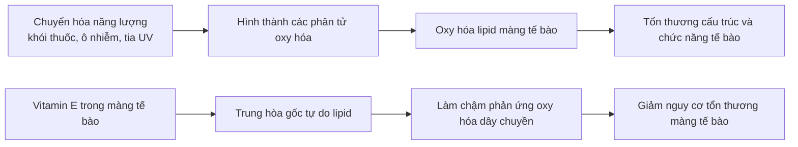
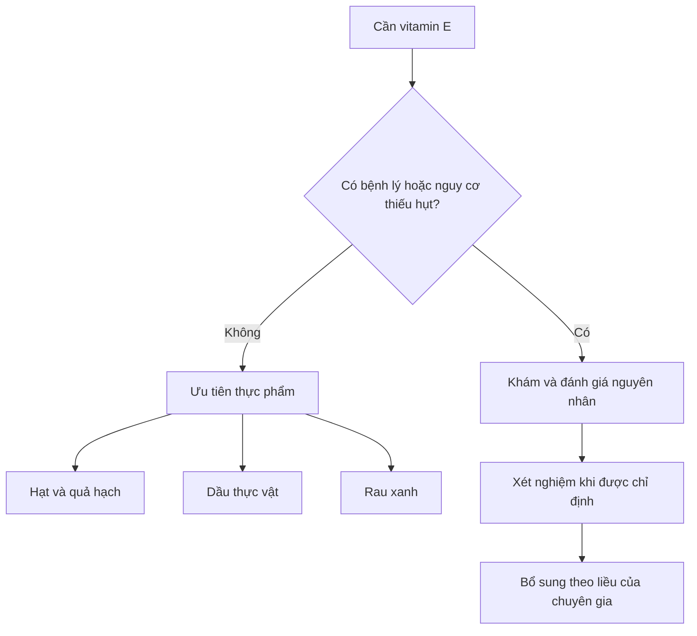

# 073 — Vitamin E

| Thuộc tính       | Nội dung                                                                |
| ---------------- | ----------------------------------------------------------------------- |
| **Module**       | Module 08 — Micronutrients                                              |
| **Bài học**      | Vitamin E                                                               |
| **Thời lượng**   | 01:13                                                                   |
| **Chủ đề chính** | Vitamin E — chức năng chống oxy hóa, nguồn thực phẩm và an toàn bổ sung |

> **Hiệu chỉnh khoa học quan trọng:** Vitamin E là chất chống oxy hóa thiết yếu, nhưng điều đó **không đồng nghĩa** viên bổ sung vitamin E có thể phòng ngừa ung thư, đái tháo đường hoặc bệnh tim. Các thử nghiệm ngẫu nhiên lớn không chứng minh lợi ích phòng bệnh nói chung; một số liều bổ sung cao còn làm tăng nguy cơ có hại. ([ODS][1])

## Mục lục

1. [Mục tiêu bài học](#1-mục-tiêu-bài-học)
2. [Nội dung chính](#2-nội-dung-chính)
3. [Áp dụng thực tế](#3-áp-dụng-thực-tế)
4. [Lưu ý & lỗi thường gặp](#4-lưu-ý--lỗi-thường-gặp)
5. [Checklist thực hành](#5-checklist-thực-hành)
6. [Tóm tắt](#6-tóm-tắt)

---

## 1. Mục tiêu bài học

Sau bài học này, người học có thể:

* Giải thích vitamin E là gì và vì sao đây là một **vitamin tan trong chất béo**.
* Mô tả vai trò của vitamin E trong việc bảo vệ màng tế bào khỏi quá trình oxy hóa.
* Nhận biết các nguồn vitamin E chính từ thực phẩm.
* Phân biệt lợi ích của vitamin E trong chế độ ăn với các tuyên bố chưa được chứng minh về viên bổ sung.
* Hiểu sự khác nhau giữa các hệ thống khuyến nghị lượng vitamin E.
* Nhận diện nguy cơ của việc tự bổ sung vitamin E liều cao.

---

## 2. Nội dung chính

### 2.1. Vitamin E là gì?

Vitamin E không phải một chất duy nhất mà là tên gọi của **tám hợp chất liên quan**, gồm bốn tocopherol và bốn tocotrienol. Trong dinh dưỡng người, **alpha-tocopherol** là dạng được cơ thể ưu tiên duy trì và thường được dùng để xác định nhu cầu vitamin E. Đây là vitamin tan trong chất béo nên quá trình hấp thu cần có chất béo trong đường tiêu hóa. ([ODS][1])

*Hình 1. Cấu trúc alpha-tocopherol — một dạng chính của vitamin E. Hình thuộc phạm vi công cộng trên Wikimedia Commons.* ([Wikimedia Commons][2])

### 2.2. Vai trò chống oxy hóa

Trong quá trình chuyển hóa thức ăn thành năng lượng, cơ thể tạo ra các phân tử phản ứng, trong đó có **gốc tự do**. Khói thuốc, ô nhiễm không khí và tia tử ngoại cũng có thể làm tăng sự tiếp xúc với các phân tử này. Khi lượng chất oxy hóa vượt quá khả năng kiểm soát của cơ thể, chúng có thể gây tổn thương lipid, protein và vật liệu di truyền của tế bào. ([ODS][1])

Vitamin E nằm trong các cấu trúc giàu lipid, đặc biệt là màng tế bào. Nó có thể trung hòa một số gốc tự do và làm gián đoạn phản ứng oxy hóa dây chuyền của lipid.

> Vitamin E chủ yếu giúp **ngăn chặn hoặc hạn chế sự lan truyền** của quá trình oxy hóa. Nói rằng vitamin E có thể “sửa chữa mọi tổn thương do gốc tự do” là diễn giải quá mức.

### 2.3. Các chức năng khác

Ngoài vai trò chống oxy hóa, vitamin E còn tham gia vào:

| Chức năng           | Ý nghĩa                                                                |
| ------------------- | ---------------------------------------------------------------------- |
| **Miễn dịch**       | Hỗ trợ hoạt động bình thường của hệ miễn dịch                          |
| **Tín hiệu tế bào** | Tham gia vào quá trình giao tiếp và điều hòa hoạt động giữa các tế bào |
| **Mạch máu**        | Góp phần duy trì chức năng bình thường của mạch máu                    |
| **Đông máu**        | Có ảnh hưởng đến quá trình kết tập tiểu cầu và đông máu                |
| **Thần kinh – cơ**  | Đủ vitamin E cần thiết cho chức năng bình thường của thần kinh và cơ   |

Các chức năng sinh lý trên là có thật, nhưng không thể suy luận rằng uống càng nhiều vitamin E thì hệ miễn dịch, tim hoặc mắt càng khỏe. ([ODS][1])

### 2.4. Nhu cầu vitamin E mỗi ngày

Con số **4 mg/ngày cho nam và 3 mg/ngày cho nữ** trong nội dung gốc tương ứng với hướng dẫn của NHS tại Vương quốc Anh. Trong khi đó, hệ thống khuyến nghị của Hoa Kỳ sử dụng mức **15 mg alpha-tocopherol/ngày cho người từ 14 tuổi trở lên** và **19 mg/ngày khi cho con bú**. ([nhs.uk][3])

| Hệ thống tham chiếu | Đối tượng                              | Lượng khuyến nghị |
| ------------------- | -------------------------------------- | ----------------: |
| **NHS Anh**         | Nam trưởng thành                       |         4 mg/ngày |
| **NHS Anh**         | Nữ trưởng thành                        |         3 mg/ngày |
| **NIH/Hoa Kỳ**      | Người từ 14 tuổi và người trưởng thành |        15 mg/ngày |
| **NIH/Hoa Kỳ**      | Phụ nữ mang thai                       |        15 mg/ngày |
| **NIH/Hoa Kỳ**      | Phụ nữ cho con bú                      |        19 mg/ngày |

Sự khác biệt không nhất thiết có nghĩa một bên “đúng” và bên kia “sai”. Các cơ quan có thể sử dụng tiêu chí, dạng hóa học và phương pháp xây dựng giá trị tham chiếu khác nhau. Khi theo dõi khẩu phần, cần xác định rõ đang dùng hệ quy chiếu nào.

### 2.5. Nguồn thực phẩm giàu vitamin E

Các nguồn chính gồm dầu thực vật, hạt, quả hạch, mầm lúa mì và một số loại rau xanh. NIH liệt kê dầu mầm lúa mì, dầu hướng dương, dầu rum, hạnh nhân và hạt hướng dương trong nhóm nguồn vitamin E nổi bật. Rau bina và bông cải xanh cung cấp lượng thấp hơn nhưng vẫn đóng góp vào tổng khẩu phần. ([ODS][1])

*Hình 2. Bơ và hạt hướng dương — thực phẩm có thể đóng góp vitamin E và chất béo vào bữa ăn. Ảnh của Suzette, giấy phép CC BY 2.0.* ([Wikimedia Commons][4])

| Nhóm thực phẩm           | Ví dụ                                        | Cách sử dụng                            |
| ------------------------ | -------------------------------------------- | --------------------------------------- |
| **Hạt**                  | Hạt hướng dương                              | Rắc lên salad, yến mạch hoặc sữa chua   |
| **Quả hạch**             | Hạnh nhân, hạt phỉ, đậu phộng                | Dùng như bữa phụ với khẩu phần vừa phải |
| **Dầu thực vật**         | Dầu mầm lúa mì, hướng dương, đậu nành, ô liu | Làm sốt salad hoặc chế biến món ăn      |
| **Rau xanh**             | Rau bina, bông cải xanh                      | Hấp hoặc xào cùng một lượng nhỏ dầu     |
| **Thực phẩm tăng cường** | Ngũ cốc ăn sáng, một số loại đồ uống         | Kiểm tra nhãn dinh dưỡng trước khi dùng |

Theo bảng thành phần của NIH, khoảng **28 g hạt hướng dương rang cung cấp 7,4 mg** và khoảng **28 g hạnh nhân rang cung cấp 6,8 mg vitamin E**. Hàm lượng thực tế có thể thay đổi theo giống, cách chế biến và sản phẩm. ([ODS][5])

### 2.6. Hấp thu và dự trữ

Do vitamin E tan trong chất béo:

* Nó được hấp thu hiệu quả hơn khi bữa ăn có một lượng chất béo.
* Cơ thể có thể dự trữ vitamin E, vì vậy không nhất thiết phải đạt chính xác một con số vào từng ngày.
* Nên đánh giá khẩu phần trung bình trong nhiều ngày hoặc nhiều tuần.
* “Tan trong chất béo” không có nghĩa thực phẩm chứa vitamin E tự động gây ngộ độc; nguy cơ chủ yếu liên quan đến **viên bổ sung liều cao kéo dài**. ([nhs.uk][3])

### 2.7. Thiếu vitamin E

Thiếu vitamin E rất hiếm ở người khỏe mạnh. Tình trạng này thường liên quan đến bệnh gây giảm tiêu hóa hoặc hấp thu chất béo, chẳng hạn một số bệnh đường ruột, xơ nang hoặc rối loạn di truyền hiếm gặp. ([ODS][1])

Thiếu kéo dài có thể gây:

* Yếu cơ.
* Giảm cảm giác ở tay hoặc chân.
* Khó kiểm soát vận động.
* Tổn thương thần kinh.
* Rối loạn thị giác.
* Suy giảm chức năng miễn dịch. ([ODS][1])

### 2.8. Vitamin E có phòng ngừa bệnh không?

#### Bệnh tim mạch và ung thư

Một số nghiên cứu quan sát từng ghi nhận người ăn nhiều thực phẩm chứa vitamin E có sức khỏe tim mạch tốt hơn. Tuy nhiên, điều này không chứng minh vitamin E là nguyên nhân duy nhất, bởi những người đó có thể đồng thời ăn uống cân bằng và duy trì lối sống lành mạnh hơn.

Trong **Women’s Health Study**, 39.876 phụ nữ khỏe mạnh được dùng 600 IU vitamin E tự nhiên cách ngày hoặc giả dược trong trung bình 10,1 năm. Nghiên cứu không ghi nhận lợi ích tổng thể đối với các biến cố tim mạch chính, tổng số ca ung thư hoặc tử vong chung. ([PubMed][6])

Trong thử nghiệm **SELECT** với 35.533 nam giới, nhóm dùng 400 IU vitamin E tổng hợp mỗi ngày có nguy cơ ung thư tuyến tiền liệt cao hơn khoảng **17%** so với nhóm giả dược. ([PubMed][7])

#### Đái tháo đường

Vitamin E có vai trò chống oxy hóa trong cơ thể, nhưng hiện không có cơ sở để khuyến nghị người khỏe mạnh dùng vitamin E liều cao nhằm phòng ngừa đái tháo đường.

#### Mắt

Vitamin E cần thiết cho chức năng tế bào bình thường, nhưng bằng chứng về việc chỉ dùng vitamin E để phòng đục thủy tinh thể hoặc thoái hóa điểm vàng chưa nhất quán. Một số công thức phối hợp dành cho người đã mắc thoái hóa điểm vàng có nguy cơ cao có thể được sử dụng dưới hướng dẫn chuyên môn; điều này không tương đương với việc mọi người nên tự uống vitamin E để “bổ mắt”. ([ODS][1])

### 2.9. Nguy cơ khi bổ sung quá mức

Vitamin E từ thực phẩm thông thường được coi là an toàn. Ngược lại, viên bổ sung liều cao có thể làm giảm khả năng đông máu, tăng nguy cơ chảy máu và có khả năng làm tăng nguy cơ xuất huyết não. ([ODS][1])

Các cơ quan sử dụng giới hạn trên khác nhau:

| Cơ quan          |    Giới hạn trên dành cho người trưởng thành |
| ---------------- | -------------------------------------------: |
| **NIH/Hoa Kỳ**   |                1.000 mg/ngày từ viên bổ sung |
| **EFSA/Châu Âu** | 300 mg alpha-tocopherol/ngày từ tất cả nguồn |

Đây là **mức trần an toàn**, không phải mục tiêu nên cố đạt. Tác dụng có hại có thể xuất hiện ở mức thấp hơn giới hạn trên trong một số nhóm hoặc với một số công thức bổ sung. ([ODS][1])

Cần hỏi bác sĩ hoặc dược sĩ trước khi bổ sung vitamin E liều cao khi:

* Đang dùng warfarin hoặc thuốc chống đông, chống kết tập tiểu cầu.
* Có rối loạn đông máu hoặc tiền sử xuất huyết.
* Chuẩn bị phẫu thuật hay thủ thuật xâm lấn.
* Đang hóa trị hoặc xạ trị.
* Mắc bệnh làm giảm hấp thu chất béo.
* Đang sử dụng nhiều loại viên bổ sung cùng lúc. ([ODS][1])

> Khẳng định “tất cả mọi người phải xét nghiệm máu trước khi dùng vitamin E” là quá tuyệt đối. Tuy nhiên, không nên tự dùng liều cao; bác sĩ có thể chỉ định xét nghiệm khi nghi ngờ thiếu hụt, kém hấp thu hoặc cần đánh giá một tình trạng cụ thể.

---

## 3. Áp dụng thực tế

### 3.1. Nguyên tắc xây dựng khẩu phần

### 3.2. Gợi ý một ngày ăn

| Bữa ăn       | Gợi ý                                               |
| ------------ | --------------------------------------------------- |
| **Bữa sáng** | Yến mạch, sữa chua và một ít hạnh nhân              |
| **Bữa trưa** | Salad rau bina, hạt hướng dương và sốt dầu thực vật |
| **Bữa phụ**  | Một phần nhỏ quả hạch không tẩm nhiều muối          |
| **Bữa tối**  | Cơm, cá hoặc đậu phụ, bông cải xanh và rau củ       |

Hạt và quả hạch giàu năng lượng, vì vậy nên dùng theo khẩu phần thay vì ăn không giới hạn. Mục tiêu là bổ sung chúng vào chế độ ăn cân bằng, không phải chỉ tăng riêng vitamin E.

### 3.3. Khi đọc nhãn viên bổ sung

Kiểm tra:

1. Hàm lượng được ghi bằng **mg hay IU**.
2. Dạng tự nhiên `d-alpha-tocopherol` hay tổng hợp `dl-alpha-tocopherol`.
3. Vitamin E có xuất hiện trong nhiều sản phẩm đang dùng hay không.
4. Liều mỗi viên có cao hơn nhiều so với nhu cầu hằng ngày không.

Theo NIH:

* 1 IU vitamin E tự nhiên ≈ **0,67 mg**.
* 1 IU vitamin E tổng hợp ≈ **0,45 mg**.

Vì vậy, không thể chuyển đổi IU sang mg mà không biết dạng vitamin E của sản phẩm. ([ODS][1])

---

## 4. Lưu ý & lỗi thường gặp

### Lỗi 1: “Chất chống oxy hóa càng nhiều càng tốt”

Cơ thể cần cân bằng oxy hóa – khử để thực hiện nhiều chức năng sinh học. Uống liều chống oxy hóa rất cao không nhất thiết mang lại lợi ích và có thể gây hại.

### Lỗi 2: “Vitamin E phòng được ung thư và bệnh tim”

Vitamin E là dưỡng chất thiết yếu, nhưng các thử nghiệm lớn không ủng hộ việc dùng viên vitamin E thường quy để phòng bệnh tim hoặc ung thư ở người khỏe mạnh. ([PubMed][6])

### Lỗi 3: “Tan trong chất béo nên chỉ cần ăn thật nhiều dầu”

Dầu thực vật có thể cung cấp vitamin E nhưng cũng giàu năng lượng. Nên phối hợp dầu với hạt, quả hạch, rau và các nhóm thực phẩm khác.

### Lỗi 4: “Không thể thừa vitamin E”

Cơ thể có cơ chế chuyển hóa và đào thải vitamin E, nhưng viên bổ sung liều cao vẫn có thể làm tăng nguy cơ chảy máu. ([ODS][1])

### Lỗi 5: “400 IU là liều thấp vì con số mg không lớn”

Trong SELECT, 400 IU vitamin E tổng hợp tương đương khoảng 180 mg — cao hơn nhiều lần nhu cầu dinh dưỡng thông thường và có liên quan đến nguy cơ ung thư tuyến tiền liệt tăng 17% ở nhóm nghiên cứu. ([ODS][1])

### Lỗi 6: “Có thể tự uống cùng thuốc chống đông”

Vitamin E liều cao có thể cộng hưởng với thuốc chống đông hoặc thuốc chống kết tập tiểu cầu và làm tăng nguy cơ chảy máu. ([ODS][1])

---

## 5. Checklist thực hành

* [ ] Tôi ưu tiên vitamin E từ thực phẩm thay vì tự dùng viên liều cao.
* [ ] Tôi thường xuyên ăn một lượng vừa phải hạt hoặc quả hạch.
* [ ] Tôi bổ sung rau xanh và dầu thực vật vào chế độ ăn cân bằng.
* [ ] Tôi hiểu rằng vitamin E hỗ trợ chống oxy hóa nhưng không phải thuốc phòng ung thư.
* [ ] Tôi kiểm tra đơn vị **mg** và **IU** trên nhãn sản phẩm.
* [ ] Tôi kiểm tra vitamin E có bị trùng giữa nhiều viên bổ sung hay không.
* [ ] Tôi không coi giới hạn trên là liều nên sử dụng hằng ngày.
* [ ] Tôi hỏi bác sĩ hoặc dược sĩ nếu đang dùng thuốc chống đông.
* [ ] Tôi trao đổi với bác sĩ điều trị trước khi dùng chất chống oxy hóa trong quá trình hóa trị hoặc xạ trị.
* [ ] Tôi không tự dùng vitamin E liều cao chỉ với mục tiêu “bổ tim”, “bổ mắt” hoặc “chống lão hóa”.

---

## 6. Tóm tắt

| Nội dung                | Điểm cần nhớ                                                                    |
| ----------------------- | ------------------------------------------------------------------------------- |
| **Đặc điểm**            | Vitamin tan trong chất béo; alpha-tocopherol là dạng tham chiếu chính           |
| **Vai trò nổi bật**     | Bảo vệ lipid màng tế bào khỏi phản ứng oxy hóa dây chuyền                       |
| **Chức năng khác**      | Hỗ trợ miễn dịch, tín hiệu tế bào và chức năng thần kinh – cơ                   |
| **Nguồn chính**         | Dầu thực vật, hạt hướng dương, hạnh nhân, hạt phỉ, rau xanh                     |
| **Thiếu hụt**           | Hiếm ở người khỏe mạnh; thường liên quan đến kém hấp thu chất béo               |
| **Phòng bệnh**          | Viên vitamin E không được chứng minh giúp phòng bệnh tim hoặc ung thư nói chung |
| **Rủi ro**              | Liều cao có thể tăng chảy máu và tương tác với thuốc                            |
| **Chiến lược tốt nhất** | Ưu tiên chế độ ăn đa dạng; chỉ bổ sung khi có chỉ định phù hợp                  |

> **Thông điệp cốt lõi:** Vitamin E cần thiết cho cơ thể, nhưng lợi ích dinh dưỡng không đồng nghĩa với việc viên bổ sung liều cao là tốt hơn. Hãy ưu tiên thực phẩm và xem việc bổ sung là một can thiệp cần cân nhắc, không phải thói quen mặc định.

[1]: https://ods.od.nih.gov/factsheets/VitaminE-Consumer/ "Vitamin E - Consumer"
[2]: https://commons.wikimedia.org/wiki/File%3AAlpha-Tocopherol.svg "File:Alpha-Tocopherol.svg - Wikimedia Commons"
[3]: https://www.nhs.uk/conditions/vitamins-and-minerals/vitamin-e/ "www.nhs.uk"
[4]: https://commons.wikimedia.org/wiki/File%3AAvocado_with_sunflower_seeds_%284791359308%29.jpg "File:Avocado with sunflower seeds (4791359308).jpg - Wikimedia Commons"
[5]: https://ods.od.nih.gov/factsheets/VitaminE-HealthProfessional/?uid=f2614a5120dbas16&utm_source=chatgpt.com "Vitamin E - Health Professional Fact Sheet"
[6]: https://pubmed.ncbi.nlm.nih.gov/15998891/ "Vitamin E in the primary prevention of cardiovascular disease and cancer: the Women's Health Study: a randomized controlled trial - PubMed"
[7]: https://pubmed.ncbi.nlm.nih.gov/19066370/?utm_source=chatgpt.com "Effect of selenium and vitamin E on risk of prostate cancer and other cancers: the Selenium and Vitamin E Cancer Prevention Trial (SELECT) - PubMed"
