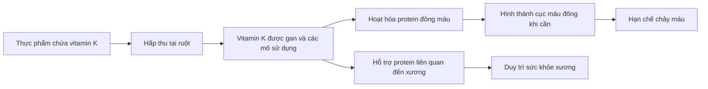

# 074 — Vitamin K

| Thuộc tính       | Nội dung                                                     |
| ---------------- | ------------------------------------------------------------ |
| **Module**       | Module 08 — Micronutrients                                   |
| **Bài học**      | Vitamin K                                                    |
| **Thời lượng**   | 01:18                                                        |
| **Chủ đề chính** | Vai trò, nguồn thực phẩm, nhu cầu và nguy cơ thiếu vitamin K |

> **Lưu ý hiệu đính:** Trong transcript có câu vitamin K “chuyển glucose thành glycogen để gan dự trữ”. Đây **không phải chức năng chính được các tài liệu dinh dưỡng chuẩn công nhận**. Vai trò được xác lập rõ nhất của vitamin K là hỗ trợ quá trình đông máu và duy trì sức khỏe xương. ([ODS][1])

## Mục lục

1. [Mục tiêu bài học](#1-mục-tiêu-bài-học)
2. [Nội dung chính](#2-nội-dung-chính)
3. [Áp dụng thực tế](#3-áp-dụng-thực-tế)
4. [Lưu ý & lỗi thường gặp](#4-lưu-ý--lỗi-thường-gặp)
5. [Checklist thực hành](#5-checklist-thực-hành)
6. [Tóm tắt](#6-tóm-tắt)

---

## 1. Mục tiêu bài học

Sau bài học này, người học có thể:

* Giải thích vai trò của vitamin K đối với quá trình đông máu và sức khỏe xương.
* Phân biệt khái quát vitamin K1 và vitamin K2.
* Xác định các nguồn thực phẩm giàu vitamin K.
* Ghi nhớ mức tiêu thụ khuyến nghị cho người trưởng thành.
* Nhận biết dấu hiệu và nhóm có nguy cơ thiếu vitamin K.
* Hiểu vì sao người dùng thuốc chống đông không nên tự ý thay đổi lượng vitamin K.
* Hiểu vai trò đặc biệt của vitamin K đối với trẻ sơ sinh.

---

## 2. Nội dung chính

### 2.1. Vitamin K là gì?

Vitamin K là một nhóm **vitamin tan trong chất béo**. Cơ thể cần vitamin K để:

1. Hỗ trợ hoạt hóa các protein tham gia quá trình đông máu.
2. Giúp máu đông đúng lúc khi cơ thể bị tổn thương.
3. Hỗ trợ các protein liên quan đến cấu trúc và chuyển hóa xương.

Do tan trong chất béo, vitamin K được hấp thu tốt hơn khi bữa ăn có một lượng chất béo phù hợp, chẳng hạn dầu thực vật, các loại hạt, quả bơ, cá hoặc trứng. ([ODS][1])

### 2.2. Các dạng vitamin K

| Dạng           | Tên gọi                                      | Nguồn phổ biến                                                                    |
| -------------- | -------------------------------------------- | --------------------------------------------------------------------------------- |
| **Vitamin K1** | Phylloquinone                                | Rau lá xanh, bông cải xanh, rau diếp và dầu thực vật                              |
| **Vitamin K2** | Menaquinone, gồm MK-4, MK-7 và các dạng khác | Một số thực phẩm lên men, phô mai, trứng, thịt và thực phẩm có nguồn gốc động vật |

Vi khuẩn trong đại tràng cũng có thể tạo ra một lượng vitamin K, nhưng không nên xem đây là nguồn thay thế hoàn toàn cho chế độ ăn. ([ODS][1])

*Hình: Cấu trúc của vitamin K1 và hai dạng vitamin K2. Nguồn Wikimedia Commons, giấy phép CC0.* ([Wikimedia Commons][2])

### 2.3. Vitamin K tham gia đông máu như thế nào?

Vitamin K không trực tiếp “làm máu đặc”. Nó giúp cơ thể **hoạt hóa các protein đông máu**, nhờ đó cơ thể có thể hình thành cục máu đông tại vị trí tổn thương và hạn chế mất máu.

Ở người thiếu vitamin K nghiêm trọng, máu mất nhiều thời gian hơn để đông, làm tăng nguy cơ bầm tím và chảy máu bất thường. ([ODS][1])

### 2.4. Vitamin K và sức khỏe xương

Vitamin K cần thiết cho hoạt động bình thường của một số protein liên quan đến xương. Tuy nhiên, cần phân biệt giữa:

* **Ăn đủ vitamin K:** là một phần của chế độ ăn hỗ trợ sức khỏe xương.
* **Uống vitamin K liều cao để điều trị loãng xương:** bằng chứng hiện nay chưa đủ nhất quán để khuyến nghị cho mọi người.

Một tổng quan hệ thống gồm 36 thử nghiệm ngẫu nhiên cho thấy vitamin K có thể tạo ra một số lợi ích trong một vài nhóm người, nhưng khi loại bỏ các nghiên cứu có nguy cơ sai lệch cao, hiệu quả đối với mật độ xương và gãy xương không còn rõ ràng. Vì vậy, vitamin K bổ sung không nên được xem là thuốc thay thế điều trị loãng xương. ([PubMed][3])

### 2.5. Nhu cầu vitamin K hằng ngày

Mức lượng đủ khuyến nghị — **Adequate Intake, AI** — dành cho người trưởng thành theo hướng dẫn của Hoa Kỳ:

| Đối tượng                                   | Lượng vitamin K mỗi ngày |
| ------------------------------------------- | -----------------------: |
| Nam từ 19 tuổi                              |         **120 mcg/ngày** |
| Nữ từ 19 tuổi                               |          **90 mcg/ngày** |
| Phụ nữ mang thai hoặc cho con bú từ 19 tuổi |          **90 mcg/ngày** |

`mcg` là microgam; `1.000 mcg = 1 mg`. Các quốc gia và tổ chức khác có thể sử dụng mức tham chiếu hơi khác nhau. ([ODS][1])

### 2.6. Nguồn thực phẩm

*Hình minh họa: cải xoăn. Nguồn Wikimedia Commons.* ([Wikimedia Commons][4])

#### Nguồn giàu vitamin K1

* Cải xoăn.
* Rau bina hoặc cải bó xôi.
* Cải rổ và các loại rau cải lá xanh.
* Bông cải xanh.
* Cải Brussels.
* Rau diếp.
* Bắp cải.
* Dầu đậu nành, dầu cải và một số dầu thực vật.

#### Nguồn có vitamin K2 hoặc lượng vitamin K thấp hơn

* Phô mai và một số thực phẩm lên men.
* Trứng.
* Thịt và nội tạng.
* Đậu nành.
* Một số loại trái cây như việt quất và quả sung.

Rau lá xanh thường là nguồn vitamin K nổi bật nhất trong chế độ ăn. Thịt, trứng và trái cây có thể đóng góp thêm nhưng nhìn chung không nên được xem là nguồn chính tương đương với rau xanh. ([ODS][1])

### 2.7. Thiếu vitamin K

Thiếu vitamin K tương đối hiếm ở người trưởng thành khỏe mạnh có chế độ ăn đa dạng. Khi thiếu nghiêm trọng, các biểu hiện có thể gồm:

* Dễ xuất hiện vết bầm.
* Chảy máu kéo dài sau vết thương.
* Chảy máu mũi hoặc chảy máu lợi bất thường.
* Máu trong phân hoặc nước tiểu.
* Xuất huyết nghiêm trọng trong trường hợp nặng.

Không nên tự kết luận thiếu vitamin K chỉ dựa trên một vết bầm. Chảy máu bất thường còn có thể liên quan đến bệnh gan, bệnh máu, thuốc đang sử dụng hoặc nhiều nguyên nhân khác và cần được đánh giá y tế. ([ODS][1])

### 2.8. Nhóm có nguy cơ cao

Các nhóm có nguy cơ thiếu vitamin K cao hơn gồm:

* Trẻ sơ sinh chưa được tiêm vitamin K sau khi sinh.
* Người mắc bệnh làm giảm hấp thu chất béo hoặc vitamin, như bệnh celiac, xơ nang, viêm loét đại tràng và hội chứng ruột ngắn.
* Người đã phẫu thuật giảm cân.
* Người dùng kháng sinh kéo dài.
* Người sử dụng thuốc làm giảm hấp thu chất béo, chẳng hạn orlistat.
* Người dùng thuốc gắn acid mật như cholestyramine hoặc colestipol. ([ODS][1])

### 2.9. Vì sao trẻ sơ sinh cần vitamin K?

Trẻ sơ sinh thường có lượng vitamin K dự trữ rất thấp vì:

1. Vitamin K không truyền qua nhau thai dễ dàng.
2. Hệ vi khuẩn đường ruột của trẻ chưa phát triển đầy đủ.
3. Sữa mẹ chỉ chứa một lượng nhỏ vitamin K.

Thiếu vitamin K ở trẻ có thể dẫn đến **xuất huyết do thiếu vitamin K ở trẻ sơ sinh — VKDB**, bao gồm xuất huyết đường tiêu hóa hoặc xuất huyết não. CDC cho biết khoảng một nửa số trẻ mắc VKDB bị chảy máu trong não và nhiều trường hợp không có dấu hiệu cảnh báo trước. Một mũi vitamin K tiêm bắp sau sinh là biện pháp phòng ngừa đáng tin cậy. ([CDC][5])

---

## 3. Áp dụng thực tế

### 3.1. Cách đáp ứng nhu cầu qua thực phẩm

Một người khỏe mạnh thường có thể đáp ứng đủ vitamin K bằng cách duy trì rau xanh đều đặn:

| Bữa ăn       | Gợi ý                                         |
| ------------ | --------------------------------------------- |
| **Bữa sáng** | Trứng với rau bina hoặc rau cải               |
| **Bữa trưa** | Cơm, thịt/cá và bông cải xanh                 |
| **Bữa tối**  | Canh rau cải, đậu phụ và món chính            |
| **Bữa phụ**  | Trái cây, sữa chua hoặc một lượng nhỏ phô mai |

Có thể thêm một lượng dầu ăn phù hợp vào rau trộn hoặc món rau để hỗ trợ hấp thu vitamin tan trong chất béo. Không cần uống viên bổ sung chỉ vì một ngày ăn ít rau; nên đánh giá thói quen ăn uống trong thời gian dài. ([MedlinePlus][6])

### 3.2. Người dùng warfarin

Vitamin K có thể làm thay đổi tác dụng của thuốc chống đông kháng vitamin K như **warfarin**. Tuy nhiên, điều này không đồng nghĩa với việc phải loại bỏ hoàn toàn rau xanh.

Nguyên tắc quan trọng là:

> **Duy trì lượng vitamin K tương đối ổn định từ ngày này sang ngày khác.**

Việc đột ngột tăng hoặc giảm mạnh lượng rau xanh hay tự sử dụng viên vitamin K có thể ảnh hưởng đến tác dụng của thuốc và chỉ số đông máu. Mọi thay đổi lớn về chế độ ăn hoặc thực phẩm bổ sung cần được trao đổi với bác sĩ hoặc dược sĩ. ([ODS][1])

### 3.3. Khi nào nên cân nhắc bổ sung?

Chỉ nên cân nhắc vitamin K bổ sung khi:

* Có chỉ định của bác sĩ.
* Có bằng chứng thiếu vitamin K hoặc rối loạn hấp thu.
* Đang sử dụng thuốc có thể ảnh hưởng đến vitamin K và đã được đánh giá.
* Trẻ sơ sinh được cung cấp vitamin K theo hướng dẫn chuyên môn.

Đối với đa số người trưởng thành khỏe mạnh, thực phẩm là nguồn ưu tiên. ([ODS][1])

---

## 4. Lưu ý & lỗi thường gặp

### Lỗi 1: Cho rằng vitamin K trực tiếp tạo ra cục máu đông

Vitamin K không tự biến thành cục máu đông. Nó hỗ trợ cơ thể hoạt hóa các protein cần cho quá trình đông máu.

### Lỗi 2: Cho rằng càng bổ sung nhiều càng tốt cho xương

Vitamin K cần thiết cho xương, nhưng chưa có đủ bằng chứng để khẳng định bổ sung liều cao giúp phòng hoặc điều trị loãng xương ở tất cả mọi người. ([PubMed][3])

### Lỗi 3: Người dùng warfarin loại bỏ hoàn toàn rau xanh

Mục tiêu thường là **ăn ổn định**, không phải kiêng tuyệt đối. Việc thay đổi đột ngột mới là vấn đề đáng lưu ý. ([ODS][1])

### Lỗi 4: Tự uống vitamin K khi thấy bầm tím

Bầm tím và chảy máu có nhiều nguyên nhân. Tự bổ sung có thể trì hoãn việc phát hiện một bệnh lý hoặc tương tác thuốc quan trọng.

### Lỗi 5: Xem vitamin K là chất chuyển glucose thành glycogen

Đây không phải chức năng dinh dưỡng chính của vitamin K và không nên dùng làm nội dung trọng tâm của bài học.

### Lỗi 6: Cho rằng trẻ bú mẹ đã nhận đủ vitamin K

Sữa mẹ có vitamin K nhưng thường không đủ để phòng VKDB. Mũi tiêm vitamin K sau sinh có vai trò phòng ngừa đặc biệt quan trọng. ([CDC][5])

---

## 5. Checklist thực hành

* [ ] Tôi biết vitamin K là vitamin tan trong chất béo.
* [ ] Tôi hiểu vai trò chính của vitamin K là hỗ trợ đông máu và sức khỏe xương.
* [ ] Tôi phân biệt được vitamin K1 và K2 ở mức cơ bản.
* [ ] Tôi ăn rau lá xanh thường xuyên.
* [ ] Tôi kết hợp rau với một lượng chất béo phù hợp.
* [ ] Tôi không tự ý sử dụng vitamin K liều cao.
* [ ] Nếu dùng warfarin, tôi giữ lượng vitamin K trong khẩu phần tương đối ổn định.
* [ ] Tôi trao đổi với bác sĩ trước khi thay đổi thực phẩm bổ sung hoặc chế độ ăn khi đang dùng thuốc chống đông.
* [ ] Tôi biết trẻ sơ sinh là nhóm có nguy cơ thiếu vitamin K đặc biệt.
* [ ] Tôi đi khám khi có tình trạng chảy máu hoặc bầm tím bất thường.

---

## 6. Tóm tắt

> **Vitamin K là vitamin tan trong chất béo, cần thiết cho quá trình đông máu bình thường và có vai trò đối với sức khỏe xương.**

* Vitamin K1 tập trung nhiều trong rau lá xanh.
* Vitamin K2 có trong một số thực phẩm lên men và thực phẩm động vật.
* Nhu cầu tham chiếu của người trưởng thành là khoảng **120 mcg/ngày đối với nam** và **90 mcg/ngày đối với nữ**.
* Thiếu vitamin K hiếm ở người trưởng thành khỏe mạnh nhưng có thể xảy ra ở người rối loạn hấp thu hoặc dùng một số thuốc.
* Dấu hiệu quan trọng nhất của thiếu nghiêm trọng là bầm tím và chảy máu bất thường.
* Người dùng warfarin cần giữ lượng vitamin K ổn định thay vì loại bỏ hoàn toàn.
* Trẻ sơ sinh cần được cung cấp vitamin K theo hướng dẫn y tế để phòng xuất huyết do thiếu vitamin K.
* Không nên tự dùng vitamin K bổ sung để điều trị loãng xương hoặc chảy máu khi chưa được đánh giá chuyên môn.

[1]: https://ods.od.nih.gov/factsheets/VitaminK-Consumer/ "Vitamin K - Consumer"
[2]: https://commons.wikimedia.org/wiki/File%3AVitamin_K_structures.svg?utm_source=chatgpt.com "File:Vitamin K structures.svg - Wikimedia Commons"
[3]: https://pubmed.ncbi.nlm.nih.gov/31076817/ "Effect of vitamin K on bone mineral density and fractures in adults: an updated systematic review and meta-analysis of randomised controlled trials - PubMed"
[4]: https://commons.wikimedia.org/wiki/File%3AKale-Bundle.jpg?utm_source=chatgpt.com "File:Kale-Bundle.jpg - Wikimedia Commons"
[5]: https://www.cdc.gov/vitamin-k-deficiency/fact-sheet/index.html "Protect Your Baby from Bleeds | Vitamin K Deficiency Bleeding | CDC"
[6]: https://medlineplus.gov/ency/article/002399.htm?utm_source=chatgpt.com "Vitamins: MedlinePlus Medical Encyclopedia"

---

# Bài luyện tập

## Mục tiêu

## Đề bài

## Yêu cầu hoàn thành

- [ ] 
- [ ] 
- [ ] 

## Kết quả / lời giải

## Ghi chú
