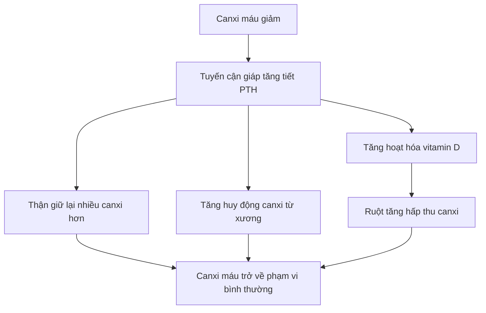
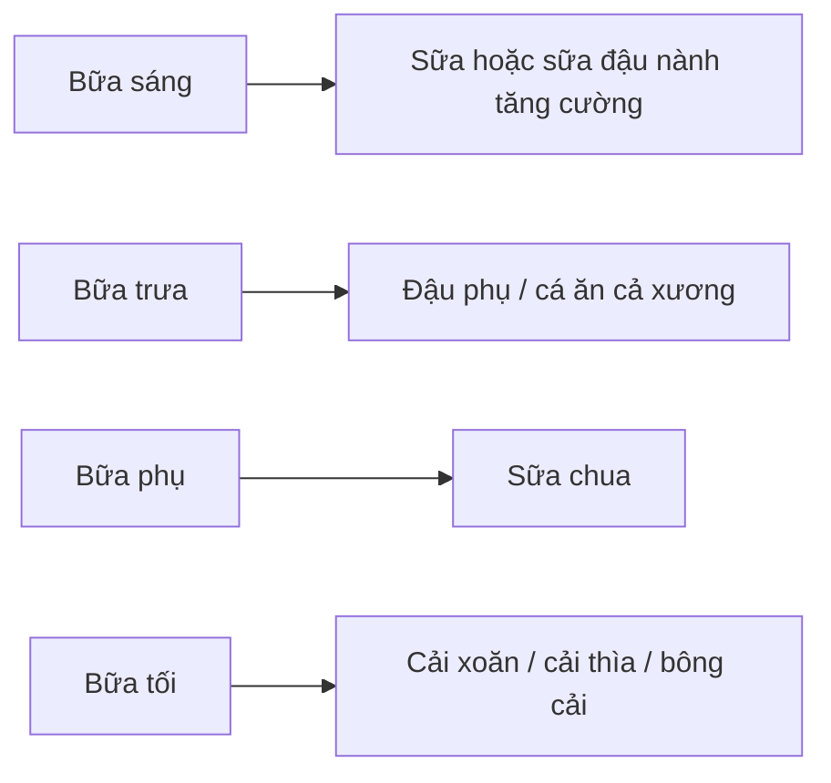
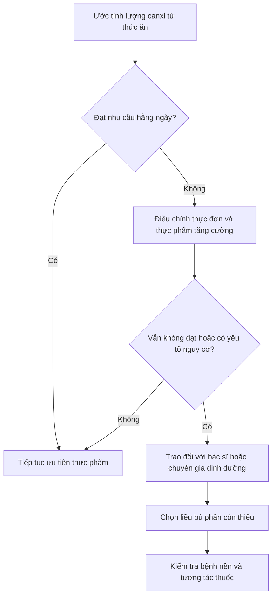

# 075 — Calcium

| Thuộc tính       | Nội dung                   |
| ---------------- | -------------------------- |
| **Module**       | Module 08 — Micronutrients |
| **Bài học**      | Calcium                    |
| **Thời lượng**   | 01:35                      |
| **Chủ đề chính** | Canxi                      |

> **Ý chính:** Canxi không chỉ tạo nên xương và răng. Khoáng chất này còn tham gia co cơ, truyền tín hiệu thần kinh, giao tiếp giữa các tế bào và điều hòa nhiều quá trình sinh học.

## Mục lục

1. [Mục tiêu bài học](#1-mục-tiêu-bài-học)
2. [Nội dung chính](#2-nội-dung-chính)
3. [Áp dụng thực tế](#3-áp-dụng-thực-tế)
4. [Lưu ý & lỗi thường gặp](#4-lưu-ý--lỗi-thường-gặp)
5. [Checklist thực hành](#5-checklist-thực-hành)
6. [Tóm tắt](#6-tóm-tắt)

---

## 1. Mục tiêu bài học

Sau bài học này, người học có thể:

* Giải thích vì sao canxi được xếp vào nhóm **khoáng chất đa lượng**.
* Nêu được những vai trò chính của canxi đối với xương, cơ, hệ thần kinh và tế bào.
* Xác định nhu cầu canxi cơ bản theo độ tuổi.
* Nhận biết các nguồn canxi từ sữa và thực phẩm không chứa sữa.
* Hiểu vì sao xét nghiệm canxi máu bình thường không nhất thiết chứng minh khẩu phần đang cung cấp đủ canxi.
* Nhận biết những nhóm có nguy cơ thiếu canxi.
* Đánh giá khi nào nên ưu tiên thực phẩm và khi nào cần cân nhắc sản phẩm bổ sung.

---

## 2. Nội dung chính

### 2.1. Canxi là gì?

Canxi là một **khoáng chất đa lượng — macromineral**, nghĩa là cơ thể cần nó với lượng tương đối lớn so với các khoáng chất vi lượng như sắt, kẽm hoặc selenium.

Canxi là khoáng chất có số lượng nhiều nhất trong cơ thể người trưởng thành. Phần lớn được lưu trữ trong xương và răng dưới dạng tinh thể hydroxyapatite; phần còn lại tồn tại trong máu và mô mềm để thực hiện những chức năng sinh lý thiết yếu. ([ODS][1])

### 2.2. Các vai trò chính của canxi

| Vai trò                       | Ý nghĩa                                                                    |
| ----------------------------- | -------------------------------------------------------------------------- |
| **Cấu trúc xương và răng**    | Tạo độ cứng, hỗ trợ duy trì khối lượng và sức mạnh của xương               |
| **Co cơ**                     | Tham gia cơ chế tương tác giữa actin và myosin, bao gồm cả cơ tim          |
| **Truyền tín hiệu thần kinh** | Hỗ trợ giải phóng chất dẫn truyền thần kinh tại các đầu tận cùng thần kinh |
| **Tín hiệu nội bào**          | Ion Ca²⁺ hoạt động như một chất truyền tin thứ hai trong tế bào            |
| **Giải phóng hormone**        | Tham gia quá trình bài tiết một số hormone và enzyme                       |
| **Đông máu**                  | Là yếu tố cần thiết trong nhiều bước của quá trình đông máu                |

Khoảng **98–99% lượng canxi của cơ thể nằm trong xương và răng**. Tuy nhiên, xương không phải một cấu trúc bất biến mà liên tục trải qua quá trình phân hủy và tái tạo. ([ODS][1])

*Nguồn ảnh: [Wikimedia Commons — Sources of Calcium](https://commons.wikimedia.org/wiki/File:Sources_of_Calcium.png).*

---

### 2.3. Cơ thể duy trì canxi máu như thế nào?

Nồng độ canxi trong máu được kiểm soát rất chặt. Khi lượng canxi từ khẩu phần không đủ, cơ thể có thể tăng huy động canxi từ xương để duy trì hoạt động của cơ, tim và hệ thần kinh.

Vitamin D hỗ trợ quá trình hấp thu chủ động canxi tại ruột. Khi khẩu phần canxi thấp kéo dài, việc duy trì canxi máu có thể xảy ra với “cái giá” là giảm lượng khoáng chất lưu trữ trong xương. ([ODS][1])

*Nguồn ảnh nghiên cứu: [Wikimedia Commons — Calcium and phosphorus homeostasis](https://commons.wikimedia.org/wiki/File:Calcium_and_phosphorus_homeostasis.jpg).*

---

### 2.4. Nhu cầu canxi mỗi ngày

Mức khuyến nghị dưới đây là **tổng lượng canxi từ thực phẩm, đồ uống và sản phẩm bổ sung**, không phải lượng cần uống riêng dưới dạng viên.

| Nhóm tuổi                             | Nhu cầu khuyến nghị |
| ------------------------------------- | ------------------: |
| 1–3 tuổi                              |         700 mg/ngày |
| 4–8 tuổi                              |       1.000 mg/ngày |
| 9–18 tuổi                             |       1.300 mg/ngày |
| 19–50 tuổi                            |       1.000 mg/ngày |
| Nam 51–70 tuổi                        |       1.000 mg/ngày |
| Nữ 51–70 tuổi                         |       1.200 mg/ngày |
| Trên 70 tuổi                          |       1.200 mg/ngày |
| Mang thai hoặc cho con bú, 19–50 tuổi |       1.000 mg/ngày |

Thanh thiếu niên cần nhiều canxi hơn do đây là giai đoạn tích lũy khối lượng xương nhanh. Phụ nữ sau 50 tuổi có nhu cầu cao hơn vì suy giảm estrogen làm tăng tốc độ mất xương. ([ODS][1])

#### Giới hạn trên có thể dung nạp

| Độ tuổi            | Tổng lượng tối đa mỗi ngày |
| ------------------ | -------------------------: |
| 19–50 tuổi         |                   2.500 mg |
| Từ 51 tuổi trở lên |                   2.000 mg |

Đây không phải mục tiêu cần đạt mà là ngưỡng không nên thường xuyên vượt qua. Việc dùng canxi liều cao không có chỉ định có thể gây táo bón, khó chịu tiêu hóa, tăng canxi niệu và có khả năng làm tăng nguy cơ sỏi thận ở một số người. ([ODS][1])

---

### 2.5. Nguồn canxi trong thực phẩm

#### Các nguồn phổ biến

| Thực phẩm                        |  Khẩu phần tham khảo | Canxi ước tính |
| -------------------------------- | -------------------: | -------------: |
| Sữa chua ít béo, không đường     |     Khoảng 225–245 g |         415 mg |
| Nước cam tăng cường canxi        |                1 cốc |         349 mg |
| Cá mòi đóng hộp ăn cả xương      |          Khoảng 85 g |         325 mg |
| Sữa không béo                    | 1 cốc, khoảng 240 ml |         299 mg |
| Sữa đậu nành tăng cường canxi    |                1 cốc |         299 mg |
| Sữa nguyên kem                   |                1 cốc |         276 mg |
| Đậu phụ làm bằng calcium sulfate |                ½ cốc |         253 mg |
| Cá hồi đóng hộp ăn cả xương      |          Khoảng 85 g |         181 mg |
| Phô mai cottage 1% béo           |                1 cốc |         138 mg |
| Đậu nành nấu chín                |                ½ cốc |         131 mg |
| Cải xoăn nấu chín                |                1 cốc |          94 mg |
| Hạt chia                         |          1 thìa canh |          76 mg |
| Cải thìa sống                    |                1 cốc |          74 mg |

Các con số có thể thay đổi theo thương hiệu, quy trình sản xuất và kích thước khẩu phần. Đặc biệt, chỉ một số loại đậu phụ được làm đông bằng muối canxi mới chứa lượng canxi cao; cần đọc nhãn dinh dưỡng. ([ODS][1])

#### Whey protein có phải luôn giàu canxi?

Không nhất thiết. Lượng canxi của whey protein thay đổi đáng kể tùy loại whey, công thức và thương hiệu. Không nên mặc định rằng một khẩu phần whey có thể thay thế sữa hoặc sữa chua; hãy kiểm tra dòng **Calcium** trên nhãn dinh dưỡng.

---

### 2.6. Không phải loại rau xanh nào cũng cung cấp canxi giống nhau

Lượng canxi ghi trên bảng thành phần thực phẩm chưa phản ánh hoàn toàn lượng cơ thể hấp thu được.

* Canxi trong sữa và phần lớn thực phẩm tăng cường thường có tỷ lệ hấp thu khoảng 30%.
* Oxalate và phytate trong thực vật có thể liên kết với canxi, làm giảm hấp thu.
* Rau bina chứa canxi nhưng đồng thời giàu oxalate nên tỷ lệ hấp thu canxi thấp.
* Cải xoăn, bông cải xanh, cải thìa và một số rau họ cải có lượng oxalate thấp hơn, do đó canxi thường dễ hấp thu hơn. ([ODS][1])

> **Kết luận:** “Rau lá xanh đậm” là mô tả quá rộng. Cần xem xét cả **lượng canxi trong khẩu phần** và **khả năng hấp thu**.

---

### 2.7. Vì sao thiếu canxi khó phát hiện sớm?

Canxi huyết thanh được kiểm soát rất chặt. Khi ăn thiếu canxi trong thời gian ngắn, cơ thể có thể huy động khoáng chất từ xương để giữ nồng độ canxi máu trong phạm vi cần thiết.

Do đó:

* Canxi máu bình thường không đồng nghĩa chắc chắn với khẩu phần đủ canxi.
* Thiếu canxi mạn tính có thể diễn ra âm thầm.
* Hậu quả thường biểu hiện qua giảm mật độ xương, loãng xương hoặc tăng nguy cơ gãy xương.
* Đo mật độ khoáng xương bằng **DXA/DEXA** có thể cung cấp thông tin về tình trạng xương tích lũy theo thời gian. ([ODS][1])

Cần phân biệt:

| Tình trạng                | Đặc điểm                                                                                                                           |
| ------------------------- | ---------------------------------------------------------------------------------------------------------------------------------- |
| **Khẩu phần thiếu canxi** | Ăn không đạt nhu cầu trong thời gian dài nhưng canxi máu vẫn có thể bình thường                                                    |
| **Hạ canxi máu**          | Nồng độ canxi trong máu thấp; có thể liên quan đến thiếu vitamin D, thiếu magnesium, rối loạn tuyến cận giáp, bệnh nặng hoặc thuốc |
| **Mật độ xương thấp**     | Xương mất khoáng chất tích lũy theo thời gian; cần đánh giá toàn diện                                                              |

Hạ canxi máu thật sự có thể gây tê quanh miệng, cảm giác kiến bò ở bàn tay và bàn chân, co thắt cơ; trường hợp nặng có thể gây co giật hoặc rối loạn nhịp tim và cần được đánh giá y tế. ([ODS][1])

---

### 2.8. Những nhóm có nguy cơ không nhận đủ canxi

#### 1. Người tránh sản phẩm từ sữa

Bao gồm:

* Người ăn thuần chay.
* Người dị ứng đạm sữa.
* Người không sử dụng sữa vì lý do cá nhân.
* Người bất dung nạp lactose nhưng chưa thay thế bằng thực phẩm phù hợp.

Người bất dung nạp lactose không nhất thiết phải loại bỏ hoàn toàn mọi sản phẩm từ sữa. Sữa không lactose hoặc giảm lactose thường vẫn cung cấp lượng canxi tương đương sữa thông thường. ([ODS][1])

#### 2. Phụ nữ sau mãn kinh

Suy giảm estrogen làm giảm hấp thu canxi, tăng mất canxi qua nước tiểu và tăng tốc độ phân hủy xương. ([ODS][1])

#### 3. Người có bệnh làm giảm hấp thu

Ví dụ:

* Bệnh celiac.
* Bệnh viêm ruột.
* Một số tình trạng sau phẫu thuật đường tiêu hóa.
* Các rối loạn tiêu hóa hoặc hấp thu kéo dài.

#### 4. Người dùng corticosteroid dài hạn

Corticosteroid có thể ảnh hưởng bất lợi đến quá trình tạo xương và chuyển hóa canxi; nhóm này nên được bác sĩ đánh giá nguy cơ loãng xương. ([Mayo Clinic][2])

#### 5. Người có chế độ ăn hạn chế năng lượng kéo dài

Ở vận động viên, vấn đề không chỉ là canxi. Thiếu năng lượng tương đối, rối loạn kinh nguyệt, thiếu vitamin D hoặc giảm tải cơ học lên xương cũng có thể làm tăng nguy cơ tổn thương xương do quá tải.

---

### 2.9. Canxi đối với người tập luyện và vận động viên

Canxi cần thiết cho co cơ và sức khỏe xương, nhưng điều này không có nghĩa mọi vận động viên đều cần uống viên canxi.

Một số vận động viên sức bền có thể mất canxi qua mồ hôi trong những buổi tập dài. Các nghiên cứu cho thấy bữa ăn giàu canxi trước buổi tập có thể làm giảm một số biến đổi cấp tính của chuyển hóa xương, nhưng bằng chứng hiện vẫn chưa đủ để đưa ra khuyến nghị bổ sung chung cho mọi vận động viên. ([PubMed Central (PMC)][3])

Ưu tiên thực tế:

1. Đảm bảo tổng năng lượng khẩu phần.
2. Đạt nhu cầu canxi hằng ngày.
3. Đảm bảo vitamin D phù hợp.
4. Thực hiện bài tập chịu trọng lượng hoặc kháng lực.
5. Đánh giá thêm khi có gãy xương do quá tải, đau xương tái diễn hoặc rối loạn kinh nguyệt.

> Không nên tự động uống canxi chỉ vì “ra nhiều mồ hôi”.

---

## 3. Áp dụng thực tế

### 3.1. Công thức xây dựng khẩu phần đủ canxi

Với người trưởng thành cần khoảng 1.000 mg/ngày, có thể chọn **3–4 điểm neo canxi** trong ngày:

#### Ví dụ có sản phẩm từ sữa

| Thực phẩm                        |     Canxi tham khảo |
| -------------------------------- | ------------------: |
| 1 cốc sữa không béo              |              299 mg |
| 1 hộp lớn sữa chua ít béo        |              415 mg |
| ½ cốc đậu phụ kết tủa bằng canxi |              253 mg |
| 1 cốc cải xoăn nấu chín          |               94 mg |
| **Tổng cộng**                    | **Khoảng 1.061 mg** |

#### Ví dụ không dùng sữa động vật

| Thực phẩm                        |     Canxi tham khảo |
| -------------------------------- | ------------------: |
| 1 cốc sữa đậu nành tăng cường    |              299 mg |
| ½ cốc đậu phụ kết tủa bằng canxi |              253 mg |
| 85 g cá mòi ăn cả xương*         |              325 mg |
| 1 cốc cải thìa                   |               74 mg |
| 1 thìa hạt chia                  |               76 mg |
| **Tổng cộng**                    | **Khoảng 1.027 mg** |

*Người ăn thuần chay có thể thay cá bằng thêm thực phẩm tăng cường canxi hoặc một khẩu phần đậu phụ phù hợp. Giá trị được tính từ bảng thực phẩm của NIH và chỉ mang tính minh họa. ([ODS][1])

---

### 3.2. Cách đọc nhãn sản phẩm

Khi mua sữa thực vật, sữa chua, whey hoặc đậu phụ, hãy kiểm tra:

* Lượng **calcium/canxi trên mỗi khẩu phần**.
* Kích thước một khẩu phần.
* Số khẩu phần thực tế đã dùng.
* Sản phẩm có được **tăng cường canxi** hay không.
* Đậu phụ có dùng **calcium sulfate** làm chất đông hay không.
* Sữa thực vật có cần lắc đều trước khi uống hay không, vì khoáng chất có thể lắng xuống đáy.

---

### 3.3. Khi nào nên cân nhắc viên bổ sung?

Nguyên tắc là **bổ sung phần còn thiếu**, không mặc định uống thêm 1.000 mg ngoài khẩu phần.

#### Hai dạng phổ biến

| Dạng                  | Đặc điểm                                                                                        |
| --------------------- | ----------------------------------------------------------------------------------------------- |
| **Calcium carbonate** | Chứa nhiều canxi nguyên tố hơn; nên dùng cùng bữa ăn; dễ gây đầy bụng hoặc táo bón hơn          |
| **Calcium citrate**   | Ít phụ thuộc acid dạ dày; có thể phù hợp hơn với người lớn tuổi hoặc người dùng thuốc giảm acid |

Khả năng hấp thu từ viên bổ sung thường tốt hơn khi mỗi lần dùng không quá khoảng **500 mg canxi nguyên tố**. Nếu cần liều lớn hơn, nên chia thành nhiều lần theo hướng dẫn chuyên môn. ([ODS][1])

---

## 4. Lưu ý & lỗi thường gặp

### Lỗi 1: “Canxi máu bình thường nghĩa là tôi không thiếu canxi”

**Không chính xác.** Cơ thể có thể rút canxi từ xương để giữ canxi máu ổn định. ([ODS][1])

### Lỗi 2: “Càng uống nhiều canxi thì xương càng chắc”

Không đúng. Canxi vượt quá nhu cầu không tự động tạo thêm xương và có thể gây tác dụng phụ. Sức khỏe xương còn phụ thuộc vào vitamin D, protein, hormone, tổng năng lượng, vận động chịu trọng lượng, giấc ngủ, thuốc và bệnh nền.

### Lỗi 3: “Mọi loại rau xanh đậm đều hấp thu canxi tốt”

Sai. Rau bina có lượng canxi trên bảng thành phần nhưng oxalate làm giảm đáng kể lượng hấp thu; cải xoăn và cải thìa thường là lựa chọn tốt hơn. ([ODS][1])

### Lỗi 4: “Người ăn chay chắc chắn thiếu canxi”

Cần phân biệt:

* Người ăn chay có sử dụng sữa có thể nhận đủ canxi.
* Người ăn thuần chay cần chủ động dùng sữa thực vật tăng cường, đậu phụ kết tủa bằng canxi, rau ít oxalate và các nguồn phù hợp khác.
* Nguy cơ phụ thuộc vào cấu trúc khẩu phần, không chỉ tên của chế độ ăn.

### Lỗi 5: “Bất dung nạp lactose thì không thể dùng sản phẩm từ sữa”

Nhiều người vẫn dung nạp được một lượng nhỏ sữa chua, phô mai cứng hoặc sản phẩm không lactose. Sữa không lactose vẫn giữ lại canxi. ([ODS][1])

### Lỗi 6: “Whey protein chắc chắn cung cấp nhiều canxi”

Không phải mọi sản phẩm whey đều giống nhau. Phải kiểm tra nhãn thay vì ước lượng dựa vào tên sản phẩm.

### Lỗi 7: Uống canxi cùng mọi loại thuốc

Canxi bổ sung có thể làm giảm hấp thu của một số thuốc, bao gồm:

* Levothyroxine.
* Một số kháng sinh nhóm quinolone.
* Dolutegravir.
* Một số thuốc và khoáng chất khác.

Ví dụ, calcium carbonate nên cách levothyroxine ít nhất bốn giờ theo hướng dẫn được NIH trích dẫn. Người đang dùng thuốc thường xuyên nên kiểm tra với bác sĩ hoặc dược sĩ trước khi bổ sung. ([ODS][1])

### Lỗi 8: Tự bổ sung khi có tiền sử sỏi thận hoặc tăng canxi máu

Người có sỏi thận, bệnh thận, cường cận giáp, tăng canxi máu hoặc đang mang thai cần được đánh giá riêng, thay vì tự chọn liều từ thông tin phổ thông.

---

## 5. Checklist thực hành

* [ ] Xác định nhu cầu canxi theo tuổi và giới tính.
* [ ] Ước tính lượng canxi trong 2–3 ngày ăn điển hình.
* [ ] Có ít nhất 3 nguồn canxi đáng kể mỗi ngày.
* [ ] Kiểm tra nhãn của sữa thực vật, whey và đậu phụ.
* [ ] Không tính rau bina là nguồn canxi hấp thu cao.
* [ ] Đảm bảo khẩu phần cung cấp đủ vitamin D và tổng năng lượng.
* [ ] Ưu tiên thực phẩm trước viên bổ sung.
* [ ] Chỉ bổ sung lượng còn thiếu thay vì uống một liều cố định.
* [ ] Không dùng quá 500 mg canxi nguyên tố trong một lần nếu không có chỉ định khác.
* [ ] Kiểm tra tương tác nếu đang dùng thuốc tuyến giáp, kháng sinh hoặc thuốc điều trị dài hạn.
* [ ] Trao đổi với bác sĩ khi có gãy xương do quá tải, bệnh tiêu hóa, bệnh thận, sỏi thận hoặc dấu hiệu hạ canxi máu.

---

## 6. Tóm tắt

1. Canxi là khoáng chất nhiều nhất trong cơ thể và phần lớn nằm trong xương, răng.
2. Ngoài chức năng cấu trúc, canxi còn tham gia co cơ, dẫn truyền thần kinh, tín hiệu tế bào, tiết hormone và đông máu.
3. Người trưởng thành thường cần khoảng **1.000–1.200 mg/ngày**, tùy tuổi và giới tính.
4. Nguồn tốt gồm sữa, sữa chua, cá ăn cả xương, đậu phụ kết tủa bằng canxi, thực phẩm tăng cường, cải xoăn và cải thìa.
5. Canxi trong thực vật có mức hấp thu khác nhau; rau bina không phải nguồn hấp thu tốt do chứa nhiều oxalate.
6. Cơ thể có thể rút canxi từ xương để duy trì canxi máu, vì vậy thiếu canxi mạn tính thường khó nhận biết sớm.
7. Người tránh sữa, người ăn thuần chay, phụ nữ sau mãn kinh và người bị giảm hấp thu cần chú ý hơn.
8. Vận động viên cần đảm bảo đủ canxi nhưng không nên mặc định phải uống viên bổ sung.
9. Ưu tiên thực phẩm; chỉ dùng sản phẩm bổ sung để bù phần thiếu và sau khi xem xét bệnh nền, thuốc đang dùng và tổng lượng canxi.

> **Thông điệp cuối:** Canxi tốt cho xương không có nghĩa “càng nhiều càng tốt”. Mục tiêu là đạt đủ nhu cầu một cách đều đặn, kết hợp vitamin D, vận động và chế độ ăn cân bằng.

[1]: https://ods.od.nih.gov/factsheets/Calcium-HealthProfessional/ "Calcium - Health Professional Fact Sheet"
[2]: https://www.mayoclinic.org/healthy-lifestyle/nutrition-and-healthy-eating/in-depth/calcium-supplements/art-20047097 "Calcium and calcium supplements: Achieving the right balance - Mayo Clinic"
[3]: https://pmc.ncbi.nlm.nih.gov/articles/PMC6901417/?utm_source=chatgpt.com "Nutrition and Athlete Bone Health - PMC - NIH"
