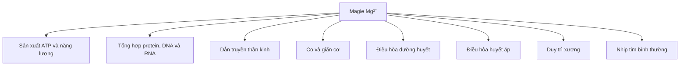
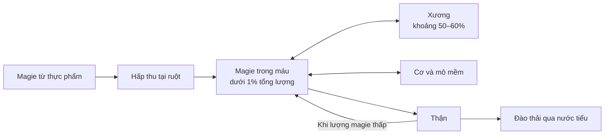

# 076 — Magnesium
[](https://www.eufic.org/en/vitamins-and-minerals/article/magnesium-foods-functions-how-much-do-you-need-more?utm_source=chatgpt.com)

| Thuộc tính          | Nội dung                   |
| ------------------- | -------------------------- |
| **Module**          | Module 08 — Micronutrients |
| **Bài học**         | Magnesium                  |
| **Thời lượng**      | 01:20                      |
| **Chủ đề chính**    | Magie                      |
| **Ký hiệu hóa học** | Mg                         |
| **Nhóm chất**       | Khoáng chất thiết yếu      |

## Mục lục

1. [Mục tiêu bài học](#1-mục-tiêu-bài-học)
2. [Nội dung chính](#2-nội-dung-chính)
3. [Áp dụng thực tế](#3-áp-dụng-thực-tế)
4. [Lưu ý & lỗi thường gặp](#4-lưu-ý--lỗi-thường-gặp)
5. [Checklist thực hành](#5-checklist-thực-hành)
6. [Tóm tắt](#6-tóm-tắt)

---

## 1. Mục tiêu bài học

Sau bài học này, người học có thể:

* Giải thích vai trò của magie đối với sản xuất năng lượng, tổng hợp protein, hoạt động thần kinh và co cơ.
* Hiểu vì sao xét nghiệm magie huyết thanh không phải lúc nào cũng phản ánh chính xác tổng lượng magie trong cơ thể.
* Xác định nhu cầu magie hằng ngày theo tuổi và giới tính.
* Nhận biết những thực phẩm giàu magie.
* Phân biệt **ăn ít magie trong thời gian ngắn** với **thiếu magie lâm sàng**.
* Nhận biết nhóm có nguy cơ thiếu magie và các dấu hiệu cần được đánh giá y tế.
* Sử dụng thực phẩm để tăng magie trước khi tự ý dùng viên bổ sung.

---

## 2. Nội dung chính

### 2.1. Magie là gì?

Magie là một khoáng chất thiết yếu và là đồng yếu tố của hơn 300 hệ enzyme. Nó tham gia vào:

* Tổng hợp protein.
* Sản xuất và sử dụng năng lượng.
* Chuyển hóa glucose.
* Điều hòa huyết áp.
* Dẫn truyền xung thần kinh.
* Co và giãn cơ.
* Duy trì nhịp tim bình thường.
* Tổng hợp DNA, RNA và glutathione.
* Hình thành và duy trì cấu trúc xương.

Magie còn hỗ trợ quá trình vận chuyển ion canxi và kali qua màng tế bào. Vì vậy, sự mất cân bằng magie có thể ảnh hưởng đồng thời đến hệ thần kinh, cơ và tim mạch. ([ODS][1])

### Sơ đồ vai trò của magie



---

### 2.2. Magie được lưu trữ ở đâu?

Cơ thể người trưởng thành chứa khoảng **25 g magie**:

* Khoảng **50–60% nằm trong xương**.
* Phần lớn lượng còn lại nằm trong cơ và các mô mềm.
* Dưới **1% tổng lượng magie** hiện diện trong huyết thanh.

Xương không chỉ là cấu trúc nâng đỡ cơ thể mà còn đóng vai trò như một kho dự trữ có thể trao đổi magie với máu và các mô. ([ODS][1])



> **Cơ chế bảo tồn:** khi lượng magie đưa vào thấp, thận có thể giảm lượng magie thải qua nước tiểu. Vì vậy, việc ăn ít magie trong vài ngày thường không gây triệu chứng thiếu hụt rõ rệt ngay lập tức. ([ODS][2])

---

### 2.3. Vì sao khó đánh giá tình trạng magie?

Xét nghiệm magie huyết thanh là phương pháp thường được sử dụng nhất, nhưng nó có hạn chế:

* Phần lớn magie nằm trong tế bào hoặc xương.
* Magie huyết thanh chỉ đại diện cho một phần rất nhỏ tổng lượng magie.
* Cơ thể kiểm soát nồng độ trong máu tương đối chặt chẽ.
* Một kết quả huyết thanh trong giới hạn tham chiếu không phải lúc nào cũng loại trừ tình trạng dự trữ magie thấp.

Không có một xét nghiệm đơn lẻ nào được coi là hoàn hảo để đánh giá toàn bộ tình trạng magie. Bác sĩ có thể cần kết hợp xét nghiệm máu, nước tiểu, chế độ ăn, thuốc đang sử dụng và biểu hiện lâm sàng. ([ODS][1])

### Ảnh nghiên cứu: cân bằng magie trong cơ thể


*Nguồn: [Workinger, Doyle & Bortz — Challenges in the Diagnosis of Magnesium Status](https://www.mdpi.com/2072-6643/10/9/1202). Sơ đồ cho thấy magie được hấp thu từ ruột, phân bố chủ yếu vào xương, cơ và mô mềm, đồng thời được điều hòa bởi thận.* ([PubMed Central (PMC)][3])

---

### 2.4. Nhu cầu magie hằng ngày

Các giá trị dưới đây là **RDA của Hoa Kỳ**, tức lượng trung bình mỗi ngày đủ đáp ứng nhu cầu của gần như toàn bộ người khỏe mạnh.

| Nhóm                           |   Nhu cầu magie |
| ------------------------------ | --------------: |
| Nam 14–18 tuổi                 |     410 mg/ngày |
| Nữ 14–18 tuổi                  |     360 mg/ngày |
| Nam 19–30 tuổi                 |     400 mg/ngày |
| Nữ 19–30 tuổi                  |     310 mg/ngày |
| Nam từ 31 tuổi                 |     420 mg/ngày |
| Nữ từ 31 tuổi                  |     320 mg/ngày |
| Phụ nữ mang thai 19–30 tuổi    |     350 mg/ngày |
| Phụ nữ mang thai 31–50 tuổi    |     360 mg/ngày |
| Phụ nữ cho con bú trưởng thành | 310–320 mg/ngày |

Như vậy, con số **420 mg cho nam và 310 mg cho nữ** trong nội dung bài học chỉ đúng với một số nhóm tuổi. Nhu cầu thực tế thay đổi theo tuổi, giới và tình trạng mang thai hoặc cho con bú. ([ODS][1])

> **Lưu ý:** lượng khuyến nghị bao gồm magie từ thực phẩm, đồ uống, thực phẩm tăng cường và viên bổ sung.

---

### 2.5. Thực phẩm giàu magie

Nguồn magie tập trung nhất thường đến từ:

1. Hạt và quả hạch.
2. Các loại đậu.
3. Rau lá xanh.
4. Ngũ cốc nguyên hạt.
5. Một số thực phẩm tăng cường vi chất.

Cá, thịt, sữa và sữa chua cũng cung cấp magie, nhưng hàm lượng trong một khẩu phần thường thấp hơn hạt, quả hạch, đậu và rau lá xanh. ([ODS][1])

### Ảnh minh họa nguồn thực phẩm


*Ảnh của USDA Agricultural Research Service, phạm vi công cộng. Hình gồm hạt bí, ngũ cốc, các loại đậu, rau bina, sữa chua và cá.* ([Wikimedia Commons][4])

### Hàm lượng trong một số khẩu phần phổ biến

| Thực phẩm             |    Khẩu phần | Magie ước tính |
| --------------------- | -----------: | -------------: |
| Hạt bí rang           |         28 g |         156 mg |
| Hạt chia              |         28 g |         111 mg |
| Hạnh nhân rang        |         28 g |          80 mg |
| Rau bina luộc         |        ½ cốc |          78 mg |
| Hạt điều rang         |         28 g |          74 mg |
| Đậu phộng rang        |        ¼ cốc |          63 mg |
| Sữa đậu nành          |        1 cốc |          61 mg |
| Đậu đen nấu chín      |        ½ cốc |          60 mg |
| Đậu nành non edamame  |        ½ cốc |          50 mg |
| Bơ đậu phộng          |  2 thìa canh |          49 mg |
| Khoai tây nướng cả vỏ | Khoảng 100 g |          43 mg |
| Gạo lứt chín          |        ½ cốc |          42 mg |
| Sữa chua ít béo       | Khoảng 225 g |          42 mg |
| Yến mạch ăn liền      |        1 gói |          36 mg |
| Chuối                 |    1 quả vừa |          32 mg |
| Sữa                   |        1 cốc |          27 mg |
| Cá hồi chín           |  Khoảng 85 g |          26 mg |
| Bánh mì nguyên cám    |        1 lát |          23 mg |
| Bơ quả                |        ½ cốc |          22 mg |
| Ức gà                 |  Khoảng 85 g |          22 mg |

Hàm lượng có thể thay đổi theo giống thực phẩm, cách chế biến, kích thước khẩu phần và nhãn sản phẩm. ([ODS][1])

> **Mẹo ghi nhớ:** thực phẩm giàu chất xơ như hạt, đậu và ngũ cốc nguyên hạt thường cũng cung cấp magie. Việc tinh chế ngũ cốc và loại bỏ cám, mầm có thể làm giảm đáng kể lượng magie. ([ODS][1])

---

### 2.6. Thiếu magie

#### Ăn ít magie chưa chắc đồng nghĩa với thiếu magie lâm sàng

Nhiều người có lượng magie từ chế độ ăn thấp hơn mức khuyến nghị, nhưng điều đó không có nghĩa tất cả đều bị hạ magie máu hoặc có triệu chứng. Ở người khỏe mạnh, thận có thể hạn chế đào thải để bảo tồn magie trong ngắn hạn.

Thiếu hụt rõ rệt thường xuất hiện khi lượng đưa vào thấp kéo dài hoặc đi kèm yếu tố làm giảm hấp thu, tăng mất magie hay rối loạn điều hòa. Tại Hoa Kỳ, một số nhóm như người cao tuổi và thanh thiếu niên có tỷ lệ lượng magie ăn vào thấp tương đối cao. ([ODS][2])

#### Nhóm có nguy cơ cao hơn

* Người mắc bệnh đường tiêu hóa như Crohn hoặc celiac.
* Người bị tiêu chảy kéo dài hoặc kém hấp thu.
* Người mắc đái tháo đường type 2, đặc biệt khi đường huyết kiểm soát kém.
* Người sử dụng rượu kéo dài.
* Người cao tuổi.
* Người dùng thuốc lợi tiểu.
* Người dùng thuốc ức chế bơm proton điều trị trào ngược trong thời gian dài.
* Người có chế độ ăn rất hạn chế hoặc suy dinh dưỡng. ([ODS][2])

#### Dấu hiệu ban đầu có thể gặp

* Chán ăn.
* Buồn nôn hoặc nôn.
* Mệt mỏi.
* Yếu cơ.

#### Thiếu hụt nặng

* Tê hoặc cảm giác châm chích.
* Co thắt hoặc chuột rút cơ.
* Run cơ.
* Co giật.
* Thay đổi hành vi hoặc tính cách.
* Rối loạn nhịp tim.
* Có thể đi kèm hạ kali hoặc hạ canxi.

Các biểu hiện như mệt mỏi, chuột rút hoặc khó ngủ **không đặc hiệu cho thiếu magie** và có thể do nhiều nguyên nhân khác. Không nên chỉ dựa vào một triệu chứng để tự chẩn đoán. ([ODS][2])

---

## 3. Áp dụng thực tế

### 3.1. Ưu tiên thực phẩm trước viên bổ sung

Một cách đơn giản để tăng magie là thêm vào mỗi ngày:

* Một khẩu phần hạt hoặc quả hạch.
* Một phần đậu hoặc đậu phụ.
* Một phần rau lá xanh.
* Ngũ cốc nguyên hạt thay cho ngũ cốc tinh chế.

### Ví dụ một ngày cung cấp khoảng 400 mg magie

| Bữa ăn        | Thực phẩm           |    Magie ước tính |
| ------------- | ------------------- | ----------------: |
| Sáng          | Yến mạch ăn liền    |             36 mg |
| Sáng          | 1 quả chuối         |             32 mg |
| Sáng          | 2 thìa bơ đậu phộng |             49 mg |
| Trưa          | ½ cốc gạo lứt       |             42 mg |
| Trưa          | ½ cốc đậu đen       |             60 mg |
| Trưa hoặc tối | ½ cốc rau bina chín |             78 mg |
| Bữa phụ       | 28 g hạnh nhân      |             80 mg |
| Tổng          |                     | **Khoảng 377 mg** |

Có thể thêm một cốc sữa, sữa đậu nành hoặc sữa chua để đưa tổng lượng lên khoảng 400–440 mg. Đây chỉ là ví dụ; không nhất thiết phải ăn đúng các món trên mỗi ngày. ([ODS][1])

---

### 3.2. Cách cải thiện khẩu phần kiểu Việt Nam

| Thói quen hiện tại        | Điều chỉnh để tăng magie                                  |
| ------------------------- | --------------------------------------------------------- |
| Chỉ ăn cơm trắng          | Kết hợp cơm trắng với gạo lứt hoặc ngũ cốc nguyên hạt     |
| Ít ăn rau                 | Thêm rau bina, rau dền, rau muống và các loại rau lá xanh |
| Ít dùng đậu               | Thêm đậu đen, đậu xanh, đậu nành hoặc đậu phụ             |
| Bữa phụ nhiều bánh ngọt   | Thay một phần bằng hạnh nhân, hạt điều hoặc hạt bí        |
| Bỏ vỏ khoai               | Khi phù hợp, ăn khoai nướng hoặc luộc cả vỏ đã rửa sạch   |
| Bữa sáng nghèo dinh dưỡng | Thêm yến mạch, sữa chua, chuối hoặc bơ đậu phộng          |

Hàm lượng chính xác của các thực phẩm địa phương cần được kiểm tra trong cơ sở dữ liệu dinh dưỡng hoặc trên nhãn sản phẩm; bảng trên là định hướng lựa chọn nhóm thực phẩm.

---

### 3.3. Khi nào nên trao đổi với bác sĩ?

Nên được đánh giá y tế khi:

* Có chuột rút, yếu cơ hoặc mệt mỏi kéo dài không rõ nguyên nhân.
* Xuất hiện đánh trống ngực, nhịp tim bất thường, co giật hoặc lú lẫn.
* Bị tiêu chảy kéo dài hoặc bệnh gây kém hấp thu.
* Đang sử dụng thuốc lợi tiểu hay thuốc ức chế bơm proton lâu dài.
* Có bệnh thận.
* Xét nghiệm cho thấy hạ kali hoặc hạ canxi khó điều chỉnh.
* Muốn dùng magie để điều trị đau nửa đầu hoặc một bệnh lý cụ thể.

> Các dấu hiệu như rối loạn nhịp tim, co giật, khó thở, ngất hoặc thay đổi ý thức cần được đánh giá y tế khẩn cấp.

---

## 4. Lưu ý & lỗi thường gặp

### Lỗi 1: Cho rằng xét nghiệm máu bình thường chắc chắn không thiếu magie

Magie huyết thanh là xét nghiệm hữu ích nhưng không phản ánh hoàn toàn lượng magie trong xương và tế bào. Việc diễn giải phải đặt trong bối cảnh triệu chứng, bệnh lý, chế độ ăn và thuốc đang dùng. ([ODS][1])

---

### Lỗi 2: Cho rằng mọi trường hợp chuột rút đều do thiếu magie

Chuột rút có thể liên quan đến:

* Vận động quá mức.
* Mất nước.
* Tổn thương cơ hoặc thần kinh.
* Rối loạn tuần hoàn.
* Thuốc đang sử dụng.
* Mất cân bằng điện giải khác.

Bổ sung magie không phải lúc nào cũng giải quyết được nguyên nhân.

---

### Lỗi 3: Tự dùng liều cao vì nghĩ khoáng chất luôn an toàn

Magie có trong thực phẩm thường an toàn ở người khỏe mạnh. Tuy nhiên, magie từ **viên bổ sung và thuốc** có thể gây:

* Tiêu chảy.
* Buồn nôn.
* Đau hoặc co thắt bụng.

Liều cực cao có thể gây tụt huyết áp, yếu cơ, khó thở, rối loạn nhịp tim và ngừng tim, đặc biệt ở người suy giảm chức năng thận. ([ODS][2])

#### Giới hạn từ viên bổ sung

Đối với người trưởng thành, giới hạn dung nạp trên của magie từ **viên bổ sung và thuốc** là **350 mg/ngày**, trừ khi được chuyên gia y tế chỉ định.

Giới hạn này:

* Không bao gồm magie tự nhiên trong thức ăn và đồ uống.
* Không có nghĩa tổng khẩu phần chỉ được chứa tối đa 350 mg.
* Không phải là liều điều trị dành cho mọi người. ([ODS][2])

---

### Lỗi 4: Không đọc lượng “magie nguyên tố”

Nhãn thực phẩm bổ sung thường ghi lượng **elemental magnesium – magie nguyên tố**, không phải tổng khối lượng của toàn bộ hợp chất magie.

Ví dụ, “500 mg magnesium citrate” không nhất thiết cung cấp 500 mg magie nguyên tố. Cần đọc phần **Supplement Facts** hoặc thông tin dinh dưỡng trên nhãn. ([ODS][1])

---

### Lỗi 5: Cho rằng mọi dạng magie đều hấp thu giống nhau

Một số dạng hòa tan tốt như:

* Magnesium citrate.
* Magnesium chloride.
* Magnesium lactate.
* Magnesium aspartate.

Nhìn chung có khả năng hấp thu tốt hơn magnesium oxide và magnesium sulfate. Tuy nhiên, dạng phù hợp còn phụ thuộc mục đích sử dụng, khả năng dung nạp đường tiêu hóa, bệnh nền và thuốc đang dùng. ([ODS][1])

---

### Lỗi 6: Uống magie cùng lúc với mọi loại thuốc

Magie có thể ảnh hưởng đến sự hấp thu của:

* Một số kháng sinh.
* Bisphosphonate điều trị loãng xương.

Thuốc lợi tiểu có thể làm tăng hoặc giảm mất magie. Thuốc ức chế bơm proton dùng lâu dài cũng có thể làm giảm magie máu. Cần hỏi bác sĩ hoặc dược sĩ về khoảng cách giữa các lần uống. ([ODS][2])

---

## 5. Checklist thực hành

### Đánh giá khẩu phần

* [ ] Tôi ăn rau lá xanh hầu hết các ngày trong tuần.
* [ ] Tôi ăn đậu, đậu phụ hoặc sản phẩm từ đậu thường xuyên.
* [ ] Tôi sử dụng hạt hoặc quả hạch với khẩu phần phù hợp.
* [ ] Tôi chọn ngũ cốc nguyên hạt thay cho toàn bộ ngũ cốc tinh chế.
* [ ] Tôi hiểu rằng cá, thịt và sữa có magie nhưng thường không phải nguồn tập trung nhất.
* [ ] Tôi kiểm tra khẩu phần và hàm lượng magie trên nhãn khi cần.

### An toàn bổ sung

* [ ] Tôi ưu tiên tăng magie bằng thực phẩm.
* [ ] Tôi không tự chẩn đoán thiếu magie chỉ dựa trên chuột rút hoặc mệt mỏi.
* [ ] Tôi kiểm tra lượng **magie nguyên tố** trên nhãn.
* [ ] Tôi không tự sử dụng liều cao kéo dài.
* [ ] Tôi hỏi bác sĩ nếu có bệnh thận, bệnh tiêu hóa hoặc đái tháo đường.
* [ ] Tôi kiểm tra tương tác nếu đang dùng kháng sinh, thuốc lợi tiểu, thuốc trào ngược hoặc thuốc loãng xương.
* [ ] Tôi đi khám khi có đánh trống ngực, yếu cơ nghiêm trọng, co giật hoặc thay đổi ý thức.

---

## 6. Tóm tắt

> **Magie là khoáng chất thiết yếu tham gia vào hàng trăm phản ứng sinh học, đặc biệt là sản xuất năng lượng, tổng hợp protein, dẫn truyền thần kinh, co cơ, điều hòa đường huyết, huyết áp và duy trì xương.**

* Khoảng **50–60% magie của cơ thể nằm trong xương**.
* Dưới **1% nằm trong huyết thanh**, nên xét nghiệm máu không phản ánh hoàn toàn lượng dự trữ.
* Nhu cầu ở người trưởng thành khoảng **310–420 mg/ngày**, tùy giới tính và độ tuổi.
* Nguồn tốt gồm **hạt, quả hạch, đậu, rau lá xanh và ngũ cốc nguyên hạt**.
* Ăn ít magie ngắn hạn thường không gây triệu chứng ngay vì thận có thể giảm đào thải.
* Thiếu kéo dài hoặc thiếu nặng có thể gây mệt mỏi, yếu cơ, tê, co thắt, co giật, thay đổi hành vi và rối loạn nhịp tim.
* Nên ưu tiên thực phẩm và không tự ý dùng viên bổ sung liều cao, đặc biệt khi có bệnh thận hoặc đang sử dụng thuốc.

### Công thức ghi nhớ

```text
Hạt + đậu + rau xanh + ngũ cốc nguyên hạt
                  ↓
            Tăng magie tự nhiên
                  ↓
   Hỗ trợ năng lượng – thần kinh – cơ – xương
```

[1]: https://ods.od.nih.gov/factsheets/Magnesium-HealthProfessional/ "Magnesium - Health Professional Fact Sheet"
[2]: https://ods.od.nih.gov/factsheets/Magnesium-Consumer/ "Magnesium - Consumer"
[3]: https://pmc.ncbi.nlm.nih.gov/articles/PMC6163803/ "Challenges in the Diagnosis of Magnesium Status - PMC"
[4]: https://commons.wikimedia.org/wiki/File%3AFoodSourcesOfMagnesium.jpg "File:FoodSourcesOfMagnesium.jpg - Wikimedia Commons"
