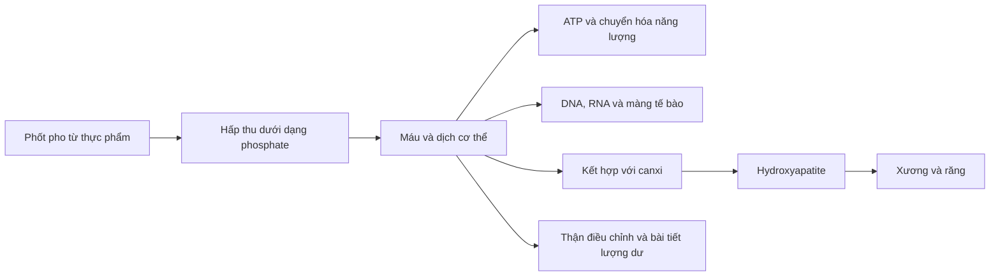

# 077 — Phosphorus

| Thuộc tính                                   | Nội dung                   |
| -------------------------------------------- | -------------------------- |
| **Module**                                   | Module 08 — Micronutrients |
| **Bài học**                                  | Phosphorus                 |
| **Thời lượng**                               | 01:06                      |
| **Chủ đề chính**                             | Phốt pho                   |
| **Tên hóa học thường gặp trong cơ thể**      | Phosphate — phốt phát      |
| **Nhu cầu tham khảo cho người trưởng thành** | Khoảng **700 mg/ngày**     |

> **Thông điệp chính:** Phốt pho cần thiết cho xương, màng tế bào, DNA và quá trình tạo năng lượng. Tuy nhiên, chất này có mặt trong rất nhiều thực phẩm nên người khỏe mạnh hiếm khi bị thiếu hoặc cần uống bổ sung.

## Mục lục

1. [Mục tiêu bài học](#1-mục-tiêu-bài-học)
2. [Nội dung chính](#2-nội-dung-chính)
3. [Áp dụng thực tế](#3-áp-dụng-thực-tế)
4. [Lưu ý & lỗi thường gặp](#4-lưu-ý--lỗi-thường-gặp)
5. [Checklist thực hành](#5-checklist-thực-hành)
6. [Tóm tắt](#6-tóm-tắt)

---

## 1. Mục tiêu bài học

Sau bài học này, người học có thể:

* Giải thích vai trò của phốt pho đối với xương, tế bào và quá trình tạo năng lượng.
* Nhận biết các nguồn phốt pho phổ biến từ động vật và thực vật.
* Ghi nhớ nhu cầu khoảng **700 mg/ngày** đối với người trưởng thành.
* Hiểu vì sao thiếu phốt pho hiếm gặp nhưng thừa phốt pho có thể đáng lưu ý ở người mắc bệnh thận.
* Tránh tự ý dùng viên bổ sung phốt pho khi chưa có chỉ định chuyên môn.

---

## 2. Nội dung chính

### 2.1. Phốt pho là gì?

**Phốt pho** là một khoáng chất thiết yếu. Trong cơ thể, nó chủ yếu tồn tại dưới dạng **phosphate — phốt phát**.

Khoảng **85% lượng phốt pho của cơ thể nằm trong xương và răng**. Phần còn lại được phân bố trong máu, cơ, các cơ quan và mô mềm. Phốt pho còn là thành phần của DNA, RNA, phospholipid trong màng tế bào và ATP — phân tử vận chuyển năng lượng chính của tế bào.


*Hình 1. Một số nhóm thực phẩm cung cấp phốt pho. Hàm lượng thực tế phụ thuộc loại thực phẩm, khẩu phần và cách chế biến.*

### 2.2. Vai trò của phốt pho

| Vai trò                        | Giải thích                                                                                                      |
| ------------------------------ | --------------------------------------------------------------------------------------------------------------- |
| **Xây dựng xương và răng**     | Phosphate kết hợp với canxi tạo nên hydroxyapatite — thành phần khoáng chính giúp xương và men răng có độ cứng. |
| **Tạo và sử dụng năng lượng**  | Phốt pho có mặt trong ATP và ADP, giúp tế bào lưu trữ và giải phóng năng lượng.                                 |
| **Cấu tạo màng tế bào**        | Phospholipid tạo nên lớp màng bao quanh tế bào và các bào quan.                                                 |
| **Cấu tạo vật chất di truyền** | Phosphate nằm trong “khung xương” của DNA và RNA.                                                               |
| **Tăng trưởng và sửa chữa mô** | Cần thiết cho quá trình phân chia tế bào, tổng hợp protein và phát triển mô.                                    |
| **Duy trì cân bằng acid–base** | Các hệ phosphate góp phần giữ pH dịch cơ thể trong giới hạn phù hợp.                                            |

Các vai trò trên cho thấy phốt pho không chỉ là “khoáng chất của xương” mà còn tham gia trực tiếp vào hoạt động của gần như mọi tế bào.

### 2.3. Phốt pho tham gia tạo cấu trúc xương như thế nào?




*Hình 2. Phosphate và canxi tham gia hình thành hydroxyapatite trong các mô khoáng hóa. Hình nghiên cứu từ bài tổng quan trên Nature Reviews Endocrinology.*

### 2.4. Nhu cầu phốt pho hằng ngày

Theo mức khuyến nghị RDA của Hoa Kỳ:

| Nhóm tuổi                                   | Lượng khuyến nghị |
| ------------------------------------------- | ----------------: |
| Trẻ 1–3 tuổi                                |       460 mg/ngày |
| Trẻ 4–8 tuổi                                |       500 mg/ngày |
| Trẻ và thanh thiếu niên 9–18 tuổi           |     1.250 mg/ngày |
| Người từ 19 tuổi trở lên                    |   **700 mg/ngày** |
| Phụ nữ mang thai hoặc cho con bú từ 19 tuổi |   **700 mg/ngày** |

Thanh thiếu niên cần nhiều hơn người trưởng thành vì đây là giai đoạn xương phát triển nhanh. Các hệ thống tham chiếu khác có thể đưa ra con số khác; chẳng hạn EFSA đặt mức hấp thụ đầy đủ cho người trưởng thành là 550 mg/ngày. Trong bài học này, mức **700 mg/ngày** được sử dụng theo RDA của Hoa Kỳ.

### 2.5. Nguồn thực phẩm

Phốt pho xuất hiện trong hầu hết các nhóm thực phẩm, đặc biệt là thực phẩm giàu protein.

#### Nguồn động vật

* Sữa, sữa chua và phô mai.
* Cá hồi, cá mòi và các loại hải sản.
* Thịt bò, thịt lợn và thịt gia cầm.
* Trứng.
* Nội tạng động vật.

#### Nguồn thực vật

* Đậu lăng, đậu đỏ, đậu nành.
* Hạt điều, lạc, hạt hướng dương và hạt vừng.
* Yến mạch, gạo lứt, bánh mì nguyên cám.
* Khoai tây và đậu Hà Lan.

| Thực phẩm và khẩu phần tham khảo | Phốt pho ước tính |
| -------------------------------- | ----------------: |
| Sữa chua ít béo, khoảng 170 g    |            245 mg |
| Sữa 2% béo, 1 cốc                |            226 mg |
| Cá hồi chín, khoảng 85 g         |            214 mg |
| Ức gà chín, khoảng 85 g          |            182 mg |
| Đậu lăng chín, ½ cốc             |            178 mg |
| Hạt điều rang, khoảng 28 g       |            139 mg |
| Khoai tây nướng, 1 củ vừa        |            123 mg |
| Trứng luộc, 1 quả                |             86 mg |
| Bánh mì nguyên cám, 1 lát        |             60 mg |

Các giá trị trên là số liệu tham khảo; hàm lượng có thể thay đổi theo giống thực phẩm, nhãn hàng và cách chế biến.

### 2.6. Khả năng hấp thu không giống nhau

Không phải mọi nguồn phốt pho đều được hấp thu với tỷ lệ giống nhau:

1. **Phốt pho tự nhiên trong thực phẩm động vật** thường được hấp thu tương đối tốt.
2. **Phốt pho trong hạt, ngũ cốc và đậu** thường gắn với phytate. Cơ thể người không có đủ enzyme phytase để giải phóng toàn bộ lượng phốt pho này nên mức hấp thu thường thấp hơn.
3. **Phosphate vô cơ được thêm vào thực phẩm chế biến** dễ được hấp thu và có thể làm tổng lượng phốt pho trong khẩu phần tăng nhanh.

Tỷ lệ hấp thu phốt pho tự nhiên trong thực phẩm được ước tính khoảng **40–70%**, trong đó phốt pho từ động vật thường dễ hấp thu hơn phốt pho từ thực vật.

### 2.7. Cơ thể điều hòa phốt pho như thế nào?

Phốt pho không đơn giản bị “mất đi mỗi ngày” rồi phải được bổ sung bằng viên uống. Cân bằng phosphate được điều hòa bởi:

* **Ruột:** hấp thu phốt pho từ thức ăn.
* **Xương:** lưu trữ và giải phóng phosphate khi cần.
* **Thận:** điều chỉnh lượng phosphate được tái hấp thu hoặc đào thải qua nước tiểu.
* **Hormone:** vitamin D, hormone tuyến cận giáp và FGF23 tham gia kiểm soát nồng độ phosphate.

Ở người có chức năng thận bình thường, lượng dư thường được điều chỉnh và bài tiết. Khi chức năng thận suy giảm, phosphate có thể tích tụ trong máu.

### 2.8. Thiếu phốt pho

Thiếu phốt pho do ăn uống đơn thuần **rất hiếm gặp**, vì khoáng chất này có mặt trong rất nhiều thực phẩm.

Thiếu phosphate máu thường liên quan đến bệnh lý hoặc tình trạng đặc biệt như:

* Suy dinh dưỡng nặng.
* Hội chứng tái nuôi dưỡng sau thời gian thiếu ăn kéo dài.
* Rối loạn hấp thu.
* Uống nhiều rượu kéo dài.
* Một số bệnh di truyền hoặc rối loạn ống thận.
* Cường tuyến cận giáp hoặc nhiễm toan ceton do đái tháo đường.
* Sử dụng kéo dài một số thuốc kháng acid gắn phosphate.

Các biểu hiện có thể gồm:

* Chán ăn và mệt mỏi.
* Yếu cơ.
* Đau xương hoặc mềm xương.
* Tê hoặc cảm giác kiến bò.
* Khó thở do yếu cơ hô hấp trong trường hợp nặng.
* Lú lẫn, mất phối hợp vận động hoặc co giật khi thiếu rất nghiêm trọng.

Những triệu chứng này không đặc hiệu và không đủ để tự chẩn đoán thiếu phốt pho. Việc đánh giá cần dựa trên xét nghiệm cùng nguyên nhân bệnh lý liên quan.

### 2.9. Thừa phốt pho

Ở người khỏe mạnh, lượng phốt pho cao từ thực phẩm tự nhiên hiếm khi gây tác dụng phụ rõ rệt. Tuy nhiên, nguy cơ tăng phosphate máu đáng quan tâm hơn ở người:

* Mắc bệnh thận mạn.
* Đang lọc máu.
* Có rối loạn hormone điều hòa canxi–phosphate.
* Dùng thuốc nhuận tràng hoặc chế phẩm chứa sodium phosphate không đúng liều.
* Tiêu thụ nhiều thực phẩm có phosphate bổ sung.

Khi thận không đào thải phosphate hiệu quả, sự tích tụ có thể góp phần gây rối loạn chuyển hóa xương–khoáng chất và vôi hóa mô mềm. Người mắc bệnh thận không nên tự xây dựng chế độ hạn chế phốt pho quá mức vì nhiều thực phẩm giàu phốt pho cũng là nguồn protein quan trọng; kế hoạch ăn uống cần được cá nhân hóa với bác sĩ hoặc chuyên gia dinh dưỡng thận.

---

## 3. Áp dụng thực tế

### 3.1. Một ngày có thể đạt khoảng 700 mg như thế nào?

Ví dụ:

| Thực phẩm                | Phốt pho ước tính |
| ------------------------ | ----------------: |
| 1 quả trứng luộc         |             86 mg |
| 1 cốc sữa                |            226 mg |
| 85 g ức gà               |            182 mg |
| ½ cốc đậu lăng           |            178 mg |
| 1 lát bánh mì nguyên cám |             60 mg |
| **Tổng**                 | **Khoảng 732 mg** |

Đây chỉ là phép minh họa. Một khẩu phần ăn bình thường có thịt, cá, trứng, sữa, đậu hoặc ngũ cốc thường đã cung cấp đủ phốt pho.

### 3.2. Ưu tiên nguồn thực phẩm tự nhiên

Một cách tiếp cận đơn giản:

```text
Protein ít chế biến
        +
Ngũ cốc hoặc khoai
        +
Rau, đậu và hạt
        +
Sữa hoặc thực phẩm thay thế phù hợp
        ↓
Thường cung cấp đủ phốt pho mà không cần viên bổ sung
```

Ví dụ bữa ăn:

* Cơm + cá hấp + rau.
* Khoai tây + ức gà + salad.
* Yến mạch + sữa chua + hạt.
* Đậu phụ hoặc đậu lăng + cơm + rau.
* Trứng + bánh mì nguyên cám + sữa.

### 3.3. Kiểm tra phosphate bổ sung

Phosphate được thêm vào nhiều loại:

* Thịt chế biến sẵn.
* Xúc xích và thịt nguội.
* Thực phẩm ăn liền.
* Phô mai chế biến.
* Một số đồ uống đóng chai và nước ngọt màu sẫm.
* Thịt đã được “tăng cường” hoặc bơm dung dịch giữ nước.

Khi đọc danh sách thành phần, có thể tìm các từ như:

* `phosphate`
* `phosphoric acid`
* `sodium phosphate`
* `disodium phosphate`
* `polyphosphate`
* các thành phần có cụm `phos`

Phosphate phụ gia được hấp thu dễ hơn phốt pho gắn trong nhiều thực phẩm thực vật. Điều này đặc biệt quan trọng đối với người đang phải kiểm soát phosphate do bệnh thận.

### 3.4. Có cần uống bổ sung không?

Đối với phần lớn người khỏe mạnh:

* Không cần viên bổ sung phốt pho.
* Không nên dùng riêng phosphate với mục đích tăng năng lượng hoặc làm chắc xương.
* Không nên chỉ dựa vào triệu chứng để kết luận thiếu phốt pho.
* Chỉ bổ sung khi có chẩn đoán hoặc chỉ định chuyên môn.

Nhu cầu phốt pho thường được đáp ứng dễ dàng qua chế độ ăn, và lượng ăn trung bình ở nhiều quần thể còn cao hơn mức khuyến nghị.

---

## 4. Lưu ý & lỗi thường gặp

### Lỗi 1: Cho rằng phốt pho chỉ có vai trò đối với xương

Phốt pho còn tham gia cấu tạo ATP, DNA, RNA, màng tế bào và hệ đệm acid–base.

### Lỗi 2: Nghĩ rằng càng nhiều phốt pho thì xương càng chắc

Xương khỏe cần sự phối hợp giữa phốt pho, canxi, vitamin D, protein, vận động và chức năng hormone bình thường. Bổ sung một khoáng chất riêng lẻ không tự động làm tăng độ chắc của xương.

### Lỗi 3: Lo thiếu phốt pho dù khẩu phần bình thường

Thiếu do ăn uống đơn thuần rất hiếm. Thiếu phosphate máu thường báo hiệu một vấn đề y khoa, thuốc hoặc tình trạng suy dinh dưỡng cần được đánh giá.

### Lỗi 4: Không phân biệt phốt pho tự nhiên với phosphate phụ gia

Phốt pho trong đậu và ngũ cốc thường được hấp thu kém hơn, trong khi phosphate thêm vào thực phẩm chế biến được hấp thu dễ hơn.

### Lỗi 5: Tự hạn chế toàn bộ thịt, cá, sữa và đậu vì sợ phốt pho

Điều này có thể làm khẩu phần thiếu protein, canxi và các vi chất khác. Người khỏe mạnh không cần theo chế độ ít phốt pho. Người mắc bệnh thận cần kế hoạch riêng dựa trên xét nghiệm.

### Lỗi 6: Tự uống phosphate để điều trị mệt mỏi hoặc yếu cơ

Mệt mỏi và yếu cơ có rất nhiều nguyên nhân. Viên phosphate có thể gây rối loạn khoáng chất hoặc nguy hiểm ở người mắc bệnh thận, tim hay mất nước.

---

## 5. Checklist thực hành

* [ ] Tôi biết phốt pho trong cơ thể chủ yếu tồn tại dưới dạng phosphate.
* [ ] Tôi nhớ rằng khoảng 85% phốt pho nằm trong xương và răng.
* [ ] Tôi hiểu phốt pho tham gia tạo ATP, DNA và màng tế bào.
* [ ] Tôi biết mức tham khảo cho người trưởng thành là khoảng 700 mg/ngày.
* [ ] Tôi thường xuyên ăn ít nhất một nguồn protein hoặc đậu trong ngày.
* [ ] Tôi ưu tiên thực phẩm tươi, ít chế biến.
* [ ] Tôi kiểm tra thành phần phosphate khi mua thực phẩm đóng gói.
* [ ] Tôi không tự ý dùng viên bổ sung phốt pho.
* [ ] Tôi biết thiếu phốt pho do ăn uống bình thường là rất hiếm.
* [ ] Nếu mắc bệnh thận, tôi sẽ hỏi bác sĩ hoặc chuyên gia dinh dưỡng trước khi thay đổi lượng phốt pho.

---

## 6. Tóm tắt

Phốt pho là một khoáng chất dồi dào trong cơ thể và thực phẩm. Nó tập trung chủ yếu ở xương và răng, đồng thời tham gia cấu tạo màng tế bào, DNA, RNA và ATP.

Người trưởng thành cần khoảng **700 mg phốt pho mỗi ngày** theo RDA của Hoa Kỳ. Thịt, cá, sữa, trứng, đậu, hạt, ngũ cốc và khoai đều có thể cung cấp phốt pho.

Thiếu phốt pho rất hiếm ở người ăn uống bình thường và thường liên quan đến bệnh lý hoặc suy dinh dưỡng. Phần lớn người khỏe mạnh không cần bổ sung. Vấn đề đáng lưu ý hơn là phosphate phụ gia và sự tích tụ phosphate ở người mắc bệnh thận.

> **Ghi nhớ:**
> **Phốt pho rất cần thiết, nhưng thường đã có đủ trong khẩu phần. Hãy ưu tiên thực phẩm tự nhiên và không tự ý sử dụng viên bổ sung.**

---

# Bài luyện tập

## Mục tiêu


## Đề bài


## Yêu cầu hoàn thành

- [ ] 
- [ ] 
- [ ] 

## Kết quả / lời giải


## Ghi chú
