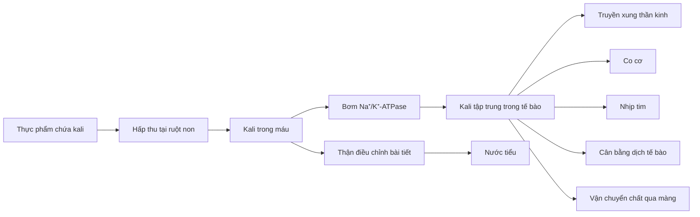

# 078 — Potassium

[](https://bodyfoodas.lt/kalio-trukumas-simptomai-priezastys-ir-kas-vyksta-organizme-kai-jo-truksta/?utm_source=chatgpt.com)

| Thuộc tính          | Nội dung                              |
| ------------------- | ------------------------------------- |
| **Module**          | Module 08 — Micronutrients            |
| **Bài học**         | Potassium                             |
| **Thời lượng**      | 01:06                                 |
| **Chủ đề chính**    | Kali                                  |
| **Ký hiệu hóa học** | K                                     |
| **Phân loại**       | Khoáng chất thiết yếu, chất điện giải |

## Mục lục

1. [Mục tiêu bài học](#1-mục-tiêu-bài-học)
2. [Nội dung chính](#2-nội-dung-chính)
3. [Áp dụng thực tế](#3-áp-dụng-thực-tế)
4. [Lưu ý & lỗi thường gặp](#4-lưu-ý--lỗi-thường-gặp)
5. [Checklist thực hành](#5-checklist-thực-hành)
6. [Tóm tắt](#6-tóm-tắt)

> [!IMPORTANT]
> **Hiệu chỉnh thông tin trong bài giảng:** con số **4.700 mg/ngày** vẫn là **Daily Value — DV** được FDA sử dụng trên nhãn dinh dưỡng, nhưng không phải mức AI hiện hành giống nhau cho cả nam và nữ. Theo DRI của Hoa Kỳ, lượng hấp thụ đầy đủ — AI — cho người trưởng thành là **3.400 mg/ngày đối với nam** và **2.600 mg/ngày đối với nữ**. WHO đưa ra mục tiêu ít nhất **3.510 mg/ngày từ thực phẩm** nhằm hỗ trợ kiểm soát huyết áp. ([ODS][1])

---

## 1. Mục tiêu bài học

Sau bài học này, người học có thể:

* Giải thích kali là gì và vì sao nó được gọi là chất điện giải.
* Mô tả vai trò của kali đối với tế bào, thần kinh, cơ bắp và tim.
* Phân biệt AI, khuyến nghị của WHO và Daily Value trên nhãn thực phẩm.
* Xác định các thực phẩm giàu kali ngoài chuối.
* Nhận biết dấu hiệu, nguyên nhân và nhóm nguy cơ hạ kali máu.
* Hiểu rằng chuột rút không phải lúc nào cũng do thiếu kali.
* Biết khi nào không nên tự ý bổ sung kali.

---

## 2. Nội dung chính

### 2.1. Kali là gì?

Kali là một **khoáng chất thiết yếu** và là một trong những chất điện giải quan trọng nhất của cơ thể. Phần lớn kali nằm **bên trong tế bào**, trong khi natri tập trung chủ yếu ở dịch ngoài tế bào. Sự chênh lệch này tạo nên điện thế qua màng, cần thiết cho truyền tín hiệu thần kinh, co cơ và duy trì chức năng bình thường của tế bào. ([ODS][1])

Kali trong thức ăn được hấp thu chủ yếu ở ruột non. Ở người khỏe mạnh, thận điều chỉnh lượng kali bài tiết qua nước tiểu để giữ nồng độ kali máu trong phạm vi hẹp. ([ODS][1])

### 2.2. Sơ đồ chuyển hóa và chức năng của kali



### 2.3. Bơm natri–kali

Bơm Na⁺/K⁺-ATPase sử dụng năng lượng từ ATP để vận chuyển **ba ion Na⁺ ra ngoài** và **hai ion K⁺ vào trong tế bào** trong mỗi chu kỳ. Quá trình này giúp duy trì điện thế màng và khả năng hoạt động của tế bào thần kinh, cơ xương và cơ tim. ([Wikimedia Commons][2])


*Hình: bơm Na⁺/K⁺-ATPase sử dụng ATP để duy trì chênh lệch nồng độ natri và kali qua màng tế bào. Nguồn: OpenStax/Wikimedia Commons, giấy phép CC BY 3.0.* ([Wikimedia Commons][2])

### 2.4. Vai trò chính của kali

| Chức năng                 | Ý nghĩa                                                                            |
| ------------------------- | ---------------------------------------------------------------------------------- |
| **Truyền xung thần kinh** | Duy trì chênh lệch điện thế để tế bào thần kinh phát và truyền tín hiệu            |
| **Co cơ**                 | Hỗ trợ hoạt động của cơ xương và cơ trơn                                           |
| **Nhịp tim**              | Tham gia quá trình khử cực và tái cực của tế bào cơ tim                            |
| **Cân bằng dịch**         | Góp phần duy trì lượng dịch và áp suất thẩm thấu bên trong tế bào                  |
| **Vận chuyển qua màng**   | Hỗ trợ đưa dưỡng chất vào tế bào và đưa chất thải ra ngoài                         |
| **Huyết áp**              | Chế độ ăn giàu kali có thể giảm bớt một phần ảnh hưởng bất lợi của lượng natri cao |

Các vai trò trên phụ thuộc vào sự kiểm soát chặt chẽ nồng độ kali trong và ngoài tế bào. Quá ít hoặc quá nhiều kali trong máu đều có thể làm rối loạn hoạt động điện của cơ và tim. ([ODS][1])

WHO khuyến nghị tăng kali từ thực phẩm để góp phần giảm huyết áp và nguy cơ bệnh tim mạch, đột quỵ và bệnh mạch vành ở người trưởng thành. ([World Health Organization][3])

### 2.5. Nhu cầu kali mỗi ngày

#### Lượng hấp thụ đầy đủ — AI theo NASEM

| Đối tượng              | Kali mỗi ngày |
| ---------------------- | ------------: |
| Nam từ 19 tuổi trở lên |  **3.400 mg** |
| Nữ từ 19 tuổi trở lên  |  **2.600 mg** |
| Mang thai, 19–50 tuổi  |  **2.900 mg** |
| Cho con bú, 19–50 tuổi |  **2.800 mg** |

Các mức AI này áp dụng cho người khỏe mạnh và không áp dụng trực tiếp cho người bị suy giảm khả năng đào thải kali, chẳng hạn bệnh thận mạn. ([ODS][1])

#### Vì sao có nhiều con số khác nhau?

| Mốc tham chiếu                      |               Giá trị | Mục đích                                                            |
| ----------------------------------- | --------------------: | ------------------------------------------------------------------- |
| **AI của NASEM — nam trưởng thành** |         3.400 mg/ngày | Lập kế hoạch dinh dưỡng cho người khỏe mạnh                         |
| **AI của NASEM — nữ trưởng thành**  |         2.600 mg/ngày | Lập kế hoạch dinh dưỡng cho người khỏe mạnh                         |
| **WHO**                             | Ít nhất 3.510 mg/ngày | Mục tiêu từ thực phẩm nhằm hỗ trợ giảm huyết áp và nguy cơ tim mạch |
| **FDA Daily Value**                 |         4.700 mg/ngày | Tính `%DV` và so sánh thực phẩm trên nhãn dinh dưỡng                |

Các con số này không hoàn toàn mâu thuẫn vì chúng được xây dựng cho những mục đích khác nhau. Khi đọc nhãn thực phẩm, **4.700 mg tương ứng 100% DV**; tuy nhiên khi đánh giá nhu cầu cá nhân, cần xem xét tuổi, giới, tình trạng sức khỏe và hướng dẫn chuyên môn. ([ODS][1])

### 2.6. Nguồn thực phẩm giàu kali

Kali có trong cả thực phẩm thực vật và động vật. Những nhóm đáng chú ý gồm khoai, các loại đậu, rau lá xanh, trái cây, sữa chua, sữa, cá, thịt gia cầm và các loại hạt. ([ODS][1])

| Thực phẩm và khẩu phần                    | Kali ước tính |
| ----------------------------------------- | ------------: |
| Mơ khô, ½ cốc                             |        755 mg |
| Đậu lăng chín, 1 cốc                      |        731 mg |
| Khoai tây nướng cỡ vừa                    |        610 mg |
| Đậu thận đóng hộp, 1 cốc                  |        607 mg |
| Nước cam, 1 cốc                           |        496 mg |
| Đậu nành chín, ½ cốc                      |        443 mg |
| Chuối cỡ vừa                              |        422 mg |
| Sữa ít béo, 1 cốc                         |        366 mg |
| Rau bina sống, 2 cốc                      |        334 mg |
| Ức gà nướng, khoảng 85 g                  |        332 mg |
| Sữa chua trái cây không béo, khoảng 170 g |        330 mg |
| Cá hồi chín, khoảng 85 g                  |        326 mg |
| Cà chua cỡ vừa                            |        292 mg |
| Sữa chua Hy Lạp không béo, khoảng 170 g   |        240 mg |
| Hạt điều, khoảng 28 g                     |        187 mg |

Hàm lượng thực tế có thể thay đổi theo giống, khẩu phần, cách chế biến và sản phẩm cụ thể. Bảng trên được dùng để so sánh tương đối, không phải để tự điều trị hạ kali máu. ([ODS][1])

> [!TIP]
> **Chuối không phải thực phẩm giàu kali nhất.** Một khẩu phần đậu lăng, mơ khô hoặc khoai tây có thể cung cấp nhiều kali hơn một quả chuối. ([ODS][1])


*Hình minh họa một bữa ăn chứa nhiều thực phẩm toàn phần như rau bina, bơ, cà chua và ngũ cốc nguyên cám. Nguồn: Liat Portal/Wikimedia Commons, CC BY-SA 4.0.* ([Wikimedia Commons][4])

### 2.7. Kali và chuột rút

Hạ kali máu có thể gây yếu cơ, rối loạn chức năng cơ và trong trường hợp nặng có thể ảnh hưởng đến tim. Mất kali do tiêu chảy, nôn kéo dài, thuốc lợi tiểu, lạm dụng thuốc nhuận tràng hoặc đổ mồ hôi rất nhiều có thể góp phần làm giảm kali. Tuy nhiên, lượng kali bị mất qua mồ hôi thông thường tương đối nhỏ và hạ kali máu hiếm khi chỉ xuất phát từ chế độ ăn thiếu kali. ([ODS][1])

Đối với chuột rút liên quan đến tập luyện, bằng chứng không cho thấy nồng độ kali thấp là nguyên nhân duy nhất hoặc phổ biến trong mọi trường hợp. Mệt mỏi thần kinh–cơ, cường độ tập, điều kiện nóng, mất nước và nhiều yếu tố cá nhân khác cũng có thể tham gia. Vì vậy, việc “ăn thêm chuối” hoặc tự dùng viên kali không phải giải pháp chắc chắn cho mọi trường hợp chuột rút. ([PubMed][5])

---

## 3. Áp dụng thực tế

### 3.1. Công thức xây dựng bữa ăn giàu kali

Thay vì phụ thuộc vào một loại thực phẩm, có thể phối hợp nhiều nhóm:

```text
Rau hoặc trái cây
        +
Khoai, ngũ cốc nguyên cám hoặc các loại đậu
        +
Cá, thịt nạc, sữa hoặc sữa chua
        +
Một lượng vừa phải hạt
```

Một chế độ ăn nhiều thực phẩm ít qua chế biến như rau, trái cây, đậu, cá và sữa thường cung cấp nhiều kali hơn chế độ ăn phụ thuộc chủ yếu vào thực phẩm chế biến sẵn. ([World Health Organization][3])

### 3.2. Thực đơn minh họa một ngày

| Bữa                | Thực phẩm                                           |       Kali ước tính |
| ------------------ | --------------------------------------------------- | ------------------: |
| **Sáng**           | 1 quả chuối + 170 g sữa chua Hy Lạp + 28 g hạt điều |              849 mg |
| **Trưa**           | 1 khoai tây nướng + 85 g ức gà + 1 quả cà chua      |            1.234 mg |
| **Bữa phụ**        | 1 cốc sữa ít béo                                    |              366 mg |
| **Tối**            | 1 cốc đậu lăng + 2 cốc rau bina sống + 85 g cá hồi  |            1.391 mg |
| **Tổng tham khảo** |                                                     | **Khoảng 3.840 mg** |

Thực đơn trên chỉ minh họa cách cộng dồn kali từ nhiều nguồn. Giá trị thực tế thay đổi theo sản phẩm và cách chế biến; nhu cầu cá nhân có thể khác nếu có bệnh thận, bệnh tim hoặc đang dùng thuốc ảnh hưởng đến kali. ([ODS][1])

### 3.3. Khi thường xuyên bị chuột rút

Không nên mặc định rằng chuột rút đồng nghĩa với thiếu kali. Nên xem xét đồng thời:

* Cường độ tập hoặc khối lượng vận động tăng quá nhanh.
* Mức độ mệt mỏi của nhóm cơ.
* Nước và natri bị mất khi vận động kéo dài trong môi trường nóng.
* Tình trạng nôn, tiêu chảy hoặc dùng thuốc nhuận tràng.
* Thuốc lợi tiểu và các thuốc khác.
* Thiếu magie đi kèm.
* Các vấn đề thần kinh, tuần hoàn hoặc cơ xương khác.

Nếu chuột rút tái diễn kèm yếu cơ, hồi hộp, ngất, tê bì hoặc có tiền sử bệnh thận/tim, cần được đánh giá y tế thay vì tự dùng viên kali. ([ODS][1])

---

## 4. Lưu ý & lỗi thường gặp

### 4.1. Dấu hiệu thiếu kali

Hạ kali máu nhẹ có thể biểu hiện bằng:

* Mệt mỏi.
* Yếu cơ.
* Táo bón.
* Cảm giác khó chịu hoặc giảm khả năng vận động.

Khi hạ kali máu nặng, người bệnh có thể bị liệt cơ, rối loạn hô hấp và rối loạn nhịp tim nguy hiểm. ([ODS][1])

> [!WARNING]
> Các triệu chứng trên không đặc hiệu. Không thể chẩn đoán thiếu kali chỉ dựa vào mệt mỏi hoặc chuột rút; cần xét nghiệm máu và đánh giá nguyên nhân khi có chỉ định.

### 4.2. Nhóm có nguy cơ hạ kali máu

Nguy cơ tăng ở người:

* Tiêu chảy hoặc nôn kéo dài.
* Lạm dụng thuốc nhuận tràng hoặc thụt tháo.
* Dùng thuốc lợi tiểu quai hoặc lợi tiểu thiazide.
* Đổ mồ hôi rất nhiều trong thời gian dài.
* Đang lọc máu.
* Mắc bệnh viêm ruột kèm tiêu chảy mạn.
* Thiếu magie đồng thời.

Chỉ ăn ít kali hiếm khi là nguyên nhân duy nhất gây hạ kali máu nghiêm trọng ở người khỏe mạnh có chức năng thận bình thường. ([ODS][1])

### 4.3. Nguy cơ thừa kali

Ở người khỏe mạnh có chức năng thận bình thường, kali từ thực phẩm thường được thận đào thải hiệu quả. Tuy nhiên, người bị bệnh thận mạn hoặc dùng một số thuốc có thể bị **tăng kali máu**, ngay cả khi lượng kali ăn vào không quá cao. ([ODS][1])

Các thuốc cần lưu ý gồm:

| Nhóm thuốc                              | Ảnh hưởng có thể xảy ra                      |
| --------------------------------------- | -------------------------------------------- |
| ACE inhibitor                           | Giảm đào thải kali, có thể gây tăng kali máu |
| ARB, ví dụ losartan                     | Giảm đào thải kali                           |
| Lợi tiểu giữ kali, ví dụ spironolactone | Có thể làm tăng kali máu                     |
| Lợi tiểu quai hoặc thiazide             | Có thể làm tăng mất kali và gây hạ kali máu  |

Người đang dùng các thuốc trên cần trao đổi với bác sĩ trước khi dùng viên kali, nước điện giải giàu kali hoặc muối thay thế chứa potassium chloride. ([ODS][1])

### 4.4. Những lỗi thường gặp

#### Lỗi 1: “Ai cũng cần đúng 4.700 mg kali mỗi ngày”

**Thực tế:** 4.700 mg là DV của FDA trên nhãn thực phẩm. AI hiện hành là 3.400 mg đối với nam và 2.600 mg đối với nữ trưởng thành. ([ODS][1])

#### Lỗi 2: “Chuối là nguồn kali tốt nhất”

**Thực tế:** chuối là nguồn thuận tiện, nhưng đậu lăng, mơ khô, khoai tây và một số loại đậu có thể cung cấp nhiều kali hơn trên mỗi khẩu phần. ([ODS][1])

#### Lỗi 3: “Bị chuột rút thì cứ bổ sung kali”

**Thực tế:** chuột rút có nhiều nguyên nhân và không phải lúc nào cũng liên quan đến nồng độ kali thấp. ([PubMed][5])

#### Lỗi 4: “Kali từ thực phẩm và viên bổ sung giống nhau”

**Thực tế:** thực phẩm cung cấp kali cùng chất xơ và các chất dinh dưỡng khác. Viên bổ sung hoặc muối thay thế có thể gây nguy hiểm ở người suy thận hoặc đang dùng thuốc làm giảm đào thải kali. ([ODS][1])

#### Lỗi 5: “Bệnh thận nên ăn thật nhiều kali để tốt cho tim”

**Thực tế:** bệnh thận có thể làm giảm khả năng đào thải kali; một số bệnh nhân cần hạn chế chứ không phải tăng kali. ([MedlinePlus][6])

---

## 5. Checklist thực hành

* [ ] Tôi hiểu kali là chất điện giải chủ yếu nằm trong tế bào.
* [ ] Tôi biết kali tham gia truyền xung thần kinh, co cơ và duy trì nhịp tim.
* [ ] Tôi không xem 4.700 mg là nhu cầu giống nhau cho mọi người.
* [ ] Tôi bổ sung kali chủ yếu từ thực phẩm toàn phần.
* [ ] Tôi ăn đa dạng rau, củ, trái cây, đậu, cá, sữa chua và các loại hạt.
* [ ] Tôi không chỉ dựa vào chuối để cung cấp kali.
* [ ] Tôi không tự chẩn đoán thiếu kali chỉ vì bị chuột rút.
* [ ] Tôi chú ý đến nôn, tiêu chảy, thuốc lợi tiểu và thuốc nhuận tràng.
* [ ] Tôi không tự dùng viên kali hoặc muối kali khi có bệnh thận.
* [ ] Tôi đi khám khi có yếu cơ rõ, hồi hộp, ngất hoặc rối loạn nhịp tim.

---

## 6. Tóm tắt

Kali là khoáng chất và chất điện giải thiết yếu, tập trung phần lớn bên trong tế bào. Nó tham gia duy trì điện thế màng, truyền xung thần kinh, co cơ, nhịp tim, cân bằng dịch và vận chuyển các chất qua màng tế bào. ([ODS][1])

Nguồn kali tốt gồm khoai tây, các loại đậu, rau lá xanh, trái cây, sữa chua, sữa, cá, thịt gia cầm và các loại hạt. Chuối là nguồn thuận tiện nhưng không phải nguồn giàu kali nhất. ([ODS][1])

Mức AI hiện hành cho người trưởng thành là **3.400 mg/ngày đối với nam** và **2.600 mg/ngày đối với nữ**; **4.700 mg** là Daily Value dùng trên nhãn thực phẩm. WHO đề xuất ít nhất **3.510 mg/ngày từ thực phẩm** nhằm hỗ trợ kiểm soát huyết áp. ([ODS][1])

Thiếu kali có thể gây mệt mỏi, táo bón, yếu cơ và rối loạn nhịp tim, nhưng thường liên quan đến mất kali do bệnh lý hoặc thuốc hơn là chỉ do ăn thiếu. Chuột rút có nhiều nguyên nhân, vì vậy không nên tự ý dùng kali để điều trị. Người mắc bệnh thận hoặc dùng thuốc ảnh hưởng đến đào thải kali cần hỏi bác sĩ trước khi thay đổi lượng kali trong chế độ ăn hoặc sử dụng sản phẩm bổ sung. ([ODS][1])

[1]: https://ods.od.nih.gov/factsheets/Potassium-HealthProfessional/ "Potassium - Health Professional Fact Sheet"
[2]: https://commons.wikimedia.org/wiki/File%3A0308_Sodium_Potassium_Pump_labeled.jpg "File:0308 Sodium Potassium Pump labeled.jpg - Wikimedia Commons"
[3]: https://www.who.int/tools/elena/interventions/potassium-cvd-adults "Increasing potassium intake to reduce blood pressure and risk of cardiovascular diseases in adults"
[4]: https://commons.wikimedia.org/wiki/File%3ALiat_Portal_for_Foodie_Disorder_-_Scrambled_eggs_with_spinach_avocado_and_vegetables.jpg "File:Liat Portal for Foodie Disorder - Scrambled eggs with spinach avocado and vegetables.jpg - Wikimedia Commons"
[5]: https://pubmed.ncbi.nlm.nih.gov/25945453/?utm_source=chatgpt.com "Does a Reduction in Serum Sodium Concentration or ..."
[6]: https://medlineplus.gov/potassium.html "Potassium | Dietary Potassium | MedlinePlus"
