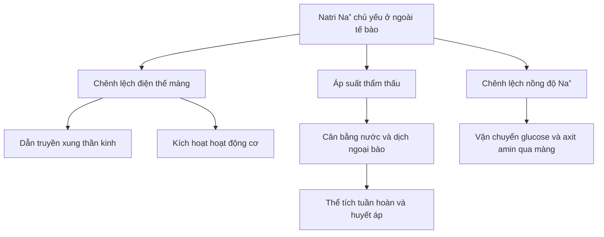
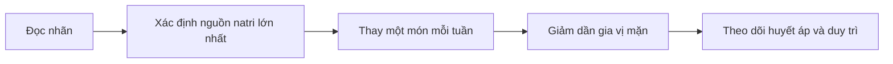

# 079 — Sodium

| Thuộc tính                      | Nội dung                              |
| ------------------------------- | ------------------------------------- |
| **Module**                      | Module 08 — Micronutrients            |
| **Bài học**                     | Sodium                                |
| **Thời lượng**                  | 00:55                                 |
| **Chủ đề chính**                | Natri                                 |
| **Ký hiệu hóa học**             | Na                                    |
| **Dạng hoạt động trong cơ thể** | Ion natri — Na⁺                       |
| **Nhóm chất**                   | Khoáng chất thiết yếu, chất điện giải |

*Hình 1. Muối ăn natri clorua. Nguồn: Wikimedia Commons, giấy phép CC BY-SA 4.0.* ([Wikimedia Commons][1])

## Mục lục

1. [Mục tiêu bài học](#1-mục-tiêu-bài-học)
2. [Nội dung chính](#2-nội-dung-chính)
3. [Áp dụng thực tế](#3-áp-dụng-thực-tế)
4. [Lưu ý & lỗi thường gặp](#4-lưu-ý--lỗi-thường-gặp)
5. [Checklist thực hành](#5-checklist-thực-hành)
6. [Tóm tắt](#6-tóm-tắt)

> [!IMPORTANT]
> **Hiệu chỉnh nội dung gốc:** Natri không chiếm đúng một nửa khối lượng muối ăn. Trong natri clorua — NaCl, natri chiếm khoảng **40%** khối lượng; vì vậy **1 g muối cung cấp khoảng 400 mg natri**. ([Iris][2])

---

## 1. Mục tiêu bài học

Sau bài học này, người học có thể:

* Giải thích natri là gì và phân biệt **natri** với **muối ăn**.
* Mô tả vai trò của natri trong dẫn truyền thần kinh, co cơ, cân bằng dịch và vận chuyển chất qua màng tế bào.
* Nhận biết những nguồn natri phổ biến trong chế độ ăn.
* Hiểu sự khác nhau giữa:

  * Ăn nhiều natri kéo dài.
  * Tăng natri máu.
  * Hạ natri máu.
* Biết các mức tham khảo khoảng **1.500–2.300 mg natri/ngày** và cách áp dụng chúng hợp lý.
* Thực hiện những biện pháp giảm natri mà không làm bữa ăn trở nên quá nhạt hoặc thiếu dinh dưỡng.

---

## 2. Nội dung chính

### 2.1. Natri là gì?

Natri là một khoáng chất thiết yếu và là một trong những chất điện giải chính của cơ thể. Trong dịch cơ thể, natri chủ yếu tồn tại dưới dạng ion mang điện tích dương **Na⁺**.

Natri là cation chính của dịch ngoại bào. Nhờ hoạt tính thẩm thấu và sự chênh lệch nồng độ giữa trong và ngoài tế bào, natri tham gia kiểm soát thể tích dịch ngoại bào, huyết áp, khả năng hưng phấn của tế bào thần kinh và cơ, đồng thời hỗ trợ vận chuyển một số chất dinh dưỡng qua màng tế bào. ([PubMed Central (PMC)][3])

### 2.2. Natri khác muối ăn như thế nào?

| Khái niệm          | Giải thích                                                           |
| ------------------ | -------------------------------------------------------------------- |
| **Natri**          | Khoáng chất có ký hiệu Na; trong cơ thể thường tồn tại dưới dạng Na⁺ |
| **Muối ăn**        | Hợp chất natri clorua — NaCl                                         |
| **1 g muối**       | Cung cấp khoảng 400 mg natri                                         |
| **5 g muối**       | Cung cấp khoảng 2.000 mg natri                                       |
| **2.300 mg natri** | Tương đương khoảng 5,75 g muối                                       |

Công thức quy đổi gần đúng:

[
\text{Lượng muối (g)} \approx \frac{\text{Natri (mg)}}{400}
]

[
\text{Natri (mg)} \approx \text{Muối (g)} \times 400
]

> Con số trên là quy đổi natri clorua. Thực phẩm cũng có thể chứa natri dưới những dạng khác như natri bicarbonat, natri glutamat hoặc natri benzoat.

### 2.3. Vai trò của natri

#### 1. Duy trì cân bằng dịch

Natri giúp kiểm soát lượng nước trong dịch ngoại bào. Tổng lượng natri trong cơ thể có ảnh hưởng lớn đến thể tích dịch ngoại bào và thể tích tuần hoàn. ([MSD Manuals][4])

#### 2. Dẫn truyền xung thần kinh

Khi kênh natri trên màng tế bào thần kinh mở, Na⁺ đi vào tế bào và tạo ra quá trình khử cực. Đây là một bước quan trọng để hình thành và truyền điện thế hoạt động dọc theo neuron. ([NCBI][5])

#### 3. Hỗ trợ hoạt động cơ

Sự di chuyển của natri qua màng tế bào góp phần tạo điện thế hoạt động, giúp tín hiệu từ dây thần kinh kích hoạt quá trình co cơ. ([NCBI][6])

#### 4. Vận chuyển chất qua màng tế bào

Chênh lệch nồng độ natri giữa hai phía màng tế bào tạo năng lượng cho các hệ thống đồng vận chuyển, chẳng hạn vận chuyển glucose và axit amin.

#### 5. Hỗ trợ duy trì huyết áp

Natri có vai trò sinh lý trong duy trì thể tích tuần hoàn. Tuy nhiên, ăn quá nhiều natri kéo dài có thể làm tăng huyết áp và tăng nguy cơ bệnh tim mạch, đặc biệt ở những người nhạy cảm với muối hoặc đã có tăng huyết áp. ([CDC][7])

### 2.4. Sơ đồ vai trò của natri

### 2.5. Bơm natri–kali

*Hình 2. Bơm natri–kali sử dụng ATP để đưa ba ion Na⁺ ra ngoài và hai ion K⁺ vào trong tế bào trong mỗi chu kỳ. Nguồn: OpenStax/Wikimedia Commons, CC BY 4.0.* ([Wikimedia Commons][8])

Bơm natri–kali, hay **Na⁺/K⁺-ATPase**, sử dụng năng lượng từ ATP để duy trì chênh lệch nồng độ natri và kali giữa hai phía màng tế bào.

Sự chênh lệch này cần thiết cho:

* Điện thế nghỉ của tế bào.
* Dẫn truyền xung thần kinh.
* Hoạt động của tế bào cơ.
* Vận chuyển chủ động thứ cấp.
* Kiểm soát thể tích tế bào.

### 2.6. Cơ thể điều hòa natri như thế nào?

Ở người khỏe mạnh, cơ thể giữ nồng độ natri máu trong một phạm vi khá hẹp. Thận lọc máu và đào thải phần natri dư thừa qua nước tiểu; cảm giác khát cùng nhiều cơ chế nội tiết cũng tham gia điều chỉnh cân bằng natri và nước. ([MedlinePlus][9])

Điều quan trọng là phải phân biệt:

* **Tổng lượng natri trong cơ thể** ảnh hưởng đến thể tích dịch ngoại bào.
* **Nồng độ natri trong máu** phụ thuộc nhiều vào tương quan giữa natri và lượng nước.

Do đó, xét nghiệm natri máu bình thường không nhất thiết có nghĩa là chế độ ăn không chứa quá nhiều natri. Ngược lại, tăng natri máu thường liên quan đến thiếu nước so với lượng natri, chứ không đơn thuần do một vài bữa ăn mặn. ([MSD Manuals][10])

### 2.7. Nhu cầu và giới hạn tham khảo

#### Mức tham khảo của National Academies

Đối với người trưởng thành từ 19–50 tuổi, **1.500 mg/ngày** là mức *Adequate Intake — AI*, tức lượng tiêu thụ đầy đủ được ước tính. Đây không phải là bằng chứng rằng tất cả mọi người bắt buộc phải đạt chính xác 1.500 mg mỗi ngày. ([National Academies][11])

Đối với người từ 14 tuổi trở lên, khuyến nghị *Chronic Disease Risk Reduction — CDRR* là nên giảm lượng natri khi khẩu phần vượt quá **2.300 mg/ngày**. ([National Academies][12])

#### Khuyến nghị của WHO

WHO khuyến nghị người trưởng thành tiêu thụ:

* **Dưới 2.000 mg natri/ngày**.
* Tương đương **dưới 5 g muối/ngày**.

Đối với trẻ em, mức tối đa cần được điều chỉnh thấp hơn dựa trên nhu cầu năng lượng. ([World Health Organization][13])

| Mốc tham khảo                    |                  Natri | Muối tương đương |
| -------------------------------- | ---------------------: | ---------------: |
| AI người trưởng thành 19–50 tuổi |               1.500 mg |           3,75 g |
| Giới hạn WHO                     |          Dưới 2.000 mg |         Dưới 5 g |
| Mốc CDRR từ 14 tuổi              | Giảm nếu trên 2.300 mg |    Khoảng 5,75 g |

> Các mức trên áp dụng cho dân số nói chung. Người mất nhiều mồ hôi, vận động sức bền, làm việc trong môi trường nóng hoặc có bệnh lý và thuốc ảnh hưởng đến cân bằng dịch cần được đánh giá riêng.

### 2.8. Nguồn natri trong chế độ ăn

Muối cho thêm khi nấu chỉ là một phần của tổng lượng natri. Một lượng đáng kể có thể đến từ thực phẩm đóng gói, chế biến sẵn và món ăn tại nhà hàng. ([CDC][7])

#### Nguồn trực tiếp

* Muối ăn.
* Nước mắm.
* Nước tương và xì dầu.
* Bột canh.
* Hạt nêm và viên súp.
* Các loại nước chấm mặn.

#### Thực phẩm chế biến sẵn

* Mì ăn liền.
* Xúc xích, thịt nguội và thịt muối.
* Cá khô, thịt khô.
* Đồ hộp.
* Phô mai.
* Snack mặn.
* Bánh mì và bánh đóng gói.
* Pizza, súp và nước dùng chế biến sẵn.

WHO khuyến nghị giảm muối, nước tương, nước mắm và các loại gia vị giàu natri khi chế biến; hạn chế đồ ăn nhẹ mặn và ưu tiên sản phẩm có hàm lượng natri thấp hơn. ([World Health Organization][14])

### 2.9. Điều gì xảy ra khi ăn quá nhiều natri?

#### Ăn nhiều natri kéo dài

Tiêu thụ nhiều natri thường xuyên có thể:

* Làm tăng huyết áp.
* Tăng nguy cơ bệnh tim.
* Tăng nguy cơ đột quỵ.
* Gây giữ nước ở một số người có bệnh tim, thận hoặc gan. ([CDC][7])

Không cần phải ăn đến mức “ngộ độc muối” thì natri mới có ảnh hưởng đến huyết áp. Nguy cơ mạn tính có thể tăng khi khẩu phần thường xuyên vượt các mức khuyến nghị.

#### Tăng natri máu

**Tăng natri máu — hypernatremia** là tình trạng nồng độ natri trong máu cao bất thường. Tình trạng này có thể xảy ra do:

* Mất nước mà không được bù đủ.
* Sốt, tiêu chảy hoặc nôn.
* Đổ mồ hôi nhiều.
* Rối loạn chức năng thận hoặc hormone.
* Dùng dung dịch hay thuốc chứa nhiều natri.
* Hiếm hơn là ăn quá nhiều muối trong điều kiện không có đủ nước.

Tăng natri máu thường liên quan đến mất nước ròng hoặc lượng natri đưa vào quá lớn. ([NCBI][15])

Dấu hiệu có thể bao gồm:

* Khát nhiều.
* Tiểu rất ít.
* Lú lẫn.
* Co giật hoặc rung giật cơ.
* Yếu hoặc mệt bất thường.
* Co giật toàn thân trong trường hợp nặng. ([MedlinePlus][9])

> [!WARNING]
> Lú lẫn, co giật, giảm ý thức hoặc mất nước nghiêm trọng là dấu hiệu cần được cấp cứu. Không nên tự điều chỉnh nhanh nồng độ natri bằng cách uống một lượng nước rất lớn vì tốc độ điều chỉnh không phù hợp cũng có thể gây biến chứng thần kinh. ([NCBI][15])

### 2.10. Thiếu natri và hạ natri máu

Thiếu natri do chế độ ăn đơn thuần tương đối ít gặp trong chế độ ăn thông thường. **Hạ natri máu** thường là vấn đề cân bằng nước, trong đó lượng nước trong cơ thể quá nhiều so với tổng lượng natri. ([NCBI][16])

Một số nguyên nhân gồm:

* Uống quá nhiều nước trong thời gian ngắn.
* Thuốc lợi tiểu.
* Nôn hoặc tiêu chảy kéo dài.
* Bệnh thận, tim hoặc gan.
* Rối loạn hormone chống bài niệu.
* Vận động sức bền kéo dài kèm uống quá nhiều chất lỏng nhược trương. ([MSD Manuals][17])

Triệu chứng có thể gồm:

* Đau đầu.
* Buồn nôn.
* Mệt mỏi.
* Yếu hoặc co thắt cơ.
* Lú lẫn.
* Co giật khi nghiêm trọng. ([MedlinePlus][18])

---

## 3. Áp dụng thực tế

### 3.1. Đọc nhãn dinh dưỡng

Khi mua thực phẩm đóng gói:

1. Xem lượng **natri trên mỗi khẩu phần**.
2. Kiểm tra số khẩu phần thực tế đã ăn.
3. So sánh cùng loại sản phẩm theo lượng natri trên 100 g hoặc trên mỗi khẩu phần.
4. Đừng chỉ dựa vào vị mặn; một số thực phẩm không quá mặn nhưng vẫn chứa nhiều natri.
5. Chú ý các thành phần như:

   * Salt.
   * Sodium chloride.
   * Monosodium glutamate.
   * Sodium bicarbonate.
   * Sodium benzoate.
   * Disodium phosphate.

**Ví dụ:**

Một gói mì ghi:

* 900 mg natri mỗi khẩu phần.
* Một gói có hai khẩu phần.

Nếu ăn toàn bộ gói:

[
900 \times 2 = 1.800\ \text{mg natri}
]

Lượng này đã gần bằng giới hạn 2.000 mg/ngày của WHO.

### 3.2. Giảm natri khi nấu ăn

* Giảm từ từ lượng muối, nước mắm và hạt nêm để vị giác có thời gian thích nghi.
* Dùng chanh, giấm, tỏi, gừng, hành, tiêu, ớt và rau thơm để tăng hương vị.
* Nếm món ăn trước khi thêm muối hoặc nước chấm.
* Không đặt sẵn lọ muối hay nước chấm trên bàn.
* Ưu tiên thịt, cá, rau và ngũ cốc ít chế biến.
* Giảm lượng nước súp của mì ăn liền.
* Rửa hoặc để ráo thực phẩm đóng hộp khi phù hợp.
* Chọn nước chấm có hàm lượng natri thấp hơn và vẫn kiểm soát lượng sử dụng.

### 3.3. Thay thế thực phẩm

| Thay vì                 | Có thể chọn                                |
| ----------------------- | ------------------------------------------ |
| Xúc xích, thịt nguội    | Thịt hoặc cá tươi                          |
| Mì ăn liền thường xuyên | Bún, mì hoặc cơm tự nấu với rau và protein |
| Snack mặn               | Trái cây, sữa chua hoặc hạt không ướp muối |
| Súp đóng gói            | Canh tự nấu                                |
| Nước chấm dùng tự do    | Lấy một lượng nhỏ ra bát                   |
| Rau củ ngâm muối        | Rau củ tươi hoặc luộc                      |
| Hạt rang muối           | Hạt nguyên vị, không thêm muối             |

### 3.4. Chiến lược giảm natri trong bốn bước

Một cách thực tế là không loại bỏ mọi nguồn natri cùng lúc. Hãy bắt đầu từ thực phẩm đóng góp nhiều nhất, chẳng hạn:

1. Mì ăn liền.
2. Nước chấm.
3. Thịt chế biến.
4. Đồ ăn giao hoặc ăn ngoài.
5. Snack và thực phẩm đóng gói.

---

## 4. Lưu ý & lỗi thường gặp

### Lỗi 1: Cho rằng natri và muối là một

Muối chỉ có khoảng 40% khối lượng là natri. Vì vậy, **5 g muối không phải 5 g natri** mà tương đương khoảng 2 g natri.

### Lỗi 2: Chỉ tính lượng muối rắc từ lọ

Phần lớn natri có thể đã có sẵn trong mì gói, bánh mì, thịt chế biến, gia vị, nước chấm và đồ ăn nhà hàng. ([CDC][7])

### Lỗi 3: Nghĩ rằng chỉ ăn “cực kỳ mặn” mới ảnh hưởng đến huyết áp

Tiêu thụ natri cao thường xuyên có thể làm tăng huyết áp và nguy cơ tim mạch ngay cả khi chưa xuất hiện ngộ độc cấp tính. ([CDC][19])

### Lỗi 4: Đồng nhất ăn nhiều muối với tăng natri máu

Ăn nhiều natri kéo dài chủ yếu liên quan đến huyết áp và nguy cơ tim mạch. Trong khi đó, tăng natri máu thường phản ánh tình trạng cơ thể thiếu nước so với lượng natri. ([MSD Manuals][10])

### Lỗi 5: Coi 1.500 mg là mức bắt buộc cho tất cả mọi người

Đây là mức AI cho người trưởng thành 19–50 tuổi theo National Academies, không phải mục tiêu chính xác áp dụng cho mọi độ tuổi, hoàn cảnh hoặc bệnh lý. ([National Academies][11])

### Lỗi 6: Uống thật nhiều nước để “thải muối”

Uống nước theo cảm giác khát thường phù hợp với người khỏe mạnh, nhưng uống lượng nước quá lớn không phải phương pháp điều trị chung cho rối loạn natri. Người mắc bệnh tim, thận, gan hoặc đang sử dụng thuốc lợi tiểu có thể cần hướng dẫn riêng về cả nước và natri.

### Lỗi 7: Loại bỏ hoàn toàn muối i-ốt

Giảm natri không nhất thiết đồng nghĩa với loại bỏ hoàn toàn muối i-ốt. Có thể dùng một lượng nhỏ muối i-ốt, đồng thời giảm nước chấm, thực phẩm chế biến và tổng lượng gia vị mặn.

### Lỗi 8: Tự pha nước muối để điều trị mất nước

Khi mất nước do tiêu chảy hoặc nôn, tỷ lệ natri và glucose trong dung dịch bù nước cần phù hợp. Không nên tự pha dung dịch quá mặn hoặc dùng nước ngọt, nước trái cây hay nước tăng lực thay cho dung dịch bù nước đường uống tiêu chuẩn. ([MSD Manuals][20])

---

## 5. Checklist thực hành

### Kiểm tra khẩu phần

* [ ] Tôi đã xem lượng natri trên nhãn thực phẩm.
* [ ] Tôi đã nhân lượng natri với số khẩu phần thực tế ăn.
* [ ] Tôi biết nguồn natri lớn nhất trong chế độ ăn của mình.
* [ ] Tôi không chỉ tính lượng muối thêm tại bàn.
* [ ] Tôi so sánh các thương hiệu trước khi mua.

### Khi nấu ăn

* [ ] Tôi nếm thức ăn trước khi thêm gia vị mặn.
* [ ] Tôi giảm dần muối, nước mắm, nước tương và hạt nêm.
* [ ] Tôi sử dụng chanh, giấm, tỏi, gừng và rau thơm để tăng hương vị.
* [ ] Tôi ưu tiên thực phẩm tươi, ít chế biến.
* [ ] Tôi không dùng đồng thời quá nhiều loại gia vị chứa natri trong cùng một món.

### Khi ăn ngoài

* [ ] Tôi yêu cầu để nước sốt hoặc nước chấm riêng.
* [ ] Tôi hạn chế uống hết nước súp hoặc nước dùng quá mặn.
* [ ] Tôi chọn món luộc, hấp hoặc nướng ít sốt.
* [ ] Tôi tránh kết hợp nhiều món chế biến mặn trong cùng một bữa.

### An toàn sức khỏe

* [ ] Tôi không tự điều trị rối loạn natri nghiêm trọng.
* [ ] Tôi tìm trợ giúp y tế nếu xuất hiện lú lẫn, co giật hoặc giảm ý thức.
* [ ] Tôi hỏi chuyên gia y tế nếu có bệnh tim, thận, gan hoặc tăng huyết áp.
* [ ] Tôi không tự tăng hoặc giảm mạnh lượng nước khi đang dùng thuốc lợi tiểu.
* [ ] Tôi hiểu rằng natri máu và lượng natri trong khẩu phần là hai khái niệm khác nhau.

---

## 6. Tóm tắt

* **Natri** là một chất điện giải thiết yếu, chủ yếu tồn tại dưới dạng Na⁺ trong dịch ngoại bào.
* Natri tham gia dẫn truyền thần kinh, hoạt động cơ, cân bằng dịch, duy trì thể tích tuần hoàn và vận chuyển chất qua màng tế bào.
* Muối ăn là **natri clorua — NaCl**; natri chiếm khoảng 40% khối lượng muối.
* **1 g muối ≈ 400 mg natri**.
* Mức AI đối với người trưởng thành 19–50 tuổi là khoảng **1.500 mg natri/ngày**.
* WHO khuyến nghị người trưởng thành tiêu thụ dưới **2.000 mg natri**, tương đương dưới **5 g muối mỗi ngày**. ([World Health Organization][13])
* Người từ 14 tuổi trở lên nên giảm lượng natri nếu khẩu phần vượt **2.300 mg/ngày**. ([National Academies][12])
* Nguồn natri lớn thường là thực phẩm đóng gói, đồ ăn nhà hàng, nước chấm và thực phẩm chế biến sẵn.
* Ăn quá nhiều natri kéo dài có thể làm tăng huyết áp và nguy cơ tim mạch.
* Tăng hoặc hạ natri máu thường là rối loạn cân bằng giữa nước và natri, không nên tự điều trị chỉ bằng cách uống thêm nước hoặc ăn thêm muối.

[1]: https://commons.wikimedia.org/wiki/File%3ATable_salt_with_salt_shaker_V1.jpg?utm_source=chatgpt.com "File:Table salt with salt shaker V1.jpg - Wikimedia Commons"
[2]: https://iris.who.int/bitstreams/0dd2487d-fed6-4b33-909f-b7d4b84d35dc/download?utm_source=chatgpt.com "salt factsheet web - IRIS"
[3]: https://pmc.ncbi.nlm.nih.gov/articles/PMC12002814/?utm_source=chatgpt.com "Sodium - PMC"
[4]: https://www.msdmanuals.com/professional/nephrology/fluid-metabolism/overview-of-disorders-of-fluid-volume?utm_source=chatgpt.com "Overview of Disorders of Fluid Volume - Nephrology"
[5]: https://ncbi.nlm.nih.gov/books/NBK11003/?utm_source=chatgpt.com "Voltage-Dependent Membrane Permeability - Neuroscience - NCBI Bookshelf"
[6]: https://www.ncbi.nlm.nih.gov/books/NBK537140/?utm_source=chatgpt.com "Physiology, Muscle Contraction - StatPearls - NCBI Bookshelf"
[7]: https://www.cdc.gov/salt/about/index.html?utm_source=chatgpt.com "About Sodium and Health | Salt"
[8]: https://commons.wikimedia.org/wiki/File%3A0308_Sodium_Potassium_Pump.jpg "File:0308 Sodium Potassium Pump.jpg - Wikimedia Commons"
[9]: https://medlineplus.gov/lab-tests/sodium-blood-test/?utm_source=chatgpt.com "Sodium Blood Test"
[10]: https://www.msdmanuals.com/home/kidney-disorders/electrolyte-balance/hypernatremia-high-level-of-sodium-in-the-blood?utm_source=chatgpt.com "Hypernatremia (High Level of Sodium in the Blood)"
[11]: https://www.nationalacademies.org/read/25353/chapter/4?utm_source=chatgpt.com "Dietary Reference Intakes for Sodium and Potassium (2019)"
[12]: https://www.nationalacademies.org/news/sodium-and-potassium-dietary-reference-intake-values-updated-in-new-report?utm_source=chatgpt.com "Sodium and Potassium Dietary Reference Intake Values ..."
[13]: https://www.who.int/news-room/fact-sheets/detail/sodium-reduction?utm_source=chatgpt.com "Sodium reduction"
[14]: https://www.who.int/news-room/fact-sheets/detail/healthy-diet?utm_source=chatgpt.com "Healthy diet"
[15]: https://www.ncbi.nlm.nih.gov/books/NBK441960/?utm_source=chatgpt.com "Hypernatremia - StatPearls - NCBI Bookshelf - NIH"
[16]: https://www.ncbi.nlm.nih.gov/books/NBK470386/?utm_source=chatgpt.com "Hyponatremia - StatPearls - NCBI Bookshelf"
[17]: https://www.msdmanuals.com/professional/nephrology/electrolyte-disorders/hyponatremia?utm_source=chatgpt.com "Hyponatremia - Nephrology"
[18]: https://medlineplus.gov/ency/article/000394.htm?utm_source=chatgpt.com "Low blood sodium: MedlinePlus Medical Encyclopedia"
[19]: https://www.cdc.gov/high-blood-pressure/risk-factors/index.html?utm_source=chatgpt.com "High Blood Pressure Risk Factors"
[20]: https://www.msdmanuals.com/professional/pediatrics/dehydration-and-fluid-therapy-in-children/oral-rehydration-therapy?utm_source=chatgpt.com "Oral Rehydration Therapy - Pediatrics"

---

# Bài luyện tập

## Mục tiêu

## Đề bài

## Yêu cầu hoàn thành

- [ ] 
- [ ] 
- [ ] 

## Kết quả / lời giải

## Ghi chú
