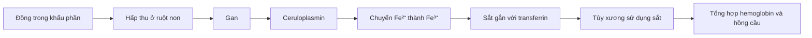
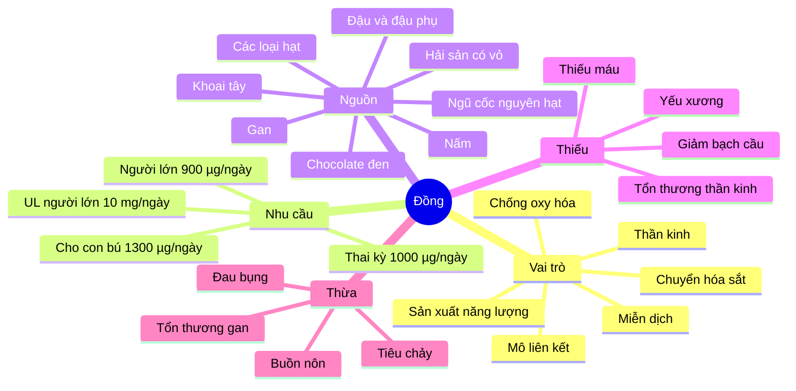

# 080 — Copper

| Thuộc tính          | Nội dung                   |
| ------------------- | -------------------------- |
| **Module**          | Module 08 — Micronutrients |
| **Bài học**         | Copper                     |
| **Thời lượng**      | 01:22                      |
| **Chủ đề chính**    | Đồng                       |
| **Phân loại**       | Khoáng chất vi lượng       |
| **Ký hiệu hóa học** | Cu                         |

> **Ý chính:** Cơ thể chỉ cần đồng với lượng rất nhỏ, nhưng đồng lại tham gia vào hàng loạt quá trình quan trọng như chuyển hóa sắt, tạo năng lượng, tổng hợp mô liên kết, hoạt động thần kinh, miễn dịch và bảo vệ tế bào trước stress oxy hóa.

*Hình 1. Một số nguồn thực phẩm giàu đồng. Ảnh của Keith Weller, USDA Agricultural Research Service, thuộc phạm vi công cộng.*

## Mục lục

1. [Mục tiêu bài học](#1-mục-tiêu-bài-học)
2. [Nội dung chính](#2-nội-dung-chính)
3. [Áp dụng thực tế](#3-áp-dụng-thực-tế)
4. [Lưu ý & lỗi thường gặp](#4-lưu-ý--lỗi-thường-gặp)
5. [Checklist thực hành](#5-checklist-thực-hành)
6. [Tóm tắt](#6-tóm-tắt)

---

## 1. Mục tiêu bài học

Sau bài học này, người học có thể:

* Giải thích vì sao đồng được xếp vào nhóm **khoáng chất vi lượng thiết yếu**.
* Nêu được vai trò của đồng trong chuyển hóa sắt, tạo hồng cầu, sản xuất năng lượng, hệ thần kinh, miễn dịch, xương và mô liên kết.
* Nhận biết các nguồn thực phẩm giàu đồng.
* Ghi nhớ nhu cầu khuyến nghị và giới hạn dung nạp tối đa của đồng.
* Phân biệt biểu hiện thiếu đồng với ngộ độc hoặc tích tụ đồng.
* Hiểu vì sao người khỏe mạnh thường không cần tự bổ sung đồng.

---

## 2. Nội dung chính

### 2.1. Đồng là gì?

Đồng là một **khoáng chất vi lượng thiết yếu**, nghĩa là cơ thể cần nó để hoạt động nhưng chỉ với lượng tính bằng microgam hoặc miligam mỗi ngày.

Đồng không chủ yếu hoạt động dưới dạng tự do. Nó thường được gắn vào các protein và enzyme gọi là **cuproenzyme**. Các enzyme này tham gia vào:

* Sản xuất năng lượng trong ty thể.
* Chuyển hóa và vận chuyển sắt.
* Tổng hợp collagen và elastin của mô liên kết.
* Tổng hợp chất dẫn truyền thần kinh.
* Hoạt động của hệ miễn dịch.
* Hình thành sắc tố.
* Bảo vệ tế bào trước các gốc tự do.

### 2.2. Vai trò của đồng đối với cơ thể

| Vai trò                  | Cơ chế hoặc ý nghĩa                                                                                                                              |
| ------------------------ | ------------------------------------------------------------------------------------------------------------------------------------------------ |
| **Hỗ trợ tạo hồng cầu**  | Đồng hỗ trợ huy động và sử dụng sắt thông qua các protein như ceruloplasmin; vì vậy thiếu đồng có thể gây thiếu máu dù lượng sắt không quá thấp. |
| **Sản xuất năng lượng**  | Đồng là thành phần của cytochrome c oxidase trong chuỗi hô hấp ty thể.                                                                           |
| **Bảo vệ chống oxy hóa** | Enzyme superoxide dismutase chứa đồng giúp trung hòa các gốc superoxide.                                                                         |
| **Duy trì mô liên kết**  | Enzyme lysyl oxidase phụ thuộc đồng, cần thiết cho liên kết chéo collagen và elastin của xương, da và thành mạch.                                |
| **Hệ thần kinh**         | Đồng tham gia tổng hợp chất dẫn truyền thần kinh, phát triển não và duy trì bao myelin.                                                          |
| **Miễn dịch**            | Đồng hỗ trợ sự phát triển và hoạt động bình thường của các tế bào miễn dịch.                                                                     |
| **Sắc tố**               | Enzyme tyrosinase phụ thuộc đồng tham gia hình thành melanin của da và tóc.                                                                      |

Các chức năng này cho thấy đồng không chỉ “tạo hồng cầu” mà còn hoạt động rộng khắp trong chuyển hóa năng lượng, thần kinh, mô liên kết và hệ miễn dịch.

### 2.3. Đồng liên quan đến hồng cầu như thế nào?

Đồng không phải nguyên liệu chính tạo hemoglobin như sắt. Vai trò của đồng mang tính **hỗ trợ chuyển hóa sắt**:

Khi thiếu đồng, sắt có thể không được huy động và vận chuyển hiệu quả. Kết quả là người bệnh có thể xuất hiện **thiếu máu không đáp ứng đầy đủ với việc chỉ bổ sung sắt**.

### 2.4. Hấp thu, vận chuyển và đào thải

Đồng từ thức ăn được hấp thu chủ yếu ở phần trên của ruột non. Protein ATP7A giúp chuyển đồng từ tế bào ruột vào tuần hoàn cửa để tới gan.

Tại gan:

* Đồng được gắn vào ceruloplasmin để vận chuyển tới các mô.
* Một phần được đưa vào các enzyme phụ thuộc đồng.
* Đồng dư thừa được ATP7B vận chuyển vào mật và đào thải qua phân.

Gan và ruột phối hợp điều chỉnh hấp thu – bài tiết để hạn chế cả thiếu đồng lẫn tích tụ đồng.

*Hình 2. Cơ chế vận chuyển đồng qua CTR1, ATOX1, ATP7A và ATP7B. Hình nghiên cứu từ bài tổng quan “Role of Copper on Mitochondrial Function and Metabolism”.*

### 2.5. Nhu cầu đồng khuyến nghị

Bảng dưới sử dụng hệ thống **Dietary Reference Intakes của Hoa Kỳ**:

| Nhóm tuổi hoặc giai đoạn      | Lượng khuyến nghị |
| ----------------------------- | ----------------: |
| Trẻ 1–3 tuổi                  |       340 µg/ngày |
| Trẻ 4–8 tuổi                  |       440 µg/ngày |
| Trẻ 9–13 tuổi                 |       700 µg/ngày |
| Thanh thiếu niên 14–18 tuổi   |       890 µg/ngày |
| Người trưởng thành từ 19 tuổi |   **900 µg/ngày** |
| Mang thai                     |     1.000 µg/ngày |
| Cho con bú                    |     1.300 µg/ngày |

`1 mg = 1.000 µg`

Giới hạn dung nạp tối đa đối với người trưởng thành là **10 mg/ngày**, tương đương 10.000 µg/ngày, tính từ tổng thực phẩm và thực phẩm bổ sung. Đây là **giới hạn an toàn**, không phải mục tiêu cần đạt mỗi ngày.

### 2.6. Nguồn thực phẩm giàu đồng

| Thực phẩm                      | Khẩu phần tham khảo | Đồng ước tính |
| ------------------------------ | ------------------: | ------------: |
| Gan bò áp chảo                 |                85 g |     12.400 µg |
| Hàu nấu chín                   |                85 g |      4.850 µg |
| Chocolate làm bánh không đường |                28 g |        938 µg |
| Khoai tây cả vỏ                |            1 củ vừa |        675 µg |
| Nấm hương nấu chín             |               ½ cốc |        650 µg |
| Hạt điều rang                  |                28 g |        629 µg |
| Hạt hướng dương rang           |               ¼ cốc |        615 µg |
| Chocolate đen 70–85%           |                28 g |        501 µg |
| Đậu phụ cứng                   |               ½ cốc |        476 µg |
| Đậu gà nấu chín                |               ½ cốc |        289 µg |
| Cá hồi nấu chín                |                85 g |        273 µg |
| Mì nguyên cám nấu chín         |               1 cốc |        263 µg |
| Bơ                             |               ½ cốc |        219 µg |
| Rau chân vịt nấu chín          |               ½ cốc |        157 µg |

Hải sản có vỏ, nội tạng, các loại hạt, hạt giống, cacao, ngũ cốc nguyên hạt và một số loại đậu là những nhóm thực phẩm cung cấp đồng đáng kể.

> **Lưu ý:** Gan chứa lượng đồng rất cao. Một khẩu phần 85 g có thể vượt giới hạn 10 mg/ngày, vì vậy không nên coi gan là thực phẩm cần ăn hằng ngày để “bổ sung vi chất”.

### 2.7. Thiếu đồng

Thiếu đồng tương đối hiếm ở người khỏe mạnh có chế độ ăn đa dạng. Nguy cơ cao hơn ở:

* Người mắc bệnh gây kém hấp thu như celiac hoặc Crohn.
* Người từng phẫu thuật giảm cân hoặc phẫu thuật đường tiêu hóa.
* Người sử dụng liều kẽm cao trong thời gian dài.
* Trẻ sinh non hoặc suy dinh dưỡng nặng.
* Người mắc rối loạn di truyền Menkes.

#### Biểu hiện có thể gặp

* Mệt mỏi, yếu sức.
* Thiếu máu.
* Giảm bạch cầu trung tính và tăng nguy cơ nhiễm trùng.
* Tê, châm chích hoặc mất cảm giác ở tay chân.
* Yếu cơ, mất thăng bằng hoặc phối hợp vận động kém.
* Giảm sắc tố da hoặc tóc.
* Xương yếu, giảm khoáng hóa xương hoặc loãng xương.
* Trường hợp nặng có thể gây tổn thương tủy sống và thần kinh.

> Tiêu chảy kéo dài thường là **yếu tố nguy cơ dẫn đến thiếu đồng do kém hấp thu**, không phải dấu hiệu đặc hiệu để tự chẩn đoán thiếu đồng.

### 2.8. Thừa đồng và độc tính

Ở người khỏe mạnh, ngộ độc đồng từ thực phẩm thông thường hiếm gặp. Nguy cơ thường liên quan đến:

* Dùng thực phẩm bổ sung liều cao.
* Nước uống bị nhiễm đồng từ đường ống.
* Tiếp xúc nghề nghiệp hoặc hóa chất.
* Rối loạn di truyền Wilson khiến cơ thể không đào thải đồng bình thường.

#### Biểu hiện của phơi nhiễm đồng quá mức

* Đau hoặc co thắt bụng.
* Buồn nôn và nôn.
* Tiêu chảy.
* Tổn thương gan khi phơi nhiễm kéo dài.
* Trường hợp nặng có thể gây viêm gan, suy gan hoặc tan máu.

Trong bệnh Wilson, đồng có thể tích tụ tại gan, não và các cơ quan khác, gây triệu chứng gan, thần kinh hoặc tâm thần. Tuy nhiên, không nên đồng nhất các biểu hiện như trầm cảm, cáu gắt hay run với tình trạng “ăn hơi nhiều đồng” ở một người khỏe mạnh; chúng cần được bác sĩ đánh giá trong bối cảnh lâm sàng phù hợp.

---

## 3. Áp dụng thực tế

### 3.1. Ưu tiên đồng từ thực phẩm

Một người trưởng thành có thể đạt gần mức khuyến nghị bằng những kết hợp đơn giản:

| Kết hợp thực phẩm                         | Đồng ước tính |
| ----------------------------------------- | ------------: |
| 28 g hạt điều + ½ cốc đậu gà              | Khoảng 918 µg |
| 1 củ khoai tây cả vỏ + ½ cốc rau chân vịt | Khoảng 832 µg |
| ½ cốc đậu phụ + 28 g chocolate đen        | Khoảng 977 µg |
| ½ cốc nấm hương + ½ quả bơ                | Khoảng 869 µg |

Các giá trị chỉ mang tính tham khảo vì hàm lượng thực tế phụ thuộc vào giống thực phẩm, kích thước khẩu phần và phương pháp chế biến. Dù vậy, chúng cho thấy một chế độ ăn đa dạng thường có thể đáp ứng nhu cầu đồng mà không cần viên bổ sung.

### 3.2. Gợi ý cho người ăn thực vật

Nguồn đồng thực vật phù hợp gồm:

* Hạt điều, hạt hướng dương và hạt vừng.
* Đậu phụ, đậu gà và các loại đậu.
* Nấm hương.
* Khoai tây ăn cả vỏ.
* Ngũ cốc nguyên hạt.
* Cacao và chocolate đen.
* Rau lá xanh.

Một khẩu phần hạt kết hợp với đậu, ngũ cốc nguyên hạt và rau thường đã cung cấp lượng đồng đáng kể.

### 3.3. Khi nào cần cân nhắc xét nghiệm?

Không nên chẩn đoán thiếu đồng chỉ dựa vào triệu chứng vì thiếu đồng có thể giống thiếu sắt hoặc vitamin B12.

Bác sĩ có thể cân nhắc đánh giá đồng khi người bệnh có:

* Thiếu máu không cải thiện như dự kiến sau bổ sung sắt.
* Giảm bạch cầu không rõ nguyên nhân.
* Triệu chứng thần kinh kèm tiền sử phẫu thuật dạ dày – ruột.
* Kém hấp thu kéo dài.
* Sử dụng kẽm liều cao.
* Nghi ngờ bệnh Wilson hoặc Menkes.

Xét nghiệm thường bao gồm đồng huyết thanh và ceruloplasmin, nhưng các chỉ số này có thể bị ảnh hưởng bởi thai kỳ, estrogen, viêm, nhiễm trùng và một số bệnh khác; kết quả cần được diễn giải trong bối cảnh lâm sàng.

---

## 4. Lưu ý & lỗi thường gặp

### Lỗi 1: “Càng bổ sung nhiều đồng càng tạo được nhiều hồng cầu”

**Không đúng.** Đồng chỉ hỗ trợ chuyển hóa sắt và nhiều enzyme khác. Bổ sung vượt nhu cầu không làm tăng hồng cầu ở người không thiếu đồng và có thể gây độc.

### Lỗi 2: “Thiếu máu thì nên uống cả sắt lẫn đồng”

Không nên bổ sung đồng theo suy đoán. Thiếu máu có nhiều nguyên nhân như thiếu sắt, thiếu vitamin B12, thiếu folate, viêm mạn tính, mất máu hoặc bệnh tủy xương.

### Lỗi 3: “Ăn gan mỗi ngày là cách tốt nhất để đủ đồng”

Gan rất giàu đồng. Ăn khẩu phần lớn hoặc thường xuyên có thể đưa lượng đồng vượt xa nhu cầu, đồng thời làm tăng lượng vitamin A dạng retinol.

### Lỗi 4: “Dùng nhiều kẽm không ảnh hưởng tới đồng”

Kẽm liều cao kích thích metallothionein trong tế bào ruột. Protein này giữ đồng lại trong tế bào, khiến đồng bị thải ra khi tế bào ruột bong đi. Vì vậy, dùng kẽm liều cao kéo dài có thể gây thiếu đồng.

### Lỗi 5: Nhầm bệnh Wilson với ngộ độc đồng thông thường

Bệnh Wilson là rối loạn di truyền do đột biến ATP7B, khiến gan không đào thải đồng đúng cách. Đây không phải hậu quả đơn giản của việc thỉnh thoảng ăn thực phẩm giàu đồng.

### Lỗi 6: Tự uống viên đồng để “tăng năng lượng” hoặc “chống oxy hóa”

Người khỏe mạnh thường nhận đủ đồng từ thức ăn. Viên đồng chỉ nên dùng khi có chỉ định rõ ràng, đặc biệt vì một số sản phẩm có thể chứa lượng đồng cao gấp nhiều lần nhu cầu hằng ngày.

---

## 5. Checklist thực hành

* [ ] Tôi biết nhu cầu đồng của người trưởng thành là khoảng **900 µg/ngày**.
* [ ] Tôi phân biệt được microgam với miligam: **1 mg = 1.000 µg**.
* [ ] Tôi ưu tiên thực phẩm thay vì tự dùng viên bổ sung đồng.
* [ ] Tôi thường xuyên ăn ít nhất một nguồn đồng như hạt, đậu, nấm, ngũ cốc nguyên hạt hoặc hải sản.
* [ ] Tôi không sử dụng gan với khẩu phần lớn mỗi ngày.
* [ ] Tôi kiểm tra hàm lượng đồng và kẽm trên nhãn multivitamin.
* [ ] Tôi không dùng kẽm liều cao kéo dài mà không có hướng dẫn chuyên môn.
* [ ] Tôi không tự kết luận thiếu đồng chỉ từ mệt mỏi hoặc thiếu máu.
* [ ] Tôi trao đổi với bác sĩ nếu có kém hấp thu, phẫu thuật giảm cân hoặc triệu chứng thần kinh không rõ nguyên nhân.
* [ ] Tôi nhớ rằng giới hạn **10 mg/ngày** là mức tối đa, không phải mức khuyến nghị.

---

## 6. Tóm tắt

* Đồng là khoáng chất vi lượng nhưng có vai trò lớn trong chuyển hóa sắt, tạo năng lượng, mô liên kết, thần kinh, miễn dịch và chống oxy hóa.
* Người trưởng thành cần khoảng **900 µg đồng mỗi ngày**.
* Nguồn tốt gồm hải sản có vỏ, hạt, đậu, nấm, khoai tây, cacao, ngũ cốc nguyên hạt và nội tạng.
* Thiếu đồng hiếm nhưng có thể gây thiếu máu, giảm bạch cầu, yếu xương và tổn thương thần kinh.
* Dùng kẽm liều cao kéo dài là một nguyên nhân quan trọng gây thiếu đồng.
* Đồng dư thừa có thể gây triệu chứng tiêu hóa và tổn thương gan.
* Phần lớn người khỏe mạnh không cần bổ sung đồng nếu có chế độ ăn đa dạng.
