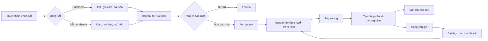
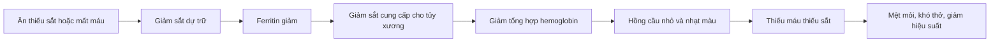

# 081 — Iron

| Thuộc tính          | Nội dung                                                     |
| ------------------- | ------------------------------------------------------------ |
| **Module**          | Module 08 — Micronutrients                                   |
| **Bài học**         | Iron                                                         |
| **Thời lượng**      | 00:58                                                        |
| **Chủ đề chính**    | Sắt                                                          |
| **Ký hiệu hóa học** | Fe                                                           |
| **Vai trò nổi bật** | Tạo hemoglobin, vận chuyển oxy, hỗ trợ chuyển hóa năng lượng |

> **Lưu ý:** Nội dung mang mục đích giáo dục dinh dưỡng, không thay thế việc khám, xét nghiệm hoặc chỉ định bổ sung sắt từ bác sĩ.

## Mục lục

1. [Mục tiêu bài học](#1-mục-tiêu-bài-học)
2. [Nội dung chính](#2-nội-dung-chính)
3. [Áp dụng thực tế](#3-áp-dụng-thực-tế)
4. [Lưu ý & lỗi thường gặp](#4-lưu-ý--lỗi-thường-gặp)
5. [Checklist thực hành](#5-checklist-thực-hành)
6. [Tóm tắt](#6-tóm-tắt)

---

## 1. Mục tiêu bài học

Sau bài học này, người học có thể:

* Giải thích vai trò của sắt trong **hemoglobin**, **myoglobin** và chuyển hóa năng lượng.
* Phân biệt **sắt heme** và **sắt non-heme**.
* Nhận biết các nguồn thực phẩm giàu sắt.
* Nắm được nhu cầu sắt cơ bản của nam, nữ, phụ nữ mang thai và người ăn thực vật.
* Nhận biết nhóm có nguy cơ thiếu sắt và các triệu chứng thường gặp.
* Biết cách kết hợp thực phẩm để tăng khả năng hấp thu sắt.
* Hiểu vì sao không nên tự bổ sung sắt khi chưa xác định nguyên nhân.

---

## 2. Nội dung chính

### 2.1. Sắt là gì?

Sắt là một khoáng chất thiết yếu mà cơ thể cần để tạo:

* **Hemoglobin:** protein trong hồng cầu vận chuyển oxy từ phổi đến các mô.
* **Myoglobin:** protein dự trữ và cung cấp oxy cho cơ bắp.
* Một số enzyme và hormone tham gia vào tăng trưởng, phát triển và chuyển hóa tế bào.

Khi cơ thể không có đủ sắt, lượng hemoglobin có thể giảm, khiến khả năng vận chuyển oxy suy yếu. Hậu quả thường thấy là mệt mỏi, giảm khả năng tập trung và giảm hiệu suất vận động.

### 2.2. Cấu trúc hemoglobin

*Hình 1. Mô hình ba chiều của oxyhemoglobin người, được xây dựng từ dữ liệu Protein Data Bank 2DN1. Hình được phát hành theo giấy phép CC0.*

Mỗi phân tử hemoglobin chứa các nhóm **heme** có nguyên tử sắt ở trung tâm. Sắt trong nhóm heme có khả năng liên kết thuận nghịch với oxy, cho phép hồng cầu nhận oxy ở phổi và giải phóng oxy tại các mô.

### 2.3. Sơ đồ hấp thu, vận chuyển và tái chế sắt

Cơ thể không có một cơ chế bài tiết sắt chủ động và được điều hòa chặt chẽ. Cân bằng sắt chủ yếu được kiểm soát thông qua hấp thu tại ruột và tái chế sắt từ hồng cầu già. Một lượng nhỏ sắt bị mất qua bong tế bào ruột, tế bào da, mồ hôi và mất máu.

### 2.4. Sắt heme và sắt non-heme

| Đặc điểm                      | Sắt heme                   | Sắt non-heme                                           |
| ----------------------------- | -------------------------- | ------------------------------------------------------ |
| **Nguồn chính**               | Thịt, gia cầm, cá, hải sản | Đậu, rau, hạt, ngũ cốc, thực phẩm tăng cường           |
| **Khả năng hấp thu**          | Thường cao và ổn định hơn  | Thấp hơn và chịu ảnh hưởng nhiều bởi thành phần bữa ăn |
| **Ảnh hưởng của vitamin C**   | Không đáng kể bằng         | Vitamin C giúp tăng hấp thu rõ rệt                     |
| **Ảnh hưởng của trà, cà phê** | Ít hơn                     | Có thể làm giảm hấp thu khi dùng gần bữa ăn            |

Sắt non-heme là dạng chủ yếu trong thực phẩm có nguồn gốc thực vật. Vitamin C giúp giữ sắt ở dạng dễ hòa tan và dễ được tế bào ruột hấp thu hơn.

### 2.5. Nhu cầu sắt mỗi ngày

Các mức dưới đây là lượng khuyến nghị theo hệ thống Dietary Reference Intakes được NIH sử dụng:

| Nhóm                      | Lượng sắt khuyến nghị |
| ------------------------- | --------------------: |
| Nam giới 19–50 tuổi       |         **8 mg/ngày** |
| Nữ giới 19–50 tuổi        |        **18 mg/ngày** |
| Người từ 51 tuổi trở lên  |         **8 mg/ngày** |
| Phụ nữ mang thai          |        **27 mg/ngày** |
| Phụ nữ đang cho con bú    |         **9 mg/ngày** |
| Nam thiếu niên 14–18 tuổi |        **11 mg/ngày** |
| Nữ thiếu niên 14–18 tuổi  |        **15 mg/ngày** |

Người ăn chay hoặc ăn thuần thực vật có thể cần lượng sắt trong khẩu phần **gần gấp đôi**, do sắt non-heme được hấp thu kém hơn sắt heme. Đây là mức tham khảo dinh dưỡng, không phải liều thuốc điều trị thiếu sắt.

### 2.6. Nguồn thực phẩm giàu sắt

#### Nguồn động vật

* Thịt bò và các loại thịt đỏ.
* Gan và nội tạng — giàu sắt nhưng không cần ăn thường xuyên.
* Thịt gà, thịt gia cầm.
* Cá, hàu, nghêu và các loại hải sản.

#### Nguồn thực vật

* Đậu lăng, đậu trắng, đậu đỏ và đậu Hà Lan.
* Đậu phụ và các sản phẩm từ đậu nành.
* Rau lá xanh đậm như rau bina.
* Hạt điều, hạt bí, hạt mè và các loại hạt khác.
* Trái cây sấy khô.
* Ngũ cốc ăn sáng, bánh mì hoặc sản phẩm được tăng cường sắt.

NIH liệt kê thịt nạc, hải sản, gia cầm, ngũ cốc tăng cường, đậu, rau bina, các loại hạt và trái cây sấy khô là những nguồn sắt phổ biến.

### 2.7. Các yếu tố ảnh hưởng đến hấp thu

#### Yếu tố giúp tăng hấp thu

* Kết hợp thực phẩm thực vật giàu sắt với **vitamin C**.
* Ăn đậu cùng ớt chuông, cà chua, cam, quýt, ổi hoặc bông cải xanh.
* Kết hợp nguồn sắt non-heme với một lượng thịt, cá hoặc gia cầm trong cùng bữa ăn.
* Ngâm, nảy mầm hoặc lên men đậu và ngũ cốc có thể giúp giảm một phần phytate.

#### Yếu tố có thể làm giảm hấp thu

* Trà và cà phê dùng cùng hoặc ngay sát bữa ăn.
* Lượng phytate cao trong một số loại ngũ cốc và đậu chưa qua xử lý.
* Bổ sung canxi và sắt cùng thời điểm.
* Thuốc làm giảm acid dạ dày có thể hạn chế hấp thu sắt non-heme ở một số người.

Vitamin C là một trong những chất hỗ trợ hấp thu sắt non-heme được nghiên cứu rõ nhất. Canxi, trà và một số thành phần thực vật có thể cạnh tranh hoặc tạo phức với sắt, làm giảm lượng được hấp thu.

### 2.8. Ai có nguy cơ thiếu sắt cao hơn?

Những nhóm cần đặc biệt chú ý gồm:

* Nữ giới có kinh nguyệt nhiều hoặc kéo dài.
* Phụ nữ mang thai và sau sinh.
* Trẻ sinh non hoặc nhẹ cân.
* Trẻ nhỏ trong giai đoạn tăng trưởng nhanh.
* Người hiến máu thường xuyên.
* Người không ăn thịt, gia cầm hoặc hải sản.
* Người mắc bệnh đường tiêu hóa gây kém hấp thu.
* Người có chảy máu đường tiêu hóa hoặc mất máu kéo dài.
* Người mắc một số bệnh viêm mạn tính, ung thư hoặc suy tim.

> Nhận định “thiếu sắt hiếm gặp tại các nước phát triển” là quá khái quát. Thiếu sắt vẫn có thể phổ biến ở phụ nữ trong độ tuổi sinh sản, phụ nữ mang thai, trẻ nhỏ, người hiến máu và người có bệnh lý gây mất máu hoặc kém hấp thu. Trên phạm vi toàn cầu, thiếu sắt vẫn là một nguyên nhân quan trọng của thiếu máu.

### 2.9. Biểu hiện của thiếu sắt

Thiếu sắt có thể tiến triển âm thầm. Giai đoạn đầu, cơ thể sử dụng lượng sắt dự trữ nên người bệnh có thể chưa xuất hiện triệu chứng rõ ràng.

Khi thiếu sắt trở nên nghiêm trọng hơn, các biểu hiện có thể gồm:

* Mệt mỏi, suy nhược và thiếu năng lượng.
* Khó tập trung, suy giảm trí nhớ hoặc hiệu suất học tập.
* Giảm khả năng lao động và tập luyện.
* Chóng mặt, đau đầu.
* Khó thở khi gắng sức.
* Da hoặc niêm mạc nhợt.
* Tim đập nhanh hoặc hồi hộp.
* Tay chân lạnh.
* Giảm khả năng chống lại nhiễm trùng.

Các triệu chứng trên không đặc hiệu cho thiếu sắt và cũng có thể xuất hiện trong nhiều bệnh lý khác.

### 2.10. Từ thiếu sắt đến thiếu máu

Thiếu sắt và thiếu máu không hoàn toàn đồng nghĩa:

* Một người có thể **thiếu sắt nhưng hemoglobin vẫn chưa giảm**.
* Thiếu máu có thể do nhiều nguyên nhân ngoài thiếu sắt, như thiếu vitamin B12, thiếu folate, viêm mạn tính, bệnh thận hoặc bệnh hemoglobin di truyền.

### 2.11. Ảnh nghiên cứu: tiêu bản máu thiếu sắt

*Hình 2. Tiêu bản máu nhuộm Giemsa của một trường hợp thiếu máu thiếu sắt. Nhiều hồng cầu có vùng sáng trung tâm lớn, kích thước nhỏ hoặc không đồng đều. Ảnh của Dr Graham Beards, giấy phép CC BY-SA 3.0.*

### 2.12. Xét nghiệm đánh giá tình trạng sắt

Bác sĩ có thể cân nhắc kết hợp:

| Xét nghiệm                 | Ý nghĩa khái quát                                    |
| -------------------------- | ---------------------------------------------------- |
| **Công thức máu — CBC**    | Đánh giá hemoglobin, số lượng và kích thước hồng cầu |
| **Ferritin huyết thanh**   | Phản ánh lượng sắt dự trữ                            |
| **Độ bão hòa transferrin** | Đánh giá lượng sắt đang được vận chuyển              |
| **Serum iron và TIBC**     | Hỗ trợ phân biệt các nguyên nhân thiếu máu           |
| **CRP hoặc dấu ấn viêm**   | Hỗ trợ diễn giải ferritin khi có viêm                |

Ferritin thấp thường hỗ trợ mạnh cho chẩn đoán thiếu sắt. Tuy nhiên, ferritin có thể tăng khi cơ thể đang viêm hoặc nhiễm trùng, vì vậy một kết quả ferritin “bình thường” không phải lúc nào cũng loại trừ được thiếu sắt. Kết quả cần được diễn giải cùng triệu chứng, công thức máu và tình trạng viêm.

---

## 3. Áp dụng thực tế

### 3.1. Công thức xây dựng một bữa ăn hỗ trợ hấp thu sắt

> **Nguồn sắt + vitamin C + protein đầy đủ − trà/cà phê sát bữa**

Ví dụ:

| Bữa ăn                              | Cách kết hợp                           |
| ----------------------------------- | -------------------------------------- |
| Cơm, thịt bò, bông cải xanh         | Sắt heme kết hợp rau giàu vitamin C    |
| Đậu lăng, cà chua, ớt chuông        | Vitamin C hỗ trợ hấp thu sắt non-heme  |
| Đậu phụ, rau cải và cam tráng miệng | Phù hợp cho chế độ ăn thực vật         |
| Ngũ cốc tăng cường sắt với dâu tây  | Nguồn sắt tăng cường kết hợp vitamin C |
| Nghêu hoặc cá với rau xanh          | Cung cấp sắt cùng protein và vi chất   |

### 3.2. Ví dụ thực đơn một ngày

#### Bữa sáng

* Yến mạch hoặc ngũ cốc tăng cường sắt.
* Dâu tây, cam hoặc ổi.
* Trứng hoặc sữa chua tùy nhu cầu.

#### Bữa trưa

* Cơm.
* Thịt bò, thịt gà hoặc đậu phụ.
* Rau cải xào và cà chua.
* Trái cây giàu vitamin C.

#### Bữa phụ

* Hạt bí hoặc hạt điều.
* Trái cây tươi.

#### Bữa tối

* Cá, hải sản, đậu lăng hoặc đậu đỏ.
* Rau xanh và ớt chuông.
* Không uống trà hoặc cà phê ngay sau bữa ăn nếu đang có nguy cơ thiếu sắt.

### 3.3. Khi nào nên đi kiểm tra?

Nên trao đổi với bác sĩ khi có một hoặc nhiều dấu hiệu sau:

* Mệt kéo dài dù ngủ đủ.
* Khó thở, chóng mặt hoặc hồi hộp khi vận động nhẹ.
* Da và niêm mạc nhợt.
* Kinh nguyệt rất nhiều hoặc kéo dài.
* Phân đen, có máu trong phân hoặc nghi ngờ chảy máu.
* Đang mang thai hoặc chuẩn bị mang thai.
* Ăn thuần thực vật và thường xuyên mệt mỏi.
* Đã bổ sung sắt nhưng triệu chứng không cải thiện.

Thiếu máu là biểu hiện của một vấn đề nền, vì vậy cần tìm nguyên nhân thay vì chỉ cố nâng chỉ số hemoglobin.

---

## 4. Lưu ý & lỗi thường gặp

### 4.1. Tự uống sắt chỉ vì cảm thấy mệt

Mệt mỏi có thể xuất phát từ thiếu ngủ, stress, bệnh tuyến giáp, thiếu vitamin B12, bệnh mạn tính hoặc nhiều nguyên nhân khác. Không nên dùng triệu chứng đơn lẻ để kết luận thiếu sắt.

**Cách đúng:** đánh giá khẩu phần, yếu tố nguy cơ và thực hiện xét nghiệm khi cần thiết.

### 4.2. Cho rằng tất cả phụ nữ đều cần uống sắt

Phụ nữ có nhu cầu trung bình cao hơn nam giới do mất máu kinh nguyệt, nhưng không phải ai cũng cần viên sắt. Nhu cầu bổ sung phụ thuộc vào khẩu phần, lượng máu mất, thai kỳ và kết quả xét nghiệm.

### 4.3. Cho rằng ăn rau bina là đủ

Rau bina chứa sắt nhưng chủ yếu là sắt non-heme và đồng thời chứa các chất có thể hạn chế hấp thu. Cần đa dạng nguồn sắt và kết hợp vitamin C thay vì phụ thuộc vào một thực phẩm.

### 4.4. Uống trà hoặc cà phê ngay sau bữa giàu sắt

Polyphenol trong trà và cà phê có thể làm giảm hấp thu sắt non-heme. Người có nguy cơ thiếu sắt nên tách các đồ uống này khỏi bữa ăn giàu sắt một khoảng thời gian hợp lý.

### 4.5. Uống sắt cùng canxi hoặc một số thuốc

Canxi có thể cản trở hấp thu sắt. Viên sắt cũng có thể tương tác với levothyroxine, levodopa và một số thuốc khác. Thuốc ức chế bơm proton làm giảm acid dạ dày cũng có thể hạn chế hấp thu sắt non-heme.

### 4.6. Nghĩ rằng uống càng nhiều càng tốt

Liều sắt cao có thể gây:

* Buồn nôn.
* Táo bón hoặc tiêu chảy.
* Đau bụng.
* Nôn.
* Kích ứng hoặc tổn thương niêm mạc tiêu hóa.

Giới hạn dung nạp tối đa đối với người trưởng thành khỏe mạnh là **45 mg/ngày từ tất cả các nguồn**, nhưng bác sĩ có thể chỉ định liều cao hơn trong thời gian nhất định để điều trị thiếu sắt. Không được dùng giới hạn này thay cho liều điều trị cá nhân.

### 4.7. Để viên sắt trong tầm với của trẻ em

Ngộ độc sắt cấp có thể gây tổn thương cơ quan, co giật, hôn mê và tử vong. Viên sắt phải được cất trong bao bì an toàn, ngoài tầm với của trẻ nhỏ.

### 4.8. Bổ sung sắt khi cơ thể đang thừa sắt

Người mắc bệnh **ứ sắt di truyền — hemochromatosis** có thể tích tụ sắt tại gan, tim và các cơ quan khác. Những người này không nên tự dùng sắt hoặc vitamin C liều cao nếu chưa có hướng dẫn chuyên môn.

---

## 5. Checklist thực hành

### Đánh giá khẩu phần

* [ ] Tôi có ăn thực phẩm giàu sắt mỗi ngày hoặc thường xuyên.
* [ ] Tôi luân phiên nguồn động vật và nguồn thực vật.
* [ ] Nếu ăn thực vật, tôi chú ý đến nguy cơ hấp thu sắt thấp hơn.
* [ ] Tôi đọc nhãn để nhận biết thực phẩm tăng cường sắt.

### Tối ưu hấp thu

* [ ] Tôi kết hợp đậu, rau hoặc ngũ cốc giàu sắt với vitamin C.
* [ ] Tôi hạn chế trà và cà phê ngay sát bữa giàu sắt.
* [ ] Tôi không tự ý uống sắt cùng viên canxi.
* [ ] Tôi kiểm tra tương tác nếu đang sử dụng thuốc điều trị.

### Nhận biết nguy cơ

* [ ] Tôi chú ý đến lượng máu mất trong kỳ kinh.
* [ ] Tôi báo với bác sĩ nếu thường xuyên hiến máu.
* [ ] Tôi không bỏ qua các dấu hiệu chảy máu tiêu hóa.
* [ ] Tôi trao đổi với bác sĩ về nhu cầu sắt khi mang thai.

### Sử dụng viên bổ sung an toàn

* [ ] Tôi không uống sắt chỉ dựa trên cảm giác mệt.
* [ ] Tôi biết lượng **sắt nguyên tố** trong sản phẩm, không chỉ nhìn khối lượng hợp chất.
* [ ] Tôi tuân thủ liều và thời gian điều trị được chỉ định.
* [ ] Tôi cất viên sắt ngoài tầm với của trẻ em.
* [ ] Tôi tái khám hoặc xét nghiệm lại theo hướng dẫn.

---

## 6. Tóm tắt

> **Sắt là thành phần thiết yếu của hemoglobin, giúp máu vận chuyển oxy đến các mô và duy trì khả năng tạo năng lượng.**

* Sắt có hai dạng chính: **heme** và **non-heme**.
* Sắt heme từ thực phẩm động vật thường được hấp thu tốt hơn.
* Vitamin C giúp tăng hấp thu sắt non-heme từ thực vật.
* Nhu cầu tham khảo là **8 mg/ngày đối với nam 19–50 tuổi** và **18 mg/ngày đối với nữ 19–50 tuổi**.
* Phụ nữ mang thai cần khoảng **27 mg/ngày** theo khuyến nghị NIH.
* Người có kinh nguyệt nhiều, phụ nữ mang thai, trẻ nhỏ, người hiến máu và người mắc bệnh tiêu hóa có nguy cơ thiếu sắt cao hơn.
* Thiếu sắt có thể gây mệt mỏi, giảm tập trung, khó thở và giảm hiệu suất vận động.
* **Thiếu máu không phải lúc nào cũng do thiếu sắt**, và thiếu sắt có thể tồn tại trước khi hemoglobin giảm.
* Không nên tự bổ sung sắt kéo dài khi chưa đánh giá nguyên nhân và tình trạng dự trữ sắt.

## Tài liệu tham khảo chính

1. NIH Office of Dietary Supplements — Iron Fact Sheet for Consumers.
2. World Health Organization — Anaemia Fact Sheet.
3. WHO — Hướng dẫn sử dụng ferritin để đánh giá tình trạng sắt.
4. Piskin và cộng sự — Tổng quan các yếu tố ảnh hưởng đến hấp thu sắt.
5. British Society of Gastroenterology — Hướng dẫn quản lý thiếu máu thiếu sắt ở người trưởng thành.

---

# Bài luyện tập

## Mục tiêu

## Đề bài

## Yêu cầu hoàn thành

- [ ] 
- [ ] 
- [ ] 

## Kết quả / lời giải

## Ghi chú
