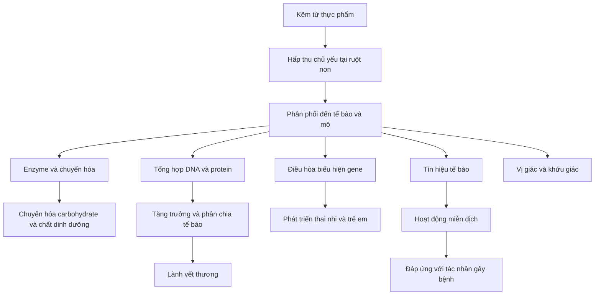
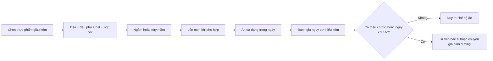

# 082 — Zinc

| Thuộc tính          | Nội dung                       |
| ------------------- | ------------------------------ |
| **Module**          | Module 08 — Micronutrients     |
| **Bài học**         | Zinc                           |
| **Thời lượng**      | 01:32                          |
| **Chủ đề chính**    | Kẽm                            |
| **Ký hiệu hóa học** | Zn                             |
| **Phân loại**       | Khoáng chất vi lượng thiết yếu |

> **Hiệu đính bản chép lời:** “fight AIDS/five states” là lỗi nhận dạng giọng nói. Thuật ngữ đúng là **phytates/phytate — phytat**, hợp chất trong ngũ cốc nguyên cám, hạt và các loại đậu có thể liên kết với kẽm, làm giảm tỷ lệ kẽm được hấp thu.

## Mục lục

1. [Mục tiêu bài học](#1-mục-tiêu-bài-học)
2. [Nội dung chính](#2-nội-dung-chính)
3. [Áp dụng thực tế](#3-áp-dụng-thực-tế)
4. [Lưu ý & lỗi thường gặp](#4-lưu-ý--lỗi-thường-gặp)
5. [Checklist thực hành](#5-checklist-thực-hành)
6. [Tóm tắt](#6-tóm-tắt)

---

## 1. Mục tiêu bài học

Sau bài học, người học có thể:

* Trình bày được những chức năng chính của kẽm đối với cơ thể.
* Nhận biết các nguồn thực phẩm giàu kẽm từ động vật và thực vật.
* Giải thích vì sao kẽm trong thực vật thường được hấp thu kém hơn.
* Ghi nhớ nhu cầu kẽm hằng ngày và ngưỡng dung nạp tối đa.
* Phân biệt việc **đáp ứng nhu cầu kẽm** với việc dùng kẽm như một phương pháp điều trị.
* Sử dụng thực phẩm bổ sung kẽm thận trọng, tránh dư thừa và tương tác thuốc.

---

## 2. Nội dung chính

### 2.1. Kẽm là gì?

Kẽm là khoáng chất vi lượng thiết yếu có mặt trong các tế bào khắp cơ thể. Nó tham gia vào hoạt động của nhiều enzyme, protein điều hòa và quá trình truyền tín hiệu tế bào.

Kẽm đặc biệt quan trọng đối với:

* Hoạt động bình thường của hệ miễn dịch.
* Tổng hợp protein và DNA.
* Phân chia, tăng trưởng và biệt hóa tế bào.
* Phát triển cơ thể trong thai kỳ, thời thơ ấu và tuổi vị thành niên.
* Cảm nhận mùi và vị.
* Duy trì da, niêm mạc và quá trình lành vết thương.
* Chuyển hóa chất dinh dưỡng và bảo vệ tế bào trước stress oxy hóa. ([ODS][1])

Cơ thể có nhiều kẽm trong cơ, xương và các mô khác, nhưng không có một **kho dự trữ chuyên biệt, dễ huy động** giống như kho sắt. Vì vậy, kẽm cần được cung cấp đều đặn từ chế độ ăn. Điều này không có nghĩa là phải uống viên kẽm mỗi ngày; phần lớn người khỏe mạnh có thể đáp ứng nhu cầu bằng thực phẩm đa dạng. ([ODS][1])

---

### 2.2. Sơ đồ vai trò của kẽm

Kẽm cũng liên quan đến quá trình tổng hợp, lưu trữ và truyền tín hiệu của insulin. Tuy nhiên, điều này **không đồng nghĩa** rằng bổ sung kẽm sẽ tự động cải thiện đường huyết ở người không thiếu kẽm.

---

### 2.3. Kẽm và hệ miễn dịch

Kẽm giúp duy trì hàng rào da và niêm mạc, đồng thời tham gia vào sự phát triển và hoạt động của nhiều tế bào miễn dịch. Thiếu kẽm có thể làm suy giảm cả miễn dịch bẩm sinh lẫn miễn dịch thích ứng.

Cần phân biệt:

* **Đủ kẽm:** cần thiết để hệ miễn dịch hoạt động bình thường.
* **Uống càng nhiều càng tốt:** không đúng.
* **Bổ sung khi không thiếu:** chưa chắc tạo thêm lợi ích và có thể gây tác dụng phụ nếu liều cao kéo dài. ([PubMed Central (PMC)][2])

---

### 2.4. Kẽm và quá trình lành vết thương

Kẽm tham gia nhiều giai đoạn của quá trình sửa chữa mô:

1. Điều hòa phản ứng viêm sau tổn thương.
2. Hỗ trợ hoạt động của tế bào miễn dịch tại vết thương.
3. Thúc đẩy tăng sinh và di chuyển của tế bào biểu mô.
4. Tham gia tổng hợp protein và cấu trúc chất nền ngoại bào.
5. Hỗ trợ tái tạo mô và hình thành sẹo.

Thiếu kẽm có liên quan đến chậm biểu mô hóa, giảm sức bền của mô và chậm lành vết thương. Tuy nhiên, ở người không thiếu kẽm, dùng liều cao không mặc nhiên làm vết thương lành nhanh hơn. ([MDPI][3])

#### Hình nghiên cứu: vai trò của kẽm trong các giai đoạn lành vết thương

*Nguồn: Lin và cộng sự, “Zinc in Wound Healing Modulation”, Nutrients. Hình minh họa các giai đoạn cầm máu, viêm, tăng sinh và tái cấu trúc mô.* ([MDPI][3])

---

### 2.5. Nhu cầu kẽm hằng ngày

| Nhóm đối tượng                       | Lượng khuyến nghị |
| ------------------------------------ | ----------------: |
| Nam từ 19 tuổi trở lên               |    **11 mg/ngày** |
| Nữ từ 19 tuổi trở lên                |     **8 mg/ngày** |
| Phụ nữ mang thai từ 19 tuổi trở lên  |    **11 mg/ngày** |
| Phụ nữ cho con bú từ 19 tuổi trở lên |    **12 mg/ngày** |
| Ngưỡng dung nạp tối đa ở người lớn   |    **40 mg/ngày** |

Các con số trên tính theo **tổng lượng kẽm từ thực phẩm, đồ uống và thực phẩm bổ sung**. Mức 40 mg/ngày là giới hạn an toàn dài hạn dành cho người khỏe mạnh, không phải mức nên cố gắng đạt tới. ([ODS][1])

> Bác sĩ có thể chỉ định liều cao hơn 40 mg/ngày trong một số tình huống và thời gian cụ thể. Khi đó, việc dùng thuốc cần được theo dõi chuyên môn.

---

### 2.6. Nguồn thực phẩm giàu kẽm

#### Nguồn động vật

* Hàu và một số loại hải sản có vỏ.
* Thịt bò, thịt lợn và thịt cừu.
* Thịt gia cầm, đặc biệt là phần thịt sẫm màu.
* Cua, tôm và các loại hải sản.
* Sữa, sữa chua và phô mai.
* Trứng.

Hàu chứa nhiều kẽm hơn hầu hết các loại thực phẩm khác. Khoảng 85 g hàu phương Đông nuôi, ăn sống có thể cung cấp xấp xỉ **32 mg kẽm**, dù hàm lượng thực tế thay đổi theo giống, môi trường nuôi và cách chế biến. ([ODS][4])

#### Ảnh minh họa: hàu — nguồn thực phẩm rất giàu kẽm

*Ảnh: pelican/Wikimedia Commons, giấy phép CC BY-SA 2.0.* ([Wikimedia Commons][5])

#### Nguồn thực vật

* Hạt bí.
* Hạt điều và các loại hạt khác.
* Đậu gà, đậu thận, đậu lăng và đậu Hà Lan.
* Đậu phụ và các sản phẩm từ đậu nành.
* Yến mạch và ngũ cốc nguyên cám.
* Ngũ cốc ăn sáng được tăng cường kẽm.

| Thực phẩm tham khảo    |   Khẩu phần |      Kẽm ước tính |
| ---------------------- | ----------: | ----------------: |
| Hàu phương Đông, sống  |        85 g |  Khoảng **32 mg** |
| Ngũ cốc tăng cường kẽm | 1 khẩu phần | Khoảng **2,8 mg** |
| Hạt bí rang            |        28 g | Khoảng **2,2 mg** |
| Thịt ức gà tây         |        85 g | Khoảng **1,5 mg** |
| Hạt điều sống          |        28 g | Khoảng **1,4 mg** |
| Đậu gà nấu chín        |       ½ cốc | Khoảng **1,3 mg** |
| Sữa                    |       1 cốc |   Khoảng **1 mg** |

Hàm lượng thay đổi theo giống thực phẩm, nhãn sản phẩm, khẩu phần và cách chế biến. ([Harvard Health][6])

#### Ảnh minh họa: hạt bí — nguồn kẽm thực vật

*Ảnh: Mk2010/Wikimedia Commons, giấy phép CC BY-SA 3.0.* ([Wikimedia Commons][7])

---

### 2.7. Vì sao kẽm từ thực vật khó hấp thu hơn?

Các loại đậu, hạt và ngũ cốc nguyên cám thường chứa **phytat**. Phytat có thể liên kết với kẽm trong đường tiêu hóa, hình thành phức hợp khó hấp thu.

Điều đó không có nghĩa là các thực phẩm này “có hại” hoặc không cung cấp được kẽm. Một chế độ ăn chay được lập kế hoạch tốt vẫn có thể đáp ứng nhu cầu. Vấn đề nằm ở **sinh khả dụng**: cùng một lượng kẽm trên nhãn, lượng cơ thể thực sự hấp thu từ thực vật thường thấp hơn so với thịt và hải sản. ([ODS][8])

#### Cách cải thiện khả năng hấp thu

* Ngâm đậu, ngũ cốc và hạt trong nước trước khi nấu.
* Cho hạt nảy mầm.
* Sử dụng thực phẩm lên men như bánh mì men tự nhiên, tempeh hoặc các sản phẩm đậu lên men.
* Ăn đa dạng nhiều nguồn kẽm thay vì phụ thuộc vào một loại thực phẩm.
* Sử dụng thực phẩm được tăng cường kẽm khi phù hợp.

Ngâm, nảy mầm, lên men và làm bánh bằng men có thể làm giảm phytat, qua đó cải thiện khả năng tiếp cận kẽm. ([ODS][1])

---

### 2.8. Dấu hiệu có thể gặp khi thiếu kẽm

Thiếu kẽm có thể liên quan đến:

* Chậm tăng trưởng ở trẻ em.
* Suy giảm cảm giác vị giác hoặc khứu giác.
* Chán ăn.
* Vết thương lâu lành.
* Rụng tóc.
* Tổn thương da.
* Tiêu chảy.
* Suy giảm chức năng miễn dịch.
* Chậm trưởng thành sinh dục ở trẻ vị thành niên.

Các biểu hiện trên **không đặc hiệu** và có thể do nhiều nguyên nhân khác. Không nên tự kết luận thiếu kẽm chỉ dựa vào rụng tóc, nổi mụn hoặc thường xuyên mệt mỏi. ([ODS][1])

#### Nhóm có nguy cơ cao hơn

* Người mắc bệnh đường tiêu hóa làm giảm hấp thu.
* Người từng phẫu thuật giảm cân hoặc phẫu thuật đường tiêu hóa.
* Người ăn chay hoặc thuần chay nhưng chế độ ăn chưa được thiết kế tốt.
* Phụ nữ mang thai và cho con bú.
* Người bị suy dinh dưỡng hoặc ăn uống rất hạn chế.
* Người sử dụng rượu quá mức.
* Người tiêu chảy kéo dài hoặc mắc bệnh gây mất kẽm.

---

### 2.9. Kẽm, cảm lạnh và miễn dịch

Viên ngậm kẽm dùng sau khi các triệu chứng cảm lạnh bắt đầu **có thể** rút ngắn thời gian mắc bệnh khoảng hai ngày ở một số nghiên cứu. Tuy nhiên:

* Chất lượng bằng chứng chưa cao và kết quả giữa các nghiên cứu không đồng nhất.
* Kẽm không được chứng minh chắc chắn là biện pháp phòng cảm lạnh.
* Liều dùng trong nghiên cứu có thể cao hơn ngưỡng 40 mg/ngày nhưng chỉ được sử dụng ngắn hạn.
* Tác dụng phụ gồm buồn nôn, khó chịu tiêu hóa và vị kim loại.
* Không nên dùng sản phẩm kẽm xịt hoặc gel trong mũi vì đã có cảnh báo về nguy cơ mất khứu giác. ([Cochrane Library][9])

Do đó, câu “thường xuyên bị cảm thì nên bổ sung kẽm” cần được hiểu thận trọng. Bước đầu tiên vẫn là đánh giá chế độ ăn, giấc ngủ, bệnh nền và khả năng thiếu vi chất.

---

### 2.10. Kẽm và mụn trứng cá

Một số nghiên cứu cho thấy kẽm đường uống hoặc bôi ngoài da có thể giúp giảm các tổn thương viêm, đặc biệt là sẩn viêm. Tuy nhiên, bằng chứng còn không đồng nhất về:

* Dạng kẽm phù hợp.
* Liều tối ưu.
* Thời gian điều trị.
* Hiệu quả so với các thuốc trị mụn tiêu chuẩn.

Kẽm có thể là biện pháp hỗ trợ trong một số trường hợp nhưng không nên được xem là phương pháp điều trị chính thay cho retinoid, benzoyl peroxide hoặc phác đồ do bác sĩ da liễu chỉ định. ([PubMed][10])

---

## 3. Áp dụng thực tế

### 3.1. Ưu tiên thực phẩm trước

Một ngày ăn uống có thể kết hợp nhiều nguồn kẽm:

| Bữa ăn       | Gợi ý                                                               |
| ------------ | ------------------------------------------------------------------- |
| **Bữa sáng** | Yến mạch với sữa hoặc sữa chua, thêm hạt bí                         |
| **Bữa trưa** | Cơm, thịt bò hoặc thịt gà, rau xanh                                 |
| **Bữa phụ**  | Hạt điều, sữa chua hoặc phô mai                                     |
| **Bữa tối**  | Cá, hải sản, đậu phụ hoặc đậu gà                                    |
| **Ăn chay**  | Đậu phụ, tempeh, đậu gà, hạt bí, hạt điều và ngũ cốc tăng cường kẽm |

Không cần một thực phẩm duy nhất phải cung cấp toàn bộ nhu cầu. Tổng lượng kẽm từ nhiều bữa trong ngày mới là yếu tố quan trọng.

---

### 3.2. Gợi ý cho người ăn chay hoặc thuần chay

Ví dụ thực hành:

* Ngâm đậu khô vài giờ hoặc qua đêm, đổ nước ngâm rồi nấu.
* Thay đổi giữa đậu gà, đậu lăng, đậu nành và các loại đậu khác.
* Thêm 20–30 g hạt bí hoặc hạt điều vào khẩu phần.
* Kiểm tra nhãn ngũ cốc để biết lượng kẽm được tăng cường.
* Không tự động uống liều cao chỉ vì đang ăn chay.

---

### 3.3. Khi nào nên cân nhắc thực phẩm bổ sung?

Có thể cần trao đổi với bác sĩ hoặc chuyên gia dinh dưỡng khi:

* Đã xác định hoặc nghi ngờ mạnh tình trạng thiếu kẽm.
* Có bệnh làm giảm hấp thu hoặc tăng mất kẽm.
* Chế độ ăn rất hạn chế.
* Đang mang thai hoặc cho con bú và khẩu phần không đáp ứng nhu cầu.
* Được bác sĩ chỉ định cho một tình trạng cụ thể.

Khi đọc nhãn, cần quan tâm đến lượng **elemental zinc — kẽm nguyên tố**, không chỉ khối lượng của toàn bộ hợp chất như zinc sulfate, zinc gluconate hoặc zinc acetate.

---

## 4. Lưu ý & lỗi thường gặp

### 4.1. Cho rằng càng nhiều kẽm thì miễn dịch càng mạnh

Sai. Hệ miễn dịch cần đủ kẽm, nhưng lượng quá cao có thể gây hại và thậm chí ảnh hưởng bất lợi đến chức năng miễn dịch.

---

### 4.2. Uống 40 mg mỗi ngày vì nghĩ đây là “liều khuyến nghị”

**40 mg/ngày là ngưỡng dung nạp tối đa ở người lớn**, không phải liều bổ sung thông thường.

Liều khuyến nghị cho phần lớn người trưởng thành chỉ khoảng:

* Nam: 11 mg/ngày.
* Nữ: 8 mg/ngày.

---

### 4.3. Dùng kẽm liều cao kéo dài

Kẽm dư thừa có thể gây:

* Buồn nôn và nôn.
* Đau bụng hoặc khó chịu tiêu hóa.
* Đau đầu, chóng mặt.
* Chán ăn.
* Vị kim loại trong miệng.
* Giảm hấp thu đồng.
* Thiếu đồng, thiếu máu và các vấn đề thần kinh nếu kéo dài.

Ngưỡng tối đa 40 mg/ngày được thiết lập chủ yếu dựa trên nguy cơ kẽm dư thừa làm suy giảm tình trạng đồng của cơ thể. ([NCBI][11])

---

### 4.4. Quên tính lượng kẽm từ nhiều sản phẩm

Một người có thể đồng thời dùng:

* Viên đa vitamin.
* Viên kẽm riêng.
* Viên ngậm cảm lạnh.
* Thực phẩm hoặc đồ uống tăng cường vi chất.

Cần cộng tổng lượng kẽm nguyên tố từ tất cả các nguồn để tránh vượt mức trong thời gian dài.

---

### 4.5. Dùng kẽm cùng lúc với một số thuốc kháng sinh

Kẽm có thể liên kết với kháng sinh nhóm **quinolone** và **tetracycline** trong đường tiêu hóa, làm giảm hấp thu của cả thuốc lẫn kẽm.

Hướng dẫn thường dùng là:

* Uống kháng sinh ít nhất **2 giờ trước** viên kẽm; hoặc
* Uống kháng sinh **4–6 giờ sau** viên kẽm.

Cần ưu tiên hướng dẫn của bác sĩ hoặc dược sĩ đối với loại thuốc cụ thể. ([ODS][12])

---

### 4.6. Xem kẽm là thuốc chữa mụn hoặc cảm lạnh chắc chắn hiệu quả

Bằng chứng hiện tại chỉ cho thấy khả năng hỗ trợ trong một số hoàn cảnh. Hiệu quả phụ thuộc vào dạng kẽm, liều, thời điểm dùng, tình trạng thiếu kẽm và đặc điểm của từng người.

---

### 4.7. Nghĩ rằng thực phẩm thực vật không cung cấp được kẽm

Đậu, hạt và ngũ cốc vẫn cung cấp kẽm. Hạn chế chính là phytat làm giảm tỷ lệ hấp thu, có thể khắc phục một phần bằng ngâm, nảy mầm, lên men và xây dựng khẩu phần đa dạng.

---

## 5. Checklist thực hành

* [ ] Tôi biết nhu cầu kẽm của nam trưởng thành là khoảng **11 mg/ngày**.
* [ ] Tôi biết nhu cầu kẽm của nữ trưởng thành là khoảng **8 mg/ngày**.
* [ ] Tôi không xem mức **40 mg/ngày** là mục tiêu cần đạt.
* [ ] Tôi ưu tiên thực phẩm giàu kẽm trước khi dùng viên bổ sung.
* [ ] Tôi có ít nhất một nguồn kẽm trong chế độ ăn mỗi ngày.
* [ ] Nếu ăn chay, tôi sử dụng đậu, đậu phụ, hạt và thực phẩm tăng cường kẽm.
* [ ] Tôi ngâm, nảy mầm hoặc lên men thực phẩm giàu phytat khi phù hợp.
* [ ] Tôi kiểm tra lượng **kẽm nguyên tố** trên nhãn thực phẩm bổ sung.
* [ ] Tôi không dùng kẽm liều cao kéo dài mà không có chỉ định.
* [ ] Tôi kiểm tra tương tác nếu đang dùng thuốc kháng sinh.
* [ ] Tôi không dùng sản phẩm kẽm xịt hoặc gel trong mũi để trị cảm lạnh.
* [ ] Tôi không tự chẩn đoán thiếu kẽm chỉ dựa vào mụn, rụng tóc hoặc mệt mỏi.

---

## 6. Tóm tắt

> **Kẽm là khoáng chất vi lượng thiết yếu cho miễn dịch, tổng hợp DNA và protein, phân chia tế bào, tăng trưởng, vị giác, khứu giác và lành vết thương.**

* Nam trưởng thành cần khoảng **11 mg/ngày**.
* Nữ trưởng thành cần khoảng **8 mg/ngày**.
* Người lớn không nên thường xuyên vượt quá **40 mg/ngày** từ tổng các nguồn.
* Hàu là một trong những nguồn kẽm đậm đặc nhất; thịt, gia cầm và hải sản cũng cung cấp kẽm có sinh khả dụng cao.
* Đậu, hạt, yến mạch và ngũ cốc cung cấp kẽm thực vật, nhưng phytat có thể làm giảm hấp thu.
* Ngâm, nảy mầm và lên men giúp giảm ảnh hưởng của phytat.
* Viên ngậm kẽm có thể rút ngắn cảm lạnh ở một số trường hợp, nhưng bằng chứng chưa chắc chắn và liều cao có tác dụng phụ.
* Kẽm có thể hỗ trợ điều trị mụn viêm ở một số người nhưng không thay thế phác đồ da liễu.
* Bổ sung kẽm liều cao kéo dài có thể gây thiếu đồng, thiếu máu và tương tác với thuốc.

> **Nguyên tắc thực hành:** đủ kẽm từ thực phẩm, bổ sung có mục đích và tránh quan niệm “càng nhiều càng tốt”.

[1]: https://ods.od.nih.gov/factsheets/Zinc-HealthProfessional/?utm_source=chatgpt.com "Zinc - Health Professional Fact Sheet"
[2]: https://pmc.ncbi.nlm.nih.gov/articles/PMC5107842/?utm_source=chatgpt.com "Roles of Zinc Signaling in the Immune System - PMC"
[3]: https://www.mdpi.com/2072-6643/10/1/16?utm_source=chatgpt.com "Zinc in Wound Healing Modulation"
[4]: https://ods.od.nih.gov/factsheets/Zinc-HealthProfessional/?e3cb9e88_page=4&utm_source=chatgpt.com "Zinc - Health Professional Fact Sheet"
[5]: https://commons.wikimedia.org/wiki/File%3AOysters_%286984932105%29.jpg "File:Oysters (6984932105).jpg - Wikimedia Commons"
[6]: https://www.health.harvard.edu/diet-and-nutrition/zinc-what-it-does-for-the-body-and-the-best-food-sources?utm_source=chatgpt.com "Zinc: What it does for the body, and the best food sources - Harvard Health"
[7]: https://commons.wikimedia.org/wiki/File%3APumpkin_Seeds.jpg "File:Pumpkin Seeds.jpg - Wikimedia Commons"
[8]: https://ods.od.nih.gov/factsheets/zinc-healthprofessional/?utm_source=chatgpt.com "Zinc - Health Professional Fact Sheet"
[9]: https://www.cochranelibrary.com/cdsr/doi/10.1002/14651858.CD014914.pub2/full?utm_source=chatgpt.com "Zinc for prevention and treatment of the common cold"
[10]: https://pubmed.ncbi.nlm.nih.gov/32860489/?utm_source=chatgpt.com "Serum zinc levels and efficacy of zinc treatment in acne ..."
[11]: https://www.ncbi.nlm.nih.gov/books/NBK222317/?utm_source=chatgpt.com "Zinc - Dietary Reference Intakes for Vitamin A, Vitamin K, Arsenic, Boron, Chromium, Copper, Iodine, Iron, Manganese, Molybdenum, Nickel, Silicon, Vanadium, and Zinc - NCBI Bookshelf"
[12]: https://ods.od.nih.gov/factsheets/Zinc-HealthProfessional/?d47283e7_page=2&utm_source=chatgpt.com "Zinc - Health Professional Fact Sheet"

---

# Bài luyện tập

## Mục tiêu

## Đề bài

## Yêu cầu hoàn thành

- [ ] 
- [ ] 
- [ ] 

## Kết quả / lời giải

## Ghi chú
