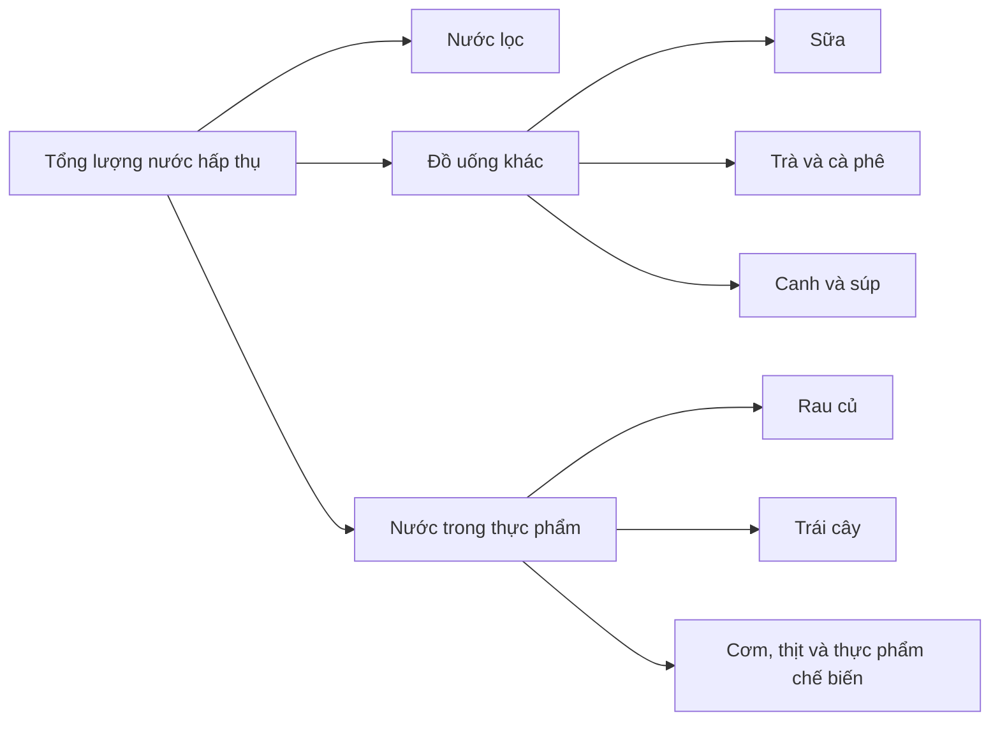
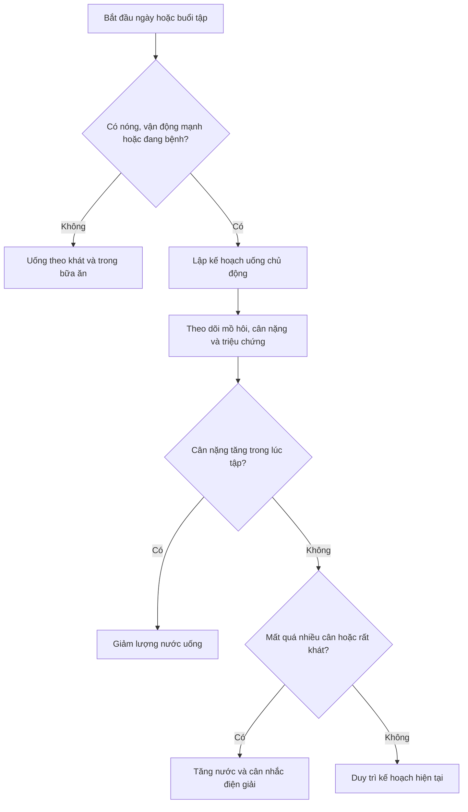

# 083 — Water

| Thuộc tính       | Nội dung                                 |
| ---------------- | ---------------------------------------- |
| **Module**       | Module 08 — Micronutrients               |
| **Bài học**      | Water                                    |
| **Thời lượng**   | 04:06                                    |
| **Chủ đề chính** | Nước và nhu cầu cung cấp nước cho cơ thể |

> [!IMPORTANT]
> **Điểm cần chuẩn hóa từ bài giảng:** con số **2,7 lít/ngày ở nữ** và **3,7 lít/ngày ở nam** là mức tham khảo cho **tổng lượng nước** từ nước lọc, các loại đồ uống và thực phẩm. Đây không phải yêu cầu bắt buộc phải uống riêng từng ấy lít nước lọc mỗi ngày. ([National Academies][1])


*Nguồn ảnh: U.S. Geological Survey – Water Science School, ảnh thuộc phạm vi công cộng.* ([USGS][2])

## Mục lục

1. [Mục tiêu bài học](#1-mục-tiêu-bài-học)
2. [Nội dung chính](#2-nội-dung-chính)
3. [Áp dụng thực tế](#3-áp-dụng-thực-tế)
4. [Lưu ý & lỗi thường gặp](#4-lưu-ý--lỗi-thường-gặp)
5. [Checklist thực hành](#5-checklist-thực-hành)
6. [Tóm tắt](#6-tóm-tắt)

---

## 1. Mục tiêu bài học

Sau bài học này, người học có thể:

* Giải thích các vai trò sinh lý quan trọng của nước.
* Phân biệt **tổng lượng nước hấp thụ** với lượng **nước lọc uống trực tiếp**.
* Hiểu ý nghĩa của mức tham khảo 2,7 và 3,7 lít mỗi ngày.
* Điều chỉnh lượng nước dựa trên thời tiết, mức vận động, lượng mồ hôi và tình trạng sức khỏe.
* Xây dựng kế hoạch uống nước phù hợp khi tập luyện.
* Nhận biết dấu hiệu thiếu nước và nguy cơ uống quá nhiều.
* Lựa chọn nước uống và thiết bị lọc nước dựa trên chất lượng nguồn nước, thay vì chỉ nhìn vào chỉ số TDS.

---

## 2. Nội dung chính

### 2.1. Nước chiếm bao nhiêu trong cơ thể?

Ở người trưởng thành, nước thường chiếm khoảng **50–60% khối lượng cơ thể**, nhưng tỷ lệ này thay đổi theo tuổi, giới tính, lượng cơ, lượng mỡ và tình trạng sức khỏe. Người có nhiều khối cơ thường có tỷ lệ nước cao hơn vì mô cơ chứa nhiều nước hơn mô mỡ. ([NCBI][3])

Phần lớn nước trong cơ thể được phân bố ở hai khoang:

* **Dịch nội bào:** nước nằm bên trong tế bào.
* **Dịch ngoại bào:** nước trong máu và khoảng gian bào.

Khoảng hai phần ba tổng lượng nước cơ thể nằm trong tế bào và một phần ba nằm ngoài tế bào. ([NCBI][3])

---

### 2.2. Vai trò của nước

Nước không chỉ có tác dụng “giải khát”. Nó tham gia vào gần như toàn bộ hoạt động sống của cơ thể.

| Vai trò                        | Giải thích                                                                                               |
| ------------------------------ | -------------------------------------------------------------------------------------------------------- |
| **Điều hòa thân nhiệt**        | Cơ thể thải nhiệt thông qua tiết mồ hôi và hô hấp.                                                       |
| **Vận chuyển chất dinh dưỡng** | Nước là thành phần chính của máu, giúp vận chuyển oxy, glucose, acid amin và các chất khác.              |
| **Hỗ trợ tiêu hóa**            | Tham gia tạo nước bọt, dịch tiêu hóa và giúp thức ăn di chuyển trong đường ruột.                         |
| **Đào thải chất cặn**          | Hỗ trợ bài tiết chất thải qua nước tiểu, mồ hôi và phân.                                                 |
| **Bôi trơn khớp**              | Góp phần duy trì dịch khớp và giảm ma sát khi vận động.                                                  |
| **Bảo vệ mô nhạy cảm**         | Dịch cơ thể giúp đệm và bảo vệ não, tủy sống cùng nhiều cơ quan khác.                                    |
| **Duy trì cân bằng tế bào**    | Nước và các chất điện giải giúp duy trì thể tích, áp suất thẩm thấu và hoạt động bình thường của tế bào. |

Các vai trò trên được USGS và CDC mô tả gồm điều hòa nhiệt độ, vận chuyển chất, bôi trơn khớp, bảo vệ mô và hỗ trợ đào thải chất thải. ([USGS][2])

> [!NOTE]
> Nước hỗ trợ gan, thận và hệ bài tiết thực hiện chức năng loại bỏ chất thải. Tuy nhiên, uống nước vượt xa nhu cầu không tạo ra hiệu ứng “thải độc” đặc biệt ở một người khỏe mạnh.

---

### 2.3. Hậu quả của thiếu nước

Mất nước xảy ra khi lượng nước mất đi lớn hơn lượng được bổ sung. Thiếu nước có thể ảnh hưởng đồng thời đến thể chất và tinh thần.

Các biểu hiện thường gặp gồm:

* Khát nước.
* Khô miệng.
* Nước tiểu sẫm màu hoặc đi tiểu ít hơn.
* Đau đầu.
* Mệt mỏi.
* Khó tập trung hoặc suy nghĩ kém rõ ràng.
* Giảm hiệu suất vận động.
* Chóng mặt, đặc biệt khi đứng dậy.
* Cảm giác nóng quá mức trong môi trường nóng.

CDC lưu ý mất nước có thể liên quan đến suy giảm khả năng suy nghĩ, thay đổi tâm trạng, quá nóng, táo bón và tăng nguy cơ sỏi thận. ([CDC][4])

Mất nước nghiêm trọng kèm lú lẫn, ngất, nhịp tim nhanh, không thể uống, nôn ói hoặc tiêu chảy kéo dài cần được đánh giá y tế.

---

### 2.4. Nước đến từ đâu?

Tổng lượng nước hằng ngày không chỉ đến từ nước lọc.



Trong dữ liệu được dùng để xây dựng mức tham khảo của Hoa Kỳ, khoảng **20% tổng lượng nước** thường đến từ thực phẩm và phần còn lại đến từ nước cùng các loại đồ uống. Tỷ lệ thực tế thay đổi đáng kể tùy chế độ ăn. ([National Academies][1])

Các thực phẩm giàu nước gồm:

* Dưa hấu, cam, bưởi và dâu tây.
* Dưa chuột, cà chua, rau xà lách.
* Canh, súp và cháo.
* Sữa và sữa chua.
* Các món ăn có nhiều nước.

CDC xác nhận trái cây và rau quả có hàm lượng nước cao có thể đóng góp đáng kể vào tổng lượng nước hằng ngày. ([CDC][5])

---

### 2.5. Cần bao nhiêu nước mỗi ngày?

Viện Hàn lâm Khoa học, Kỹ thuật và Y học Hoa Kỳ đưa ra mức **Adequate Intake – AI**, tức mức hấp thụ đầy đủ ước tính cho người trưởng thành khỏe mạnh, ít vận động và sống trong khí hậu ôn hòa.

| Đối tượng trưởng thành | Tổng lượng nước/ngày | Ước tính từ nước và đồ uống | Phần còn lại thường đến từ thực phẩm |
| ---------------------- | -------------------: | --------------------------: | -----------------------------------: |
| **Nữ**                 |   Khoảng **2,7 lít** |          Khoảng **2,2 lít** |                       Khoảng 0,5 lít |
| **Nam**                |   Khoảng **3,7 lít** |          Khoảng **3,0 lít** |                       Khoảng 0,7 lít |

([National Academies][1])

### Cách hiểu đúng

* Đây là **mức tham khảo dân số**, không phải công thức chính xác cho từng người.
* Không cần ép bản thân uống đúng một con số nếu đã nhận nhiều nước từ thực phẩm.
* Nhu cầu có thể cao hơn khi trời nóng, độ ẩm cao, tập thể dục, sốt, tiêu chảy, nôn ói, mang thai hoặc cho con bú. ([CDC][5])
* Người nhỏ con, ít vận động và ăn nhiều rau quả có thể cần ít nước uống trực tiếp hơn.
* Người có khối lượng cơ thể lớn, đổ nhiều mồ hôi hoặc lao động ngoài trời thường cần nhiều hơn.

---

### 2.6. Có thể chỉ dựa vào cảm giác khát không?

Đối với đa số người trưởng thành khỏe mạnh, ít vận động và sống trong điều kiện khí hậu dễ chịu, cảm giác khát kết hợp với việc uống trong các bữa ăn thường đủ để duy trì cân bằng nước. ([National Academies][6])

Tuy nhiên, không nên chỉ chờ đến khi rất khát trong các trường hợp:

* Tập luyện kéo dài hoặc cường độ cao.
* Làm việc dưới trời nóng.
* Ra nhiều mồ hôi.
* Người cao tuổi có cảm giác khát suy giảm.
* Đang sốt, nôn hoặc tiêu chảy.
* Không thể tiếp cận nước thường xuyên.
* Chuẩn bị tham gia thi đấu hoặc hoạt động sức bền.



---

### 2.7. Nhu cầu nước khi tập thể dục

Khuyến nghị “uống thêm cố định 1 lít cho mỗi giờ tập” có thể dùng như một ước tính rất thô, nhưng **không phù hợp cho tất cả mọi người**.

Lượng mồ hôi khác nhau tùy:

* Cân nặng và kích thước cơ thể.
* Cường độ tập luyện.
* Nhiệt độ, độ ẩm và ánh nắng.
* Quần áo, trang thiết bị bảo hộ.
* Mức độ thích nghi với thời tiết nóng.
* Đặc điểm cá nhân và di truyền.

Các hướng dẫn thể thao khuyến nghị cá nhân hóa lượng nước theo lượng mồ hôi thực tế và tránh uống đến mức tăng cân trong khi tập, vì điều này làm tăng nguy cơ hạ natri máu do uống quá nhiều nước. ([PubMed][7])

#### Cách ước tính lượng mồ hôi

Cân cơ thể ngay trước và sau một buổi tập điển hình:

[
\text{Mồ hôi mất đi}
\approx
\text{Cân nặng trước tập}
-------------------------

\text{Cân nặng sau tập}
+
\text{Nước đã uống}
-------------------

\text{Nước tiểu}
]

Trong thực hành:

* Chênh lệch **1 kg cân nặng ≈ 1 lít nước**.
* Chia lượng nước mất cho số giờ tập để ước tính tốc độ tiết mồ hôi.

#### Ví dụ

Một người:

* Nặng 70 kg trước tập.
* Nặng 69,4 kg sau một giờ.
* Đã uống 500 mL nước.
* Không đi tiểu trong thời gian tập.

```text
Lượng mồ hôi ≈ 0,6 + 0,5 = 1,1 lít/giờ
```

Người này tiết khoảng 1,1 lít mồ hôi mỗi giờ trong điều kiện buổi tập đó. Kết quả sẽ thay đổi nếu thời tiết, cường độ hoặc trang phục thay đổi.

#### Trong và sau buổi tập

* Với buổi tập ngắn, cường độ vừa và thời tiết dễ chịu, nước lọc thường đáp ứng được nhu cầu.
* Khi tập kéo dài, trời nóng hoặc ra nhiều mồ hôi, đồ uống có natri và carbohydrate có thể hữu ích.
* Sau buổi tập, nếu cần hồi phục nhanh, có thể bổ sung khoảng **1,25–1,5 lít chất lỏng cho mỗi kg cân nặng bị mất**, kết hợp bữa ăn hoặc đồ uống có natri để giữ nước tốt hơn. ([PubMed Central (PMC)][8])
* Không cố uống nhiều đến mức cân nặng sau tập cao hơn cân nặng trước tập. ([PubMed Central (PMC)][9])

---

### 2.8. Có cần bổ sung chất điện giải không?

Chất điện giải quan trọng nhất bị mất qua mồ hôi là **natri**, bên cạnh một lượng nhỏ kali, chloride và các khoáng chất khác.

Có thể chỉ cần nước lọc khi:

* Tập dưới khoảng một giờ.
* Cường độ nhẹ hoặc vừa.
* Thời tiết không quá nóng.
* Không ra nhiều mồ hôi.
* Ăn uống bình thường trước và sau tập.

Có thể cân nhắc điện giải khi:

* Tập kéo dài nhiều giờ.
* Tập trong môi trường nóng ẩm.
* Áo quần xuất hiện nhiều vệt muối trắng.
* Ra mồ hôi rất nhiều.
* Cần phục hồi nhanh giữa hai buổi tập.
* Hoạt động sức bền như chạy dài, đạp xe hoặc thi đấu ngoài trời.

Đồ uống thể thao không phải lựa chọn bắt buộc trong sinh hoạt hằng ngày vì nhiều sản phẩm có lượng đường và năng lượng đáng kể. CDC xếp đồ uống thể thao có đường vào nhóm nên sử dụng có cân nhắc thay vì dùng thay nước hằng ngày. ([CDC][5])

---

### 2.9. Theo dõi tình trạng đủ nước

Không có một dấu hiệu đơn lẻ nào luôn chính xác. Nên kết hợp nhiều chỉ báo.

| Chỉ báo                          | Cách diễn giải                                                                  |
| -------------------------------- | ------------------------------------------------------------------------------- |
| **Cảm giác khát**                | Khát nhẹ là tín hiệu nên uống; khát dữ dội có thể cho thấy đã mất nước đáng kể. |
| **Màu nước tiểu**                | Vàng nhạt thường gợi ý đủ nước; vàng sẫm kéo dài có thể cho thấy cần uống thêm. |
| **Tần suất đi tiểu**             | Đi tiểu rất ít trong nhiều giờ cần được chú ý.                                  |
| **Cân nặng quanh buổi tập**      | Giúp ước tính lượng mồ hôi mất đi.                                              |
| **Hiệu suất và cảm giác cơ thể** | Đau đầu, mệt, chóng mặt và giảm tập trung có thể liên quan đến thiếu nước.      |

> [!NOTE]
> Màu nước tiểu có thể bị ảnh hưởng bởi vitamin nhóm B, thuốc, thực phẩm và một số bệnh lý. Vì vậy, đây chỉ là công cụ theo dõi sơ bộ, không phải xét nghiệm chẩn đoán.

---

### 2.10. Nên uống loại nước nào?


*Nguồn ảnh: Centers for Disease Control and Prevention.* 

#### Nước máy

Nước máy có thể là lựa chọn phù hợp khi:

* Nguồn nước được xử lý và kiểm soát chất lượng.
* Đường ống và bể chứa được bảo trì tốt.
* Không có cảnh báo ô nhiễm tại địa phương.

Chất lượng nước tại vòi còn phụ thuộc vào nguồn cấp, hệ thống đường ống và cách lưu trữ trong gia đình. Khi nghi ngờ, cần kiểm tra báo cáo chất lượng nước hoặc xét nghiệm mẫu nước thay vì đánh giá chỉ bằng mùi vị.

#### Nước đóng chai

Nước đóng chai thuận tiện khi di chuyển hoặc khi nguồn nước tại chỗ không đảm bảo. Tuy nhiên:

* Nước đóng chai không tự động tốt hơn mọi nguồn nước máy.
* Cần chọn sản phẩm có nguồn gốc và tiêu chuẩn rõ ràng.
* Không nên để chai nhựa lâu trong xe hoặc nơi có nhiệt độ cao.
* Chi phí và lượng rác thải nhựa có thể cao nếu sử dụng hằng ngày.

#### Nước lọc tại nhà

Máy lọc có thể hữu ích nếu được chọn theo **chất cần loại bỏ**. Không có một loại máy lọc nào loại bỏ được tất cả chất ô nhiễm.

Quy trình phù hợp là:

1. Xác định nguồn và chất lượng nước đầu vào.
2. Xét nghiệm hoặc tham khảo báo cáo chất lượng nước.
3. Xác định chất cần giảm: cặn, chlorine, chì, vi sinh vật, arsenic, PFAS hoặc chất khác.
4. Chọn công nghệ và chứng nhận tương ứng.
5. Thay lõi đúng hạn và vệ sinh thiết bị.

NSF nhấn mạnh rằng cần biết chất gì có trong nước trước, sau đó chọn bộ lọc được chứng nhận cho **chính chất ô nhiễm đó**. ([NSF][10])

---

### 2.11. Không nên đánh giá máy lọc chỉ bằng TDS

**TDS – Total Dissolved Solids** là tổng lượng chất rắn hòa tan, chủ yếu gồm các khoáng chất và muối hòa tan.

TDS có thể cung cấp thông tin về:

* Hàm lượng khoáng hòa tan.
* Độ mặn hoặc vị của nước.
* Khả năng hình thành cặn.
* Sự thay đổi tương đối của nước trước và sau một số hệ thống lọc.

Tuy nhiên, TDS **không cho biết cụ thể** nước có chứa vi khuẩn, virus, chì, arsenic, thuốc trừ sâu hoặc các hợp chất hữu cơ hay không. Một mẫu nước có TDS thấp vẫn có thể chứa chất ô nhiễm nguy hiểm ở nồng độ nhỏ.

EPA xếp TDS vào tiêu chuẩn thứ cấp chủ yếu liên quan đến vị, màu, cặn và tính dễ chấp nhận của nước, với mức hướng dẫn 500 mg/L; đây không phải phép đo toàn diện về độ an toàn của nước. ([US EPA][11])

> [!WARNING]
> Câu “máy lọc tốt sẽ tạo ra nước gần như không còn hóa chất” là diễn đạt không chính xác. Nước vẫn chứa phân tử nước và có thể chứa khoáng chất; hiệu quả của máy phải được đánh giá theo từng chất ô nhiễm cụ thể và chứng nhận kiểm nghiệm.

---

## 3. Áp dụng thực tế

### 3.1. Kế hoạch uống nước đơn giản

Thay vì ép uống một lượng lớn cùng lúc, có thể phân bổ nước quanh các hoạt động thường ngày:

| Thời điểm                         | Thực hành gợi ý                                                            |
| --------------------------------- | -------------------------------------------------------------------------- |
| **Sau khi thức dậy**              | Uống khi cảm thấy khát; không bắt buộc phải uống một lượng cố định.        |
| **Trong bữa ăn**                  | Dùng nước theo nhu cầu, đặc biệt khi thức ăn khô hoặc nhiều chất xơ.       |
| **Giữa các buổi học và làm việc** | Đặt chai nước trong tầm nhìn và uống từng ngụm.                            |
| **Trước khi tập**                 | Bắt đầu buổi tập trong trạng thái không khát và nước tiểu không quá sẫm.   |
| **Trong khi tập**                 | Uống theo khát hoặc theo kế hoạch dựa trên lượng mồ hôi.                   |
| **Sau khi tập**                   | Bổ sung lượng đã mất và ăn bữa có đủ nước, natri cùng các chất dinh dưỡng. |
| **Trước khi ngủ**                 | Không cần cố uống nhiều nếu dễ thức giấc đi tiểu.                          |

### 3.2. Ví dụ mục tiêu thực tế

Một phụ nữ có mức tổng nước tham khảo khoảng 2,7 lít/ngày có thể nhận được:

```text
1,8 lít nước lọc
+ 400 mL sữa, trà hoặc đồ uống không đường
+ khoảng 500 mL từ thức ăn
= 2,7 lít tổng lượng nước
```

Đây chỉ là ví dụ minh họa, không phải thực đơn bắt buộc.

### 3.3. Cách giúp uống đủ nước

* Mang theo chai có thể tái sử dụng.
* Uống trong các bữa ăn.
* Đặt nước tại bàn học hoặc bàn làm việc.
* Thêm lát chanh, cam, dưa chuột hoặc lá bạc hà nếu không thích vị nước lọc.
* Ưu tiên nước thay cho nước ngọt có đường.
* Tăng nước khi hoạt động ngoài trời hoặc thời tiết nóng.
* Bổ sung canh, súp, rau và trái cây giàu nước.

CDC khuyến nghị mang theo chai nước, uống nước trong bữa ăn, chọn nước thay đồ uống có đường và có thể thêm chanh hoặc chanh xanh để dễ uống hơn. ([CDC][5])

---

## 4. Lưu ý & lỗi thường gặp

### Lỗi 1: Hiểu 3,7 lít là phải uống 3,7 lít nước lọc

**Vì sao sai:** con số này bao gồm cả nước trong đồ uống và thực phẩm.

**Cách sửa:** theo dõi tổng lượng nước, chế độ ăn, thời tiết và hoạt động thay vì chỉ đếm nước lọc.

---

### Lỗi 2: Mọi người đều phải uống tám cốc mỗi ngày

“Tám cốc” là một quy tắc ghi nhớ đơn giản, không phản ánh sự khác biệt về kích thước cơ thể, thực phẩm, khí hậu, vận động, thai kỳ và sức khỏe.

**Cách sửa:** dùng cảm giác khát và mức tham khảo làm điểm bắt đầu, sau đó điều chỉnh theo hoàn cảnh.

---

### Lỗi 3: Cứ tập một giờ là phải uống thêm đúng một lít

Lượng mồ hôi giữa hai người có thể chênh lệch lớn.

**Cách sửa:** cân trước và sau tập để ước tính lượng mồ hôi, đặc biệt khi tập sức bền hoặc dưới trời nóng.

---

### Lỗi 4: Uống càng nhiều càng tốt

Uống quá mức, đặc biệt trong hoạt động kéo dài, có thể làm loãng natri máu. Nguy cơ tăng khi uống nhanh một lượng lớn nước nhưng không mất tương ứng qua mồ hôi hoặc nước tiểu. Các hướng dẫn thể thao khuyên không nên uống đến mức tăng cân trong lúc tập. ([PubMed Central (PMC)][9])

---

### Lỗi 5: Chỉ nước lọc mới được tính

Nước trong sữa, trà, cà phê không đường, canh, súp, rau và trái cây đều góp phần vào tổng lượng nước. CDC cho biết cà phê và trà không đường có thể là lựa chọn đồ uống ít năng lượng; caffeine mức vừa phải vẫn có thể nằm trong chế độ ăn của phần lớn người trưởng thành. ([CDC][5])

---

### Lỗi 6: TDS càng thấp thì nước càng an toàn

TDS không đo trực tiếp vi sinh vật hay từng chất độc hại cụ thể.

**Cách sửa:** chọn xét nghiệm và bộ lọc theo chất ô nhiễm cần loại bỏ; kiểm tra chứng nhận và bảng hiệu suất của thiết bị. ([NSF][10])

---

### Lỗi 7: Máy lọc nào cũng loại bỏ được mọi chất

Bộ lọc than hoạt tính, màng lọc, tia UV, thiết bị làm mềm và hệ thống thẩm thấu ngược có chức năng khác nhau.

**Cách sửa:** xác định vấn đề của nguồn nước trước khi mua thiết bị.

---

### Lỗi 8: Dùng đồ uống thể thao thay nước hằng ngày

Đồ uống thể thao có thể cần thiết trong một số buổi tập kéo dài, nhưng nhiều sản phẩm chứa đường và năng lượng không cần thiết trong sinh hoạt ít vận động. ([CDC][5])

---

### Trường hợp cần thận trọng

Người mắc bệnh thận, suy tim, bệnh gan, rối loạn điện giải hoặc đang dùng thuốc ảnh hưởng đến cân bằng nước không nên tự đặt mục tiêu uống nước cao. Một số trường hợp cần hạn chế hoặc điều chỉnh nước theo chỉ định của bác sĩ.

---

## 5. Checklist thực hành

### Hằng ngày

* [ ] Tôi có nước sạch và thuận tiện để uống.
* [ ] Tôi uống khi khát và trong các bữa ăn.
* [ ] Tôi không đợi đến lúc khát dữ dội mới uống.
* [ ] Tôi ưu tiên nước thay cho nước ngọt có đường.
* [ ] Tôi ăn rau, trái cây hoặc các món có nhiều nước.
* [ ] Nước tiểu không thường xuyên quá sẫm màu.
* [ ] Tôi không ép uống chỉ để đạt một con số.
* [ ] Tôi tăng nước khi trời nóng, vận động nhiều hoặc bị sốt.

### Khi tập luyện

* [ ] Tôi bắt đầu buổi tập trong trạng thái đủ nước.
* [ ] Tôi mang theo lượng nước phù hợp.
* [ ] Tôi không uống đến mức đầy bụng hoặc tăng cân trong lúc tập.
* [ ] Tôi đã thử cân trước và sau tập để ước tính lượng mồ hôi.
* [ ] Tôi cân nhắc natri hoặc điện giải khi tập kéo dài và ra nhiều mồ hôi.
* [ ] Tôi bổ sung nước và ăn uống sau buổi tập.

### Khi lựa chọn máy lọc

* [ ] Tôi biết nguồn nước đầu vào.
* [ ] Tôi đã kiểm tra hoặc tìm hiểu chất lượng nguồn nước.
* [ ] Tôi biết chất ô nhiễm nào cần giảm.
* [ ] Thiết bị có chứng nhận cho chất cần loại bỏ.
* [ ] Tôi không đánh giá chất lượng nước chỉ bằng TDS.
* [ ] Tôi thay lõi lọc và vệ sinh máy đúng lịch.

---

## 6. Tóm tắt

* Nước chiếm khoảng **50–60% khối lượng cơ thể người trưởng thành** và tham gia điều hòa thân nhiệt, vận chuyển chất, tiêu hóa, bảo vệ mô, bôi trơn khớp và đào thải chất thải. ([NCBI][12])
* Mức tham khảo khoảng **2,7 lít tổng nước/ngày ở nữ** và **3,7 lít/ngày ở nam** bao gồm nước từ đồ uống và thực phẩm. ([National Academies][1])
* Không có một con số phù hợp cho tất cả mọi người; nhu cầu thay đổi theo cơ thể, chế độ ăn, thời tiết, vận động và sức khỏe.
* Cảm giác khát thường hữu ích với người khỏe mạnh trong điều kiện bình thường, nhưng cần kế hoạch chủ động khi tập kéo dài, làm việc ngoài trời hoặc bị bệnh.
* Không nên mặc định uống thêm đúng một lít cho mỗi giờ tập. Hãy ước tính lượng mồ hôi và tránh uống đến mức tăng cân trong khi vận động. ([PubMed Central (PMC)][9])
* Điện giải có thể hữu ích khi tập kéo dài hoặc ra nhiều mồ hôi, nhưng không cần thiết cho mọi buổi tập.
* Nước đóng chai không mặc nhiên tốt hơn nước máy.
* Máy lọc phải được chọn theo chất ô nhiễm cần loại bỏ; **TDS không phải thước đo đầy đủ về độ an toàn của nước**. ([US EPA][13])

[1]: https://www.nationalacademies.org/read/10925/chapter/6?utm_source=chatgpt.com "Dietary Reference Intakes for Water"
[2]: https://www.usgs.gov/media/images/water-you-what-water-does-your-body "The water in you: What water does for your body | U.S. Geological Survey"
[3]: https://www.ncbi.nlm.nih.gov/books/NBK541059/?utm_source=chatgpt.com "Physiology, Water Balance - StatPearls - NCBI Bookshelf"
[4]: https://www.cdc.gov/healthy-weight-growth/water-healthy-drinks/index.html?utm_source=chatgpt.com "About Water and Healthier Drinks"
[5]: https://www.cdc.gov/healthy-weight-growth/water-healthy-drinks/index.html "About Water and Healthier Drinks | Healthy Weight and Growth | CDC"
[6]: https://www.nationalacademies.org/news/report-sets-dietary-intake-levels-for-water-salt-and-potassium-to-maintain-health-and-reduce-chronic-disease-risk?utm_source=chatgpt.com "Report Sets Dietary Intake Levels for Water, Salt, and ..."
[7]: https://pubmed.ncbi.nlm.nih.gov/17277604/?utm_source=chatgpt.com "American College of Sports Medicine position stand. ..."
[8]: https://pmc.ncbi.nlm.nih.gov/articles/PMC11085813/?utm_source=chatgpt.com "Personalized Hydration Strategy to Improve Fluid Balance and ..."
[9]: https://pmc.ncbi.nlm.nih.gov/articles/PMC5634236/?utm_source=chatgpt.com "National Athletic Trainers' Association Position Statement - PMC"
[10]: https://www.nsf.org/consumer-resources/articles/home-water-treatment "Home Water Treatment System and Solutions | NSF"
[11]: https://www.epa.gov/sdwa/secondary-drinking-water-standards-guidance-nuisance-chemicals?utm_source=chatgpt.com "Secondary Drinking Water Standards: Guidance for ..."
[12]: https://www.ncbi.nlm.nih.gov/books/NBK482447/?utm_source=chatgpt.com "Physiology, Body Fluids - StatPearls - NCBI Bookshelf"
[13]: https://www.epa.gov/sdwa/drinking-water-regulations-and-contaminants?utm_source=chatgpt.com "Drinking Water Regulations and Contaminants | US EPA"
