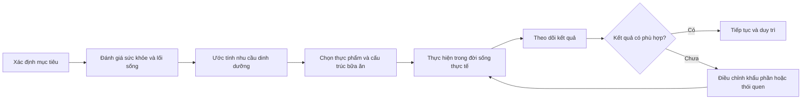
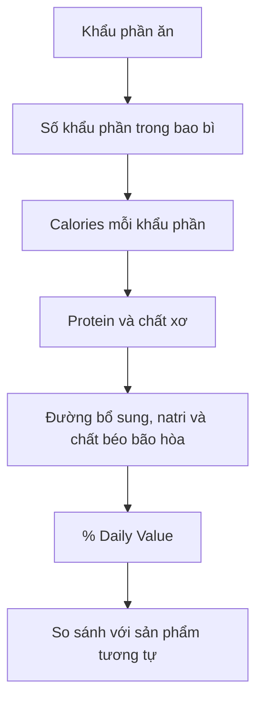
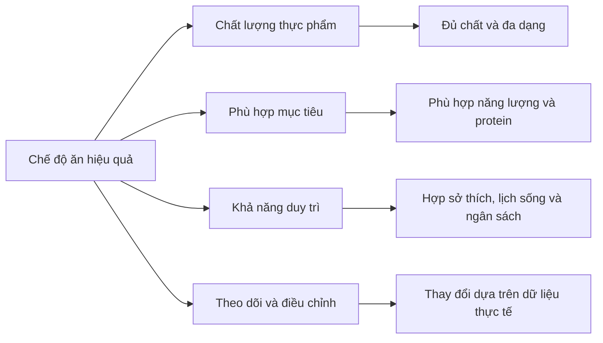

# 084 — Even More Dieting Tips And Strategies

## Các mẹo và chiến lược dinh dưỡng nâng cao

| Thuộc tính              | Nội dung                                                                                       |
| ----------------------- | ---------------------------------------------------------------------------------------------- |
| **Module**              | Module 09 — More Dieting Tips & Strategies                                                     |
| **Bài học**             | Even More Dieting Tips And Strategies                                                          |
| **Thời lượng**          | 01:06                                                                                          |
| **Chủ đề chính**        | Giới thiệu các mẹo và chiến lược dinh dưỡng nâng cao                                           |
| **Vai trò của bài học** | Tổng quan nội dung Module 09 và chuyển từ “biết kiến thức” sang “tự xây dựng kế hoạch ăn uống” |

> **Thông điệp trung tâm:** Một kế hoạch dinh dưỡng hiệu quả không nhất thiết phải mang tên một chế độ ăn cụ thể. Kế hoạch đó cần có chất lượng tốt, phù hợp với mục tiêu, sức khỏe, lịch sinh hoạt và có thể duy trì lâu dài.


*Hình 1. Biểu tượng MyPlate của USDA, dùng để minh họa cách tổ chức các nhóm thực phẩm. Đây là công cụ định hướng chung, không phải khẩu phần cá nhân hóa.*

---

## Mục lục

1. [Mục tiêu bài học](#1-mục-tiêu-bài-học)
2. [Nội dung chính](#2-nội-dung-chính)
3. [Áp dụng thực tế](#3-áp-dụng-thực-tế)
4. [Lưu ý và lỗi thường gặp](#4-lưu-ý-và-lỗi-thường-gặp)
5. [Checklist thực hành](#5-checklist-thực-hành)
6. [Tóm tắt](#6-tóm-tắt)

---

## 1. Mục tiêu bài học

Sau bài học này, người học có thể:

* Nhìn lại những kiến thức dinh dưỡng đã học ở các module trước.
* Hiểu mục tiêu và phạm vi của Module 09.
* Phân biệt giữa việc **sao chép một chế độ ăn** và **tự thiết kế kế hoạch phù hợp với bản thân**.
* Nhận diện những kỹ năng dinh dưỡng cần học thêm:

  * hỗ trợ chức năng miễn dịch;
  * tối ưu hóa sức khỏe nội tiết bằng lối sống;
  * đọc nhãn dinh dưỡng;
  * đánh giá nguồn thông tin và nghiên cứu khoa học;
  * điều chỉnh chế độ ăn theo mục tiêu và lịch sinh hoạt.
* Xây dựng tư duy theo dõi, đánh giá và điều chỉnh thay vì tìm kiếm một “chế độ ăn hoàn hảo”.

---

## 2. Nội dung chính

### 2.1. Những kiến thức đã được xây dựng

Các bài học trước đã tạo nên nền tảng tương đối toàn diện về dinh dưỡng:

| Nhóm kiến thức                 | Nội dung đã học                                                           |
| ------------------------------ | ------------------------------------------------------------------------- |
| **Thay đổi thành phần cơ thể** | Ăn uống để xây dựng cơ bắp hoặc giảm mỡ                                   |
| **Lập kế hoạch**               | Tính toán nhu cầu, chia bữa và chuẩn bị thực phẩm                         |
| **Các chế độ ăn phổ biến**     | Low-carb, ketogenic, Paleo, thuần chay, không gluten và nhịn ăn gián đoạn |
| **Chất dinh dưỡng đa lượng**   | Protein, carbohydrate và chất béo                                         |
| **Vi chất dinh dưỡng**         | Vitamin, khoáng chất và nguồn thực phẩm                                   |
| **Nước và điện giải**          | Vai trò của nước, natri, kali và các khoáng chất                          |
| **Lầm tưởng dinh dưỡng**       | Phân biệt kiến thức có bằng chứng với các tuyên bố quảng cáo              |

Những kiến thức này giúp người học không còn phải phụ thuộc hoàn toàn vào các chế độ ăn theo trào lưu.

---

### 2.2. Từ kiến thức chung đến chiến lược cá nhân

Biết một thực phẩm chứa bao nhiêu protein hoặc biết một chế độ ăn hoạt động như thế nào chưa đủ. Bước tiếp theo là biến kiến thức đó thành một hệ thống phù hợp với cuộc sống thực tế.



Một kế hoạch tốt thường trả lời được năm câu hỏi:

1. **Mục tiêu là gì?**
   Giảm mỡ, tăng cơ, duy trì cân nặng, cải thiện sức khỏe hay hỗ trợ hiệu suất vận động?

2. **Người thực hiện là ai?**
   Tuổi, giới tính, mức vận động, tình trạng sức khỏe, sở thích và văn hóa ăn uống đều có ảnh hưởng.

3. **Kế hoạch có đủ chất không?**
   Không chỉ kiểm soát calo mà còn phải quan tâm đến protein, chất xơ, vitamin, khoáng chất và nước.

4. **Kế hoạch có thực hiện được không?**
   Một kế hoạch lý tưởng trên giấy nhưng quá đắt, quá phức tạp hoặc không phù hợp lịch làm việc thường khó duy trì.

5. **Kết quả sẽ được đánh giá thế nào?**
   Có thể theo dõi cân nặng, số đo, hiệu suất tập luyện, mức đói, giấc ngủ, năng lượng và khả năng tuân thủ.

---

### 2.3. Bốn nguyên tắc nền tảng của chế độ ăn lành mạnh

WHO mô tả bốn nguyên tắc cốt lõi của chế độ ăn lành mạnh:

| Nguyên tắc               | Ý nghĩa                                                                           |
| ------------------------ | --------------------------------------------------------------------------------- |
| **Đầy đủ — Adequacy**    | Cung cấp đủ năng lượng, chất đa lượng và vi chất cần thiết                        |
| **Cân bằng — Balance**   | Cân đối năng lượng nạp vào với năng lượng tiêu hao và cân bằng giữa các nhóm chất |
| **Điều độ — Moderation** | Hạn chế những thành phần có thể gây bất lợi khi tiêu thụ quá nhiều                |
| **Đa dạng — Diversity**  | Sử dụng nhiều loại thực phẩm trong và giữa các nhóm thực phẩm                     |

Thành phần chính xác của một chế độ ăn có thể thay đổi theo độ tuổi, mức hoạt động, văn hóa, thực phẩm sẵn có và tình trạng sức khỏe. Vì vậy, không tồn tại một thực đơn duy nhất phù hợp với tất cả mọi người. ([World Health Organization][1])

---

### 2.4. Những nội dung sẽ được phát triển trong Module 09

#### A. Hỗ trợ chức năng miễn dịch

Hệ miễn dịch cần được cung cấp đầy đủ năng lượng, protein, vitamin và khoáng chất. Một số vi chất như vitamin C, vitamin D và kẽm tham gia vào hoạt động miễn dịch, nhưng điều này không có nghĩa dùng liều cao sẽ tự động “tăng miễn dịch” hoặc ngăn ngừa mọi bệnh. ([ODS][2])

Trọng tâm nên là:

* chế độ ăn đủ và đa dạng;
* ngủ đủ;
* vận động phù hợp;
* quản lý căng thẳng;
* điều trị hoặc bổ sung khi có thiếu hụt được xác định.

---

#### B. Tối ưu hóa testosterone và sức khỏe nội tiết

Module sẽ đề cập đến các yếu tố lối sống có thể ảnh hưởng đến sức khỏe nội tiết, chẳng hạn như:

* duy trì thành phần cơ thể phù hợp;
* tập luyện sức mạnh;
* ngủ đủ và đều đặn;
* tránh thiếu năng lượng kéo dài;
* cung cấp đủ chất béo và vi chất;
* hạn chế lạm dụng rượu bia và các sản phẩm không rõ nguồn gốc.

Tuy nhiên, triệu chứng như mệt mỏi, giảm ham muốn hoặc giảm hiệu suất không đủ để tự kết luận thiếu testosterone. Chẩn đoán suy sinh dục nam cần dựa trên cả triệu chứng phù hợp và nồng độ testosterone thấp được xác nhận bằng xét nghiệm lặp lại. ([Endocrine][3])

> **Cảnh báo:** Không tự sử dụng testosterone, steroid đồng hóa hoặc sản phẩm “testosterone booster” chỉ để tăng cơ hay cải thiện ngoại hình.

---

#### C. Đọc nhãn dinh dưỡng

Nhãn dinh dưỡng giúp người mua so sánh các sản phẩm đóng gói, nhưng cần đọc theo đúng thứ tự.


*Hình 2. Mẫu nhãn Nutrition Facts dùng cho mục đích giáo dục của FDA.*

##### Trình tự đọc nhanh



Điểm quan trọng nhất là toàn bộ lượng calo và chất dinh dưỡng trên nhãn thường được tính theo **một khẩu phần**, không nhất thiết theo cả bao bì. ([U.S. Food and Drug Administration][4])

Quy tắc tham khảo nhanh đối với `% Daily Value`:

* **5% DV trở xuống:** hàm lượng thấp.
* **20% DV trở lên:** hàm lượng cao.

Quy tắc này cần được áp dụng theo mục tiêu: có thể tìm thực phẩm giàu chất xơ, vitamin hoặc khoáng chất, đồng thời hạn chế sản phẩm quá cao natri, đường bổ sung hoặc chất béo bão hòa. ([U.S. Food and Drug Administration][5])

---

#### D. Tự nghiên cứu dinh dưỡng

Không phải mọi bài viết, video hay nghiên cứu đều có giá trị như nhau. Khi đọc một tuyên bố dinh dưỡng, nên đặt các câu hỏi sau:

| Câu hỏi                               | Nội dung cần kiểm tra                                                                 |
| ------------------------------------- | ------------------------------------------------------------------------------------- |
| **Ai đưa ra tuyên bố?**               | Cơ quan y tế, trường đại học, chuyên gia hay người bán sản phẩm?                      |
| **Loại bằng chứng nào?**              | Thí nghiệm tế bào, nghiên cứu động vật, nghiên cứu quan sát hay thử nghiệm đối chứng? |
| **Đối tượng nghiên cứu là ai?**       | Người khỏe mạnh, vận động viên, người béo phì hay bệnh nhân?                          |
| **Thời gian bao lâu?**                | Một bữa ăn, vài tuần hay nhiều năm?                                                   |
| **Kết quả có ý nghĩa thực tế không?** | Khác biệt có đủ lớn để ảnh hưởng sức khỏe hay chỉ có ý nghĩa thống kê?                |
| **Có xung đột lợi ích không?**        | Nghiên cứu có được tài trợ bởi bên bán sản phẩm liên quan không?                      |
| **Các nghiên cứu khác nói gì?**       | Một nghiên cứu đơn lẻ chưa đủ để tạo thành kết luận chắc chắn                         |

---

### 2.5. Chất lượng và khả năng duy trì quan trọng hơn tên chế độ ăn

Trong thử nghiệm DIETFITS kéo dài 12 tháng, chế độ ăn low-fat lành mạnh và low-carb lành mạnh không tạo ra khác biệt có ý nghĩa thống kê về mức giảm cân trung bình. ([PubMed][6])

Một phân tích tiếp theo cho thấy những người vừa cải thiện **chất lượng chế độ ăn**, vừa tuân thủ tốt chiến lược được phân công có mức giảm BMI tốt hơn nhóm có chất lượng và mức tuân thủ thấp. Kết quả này gợi ý rằng tên của chế độ ăn thường ít quan trọng hơn chất lượng thực phẩm và khả năng thực hiện lâu dài. ([PubMed][7])



---

## 3. Áp dụng thực tế

### 3.1. Tạo hồ sơ dinh dưỡng cá nhân

Trước khi lựa chọn thực đơn, hãy hoàn thành bảng sau:

| Thành phần              | Nội dung cần ghi                                    |
| ----------------------- | --------------------------------------------------- |
| **Mục tiêu chính**      | Giảm mỡ, tăng cơ, duy trì hoặc cải thiện sức khỏe   |
| **Mốc thời gian**       | Mục tiêu ngắn hạn và dài hạn                        |
| **Mức vận động**        | Ít vận động, trung bình hoặc cao                    |
| **Lịch sinh hoạt**      | Giờ học, giờ làm, giờ tập và giờ ngủ                |
| **Thực phẩm yêu thích** | Những món có thể ăn thường xuyên                    |
| **Thực phẩm cần tránh** | Dị ứng, không dung nạp, tôn giáo hoặc sở thích      |
| **Ngân sách**           | Chi phí ăn uống mỗi ngày hoặc mỗi tuần              |
| **Khả năng nấu ăn**     | Số bữa có thể tự chuẩn bị                           |
| **Tình trạng sức khỏe** | Bệnh nền, thuốc đang dùng hoặc chỉ định chuyên môn  |
| **Cách theo dõi**       | Cân nặng, vòng eo, hiệu suất, mức đói và năng lượng |

---

### 3.2. Thiết lập một bữa ăn cơ bản

Có thể bắt đầu bằng cấu trúc đơn giản:

* Một nguồn protein.
* Một hoặc nhiều loại rau.
* Một nguồn carbohydrate giàu dinh dưỡng.
* Một lượng chất béo phù hợp.
* Nước hoặc đồ uống ít đường.

#### Ví dụ

| Thành phần       | Lựa chọn                                       |
| ---------------- | ---------------------------------------------- |
| **Protein**      | Cá, thịt nạc, trứng, đậu phụ hoặc các loại đậu |
| **Rau**          | Rau xanh, cà rốt, cà chua, bí, súp lơ          |
| **Carbohydrate** | Cơm, khoai, yến mạch, bánh mì nguyên cám       |
| **Chất béo**     | Các loại hạt, bơ quả, dầu thực vật hoặc cá béo |
| **Đồ uống**      | Nước lọc, trà hoặc cà phê ít đường             |

Khẩu phần cụ thể cần được điều chỉnh theo nhu cầu năng lượng, mục tiêu và tình trạng sức khỏe của từng người.

---

### 3.3. Quy trình thử nghiệm trong 7 ngày

#### Ngày 1: Đánh giá hiện trạng

* Ghi lại các bữa ăn hiện tại.
* Ghi giờ ăn, mức đói và đồ uống.
* Chưa cần thay đổi toàn bộ chế độ ăn.

#### Ngày 2–3: Chọn một thay đổi quan trọng

Ví dụ:

* thêm rau vào bữa trưa;
* chuẩn bị sẵn nguồn protein;
* giảm nước ngọt;
* ăn sáng đủ protein;
* mang theo nước khi đi học hoặc đi làm.

#### Ngày 4–6: Theo dõi khả năng thực hiện

Đánh giá:

* có quá đói không;
* có đủ năng lượng làm việc và tập luyện không;
* thực phẩm có dễ mua không;
* chi phí có phù hợp không;
* thời gian chuẩn bị có quá lâu không.

#### Ngày 7: Điều chỉnh

* Giữ lại những thay đổi dễ duy trì.
* Loại bỏ quy tắc quá phức tạp.
* Chỉ thêm một hoặc hai thay đổi mới cho tuần tiếp theo.

---

### 3.4. Công thức điều chỉnh kế hoạch

```text
Kế hoạch ban đầu
+ Dữ liệu theo dõi
+ Phản hồi của cơ thể
+ Điều kiện sống thực tế
= Kế hoạch được cá nhân hóa tốt hơn
```

Không nên thay đổi kế hoạch chỉ vì cân nặng dao động trong một ngày. Hãy xem xu hướng trong nhiều ngày hoặc nhiều tuần, đồng thời đánh giá thêm vòng eo, hiệu suất vận động, giấc ngủ và khả năng tuân thủ.

---

## 4. Lưu ý và lỗi thường gặp

### 4.1. Mong đợi kết quả quá nhanh

Cụm từ “thấy kết quả nhanh” trong bài giảng không nên được hiểu là phải giảm cân hoặc thay đổi cơ thể thật nhanh. Các phương pháp quá cực đoan thường khó duy trì và có nguy cơ làm giảm hiệu suất, mất khối cơ hoặc thiếu chất.

---

### 4.2. Sao chép nguyên thực đơn của người khác

Cùng một thực đơn có thể phù hợp với một người nhưng không phù hợp với người khác do khác biệt về:

* kích thước cơ thể;
* mức vận động;
* mục tiêu;
* tình trạng sức khỏe;
* khả năng tiêu hóa;
* lịch làm việc;
* ngân sách và sở thích.

---

### 4.3. Chỉ quan tâm đến calo

Kiểm soát năng lượng rất quan trọng đối với thay đổi cân nặng, nhưng hai chế độ ăn có cùng lượng calo vẫn có thể khác nhau đáng kể về:

* protein;
* chất xơ;
* vitamin và khoáng chất;
* mức độ no;
* khả năng duy trì;
* chất lượng thực phẩm.

---

### 4.4. Cho rằng thực phẩm bổ sung thay thế được chế độ ăn

Vitamin, khoáng chất hoặc sản phẩm bổ sung có thể hữu ích trong một số trường hợp, nhưng không thể thay thế hoàn toàn:

* bữa ăn đủ chất;
* giấc ngủ;
* vận động;
* quản lý căng thẳng;
* điều trị y tế cần thiết.

---

### 4.5. Đọc nhãn nhưng bỏ qua khẩu phần

Một gói thực phẩm có thể chứa hai, ba hoặc nhiều khẩu phần. Nếu ăn hết cả gói, tổng calo, natri, đường và chất béo cũng phải được nhân theo số khẩu phần đã ăn.

---

### 4.6. Tin vào một nghiên cứu đơn lẻ

Một kết quả mới hoặc gây chú ý không tự động phủ định toàn bộ kiến thức trước đó. Cần xem xét:

* thiết kế nghiên cứu;
* quy mô mẫu;
* thời gian theo dõi;
* nhóm đối chứng;
* khả năng lặp lại;
* tổng thể bằng chứng hiện có.

---

### 4.7. Tự điều trị vấn đề nội tiết

Mệt mỏi, tăng mỡ, giảm cơ hoặc giảm ham muốn có thể xuất phát từ nhiều nguyên nhân. Không nên tự kết luận thiếu testosterone hoặc sử dụng hormone dựa trên nội dung mạng xã hội.

---

## 5. Checklist thực hành

### Kiến thức nền tảng

* [ ] Tôi hiểu mục tiêu hiện tại của mình.
* [ ] Tôi biết năng lượng và chất dinh dưỡng có vai trò khác nhau.
* [ ] Tôi không xem một chế độ ăn cụ thể là lựa chọn duy nhất.
* [ ] Tôi ưu tiên thực phẩm đa dạng và giàu dinh dưỡng.

### Lập kế hoạch

* [ ] Kế hoạch phù hợp với lịch học hoặc lịch làm việc.
* [ ] Tôi có nguồn protein trong các bữa chính.
* [ ] Tôi ăn rau, trái cây và thực phẩm giàu chất xơ thường xuyên.
* [ ] Tôi đã tính đến ngân sách và khả năng chuẩn bị thức ăn.
* [ ] Kế hoạch không yêu cầu loại bỏ vô lý toàn bộ một nhóm thực phẩm.

### Đọc nhãn

* [ ] Tôi kiểm tra khẩu phần trước khi nhìn lượng calo.
* [ ] Tôi kiểm tra số khẩu phần trong cả bao bì.
* [ ] Tôi so sánh protein, chất xơ, đường bổ sung và natri.
* [ ] Tôi hiểu ý nghĩa cơ bản của `% Daily Value`.
* [ ] Tôi so sánh các sản phẩm theo cùng một khối lượng hoặc khẩu phần.

### Đánh giá thông tin

* [ ] Tôi kiểm tra tác giả và tổ chức xuất bản.
* [ ] Tôi phân biệt nghiên cứu trên người với nghiên cứu động vật hoặc tế bào.
* [ ] Tôi kiểm tra số người tham gia và thời gian nghiên cứu.
* [ ] Tôi không dựa vào một nghiên cứu duy nhất.
* [ ] Tôi cảnh giác với nội dung vừa tư vấn vừa bán sản phẩm.

### Theo dõi và điều chỉnh

* [ ] Tôi theo dõi xu hướng thay vì một số đo đơn lẻ.
* [ ] Tôi đánh giá cả mức đói, năng lượng, giấc ngủ và hiệu suất.
* [ ] Tôi chỉ thay đổi một số yếu tố mỗi lần.
* [ ] Tôi giữ lại những thói quen có thể duy trì lâu dài.
* [ ] Tôi tìm hỗ trợ chuyên môn khi có bệnh nền hoặc triệu chứng bất thường.

---

## 6. Tóm tắt

Bài học này là phần mở đầu của Module 09 và không nhằm cung cấp ngay một chế độ ăn mới. Mục tiêu chính là chuẩn bị cho người học chuyển từ việc tiếp nhận kiến thức sang khả năng tự ra quyết định.

Các ý chính cần ghi nhớ:

1. Kiến thức về giảm mỡ, tăng cơ, vi chất và các chế độ ăn chỉ là nền tảng.
2. Kế hoạch dinh dưỡng phải phù hợp với mục tiêu, sức khỏe, lịch sống, sở thích và ngân sách.
3. Một chế độ ăn lành mạnh cần bảo đảm tính đầy đủ, cân bằng, điều độ và đa dạng.
4. Chất lượng thực phẩm và khả năng duy trì thường quan trọng hơn tên gọi của chế độ ăn.
5. Đọc nhãn dinh dưỡng là một kỹ năng thực tế, đặc biệt cần chú ý đến khẩu phần.
6. Không nên dùng thực phẩm bổ sung hoặc hormone để thay thế chế độ ăn và chăm sóc y tế.
7. Một kế hoạch tốt luôn có chu trình: **lập kế hoạch → thực hiện → theo dõi → điều chỉnh**.

> **Kết luận:** Chế độ ăn thành công không phải là chế độ ăn nghiêm khắc nhất, mà là chế độ ăn vừa hỗ trợ mục tiêu, vừa bảo đảm sức khỏe và có thể trở thành một phần ổn định của cuộc sống.

---

## Tài liệu tham khảo và đọc thêm

1. [WHO — Healthy Diet](https://www.who.int/news-room/fact-sheets/detail/healthy-diet)
2. [FDA — How to Understand and Use the Nutrition Facts Label](https://www.fda.gov/food/nutrition-facts-label/how-understand-and-use-nutrition-facts-label)
3. [NIH Office of Dietary Supplements — Immune Function](https://ods.od.nih.gov/factsheets/ImmuneFunction-Consumer/)
4. [PubMed — DIETFITS: Healthy Low-Fat vs. Healthy Low-Carbohydrate Diet](https://pubmed.ncbi.nlm.nih.gov/29466592/)
5. [PubMed — Dietary Quality, Adherence and Weight-Loss Success](https://pubmed.ncbi.nlm.nih.gov/37931749/)
6. [Endocrine Society — Testosterone Therapy Guideline](https://www.endocrine.org/clinical-practice-guidelines/testosterone-therapy)

[1]: https://www.who.int/news-room/fact-sheets/detail/healthy-diet "Healthy diet"
[2]: https://ods.od.nih.gov/factsheets/ImmuneFunction-HealthProfessional/?utm_source=chatgpt.com "Dietary Supplements for Immune Function and Infectious ..."
[3]: https://www.endocrine.org/clinical-practice-guidelines/testosterone-therapy?utm_source=chatgpt.com "Testosterone Therapy for Hypogonadism Guideline ..."
[4]: https://www.fda.gov/food/nutrition-facts-label/how-understand-and-use-nutrition-facts-label?utm_source=chatgpt.com "How to Understand and Use the Nutrition Facts Label"
[5]: https://www.fda.gov/food/nutrition-facts-label/lows-and-highs-percent-daily-value-nutrition-facts-label?utm_source=chatgpt.com "The Lows and Highs of Percent Daily Value on the Label"
[6]: https://pubmed.ncbi.nlm.nih.gov/29466592/?utm_source=chatgpt.com "Effect of Low-Fat vs Low-Carbohydrate Diet on 12-Month ..."
[7]: https://pubmed.ncbi.nlm.nih.gov/37931749/ "Association of dietary adherence and dietary quality with weight loss success among those following low-carbohydrate and low-fat diets: a secondary analysis of the DIETFITS randomized clinical trial - PubMed"

---

# Bài luyện tập

## Mục tiêu


## Đề bài


## Yêu cầu hoàn thành

- [ ] 
- [ ] 
- [ ] 

## Kết quả / lời giải


## Ghi chú
