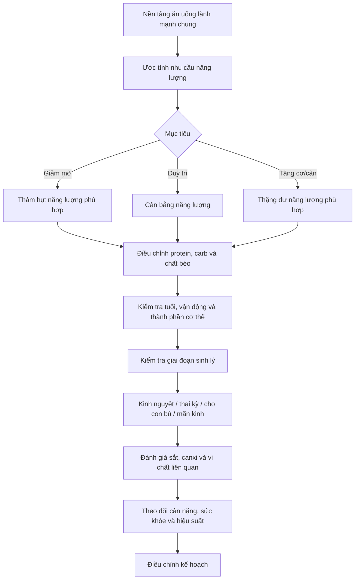

# 085 — Nam và nữ có nên áp dụng chế độ ăn khác nhau không?

| Thuộc tính       | Nội dung                                            |
| ---------------- | --------------------------------------------------- |
| **Module**       | Module 09 — More Dieting Tips & Strategies          |
| **Bài học**      | Should Women & Men Diet Differently?                |
| **Thời lượng**   | 03:15                                               |
| **Chủ đề chính** | Nam và nữ có nên áp dụng chế độ ăn khác nhau không? |

> **Kết luận trọng tâm:** Nam và nữ **không cần hai hệ thống ăn uống hoàn toàn khác nhau**. Nền tảng của một chế độ ăn lành mạnh gần như giống nhau, nhưng tổng năng lượng và một số vi chất cần được điều chỉnh theo **kích thước cơ thể, khối cơ, tuổi, mức vận động, chu kỳ kinh nguyệt, thai kỳ, cho con bú và mãn kinh**.

---

## Mục lục

1. [Mục tiêu bài học](#1-mục-tiêu-bài-học)
2. [Nội dung chính](#2-nội-dung-chính)
3. [Áp dụng thực tế](#3-áp-dụng-thực-tế)
4. [Lưu ý & lỗi thường gặp](#4-lưu-ý--lỗi-thường-gặp)
5. [Checklist thực hành](#5-checklist-thực-hành)
6. [Tóm tắt](#6-tóm-tắt)

---

## 1. Mục tiêu bài học

Sau bài học này, người học có thể:

* Hiểu những nguyên tắc dinh dưỡng chung cho cả nam và nữ.
* Giải thích vì sao nam giới thường có nhu cầu năng lượng tuyệt đối cao hơn nữ giới.
* Phân biệt sự khác nhau giữa nhu cầu **năng lượng**, **chất đa lượng** và **vi chất**.
* Nhận biết những khác biệt quan trọng liên quan đến sắt, canxi và selen.
* Tránh xây dựng chế độ ăn dựa hoàn toàn vào giới tính.
* Cá nhân hóa chế độ ăn theo cơ thể, mục tiêu và giai đoạn sinh lý.

---

## 2. Nội dung chính

### 2.1. Nền tảng ăn uống của nam và nữ gần như giống nhau

Một chế độ ăn lành mạnh cho cả nam và nữ nên dựa trên bốn nguyên tắc:

1. **Đầy đủ:** cung cấp đủ năng lượng, protein, chất béo, carbohydrate, vitamin và khoáng chất.
2. **Cân bằng:** năng lượng nạp vào phù hợp với năng lượng tiêu hao.
3. **Điều độ:** hạn chế thực phẩm chứa nhiều đường tự do, natri và chất béo không có lợi.
4. **Đa dạng:** sử dụng nhiều nhóm thực phẩm khác nhau.

WHO nhấn mạnh rằng chế độ ăn lành mạnh có thể có nhiều hình thức, nhưng nên ưu tiên thực phẩm ít chế biến như rau, trái cây, các loại đậu, ngũ cốc nguyên hạt, hạt và nguồn protein phù hợp; đồng thời hạn chế thực phẩm nhiều đường, natri, chất béo bão hòa và chất béo chuyển hóa.

Nam và nữ đều nên:

* Tôn trọng tín hiệu đói và no của cơ thể.
* Ăn đủ protein và chất xơ.
* Ưu tiên thực phẩm nguyên bản hoặc ít chế biến.
* Ăn rau và trái cây thường xuyên.
* Chọn ngũ cốc nguyên hạt thay cho phần lớn ngũ cốc tinh chế.
* Hạn chế chất béo chuyển hóa công nghiệp, đồ uống nhiều đường và thực phẩm siêu chế biến.

> Tín hiệu đói–no là một công cụ hữu ích nhưng không phải tiêu chí duy nhất. Giấc ngủ kém, căng thẳng, thuốc, bệnh lý hoặc chế độ ăn kiêng kéo dài đều có thể làm thay đổi cảm giác đói.

### Ảnh minh họa: một bữa ăn có đủ các nhóm thực phẩm


*Ảnh của Bộ Nông nghiệp Hoa Kỳ, mô tả một bữa ăn có ngũ cốc, thực phẩm giàu protein, sữa, rau và trái cây; ảnh thuộc phạm vi công cộng.*

---

### 2.2. Nhu cầu năng lượng có thể khác nhau

Nam giới thường cần nhiều năng lượng hơn nữ giới **ở mức trung bình quần thể**, chủ yếu vì nam giới thường:

* Có kích thước cơ thể lớn hơn.
* Có nhiều khối nạc và khối cơ hơn.
* Có mức chuyển hóa lúc nghỉ cao hơn khi các yếu tố khác tương đương.
* Tham gia nhiều hoạt động tiêu hao năng lượng hơn trong một số nhóm dân số.

Một nghiên cứu MRI trên 468 người trưởng thành ghi nhận khối cơ xương trung bình ở nam cao hơn nữ, cả về số kilogram lẫn tỷ lệ khối lượng cơ thể: khoảng **38,4% so với 30,6%** trong mẫu nghiên cứu. Tuy nhiên, đây là giá trị trung bình của một nhóm người, không phải tỷ lệ cố định áp dụng cho mọi nam và nữ.

#### Hai người cùng chiều cao và cân nặng vẫn có thể cần lượng calo khác nhau

Ví dụ:

* Người A có nhiều khối cơ hơn.
* Người B có tỷ lệ mỡ cơ thể cao hơn.
* Người A đi bộ 12.000 bước mỗi ngày.
* Người B làm việc ngồi nhiều.

Dù hai người cùng cân nặng, người A có thể tiêu hao năng lượng nhiều hơn đáng kể.

Do đó, **giới tính chỉ là một biến đầu vào**. Nhu cầu năng lượng thực tế còn phụ thuộc vào:

* Tuổi.
* Chiều cao và cân nặng.
* Thành phần cơ thể.
* Nghề nghiệp.
* Số bước đi hằng ngày.
* Loại hình và khối lượng tập luyện.
* Thai kỳ hoặc cho con bú.
* Mục tiêu tăng, giảm hay duy trì cân nặng.

WHO cũng lưu ý rằng cấu trúc chính xác của một chế độ ăn cần thay đổi theo tuổi, giới, lối sống, mức vận động, văn hóa và thực phẩm địa phương.

---

### 2.3. Nam giới không mặc định cần một tỷ lệ macro khác

Ba chất đa lượng chính gồm:

* **Protein**
* **Carbohydrate**
* **Chất béo**

Với người trưởng thành khỏe mạnh, phạm vi phân bố chất đa lượng thường được áp dụng giống nhau cho cả hai giới:

| Chất đa lượng | Phạm vi tham khảo theo tổng năng lượng |
| ------------- | -------------------------------------: |
| Carbohydrate  |                                 45–65% |
| Protein       |                                 10–35% |
| Chất béo      |                                 20–35% |

Các phạm vi này không khác nhau chỉ vì một người là nam hay nữ.

Tuy nhiên, **số gram tuyệt đối** có thể khác nhau.

Ví dụ, nếu hai người cùng sử dụng:

* 25% năng lượng từ protein;
* 30% từ chất béo;
* 45% từ carbohydrate;

thì người ăn 2.600 kcal sẽ nhận nhiều gram protein, chất béo và carbohydrate hơn người ăn 1.800 kcal.

```text
Tổng năng lượng cao hơn
          ↓
Cùng một tỷ lệ phần trăm macro
          ↓
Số gram protein, carbohydrate và chất béo cao hơn
```

Như vậy, việc nam giới thường ăn nhiều protein, carbohydrate và chất béo hơn chủ yếu đến từ:

* Cơ thể lớn hơn.
* Nhu cầu năng lượng cao hơn.
* Khối lượng tập luyện lớn hơn.

Không nên kết luận rằng nam giới luôn cần chế độ ăn nhiều protein hoặc ít carbohydrate hơn nữ giới chỉ vì giới tính.

---

### 2.4. Sự khác nhau đáng chú ý nằm ở một số vi chất

#### A. Sắt

Sắt cần thiết cho hemoglobin, quá trình vận chuyển oxy và nhiều phản ứng chuyển hóa.

Phụ nữ còn kinh nguyệt thường có nhu cầu sắt cao hơn nam giới do mất máu trong kỳ kinh. Nhu cầu tham khảo của NIH dành cho người trưởng thành như sau:

| Nhóm                         | Lượng sắt khuyến nghị |
| ---------------------------- | --------------------: |
| Nam 19–50 tuổi               |         **8 mg/ngày** |
| Nữ 19–50 tuổi                |        **18 mg/ngày** |
| Phụ nữ mang thai             |        **27 mg/ngày** |
| Phụ nữ cho con bú 19–50 tuổi |         **9 mg/ngày** |
| Nam và nữ từ 51 tuổi         |         **8 mg/ngày** |

> **Sửa lỗi trong bản ghi bài giảng:** nam giới cần khoảng **8 mg mỗi ngày**, không phải “8 mg mỗi phút”.

Thiếu sắt thường được ghi nhận nhiều hơn ở phụ nữ dưới 50 tuổi và phụ nữ mang thai. Tuy nhiên, không nên tự bổ sung liều cao chỉ dựa trên cảm giác mệt mỏi; xét nghiệm công thức máu và ferritin có thể cần thiết để đánh giá chính xác.

**Nguồn sắt trong thực phẩm:**

* Thịt, hải sản và nội tạng.
* Các loại đậu.
* Đậu phụ.
* Hạt bí và mè.
* Rau lá xanh đậm.
* Ngũ cốc được tăng cường sắt.

Sắt từ thực vật hấp thu kém hơn sắt heme trong thực phẩm động vật. Ăn thực phẩm giàu vitamin C cùng bữa có thể hỗ trợ hấp thu sắt không heme.

---

#### B. Canxi

Canxi quan trọng đối với:

* Cấu trúc xương và răng.
* Co cơ.
* Dẫn truyền thần kinh.
* Đông máu.
* Hoạt động của nhiều enzyme.

Nhu cầu canxi của nam và nữ giống nhau trong phần lớn giai đoạn trưởng thành, nhưng khác ở độ tuổi 51–70:

| Độ tuổi      |           Nam |                Nữ |
| ------------ | ------------: | ----------------: |
| 19–50 tuổi   | 1.000 mg/ngày |     1.000 mg/ngày |
| 51–70 tuổi   | 1.000 mg/ngày | **1.200 mg/ngày** |
| Trên 70 tuổi | 1.200 mg/ngày |     1.200 mg/ngày |

Sau mãn kinh, sự suy giảm estrogen làm giảm hấp thu canxi, tăng mất canxi qua nước tiểu và tăng quá trình tiêu xương. Vì vậy, phụ nữ sau mãn kinh là một trong những nhóm có nguy cơ không nhận đủ canxi.

### Ảnh nghiên cứu minh họa: cấu trúc xương bị loãng


*Hình minh họa cho thấy mật độ xương giảm và các khoang trong xương lớn hơn; ảnh được phát hành theo giấy phép CC BY-SA 4.0.*

**Nguồn canxi phổ biến:**

* Sữa và sữa chua.
* Phô mai.
* Cá nhỏ ăn cả xương.
* Đậu phụ kết tủa bằng canxi.
* Sữa thực vật được tăng cường canxi.
* Một số loại rau xanh.
* Thực phẩm được tăng cường canxi.

> Canxi là một phần của sức khỏe xương, nhưng không hoạt động độc lập. Vitamin D, protein, vận động chịu trọng lượng và tập sức mạnh cũng rất quan trọng.

---

#### C. Selen

Selen tham gia vào:

* Hoạt động chống oxy hóa.
* Chuyển hóa hormone tuyến giáp.
* Chức năng miễn dịch.
* Hoạt động của các selenoprotein.

Nhu cầu selen **không cao hơn ở nam giới**:

| Nhóm              | Lượng selen khuyến nghị |
| ----------------- | ----------------------: |
| Nam trưởng thành  |          **55 µg/ngày** |
| Nữ trưởng thành   |          **55 µg/ngày** |
| Phụ nữ mang thai  |              60 µg/ngày |
| Phụ nữ cho con bú |              70 µg/ngày |

Một số nghiên cứu quan sát trước đây từng tìm thấy mối liên hệ giữa tình trạng selen cao hơn và nguy cơ thấp hơn của một số bệnh ung thư. Tuy nhiên, các thử nghiệm ngẫu nhiên sau đó không chứng minh rằng bổ sung selen giúp phòng ung thư tuyến tiền liệt, ung thư phổi hoặc ung thư nói chung. Thử nghiệm SELECT trên hơn 35.000 nam giới không ghi nhận lợi ích phòng ung thư tuyến tiền liệt từ bổ sung 200 µg selen mỗi ngày.

> **Kết luận:** không nên coi selen liều cao là một chiến lược phòng ung thư dành cho nam giới.

Dùng quá nhiều selen trong thời gian dài có thể gây:

* Rụng tóc.
* Móng giòn hoặc rụng móng.
* Mùi hơi thở giống tỏi.
* Vị kim loại.
* Buồn nôn và tiêu chảy.
* Bất thường thần kinh.

Giới hạn trên được NIH sử dụng cho người trưởng thành là 400 µg/ngày từ thực phẩm và chất bổ sung cộng lại.

---

### 2.5. Thai kỳ, cho con bú và mãn kinh tạo ra khác biệt lớn hơn giới tính đơn thuần

Nhu cầu dinh dưỡng có thể thay đổi đáng kể trong các giai đoạn:

#### Thai kỳ

Có thể tăng nhu cầu đối với:

* Năng lượng trong một số tam cá nguyệt.
* Protein.
* Sắt.
* Folate.
* I-ốt.
* Choline và một số chất dinh dưỡng khác.

#### Cho con bú

Cơ thể cần thêm năng lượng và một số vi chất để hỗ trợ sản xuất sữa.

#### Mãn kinh

Cần chú ý hơn đến:

* Mật độ xương.
* Canxi và vitamin D.
* Protein.
* Tập sức mạnh.
* Nguy cơ tăng mỡ vùng bụng và giảm khối cơ theo tuổi.

Những giai đoạn này thường ảnh hưởng đến kế hoạch ăn uống nhiều hơn việc chỉ phân loại một người là nam hay nữ.

---

### 2.6. Mô hình cá nhân hóa chế độ ăn



---

### 2.7. Bảng tổng hợp nhanh

| Yếu tố                | Nam và nữ có khác nhau không? | Giải thích                                                              |
| --------------------- | ----------------------------- | ----------------------------------------------------------------------- |
| Chất lượng thực phẩm  | Gần như không                 | Cả hai đều nên ưu tiên thực phẩm giàu dinh dưỡng và ít chế biến         |
| Nguyên tắc giảm mỡ    | Không                         | Đều cần tạo thâm hụt năng lượng bền vững                                |
| Tổng lượng calo       | Thường có                     | Do kích thước cơ thể, khối nạc và vận động                              |
| Tỷ lệ macro           | Không nhất thiết              | Phạm vi tham khảo rộng tương tự nhau                                    |
| Số gram macro         | Có thể có                     | Người cần nhiều calo thường ăn nhiều gram hơn                           |
| Sắt                   | Có                            | Nữ còn kinh nguyệt thường cần nhiều hơn                                 |
| Canxi                 | Có ở một số độ tuổi           | Nữ 51–70 tuổi có mức khuyến nghị cao hơn nam cùng tuổi                  |
| Selen                 | Hầu như không                 | Nhu cầu cơ bản của người trưởng thành là như nhau                       |
| Thai kỳ và cho con bú | Có                            | Nhu cầu năng lượng và nhiều vi chất thay đổi                            |
| Chế độ ăn cá nhân     | Rất khác nhau                 | Mục tiêu, bệnh lý, vận động và sở thích thường quan trọng hơn giới tính |

---

## 3. Áp dụng thực tế

### 3.1. Bước 1 — Bắt đầu bằng mục tiêu

Xác định mục tiêu chính:

* Giảm mỡ.
* Duy trì cân nặng.
* Tăng cơ.
* Cải thiện sức khỏe.
* Hỗ trợ thành tích thể thao.
* Chuẩn bị hoặc hỗ trợ thai kỳ.
* Bảo vệ sức khỏe xương khi lớn tuổi.

Không nên bắt đầu bằng câu hỏi:

> “Tôi là nam hay nữ nên phải ăn theo chế độ nào?”

Nên bắt đầu bằng:

> “Cơ thể, mức vận động, sức khỏe và mục tiêu của tôi hiện tại là gì?”

---

### 3.2. Bước 2 — Ước tính năng lượng, sau đó kiểm chứng bằng thực tế

Công cụ tính calo chỉ cung cấp giá trị ước tính.

Sau khi áp dụng trong vài tuần, theo dõi:

* Cân nặng trung bình theo tuần.
* Số đo vòng eo.
* Hiệu suất tập luyện.
* Cảm giác đói.
* Mức năng lượng.
* Chất lượng giấc ngủ.
* Chu kỳ kinh nguyệt nếu có.
* Khả năng duy trì kế hoạch.

Nếu kết quả không đi đúng hướng, điều chỉnh lượng thức ăn thay vì cho rằng “cơ địa nam” hoặc “cơ địa nữ” là nguyên nhân duy nhất.

---

### 3.3. Bước 3 — Thiết lập chất đa lượng theo cùng một phương pháp

Một quy trình thực tế:

1. Chọn tổng năng lượng phù hợp.
2. Thiết lập đủ protein theo trọng lượng, vận động và mục tiêu.
3. Đảm bảo không cắt chất béo xuống mức quá thấp.
4. Phân bổ carbohydrate theo sở thích và nhu cầu vận động.
5. Điều chỉnh khẩu phần thay vì áp dụng tỷ lệ cứng nhắc.

Ví dụ:

* Một nữ vận động viên sức mạnh có thể cần nhiều protein và carbohydrate hơn một nam giới ít vận động.
* Một nam giới nhỏ con, làm việc văn phòng có thể cần ít calo hơn một nữ vận động viên có khối lượng tập luyện cao.
* Hai phụ nữ cùng tuổi có thể cần chế độ ăn rất khác nhau nếu một người mang thai còn người kia đang giảm mỡ.

---

### 3.4. Bước 4 — Kiểm tra vi chất theo giai đoạn sống

#### Đối với người còn kinh nguyệt

Chú ý:

* Lượng sắt trong khẩu phần.
* Mức độ ra máu kinh.
* Triệu chứng mệt, chóng mặt, khó thở khi vận động.
* Kết quả hemoglobin và ferritin khi có chỉ định.

#### Đối với phụ nữ sau mãn kinh

Chú ý:

* Canxi.
* Vitamin D.
* Protein.
* Tập sức mạnh.
* Vận động chịu trọng lượng.
* Đánh giá nguy cơ loãng xương.

#### Đối với nam giới

Không tự bổ sung:

* Sắt liều cao khi chưa có bằng chứng thiếu sắt.
* Selen liều cao với mục tiêu phòng ung thư.
* Canxi liều cao nếu khẩu phần đã cung cấp đủ.

---

### 3.5. Gợi ý cấu trúc một bữa ăn

Một bữa chính có thể gồm:

| Thành phần | Gợi ý                                                  |
| ---------- | ------------------------------------------------------ |
| ½ đĩa      | Rau và một phần trái cây                               |
| ¼ đĩa      | Nguồn protein                                          |
| ¼ đĩa      | Cơm, khoai hoặc ngũ cốc nguyên hạt                     |
| Thêm       | Chất béo phù hợp, nước và thực phẩm giàu canxi khi cần |

Khẩu phần cụ thể có thể lớn hoặc nhỏ hơn tùy tổng năng lượng của từng người.

---

## 4. Lưu ý & lỗi thường gặp

### Lỗi 1: Cho rằng nam giới luôn cần ăn nhiều hơn

Nam giới trung bình thường có nhu cầu cao hơn, nhưng không phải mọi nam giới đều cần nhiều calo hơn mọi phụ nữ.

Một phụ nữ:

* Cao hơn.
* Có nhiều khối cơ hơn.
* Tập luyện nhiều hơn.
* Có công việc vận động.

hoàn toàn có thể cần nhiều năng lượng hơn một nam giới nhỏ con và ít vận động.

---

### Lỗi 2: Dùng con số “40% cơ ở nam, 30% ở nữ” như quy luật tuyệt đối

Đây có thể là giá trị trung bình quan sát được trong một mẫu nghiên cứu, không phải tiêu chuẩn áp dụng cho từng cá nhân.

Tỷ lệ cơ còn phụ thuộc vào:

* Tuổi.
* Di truyền.
* Chiều cao.
* Mức tập luyện.
* Tình trạng dinh dưỡng.
* Bệnh lý.
* Phương pháp đo thành phần cơ thể.

---

### Lỗi 3: Cắt calo của nữ giới xuống quá thấp

Do nữ giới thường có tổng nhu cầu năng lượng thấp hơn, nhiều kế hoạch giảm cân có xu hướng cắt khẩu phần quá mạnh.

Hậu quả có thể gồm:

* Đói liên tục.
* Giảm hiệu suất tập luyện.
* Mất khối cơ.
* Thiếu vi chất.
* Khó duy trì.
* Rối loạn chu kỳ kinh nguyệt ở một số người.
* Tăng nguy cơ ăn bù hoặc bỏ cuộc.

Mục tiêu không phải là ăn ít nhất có thể, mà là sử dụng mức năng lượng **thấp vừa đủ để tạo tiến triển và vẫn duy trì được**.

---

### Lỗi 4: Mọi phụ nữ đều cần viên sắt

Phụ nữ có nhu cầu sắt trung bình cao hơn không đồng nghĩa với việc tất cả đều cần bổ sung.

Bổ sung sắt không cần thiết có thể gây:

* Táo bón.
* Buồn nôn.
* Đau bụng.
* Tương tác với thuốc.
* Nguy cơ tích lũy sắt ở người có rối loạn chuyển hóa sắt.

---

### Lỗi 5: Chỉ bổ sung canxi để phòng loãng xương

Sức khỏe xương còn phụ thuộc vào:

* Vitamin D.
* Protein.
* Hoạt động thể chất.
* Tập sức mạnh.
* Hút thuốc và rượu.
* Nội tiết tố.
* Thuốc đang sử dụng.
* Tuổi và tiền sử gia đình.

Bằng chứng về việc bổ sung canxi đơn độc để ngăn gãy xương ở mọi người lớn tuổi còn không đồng nhất; nên ưu tiên đáp ứng nhu cầu qua thực phẩm và cá nhân hóa việc sử dụng chất bổ sung.

---

### Lỗi 6: Bổ sung selen để phòng ung thư ở nam giới

Các thử nghiệm lâm sàng không cho thấy bổ sung selen giúp giảm nguy cơ ung thư tuyến tiền liệt hoặc ung thư nói chung ở người đã nhận đủ selen.

---

### Lỗi 7: Xây dựng “chế độ ăn dành cho nữ” hoặc “dành cho nam” quá cứng nhắc

Các nhãn này thường bỏ qua những yếu tố quan trọng hơn:

* Tổng năng lượng.
* Mục tiêu.
* Thành phần cơ thể.
* Tiền sử bệnh.
* Thuốc.
* Mức vận động.
* Sở thích.
* Khả năng chi trả.
* Văn hóa ăn uống.
* Khả năng duy trì lâu dài.

---

## 5. Checklist thực hành

### Nền tảng chung

* [ ] Tôi ăn đa dạng rau, trái cây, đậu, ngũ cốc và nguồn protein.
* [ ] Phần lớn thực phẩm của tôi là nguyên bản hoặc ít chế biến.
* [ ] Tôi hạn chế đồ uống nhiều đường và chất béo chuyển hóa.
* [ ] Tôi uống đủ nước.
* [ ] Tôi không phụ thuộc hoàn toàn vào thực phẩm chức năng.

### Năng lượng và macro

* [ ] Lượng calo được thiết lập theo cơ thể và mức vận động, không chỉ theo giới tính.
* [ ] Tôi nhận đủ protein.
* [ ] Tôi không cắt chất béo hoặc carbohydrate cực đoan khi không cần thiết.
* [ ] Tôi theo dõi xu hướng cân nặng trong nhiều tuần thay vì phản ứng với dao động hằng ngày.
* [ ] Tôi điều chỉnh khẩu phần dựa trên kết quả thực tế.

### Vi chất

* [ ] Nếu còn kinh nguyệt, tôi chú ý đến thực phẩm giàu sắt.
* [ ] Nếu nghi ngờ thiếu máu, tôi đi khám hoặc xét nghiệm thay vì tự dùng sắt liều cao.
* [ ] Nếu trên 50 tuổi, tôi chú ý đến canxi, vitamin D và sức khỏe xương.
* [ ] Tôi không sử dụng selen liều cao để phòng ung thư.
* [ ] Tôi kiểm tra khả năng tương tác giữa chất bổ sung và thuốc đang dùng.

### Khả năng duy trì

* [ ] Chế độ ăn phù hợp lịch sinh hoạt của tôi.
* [ ] Tôi không thường xuyên đói dữ dội hoặc kiệt sức.
* [ ] Hiệu suất làm việc và tập luyện vẫn ổn định.
* [ ] Kế hoạch không loại bỏ thực phẩm một cách không cần thiết.
* [ ] Tôi có thể duy trì kế hoạch trong nhiều tháng.

---

## 6. Tóm tắt

Nam và nữ nên tuân theo **cùng những nguyên tắc nền tảng** của một chế độ ăn lành mạnh:

* Đủ năng lượng và chất dinh dưỡng.
* Ưu tiên thực phẩm ít chế biến.
* Ăn đa dạng rau, trái cây, đậu, ngũ cốc nguyên hạt và protein.
* Hạn chế đường tự do, natri và chất béo không có lợi.

Sự khác biệt chính không phải là nam giới phải ăn một loại thực phẩm và nữ giới phải ăn một loại khác, mà nằm ở:

1. **Tổng năng lượng:** nam giới trung bình thường cần nhiều hơn do kích thước và khối nạc lớn hơn.
2. **Số gram chất đa lượng:** có thể cao hơn khi tổng năng lượng hoặc trọng lượng cơ thể cao hơn.
3. **Sắt:** phụ nữ còn kinh nguyệt thường cần nhiều hơn.
4. **Canxi:** phụ nữ 51–70 tuổi có mức khuyến nghị cao hơn nam giới cùng tuổi.
5. **Selen:** nhu cầu cơ bản của nam và nữ giống nhau; bổ sung liều cao không được chứng minh giúp phòng ung thư.
6. **Giai đoạn sinh lý:** thai kỳ, cho con bú và mãn kinh có thể tạo ra những thay đổi dinh dưỡng đáng kể.

> **Nguyên tắc cuối cùng:** hãy xây dựng chế độ ăn cho **một cá nhân cụ thể**, không chỉ cho một giới tính.

---

### Tài liệu tham khảo chính

* WHO — Healthy Diet.
* NIH Office of Dietary Supplements — Iron.
* NIH Office of Dietary Supplements — Calcium.
* NIH Office of Dietary Supplements — Selenium.
* Janssen và cộng sự — khác biệt khối cơ xương giữa nam và nữ.

> **Lưu ý:** Các giá trị RDA trong bài là mức tham khảo dành cho người khỏe mạnh và không thay thế đánh giá y khoa cá nhân.

---

# Bài luyện tập

## Mục tiêu


## Đề bài


## Yêu cầu hoàn thành

- [ ] 
- [ ] 
- [ ] 

## Kết quả / lời giải


## Ghi chú
